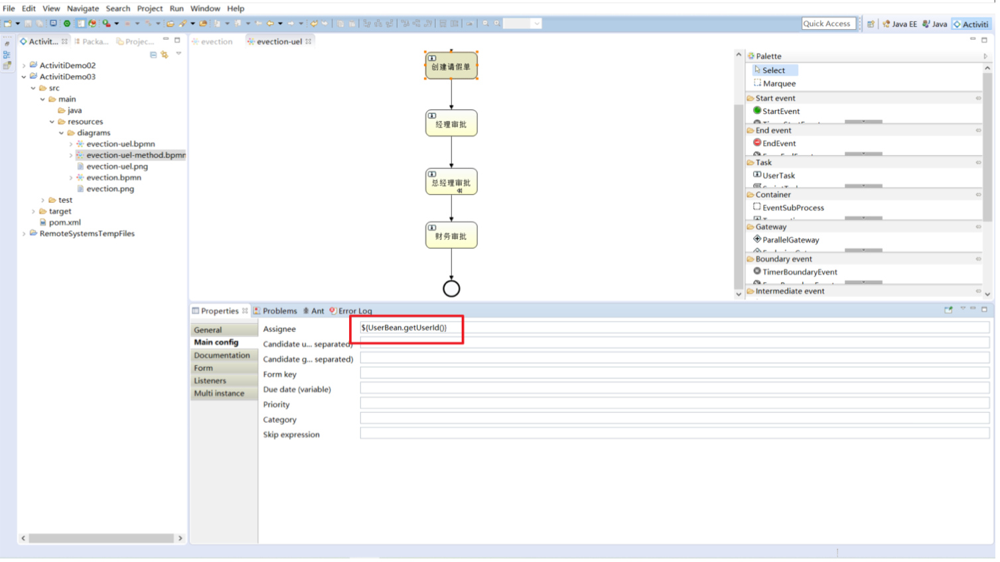

## Activiti

## 介绍

​	Alfresco软件在2010年5月17日宣布Activiti业务流程管理（BPM）开源项目的正式启动，其首席架构 师由业务流程管理BPM的专家 Tom Baeyens担任，Tom Baeyens就是原来jbpm的架构师，而jbpm是 一个非常有名的工作流引擎，当然activiti也是一个工作流引擎。

​	 Activiti是一个工作流引擎， activiti可以将业务系统中复杂的业务流程抽取出来，使用专门的建模语言 BPMN2.0进行定义，业务流程按照预先定义的流程进行执行，实现了系统的流程由activiti进行管理，减 少业务系统由于流程变更进行系统升级改造的工作量，从而提高系统的健壮性，同时也减少了系统开发 维护成本。 官方网站：https://www.activiti.org/

### BPM

​	BPM（Business Process Management），即业务流程管理，是一种规范化的构造端到端的业务流程， 以持续的提高组织业务效率。常见商业管理教育如EMBA、MBA等均将BPM包含在内。

### BPMN

​	BPMN（Business Process Model AndNotation）- 业务流程模型和符号 是由BPMI（BusinessProcess Management Initiative）开发的一套标准的业务流程建模符号，使用BPMN提供的符号可以创建业务流程。 

​	2004年5月发布了BPMN1.0规范.BPMI于2005年9月并入OMG（The Object Management Group对象 管理组织)组织。OMG于2011年1月发布BPMN2.0的最终版本。

#### Event 

用一个圆圈表示，它是流程中运行过程中发生的事情。


活动用圆角矩形表示，一个流程由一个活动或多个活动组成 Bpmn图形其实是通过xml表示业务流程，上边的.bpmn文件使用文本编辑器打开：


Bpmn图形其实是通过xml表示业务流程，上边的.bpmn文件使用文本编辑器打开：


## 使用步骤

### 部署activiti 

Activiti是一个工作流引擎（其实就是一堆jar包API），业务系统访问(操作)activiti的接口，就可以方便的 操作流程相关数据，这样就可以把工作流环境与业务系统的环境集成在一起。 

### 流程定义 

使用activiti流程建模工具(activity-designer)定义业务流程(.bpmn文件) 。 .bpmn文件就是业务流程定义文件，通过xml定义业务流程。                    

### 流程定义部署 

activiti部署业务流程定义（.bpmn文件）。 

使用activiti提供的api把流程定义内容存储起来，在Activiti执行过程中可以查询定义的内容 Activiti执行把流程定义内容存储在数据库中 

### 启动一个流程实例 

流程实例也叫：ProcessInstance 启动一个流程实例表示开始一次业务流程的运行。 在员工请假流程定义部署完成后，如果张三要请假就可以启动一个流程实例，如果李四要请假也启动一 个流程实例，两个流程的执行互相不影响。 

### 用户查询待办任务(Task) 

因为现在系统的业务流程已经交给activiti管理，通过activiti就可以查询当前流程执行到哪了，当前用户 需要办理什么任务了，这些activiti帮我们管理了，而不需要开发人员自己编写在sql语句查询。 

### 用户办理任务 

用户查询待办任务后，就可以办理某个任务，如果这个任务办理完成还需要其它用户办理，比如采购单 创建后由部门经理审核，这个过程也是由activiti帮我们完成了。 

### 流程结束 

当任务办理完成没有下一个任务结点了，这个流程实例就完成了。

## 基本使用

### 引入依赖

创建一个普通的Maven项目，并添加相关的依赖

```xml
<properties>
    <slf4j.version>1.6.6</slf4j.version>
    <log4j.version>1.2.12</log4j.version>
    <activiti.version>7.0.0.Beta1</activiti.version>
</properties>
<dependencies>
    <dependency>
        <groupId>org.activiti</groupId>
        <artifactId>activiti-engine</artifactId>
        <version>${activiti.version}</version>
    </dependency>
    <dependency>
        <groupId>org.activiti</groupId>
        <artifactId>activiti-spring</artifactId>
        <version>${activiti.version}</version>
    </dependency>
    <!-- bpmn 模型处理 -->
    <dependency>
        <groupId>org.activiti</groupId>
        <artifactId>activiti-bpmn-model</artifactId>
        <version>${activiti.version}</version>
    </dependency>
    <!-- bpmn 转换 -->
    <dependency>
        <groupId>org.activiti</groupId>
        <artifactId>activiti-bpmn-converter</artifactId>
        <version>${activiti.version}</version>
    </dependency>
    <!-- bpmn json数据转换 -->
    <dependency>
        <groupId>org.activiti</groupId>
        <artifactId>activiti-json-converter</artifactId>
        <version>${activiti.version}</version>
    </dependency>
    <!-- bpmn 布局 -->
    <dependency>
        <groupId>org.activiti</groupId>
        <artifactId>activiti-bpmn-layout</artifactId>
        <version>${activiti.version}</version>
        <exclusions>
            <exclusion>
                <groupId>com.github.jgraph</groupId>
                <artifactId>jgraphx</artifactId>
            </exclusion>
        </exclusions>
    </dependency>
    <!-- activiti 云支持 -->
    <dependency>
        <groupId>org.activiti.cloud</groupId>
        <artifactId>activiti-cloud-services-api</artifactId>
        <version>${activiti.version}</version>
    </dependency>
    <!-- mysql驱动 -->
    <dependency>
        <groupId>mysql</groupId>
        <artifactId>mysql-connector-java</artifactId>
         <version>8.0.24</version>
    </dependency>
    <!-- mybatis -->
    <dependency>
        <groupId>org.mybatis</groupId>
        <artifactId>mybatis</artifactId>
        <version>3.4.5</version>
    </dependency>
    <!-- 链接池 -->
    <dependency>
        <groupId>commons-dbcp</groupId>
        <artifactId>commons-dbcp</artifactId>
        <version>1.4</version>
    </dependency>
    <dependency>
        <groupId>junit</groupId>
        <artifactId>junit</artifactId>
        <version>4.12</version>
    </dependency>

    <dependency>
        <groupId>log4j</groupId>
        <artifactId>log4j</artifactId>
        <version>${log4j.version}</version>
    </dependency>
    <dependency>
        <groupId>org.slf4j</groupId>
        <artifactId>slf4j-api</artifactId>
        <version>${slf4j.version}</version>
    </dependency>
    <dependency>
        <groupId>org.slf4j</groupId>
        <artifactId>slf4j-log4j12</artifactId>
        <version>${slf4j.version}</version>
    </dependency>

</dependencies>
```

### 添加Activiti配置文件

在resources下创建activiti.cfg.xml文件，默认的方式的名称是不能修改的。

在配置文件中我们有两种配置方式：一种是单独配置数据源，另一种是不单独配置数据源

```xml
<?xml version="1.0" encoding="UTF-8"?>
<beans xmlns="http://www.springframework.org/schema/beans"
       xmlns:xsi="http://www.w3.org/2001/XMLSchema-instance"
       xsi:schemaLocation="http://www.springframework.org/schema/beans http://www.springframework.org/schema/beans/spring-beans.xsd">

    <bean class="org.activiti.engine.impl.cfg.StandaloneProcessEngineConfiguration" id="processEngineConfiguration">
        <property name="jdbcDriver" value="com.mysql.cj.jdbc.Driver"/>
        <property name="jdbcUrl" value="jdbc:mysql:///activiti?characterEncoding=utf-8&amp;nullCatalogMeansCurrent=true&amp;serverTimezone=UTC"
        />
        <property name="jdbcUsername" value="root" />
        <property name="jdbcPassword" value="root" />
        <property name="databaseSchemaUpdate" value="true" />
        <!--<property name="dataSource" ref="dataSource" />-->
    </bean>
    <!--
    <bean class="org.apache.commons.dbcp.BasicDataSource" id="dataSource">
        <property name="driverClassName" value="com.mysql.cj.jdbc.Driver" />
        <property name="url" value="jdbc:mysql:///activiti?characterEncoding=utf-8&amp;nullCatalogMeansCurrent=true&amp;serverTimezone=UTC"
        />
        <property name="username" value="root"/>
        <property name="password" value="root"/>
        <property name="maxActive" value="3" />
        <property name="maxIdle" value="2" />
    </bean>
	-->
</beans>
```

### Java程序生成表结构

创建一个工具类，调用Activiti的工具类来生成activiti需要的表结构

```java
/**
 * 生成Activiti的相关的表结构
 */
@Test
public void generate(){
    // 使用classpath下的activiti.cfg.xml中的配置来创建 ProcessEngine对象
    ProcessEngine engine = ProcessEngines.getDefaultProcessEngine();
    System.out.println(engine);
}


 /**
  * 自定义的方式来加载配置文件
  */
@Test
public void test02(){
    // 首先创建ProcessEngineConfiguration对象
    ProcessEngineConfiguration configuration =
        ProcessEngineConfiguration.createProcessEngineConfigurationFromResource("activi ti.cfg.xml");
    // 通过ProcessEngineConfiguration对象来创建 ProcessEngine对象
    ProcessEngine processEngine = configuration.buildProcessEngine();
}
```


一共生成25张表

### 表结构

Activiti的后台是有数据库的支持，所有的表都以ACT_开头。 

第二部分是表示表的用途的两个字母标识。 用途也和服务的API对应。

**ACT_RE_ ***: 'RE'表示repository。 这个前缀的表包含了流程定义和流程静态资源 （图片，规则，等等）。

**ACT_RU_ ***: 'RU'表示runtime。 这些运行时的表，包含流程实例，任务，变量，异步任务，等运行中的数据。 Activiti只在流程实例执行_过程中保存这些数据，在流程结束时就会删除这些记录。这样运行时表可以一直很小速度很快。

**ACT_HI_ ***: 'HI'表示history。 这些表包含历史数据，比如历史流程实例， 变量，任务等等。
**ACT_GE_ ***: 通用数据，用于不同场景下，如存放资源文件。

| 表分类         | 表名                  | 解释                                                |
| :------------- | --------------------- | --------------------------------------------------- |
| 一般数据GE     |                       |                                                     |
|                | [ACT_GE_BYTEARRAY]    | 通用的流程定义和流程资源                            |
|                | [ACT_GE_PROPERTY]     | 系统相关属性                                        |
| 流程历史记录HI |                       |                                                     |
|                | [ACT_HI_ACTINST]      | 历史的流程实例                                      |
|                | [ACT_HI_ATTACHMENT]   | 历史的流程附件                                      |
|                | [ACT_HI_COMMENT]      | 历史的说明性信息                                    |
|                | [ACT_HI_DETAIL]       | 历史的流程运行中的细节信息                          |
|                | [ACT_HI_IDENTITYLINK] | 历史的流程运行过程中用户关系                        |
|                | [ACT_HI_PROCINST]     | 历史的流程实例                                      |
|                | [ACT_HI_TASKINST]     | 历史的任务实例                                      |
|                | [ACT_HI_VARINST]      | 历史的流程运行中的变量信息                          |
| 流程定义表RE   |                       |                                                     |
|                | [ACT_RE_DEPLOYMENT]   | 部署单元信息                                        |
|                | [ACT_RE_MODEL]        | 模型信息                                            |
|                | [ACT_RE_PROCDEF]      | 已部署的流程定义                                    |
| 运行实例表RU   |                       |                                                     |
|                | [ACT_RU_EVENT_SUBSCR] | 运行时事件                                          |
|                | [ACT_RU_EXECUTION]    | 运行时流程执行实例                                  |
|                | [ACT_RU_IDENTITYLINK] | 运行时用户关系信息，存储任务节点与参与者的相 关信息 |
|                | [ACT_RU_JOB]          | 运行时作业                                          |
|                | [ACT_RU_TASK]         | 运行时任务                                          |
|                | [ACT_RU_VARIABLE]     | 运行时变量表                                        |

## 核心Service接口

```java
public interface ProcessEngine {
    String VERSION = "7.0.0.0";

    String getName();

    void close();

    RepositoryService getRepositoryService();

    RuntimeService getRuntimeService();

    TaskService getTaskService();

    HistoryService getHistoryService();

    ManagementService getManagementService();

    DynamicBpmnService getDynamicBpmnService();

    ProcessEngineConfiguration getProcessEngineConfiguration();
}
```

**RepositoryService**

activiti的资源管理类，提供了管理和控制流程发布包和流程定义的操作。使用工作流建模工具设计的 业务流程图需要使用此service将流程定义文件的内容部署到计算机。

除了部署流程定义以外还可以：查询引擎中的发布包和流程定义。

暂停或激活发布包，对应全部和特定流程定义。

暂停意味着它们不能再执行任何操作了，激活是对应的 反向操作。获得多种资源，像是包含在发布包里的文件， 或引擎自动生成的流程图。 获得流程定义的pojo版本， 可以用来通过java解析流程，而不必通过xml。 

**RuntimeService** 

Activiti的流程运行管理类。可以从这个服务类中获取很多关于流程执行相关的信息 TaskService Activiti的任务管理类。可以从这个类中获取任务的信息。 

**HistoryService** 

Activiti的历史管理类，可以查询历史信息，执行流程时，引擎会保存很多数据（根据配置），比如流程 实例启动时间，任务的参与者，完成任务的时间，每个流程实例的执行路径，等等。 这个服务主要通过查询功能来获得这些数据。

**ManagementService** 

Activiti的引擎管理类，提供了对 Activiti 流程引擎的管理和维护功能，这些功能不在工作流驱动的应用 程序中使用，主要用于 Activiti 系统的日常维护。

## 工作流程绘制

使用的Eclipse集成Activiti插件


勾选自动生成图片


创建项目


右键diagrams->new -> other


指定流程的主键，选中空白的地方

 

指定任务的负责人 点击创建请假单 在Properties视图中指定每个任务节点的负责人：


经理审批：lisi

总经理审批：wangwu

财务审批：zhaoliu

自动生成了png文件


也可以使用idea插件actiBPMN


### 图标介绍

**流程符号**

​	BPMN2.0是业务流程建模符号2.0的缩写。它由Business Process Management Initiative这个非营利协会创建并不断发展。作为一种标识，BPMN 2.0是使用一些符号来明确业务流程设计流程图的一整套符号规范，它能增进业务建模时的沟通效率。 

​	目前BPMN2.0是最新的版本，它用于在BPM上下文中进行布局和可视化的沟通。接下来我们先来了解在流程设计中常见的符号。BPMN2.0的基本符合主要包含： 

**事件 Event** 


**活动 Activity** 

活动是工作或任务的一个通用术语。一个活动可以是一个任务，还可以是一个当前流程的子处理流程； 其次，你还可以为活动指定不同的类型。常见活动如下： 


**网关 GateWay** 

网关用来处理决策，有几种常用网关需要了解： 


**排他网关(x)** 

——只有一条路径会被选择。流程执行到该网关时，按照输出流的顺序逐个计算，当条件的计算结果为 true时，继续执行当前网关的输出流； 如果多条线路计算结果都是 true，则会执行第一个值为 true 的线路。如果所有网关计算结果没有 true，则引擎会抛出异常。 排他网关需要和条件顺序流结合使用，default 属性指定默认顺序流，当所有的条件不满足时会执行默 认顺序流。 

**并行网关(+)** 

——所有路径会被同时选择 拆分 —— 并行执行所有输出顺序流，为每一条顺序流创建一个并行执行线路。 合并 —— 所有从并行网关拆分并执行完成的线路均在此等候，直到所有的线路都执行完成才继续向下 执行。 

**包容网关(+)** 

—— 可以同时执行多条线路，也可以在网关上设置条件 拆分 —— 计算每条线路上的表达式，当表达式计算结果为true时，创建一个并行线路并继续执行 合并 —— 所有从并行网关拆分并执行完成的线路均在此等候，直到所有的线路都执行完成才继续向下 执行。 

**事件网关(+)** 

—— 专门为中间捕获事件设置的，允许设置多个输出流指向多个不同的中间捕获事件。当流程执行到事 件网关后，流程处于等待状态，需要等待抛出事件才能将等待状态转换为活动状态。

**流向 Flow**

流是连接两个流程节点的连线。常见的流向包含以下几种： 


流程设计器使用 

**Palette（画板）** 

Connection—连接 

Event---事件 

Task---任务 

Gateway---网关 

Container—容器 

Boundary event—边界事件 

Intermediate event- -中间事件

## Activiti流程操作

### 部署文件

**单个文件部署**

```java
/**
 * 实现文件的单个部署
 */
@Test
public void test03(){
    // 1.获取ProcessEngine对象
            ProcessEngine engine = ProcessEngines.getDefaultProcessEngine();
    // 2.获取RepositoryService进行部署操作
            RepositoryService service = engine.getRepositoryService();
    // 3.使用RepositoryService进行部署操作
            Deployment deploy = service.createDeployment()
                    .addClasspathResource("bpmn/MyDiagrams.bpmn") // 添加bpmn资源
                    .addClasspathResource("bpmn/MyDiagrams.png") // 添加png资源
                    .name("请假申请流程")
                    .deploy();// 部署流程
    // 4.输出流程部署的信息
    System.out.println("流程部署的id:" + deploy.getId());
    System.out.println("流程部署的名称：" + deploy.getName());
}
```

**Zip包部署**

将bpmn文件和png文件两个打包为一个zip文件，统一上传

```java
/**
 * 通过一个zip文件来部署操作
 */
@Test
public void test04(){
    // 定义zip文件的输入流
    InputStream inputStream =
            this.getClass().getClassLoader().getResourceAsStream("bpmn/evection.zip");
    // 对 inputStream 做装饰
    ZipInputStream zipInputStream = new ZipInputStream(inputStream);
    ProcessEngine engine = ProcessEngines.getDefaultProcessEngine();
    RepositoryService repositoryService = engine.getRepositoryService();
    Deployment deploy = repositoryService.createDeployment()
            .addZipInputStream(zipInputStream)
            .name("请假申请流程")
            .deploy();
    // 4.输出流程部署的信息
    System.out.println("流程部署的id:" + deploy.getId());
    System.out.println("流程部署的名称：" + deploy.getName());
}
```

数据库中

流程定义部署后操作activiti中的三张表 

act_re_deployment: 流程定义部署表，每部署一次就增加一条记录


act_re_procdef ：流程定义表，部署每个新的流程定义都会在这张表中增加一条记录


act_ge_bytearray ：流程资源表，流程部署的 bpmn文件和png图片会保存在该表中


### 启动流程实例

流程定义部署在Activiti后就可以通过工作流管理业务流程，也就是说上边部署的出差申请流程可以使用了。 

针对该流程，启动一个流程表示发起一个新的请假申请单，这就相当于Java类和Java对象的关系，类定义好了后需要new创建一个对象使用，当然可以new出多个对象来，对于请假申请流程，张三可以发起一个请假申请单需要启动一个流程实例。

```java
/**
 * 启动一个流程实例
 */
@Test
public void test05(){
    // 1.创建ProcessEngine对象
    ProcessEngine engine = ProcessEngines.getDefaultProcessEngine();
    // 2.获取RuntimeService对象
    RuntimeService runtimeService = engine.getRuntimeService();
    // 3.根据流程定义的id启动流程
    String id= "leave";
    ProcessInstance processInstance =
            runtimeService.startProcessInstanceByKey(id);
    // 4.输出相关的流程实例信息
    System.out.println("流程定义的ID：" +
            processInstance.getProcessDefinitionId());
    System.out.println("流程实例的ID：" + processInstance.getId());
    System.out.println("当前活动的ID：" + processInstance.getActivityId());
}
```


启动流程实例涉及到的表结构 

act_hi_actinst 流程实例执行历史 

act_hi_identitylink 流程的参与用户的历史信息 

act_hi_procinst 流程实例历史信息 

act_hi_taskinst 流程任务历史信息 

act_ru_execution 流程执行信息 

act_ru_identitylink 流程的参与用户信息 

act_ru_task 任务信息

### 任务查询

流程启动后，任务的负责人就可以查询自己当前能够处理的任务了，查询出来的任务都是当前用户的待办任务

```java
/**
 * 任务查询
 */
@Test
public void test06(){
    String assignee ="zhangsan";
    ProcessEngine engine = ProcessEngines.getDefaultProcessEngine();
    // 任务查询 需要获取一个 TaskService 对象
    TaskService taskService = engine.getTaskService();
    // 根据流程的key和任务负责人 查询任务
    List<Task> list = taskService.createTaskQuery()
            .processDefinitionKey("leave")
            .taskAssignee(assignee)
            .list();
    // 输出当前用户具有的任务
    for (Task task : list) {
        System.out.println("流程实例id：" + task.getProcessInstanceId());
        System.out.println("任务id:" + task.getId());
        System.out.println("任务负责人：" + task.getAssignee());
        System.out.println("任务名称：" + task.getName());
    }
}
```


### 任务流程处理

任务负责人查询出来了待办的人，选择任务进行处理，完成任务

```java
/**
 * 流程任务的处理
 */
@Test
public void test07(){
    ProcessEngine engine = ProcessEngines.getDefaultProcessEngine();
    TaskService taskService = engine.getTaskService();
    Task task = taskService.createTaskQuery()
            .processDefinitionKey("leave")
            .taskAssignee("zhangsan")
            .singleResult();
    // 完成任务
    taskService.complete(task.getId());
}
```

完成任务后lisi就能查询到任务

### 流程定义查询

查询流程相关的信息，包括流程的定义，流程的部署，流程定义的版本

```java
/**
 * 查询流程的定义
 */
@Test
public void test08() {
    ProcessEngine engine = ProcessEngines.getDefaultProcessEngine();
    RepositoryService repositoryService = engine.getRepositoryService();
    // 获取一个 ProcessDefinitionQuery对象 用来查询操作
    ProcessDefinitionQuery processDefinitionQuery =
            repositoryService.createProcessDefinitionQuery();
    List<ProcessDefinition> list =
            processDefinitionQuery.processDefinitionKey("leave")
                    .orderByProcessDefinitionVersion() // 安装版本排序
                    .desc() // 倒序
                    .list();
    // 输出流程定义的信息
    for (ProcessDefinition processDefinition : list) {
        System.out.println("流程定义的ID：" + processDefinition.getId());
        System.out.println("流程定义的name：" + processDefinition.getName());
        System.out.println("流程定义的key:" + processDefinition.getKey());
        System.out.println("流程定义的version:" +
                processDefinition.getVersion());
        System.out.println("流程部署的id:" +
                processDefinition.getDeploymentId());
    }
}
```


### 流程的删除

```java
/**
 * 删除流程
 */
@Test
public void test09(){
    ProcessEngine engine = ProcessEngines.getDefaultProcessEngine();
    RepositoryService repositoryService = engine.getRepositoryService();
    // 删除流程定义，如果该流程定义已经有了流程实例启动则删除时报错
    // act_re_deployment表中的id
    repositoryService.deleteDeployment("1");
    // 设置为TRUE 级联删除流程定义，及时流程有实例启动，也可以删除，设置为false 非级联删除操作。
    //repositoryService.deleteDeployment("1",true);
}
```

### 流程资源下载

从数据库中把 这些资源下载到本地。

使用activiti的api来操作我们需要添加commons-io的依赖

```xml
<dependency>
        <groupId>commons-io</groupId>
        <artifactId>commons-io</artifactId>
        <version>2.6</version>
</dependency>
```

```java
/**
 * 读取数据库中的资源文件
 */
@Test
public void test10() throws Exception{
    // 1.得到ProcessEngine对象
    ProcessEngine engine = ProcessEngines.getDefaultProcessEngine();
    // 2.获取RepositoryService对象
    RepositoryService repositoryService = engine.getRepositoryService();
    // 3.得到查询器
    ProcessDefinition definition =
            repositoryService.createProcessDefinitionQuery()
                    .processDefinitionKey("leave")
                    .singleResult();
    // 4.获取流程部署的id
    String deploymentId = definition.getDeploymentId();
    // 5.通过repositoryService对象的相关方法 来获取图片信息和bpmn信息
    // png图片
    InputStream pngInput = repositoryService
            .getResourceAsStream(deploymentId,
                    definition.getDiagramResourceName());
    // bpmn 文件的流
    InputStream bpmnInput = repositoryService
            .getResourceAsStream(deploymentId,
                    definition.getResourceName());
    // 6.文件的保存
    File filePng = new File("d:/leave.png");
    File fileBpmn = new File("d:/leave.bpmn");
    OutputStream pngOut = new FileOutputStream(filePng);
    OutputStream bpmnOut = new FileOutputStream(fileBpmn);
    IOUtils.copy(pngInput,pngOut);
    IOUtils.copy(bpmnInput,bpmnOut);
    pngInput.close();
    pngOut.close();
    bpmnInput.close();
    bpmnOut.close();
}
```


### 流程历史信息的查看

查看被删除的历史信息


```java
/**
 * 流程历史信息查看
 */
@Test
public void test11(){
    ProcessEngine engine = ProcessEngines.getDefaultProcessEngine();
    // 查看历史信息我们需要通过 HistoryService来实现
    HistoryService historyService = engine.getHistoryService();
    // 获取 actinst 表的查询对象
    HistoricActivityInstanceQuery instanceQuery =
            historyService.createHistoricActivityInstanceQuery();
    instanceQuery.processDefinitionId("leave:1:5004");
    instanceQuery.orderByHistoricActivityInstanceStartTime().desc();
    List<HistoricActivityInstance> list = instanceQuery.list();
    // 输出查询的结果
    for (HistoricActivityInstance hi : list) {
        System.out.println(hi.getActivityId());
        System.out.println(hi.getActivityName());
        System.out.println(hi.getActivityType());
        System.out.println(hi.getAssignee());
        System.out.println(hi.getProcessDefinitionId());
        System.out.println(hi.getProcessInstanceId());
        System.out.println("-----------------------");
    }
}
```


## 流程实例

流程实例(ProcessInstance)代表流程定义的执行过程 一个流程实例包括了所有的运行节点，我们可以利用这个对象来了解当前流程实例的进度等信息 

例如:用户或者程序安装流程定义的内容发起了一个流程，这个就是一个流程实例


## 业务管理

activiti中预留了一个字段，BusinessKey专门用来保存业务记录的主键

流程定义部署在Activiti后，我们就可以在系统中通过Activiti去管理流程的执行，我们需要将流程实例和业务数据关联，这时我们需要使用到Activiti中预留的BusinessKey(业务标识)来关联

ACT_RU_EXECUTION 表中的BusinessKey字段


```java
/**
 * 启动流程实例，添加businessKey
 */
@Test
public void test01(){
    // 1.获取ProcessEngine对象
    ProcessEngine processEngine = ProcessEngines.getDefaultProcessEngine();
    // 2.获取RuntimeService对象
    RuntimeService runtimeService = processEngine.getRuntimeService();
    // 3.启动流程实例
    ProcessInstance instance = runtimeService
            .startProcessInstanceByKey("leave", "1001");
    // 4.输出processInstance相关属性
    System.out.println("businessKey = "+instance.getBusinessKey());
}
```


## 流程实例的挂起和激活

在实际场景中可能由于流程变更需要将当前运行的流程暂停而不是删除，流程暂停后将不能继续执行。

### 全部流程挂起

**挂起的是流程定义**

操作流程的定义为挂起状态，该流程定义下边所有的流程实例全部暂停。

流程定义为挂起状态，该流程定义将不允许启动新的流程实例，同时该流程定义下的所有的流程实例都
将全部挂起暂停执行。

```java
/**
 * 全部流程挂起实例与激活
 */
@Test
public void test02() {
    // 1.获取ProcessEngine对象
    ProcessEngine engine = ProcessEngines.getDefaultProcessEngine();
    // 2.获取RepositoryService对象
    RepositoryService repositoryService = engine.getRepositoryService();
    // 3.查询流程定义的对象
    ProcessDefinition processDefinition = repositoryService.createProcessDefinitionQuery()
            .processDefinitionKey("leave")
            .singleResult();
    // 4.获取当前流程定义的状态
    boolean suspended = processDefinition.isSuspended();
    String id = processDefinition.getId();
    // 5.如果挂起就激活，如果激活就挂起
    if (suspended) {
        // 表示当前定义的流程状态是 挂起的 流程定义的id 、是否激活 、激活时间
        repositoryService.activateProcessDefinitionById(
                id, true // 是否激活
                , null // 激活时间
        );
        System.out.println("流程定义:" + id + ",已激活");
    } else {
        // 非挂起状态，激活状态 那么需要挂起流程定义
        repositoryService.suspendProcessDefinitionById(
                id // 流程id
                , true // 是否挂起
                , null // 挂起时间
        );
        System.out.println("流程定义:" + id + ",已挂起");
    }
}
```


再将挂起的流程转变为激活状态，对于的状态值会从2更新为1


### 单个流程挂起

**挂起的单个流程实例对象**

当前流程定义的其他流程实例之间互不干扰。


```java
/**
 * 单个流程实例挂起与激活
 */
@Test
public void test03() {
    // 1.获取ProcessEngine对象
    ProcessEngine engine = ProcessEngines.getDefaultProcessEngine(); 
    // 2.获取RuntimeService
    RuntimeService runtimeService = engine.getRuntimeService();
    // 3.获取流程实例对象
    ProcessInstance processInstance =
            runtimeService.createProcessInstanceQuery()
                    .processInstanceId("5001")// 
                    .singleResult();
    // 4.获取相关的状态操作
    boolean suspended = processInstance.isSuspended();
    String id = processInstance.getId();
    if (suspended) {
        // 挂起--》激活
        runtimeService.activateProcessInstanceById(id);
        System.out.println("流程定义:" + id + "，已激活");
    } else {
        // 激活--》挂起
        runtimeService.suspendProcessInstanceById(id);
        System.out.println("流程定义:" + id + "，已挂起");
    }
}
```


## 个人任务的分配

分配任务责任人

### 固定分配 

在进行业务流程建模的时候指定固定的任务负责人:

之前的在eclipse中绘图那种方式

### 表达式分配

在Activiti中支持使用UEL表达式，UEL表达式是Java EE6 规范的一部分， UEL(Unified Expression Language) 即 统一表达式语音， Activiti支持两种UEL表达式: UEL-value 和UEL-method

**UEL-value** 


```java
/**
 * 先将新定义的流程部署到Activiti中数据库中
 */
@Test
public void test01() {
    // 1.获取ProcessEngine对象
    ProcessEngine engine = ProcessEngines.getDefaultProcessEngine();
    // 2.获取RepositoryService进行部署操作
    RepositoryService service = engine.getRepositoryService();
    // 3.使用RepositoryService进行部署操作
    Deployment deploy = service.createDeployment()
            .addClasspathResource("bpmn/evection-uel.bpmn") // 添加bpmn资源
            .addClasspathResource("bpmn/evection-uel.png") // 添加png资源
            .name("出差申请流程-UEL")
            .deploy();// 部署流程
    // 4.输出流程部署的信息
    System.out.println("流程部署的id:" + deploy.getId());
    System.out.println("流程部署的名称:" + deploy.getName());
}
```


关联UEL表达式

```java
/**
 * 创建一个流程实例
 * 给流程定义中的 UEL表达式赋值 */
@Test
public void test02(){
    // 获取流程引擎
    ProcessEngine processEngine = ProcessEngines.getDefaultProcessEngine(); // 获取RuntimeService对象
    RuntimeService runtimeService = processEngine.getRuntimeService();
    // 设置 assignee 的取值，
    Map<String,Object> map = new HashMap<String,Object>();
    // 对uel表达式进行赋值处理
    map.put("assignee0","张三");
    map.put("assignee1","李四");
    map.put("assignee2","王五");
    map.put("assignee3","赵财务");
    // 创建流程实例
    runtimeService.startProcessInstanceByKey("evection-uel",map);
}
```


**UEL-method**



userBean 是 spring 容器中的一个 bean(activiti 集成的spring)，表示调用该 bean 的 getUserId()方法。

**UEL-method** **与** **UEL-value** **结合**

比如:

${ldapService.findManagerForEmployee(emp)}
 ldapService 是 spring 容器的一个 bean，findManagerForEmployee 是该 bean 的一个方法，emp 是 activiti
 流程变量， emp 作为参数传到 ldapService.findManagerForEmployee 方法中。

**其它**

表达式支持解析基础类型、 bean、 list、 array 和 map，也可作为条件判断。 如下:
 ${order.price > 100 && order.price < 250}

### 监听器分配

可以使用监听器来完成很多Activiti的流程业务。

我们在此处使用监听器来完成负责人的指定，那么我们在流程设计的时候就不需要指定assignee 

**Event选项**


create:任务创建后触发 

assignment:任务分配后触发 

Delete:任务完成后触发 

All:所有事件都触发

**自定义的监听器**

创建listener

```java
import org.activiti.engine.delegate.DelegateTask;
import org.activiti.engine.delegate.TaskListener;

public class MyTaskListener implements TaskListener {
    public void notify(DelegateTask delegateTask) {
        if ("创建请假单".equals(delegateTask.getName())
                && "create".equals(delegateTask.getEventName())) {
            // 指定任务的负责人
            delegateTask.setAssignee("张三-Listener");
        }
    }
}
```

```java
    /**
     * 创建一个流程实例
     * 给流程定义中的 UEL表达式赋值 */
    @Test
    public void test02(){ // 获取流程引擎
        ProcessEngine processEngine = ProcessEngines.getDefaultProcessEngine(); 
        // 获取RuntimeService对象
        RuntimeService runtimeService = processEngine.getRuntimeService();
        // 创建流程实例
        runtimeService.startProcessInstanceByKey("evection-listener");
    }
}
```

## 流程变量

流程变量在 activiti 中是一个非常重要的角色，流程运转有时需要靠流程变量，业务系统和 activiti 结合时少不了流程变量，流程变量就是 activiti 在管理工作流时根据管理需要而设置的变量。 

比如:在出差申请流程流转时如果出差天数大于 3 天则由总经理审核，否则由人事直接审核， 出差天数就可以设置为流程变量，在流程流转时使用。

**注意:虽然流程变量中可以存储业务数据可以通过activiti的api查询流程变量从而实现 查询业务数据， 但是不建议这样使用，因为业务数据查询由业务系统负责，activit设置流程变量是为了流程执行需要而 创建。**

### 流程变量类型

如果将 pojo 存储到流程变量中，必须实现序列化接口 serializable，为了防止由于新增字段无 法反序列化，需要生成 serialVersionUID。

### 流程变量作用域

流程变量的作用域可以是一个流程实例(processInstance)，或一个任务(task)，或一个执行实例(execution)

**global变量**

流程变量的默认作用域是流程实例。当一个流程变量的作用域为流程实例时，可以称为 global 变量 

注意:
如: Global变量:userId(变量名)、zhangsan(变量值)
global 变量中变量名不允许重复，设置相同名称的变量，后设置的值会覆盖前设置的变量值。

**local变量**

任务和执行实例仅仅是针对一个任务和一个执行实例范围，范围没有流程实例大， 称为 local 变量。

Local 变量由于在不同的任务或不同的执行实例中，作用域互不影响，变量名可以相同没有影响。Local 变量名也可以和 global 变量名相同，没有影响。


### 流程变量的使用方法

**在属性上使用UEL表达式**

可以在 assignee 处设置 UEL 表达式，表达式的值为任务的负责人，比如: ${assignee}， assignee 就 是一个流程变量名称。

Activiti获取UEL表达式的值，即流程变量assignee的值 ，将assignee的值作为任务的负责人进行任务分配

**在连线上使用UEL表达式**

可以在连线上设置UEL表达式，决定流程走向。

比如:${price<10000} 。price就是一个流程变量名称，uel表达式结果类型为布尔类型。 如果UEL表达式是true，要决定 流程执行走向。

### 流程变量的使用

需求

员工创建出差申请单，由部门经理审核，部门经理申请通过后3天以下由财务直接申批，3天以上先由 总经理审批，总经理审批通过后再由财务审批。


**流程定义**

先通过UEL-value来设置负责人


然后在分支线上来设置条件


还可以通过对象参数命名，比如 evection.num:


**接下来使用Global变量控制流程**

首先创建POJO对象

```java
package pojo;

import lombok.Data;

import java.io.Serializable;
import java.util.Date;

/**
 * 出差申请的POJO对象
 */
@Data
public class Evection implements Serializable {

    private long id;

    private String evectionName;


    /**
     * 出差的天数
     */
    private double num;

    private Date beginDate;

    private Date endDate;

    private String destination;

    private String reson;
}
```

**流程部署**

```java
/**
 * 部署流程
 */
@Test
public void test01(){
    // 1.获取ProcessEngine对象
    ProcessEngine engine = ProcessEngines.getDefaultProcessEngine();
    // 2.获取RepositoryService进行部署操作
    RepositoryService service = engine.getRepositoryService();
    // 3.使用RepositoryService进行部署操作
    Deployment deploy = service.createDeployment()
            .addClasspathResource("bpmn/evection-variable.bpmn") // 添加bpmn资源
            .addClasspathResource("bpmn/evection-variable.png") // 添加png资源
            .name("出差申请流程-流程变量")
            .deploy();// 部署流程
    // 4.输出流程部署的信息
    System.out.println("流程部署的id:" + deploy.getId());
    System.out.println("流程部署的名称：" + deploy.getName());
}
```

#### **设置流程变量**

**启动时设置流程变量**

```java
/**
 * 启动流程实例，设置流程变量
 */
@Test
public void test02(){
    ProcessEngine engine = ProcessEngines.getDefaultProcessEngine();
    RuntimeService runtimeService = engine.getRuntimeService();
    // 流程定义key
    String key = "evection-variable";
    // 创建变量集合
    Map<String,Object> variables = new HashMap<>();
    // 创建出差对象 POJO
    Evection evection = new Evection();
    // 设置出差天数
    evection.setNum(4d);
    // 定义流程变量到集合中
    variables.put("evection",evection);
    // 设置assignee的取值
    variables.put("assignee0","张三1");
    variables.put("assignee1","李四1");
    variables.put("assignee2","王五1");
    variables.put("assignee3","赵财务1");
    ProcessInstance processInstance = runtimeService.startProcessInstanceByKey(key, variables);
    // 输出信息
    System.out.println("获取流程实例名称："+processInstance.getName());
    System.out.println("流程定义ID：" + processInstance.getProcessDefinitionId());
}
```


**完成任务**

```java
/**
 * 完成任务
 */
@Test
public void test03(){
    String key = "evection-variable";
    String assignee = "李四1";
    ProcessEngine engine = ProcessEngines.getDefaultProcessEngine();
    TaskService taskService = engine.getTaskService();
    Task task = taskService.createTaskQuery()
            .processDefinitionKey(key)
            .taskAssignee(assignee)
            .singleResult();
    if(task != null){
        taskService.complete(task.getId());
        System.out.println("任务执行完成...");
    }
}
```

通过startProcessInstanceByKey方法设置流程变量的作用域是一个流程实例，流程变量使用Map存储， 同一个流程实例map中的key相同，后者会覆盖前者

**任务办理时设置**

在完成任务时设置流程变量，该流程变量只有在该任务完成后其它结点才可使用该变量，它的作用域 是整个流程实例，如果设置的流程变量的key在流程实例中已存在相同的名字则后设置的变量替换前边设 置的变量。

这里需要在创建出差单任务完成时设置流程变量

```java
/**
 * 启动流程实例，设置流程变量
 */
@Test
public void test02(){
    ProcessEngine engine = ProcessEngines.getDefaultProcessEngine();
    RuntimeService runtimeService = engine.getRuntimeService();
    // 流程定义key
    String key = "evection-variable";
    // 创建变量集合
    Map<String,Object> variables = new HashMap<>();

    // 设置assignee的取值
    variables.put("assignee0","张三1");
    variables.put("assignee1","李四1");
    variables.put("assignee2","王五1");
    variables.put("assignee3","赵财务1");
    ProcessInstance processInstance = runtimeService.startProcessInstanceByKey(key, variables);
    // 输出信息
    System.out.println("获取流程实例名称："+processInstance.getName());
    System.out.println("流程定义ID：" + processInstance.getProcessDefinitionId());
}
```

```java
/**
 * 完成任务
 */
@Test
public void test03(){
    String key = "evection-variable";
    String assignee = "李四1";
    ProcessEngine engine = ProcessEngines.getDefaultProcessEngine();
    TaskService taskService = engine.getTaskService();
    Task task = taskService.createTaskQuery()
            .processDefinitionKey(key)
            .taskAssignee(assignee)
            .singleResult();

    Map<String,Object> variables = new HashMap<>();
    // 创建出差对象 POJO
    Evection evection = new Evection();
    // 设置出差天数
    evection.setNum(4d);
    // 定义流程变量到集合中
    variables.put("evection",evection);

    if(task != null){
        taskService.complete(task.getId(),variables);
        System.out.println("任务执行完成...");
    }
}
```

**当前流程实例设置**

```java
 		@Test
    public void setGlobalVariableByExecutionId(){
//    当前流程实例执行 id，通常设置为当前执行的流程实例
        String executionId="60009";
//     获取processEngine
        ProcessEngine processEngine = ProcessEngines.getDefaultProcessEngine();
//        获取RuntimeService
        RuntimeService runtimeService = processEngine.getRuntimeService();
//        创建出差pojo对象
        Evection evection = new Evection();
//        设置天数
        evection.setNum(3d);
//      通过流程实例 id设置流程变量
        runtimeService.setVariable(executionId, "evection", evection);
//      一次设置多个值
//      runtimeService.setVariables(executionId, variables)
    }
```

**当前任务设置**


```java
@Test
//
public void setGlobalVariableByTaskId(){
//当前待办任务id
String taskId="1404"; 获取processEngine
    ProcessEngine processEngine = ProcessEngines.getDefaultProcessEngine();
    TaskService taskService = processEngine.getTaskService();
    Evection evection = new Evection();
    evection.setNum(3);
//通过任务设置流程变量
taskService.setVariable(taskId, "evection", evection); //一次设置多个值
//taskService.setVariables(taskId, variables)
}
```


## 组任务

在流程定义中在任务结点的 assignee 固定设置任务负责人，在流程定义时将参与者固定设置在.bpmn文件中，如果临时任务负责人变更则需要修改流程定义，系统可扩展性差。
针对这种情况可以给任务设置多个候选人，可以从候选人中选择参与者来完成任务。


```xml
<userTask activiti:candidateUsers="lisi,wangwu" activiti:exclusive="true" id="_3" name="经理审批"/>
```

多个候选人用逗号隔开

### 组任务流程

**查询组任务**

根据候选人查询组任务

```java
/**
* 查询组任务 */
@Test
public void test03(){
    String key = "evection1";
    String candidateUser = "lisi";
    ProcessEngine engine = ProcessEngines.getDefaultProcessEngine();
    TaskService taskService = engine.getTaskService();
    List<Task> list = taskService.createTaskQuery()
            .processDefinitionKey(key)
            .taskCandidateUser(candidateUser)// 候选人名称
            .list();
  for (Task task : list) {
    System.out.println("流程实例Id:" + task.getProcessInstanceId()); 	
    System.out.println("任务ID:" + task.getId()); 
    System.out.println("负责人:" + task.getAssignee()); System.out.println("任务名称:" + task.getName());
  } 
}
```

**拾取(claim)任务**

该组任务的所有候选人都能拾取。

 将候选人的组任务，变成个人任务。

原来候选人就变成了该任务的负责人。 

如果拾取后不想办理该任务，需要将已经拾取的个人任务归还到组里边，将个人任务变成了组任务。

```java
/**
 * 候选人 拾取任务
 */
@Test
public void test04(){
    ProcessEngine engine = ProcessEngines.getDefaultProcessEngine();
    TaskService taskService = engine.getTaskService();
    String taskId = "75002";
    // 候选人
    String userId = "zhangsan";
    // 拾取任务
    Task task = taskService.createTaskQuery()
            .taskId(taskId)
            .taskCandidateUser(userId) // 根据候选人查询
            .singleResult();
    if(task != null){
        // 可以拾取任务
        taskService.claim(taskId,userId);
        System.out.println("拾取成功");
    }
}
```

**查询个人任务**

查询方式同个人任务部分，根据assignee查询用户负责的个人任务。

``` java
@Test
public void test03(){
    String key = "evection1";
    String candidateUser = "lisi";
    ProcessEngine engine = ProcessEngines.getDefaultProcessEngine();
    TaskService taskService = engine.getTaskService();
    List<Task> list = taskService.createTaskQuery()
            .processDefinitionKey(key)
            //.taskCandidateUser(candidateUser)
            //.taskCandidateOrAssigned(candidateUser)
            .taskAssignee(candidateUser) // 查询负责人
            .list();
    for (Task task : list) {
          System.out.println("流程实例Id:" + task.getProcessInstanceId()); 
      		System.out.println("任务ID:" + task.getId());
          System.out.println("负责人:" + task.getAssignee());
          System.out.println("任务名称:" + task.getName());
		} 
}

```


**办理个人任务**

```java
/**
 * 完成个人任务
 */
@Test
public void test05(){
    String  taskId = "72505";
    ProcessEngine engine = ProcessEngines.getDefaultProcessEngine();
    TaskService taskService = engine.getTaskService();
    taskService.complete(taskId);
    System.out.println("完成任务：" + taskId);
}
```

**归还组任务**

```java
/**
 * 归还任务
 */
@Test
public void test06(){
    ProcessEngine engine = ProcessEngines.getDefaultProcessEngine();
    TaskService taskService = engine.getTaskService();
    String taskId = "75002";
    String userId= "zhangsan";
    Task task = taskService.createTaskQuery()
            .taskId(taskId)
            .taskAssignee(userId)
            .singleResult();
    if(task != null){
        // 如果设置为null，归还组任务，任务没有负责人
        taskService.setAssignee(taskId,null);
    }
}
```

**任务交接**

交接给组内的别人进行负责

```java
/**
 * 任务交接
 */
@Test
public void test07(){
    ProcessEngine engine = ProcessEngines.getDefaultProcessEngine();
    TaskService taskService = engine.getTaskService();
    String taskId = "75002";
    String userId= "zhangsan";
    Task task = taskService.createTaskQuery()
            .taskId(taskId)
            .taskAssignee(userId)
            .singleResult();
    if(task != null){
        // 设置该任务的新的负责人
        taskService.setAssignee(taskId,"赵六");
    }
}
```

### 涉及到的表

**act_ru_task**

组任务，所有assignee字段为空，当拾取任务后该字段就是拾取用户的id

**act_ru_identitylink**

任务参与者，记录当前参考任务用户或组，当前任务如果设置了候选人，会向该表插入候选人记录，有
几个候选就插入几个

**type字段 participate还是candidate**

与act_ru_identitylink对应的还有一张**历史表act_hi_identitylink**，向act_ru_identitylink插入记录的同时 也会向历史表插入记录。任务完成

## 网关

网关的作用是控制流程的流向

### 排他网关

分之如果为true就走该分支，所有分支都会进行判断，当出现2个true分支时，选择id值较小的那个分支

不用排他网关也可以实现分支，如:在连线的condition条件上设置分支条件。

在连线设置condition条件的缺点:如果条件都不满足，流程就结束了(是异常结束)。

如果从网关出去的线所有条件都不满足则系统抛出异常。（流程没有结束）


### 并行网关

可以将流程分成多个分支，也可以将多个流程分支汇聚成一个分支


l fork分支: 

并行后的所有外出顺序流，为每个顺序流都创建一个并发分支。（一变多）

l join汇聚:
所有到达并行网关，在此等待的进入分支， 直到所有进入顺序流的分支都到达以后， 流程就会通过汇聚（多变一）

注意，如果同一个并行网关有多个进入和多个外出顺序流， 它就同时具有分支和汇聚功能。 

**先汇聚再切分**

这时，网关 会先汇聚所有进入的顺序流，然后再切分成多个并行分支。

**与其他网关的主要区别是，并行网关不会解析条件。 即使顺序流中定义了条件，也会被忽略。**

例子:


最右边是排他网关

只有当技术经理和项目经理都处理完成后才会进入排他网关

**act_ru_task**


有两个任务正在执行

并行任务执行不分前后，负责人执行该任务。

技术经理执行任务后

有一个分支已经到汇聚，等待其它的分支到达

act_ru_task


只剩项目经理了


### 包含网关

包含网关可以看做是排他网关和并行网关的结合体。

多于一条顺序流的排他网关

包含网关只会等待被选中执行了的进入顺序流


当流程执行到第一个包含网关后，会根据条件判断，当前要走哪几个分支

act_ru_execution


第一条记录:包含网关分支。
后两条记录代表两个要执行的分支:

ACT_ID = "_13" 代表 项目经理神品 _

_ACT_ID = "_5" 代表 人事经理审批

**ACT_RU_TASK**表


上图中，项目经理审批、人事经理审批 都是当前的任务，在并行执行。 如果有一个分支执行先走到汇聚结点的分支，要等待其它执行分支走到汇聚。

先执行项目经理审批，然后查询当前任务表:ACT_RU_TASK


还需要人事经理进行审批

**act_ru_execution**


项目经理分支已经走到ACT_ID = _18的节点。而ACT_ID=__18就是第二 个包含网关

这时，因为有2个分支要执行，包含网关会等所有分支走到汇聚才能执行完成。

执行人事经理审批

ACT_RU_TASK


变成总经理审批了

act_ru_execution


分支和汇聚就从act_ru_execution删除。


在分支时，需要判断条件，**符合条件的分支，将会执行，符合条件的分支最终才进行汇聚。**

## 会签功能实现

### 什么是会签

在流程业务管理中，任务是通常都是由一个人去处理的，而多个人同时处理一个任务，这种任务我们称之为会签任务。这种业务需求很常见，如一个请款单，领导审批环节中，就需要多个部门领导签字。在流程业务中，我们可以把每个领导签字的环节都定义为任务，并且这个会签的人员是不固定的，若固定的我们可以通过Activiti的并行任务或串行任务来处理。会签的引入说明，无非就是为了流程流转至某一环节点，其审批的人员是动态的，并且需要根据会签审批的结果实现流程的不同流转。


```xml
<userTask id="usertask2" name="领导审批" activiti:assignee="${leader}">
  <extensionElements>
    <activiti:taskListener event="complete" class="com.demo.activiti.SignTaskListener">
    </activiti:taskListener>
  </extensionElements>
  <multiInstanceLoopCharacteristics isSequential="false" activiti:collection="${leaderList}" activiti:elementVariable="leader">
    <completionCondition>${nrOfCompletedInstances/nrOfInstances == 1}</completionCondition>
  </multiInstanceLoopCharacteristics>
</userTask>
```


**isSequential**指定多实例是按照并行或者串行的方式进行，当isSequential=true时，表示的串行执行，

该节点上所有的参与者按顺序执行，只有上一条执行完，下一条才能执行。

当isSequential=false时，表示的并行执行，即该节点下的多条任务可以同时执行，如三个人参与会签，是三个人同时收到待办，任务实例是同时产生的。

**activiti:collection：**用于执行该会签环节的参与参与的人，可以用形如实例中的${leaderList}获取，也可以用户可以通过定义自身的服务类来获取

**activiti:elementVariable：**此处表示的是每一个分支都有一个名叫leader的流程变量和userTask节点属性中的activiti:assignee="${leader}"一致 

**completionCondition：**指定会签环节的结束条件，表示是任务往下跳转的完成条件，返回true是，表示条件成立，流程会跳至下一审批环节

1、nrOfInstances 该会签环节中总共有多少个实例 

2、nrOfActiveInstances 当前活动的实例的数量，即还没有 完成的实例数量。 

3、nrOfCompletedInstances 已经完成的实例的数量

**nrOfCompletedInstances/nrOfInstances == 1 表示三个都完成才能到下一环节**


```java
ProcessEngine processEngine = ProcessEngines.getDefaultProcessEngine();

RepositoryService repositoryService = processEngine.getRepositoryService();

RuntimeService runtimeService = processEngine.getRuntimeService();

TaskService taskService = processEngine.getTaskService();

IdentityService identityService = processEngine.getIdentityService();

identityService.setAuthenticatedUserId("worker");

Deployment deployment = repositoryService.createDeployment().addClasspathResource("sign.bpmn").deploy();

ProcessDefinition processDefinition = repositoryService.createProcessDefinitionQuery().deploymentId(deployment.getId()).singleResult();
```

### 分配会签人员

```java
Map<String, Object> vars = new HashMap<>();
List<String> leaderList = new ArrayList<>();
leaderList.add("zhangsan");
leaderList.add("lisi");
leaderList.add("wangwu");

vars.put("leaderList", leaderList);

ProcessInstance processInstance = runtimeService.startProcessInstanceById(processDefinition.getId(), vars);
```

```java
ProcessInstance processInstance = runtimeService.startProcessInstanceById(processDefinition.getId(), vars);

Task task = taskService.createTaskQuery().processInstanceId(processInstance.getId()).singleResult();

System.out.println("taskName1:" + task.getName() + "|assignee:" + task.getAssignee());

taskService.complete(task.getId());
```

### 会签人员审批

```java
Map<String, Object> leaderOneAudit = new HashMap<>();
Scanner scanner = new Scanner(System.in);
System.out.println("请输入领导审批意见。。。。");
String auditOne = scanner.nextLine();
leaderOneAudit.put("audit", auditOne);
System.out.println("张三的审批意见为：" + (auditOne.equals("yes") ? "同意" : "不同意"));
task = taskService.createTaskQuery().processInstanceId(processInstance.getId()).taskAssignee("zhangsan").singleResult();
taskService.complete(task.getId(), leaderOneAudit);
System.out.println("taskName2:" + task.getName() + "|assignee:" + task.getAssignee());

System.out.println("--------------------------------------------");
Map<String, Object> leaderTwoAudit = new HashMap<>();
System.out.println("请输入领导审批意见。。。。");
String auditTwo = scanner.nextLine();
leaderTwoAudit.put("audit", auditTwo);
System.out.println("李四的审批意见为：" + (auditTwo.equals("yes") ? "同意" : "不同意"));

task = taskService.createTaskQuery().processInstanceId(processInstance.getId()).taskAssignee("lisi").singleResult();
taskService.complete(task.getId(), leaderTwoAudit);
System.out.println("taskName3:" + task.getName() + "|assignee:" + task.getAssignee());

System.out.println("--------------------------------------------");
Map<String, Object> leaderThreeAudit = new HashMap<>();
System.out.println("请输入领导审批意见。。。。");
String auditThree = scanner.nextLine();
leaderThreeAudit.put("audit", auditThree);
System.out.println("李四的审批意见为：" + (auditThree.equals("yes") ? "同意" : "不同意"));
task = taskService.createTaskQuery().processInstanceId(processInstance.getId()).taskAssignee("wangwu").singleResult();
taskService.complete(task.getId(), leaderThreeAudit);
System.out.println("taskName4:" + task.getName() + "|assignee:" + task.getAssignee());
```

```java
// 三个审批都是yes才能进入到人事归档
if ("yes".equals(auditOne) && "yes".equals(auditTwo) && "yes".equals(auditThree)) {
   task = taskService.createTaskQuery().processInstanceId(processInstance.getId()).taskAssignee("hr").singleResult();
   taskService.complete(task.getId());
   System.out.println("taskName5:" + task.getName() + "|assignee:" + task.getAssignee());
}
```

### 历史信息

```java
System.out.println("----------------------------------流程实例流转-----------------------");

List<HistoricTaskInstance> list = processEngine.getHistoryService() // 历史相关Service
      .createHistoricTaskInstanceQuery() // 创建历史任务实例查询
      .processInstanceId(processInstance.getId()) // 用流程实例id查询
      .finished() // 查询已经完成的任务
      .list();
for (HistoricTaskInstance hti : list) {
   System.out.println("任务ID:" + hti.getId());
   System.out.println("流程实例ID:" + hti.getProcessInstanceId());
   System.out.println("任务名称：" + hti.getName());
   System.out.println("办理人：" + hti.getAssignee());
   System.out.println("开始时间：" + hti.getStartTime());
   System.out.println("结束时间：" + hti.getEndTime());
   System.out.println("=================================");
}

processEngine.close();
```


## 表单


FormProperty

```java
public class FormProperty extends BaseElement {
  
  // BaseElement中的字段唯一标识
  protected String id;
  
	// 字段的名称
  protected String name;
  
  // 可以通过计算表达式设置字段的值
  protected String expression;
  
  // 将变量的值以variable指定的变量名保存
  protected String variable;
  // string、long、enum、date、boolean、
  protected String type;
  
  
  protected String defaultExpression;
  
  // type为date时需要设置次属性，定义日期格式
  protected String datePattern;
  
  // 是否可读
  protected boolean readable = true;
  
  // 是否可以写
  protected boolean writeable = true;
  
  // 是否是必填项
  protected boolean required;
  
  
  protected List<FormValue> formValues = new ArrayList<FormValue>();
}
```

静态获取表单的值

```java
ProcessEngine engine = ProcessEngines.getDefaultProcessEngine();

RepositoryService repositoryService = engine.getRepositoryService();
ProcessDefinition processDefinition = repositoryService
        .createProcessDefinitionQuery()
        .deploymentId("1")
        .singleResult();
RuntimeService runtimeService = engine.getRuntimeService();
ProcessInstance processInstance = runtimeService
        .startProcessInstanceById(processDefinition.getId());

TaskService taskService = engine.getTaskService();


Task task = taskService
        .createTaskQuery()
        .processInstanceId(processInstance.getProcessInstanceId())
        .singleResult();
//获取task对应的表单内容
UserTask userTask = (UserTask)repositoryService.getBpmnModel(processDefinition.getId())
        .getFlowElement(task.getTaskDefinitionKey());
List<FormProperty> formProperties = userTask.getFormProperties();
FormProperty formProperty = formProperties.get(0);
String type = formProperty.getType();
formProperty.getFormValues();
```


### 动态表单

相同流程定义所对应任务的任务详情，有可能不一样

所以不同任务就要有不同任务详情对话框内容。

任务是通过流程中节点生成的，而且同一个节点对话框是一样，要想确认每个任务不一样，在定义流程时，在流程节点上定义不同对话框表单。

**FormKey(表单键)**

这种方式是提起动态表单键指向提前定义好的结构，并把它绑定到节点上。


通过formKey方式指向提前定义好的表单结构


## 权限

在IdentityService 在7.0版本已被移除，使用6.0版本

在Activiti中内置了一套简单的对用户和用户组的支持，用于满足基本的业务需求。org.activiti.engine.identity该包用来进行身份管理和认证，其功能依托于IdentityService接口。

IdentityService：

1、管理用户（User），创建、查询与删除用户；

2、管理用户组（Group）；

3、用户与用户组的关系（Membership），使用Membership构建关系。


```java
 @Test
    public void testIdentity(){
        IdentityService identityService = activitiRule.getIdentityService();    //这里不依赖流程部署文件，所以不用配置
      User user1 = identityService.newUser("user1");   //初始化用户user1
      user1.setEmail("user1@111.com");
      User user2 = identityService.newUser("user2");
      user2.setEmail("user2@111.com");
      identityService.saveUser(user1);    //将用户保存
      identityService.saveUser(user2);   
		Group group1 = identityService.newGroup("group1");   //初始化用户组group1
    identityService.saveGroup(group1);
    Group group2 = identityService.newGroup("group2");
    identityService.saveGroup(group2);
 
    identityService.createMembership("user1","group1");    //构建用户与用户组的关系
    identityService.createMembership("user2","group1");
    identityService.createMembership("user1","group2");
 
    User user1_2 = identityService.createUserQuery().userId("user1").singleResult();   //将用户名修改,版本号改为2
    user1_2.setLastName("user1_2");
    identityService.saveUser(user1_2);
 
    List<User> userList = identityService.createUserQuery().memberOfGroup("group1").listPage(0, 100);//查询用户列表
    for (User user:userList){    //查询group1组中的所有用户
        LOGGER.info("group1的user : [{}]" , ToStringBuilder.reflectionToString(user, ToStringStyle.JSON_STYLE));   //按照json格式输出
    }
 
    List<Group> groupList = identityService.createGroupQuery().groupMember("user1").listPage(0, 100);
    for (Group group:groupList){    //查询user1用户所属的组
        LOGGER.info("user1的group : [{}]" , ToStringBuilder.reflectionToString(group, ToStringStyle.JSON_STYLE));
    }
}
```


# 源码分析

## 启动流程

```java
ProcessEngine engine = ProcessEngines.getDefaultProcessEngine();// 默认寻找activiti.cfg.xml
```

```java
public static ProcessEngine getDefaultProcessEngine() {
  // NAME_DEFAULT = "default"
  return getProcessEngine(NAME_DEFAULT);// ->
}

public static ProcessEngine getProcessEngine(String processEngineName) {
  if (!isInitialized()) {
    // 进行初始化
    init();// ->
  }
  // Map<String, ProcessEngine> processEngines
  return processEngines.get(processEngineName);
}

public synchronized static void init() {
  if (!isInitialized()) {
    if (processEngines == null) {
      // Create new map to store process-engines if current map is
      // null
      processEngines = new HashMap<String, ProcessEngine>();
    }
    ClassLoader classLoader = ReflectUtil.getClassLoader();
    Enumeration<URL> resources = null;
    try {
      resources = classLoader.getResources("activiti.cfg.xml");
    } catch (IOException e) {
      throw new ActivitiIllegalArgumentException("problem retrieving activiti.cfg.xml resources on the classpath: " + System.getProperty("java.class.path"), e);
    }

    // Remove duplicated configuration URL's using set. Some
    // classloaders may return identical URL's twice, causing duplicate
    // startups
    Set<URL> configUrls = new HashSet<URL>();
    while (resources.hasMoreElements()) {
      configUrls.add(resources.nextElement());
    }
    for (Iterator<URL> iterator = configUrls.iterator(); iterator.hasNext();) {
      URL resource = iterator.next();
      log.info("Initializing process engine using configuration '{}'", resource.toString());
      initProcessEngineFromResource(resource);// ->
    }

    // spring
    try {
      resources = classLoader.getResources("activiti-context.xml");
    } catch (IOException e) {
      throw new ActivitiIllegalArgumentException("problem retrieving activiti-context.xml resources on the classpath: " + System.getProperty("java.class.path"), e);
    }
    while (resources.hasMoreElements()) {
      URL resource = resources.nextElement();
      log.info("Initializing process engine using Spring configuration '{}'", resource.toString());
      initProcessEngineFromSpringResource(resource);
    }

    // 初始化完成标志
    setInitialized(true);
  } else {
    log.info("Process engines already initialized");
  }
}

private static ProcessEngineInfo initProcessEngineFromResource(URL resourceUrl) {
    ProcessEngineInfo processEngineInfo = processEngineInfosByResourceUrl.get(resourceUrl.toString());
    // if there is an existing process engine info
    if (processEngineInfo != null) {
      // remove that process engine from the member fields
      processEngineInfos.remove(processEngineInfo);
      if (processEngineInfo.getException() == null) {
        String processEngineName = processEngineInfo.getName();
        processEngines.remove(processEngineName);
        processEngineInfosByName.remove(processEngineName);
      }
      processEngineInfosByResourceUrl.remove(processEngineInfo.getResourceUrl());
    }

    String resourceUrlString = resourceUrl.toString();
    try {
      log.info("initializing process engine for resource {}", resourceUrl);
      ProcessEngine processEngine = buildProcessEngine(resourceUrl);
      String processEngineName = processEngine.getName();
      log.info("initialised process engine {}", processEngineName);
      processEngineInfo = new ProcessEngineInfoImpl(processEngineName, resourceUrlString, null);
      processEngines.put(processEngineName, processEngine);
      processEngineInfosByName.put(processEngineName, processEngineInfo);
    } catch (Throwable e) {
      log.error("Exception while initializing process engine: {}", e.getMessage(), e);
      processEngineInfo = new ProcessEngineInfoImpl(null, resourceUrlString, getExceptionString(e));
    }
    processEngineInfosByResourceUrl.put(resourceUrlString, processEngineInfo);
    processEngineInfos.add(processEngineInfo);
    return processEngineInfo;
}
```


