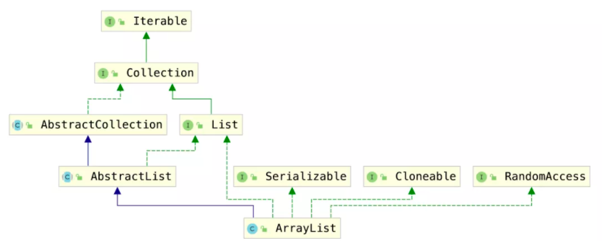

# ArrayList源码分析



- 实现了`RandomAccess`接口，可以随机访问
- 实现了`Cloneable`接口，可以克隆
- 实现了`Serializable`接口，可以序列化、反序列化
- 实现了`List`接口，是`List`的实现类之一
- 实现了`Collection`接口，是`Java Collections Framework`成员之一
- 实现了`Iterable`接口，可以使用`for-each`迭代

```java
transient Object[] elementData;//底层数组
/**
 * The size of the ArrayList (the number of elements it contains).
 */
private int size;
/** 
 * The number of times this list has been <i>structurally modified</i>.
 * Structural modifications are those that change the size of the
 * list, or otherwise perturb it in such a fashion that iterations in
 * progress may yield incorrect results.
 * This field is used by the iterator
 */
protected transient int modCount = 0;//父类AbstractList，transient是因为JDK不想将整个elementData都序列化或者反序列化，而只是将size和实际存储的元素序列化或反序列化，从而节省空间和时间。

private static final int DEFAULT_CAPACITY = 10;//默认大小10
private static final Object[] DEFAULTCAPACITY_EMPTY_ELEMENTDATA = {};//默认空数组
/**
* We distinguish this from EMPTY_ELEMENTDATA to know how much to inflate when
* first element is added.
*/
private static final Object[] EMPTY_ELEMENTDATA = {};//空数组
/**
* 无参构造函数，赋值空数组容量为0
*/
public ArrayList() {
    this.elementData = DEFAULTCAPACITY_EMPTY_ELEMENTDATA;
}
/**
* 有参构造函数，设置数组大小
*/
public ArrayList(int initialCapacity) {
        if (initialCapacity > 0) {
            this.elementData = new Object[initialCapacity];/
        } else if (initialCapacity == 0) {
            this.elementData = EMPTY_ELEMENTDATA;
        } else {
            throw new IllegalArgumentException("Illegal Capacity: "+initialCapacity);
        }
}
/**
* 只有真正对数据进行添加add时，才分配默认DEFAULT_CAPACITY = 10的初始容量。
*/
public boolean add(E e) {
        ensureCapacityInternal(size + 1);  // 校验长度是否需要扩容
        elementData[size++] = e;
        return true;
}
private void ensureCapacityInternal(int minCapacity) {
        ensureExplicitCapacity(calculateCapacity(elementData, minCapacity));
}
private static int calculateCapacity(Object[] elementData, int minCapacity) {
        if (elementData == DEFAULTCAPACITY_EMPTY_ELEMENTDATA) {//为空数组
            return Math.max(DEFAULT_CAPACITY, minCapacity);//返回（长度+1）和默认10的最大值
        }
        return minCapacity;//返回长度+1
}
private void ensureExplicitCapacity(int minCapacity) {
        modCount++;//判断 modCount 跟 expectedModCount 是否相等，如果不相等就表示已经有其他线程修改了类比CAS
        if (minCapacity - elementData.length > 0)
            grow(minCapacity);
}
private void grow(int minCapacity) {
        // overflow-conscious code
        int oldCapacity = elementData.length;//扩容前长度
        int newCapacity = oldCapacity + (oldCapacity >> 1);//扩容后1.5倍
        if (newCapacity - minCapacity < 0)
            newCapacity = minCapacity;
        if (newCapacity - MAX_ARRAY_SIZE > 0)//超过Interger.MAX_VALUE-8 
            newCapacity = hugeCapacity(minCapacity);
        // minCapacity is usually close to size, so this is a win:
        elementData = Arrays.copyOf(elementData, newCapacity);//开辟新数组改指针
}

private static int hugeCapacity(int minCapacity) {
        if (minCapacity < 0) // overflow
            throw new OutOfMemoryError();
        return (minCapacity > MAX_ARRAY_SIZE) ?//+1长度是否大于Interger.MAX_VALUE-8 
            Integer.MAX_VALUE :
            MAX_ARRAY_SIZE;
}
/**
* 指定位置的add
*/
public void add(int index, E element) {
        rangeCheckForAdd(index);//检查是否越界

        ensureCapacityInternal(size + 1);  // 是否扩容
        System.arraycopy(elementData, index, elementData, index + 1,
                         size - index);//插入位置后面的元素集体后挪，效率低
        elementData[index] = element;
        size++;
}
/**
* 删除方法
*/
public E remove(int index) {
        rangeCheck(index);

        modCount++;
        E oldValue = elementData(index);

        int numMoved = size - index - 1;
        if (numMoved > 0)
            System.arraycopy(elementData, index+1, elementData, index,
                             numMoved);//复制删除位置后的数组，直接向前覆盖1位
        elementData[--size] = null; // clear to let GC do its work

        return oldValue;
    }
```

Vector，就是把所有的方法统统加上synchronized