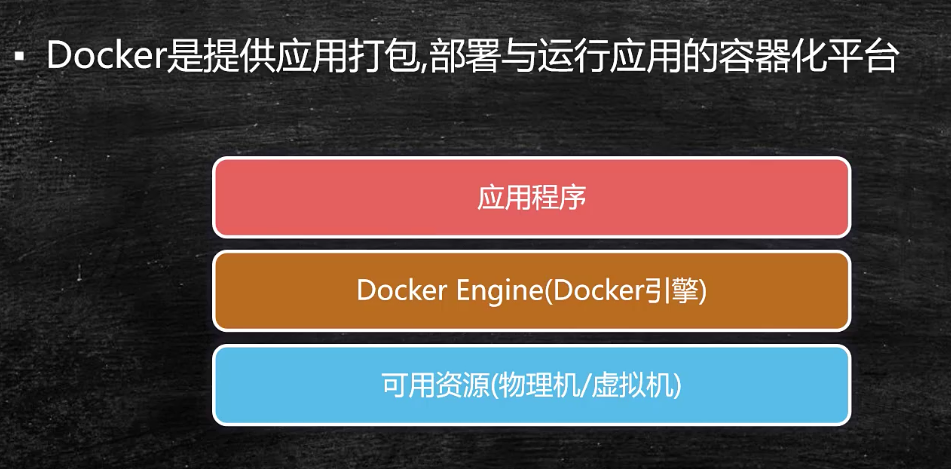
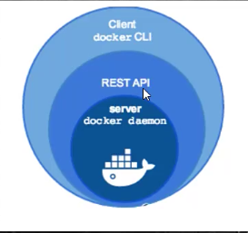
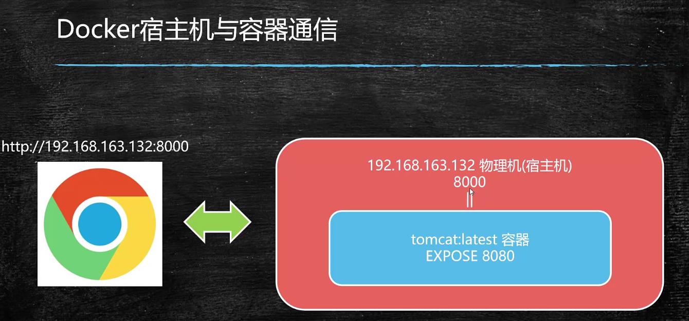
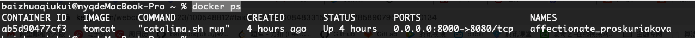
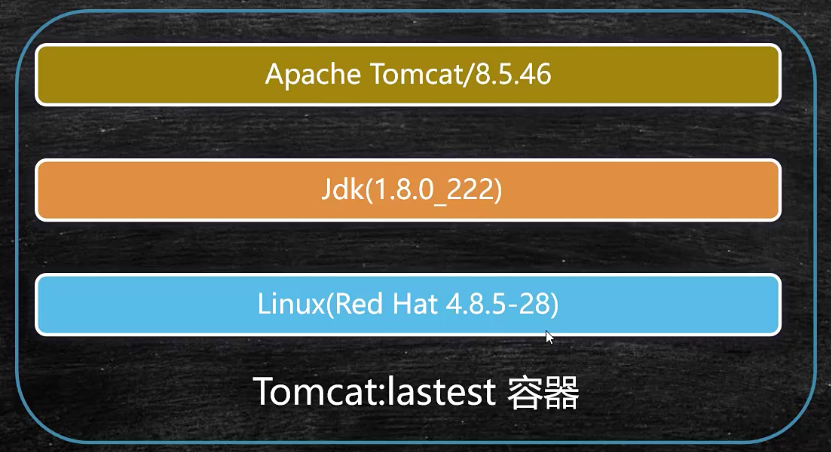
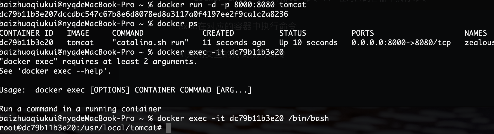
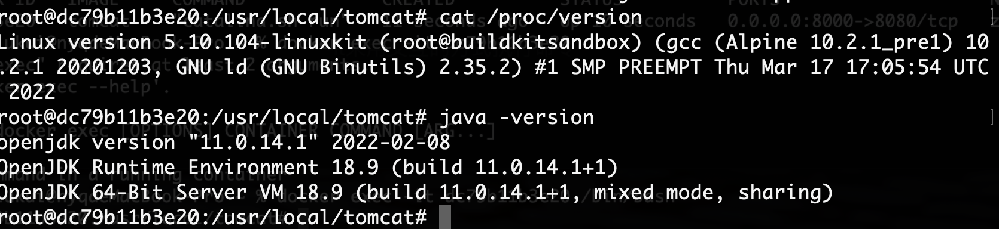
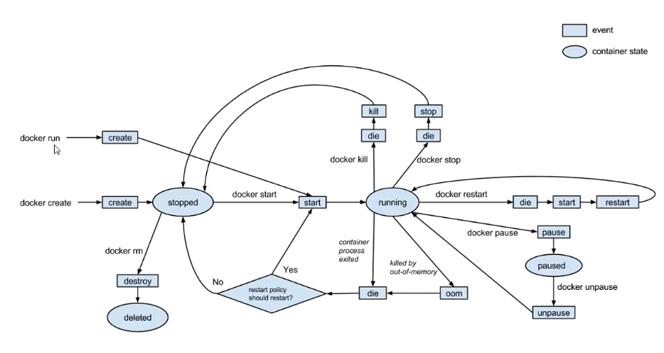

# Docker

开源的应用容器引擎，基于go语言进行开发

容器是完全使用沙箱机制，容器开销极低

也具备一定的虚拟虎职能



 

镜像：镜像是文件，提供了运行程序**完整的软硬件资源**，是应用程序的集装箱

容器：是镜像的实例，由Docker负责创建，容器之间彼此隔离

```sh
docker pull 镜像名:版本   // 从远程仓库抽取镜像
docker images       // 查看本地镜像
docker run 镜像名  	// 创建容器，启动应用
docker ps 					// 查看正在运行中的容器镜像 -a 查看为create状态的
docker rm -f 容器id	 // 删除容器
docker rmi -f 镜像名 // 删除镜像
```



```sh
docker run -p 8000:8080 镜像名 -d  	// 创建容器指定端口映射，启动应用-d后台运行
docker ps // 查看docker正在运行的
```



## 容器内部结构



```sh
docker exec -it 容器id 命令 // 在对应的容器中执行命令
```

exec在对应的容器中执行命令

-it采用交互的方式执行命令





exit退出

## 容器的生命周期



docker run  创建容器到start状态再到running状态

docker create 创建容器处于stopped状态，等到start命令后进入到start状态

docker kill 杀掉处于running的进程，如果再次start重新分配pid

docker stop 只是停止处于running的进程，如果再次start重启之前的pid

docker restart 重启

docker pause 让容器暂停服务，使用docker unpause 进行恢复

当发生内存溢出的时候进入die状态，根据容器的重启策略决定是否重启容器

docker rm 移除容器

## Dockerfile