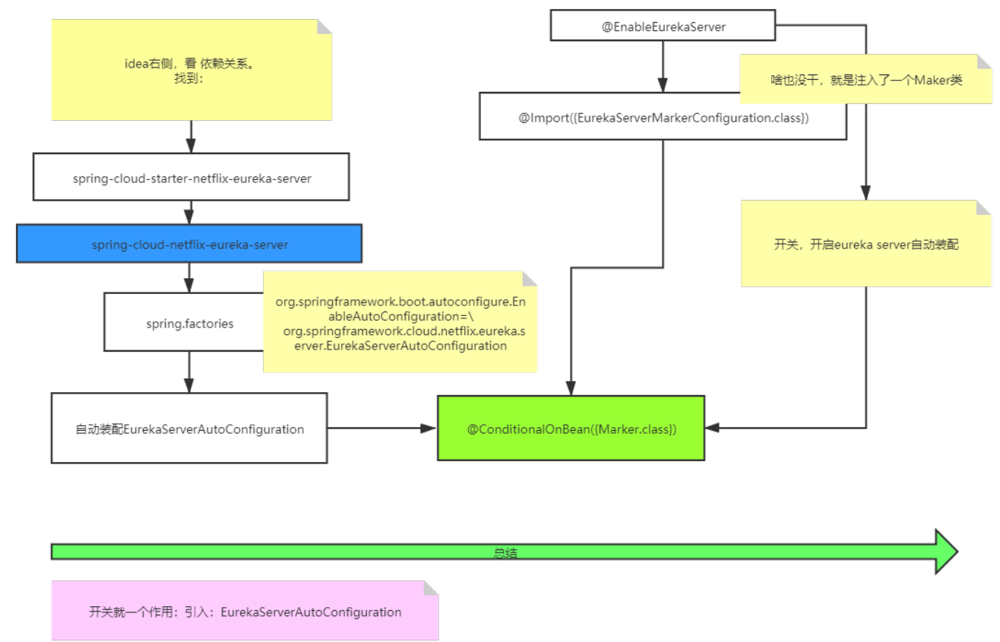
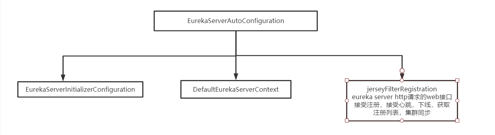
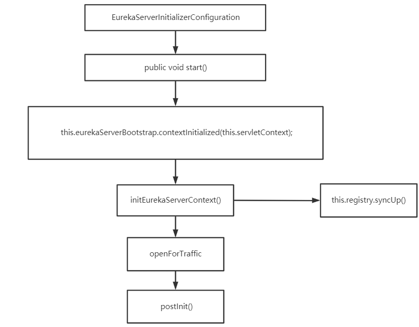
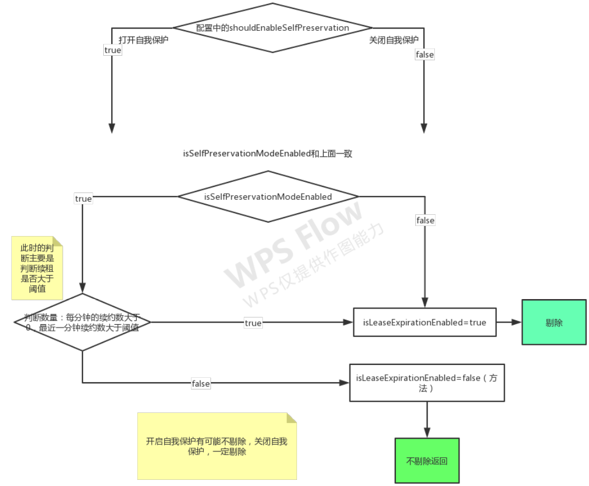

# Eureka优化

# Eureka启动原理

## 开启EurekaServerAutoConfiguration





**@EnableEurekaServer**

```java
@EnableEurekaServer //@EnableEurekaServer注解
@SpringBootApplication
public class CloudEurekaApplication {
    public static void main(String[] args) {SpringApplication.run(CloudEurekaApplication.class, args);}
}
```

**@Import({EurekaServerMarkerConfiguration.class})**

```java
@Import({EurekaServerMarkerConfiguration.class})
public @interface EnableEurekaServer {
}
```

**EurekaServerMarkerConfiguration**

```java
//这个类注入了一个Maker类，相当于一个开关开启了EurekaServerAutoConfiguration自动装配
public class EurekaServerMarkerConfiguration {
    public EurekaServerMarkerConfiguration() {
    }

    @Bean
    public EurekaServerMarkerConfiguration.Marker eurekaServerMarkerBean() {
        return new EurekaServerMarkerConfiguration.Marker();
    }

    class Marker {
        Marker() {
        }
    }
}
```

**EurekaServerAutoConfiguration**

```java
@Configuration(
    proxyBeanMethods = false
)
@Import({EurekaServerInitializerConfiguration.class})//启动类
@ConditionalOnBean({Marker.class})//判断是否有这个类，有的化开启自动配置
@EnableConfigurationProperties({EurekaDashboardProperties.class, InstanceRegistryProperties.class})//加载配置
@PropertySource({"classpath:/eureka/server.properties"})
public class EurekaServerAutoConfiguration implements WebMvcConfigurer {
    //UI界面dashboard
	public EurekaController eurekaController() {
    return new EurekaController(this.applicationInfoManager);
}
    
    //封装其他peer节点
    @Bean
    @ConditionalOnMissingBean
    public PeerEurekaNodes peerEurekaNodes(PeerAwareInstanceRegistry registry, ServerCodecs serverCodecs, ReplicationClientAdditionalFilters replicationClientAdditionalFilters) {
        return new EurekaServerAutoConfiguration.RefreshablePeerEurekaNodes(registry, this.eurekaServerConfig, this.eurekaClientConfig, serverCodecs, this.applicationInfoManager, replicationClientAdditionalFilters);
    }
    
    //三级缓存
    @Bean
    @ConditionalOnMissingBean
    public EurekaServerContext eurekaServerContext(ServerCodecs serverCodecs, PeerAwareInstanceRegistry registry, PeerEurekaNodes peerEurekaNodes) {
        return new DefaultEurekaServerContext(this.eurekaServerConfig, serverCodecs, registry, peerEurekaNodes, this.applicationInfoManager);
    }
    
    //eureka server http请求的web接口 接受注册，接受心跳，下线，获取注册列表，集群同步
    @Bean
    public FilterRegistrationBean<?> jerseyFilterRegistration(Application eurekaJerseyApp) {
        FilterRegistrationBean<Filter> bean = new FilterRegistrationBean();
        bean.setFilter(new ServletContainer(eurekaJerseyApp));
        bean.setOrder(2147483647);
        bean.setUrlPatterns(Collections.singletonList("/eureka/*"));
        return bean;
    }
}
```


### EurekaServerInitializerConfiguration启动类



```java
//1.从peer拉取注册表
//2.启动定时剔出任务，自我保护
public class EurekaServerInitializerConfiguration implements ServletContextAware, SmartLifecycle, Ordered {
    //start方法会自动执行因为实现了SmartLifecycle，SmartLifecycle继承了Lifecycle接口的void start();所以该方法会自动执行。在spring初始化和销毁的时候，就会分别调用它的start和stop方法
     public void start() {
        (new Thread(() -> {
            try {
                this.eurekaServerBootstrap.contextInitialized(this.servletContext);//进入
                log.info("Started Eureka Server");
                this.publish(new EurekaRegistryAvailableEvent(this.getEurekaServerConfig()));//发布注册事件
                this.running = true;
                this.publish(new EurekaServerStartedEvent(this.getEurekaServerConfig()));//发布启动事件
            } catch (Exception var2) {
                log.error("Could not initialize Eureka servlet context", var2);
            }

        })).start();
    }
}
```

**EurekaServerBootstrap**

```java
public class EurekaServerBootstrap {
	public void contextInitialized(ServletContext context) {
    try {
        this.initEurekaEnvironment();//初始化环境
        this.initEurekaServerContext();//进入
        context.setAttribute(EurekaServerContext.class.getName(), this.serverContext);
    } catch (Throwable var3) {
        log.error("Cannot bootstrap eureka server :", var3);
        throw new RuntimeException("Cannot bootstrap eureka server :", var3);
    }
}
    
    protected void initEurekaServerContext() throws Exception {
    JsonXStream.getInstance().registerConverter(new V1AwareInstanceInfoConverter(), 10000);
    XmlXStream.getInstance().registerConverter(new V1AwareInstanceInfoConverter(), 10000);
    if (this.isAws(this.applicationInfoManager.getInfo())) {
        this.awsBinder = new AwsBinderDelegate(this.eurekaServerConfig, this.eurekaClientConfig, 	this.registry, this.applicationInfoManager);
        this.awsBinder.start();
    }
    EurekaServerContextHolder.initialize(this.serverContext);
    log.info("Initialized server context");
    int registryCount = this.registry.syncUp();//没什么cap没c，启动时从Eureka的其他节点（peer）拉取注册表不能保证强一致性，后续注册的获取不到，不能保证执行，后续会进行集群同步
    this.registry.openForTraffic(this.applicationInfoManager, registryCount);//进入
    EurekaMonitors.registerAllStats();
}
    
}
```

**this.registry.syncUp()**

```java
public class PeerAwareInstanceRegistryImpl extends AbstractInstanceRegistry implements PeerAwareInstanceRegistry {

public int syncUp() {
        int count = 0;

        for(int i = 0; i < this.serverConfig.getRegistrySyncRetries() && count == 0; ++i) {
            if (i > 0) {
                try {
                    Thread.sleep(this.serverConfig.getRegistrySyncRetryWaitMs());
                } catch (InterruptedException var10) {
                    logger.warn("Interrupted during registry transfer..");
                    break;
                }
            }

            Applications apps = this.eurekaClient.getApplications();//作为客户端向其他节点拉数据
            Iterator var4 = apps.getRegisteredApplications().iterator();
            while(var4.hasNext()) {
                Application app = (Application)var4.next();
                Iterator var6 = app.getInstances().iterator();
                while(var6.hasNext()) {
                    InstanceInfo instance = (InstanceInfo)var6.next();
                    try {
                        if (this.isRegisterable(instance)) {
                            this.register(instance, instance.getLeaseInfo().getDurationInSecs(), true);
                            ++count;
                        }
                    } catch (Throwable var9) {
                        logger.error("During DS init copy", var9);
                    }
                }
            }
        }
        return count;
    }
}

```

**this.registry.openForTraffic(this.applicationInfoManager, registryCount)**

```java
public class InstanceRegistry extends PeerAwareInstanceRegistryImpl implements ApplicationContextAware {
public void openForTraffic(ApplicationInfoManager applicationInfoManager, int count) {
    super.openForTraffic(applicationInfoManager, count == 0 ? this.defaultOpenForTrafficCount : count);//进入
}
}
```

```java
public class PeerAwareInstanceRegistryImpl extends AbstractInstanceRegistry implements PeerAwareInstanceRegistry {
public void openForTraffic(ApplicationInfoManager applicationInfoManager, int count) {
    this.expectedNumberOfClientsSendingRenews = count;//期望的数量
    this.updateRenewsPerMinThreshold();//每分钟更新的阈值
    logger.info("Got {} instances from neighboring DS node", count);
    logger.info("Renew threshold is: {}", this.numberOfRenewsPerMinThreshold);
    this.startupTime = System.currentTimeMillis();
    if (count > 0) {
        this.peerInstancesTransferEmptyOnStartup = false;
    }

    Name selfName = applicationInfoManager.getInfo().getDataCenterInfo().getName();
    boolean isAws = Name.Amazon == selfName;
    if (isAws && this.serverConfig.shouldPrimeAwsReplicaConnections()) {
        logger.info("Priming AWS connections for all replicas..");
        this.primeAwsReplicas(applicationInfoManager);
    }

    logger.info("Changing status to UP");
    applicationInfoManager.setInstanceStatus(InstanceStatus.UP);
    super.postInit();//进入
}
}
```

**super.postInit()**

```java
public abstract class AbstractInstanceRegistry implements InstanceRegistry {
protected void postInit() {
    this.renewsLastMin.start();
    if (this.evictionTaskRef.get() != null) {
        ((AbstractInstanceRegistry.EvictionTask)this.evictionTaskRef.get()).cancel();
    }

    this.evictionTaskRef.set(new AbstractInstanceRegistry.EvictionTask());
    this.evictionTimer.schedule((TimerTask)this.evictionTaskRef.get(), this.serverConfig.getEvictionIntervalTimerInMs(), this.serverConfig.getEvictionIntervalTimerInMs());
//定时剔出任务
}
}

class EvictionTask extends TimerTask {
        private final AtomicLong lastExecutionNanosRef = new AtomicLong(0L);

        EvictionTask() {
        }

        public void run() {
            try {
                long compensationTimeMs = this.getCompensationTimeMs();
                AbstractInstanceRegistry.logger.info("Running the evict task with compensationTime {}ms", compensationTimeMs);
                AbstractInstanceRegistry.this.evict(compensationTimeMs);//剔出方法
            } catch (Throwable var3) {
                AbstractInstanceRegistry.logger.error("Could not run the evict task", var3);
            }

        }
    
    public void evict(long additionalLeaseMs) {
        logger.debug("Running the evict task");
        if (!this.isLeaseExpirationEnabled()) {//为true才执行剔出，自我保护关了
            logger.debug("DS: lease expiration is currently disabled.");
        } else {
            List<Lease<InstanceInfo>> expiredLeases = new ArrayList();
            Iterator var4 = this.registry.entrySet().iterator();

            while(true) {
                Map leaseMap;
                do {
                    if (!var4.hasNext()) {
                        int registrySize = (int)this.getLocalRegistrySize();
                        int registrySizeThreshold = (int)((double)registrySize * this.serverConfig.getRenewalPercentThreshold());
                        int evictionLimit = registrySize - registrySizeThreshold;
                        int toEvict = Math.min(expiredLeases.size(), evictionLimit);
                        if (toEvict > 0) {
                            logger.info("Evicting {} items (expired={}, evictionLimit={})", new Object[]{toEvict, expiredLeases.size(), evictionLimit});
                            Random random = new Random(System.currentTimeMillis());

                            for(int i = 0; i < toEvict; ++i) {
                                int next = i + random.nextInt(expiredLeases.size() - i);
                                Collections.swap(expiredLeases, i, next);
                                Lease<InstanceInfo> lease = (Lease)expiredLeases.get(i);
                                String appName = ((InstanceInfo)lease.getHolder()).getAppName();
                                String id = ((InstanceInfo)lease.getHolder()).getId();
                                EurekaMonitors.EXPIRED.increment();
                                logger.warn("DS: Registry: expired lease for {}/{}", appName, id);
                                this.internalCancel(appName, id, false);
                            }
                        }

                        return;
                    }

                    Entry<String, Map<String, Lease<InstanceInfo>>> groupEntry = (Entry)var4.next();
                    leaseMap = (Map)groupEntry.getValue();
                } while(leaseMap == null);

                Iterator var7 = leaseMap.entrySet().iterator();

                while(var7.hasNext()) {
                    Entry<String, Lease<InstanceInfo>> leaseEntry = (Entry)var7.next();
                    Lease<InstanceInfo> lease = (Lease)leaseEntry.getValue();
                    if (lease.isExpired(additionalLeaseMs) && lease.getHolder() != null) {
                        expiredLeases.add(lease);
                    }
                }
            }
        }
    }
}
```

```java
public boolean isLeaseExpirationEnabled() {
    if (!this.isSelfPreservationModeEnabled()) {
        return true;
    } else {
        return this.numberOfRenewsPerMinThreshold > 0 && this.getNumOfRenewsInLastMin() > (long)this.numberOfRenewsPerMinThreshold;//每分钟的续约数量大于零并且最后一分钟的续约数量是否大于阈值
    }
}
```



自我保护关闭了，剔除服务。自我保护开启，最后一分钟续约数量大于阈值，继续剔除，小于阈值不剔出（由于网络波动下线的）

### DefaultEurekaServerContext开启三级缓存

```java
//包含启动三级缓存
public class DefaultEurekaServerContext implements EurekaServerContext {
 
public void initialize() {
        logger.info("Initializing ...");
        this.peerEurekaNodes.start();

        try {
            this.registry.init(this.peerEurekaNodes);//进入
        } catch (Exception var2) {
            throw new RuntimeException(var2);
        }
        logger.info("Initialized");
    }
}
```

**PeerAwareInstanceRegistryImpl**

```java
public class PeerAwareInstanceRegistryImpl extends AbstractInstanceRegistry implements PeerAwareInstanceRegistry {

public void init(PeerEurekaNodes peerEurekaNodes) throws Exception {
    this.numberOfReplicationsLastMin.start();
    this.peerEurekaNodes = peerEurekaNodes;
    this.initializedResponseCache();//开启三级缓存
    this.scheduleRenewalThresholdUpdateTask();
    this.initRemoteRegionRegistry();

    try {
        Monitors.registerObject(this);
    } catch (Throwable var3) {
        logger.warn("Cannot register the JMX monitor for the InstanceRegistry :", var3);
    }

}
}
```

**ResponseCacheImpl**

```java
public class ResponseCacheImpl implements ResponseCache {

ResponseCacheImpl(EurekaServerConfig serverConfig, ServerCodecs serverCodecs, AbstractInstanceRegistry registry) {
    this.serverConfig = serverConfig;
    this.serverCodecs = serverCodecs;
    this.shouldUseReadOnlyResponseCache = serverConfig.shouldUseReadOnlyResponseCache();
    this.registry = registry;
    long responseCacheUpdateIntervalMs = serverConfig.getResponseCacheUpdateIntervalMs();
    this.readWriteCacheMap = CacheBuilder.newBuilder().initialCapacity(serverConfig.getInitialCapacityOfResponseCache()).expireAfterWrite(serverConfig.getResponseCacheAutoExpirationInSeconds(), TimeUnit.SECONDS).removalListener(new RemovalListener<Key, ResponseCacheImpl.Value>() {
        public void onRemoval(RemovalNotification<Key, ResponseCacheImpl.Value> notification) {
            Key removedKey = (Key)notification.getKey();
            if (removedKey.hasRegions()) {
                Key cloneWithNoRegions = removedKey.cloneWithoutRegions();
                ResponseCacheImpl.this.regionSpecificKeys.remove(cloneWithNoRegions, removedKey);
            }

        }
    }).build(new CacheLoader<Key, ResponseCacheImpl.Value>() {
        public ResponseCacheImpl.Value load(Key key) throws Exception {
            if (key.hasRegions()) {
                Key cloneWithNoRegions = key.cloneWithoutRegions();
                ResponseCacheImpl.this.regionSpecificKeys.put(cloneWithNoRegions, key);
            }

            ResponseCacheImpl.Value value = ResponseCacheImpl.this.generatePayload(key);
            return value;
        }
    });
    
    //定时更新缓存，readWrite和readOnly定时更新同步
    if (this.shouldUseReadOnlyResponseCache) {
        this.timer.schedule(this.getCacheUpdateTask(), new Date(System.currentTimeMillis() / responseCacheUpdateIntervalMs * responseCacheUpdateIntervalMs + responseCacheUpdateIntervalMs), responseCacheUpdateIntervalMs);
    }

    try {
        Monitors.registerObject(this);
    } catch (Throwable var7) {
        logger.warn("Cannot register the JMX monitor for the InstanceRegistry", var7);
    }

}
}
```

### ApplicationResource注册、集群同步

```java
//集群同步
public class ApplicationResource {
     public Response addInstance(InstanceInfo info, @HeaderParam("x-netflix-discovery-replication") String isReplication) {
        logger.debug("Registering instance {} (replication={})", info.getId(), isReplication);
        if (this.isBlank(info.getId())) {
            return Response.status(400).entity("Missing instanceId").build();
        } else if (this.isBlank(info.getHostName())) {
            return Response.status(400).entity("Missing hostname").build();
        } else if (this.isBlank(info.getIPAddr())) {
            return Response.status(400).entity("Missing ip address").build();
        } else if (this.isBlank(info.getAppName())) {
            return Response.status(400).entity("Missing appName").build();
        } else if (!this.appName.equals(info.getAppName())) {
            return Response.status(400).entity("Mismatched appName, expecting " + this.appName + " but was " + info.getAppName()).build();
        } else if (info.getDataCenterInfo() == null) {
            return Response.status(400).entity("Missing dataCenterInfo").build();
        } else if (info.getDataCenterInfo().getName() == null) {
            return Response.status(400).entity("Missing dataCenterInfo Name").build();
        } else {
            DataCenterInfo dataCenterInfo = info.getDataCenterInfo();
            if (dataCenterInfo instanceof UniqueIdentifier) {
                String dataCenterInfoId = ((UniqueIdentifier)dataCenterInfo).getId();
                if (this.isBlank(dataCenterInfoId)) {
                    boolean experimental = "true".equalsIgnoreCase(this.serverConfig.getExperimental("registration.validation.dataCenterInfoId"));
                    if (experimental) {
                        String entity = "DataCenterInfo of type " + dataCenterInfo.getClass() + " must contain a valid id";
                        return Response.status(400).entity(entity).build();
                    }

                    if (dataCenterInfo instanceof AmazonInfo) {
                        AmazonInfo amazonInfo = (AmazonInfo)dataCenterInfo;
                        String effectiveId = amazonInfo.get(MetaDataKey.instanceId);
                        if (effectiveId == null) {
                            amazonInfo.getMetadata().put(MetaDataKey.instanceId.getName(), info.getId());
                        }
                    } else {
                        logger.warn("Registering DataCenterInfo of type {} without an appropriate id", dataCenterInfo.getClass());
                    }
                }
            }

            this.registry.register(info, "true".equals(isReplication));//属性为true的时候，进行同步，进入
            return Response.status(204).build();
        }
    }
    
}
```

**PeerAwareInstanceRegistryImpl**

```java
public class PeerAwareInstanceRegistryImpl extends AbstractInstanceRegistry implements PeerAwareInstanceRegistry {

public void register(InstanceInfo info, boolean isReplication) {
    int leaseDuration = 90;//续约时间
    if (info.getLeaseInfo() != null && info.getLeaseInfo().getDurationInSecs() > 0) {
        leaseDuration = info.getLeaseInfo().getDurationInSecs();
    }

    super.register(info, leaseDuration, isReplication);//注册
    
    this.replicateToPeers(PeerAwareInstanceRegistryImpl.Action.Register, info.getAppName(), info.getId(), info, (InstanceStatus)null, isReplication);//集群同步
}
}
```

**PeerAwareInstanceRegistryImpl集群同步**

```java
public class PeerAwareInstanceRegistryImpl extends AbstractInstanceRegistry implements PeerAwareInstanceRegistry 
private void replicateToPeers(PeerAwareInstanceRegistryImpl.Action action, String appName, String id, InstanceInfo info, InstanceStatus newStatus, boolean isReplication) {
    Stopwatch tracer = action.getTimer().start();

    try {
        if (isReplication) {
            this.numberOfReplicationsLastMin.increment();
        }

        if (this.peerEurekaNodes == Collections.EMPTY_LIST || isReplication) {
            return;
        }

        Iterator var8 = this.peerEurekaNodes.getPeerEurekaNodes().iterator();

        while(var8.hasNext()) {
            PeerEurekaNode node = (PeerEurekaNode)var8.next();
            if (!this.peerEurekaNodes.isThisMyUrl(node.getServiceUrl())) {
                this.replicateInstanceActionsToPeers(action, appName, id, info, newStatus, node);
            }
        }
    } finally {
        tracer.stop();
    }

}
}
```

**AbstractInstanceRegistry注册**

```java
public abstract class AbstractInstanceRegistry implements InstanceRegistry {

public void register(InstanceInfo registrant, int leaseDuration, boolean isReplication) {
    try {
        this.read.lock();//获取锁
        //获取实例的注册信息
        Map<String, Lease<InstanceInfo>> gMap = (Map)this.registry.get(registrant.getAppName());
        EurekaMonitors.REGISTER.increment(isReplication);
        if (gMap == null) {
            ConcurrentHashMap<String, Lease<InstanceInfo>> gNewMap = new ConcurrentHashMap();
            //如果不存在则添加
            gMap = (Map)this.registry.putIfAbsent(registrant.getAppName(), gNewMap);
            if (gMap == null) {
                gMap = gNewMap;
            }
        }

        Lease<InstanceInfo> existingLease = (Lease)((Map)gMap).get(registrant.getId());
        //已存在这个节点
        if (existingLease != null && existingLease.getHolder() != null) {
            Long existingLastDirtyTimestamp = ((InstanceInfo)existingLease.getHolder()).getLastDirtyTimestamp();
            Long registrationLastDirtyTimestamp = registrant.getLastDirtyTimestamp();
            logger.debug("Existing lease found (existing={}, provided={}", existingLastDirtyTimestamp, registrationLastDirtyTimestamp);
            //获取注册时间最长的注册信息
            if (existingLastDirtyTimestamp > registrationLastDirtyTimestamp) {
                logger.warn("There is an existing lease and the existing lease's dirty timestamp {} is greater than the one that is being registered {}", existingLastDirtyTimestamp, registrationLastDirtyTimestamp);
                logger.warn("Using the existing instanceInfo instead of the new instanceInfo as the registrant");
                registrant = (InstanceInfo)existingLease.getHolder();
            }
        } else {
            synchronized(this.lock) {
                if (this.expectedNumberOfClientsSendingRenews > 0) {
                    ++this.expectedNumberOfClientsSendingRenews;
                    this.updateRenewsPerMinThreshold();
                }
            }

            logger.debug("No previous lease information found; it is new registration");
        }
		//创建租约
        Lease<InstanceInfo> lease = new Lease(registrant, leaseDuration);
        //如果租约存在则更新开始时间
        if (existingLease != null) {
            lease.setServiceUpTimestamp(existingLease.getServiceUpTimestamp());
        }

        ((Map)gMap).put(registrant.getId(), lease);
        this.recentRegisteredQueue.add(new Pair(System.currentTimeMillis(), registrant.getAppName() + "(" + registrant.getId() + ")"));
        if (!InstanceStatus.UNKNOWN.equals(registrant.getOverriddenStatus())) {
            logger.debug("Found overridden status {} for instance {}. Checking to see if needs to be add to the overrides", registrant.getOverriddenStatus(), registrant.getId());
            if (!this.overriddenInstanceStatusMap.containsKey(registrant.getId())) {
                logger.info("Not found overridden id {} and hence adding it", registrant.getId());
                this.overriddenInstanceStatusMap.put(registrant.getId(), registrant.getOverriddenStatus());
            }
        }

        InstanceStatus overriddenStatusFromMap = (InstanceStatus)this.overriddenInstanceStatusMap.get(registrant.getId());
        if (overriddenStatusFromMap != null) {
            logger.info("Storing overridden status {} from map", overriddenStatusFromMap);
            registrant.setOverriddenStatus(overriddenStatusFromMap);
        }
		//获取到最终状态的信息
        InstanceStatus overriddenInstanceStatus = this.getOverriddenInstanceStatus(registrant, existingLease, isReplication);
        registrant.setStatusWithoutDirty(overriddenInstanceStatus);
        if (InstanceStatus.UP.equals(registrant.getStatus())) {
            lease.serviceUp();
        }

        registrant.setActionType(ActionType.ADDED);
        this.recentlyChangedQueue.add(new AbstractInstanceRegistry.RecentlyChangedItem(lease));
        registrant.setLastUpdatedTimestamp();
        this.invalidateCache(registrant.getAppName(), registrant.getVIPAddress(), registrant.getSecureVipAddress());
        logger.info("Registered instance {}/{} with status {} (replication={})", new Object[]{registrant.getAppName(), registrant.getId(), registrant.getStatus(), isReplication});
    } finally {
        this.read.unlock();
    }

}
}
```

实例信息是由一个map对象保存的，在这个map中，key是应用的appName，value是另外一个map，在这个map中key是应用的id，而value则是应用的租约信息，map对象如下：

```java
private final ConcurrentHashMap<String, Map<String, Lease<InstanceInfo>>> registry        = new ConcurrentHashMap<String, Map<String, Lease<InstanceInfo>>>();
```


**全量、增量拉取**

recentlyChangedQueue3分钟更新一次
```java

public class ApplicationsResource {
     public Response getContainers(@PathParam("version") String version, @HeaderParam("Accept") String acceptHeader, @HeaderParam("Accept-Encoding") String acceptEncoding, @HeaderParam("X-Eureka-Accept") String eurekaAccept, @Context UriInfo uriInfo, @Nullable @QueryParam("regions") String regionsStr) {
        boolean isRemoteRegionRequested = null != regionsStr && !regionsStr.isEmpty();
        String[] regions = null;
        if (!isRemoteRegionRequested) {
            EurekaMonitors.GET_ALL.increment();
        } else {
            regions = regionsStr.toLowerCase().split(",");
            Arrays.sort(regions);
            EurekaMonitors.GET_ALL_WITH_REMOTE_REGIONS.increment();
        }

        if (!this.registry.shouldAllowAccess(isRemoteRegionRequested)) {
            return Response.status(Status.FORBIDDEN).build();
        } else {
            CurrentRequestVersion.set(Version.toEnum(version));
            KeyType keyType = KeyType.JSON;
            String returnMediaType = "application/json";
            if (acceptHeader == null || !acceptHeader.contains("json")) {
                keyType = KeyType.XML;
                returnMediaType = "application/xml";
            }

            Key cacheKey = new Key(EntityType.Application, "ALL_APPS", keyType, CurrentRequestVersion.get(), EurekaAccept.fromString(eurekaAccept), regions);
            Response response;
            if (acceptEncoding != null && acceptEncoding.contains("gzip")) {
                response = Response.ok(this.responseCache.getGZIP(cacheKey)).header("Content-Encoding", "gzip").header("Content-Type", returnMediaType).build();//进入
            } else {
                response = Response.ok(this.responseCache.get(cacheKey)).build();
            }

            CurrentRequestVersion.remove();
            return response;
        }
    }

    @Path("delta")
    @GET
    public Response getContainerDifferential(@PathParam("version") String version, @HeaderParam("Accept") String acceptHeader, @HeaderParam("Accept-Encoding") String acceptEncoding, @HeaderParam("X-Eureka-Accept") String eurekaAccept, @Context UriInfo uriInfo, @Nullable @QueryParam("regions") String regionsStr) {
        boolean isRemoteRegionRequested = null != regionsStr && !regionsStr.isEmpty();
        if (!this.serverConfig.shouldDisableDelta() && this.registry.shouldAllowAccess(isRemoteRegionRequested)) {
            String[] regions = null;
            if (!isRemoteRegionRequested) {
                EurekaMonitors.GET_ALL_DELTA.increment();
            } else {
                regions = regionsStr.toLowerCase().split(",");
                Arrays.sort(regions);
                EurekaMonitors.GET_ALL_DELTA_WITH_REMOTE_REGIONS.increment();
            }

            CurrentRequestVersion.set(Version.toEnum(version));
            KeyType keyType = KeyType.JSON;
            String returnMediaType = "application/json";
            if (acceptHeader == null || !acceptHeader.contains("json")) {
                keyType = KeyType.XML;
                returnMediaType = "application/xml";
            }

            Key cacheKey = new Key(EntityType.Application, "ALL_APPS_DELTA", keyType, CurrentRequestVersion.get(), EurekaAccept.fromString(eurekaAccept), regions);
            Response response;
            if (acceptEncoding != null && acceptEncoding.contains("gzip")) {
                response = Response.ok(this.responseCache.getGZIP(cacheKey)).header("Content-Encoding", "gzip").header("Content-Type", returnMediaType).build();
            } else {
                response = Response.ok(this.responseCache.get(cacheKey)).build();
            }

            CurrentRequestVersion.remove();
            return response;
        } else {
            return Response.status(Status.FORBIDDEN).build();
        }
    }
}
```

```java
public class ResponseCacheImpl implements ResponseCache {
	public byte[] getGZIP(Key key) {
    ResponseCacheImpl.Value payload = this.getValue(key, this.shouldUseReadOnlyResponseCache);
    return payload == null ? null : payload.getGzipped();
	}
    ResponseCacheImpl.Value getValue(Key key, boolean useReadOnlyCache) {
        ResponseCacheImpl.Value payload = null;

        try {
            if (useReadOnlyCache) {
                ResponseCacheImpl.Value currentPayload = (ResponseCacheImpl.Value)this.readOnlyCacheMap.get(key);
                if (currentPayload != null) {
                    payload = currentPayload;
                } else {
                    payload = (ResponseCacheImpl.Value)this.readWriteCacheMap.get(key);
                    this.readOnlyCacheMap.put(key, payload);
                }
            } else {
                payload = (ResponseCacheImpl.Value)this.readWriteCacheMap.get(key);
            }
        } catch (Throwable var5) {
            logger.error("Cannot get value for key : {}", key, var5);
        }

        return payload;
    	}

}
```


## 不同数量服务的自我保护

### 微服务特别少不开自我保护

挂掉了大概率是真的挂掉了

假设自我保护阈值设置80%

10个微服务：7个正常，3个挂了    70%，第四个4挂掉时，触发自我保护机制不会把第四个服务踢掉，导致别的服务会调用挂掉的服务

### 微服务特别多开启自我保护

假设自我保护阈值设置97%

100 个服务 3个挂掉（有可能是网络抖动原因） 第四个挂时不把他提出

### 大面积服务挂掉

```java
public class TestEvent {
    @EventListener
    public void listen(EurekaInstanceCanceledEvent event){
        //发邮件
        System.out.println("下线："+event.getServerId());
    }
}
```

```yml
 server:
  	# 自我保护，看服务多少。
    enable-self-preservation: false
    # 自我保护阈值
    renewal-percent-threshold: 0.85
```


## 快速下线

### 定时器Timer

**Timer和TimerTask**

Timer是jdk中提供的一个定时器工具，使用的时候会在主线程之外起一个单独的线程执行指定的计划任务，可以指定执行一次或者反复执行多次。

TimerTask是一个实现了Runnable接口的抽象类，代表一个可以被Timer执行的任务。

```java
//schedule(TimerTask task, long delay) 延迟 delay 毫秒 执行
public static void main(String[] args) {
        for (int i = 0; i < 10; ++i) {
            new Timer("timer - " + i).schedule(new TimerTask() {
                @Override
                public void run() {
                    println(Thread.currentThread().getName() + " run ");
                }
            }, 1000);
        }
    }


//schedule(TimerTask task, Date time) 特定时间执行
public static void main(String[] args) {
        for (int i = 0; i < 10; ++i) {
            new Timer("timer - " + i).schedule(new TimerTask() {
                @Override
                public void run() {
                    println(Thread.currentThread().getName() + " run ");
                }
            }, new Date(System.currentTimeMillis() + 2000));
        }
    }

//schedule(TimerTask task, long delay, long period) 延迟 delay 执行并每隔period 执行一次
public static void main(String[] args) {
        for (int i = 0; i < 10; ++i) {
            new Timer("timer - " + i).schedule(new TimerTask() {
                @Override
                public void run() {
                    println(Thread.currentThread().getName() + " run ");
                }
            }, 2000 , 3000);
        }
    }
```

### Eureka源码使用Timer

```yml
 server:
    # 剔除服务时间间隔
    eviction-interval-timer-in-ms: 1000
```

```java

public abstract class AbstractInstanceRegistry implements InstanceRegistry {

protected void postInit() {
    this.renewsLastMin.start();
    if (this.evictionTaskRef.get() != null) {
        ((AbstractInstanceRegistry.EvictionTask)this.evictionTaskRef.get()).cancel();
    }

    this.evictionTaskRef.set(new AbstractInstanceRegistry.EvictionTask());
    //Timer不好内部只有一个线程，多线程并行处理定时任务时，Timer运行多个TimerTask时，只要其中之一没有捕获抛出的异常，其他任务便会自动终止运行，使用ScheduledExecutorService内部是线程池则没有这个问题
    this.evictionTimer.schedule((TimerTask)this.evictionTaskRef.get(), this.serverConfig.getEvictionIntervalTimerInMs(), this.serverConfig.getEvictionIntervalTimerInMs());
}
}
```

## CAP

在[理论计算机科学](https://zh.wikipedia.org/wiki/理論計算機科學)中，**CAP定理**（CAP theorem），又被称作**布鲁尔定理**（Brewer's theorem），它指出对于一个[分布式计算系统](https://zh.wikipedia.org/wiki/分布式计算)来说，不可能同时满足以下三点：[[1\]](https://zh.wikipedia.org/wiki/CAP定理#cite_note-Lynch-1)[[2\]](https://zh.wikipedia.org/wiki/CAP定理#cite_note-2)

- 一致性（**C**onsistency） （等同于所有节点访问同一份最新的数据副本）
- [可用性](https://zh.wikipedia.org/wiki/可用性)（**A**vailability）（每次请求都能获取到非错的响应——但是不保证获取的数据为最新数据）
- [分区容错性](https://zh.wikipedia.org/w/index.php?title=网络分区&action=edit&redlink=1)（**P**artition tolerance）（以实际效果而言，分区相当于对通信的时限要求。系统如果不能在时限内达成数据一致性，就意味着发生了分区的情况，必须就当前操作在C和A之间做出选择[[3\]](https://zh.wikipedia.org/wiki/CAP定理#cite_note-3)。）

根据定理，分布式系统只能满足三项中的两项而不可能满足全部三项[[4\]](https://zh.wikipedia.org/wiki/CAP定理#cite_note-4)。理解CAP理论的最简单方式是想象两个节点分处分区两侧。允许至少一个节点更新状态会导致数据不一致，即丧失了C性质。如果为了保证数据一致性，将分区一侧的节点设置为不可用，那么又丧失了A性质。除非两个节点可以互相通信，才能既保证C又保证A，这又会导致丧失P性质。

从 CAP 理论看，Eureka 是一个 AP 系统，优先保证可用性(A)和分区容错性§，不保证强一致性©，只保证最终一致性，因此在架构中设计了较多缓存。

## 三级缓存

在 Eureka 高可用架构中，Eureka Server 也可以作为 Client 向其他 server 注册，多节点相互注册组成 Eureka 集群，集群间相互视为 peer。Eureka Client 向 Server 注册、续约、更新状态时，接受节点更新自己的服务注册信息后，逐个同步至其他 peer 节点。

**【注意】**如果 server-A 向 server-B 节点单向注册，则 server-A 视 server-B 为 peer 节点，server-A 接受的数据会同步给 server-B，但 server-B 接受的数据不会同步给 server-A。

### 缓存机制

高并发减少读写冲突，读写互不影响，一级二级是强一致性，二级三级不是强一致性

一级缓存（注册表）ConcurrentHashMap
二级缓存（ReadWriteMap）guava#LoadingCache  谷歌的guava
三级缓存（ReadOnlyMap）ConcurrentHashMap

**注册一个服务实例**

向注册表中写入服务实例信息，**并使得二级缓存失效**

**寻找一个服务**

从三级缓存中找，如果有则返回，如果没有则去二级缓存拿并更新，如果二级缓存已经失效，触发guava的回调函数从注册表中同步。

**数据同步定时器**

每 30s 从二级缓存向三级缓存同步数据

- 二级缓存有效
  - 从二级缓存向三级缓存同步数据
- 二级缓存失效
  - 触发二级缓存的同步（从注册表中拉取数据）

```yml
  server:
    # 关闭readOnlyCacheMap的缓存，每次都从readWriteCacheMap中取
    use-read-only-response-cache: false
    # readWrite 和 readOnly 同步时间间隔。 优化减少时间间隔，提高服务被发现的速度
    response-cache-update-interval-ms: 1000
```

Eureka Server 存在三个变量：(**registry、readWriteCacheMap、readOnlyCacheMap**)保存服务注册信息，默认情况下定时任务每 30s 将 readWriteCacheMap 同步至 readOnlyCacheMap，每 60s 清理超过 90s 未续约的节点，Eureka Client 每 30s 从 readOnlyCacheMap 更新服务注册信息，而 UI 则从 registry 更新服务注册信息。


## 面试问题

Eureka先停服务再下线，如果先下线，30秒后又会自动续约

## Eureka客户端

```java
@ConditionalOnClass({EurekaClientConfig.class})
public class EurekaClientAutoConfiguration {
}
```

```java
//与Server交互的配置
@ImplementedBy(DefaultEurekaClientConfig.class)//默认实现
public interface EurekaClientConfig {

}
```


```java
//Spring定义的标准
package org.springframework.cloud.client.discovery;
public interface DiscoveryClient extends Ordered {
}
```

```java
//Netflix的Eureka实现
public class EurekaDiscoveryClient implements DiscoveryClient {
        private final EurekaClient eurekaClient;//进入
}
```

```java
@ImplementedBy(DiscoveryClient.class)
public interface EurekaClient extends LookupService {
    void registerHealthCheck(HealthCheckHandler var1);
    void registerEventListener(EurekaEventListener var1);
}
```

```java
public class DiscoveryClient implements EurekaClient {
    DiscoveryClient(ApplicationInfoManager applicationInfoManager, EurekaClientConfig config, AbstractDiscoveryClientOptionalArgs args, Provider<BackupRegistry> backupRegistryProvider, EndpointRandomizer endpointRandomizer) {

	    //上面都是赋值
        logger.info("Initializing Eureka in region {}", this.clientConfig.getRegion());
        if (!config.shouldRegisterWithEureka() && !config.shouldFetchRegistry()) {//不拉取也不注册，ebable=true，本地开发开启
            logger.info("Client configured to neither register nor query for data.");
            this.scheduler = null;
            this.heartbeatExecutor = null;//心跳定时任务
            this.cacheRefreshExecutor = null;//缓存刷新，拉去注册表更及时
            this.eurekaTransport = null;
            this.instanceRegionChecker = new InstanceRegionChecker(new PropertyBasedAzToRegionMapper(config), this.clientConfig.getRegion());
            DiscoveryManager.getInstance().setDiscoveryClient(this);
            DiscoveryManager.getInstance().setEurekaClientConfig(config);
            this.initTimestampMs = System.currentTimeMillis();
            logger.info("Discovery Client initialized at timestamp {} with initial instances count: {}", this.initTimestampMs, this.getApplications().size());
        } else {
            try {
                this.scheduler = Executors.newScheduledThreadPool(2, (new ThreadFactoryBuilder()).setNameFormat("DiscoveryClient-%d").setDaemon(true).build());
                this.heartbeatExecutor = new ThreadPoolExecutor(1, this.clientConfig.getHeartbeatExecutorThreadPoolSize(), 0L, TimeUnit.SECONDS, new SynchronousQueue(), (new ThreadFactoryBuilder()).setNameFormat("DiscoveryClient-HeartbeatExecutor-%d").setDaemon(true).build());
                this.cacheRefreshExecutor = new ThreadPoolExecutor(1, this.clientConfig.getCacheRefreshExecutorThreadPoolSize(), 0L, TimeUnit.SECONDS, new SynchronousQueue(), (new ThreadFactoryBuilder()).setNameFormat("DiscoveryClient-CacheRefreshExecutor-%d").setDaemon(true).build());
                this.eurekaTransport = new DiscoveryClient.EurekaTransport();
                this.scheduleServerEndpointTask(this.eurekaTransport, args);
                Object azToRegionMapper;
                if (this.clientConfig.shouldUseDnsForFetchingServiceUrls()) {
                    azToRegionMapper = new DNSBasedAzToRegionMapper(this.clientConfig);
                } else {
                    azToRegionMapper = new PropertyBasedAzToRegionMapper(this.clientConfig);
                }

                if (null != this.remoteRegionsToFetch.get()) {
                    ((AzToRegionMapper)azToRegionMapper).setRegionsToFetch(((String)this.remoteRegionsToFetch.get()).split(","));
                }

                this.instanceRegionChecker = new InstanceRegionChecker((AzToRegionMapper)azToRegionMapper, this.clientConfig.getRegion());
            } catch (Throwable var10) {
                throw new RuntimeException("Failed to initialize DiscoveryClient!", var10);
            }

            if (this.clientConfig.shouldFetchRegistry() && !this.fetchRegistry(false)) {//拉取注册表
                this.fetchRegistryFromBackup();
            }

            if (this.preRegistrationHandler != null) {
                this.preRegistrationHandler.beforeRegistration();
            }

            if (this.clientConfig.shouldRegisterWithEureka() && this.clientConfig.shouldEnforceRegistrationAtInit()) {
                try {
                    if (!this.register()) {
                        throw new IllegalStateException("Registration error at startup. Invalid server response.");
                    }
                } catch (Throwable var9) {
                    logger.error("Registration error at startup: {}", var9.getMessage());
                    throw new IllegalStateException(var9);
                }
            }

            this.initScheduledTasks();//初始化定时任务，进入

            try {
                Monitors.registerObject(this);
            } catch (Throwable var8) {
                logger.warn("Cannot register timers", var8);
            }

            DiscoveryManager.getInstance().setDiscoveryClient(this);
            DiscoveryManager.getInstance().setEurekaClientConfig(config);
            this.initTimestampMs = System.currentTimeMillis();
            logger.info("Discovery Client initialized at timestamp {} with initial instances count: {}", this.initTimestampMs, this.getApplications().size());
        }
    }
    
    private void initScheduledTasks() {
        int renewalIntervalInSecs;
        int expBackOffBound;
        if (this.clientConfig.shouldFetchRegistry()) {
            renewalIntervalInSecs = this.clientConfig.getRegistryFetchIntervalSeconds();
            expBackOffBound = this.clientConfig.getCacheRefreshExecutorExponentialBackOffBound();
            this.cacheRefreshTask = new TimedSupervisorTask("cacheRefresh", this.scheduler, this.cacheRefreshExecutor, renewalIntervalInSecs, TimeUnit.SECONDS, expBackOffBound, new DiscoveryClient.CacheRefreshThread());//缓存刷新任务
            this.scheduler.schedule(this.cacheRefreshTask, (long)renewalIntervalInSecs, TimeUnit.SECONDS);
        }

        if (this.clientConfig.shouldRegisterWithEureka()) {
            renewalIntervalInSecs = this.instanceInfo.getLeaseInfo().getRenewalIntervalInSecs();
            expBackOffBound = this.clientConfig.getHeartbeatExecutorExponentialBackOffBound();
            logger.info("Starting heartbeat executor: renew interval is: {}", renewalIntervalInSecs);
            this.heartbeatTask = new TimedSupervisorTask("heartbeat", this.scheduler, this.heartbeatExecutor, renewalIntervalInSecs, TimeUnit.SECONDS, expBackOffBound, new DiscoveryClient.HeartbeatThread());//心跳任务
            this.scheduler.schedule(this.heartbeatTask, (long)renewalIntervalInSecs, TimeUnit.SECONDS);
            this.instanceInfoReplicator = new InstanceInfoReplicator(this, this.instanceInfo, this.clientConfig.getInstanceInfoReplicationIntervalSeconds(), 2);
            this.statusChangeListener = new StatusChangeListener() {//如果自身服务有变化，重新注册
                public String getId() {
                    return "statusChangeListener";
                }

                public void notify(StatusChangeEvent statusChangeEvent) {
                    if (InstanceStatus.DOWN != statusChangeEvent.getStatus() && InstanceStatus.DOWN != statusChangeEvent.getPreviousStatus()) {
                        DiscoveryClient.logger.info("Saw local status change event {}", statusChangeEvent);
                    } else {
                        DiscoveryClient.logger.warn("Saw local status change event {}", statusChangeEvent);
                    }

                    DiscoveryClient.this.instanceInfoReplicator.onDemandUpdate();
                }
            };
            if (this.clientConfig.shouldOnDemandUpdateStatusChange()) {
                this.applicationInfoManager.registerStatusChangeListener(this.statusChangeListener);
            }

            this.instanceInfoReplicator.start(this.clientConfig.getInitialInstanceInfoReplicationIntervalSeconds());
        } else {
            logger.info("Not registering with Eureka server per configuration");
        }

    }
}
```