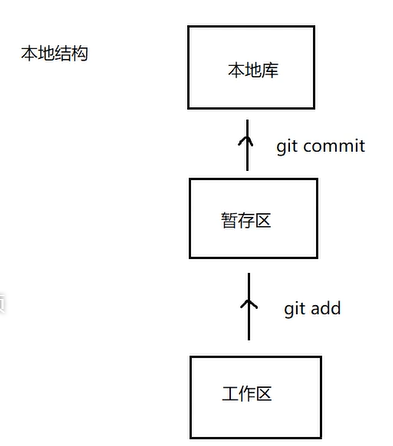
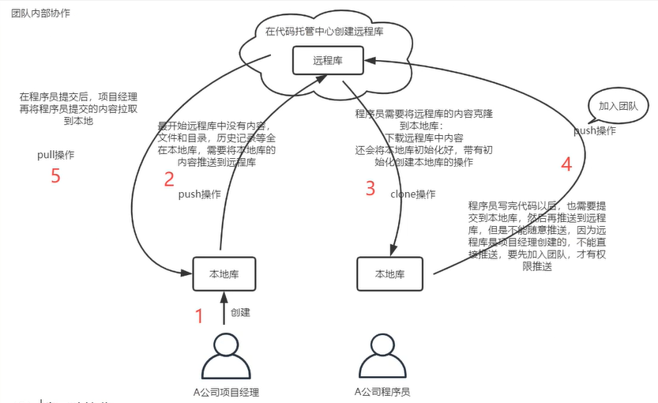
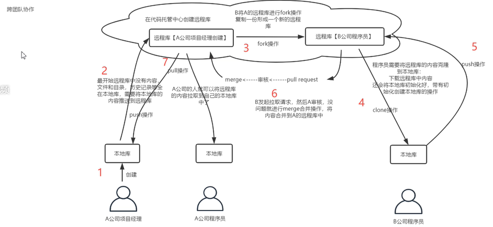

# Git

工作区：写代码的地方

暂存区:：可以撤回到工作区

​		团队内部合作，项目经历创建本地库，push到远程，开发人员clone下来，开发完后在push到远端，项目经理pull同步代码。

fork复制，merge合并

## git命令

**查看版本**

git --version  两个杠

**清屏**

clear 

**设置签名用户名和邮箱**

git  config --global user.name "baizhuoqiukui"

git  config --global user.email "691129221@qq.com"

**初始化本地仓库**

git init

### .git中文件

**添加文件存入暂存区**

$ git add Consumer.properties 

**提交文件到本地仓库**

$ git commit -m "第一个配置文件"

**查看文件状态**

$ git status

