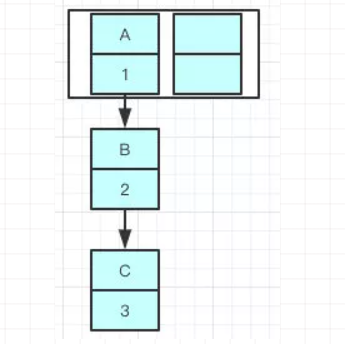
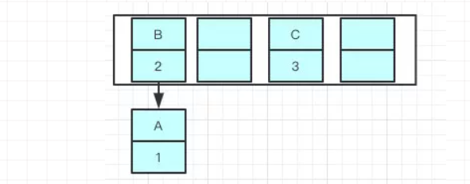
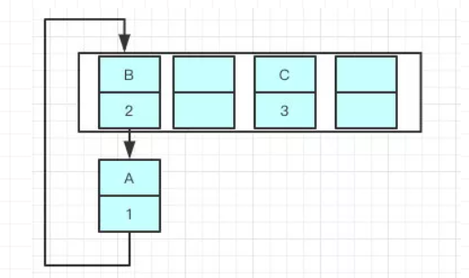
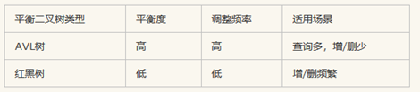
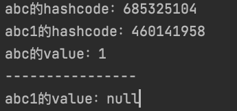
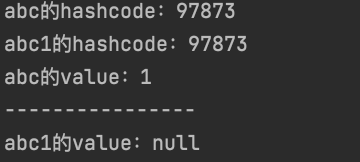
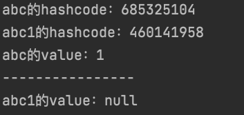

# HashMap源码分析

JDK1.8

## 构造方法

```java
    /**
     * The default initial capacity - MUST be a power of two.
     */
    static final int DEFAULT_INITIAL_CAPACITY = 1 << 4; // 默认大小 16

    /**
     * The maximum capacity, used if a higher value is implicitly specified
     * by either of the constructors with arguments.
     * MUST be a power of two <= 1<<30.
     */
    static final int MAXIMUM_CAPACITY = 1 << 30;////最大容量 2的30次方

    /**
     * The next size value at which to resize (capacity * load factor).
     */
    int threshold;////哈希表内元素数量的阈值，当哈希表内元素数量超过阈值时，会发生扩容resize()。

    /**
     * The load factor for the hash table.
     */
    final float loadFactor;
    /**
     * The load factor used when none specified in constructor.
     */
    static final float DEFAULT_LOAD_FACTOR = 0.75f;//默认加载因子0.75

    //同时指定初始化容量 以及 加载因子， 用的很少，一般不会修改loadFactor
    public HashMap(int initialCapacity, float loadFactor) {
            if (initialCapacity < 0)
                throw new IllegalArgumentException("Illegal initial capacity: " +
                                                   initialCapacity);
            if (initialCapacity > MAXIMUM_CAPACITY)
                initialCapacity = MAXIMUM_CAPACITY;//1<<30
            if (loadFactor <= 0 || Float.isNaN(loadFactor)) // NAN Not a Number
                throw new IllegalArgumentException("Illegal load factor: " +
                                                   loadFactor);
            this.loadFactor = loadFactor;
            this.threshold = tableSizeFor(initialCapacity);//Returns a power of two size for the given target capacity.
        }

    /**
     * Constructs an empty <tt>HashMap</tt> with the specified initial
     * capacity and the default load factor (0.75).
     *
     * @param  initialCapacity the initial capacity.
     * @throws IllegalArgumentException if the initial capacity is negative.
     */
    public HashMap(int initialCapacity) {
        this(initialCapacity, DEFAULT_LOAD_FACTOR);
    }

    /**
     * Constructs an empty <tt>HashMap</tt> with the default initial capacity
     * (16) and the default load factor (0.75).
     * 我们最常使用的构造方法，其他两个参数会在resize方法里面进行初始化
     */
    public HashMap() {
        this.loadFactor = DEFAULT_LOAD_FACTOR; // all other fields defaulted
    }
	/**
     * Constructs a new <tt>HashMap</tt> with the same mappings as the
     * specified <tt>Map</tt>.  The <tt>HashMap</tt> is created with
     * default load factor (0.75) and an initial capacity sufficient to
     * hold the mappings in the specified <tt>Map</tt>.
     *
     * @param   m the map whose mappings are to be placed in this map
     * @throws  NullPointerException if the specified map is null
     */
    public HashMap(Map<? extends K, ? extends V> m) {
        this.loadFactor = DEFAULT_LOAD_FACTOR;
        putMapEntries(m, false);//新建一个哈希表，同时将另一个map m 里的所有元素加入表中
    }
```

initialCapacity 初始容量（默认16）： hashMap底层由数组实现+链表（或红黑树）实现，但是还是从数组开始，所以当储存的数据越来越多的时候，就必须进行扩容操作，如果在知道需要储存数据大小的情况下，指定合适的初始容量，可以避免不必要的扩容操作，提升效率

threshold 阈值：hashMap所能容纳的最大价值对数量，如果超过则需要扩容，计算方式：threshold = initialCapacity * loadFactor

loadFactor 加载因子（默认0.75）：当负载因子较大时，去给table数组扩容的可能性就会少，所以相对占用内存较少（空间上较少），但是每条entry链上的元素会相对较多，查询的时间也会增长（时间上较多）。反之就是，负载因子较少的时候，给table数组扩容的可能性就高，那么内存空间占用就多，但是entry链上的元素就会相对较少，查出的时间也会减少。所以才有了负载因子是时间和空间上的一种折中的说法。所以设置负载因子的时候要考虑自己追求的是时间还是空间上的少。（一般情况下不需要设置，系统给的默认值已经比较适合了）

capacity是数组容量

size是链表的长度和红黑树的节点数之和

## 扩容函数resize

```java
transient Node<K,V>[] table;//哈希桶（底层数组），每个桶里放的是链表

final Node<K,V>[] resize() {
        //oldTab 为当前表的哈希桶
        Node<K,V>[] oldTab = table;
        //当前哈希桶的容量 length
        int oldCap = (oldTab == null) ? 0 : oldTab.length;
    	//当前的阈值
        int oldThr = threshold;
    	//初始化新的容量和阈值为0
        int newCap, newThr = 0;
    
    	//如果当前容量大于0，已经初始化了，然后进行扩容的情况
        if (oldCap > 0) {
            //如果当前容量已经到达上限
            if (oldCap >= MAXIMUM_CAPACITY) {
                threshold = Integer.MAX_VALUE;//2的31次方-1
                return oldTab;// //同时返回当前的哈希桶，不再扩容
            }//否则新的容量为旧的容量的两倍。 
            else if ((newCap = oldCap << 1) < MAXIMUM_CAPACITY &&
                     oldCap >= DEFAULT_INITIAL_CAPACITY)
                newThr = oldThr << 1; // double threshold 那么新的阈值也等于旧的阈值的两倍
        }
    
        //如果当前表是空的，但是有阈值。代表是初始化时指定了容量、阈值的情况，初始化情况
        else if (oldThr > 0) // initial capacity was placed in threshold
            newCap = oldThr;//那么新表的容量就等于旧的阈值
        //如果当前表是空的，而且也没有阈值。代表是初始化时没有任何容量/阈值参数的情况 
        else {               // zero initial threshold signifies using defaults
            newCap = DEFAULT_INITIAL_CAPACITY;//此时新表的容量为默认的容量 16
            newThr = (int)(DEFAULT_LOAD_FACTOR * DEFAULT_INITIAL_CAPACITY);//新的阈值为默认容量16 * 默认加载因子0.75f = 12
        }
    
        if (newThr == 0) {//如果新的阈值是0，对应的是  当前表是空的，但是有阈值的情况
            float ft = (float)newCap * loadFactor;//根据新表容量 和 加载因子 求出新的阈值
            //判断是否新值越界
            newThr = (newCap < MAXIMUM_CAPACITY && ft < (float)MAXIMUM_CAPACITY ?
                      (int)ft : Integer.MAX_VALUE);
        }
        //更新阈值
        threshold = newThr;
        //更新哈希桶
        @SuppressWarnings({"rawtypes","unchecked"})
        Node<K,V>[] newTab = (Node<K,V>[])new Node[newCap];
        table = newTab;
    	
    	//如果以前的哈希桶中有元素，下面开始将当前哈希桶中的所有节点转移到新的哈希桶中
        if (oldTab != null) {
            //遍历老的哈希桶
            for (int j = 0; j < oldCap; ++j) {
                
                Node<K,V> e;
                //如果当前桶中有元素,则将链表赋值给e
                if ((e = oldTab[j]) != null) {
                    //原桶制空，以便GC
                    oldTab[j] = null;
                    //没有下一个节点（没发生哈希碰撞）
                    if (e.next == null)
                        //直接将这个元素放置在新的哈希桶里。
                        //注意这里取下标 是用 哈希值 与 桶的长度-1 。 由于桶的长度是2的n次方，这么做其实是等于一个模运算。但是效率更高（就是心桶取模放入）
                        newTab[e.hash & (newCap - 1)] = e;
                    //如果发生过哈希碰撞 ,而且是节点数超过8个，转化成了红黑树,小于6转链表
                    else if (e instanceof TreeNode)
                        ((TreeNode<K,V>)e).split(this, newTab, j, oldCap);
                    else { // preserve order  如果发生过哈希碰撞，节点数小于8个。则要根据链表上每个节点的哈希值，依次放入新哈希桶对应下标位置。
                        
//因为扩容是容量翻倍，所以原链表上的每个节点，现在可能存放在原来的下标，即low位， 或者扩容后的下标，即high位。 high位=  low位+原哈希桶容量
					  //低、高位链表的头结点、尾节点
                        Node<K,V> loHead = null, loTail = null;
                        Node<K,V> hiHead = null, hiTail = null;
                        Node<K,V> next;//临时节点
                        do {
                            next = e.next;                
                            //这里又是一个利用位运算 代替常规运算的高效点： 利用哈希值 与 旧的容量，可以得到哈希值去模后，是大于等于oldCap还是小于oldCap，等于0代表小于oldCap，应该存放在低位，否则存放在高位
                            //低位
                            if ((e.hash & oldCap) == 0) {
                                if (loTail == null)
                                    loHead = e;
                                else
                                    loTail.next = e;
                                loTail = e;
                            }
                            //高位
                            else {
                                if (hiTail == null)
                                    hiHead = e;
                                else
                                    hiTail.next = e;
                                hiTail = e;
                            }
                        } while ((e = next) != null);//循环直到链表结束
                        //低位保持不变
                        if (loTail != null) {
                            loTail.next = null;
                            newTab[j] = loHead;
                        }
                        //将高位链表存放在新index处
                        if (hiTail != null) {
                            hiTail.next = null;
                            newTab[j + oldCap] = hiHead;
                        }
                    }
                }
            }
        }
        return newTab;
    }
```

- 首先先判断当前table是否进行过初始化，如果没有进行过初始化，此处就解决了调用无参构造方法时候，threshold和initialCapacity 未初始化的问题，如果已经初始化过了，则进行扩容，容量为原来的二倍
- 如果新计算的位置数据为空，则直接插入
- 如果新计算的位置为链表，则通过hash算法重新计算下标，对链表进行分组
- 如果是红黑树，则需要进行拆分操作

关于扩容后元素的迁移，JDK8则因为巧妙的设计，性能有了大大的提升：由于数组的容量是以2的幂次方扩容的，那么一个Entity在扩容时，新的位置要么在**原位置**，要么在**原长度+原位置**的位置。

https://zhuanlan.zhihu.com/p/114363420

## put方法

```java
    public V put(K key, V value) {
        return putVal(hash(key), key, value, false, true);
    }	
    final V putVal(int hash, K key, V value, boolean onlyIfAbsent,
                   boolean evict) {
        Node<K,V>[] tab;
        Node<K,V> p;
        int n, i;
        //1.如果table尚未初始化，则此处进行初始化数组，并赋值初始容量，重新计算阈值
        if ((tab = table) == null || (n = tab.length) == 0)
            n = (tab = resize()).length;//扩容
        
        // 2.通过hash找到下标，如果hash值指定的位置数据为空，表示没有发生哈希碰撞。
        if ((p = tab[i = (n - 1) & hash]) == null)
            // 直接构建一个新节点Node，挂载在index处即可。
            tab[i] = newNode(hash, key, value, null);
        else {
            
            //3.如果通过hash找到的位置有数据，发生碰撞
            Node<K,V> e; K k;
            
            //3.1如果哈希值相等，key也相等，则是覆盖value操作
            if (p.hash == hash &&
                ((k = p.key) == key || (key != null && key.equals(k))))
                e = p;
            
            //3.2如果此时桶中数据类型为 treeNode，使用红黑树进行插入
            else if (p instanceof TreeNode)
                e = ((TreeNode<K,V>)p).putTreeVal(this, tab, hash, key, value);
            
            else { //3.3此时桶中数据类型为链表
               
                // 进行循环
                for (int binCount = 0; ; ++binCount) {
                    if ((e = p.next) == null) {
                        //遍历到尾部，追加新节点到尾部
                        p.next = newNode(hash, key, value, null);
                        //如果追加节点后，链表数量》=8，则转化为红黑树
                        if (binCount >= TREEIFY_THRESHOLD - 1) // TREEIFY_THRESHOLD = 8
                            treeifyBin(tab, hash);
                        break;
                    }
                    //如果链表中有新插入的节点位置数据不为空，则此时e 赋值为节点的值，跳出循环
                    if (e.hash == hash &&
                        ((k = e.key) == key || (key != null && key.equals(k))))
                        break;
                    p = e;
                }
            }
        //经过上面的循环后，如果e不为空，则说明上面插入的值已经存在于当前的hashMap中，那么更新指定位置的键值对
            if (e != null) { // existing mapping for key
                V oldValue = e.value;
                if (!onlyIfAbsent || oldValue == null)
                    e.value = value;
                afterNodeAccess(e);
                return oldValue;
            }
        }
        ++modCount;
        //如果此时hashMap size大于阈值，则进行扩容
        if (++size > threshold)
            resize();
        afterNodeInsertion(evict);
        return null;
    }
```

* table如果未初始化，调用resize()进行扩容
* 已初始化，通过hash找到位置为空，直接new个Node放到该位置
* 已初始化，通过hash找到位置不为空，发生hash碰撞
  * 如果key相等执行覆盖操作
  * 如果是红黑树，使用红黑树插入
  * 如果是链表，链表中key相同直接覆盖，否则放到队尾，判断是否需要要扩容

## get方法

```java
public V get(Object key) {
    Node<K,V> e;
    return (e = getNode(hash(key), key)) == null ? null : e.value;
}
final Node<K,V> getNode(int hash, Object key) {
        Node<K,V>[] tab; Node<K,V> first, e; int n; K k;
    	//找到返回节点，否则返回null
        if ((tab = table) != null && (n = tab.length) > 0 &&
            (first = tab[(n - 1) & hash]) != null) {
            if (first.hash == hash && // always check first node
                ((k = first.key) == key || (key != null && key.equals(k))))
                return first;
            if ((e = first.next) != null) {
                if (first instanceof TreeNode)
                    return ((TreeNode<K,V>)first).getTreeNode(hash, key);
                do {
                    if (e.hash == hash &&
                        ((k = e.key) == key || (key != null && key.equals(k))))
                        return e;
                } while ((e = e.next) != null);
            }
        }
        return null;
}
```

##### hash（key）

```java
static final int hash(Object key) {
    int h;
    return (key == null) ? 0 : (h = key.hashCode()) ^ (h >>> 16);
}
```

key.hashCode()，获取key的hashCode值，如果不进行重写的话返回的是根据内存地址得到的一个int值

key.hashCode() 获取到的hashcode无符号右移16位并和元hashCode进行^ ，这样做的目的是为了让高位与低进行混合，让两者都参与运算，以便让hash值分布更加均匀

#####  取模运算 (n - 1) & hash

```java
first = tab[(n - 1) & hash]) 
```

只有容量为2的n次幂的时候，(n - 1) & hash 才能等效hash%n，&的s效率要远高于%。

## 1.8改为尾插法

假如扩容前A->B->C



由于采用头插法，扩容时从链表头开始移动，扩容后有可能变成B->A



多线程情况下有可能出现环形链表



这个时候去取值就会出现Infinite Loop的情况

**使用头插**会改变链表的上的顺序，但是如果**使用尾插**，在扩容时会保持链表元素原本的顺序，就不会出现链表成环的问题了。

## hashmap为什么用红黑树不用普通的AVL树？



**AVL树**是最先发明的自平衡二叉查找树。**在AVL树中任何节点的两个子树的高度最大差别为1**，所以它也被称为**高度平衡树**。

红黑树:

也是一种平衡二叉树，但每个节点有一个存储位表示节点的颜色，可以是红或黑。通过对任何一条从根到叶子的路径上各个节点着色的方式的限制，红黑树确保没有一条路径会比其它路径长出两倍，因此，红黑树是一种弱平衡二叉树**红黑树从根到叶子的最长路径不会超过最短路径的2倍**（由于是弱平衡，可以看到，在相同的节点情况下，AVL树的高度<=红黑树），相对于要求严格的AVL树来说，它的旋转次数少，所以对于搜索，插入，删除操作较多的情况下，用红黑树

## 为什么8转红黑树

原因：

　　红黑树的平均查找长度是log(n)，长度为8，查找长度为log(8)=3，链表的平均查找长度为n/2，当长度为8时，平均查找长度为8/2=4，这才有转换成树的必要；链表长度如果是小于等于6，6/2=3，虽然速度也很快的，但是转化为树结构和生成树的时间并不会太短。

还有选择6和8的原因是：

　　中间有个差值7可以防止链表和树之间频繁的转换。假设一下，如果设计成链表个数超过8则链表转换成树结构，链表个数小于8则树结构转换成链表，如果一个HashMap不停的插入、删除元素，链表个数在8左右徘徊，就会频繁的发生树转链表、链表转树，效率会很低。

## 如果对象做key需要重写哪两个方法

equals、hashcode

每个数组里存储的Node对象中

```java
static class Node<K,V> implements Map.Entry<K,V> {

    final int hash;// hash值
    final K key;
    V value;
    Node<K,V> next; // 指针 
```


---

### 测试

```java
public class User {

    private int age;
    private String name;

    public int getAge() {
        return age;
    }

    public void setAge(int age) {
        this.age = age;
    }

    public String getName() {
        return name;
    }

    public void setName(String name) {
        this.name = name;
    }

    public User(int age, String name) {
        this.age = age;
        this.name = name;
    }

    @Override
    public boolean equals(Object o) {
        if (this == o) return true;
        if (o == null || getClass() != o.getClass()) return false;
        User user = (User) o;
        return age == user.age && name.equals(user.name);
    }

    @Override
    public int hashCode() {
        return Objects.hash(age, name);
    }
}
```

```java
public class HashCodeTest {

    public static void main(String[] args) {
        HashMap<User, Integer> map = new HashMap<>();
        User abc = new User(18, "abc");
        User abc1 = new User(18, "abc");

        System.out.println("abc的hashcode："+ abc.hashCode());
        System.out.println("abc1的hashcode："+ abc1.hashCode());

        map.put(abc,1);
        System.out.println("abc的value："+map.get(abc));
        System.out.println("----------------");
        System.out.println("abc1的value："+map.get(abc1));
    }


}
```

---

注释掉hashCode方法和equals方法



注释掉equals方法，hashCode相同，不同对象相同的值获取不到对应的value



注释掉hashCode方法，同1



### 分析

```java
public V get(Object key) {
    Node<K,V> e;
    // 相同的hash再去链表中 
    return (e = getNode(hash(key), key)) == null ? null : e.value;
}
```

```java
final Node<K,V> getNode(int hash, Object key) {
    Node<K,V>[] tab; Node<K,V> first, e; int n; K k;
    if ((tab = table) != null && (n = tab.length) > 0 &&
        (first = tab[(n - 1) & hash]) != null) {
        if (first.hash == hash && // always check first node
            // equals判断相等
            ((k = first.key) == key || (key != null && key.equals(k))))
            return first;
        if ((e = first.next) != null) {
            if (first instanceof TreeNode)
                return ((TreeNode<K,V>)first).getTreeNode(hash, key);
            do {
                if (e.hash == hash &&
                    ((k = e.key) == key || (key != null && key.equals(k))))
                    return e;
            } while ((e = e.next) != null);
        }
    }
    return null;
}
```