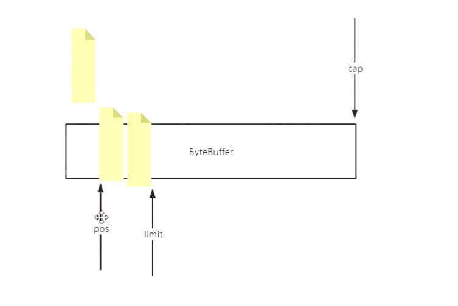

# Linux系统IO原理


系统内核和用户应用在操作系统眼里都是程序（物理上）


应用程序眼中自己拥有全部的内存空间（逻辑上）


多个程序访问同一文件，第一个程序访问时kernel首先让VFS(虚拟文件系统)读取磁盘中的数据到pagecache中，当下次再有另一个程序访问相同文件时，首先取pagecache（4k）中去寻找缓存，命中直接返回。两个程序维护自己的fd指针文件标识符，互不影响。当程序修改文件内容时，pagecache被标记为脏，等待kernel决定何时Flush进磁盘。


## pageCache

kernel这种方案，优化了IO性能，但是有丢失文件的风险


bufferedStream默认8k，比普通的stream快，因为写满8k才会系统调用到内核态，此时只是写到kernel的cache还是有可能丢失，

## ByteBuffer

```java
 @Test
    public  void whatByteBuffer(){

//        ByteBuffer buffer = ByteBuffer.allocate(1024);
        ByteBuffer buffer = ByteBuffer.allocateDirect(1024);


        System.out.println("postition: " + buffer.position());
        System.out.println("limit: " +  buffer.limit());
        System.out.println("capacity: " + buffer.capacity());
        System.out.println("mark: " + buffer);

        buffer.put("123".getBytes());

        System.out.println("-------------put:123......");
        System.out.println("mark: " + buffer);

        buffer.flip();   //读写交替

        System.out.println("-------------flip......");
        System.out.println("mark: " + buffer);

        buffer.get();

        System.out.println("-------------get......");
        System.out.println("mark: " + buffer);

        buffer.compact();

        System.out.println("-------------compact......");
        System.out.println("mark: " + buffer);

        buffer.clear();

        System.out.println("-------------clear......");
        System.out.println("mark: " + buffer);

    }
```


初始状态三个指针


​      调用 buffer.put("123".getBytes());放入三个字节


​        buffer.flip();   //读写交替



​        buffer.get();读出一个字节


​        buffer.compact();挤掉多余空间

## RandomAccessFile

```java
  public static void testRandomAccessFileWrite() throws  Exception {
//--------------------普通写入---------------

        RandomAccessFile raf = new RandomAccessFile(path, "rw");

        raf.write("hello mashibing\n".getBytes());//hello mashibing\n
        raf.write("hello seanzhou\n".getBytes());
        System.out.println("write------------");
        System.in.read();
//-------------------随机写入--------------------------------
        raf.seek(4); //在第5个字节写入
        raf.write("ooxx".getBytes());//hellooxxshibing\n

        System.out.println("seek---------");
        System.in.read();
//--------------------堆外写入-------------------------
        FileChannel rafchannel = raf.getChannel();
        //mmap  堆外  和文件映射的   byte  not  objtect
        MappedByteBuffer map = rafchannel.map(FileChannel.MapMode.READ_WRITE, 0, 4096);


        map.put("@@@".getBytes());  //不是系统调用  但是数据会到达 内核的pagecache
            //曾经我们是需要out.write()  这样的系统调用，才能让程序的data 进入内核的pagecache
            //曾经必须有用户态内核态切换
            //mmap的内存映射，依然是内核的pagecache体系所约束的！！！
            //换言之，丢数据
            //你可以去github上找一些 其他C程序员写的jni扩展库，使用linux内核的Direct IO
            //直接IO是忽略linux的pagecache
            //是把pagecache  交给了程序自己开辟一个字节数组当作pagecache，动用代码逻辑来维护一致性/dirty。。。一系列复杂问题
//@@@looxxshibing\n 文件大小4096
        System.out.println("map--put--------");
        System.in.read();

//        map.force(); //  flush

//------------------------buffer写入-----------------------------

        raf.seek(0);

        ByteBuffer buffer = ByteBuffer.allocate(8192);
//        ByteBuffer buffer = ByteBuffer.allocateDirect(1024);

        int read = rafchannel.read(buffer);   //buffer.put()
        System.out.println(buffer);
        buffer.flip();
        System.out.println(buffer);

        for (int i = 0; i < buffer.limit(); i++) {
            Thread.sleep(200);
            System.out.print(((char)buffer.get(i)));
        }


    }
```


## TCP																										  


客户端和服务端分别有自己的窗口，大小可能不一致，当服务端满了时候会通知客户端不要发（拥塞控制）等服务端窗口有富裕后再进行发送，否则数据就会丢失。


## 网络IO

同步

异步

阻塞

非阻塞


### NIO


```java
public class SocketNIO {

    //  what   why  how
    public static void main(String[] args) throws Exception {

        LinkedList<SocketChannel> clients = new LinkedList<>();

        ServerSocketChannel ss = ServerSocketChannel.open();  //服务端开启监听：接受客户端
        ss.bind(new InetSocketAddress(9090));
        ss.configureBlocking(false); //重点  OS  NONBLOCKING!!!  //只让接受客户端  不阻塞

//        ss.setOption(StandardSocketOptions.TCP_NODELAY, false);
//        StandardSocketOptions.TCP_NODELAY
//        StandardSocketOptions.SO_KEEPALIVE
//        StandardSocketOptions.SO_LINGER
//        StandardSocketOptions.SO_RCVBUF
//        StandardSocketOptions.SO_SNDBUF
//        StandardSocketOptions.SO_REUSEADDR

        while (true) {
            //接受客户端的连接
            Thread.sleep(1000);
            SocketChannel client = ss.accept(); //不会阻塞？  -1 NULL
            //accept  调用内核了：1，没有客户端连接进来，返回值？在BIO 的时候一直卡着，但是在NIO ，不卡着，返回-1，NULL
            //如果来客户端的连接，accept 返回的是这个客户端的fd  5，client  object
            //NONBLOCKING 就是代码能往下走了，只不过有不同的情况

            if (client == null) {
             //   System.out.println("null.....");
            } else {
                client.configureBlocking(false); //重点  socket（服务端的listen socket<连接请求三次握手后，往我这里扔，我去通过accept 得到  连接的socket>，连接socket<连接后的数据读写使用的> ）
                int port = client.socket().getPort();
                System.out.println("client..port: " + port);
                clients.add(client);
            }

            ByteBuffer buffer = ByteBuffer.allocateDirect(4096);  //可以在堆里   堆外

            //遍历已经链接进来的客户端能不能读写数据
            for (SocketChannel c : clients) {   //串行化！！！！  多线程！！
                int num = c.read(buffer);  // >0  -1  0   //不会阻塞
                if (num > 0) {
                    buffer.flip();
                    byte[] aaa = new byte[buffer.limit()];
                    buffer.get(aaa);

                    String b = new String(aaa);
                    System.out.println(c.socket().getPort() + " : " + b);
                    buffer.clear();
                }


            }
        }
    }

}
```