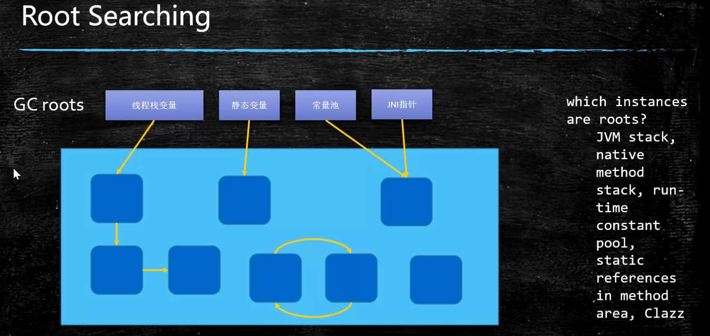
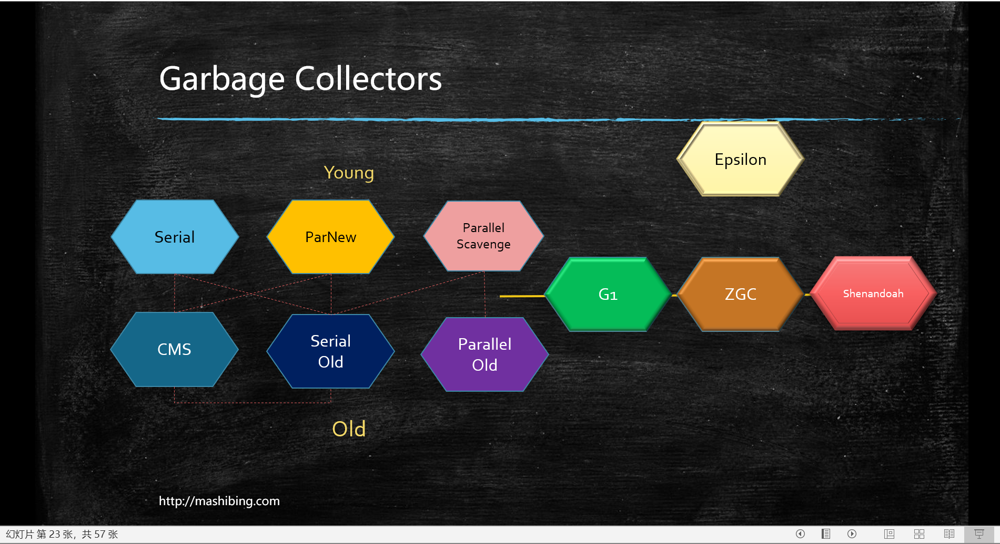

# JVM

# Java从编码到执行


我们编写的.java文件通过javac编译成字节码.class文件，.class文件会被ClassLoader装载到内存并把相关的java类库也装载到内存，然后调用字节码解释器（Bytecode intepreter）或即时编译器（Just in Time Compiler）来进行解释和编译，最终由执行引擎来执行（面向os硬件）。


java是解释和编译混合执行的，常用的代码通过及时编译器做成本地的（可以理解为C语言编译成.exe,下次使用时就不会通过解释器来执行了），执行引擎能够直接交给操作系统。


## JVM与java无关


任何语言只要能编译成class文件就能够被JVM执行。

## JVM JRE JDK


# ClassFileFormat

class文件是二进制字节流

## 数据类型

u1 u2 u4 u8 和_info（表类型）

 

CA FE BA BE标识java编译后的Class文件（十六进制）


# Class Loading & Linking & Initializing

## 加载过程

.class文件被ClassLoader加载到内存，还会生成一个class对象指向class文件的物理地址，其他对象通过这个对象来访问这个文件。


### Loading


1. **双亲委派**，，将class文件装载到内存，自底向上询问是否被加载，如被加载直接返回，如果到顶级ClassLoader都没被加载，Bootstrap会向下委派进行加载，如果都没有找到合适的加载方向，ClassNotFound。


**双亲委派的原因：**
（1）主要是为了安全性，避免用户自己编写的类动态替换 Java的一些核心类，比如 String。
（2）同时也避免了类的重复加载，因为 JVM中区分不同类，不仅仅是根据类名，相同的 class文件被不同的 ClassLoader加载就是不同的两个类。

#### 自定义类加载器

```java
public class T005_LoadClassByHand {
    public static void main(String[] args) throws ClassNotFoundException {
        Class clazz = T005_LoadClassByHand.class.getClassLoader().loadClass("com.mashibing.jvm.c2_classloader.T002_ClassLoaderLevel");
        System.out.println(clazz.getName());
    }
}

```

```java
// ClassLoader
private final ClassLoader parent;

public Class<?> loadClass(String name) throws ClassNotFoundException {
    return loadClass(name, false); //加载文件进内存，并创建指向该物理地址的CLASS对象，返回
}

protected Class<?> loadClass(String name, boolean resolve)
        throws ClassNotFoundException
    {
    //加载的时候肯定要加锁
        synchronized (getClassLoadingLock(name)) {
            // First, check if the class has already been loaded
            Class<?> c = findLoadedClass(name);
            if (c == null) {
                long t0 = System.nanoTime();
                try {
                    if (parent != null) {
                        c = parent.loadClass(name, false);//委派过程
                    } else {
                        c = findBootstrapClassOrNull(name);
                    }
                } catch (ClassNotFoundException e) {
                    // ClassNotFoundException thrown if class not found
                    // from the non-null parent class loader
                }

                if (c == null) {
                    // If still not found, then invoke findClass in order
                    // to find the class.
                    long t1 = System.nanoTime();
                    c = findClass(name);

                    // this is the defining class loader; record the stats
                    sun.misc.PerfCounter.getParentDelegationTime().addTime(t1 - t0);
                    sun.misc.PerfCounter.getFindClassTime().addElapsedTimeFrom(t1);
                    sun.misc.PerfCounter.getFindClasses().increment();
                }
            }
            if (resolve) {
                resolveClass(c);
            }
            return c;
        }
    }
//父类都找不到的情况下，自定义时，自己重写该方法，模板方法、钩子函数,protected只能子类继承才能重写
protected Class<?> findClass(String name) throws ClassNotFoundException {
        throw new ClassNotFoundException(name);
    }
```

```java
//自定义类加载器  
public class T006_MSBClassLoader extends ClassLoader {
   
       @Override
       protected Class<?> findClass(String name) throws ClassNotFoundException {
           File f = new File("c:/test/", name.replace(".", "/").concat(".class"));
           try {
               FileInputStream fis = new FileInputStream(f);
               ByteArrayOutputStream baos = new ByteArrayOutputStream();
               int b = 0;
   
               while ((b=fis.read()) !=0) {
                   baos.write(b);
               }
   
               byte[] bytes = baos.toByteArray();
               baos.close();
               fis.close();//可以写的更加严谨
   
               return defineClass(name, bytes, 0, bytes.length);
           } catch (Exception e) {
               e.printStackTrace();
           }
           return super.findClass(name); //throws ClassNotFoundException
       }
```
1. LazyLoading 五种情况

   1. –new getstatic putstatic invokestatic指令，访问final变量除外

      –java.lang.reflect对类进行反射调用时

      –初始化子类的时候，父类首先初始化

      –虚拟机启动时，被执行的主类必须初始化

      –动态语言支持java.lang.invoke.MethodHandle解析的结果为REF_getstatic REF_putstatic REF_invokestatic的方法句柄时，该类必须初始化

      ```java
      public class T008_LazyLoading { //严格讲应该叫lazy initialzing，因为java虚拟机规范并没有严格规定什么时候必须loading,但严格规定了什么时候initialzing
          public static void main(String[] args) throws Exception {
              P p;//  什么也没打印
              X x = new X(); // P X
              System.out.println(P.i);//8 final修饰的变量不需要被加载
              System.out.println(P.j);//P 9 类被加载
              Class.forName("com.mashibing.jvm.c2_classloader.T008_LazyLoading$P");//$表示访问内部类 P
      
          }
      
          public static class P {
              final static int i = 8;
              static int j = 9;
              static {
                  System.out.println("P");
              }
          }
      
          public static class X extends P {
              static {
                  System.out.println("X");
              }
          }
      }
      ```

2. 自定义类加载器

   1. extends ClassLoader
   2. overwrite findClass() -> defineClass(byte[] -> Class clazz)
   3. 加密

      1. 双亲委派的打破
         1. 如何打破：重写loadClass（）
         2. 何时打破过？
            1. JDK1.2之前，自定义ClassLoader都必须重写loadClass()
            2. ThreadContextClassLoader可以实现基础类调用实现类代码，通过thread.setContextClassLoader指定
            3. 热启动，热部署

               osgi tomcat 都有自己的模块指定classloader（可以加载同一类库的不同版本），直接干掉classloader实现重新加载。

8. 混合执行 编译执行 解释执行

   1. 检测热点代码：-XX:CompileThreshold = 10000

### Linking 

1. Verification
   1. 验证文件是否符合JVM规定
2. Preparation
   1. **静态成员变量赋默认值**
3. Resolution
   1. 将类、方法、属性等符号引用解析为直接引用
      常量池中的各种符号引用解析为指针、偏移量等内存地址的直接引用

### Initializing

1. 调用类初始化代码 <clinit>，**给静态成员变量赋初始值**

1. 小总结：

   1. load - 默认值 - 初始值
   2. new - 申请内存 - 默认值 - 初始值

# JMM

Java Memory Model


## 硬件层数据一致性


Modified:自己修改过

Invalid：别人改过

Exclusive：只有自己在用，别人没办法读

Shared：自己读的时候别人也在读

协议很多

intel 用MESI

https://www.cnblogs.com/z00377750/p/9180644.html

现代CPU的数据一致性实现 = 缓存锁(MESI ...) + 总线锁

读取缓存以cache line为基本单位，目前64bytes

位于同一缓存行的两个不同数据，被两个不同CPU锁定，产生互相影响的**伪共享问题**

伪共享问题：JUC/c_028_FalseSharing

使用缓存行的对齐能够提高效率

## 乱序问题

CPU为了提高指令执行效率，会在一条指令执行过程中（比如去内存读数据（慢100倍）），去同时执行另一条指令，前提是，两条指令没有依赖关系

https://www.cnblogs.com/liushaodong/p/4777308.html

写操作也可以进行合并

https://www.cnblogs.com/liushaodong/p/4777308.html

JUC/029_WriteCombining

乱序执行的证明：JVM/jmm/Disorder.java

原始参考：https://preshing.com/20120515/memory-reordering-caught-in-the-act/

## 如何保证特定情况下不乱序

硬件内存屏障 X86

>  sfence:  store| 在sfence指令前的写操作当必须在sfence指令后的写操作前完成。
>  lfence：load | 在lfence指令前的读操作当必须在lfence指令后的读操作前完成。
>  mfence：modify/mix | 在mfence指令前的读写操作当必须在mfence指令后的读写操作前完成。

> 原子指令，如x86上的”lock …” 指令是一个Full Barrier，执行时会锁住内存子系统来确保执行顺序，甚至跨多个CPU。Software Locks通常使用了内存屏障或原子指令来实现变量可见性和保持程序顺序

JVM级别如何规范（JSR133）

> LoadLoad屏障：
> 	对于这样的语句Load1; LoadLoad; Load2， 
>
> 	在Load2及后续读取操作要读取的数据被访问前，保证Load1要读取的数据被读取完毕。
>
> StoreStore屏障：
>
> 	对于这样的语句Store1; StoreStore; Store2，
> 	
> 	在Store2及后续写入操作执行前，保证Store1的写入操作对其它处理器可见。
>
> LoadStore屏障：
>
> 	对于这样的语句Load1; LoadStore; Store2，
> 	
> 	在Store2及后续写入操作被刷出前，保证Load1要读取的数据被读取完毕。
>
> StoreLoad屏障：
> 	对于这样的语句Store1; StoreLoad; Load2，
>
> ​	 在Load2及后续所有读取操作执行前，保证Store1的写入对所有处理器可见。

volatile的实现细节

1. 字节码层面
   加了ACC_VOLATILE，JVM读取到该关键字

2. JVM层面
   volatile内存区的读写 都加屏障

   > StoreStoreBarrier
   >
   > volatile 写操作
   >
   > StoreLoadBarrier

   > LoadLoadBarrier
   >
   > volatile 读操作
   >
   > LoadStoreBarrier

3. OS和硬件层面
   https://blog.csdn.net/qq_26222859/article/details/52235930
   hsdis - HotSpot Dis Assembler HotSpot反汇编
   windows lock 指令实现 | MESI实现

synchronized实现细节

1. 字节码层面
   
   加在方法上
   
   ACC_SYNCHRONIZED
   
   加在同步语句块上
   
   > monitorenter //开始监视
   >
   > 加锁的指令
   >
   > monitorexit//退出监视
   
   ​	
   
2. JVM层面
   C C++ 调用了操作系统提供的同步机制

3. OS和硬件层面
   X86 : lock cmpxchg / xxx
   [https](https://blog.csdn.net/21aspnet/article/details/88571740)[://blog.csdn.net/21aspnet/article/details/](https://blog.csdn.net/21aspnet/article/details/88571740)[88571740](https://blog.csdn.net/21aspnet/article/details/88571740)

## 对象的创建过程

### 创建CLASS过程

1.class loading

2.class linking(verification,preparation,resolution)

3.class initializing

### new 对象的过程

4.申请对象内存

5.成员变量赋默认值

6.调用构造方法<init>

​	成员变量赋初始值，执行构造方法语句

## 对象在内存中的存储布局

### 观察虚拟机配置

java -XX:+PrintCommandLineFlags -version

### 普通对象

1. 对象头：markword  8字节
2. ClassPointer指针，指向Class对象：-XX:+UseCompressedClassPointers（压缩） 为4字节 不开启为8字节 
3. 实例数据（成员变量）
   1. 引用类型：-XX:+UseCompressedOops 为4字节 不开启为8字节 
      Oops Ordinary Object Pointers
4. Padding对齐，按块读对齐，8的倍数

### 数组对象

1. 对象头：markword 8字节
2. ClassPointer指针同上
3. 数组长度：4字节
4. 数组数据
5. 对齐 8的倍数

## 对象头包括什么


markword中有两位代表是否被锁定syn ，无锁状态时有一位代表是否是偏向锁，25位hashCode

gc标记4位，表示分代年龄


## 对象是怎么定位的

1.句柄池

2.直接指针

•https://blog.csdn.net/clover_lily/article/details/80095580

## 对象是怎么分配的


# Runtime Data Area and Instruction Set

运行时数据区和指令集

```java
public class TestIPulsPlus {
    public static void main(String[] args) {
        int i = 8;
        i = i++;//8
        //i = ++i;//9
        System.out.println(i);
    }
}
```

jvms 2.4 2.5

## 指令集分类

1. 基于寄存器的指令集
2. 基于栈的指令集
   Hotspot中的Local Variable Table = JVM中的寄存器

## Runtime Data Area


### PC 程序计数器

每一个JVM线程都有自己的PC，需要进行线程切换，记录执行到哪条指令

> 存放指令位置
>
> 虚拟机的运行，类似于这样的循环：
>
> while( not end ) {
>
> ​	取PC中的位置，找到对应位置的指令；
>
> ​	执行该指令；
>
> ​	PC ++;
>
> }

### JVM Stack

每一个JVM线程都有自己的Stack


1. Frame - **每个方法对应一个栈帧**
   1. Local Variable Table  局部变量表
   2. Operand Stack  操作数栈
      对于long的处理（store and load），多数虚拟机的实现都是原子的
      jls 17.7，没必要加volatile
   3. Dynamic Linking
      https://blog.csdn.net/qq_41813060/article/details/88379473 
      jvms 2.6.3
   4. return address
      a() -> b()，方法a调用了方法b, b方法的返回值放在什么地方

Heap

### Method Area（逻辑概念）

1. Perm Space (<1.8) 小于1.8版本Method Area的实现

   

2. 字符串常量位于Perm Space
   FGC不会清理，容易OOM
   大小启动的时候指定，不能变

3. Meta Space (>=1.8)大于等于1.8版本Method Area的实现
   字符串常量位于堆
   会触发FGC清理
   不设定的话，最大就是物理内存

### Runtime Constant Pool

常量池

### Native Method Stack

### Direct Memory

> JVM可以直接访问的内核空间的内存 (OS 管理的内存)
>
> NIO ， 提高效率，实现zero copy

思考：

> 如何证明1.7字符串常量位于Perm，而1.8位于Heap？
>
> 结合GC， 一直创建字符串常量，观察堆，和Metaspace


bipush （100小于127用类型，大于127会变成sipush）把100入栈，istore_1，弹栈把i赋值为100


局部变量表多存了this和k，如果是static方法就没有this，**非静态方法局部变量表第0个位置是this**


add（3，4）


### new 对象的过程

new 出来一个对象，这个对象的地址压栈，值是默认值。

dup 复制栈顶元素，两个元素都指向对象

invokespecial 执行构造方法，弹出一个元素，对象已经调用完构造方法，栈中还剩一个

astore_1 弹栈赋值给h

aload_1 入栈h

invokevirtual 调用m1方法


返回值放到了栈帧的顶部

第二个有返回值时，m1返回时往main栈帧上放了一个100

第三个返回值直接弹出赋值给i istore_2

### 递归


iload_1 n=3入栈

iconst_1 常量池中的1入栈

if_icmpne 7（int compare not equal）两个int值弹栈比较 不等跳转到第7条指令

iload_1 3

aload_0 this压栈

iload_1 3

iconst_1

isub 弹栈执行3-1 值2入栈

invokevirtual 执行m(2)方法，还需要传this重复上述 n=1时返回1

imul和返回值相乘

### 线程共享区


## 常用指令

store

load

pop

mul

sub

invoke

1. InvokeStatic
2. InvokeVirtual
3. InvokeInterface
4. InovkeSpecial
   可以直接定位，不需要多态的方法
   private 方法 ， 构造方法
5. InvokeDynamic
   JVM最难的指令
   lambda表达式或者反射或者其他动态语言scala kotlin，或者CGLib ASM，动态产生的class，会用到的指令

# GC和GC Tuning

garbage collector 

### GC的基础知识

#### 1.什么是垃圾

> C语言申请内存：malloc free
>
> C++： new delete
>
> c/C++ 手动回收内存
>
> Java: new ？
>
> 自动内存回收，编程上简单，系统不容易出错，手动释放内存，容易出两种类型的问题：
>
> 1. 忘记回收
> 2. 多次回收

没有任何引用指向的一个对象或者多个对象（循环引用）

#### 2.如何定位垃圾

1. 引用计数（ReferenceCount）

   记录有多少个引用，没有办法解决循环引用问题

2. 根可达算法(RootSearching)

   

   通过根找不到的就是垃圾

#### 3.常见的垃圾回收算法

1. 标记清除(mark sweep) - 位置不连续 产生碎片 效率偏低（两遍扫描）


两遍扫描，先标记下来然后清除，效率偏低，容易产生碎片。存活对象比较多的时候效率比较高。

2. 拷贝算法 (copying) - 没有碎片，浪费空间


把灰色的拷贝到下方未使用的部分，清除上部。需要移动和复制对象，浪费空间，调整引用。适用于存活对象较少的时候，只需要扫描一次，效率较高适合于Eden区 

3. 标记压缩(mark compact) - 没有碎片，效率偏低（两遍扫描，指针需要调整）

   

   扫描两次还要移动对象，效率偏低，没碎片

#### 4.JVM内存分代模型（用于分代垃圾回收算法）


1. 部分垃圾回收器使用的模型

   > 除Epsilon ZGC Shenandoah之外的GC都是使用逻辑分代模型
   >
   > G1是逻辑分代，物理不分代
   >
   > 除此之外不仅逻辑分代，而且物理分代

2. 新生代 + 老年代 + （永久代（1.7）Perm Generation）/ （元数据区(1.8) Metaspace）

   1. 永久代 元数据 - Class
   2. 永久代必须指定大小限制 ，元数据可以设置，也可以不设置，无上限（受限于物理内存）
   3. 字符串常量 1.7 - 永久代，1.8 - 堆
   4. **MethodArea逻辑概念 - 具体实现是永久代、元数据**

3. 新生代 = Eden + 2个suvivor区 

   1. YGC回收之后，大多数的对象会被回收，活着的进入s0
   2. 再次YGC，活着的对象eden + s0 -> s1
   3. 再次YGC，eden + s1 -> s0
   4. 年龄足够 -> 老年代 （15 CMS 6）
   5. s区装不下 -> 老年代

4. 老年代

   1. 顽固分子
   2. 老年代满了FGC Full GC

5. GC Tuning (Generation)

   1. 尽量减少FGC
   2. MinorGC = YGC
   3. MajorGC = FGC

6. 对象分配过程图
   

7. 动态年龄：（不重要）
   https://www.jianshu.com/p/989d3b06a49d

8. 分配担保：（不重要）
   YGC期间 survivor区空间不够了 空间担保直接进入老年代
   参考：https://cloud.tencent.com/developer/article/1082730

#### 一个对象从出生到消亡


首先尝试栈上分配，分配不下进入Eden区，Eden回收（幸存）一次后进入S1，再次回收进入S2，如此交替直到年龄够了进入old区。

Eden回收时会一起回收S1或S2，幸存的到另一个S区


无逃逸，没有引用

#### 对象如何进入老年代


## 5.常见的垃圾回收器（背）



1. JDK诞生 Serial追随 提高效率，诞生了PS，为了配合CMS，诞生了PN，CMS是1.4版本后期引入，CMS是里程碑式的GC，它开启了并发回收的过程，但是CMS毛病较多，因此目前任何一个JDK版本默认是CMS
   并发垃圾回收是因为无法忍受STW
   
2. Serial 年轻代 串行回收 STW stop the world 停止一切进行回收，单CPU效率最高

3. PS 年轻代 并行回收

4. ParNew 年轻代 配合CMS的并行回收，还是有STW，PS的变种为了配合CMS

5. SerialOld  用在老年代的Serial

6. ParallelOld

7. ### ConcurrentMarkSweep 

   老年代 并发的， 垃圾回收和应用程序同时运行，降低STW的时间(200ms)

   CMS问题比较多，所以现在没有一个版本默认是CMS，只能手工指定
   CMS既然是MarkSweep，就一定会有碎片化的问题，碎片到达一定程度，CMS的老年代分配对象分配不下的时候，使用SerialOld 进行老年代回收
   想象一下：
   PS + PO -> 加内存 换垃圾回收器 -> PN + CMS + SerialOld（几个小时 - 几天的STW）
   几十个G的内存，单线程回收 -> G1 + FGC 几十个G -> 上T内存的服务器 ZGC
   算法：三色标记 + Incremental Update

   

   #### CMS的问题

   1. Memory Fragmentation 内存碎片

      > -XX:+UseCMSCompactAtFullCollection
      > -XX:CMSFullGCsBeforeCompaction 默认为0 指的是经过多少次FGC才进行压缩

   2. Floating Garbage

      > Concurrent Mode Failure
      > 产生：if the concurrent collector is unable to finish reclaiming the unreachable objects before the tenured generation fills up, or if an allocation cannot be satisfiedwith the available free space blocks in the tenured generation, then theapplication is paused and the collection is completed with all the applicationthreads stopped
      >
      > 解决方案：降低触发CMS的阈值
      >
      > PromotionFailed
      >
      > 解决方案类似，保持老年代有足够的空间
      >
      > –XX:CMSInitiatingOccupancyFraction 92% 可以降低这个值，让CMS保持老年代足够的空间

   #### CMS日志分析

   执行命令：java -Xms20M -Xmx20M -XX:+PrintGCDetails -XX:+UseConcMarkSweepGC com.mashibing.jvm.gc.T15_FullGC_Problem01

   [GC (Allocation Failure) [ParNew: 6144K->640K(6144K), 0.0265885 secs] 6585K->2770K(19840K), 0.0268035 secs] [Times: user=0.02 sys=0.00, real=0.02 secs] 

   > ParNew：年轻代收集器
   >
   > 6144->640：收集前后的对比
   >
   > （6144）：整个年轻代容量
   >
   > 6585 -> 2770：整个堆的情况
   >
   > （19840）：整个堆大小

   

   ```java
   [GC (CMS Initial Mark) [1 CMS-initial-mark: 8511K(13696K)] 9866K(19840K), 0.0040321 secs] [Times: user=0.01 sys=0.00, real=0.00 secs] 
   	//8511 (13696) : 老年代使用（最大）
   	//9866 (19840) : 整个堆使用（最大）
   [CMS-concurrent-mark-start]
   [CMS-concurrent-mark: 0.018/0.018 secs] [Times: user=0.01 sys=0.00, real=0.02 secs] 
   	//这里的时间意义不大，因为是并发执行
   [CMS-concurrent-preclean-start]
   [CMS-concurrent-preclean: 0.000/0.000 secs] [Times: user=0.00 sys=0.00, real=0.00 secs] 
   	//标记Card为Dirty，也称为Card Marking
   [GC (CMS Final Remark) [YG occupancy: 1597 K (6144 K)][Rescan (parallel) , 0.0008396 secs][weak refs processing, 0.0000138 secs][class unloading, 0.0005404 secs][scrub symbol table, 0.0006169 secs][scrub string table, 0.0004903 secs][1 CMS-remark: 8511K(13696K)] 10108K(19840K), 0.0039567 secs] [Times: user=0.00 sys=0.00, real=0.00 secs] 
   	//STW阶段，YG occupancy:年轻代占用及容量
   	//[Rescan (parallel)：STW下的存活对象标记
   	//weak refs processing: 弱引用处理
   	//class unloading: 卸载用不到的class
   	//scrub symbol(string) table: 
   		//cleaning up symbol and string tables which hold class-level metadata and 
   		//internalized string respectively
   	//CMS-remark: 8511K(13696K): 阶段过后的老年代占用及容量
   	//10108K(19840K): 阶段过后的堆占用及容量
   
   [CMS-concurrent-sweep-start]
   [CMS-concurrent-sweep: 0.005/0.005 secs] [Times: user=0.00 sys=0.00, real=0.01 secs] 
   	//标记已经完成，进行并发清理
   [CMS-concurrent-reset-start]
   [CMS-concurrent-reset: 0.000/0.000 secs] [Times: user=0.00 sys=0.00, real=0.00 secs]
   	//重置内部结构，为下次GC做准备
   ```

   

   CMS几个阶段

   

   1.初始标记

   

   只找到根进行标记，STW，根对象特别少

   2.并发标记

   

   运行时进行标记，80%时间消耗

   3.重新标记

   

   在并发标记时会新垃圾或者把旧垃圾变成不是垃圾，多数垃圾已经被标记，新产生的不多所以效率高。STW

   4.并发清理

   会产生浮动垃圾，并发清理的时候产生的垃圾，下次清理

8. G1(10ms)
   算法：三色标记 + SATB

9. ZGC (1ms) PK C++
   算法：ColoredPointers + LoadBarrier

10. Shenandoah
    算法：ColoredPointers + WriteBarrier

11. Eplison

12. PS 和 PN区别的延伸阅读：
    ▪[https://docs.oracle.com/en/java/javase/13/gctuning/ergonomics.html#GUID-3D0BB91E-9BFF-4EBB-B523-14493A860E73](https://docs.oracle.com/en/java/javase/13/gctuning/ergonomics.html)

13. 垃圾收集器跟内存大小的关系
    1. Serial 几十兆
    2. PS 上百兆 - 几个G
    3. CMS - 20G
    4. G1 - 上百G
    5. ZGC - 4T - 16T（JDK13）

1.8默认的垃圾回收：PS + ParallelOld

### 常见垃圾回收器组合参数设定：(1.8)

* -XX:+UseSerialGC = Serial New (DefNew) + Serial Old
  * 小型程序。默认情况下不会是这种选项，HotSpot会根据计算及配置和JDK版本自动选择收集器
* -XX:+UseParNewGC = ParNew + SerialOld
  * 这个组合已经很少用（在某些版本中已经废弃）
  * https://stackoverflow.com/questions/34962257/why-remove-support-for-parnewserialold-anddefnewcms-in-the-future
* -XX:+UseConc<font color=red>(urrent)</font>MarkSweepGC = ParNew + CMS + Serial Old
* -XX:+UseParallelGC = Parallel Scavenge + Parallel Old (1.8默认) 【PS + SerialOld】
* -XX:+UseParallelOldGC = Parallel Scavenge + Parallel Old
* -XX:+UseG1GC = G1
* Linux中没找到默认GC的查看方法，而windows中会打印UseParallelGC 
  * java +XX:+PrintCommandLineFlags -version
  * 通过GC的日志来分辨

* Linux下1.8版本默认的垃圾回收器到底是什么？

  * 1.8.0_181 默认（看不出来）Copy MarkCompact
  * 1.8.0_222 默认 PS + PO

### JVM调优第一步，了解JVM常用命令行参数

* JVM的命令行参数参考：https://docs.oracle.com/javase/8/docs/technotes/tools/unix/java.html

* HotSpot参数分类

  > 标准： - 开头，所有的HotSpot都支持
  >
  > 非标准：-X 开头，特定版本HotSpot支持特定命令
  >
  > 不稳定：-XX 开头，下个版本可能取消

  java -version

  java -X

  

  试验用程序：

  ```java
  import java.util.List;
  import java.util.LinkedList;
  
  public class HelloGC {
    public static void main(String[] args) {
      System.out.println("HelloGC!");
      List list = new LinkedList();
      for(;;) {
        byte[] b = new byte[1024*1024];
        list.add(b);
      }
    }
  }
  ```

  #### 内存泄露与内存溢出

  内存泄漏memory leak：有一块内存被分配后（废弃了），没有及时释放引用，别人不能再使用

  内存溢出out of memory：内存满了	 

  >1. java -XX:+PrintCommandLineFlags HelloGC 查看程序使用的默认JVM参数
  >2. java -Xmn10M -Xms40M -Xmx60M -XX:+PrintCommandLineFlags -XX:+PrintGC  HelloGC 打印GC
  >     PrintGCDetails PrintGCTimeStamps PrintGCCauses 详细打印
  >3. java -XX:+UseConcMarkSweepGC -XX:+PrintCommandLineFlags HelloGC
  >4. java -XX:+PrintFlagsInitial 默认参数值
  >5. java -XX:+PrintFlagsFinal 最终参数值
  >6. java -XX:+PrintFlagsFinal | grep xxx 找到对应的参数
  >7. java -XX:+PrintFlagsFinal -version |grep GC

### PS GC日志详解

每种垃圾回收器的日志格式是不同的！

PS日志格式


heap dump部分：

```java
eden space 5632K, 94% used [0x00000000ff980000,0x00000000ffeb3e28,0x00000000fff00000)
                            后面的内存地址指的是，起始地址，使用空间结束地址，整体空间结束地址
```


total = eden + 1个survivor

### 调优前的基础概念：

1. 吞吐量：用户代码时间 /（用户代码执行时间 + 垃圾回收时间）
2. 响应时间：STW越短，响应时间越好

所谓调优，首先确定，追求啥？吞吐量优先，还是响应时间优先？还是在满足一定的响应时间的情况下，要求达到多大的吞吐量...

问题：

科学计算，吞吐量。数据挖掘，thrput。吞吐量优先的一般：（PS + PO）

响应时间：网站 GUI API （1.8 G1）

### 什么是调优？

1. 根据需求进行JVM规划和预调优
2. 优化运行JVM运行环境（慢，卡顿）
3. 解决JVM运行过程中出现的各种问题(OOM)

### 调优，从规划开始

* 调优，从业务场景开始，没有业务场景的调优都是耍流氓

* 无监控（压力测试，能看到结果），不调优

* 步骤：

  1. 熟悉业务场景（没有最好的垃圾回收器，只有最合适的垃圾回收器）
     1. 响应时间、停顿时间 [CMS G1 ZGC] （需要给用户作响应）
     2. 吞吐量 = 用户时间 /( 用户时间 + GC时间) [PS]
  2. 选择回收器组合
  3. 计算内存需求（经验值 1.5G 16G）
  4. 选定CPU（越高越好）
  5. 设定年代大小、升级年龄
  6. 设定日志参数
     1. -Xloggc:/opt/xxx/logs/xxx-xxx-gc-%t.log -XX:+UseGCLogFileRotation -XX:NumberOfGCLogFiles=5 -XX:GCLogFileSize=20M -XX:+PrintGCDetails -XX:+PrintGCDateStamps -XX:+PrintGCCause
     2. 或者每天产生一个日志文件
  7. 观察日志情况

* 案例1：垂直电商，最高每日百万订单，处理订单系统需要什么样的服务器配置？

  > 这个问题比较业余，因为很多不同的服务器配置都能支撑(1.5G 16G)
  >
  > 1小时360000集中时间段， 100个订单/秒，（找一小时内的高峰期，1000订单/秒）
  >
  > 经验值，
  >
  > 非要计算：一个订单产生需要多少内存？512K * 1000 500M内存
  >
  > 专业一点儿问法：要求响应时间100ms
  >
  > 压测！

* 案例2：12306遭遇春节大规模抢票应该如何支撑？

  > 12306应该是中国并发量最大的秒杀网站：
  >
  > 号称并发量100W最高
  >
  > CDN -> LVS -> NGINX -> 业务系统 -> 每台机器1W并发（10K问题） 100台机器
  >
  > 普通电商订单 -> 下单 ->订单系统（IO）减库存 ->等待用户付款
  >
  > 12306的一种可能的模型： 下单 -> 减库存 和 订单(redis kafka) 同时异步进行 ->等付款
  >
  > 减库存最后还会把压力压到一台服务器
  >
  > 可以做分布式本地库存 + 单独服务器做库存均衡
  >
  > 大流量的处理方法：分而治之

* 怎么得到一个事务会消耗多少内存？

  > 1. 弄台机器，看能承受多少TPS？是不是达到目标？扩容或调优，让它达到
  >
  > 2. 用压测来确定

### 优化环境

1. 有一个50万PV的资料类网站（从磁盘提取文档到内存）原服务器32位，1.5G
   的堆，用户反馈网站比较缓慢，因此公司决定升级，新的服务器为64位，16G
   的堆内存，结果用户反馈卡顿十分严重，反而比以前效率更低了
   1. 为什么原网站慢?
      很多用户浏览数据，很多数据load到内存，内存不足，频繁GC，STW长，响应时间变慢
   2. 为什么会更卡顿？
      内存越大，FGC时间越长
   3. 咋办？
      PS -> PN + CMS 或者 G1
2. 系统CPU经常100%，如何调优？(面试高频)
   CPU100%那么一定有线程在占用系统资源，
   1. 找出哪个进程cpu高（top）
   2. 该进程中的哪个线程cpu高（top -Hp）
   3. 导出该线程的堆栈 (jstack)
   4. 查找哪个方法（栈帧）消耗时间 (jstack)
   5. 工作线程占比高 | 垃圾回收线程占比高 哪个线程占比比较高
3. 系统内存飙高，如何查找问题？（面试高频）
   1. 导出堆内存 (jmap)
   2. 分析 (jhat jvisualvm mat jprofiler ... )
4. 如何监控JVM
   1. jstat jvisualvm jprofiler arthas top...

### 解决JVM运行中的问题

#### 一个案例理解常用工具

1. 测试代码：

   ```java
   package com.mashibing.jvm.gc;
   
   import java.math.BigDecimal;
   import java.util.ArrayList;
   import java.util.Date;
   import java.util.List;
   import java.util.concurrent.ScheduledThreadPoolExecutor;
   import java.util.concurrent.ThreadPoolExecutor;
   import java.util.concurrent.TimeUnit;
   
   /**
    * 从数据库中读取信用数据，套用模型，并把结果进行记录和传输
    */
   
   public class T15_FullGC_Problem01 {
   
       private static class CardInfo {
           BigDecimal price = new BigDecimal(0.0);
           String name = "张三";
           int age = 5;
           Date birthdate = new Date();
   
           public void m() {}
       }
   
       private static ScheduledThreadPoolExecutor executor = new ScheduledThreadPoolExecutor(50,
               new ThreadPoolExecutor.DiscardOldestPolicy());
   
       public static void main(String[] args) throws Exception {
           executor.setMaximumPoolSize(50);
   
           for (;;){
               modelFit();
               Thread.sleep(100);
           }
       }
   
       private static void modelFit(){
           List<CardInfo> taskList = getAllCardInfo();
           taskList.forEach(info -> {
               // do something
               executor.scheduleWithFixedDelay(() -> {
                   //do sth with info
                   info.m();
   
               }, 2, 3, TimeUnit.SECONDS);
           });
       }
   
       private static List<CardInfo> getAllCardInfo(){
           List<CardInfo> taskList = new ArrayList<>();
   
           for (int i = 0; i < 100; i++) {
               CardInfo ci = new CardInfo();
               taskList.add(ci);
           }
   
           return taskList;
       }
   }
   
   ```

2. java -Xms200M -Xmx200M -XX:+PrintGC com.mashibing.jvm.gc.T15_FullGC_Problem01

3. 一般是运维团队首先受到报警信息（CPU Memory）

4. top命令观察到问题：内存不断增长 CPU占用率居高不下

5. top -Hp 观察进程中的线程，哪个线程CPU和内存占比高

6. jps定位具体java进程
   jstack 定位线程状况，重点关注：WAITING BLOCKED
   eg.
   waiting on <0x0000000088ca3310> (a java.lang.Object)
   假如有一个进程中100个线程，很多线程都在waiting on <xx> ，一定要找到是哪个线程持有这把锁
   怎么找？搜索jstack dump的信息，找<xx> ，看哪个线程持有这把锁RUNNABLE
   作业：1：写一个死锁程序，用jstack观察 2 ：写一个程序，一个线程持有锁不释放，其他线程等待

7. 为什么阿里规范里规定，线程的名称（尤其是线程池）都要写有意义的名称
   怎么样自定义线程池里的线程名称？（自定义ThreadFactory）

8. jinfo pid 

9. jstat -gc 动态观察gc情况 / 阅读GC日志发现频繁GC / arthas观察 / jconsole/jvisualVM/ Jprofiler（最好用）
   jstat -gc 4655 500 : 每个500个毫秒打印GC的情况
   如果面试官问你是怎么定位OOM问题的？如果你回答用图形界面（错误）
   1：已经上线的系统不用图形界面用什么？（cmdline arthas）
   2：图形界面到底用在什么地方？测试！测试的时候进行监控！（压测观察）

10. jmap - histo 4655 | head -20，查找有多少对象产生（前20），找到最多的几个就是可能出问题的类

11. jmap -dump:format=b,file=xxx pid ：

    线上系统，内存特别大，jmap执行期间会对进程产生很大影响，甚至卡顿（电商不适合）
    1：设定了参数HeapDump，OOM的时候会自动产生堆转储文件
    2：<font color='red'>很多服务器备份（高可用），停掉这台服务器对其他服务器不影响</font>
    3：在线定位(一般小点儿公司用不到)

12. java -Xms20M -Xmx20M -XX:+UseParallelGC -XX:+HeapDumpOnOutOfMemoryError com.mashibing.jvm.gc.T15_FullGC_Problem01

13. 使用MAT / jhat /Java visualVM 进行dump文件分析
     https://www.cnblogs.com/baihuitestsoftware/articles/6406271.html 
    jhat -J-mx512M xxx.dump
    http://192.168.17.11:7000
    拉到最后：找到对应链接
    可以使用OQL查找特定问题对象

14. 找到代码的问题

#### jconsole远程连接

1. 程序启动加入参数：

   > ```shell
   > java -Djava.rmi.server.hostname=192.168.17.11 -Dcom.sun.management.jmxremote -Dcom.sun.management.jmxremote.port=11111 -Dcom.sun.management.jmxremote.authenticate=false -Dcom.sun.management.jmxremote.ssl=false XXX
   > ```

2. 如果遭遇 Local host name unknown：XXX的错误，修改/etc/hosts文件，把XXX加入进去

   > ```java
   > 192.168.17.11 basic localhost localhost.localdomain localhost4 localhost4.localdomain4
   > ::1         localhost localhost.localdomain localhost6 localhost6.localdomain6
   > ```

3. 关闭linux防火墙（实战中应该打开对应端口）

   > ```shell
   > service iptables stop
   > chkconfig iptables off #永久关闭
   > ```

4. windows上打开 jconsole远程连接 192.168.17.11:11111

#### jvisualvm远程连接

 https://www.cnblogs.com/liugh/p/7620336.html （简单做法）

#### jprofiler (收费)

#### arthas在线排查工具

* 为什么需要在线排查？
  在生产上我们经常会碰到一些不好排查的问题，例如线程安全问题，用最简单的threaddump或者heapdump不好查到问题原因。为了排查这些问题，有时我们会临时加一些日志，比如在一些关键的函数里打印出入参，然后重新打包发布，如果打了日志还是没找到问题，继续加日志，重新打包发布。对于上线流程复杂而且审核比较严的公司，从改代码到上线需要层层的流转，会大大影响问题排查的进度。 
* jvm观察jvm信息
* thread定位线程问题
* dashboard 观察系统情况
* heapdump + jhat分析
* jad反编译
  **动态代理生成类的问题定位**
  **第三方的类（观察代码）**
  **版本问题（确定自己最新提交的版本是不是被使用）**
* redefine 热替换
  目前有些限制条件：只能改方法实现（方法已经运行完成），不能改方法名， 不能改属性
  m() -> mm()
* sc  - search class
* watch  - watch method
* 没有包含的功能：jmap

### GC算法的基础概念

* Card Table
  由于做YGC时，需要扫描整个OLD区（Eden空间不够了要进行YGC，需要看OLD区是否持有Y区的引用，有引用就不回收），效率非常低，所以JVM设计了CardTable， 如果一个OLD区CardTable中有对象指向Y区，就将它设为Dirty，下次扫描时，只需要扫描Dirty Card
  在结构上，Card Table用BitMap来实现

GC触发的时间

TGC：Eden空间不足、多线程并行执行

FGC：Old空间不足、System.gc()

G1还是有FGC，多线程并行分配，分配不下，来不及回收还是会有FGC

### G1

https://www.oracle.com/technical-resources/articles/java/g1gc.html

分而治之的思想


Humongous区域占用连续的存储空间

每个分区可能是年轻代也可能是老年代，但在同一时刻只能属于某个代

#### G1的特点

* 并发收集
* 压缩空闲时间不会延长GC的暂停时间
* 更易预测GC的暂停时间（G1根据每次STW的时间，动态调整Y、O区的比例）
* 适用不需要实现很高的吞吐量，但需要特别快的响应时间的场景

#### G1的一些概念

Cset（Collection Set)：一组可以被回收的分区集合，card被标记需要被回收

Rset（Remembered Set)：每个Region里面都有一块区域，记录着其他Region到本Region的引用（ZGC没有了）

使得垃圾回收器不需要扫描整个堆栈（找谁引用了当前分区中的对象），只需要扫描Rset就可以

#### 并发标记算法

难点：在标记对象的过程中，对象引用关系正在发生改变

CMS、G1使用的是**三色标记算法**


发生漏标的情况


黑色对象指向白色，同时B指向D的引用没有了，B找不到D了且A标记完了不会再标记，产生漏标

漏标：本来是活着的对象，由于没有标记到，被GC回收掉了

 

解决方案：

1.跟踪A指向D（黑色指向白色），A重新标记为灰色（CMS实现）

2.跟踪B指向D消失（灰色指向白色消失），将引用存到堆栈中区（G1实现）

为什么G1使用STAB？

第一种变成灰色的还需要重新扫描，成本高

灰色指向白色的引用消失时，如果没有黑色指向白色的引用，会被push到堆栈

remark时去堆栈中拿到引用，由于有Rset存在，不需要扫描整个堆去找指向白色的引用，效率高

STAB配合Rset


#### G1日志详解

```java
[GC pause (G1 Evacuation Pause) (young) (initial-mark), 0.0015790 secs]
//young -> 年轻代 Evacuation-> 复制存活对象 
//initial-mark 混合回收的阶段，这里是YGC混合老年代回收
   [Parallel Time: 1.5 ms, GC Workers: 1] //一个GC线程
      [GC Worker Start (ms):  92635.7]
      [Ext Root Scanning (ms):  1.1]
      [Update RS (ms):  0.0]
         [Processed Buffers:  1]
      [Scan RS (ms):  0.0]
      [Code Root Scanning (ms):  0.0]
      [Object Copy (ms):  0.1]
      [Termination (ms):  0.0]
         [Termination Attempts:  1]
      [GC Worker Other (ms):  0.0]
      [GC Worker Total (ms):  1.2]
      [GC Worker End (ms):  92636.9]
   [Code Root Fixup: 0.0 ms]
   [Code Root Purge: 0.0 ms]
   [Clear CT: 0.0 ms]
   [Other: 0.1 ms]
      [Choose CSet: 0.0 ms]
      [Ref Proc: 0.0 ms]
      [Ref Enq: 0.0 ms]
      [Redirty Cards: 0.0 ms]
      [Humongous Register: 0.0 ms]
      [Humongous Reclaim: 0.0 ms]
      [Free CSet: 0.0 ms]
   [Eden: 0.0B(1024.0K)->0.0B(1024.0K) Survivors: 0.0B->0.0B Heap: 18.8M(20.0M)->18.8M(20.0M)]
 [Times: user=0.00 sys=0.00, real=0.00 secs] 
//以下是混合回收其他阶段
[GC concurrent-root-region-scan-start]
[GC concurrent-root-region-scan-end, 0.0000078 secs]
[GC concurrent-mark-start]
//无法evacuation，进行FGC
[Full GC (Allocation Failure)  18M->18M(20M), 0.0719656 secs]
   [Eden: 0.0B(1024.0K)->0.0B(1024.0K) Survivors: 0.0B->0.0B Heap: 18.8M(20.0M)->18.8M(20.0M)], [Metaspace: 38
76K->3876K(1056768K)] [Times: user=0.07 sys=0.00, real=0.07 secs]

```


### 案例汇总

OOM产生的原因多种多样，有些程序未必产生OOM，不断FGC(CPU飙高，但内存回收特别少) （上面案例）

1. 硬件升级系统反而卡顿的问题（见上）

2. 线程池不当运用产生OOM问题（见上）
   不断的往List里加对象（实在太LOW）

3. smile jira问题
   实际系统不断重启
   解决问题 加内存 + 更换垃圾回收器 G1
   真正问题在哪儿？不知道

4. tomcat http-header-size过大问题（Hector）

5. lambda表达式导致方法区溢出问题(MethodArea / Perm Metaspace)
   LambdaGC.java     -XX:MaxMetaspaceSize=9M -XX:+PrintGCDetails

   ```java
   "C:\Program Files\Java\jdk1.8.0_181\bin\java.exe" -XX:MaxMetaspaceSize=9M -XX:+PrintGCDetails "-javaagent:C:\Program Files\JetBrains\IntelliJ IDEA Community Edition 2019.1\lib\idea_rt.jar=49316:C:\Program Files\JetBrains\IntelliJ IDEA Community Edition 2019.1\bin" -Dfile.encoding=UTF-8 -classpath "C:\Program Files\Java\jdk1.8.0_181\jre\lib\charsets.jar;C:\Program Files\Java\jdk1.8.0_181\jre\lib\deploy.jar;C:\Program Files\Java\jdk1.8.0_181\jre\lib\ext\access-bridge-64.jar;C:\Program Files\Java\jdk1.8.0_181\jre\lib\ext\cldrdata.jar;C:\Program Files\Java\jdk1.8.0_181\jre\lib\ext\dnsns.jar;C:\Program Files\Java\jdk1.8.0_181\jre\lib\ext\jaccess.jar;C:\Program Files\Java\jdk1.8.0_181\jre\lib\ext\jfxrt.jar;C:\Program Files\Java\jdk1.8.0_181\jre\lib\ext\localedata.jar;C:\Program Files\Java\jdk1.8.0_181\jre\lib\ext\nashorn.jar;C:\Program Files\Java\jdk1.8.0_181\jre\lib\ext\sunec.jar;C:\Program Files\Java\jdk1.8.0_181\jre\lib\ext\sunjce_provider.jar;C:\Program Files\Java\jdk1.8.0_181\jre\lib\ext\sunmscapi.jar;C:\Program Files\Java\jdk1.8.0_181\jre\lib\ext\sunpkcs11.jar;C:\Program Files\Java\jdk1.8.0_181\jre\lib\ext\zipfs.jar;C:\Program Files\Java\jdk1.8.0_181\jre\lib\javaws.jar;C:\Program Files\Java\jdk1.8.0_181\jre\lib\jce.jar;C:\Program Files\Java\jdk1.8.0_181\jre\lib\jfr.jar;C:\Program Files\Java\jdk1.8.0_181\jre\lib\jfxswt.jar;C:\Program Files\Java\jdk1.8.0_181\jre\lib\jsse.jar;C:\Program Files\Java\jdk1.8.0_181\jre\lib\management-agent.jar;C:\Program Files\Java\jdk1.8.0_181\jre\lib\plugin.jar;C:\Program Files\Java\jdk1.8.0_181\jre\lib\resources.jar;C:\Program Files\Java\jdk1.8.0_181\jre\lib\rt.jar;C:\work\ijprojects\JVM\out\production\JVM;C:\work\ijprojects\ObjectSize\out\artifacts\ObjectSize_jar\ObjectSize.jar" com.mashibing.jvm.gc.LambdaGC
   [GC (Metadata GC Threshold) [PSYoungGen: 11341K->1880K(38400K)] 11341K->1888K(125952K), 0.0022190 secs] [Times: user=0.00 sys=0.00, real=0.00 secs] 
   [Full GC (Metadata GC Threshold) [PSYoungGen: 1880K->0K(38400K)] [ParOldGen: 8K->1777K(35328K)] 1888K->1777K(73728K), [Metaspace: 8164K->8164K(1056768K)], 0.0100681 secs] [Times: user=0.02 sys=0.00, real=0.01 secs] 
   [GC (Last ditch collection) [PSYoungGen: 0K->0K(38400K)] 1777K->1777K(73728K), 0.0005698 secs] [Times: user=0.00 sys=0.00, real=0.00 secs] 
   [Full GC (Last ditch collection) [PSYoungGen: 0K->0K(38400K)] [ParOldGen: 1777K->1629K(67584K)] 1777K->1629K(105984K), [Metaspace: 8164K->8156K(1056768K)], 0.0124299 secs] [Times: user=0.06 sys=0.00, real=0.01 secs] 
   java.lang.reflect.InvocationTargetException
   	at sun.reflect.NativeMethodAccessorImpl.invoke0(Native Method)
   	at sun.reflect.NativeMethodAccessorImpl.invoke(NativeMethodAccessorImpl.java:62)
   	at sun.reflect.DelegatingMethodAccessorImpl.invoke(DelegatingMethodAccessorImpl.java:43)
   	at java.lang.reflect.Method.invoke(Method.java:498)
   	at sun.instrument.InstrumentationImpl.loadClassAndStartAgent(InstrumentationImpl.java:388)
   	at sun.instrument.InstrumentationImpl.loadClassAndCallAgentmain(InstrumentationImpl.java:411)
   Caused by: java.lang.OutOfMemoryError: Compressed class space
   	at sun.misc.Unsafe.defineClass(Native Method)
   	at sun.reflect.ClassDefiner.defineClass(ClassDefiner.java:63)
   	at sun.reflect.MethodAccessorGenerator$1.run(MethodAccessorGenerator.java:399)
   	at sun.reflect.MethodAccessorGenerator$1.run(MethodAccessorGenerator.java:394)
   	at java.security.AccessController.doPrivileged(Native Method)
   	at sun.reflect.MethodAccessorGenerator.generate(MethodAccessorGenerator.java:393)
   	at sun.reflect.MethodAccessorGenerator.generateSerializationConstructor(MethodAccessorGenerator.java:112)
   	at sun.reflect.ReflectionFactory.generateConstructor(ReflectionFactory.java:398)
   	at sun.reflect.ReflectionFactory.newConstructorForSerialization(ReflectionFactory.java:360)
   	at java.io.ObjectStreamClass.getSerializableConstructor(ObjectStreamClass.java:1574)
   	at java.io.ObjectStreamClass.access$1500(ObjectStreamClass.java:79)
   	at java.io.ObjectStreamClass$3.run(ObjectStreamClass.java:519)
   	at java.io.ObjectStreamClass$3.run(ObjectStreamClass.java:494)
   	at java.security.AccessController.doPrivileged(Native Method)
   	at java.io.ObjectStreamClass.<init>(ObjectStreamClass.java:494)
   	at java.io.ObjectStreamClass.lookup(ObjectStreamClass.java:391)
   	at java.io.ObjectOutputStream.writeObject0(ObjectOutputStream.java:1134)
   	at java.io.ObjectOutputStream.defaultWriteFields(ObjectOutputStream.java:1548)
   	at java.io.ObjectOutputStream.writeSerialData(ObjectOutputStream.java:1509)
   	at java.io.ObjectOutputStream.writeOrdinaryObject(ObjectOutputStream.java:1432)
   	at java.io.ObjectOutputStream.writeObject0(ObjectOutputStream.java:1178)
   	at java.io.ObjectOutputStream.writeObject(ObjectOutputStream.java:348)
   	at javax.management.remote.rmi.RMIConnectorServer.encodeJRMPStub(RMIConnectorServer.java:727)
   	at javax.management.remote.rmi.RMIConnectorServer.encodeStub(RMIConnectorServer.java:719)
   	at javax.management.remote.rmi.RMIConnectorServer.encodeStubInAddress(RMIConnectorServer.java:690)
   	at javax.management.remote.rmi.RMIConnectorServer.start(RMIConnectorServer.java:439)
   	at sun.management.jmxremote.ConnectorBootstrap.startLocalConnectorServer(ConnectorBootstrap.java:550)
   	at sun.management.Agent.startLocalManagementAgent(Agent.java:137)
   
   ```

6. 直接内存溢出问题（少见）
   《深入理解Java虚拟机》P59，使用Unsafe分配直接内存，或者使用NIO的问题

7. 栈溢出问题
   -Xss设定太小

8. 比较一下这两段程序的异同，分析哪一个是更优的写法：

   ```java 
   Object o = null;
   for(int i=0; i<100; i++) {
       o = new Object();
       //业务处理
   }
   ```

   ```java
   for(int i=0; i<100; i++) {
       Object o = new Object();
   }
   ```

9. 重写finalize引发频繁GC
   小米云，HBase同步系统，系统通过nginx访问超时报警，最后排查，C++程序员重写finalize引发频繁GC问题
   为什么C++程序员会重写finalize？（new delete）
   finalize耗时比较长（200ms）

10. 如果有一个系统，内存一直消耗不超过10%，但是观察GC日志，发现FGC总是频繁产生，会是什么引起的？
    System.gc() (这个比较Low)

11. Distuptor有个可以设置链的长度，如果过大，然后对象大，消费完不主动释放，会溢出 (来自 死物风情)

12. 用jvm都会溢出，mycat用崩过，1.6.5某个临时版本解析sql子查询算法有问题，9个exists的联合sql就导致生成几百万的对象（来自 死物风情）

13. new 大量线程，会产生 native thread OOM，（low）应该用线程池，
    解决方案：减少堆空间（太TMlow了）,预留更多内存产生native thread
    JVM内存占物理内存比例 50% - 80%


### GC常用参数

* -Xmn -Xms -Xmx -Xss
  年轻代 最小堆 最大堆 栈空间
* -XX:+UseTLAB
  使用TLAB，默认打开
* -XX:+PrintTLAB
  打印TLAB的使用情况
* -XX:TLABSize
  设置TLAB大小
* -XX:+DisableExplictGC
  System.gc()不管用 ，FGC
* -XX:+PrintGC
* -XX:+PrintGCDetails
* -XX:+PrintHeapAtGC
* -XX:+PrintGCTimeStamps
* -XX:+PrintGCApplicationConcurrentTime (低)
  打印应用程序时间
* -XX:+PrintGCApplicationStoppedTime （低）
  打印暂停时长
* -XX:+PrintReferenceGC （重要性低）
  记录回收了多少种不同引用类型的引用
* -verbose:class
  类加载详细过程
* -XX:+PrintVMOptions
* -XX:+PrintFlagsFinal  -XX:+PrintFlagsInitial
  必须会用
* -Xloggc:opt/log/gc.log
* -XX:MaxTenuringThreshold
  升代年龄，最大值15
* 锁自旋次数 -XX:PreBlockSpin 热点代码检测参数-XX:CompileThreshold 逃逸分析 标量替换 ... 
  这些不建议设置

### Parallel常用参数

* -XX:SurvivorRatio
* -XX:PreTenureSizeThreshold
  大对象到底多大
* -XX:MaxTenuringThreshold
* -XX:+ParallelGCThreads
  并行收集器的线程数，同样适用于CMS，一般设为和CPU核数相同
* -XX:+UseAdaptiveSizePolicy
  自动选择各区大小比例

### CMS常用参数

* -XX:+UseConcMarkSweepGC

* -XX:ParallelCMSThreads
  CMS线程数量
  
* -XX:CMSInitiatingOccupancyFraction（**背**）
  使用多少比例的老年代后开始CMS收集，默认是68%(近似值)，如果频繁发生SerialOld卡顿，应该调小，（缺点：频繁CMS回收）
  
  promotion failed：YGC时，Survivor空间溢出，溢出部分对象进入老年代时，如果空间不足则抛出“promotion failed”错误。
  
  CMS运行在老年代，老年代占68%时CMS启动，和工作线程一起运行，工作线程用剩下的32%
  
   **CMS GC下 会在特殊情况promotion failed（jvm认为内存不够了concurrent mode failure,promotion fail） 转而停下所有线程 去做full gc，也就是Mark Sweep Collection(单线程，年轻代升不到老年代)是Serial Old（也算一次full gc）**
  
* -XX:+UseCMSCompactAtFullCollection
  在FGC时进行压缩
  
* -XX:CMSFullGCsBeforeCompaction
  多少次FGC之后进行压缩
  
* -XX:+CMSClassUnloadingEnabled

* -XX:CMSInitiatingPermOccupancyFraction
  达到什么比例时进行Perm回收
  
* GCTimeRatio
  设置GC时间占用程序运行时间的百分比
  
* -XX:MaxGCPauseMillis
  停顿时间，是一个建议时间，GC会尝试用各种手段达到这个时间，比如减小年轻代

### G1常用参数

* -XX:+UseG1GC
* -XX:MaxGCPauseMillis
  建议值，G1会尝试调整Young区的块数来达到这个值
* -XX:GCPauseIntervalMillis
  ？GC的间隔时间
* -XX:+G1HeapRegionSize
  分区大小，建议逐渐增大该值，1 2 4 8 16 32。
  随着size增加，垃圾的存活时间更长，GC间隔更长，但每次GC的时间也会更长
  ZGC做了改进（动态区块大小）
* G1NewSizePercent
  新生代最小比例，默认为5%
* G1MaxNewSizePercent
  新生代最大比例，默认为60%
* GCTimeRatio
  GC时间建议比例，G1会根据这个值调整堆空间
* ConcGCThreads
  线程数量
* InitiatingHeapOccupancyPercent
  启动G1的堆空间占用比例


#### 

1. -XX:MaxTenuringThreshold控制的是什么？
   A: 对象升入老年代的年龄
     	B: 老年代触发FGC时的内存垃圾比例

2. 生产环境中，倾向于将最大堆内存和最小堆内存设置为：（为什么？）
   A: 相同 B：不同

3. JDK1.8默认的垃圾回收器是：
   A: ParNew + CMS
     	B: G1
     	C: PS + ParallelOld
     	D: 以上都不是

4. 什么是响应时间优先？

5. 什么是吞吐量优先？

6. ParNew和PS的区别是什么？

7. ParNew和ParallelOld的区别是什么？（年代不同，算法不同）

8. 长时间计算的场景应该选择：A：停顿时间 B: 吞吐量

9. 大规模电商网站应该选择：A：停顿时间 B: 吞吐量

10. HotSpot的垃圾收集器最常用有哪些？

11. 常见的HotSpot垃圾收集器组合有哪些？

12. JDK1.7 1.8 1.9的默认垃圾回收器是什么？如何查看？

13. 所谓调优，到底是在调什么？

14. 如果采用PS + ParrallelOld组合，怎么做才能让系统基本不产生FGC

15. 如果采用ParNew + CMS组合，怎样做才能够让系统基本不产生FGC

     1.加大JVM内存

     2.加大Young的比例

     3.提高Y-O的年龄

     4.提高S区比例

     5.避免代码内存泄漏

16. G1是否分代？G1垃圾回收器会产生FGC吗？

17. 如果G1产生FGC，你应该做什么？

        1. 扩内存
        2. 提高CPU性能（回收的快，业务逻辑产生对象的速度固定，垃圾回收越快，内存空间越大）
        3. 降低MixedGC触发的阈值，让MixedGC提早发生（默认是45%，调低）（MIXed GC就是CMS的过程，最后一步不太一样）
    

    筛选最需要回收的，垃圾占的最多的region，把region中活着的对象复制到其他region，然后回收

 18. 问：生产环境中能够随随便便的dump吗？
     小堆影响不大，大堆会有服务暂停或卡顿（加live可以缓解），dump前会有FGC

 19. 问：常见的OOM问题有哪些？
     栈 堆 MethodArea 直接内存


### 参考资料

1. [https://blogs.oracle.com/](https://blogs.oracle.com/jonthecollector/our-collectors)[jonthecollector](https://blogs.oracle.com/jonthecollector/our-collectors)[/our-collectors](https://blogs.oracle.com/jonthecollector/our-collectors)
2. https://docs.oracle.com/javase/8/docs/technotes/tools/unix/java.html
3. http://java.sun.com/javase/technologies/hotspot/vmoptions.jsp
4. JVM调优参考文档：https://docs.oracle.com/en/java/javase/13/gctuning/introduction-garbage-collection-tuning.html#GUID-8A443184-7E07-4B71-9777-4F12947C8184 
5. https://www.cnblogs.com/nxlhero/p/11660854.html 在线排查工具
6. https://www.jianshu.com/p/507f7e0cc3a3 arthas常用命令
7. Arthas手册：
   1. 启动arthas java -jar arthas-boot.jar
   2. 绑定java进程
   3. dashboard命令观察系统整体情况
   4. help 查看帮助
   5. help xx 查看具体命令帮助
8. jmap命令参考： https://www.jianshu.com/p/507f7e0cc3a3 
   1. jmap -heap pid
   2. jmap -histo pid
   3. jmap -clstats pid

# 纤程


本质区别

启动线程需要内核的调用，纤程在用户态进行调用