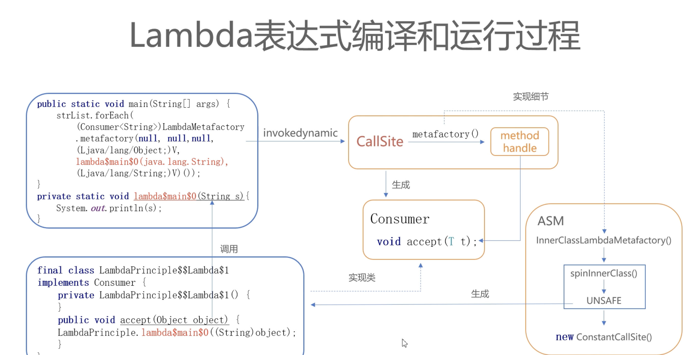
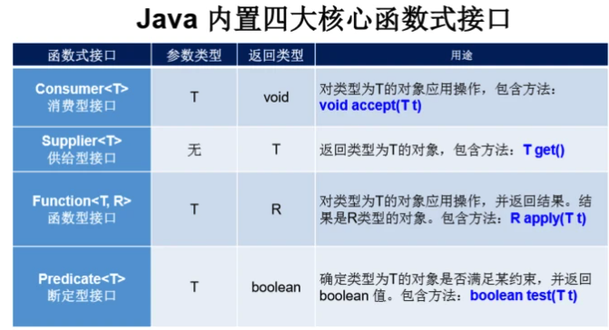

# Java8新特性

## Lambda表达式

### 概述

​		Lambda表达式（也称为闭包closures）是Java 8中最大和最令人期待的语言改变。它允许我们将函数当成参数传递给某个方法，或者把代码本身当作数据处理：[函数式开发者](https://links.jianshu.com/go?to=http%3A%2F%2Fwww.javacodegeeks.com%2F2014%2F03%2Ffunctional-programming-with-java-8-lambda-expressions-monads.html)非常熟悉这些概念。很多JVM平台上的语言（Groovy、[Scala](https://links.jianshu.com/go?to=http%3A%2F%2Fwww.javacodegeeks.com%2Ftutorials%2Fscala-tutorials%2F)等）从诞生之日就支持Lambda表达式，但是Java开发者没有选择，只能使用匿名内部类代替Lambda表达式。

Lambda的设计讨论耗费了很多时间和很大的社区力量，最终找到一种折中的实现方案，可以实现简洁而紧凑的语言结构。最简单的Lambda表达式可由逗号分隔的参数列表、**->**符号和语句块组成，例如：

```java
Arrays.asList( "a", "b", "d" ).forEach( e -> System.out.println( e ) );
```

### 语法

Lambda 编程风格，可以总结为四类：

- 可选类型声明：不需要声明参数类型，编译器可以统一识别参数值
- 可选的参数圆括号：一个参数无需定义圆括号，但多个参数需要定义圆括号
- 可选的大括号：如果主体包含了一个语句，就不需要使用大括号
- 可选的返回关键字：如果主体只有一个表达式返回值则编译器会自动返回值，大括号需要指定明表达式返回了一个数值

**可选类型声明**

在使用过程中，我们可以不用显示声明参数类型，编译器可以统一识别参数类型，例如：

```java
Collections.sort(names, (s1, s2) -> s1.compareTo(s2)); 
```

上面代码中的参数s1、s2的类型是由编译器推理得出的，你也可以显式指定该参数的类型，例如：

```java
Collections.sort(names, (String s1, String s2) -> s1.compareTo(s2)); 
```

**可选的参数圆括号**

当方法那只有一个参数时，无需定义圆括号，例如：

```java
Arrays.asList( "a", "b", "d" ).forEach( e -> System.out.println( e ) ); 
```

但多个参数时，需要定义圆括号，例如：

```java
Arrays.asList( "a", "b", "d" ).sort( ( e1, e2 ) -> e1.compareTo( e2 ) ); 
```

**可选的大括号**

当主体只包含了一行时，无需使用大括号，例如：

```java
Arrays.asList( "a", "b", "c" ).forEach( e -> System.out.println( e ) ); 
```

当主体包含多行时，需要使用大括号，例如：

```java
Arrays.asList( "a", "b", "c" ).forEach( e -> { 
    System.out.println( e ); 
    System.out.println( e ); 
} ); 
```

**可选的返回关键字**

如果表达式中的语句块只有一行，则可以不用使用return语句，返回值的类型也由编译器推理得出，例如：

```java
Arrays.asList( "a", "b", "d" ).sort( ( e1, e2 ) -> e1.compareTo( e2 ) ); 
```

如果语句块有多行，可以在**大括号中指明表达式返回值**，例如：

```java
Arrays.asList( "a", "b", "d" ).sort( ( e1, e2 ) -> { 
    int result = e1.compareTo( e2 ); 
    return result; 
} ); 
```

**2.5、变量作用域**

还有一点需要了解的是，Lambda 表达式可以引用类成员和局部变量，但是会将这些变量隐式得转换成final，例如：

```java
String separator = ","; 
Arrays.asList( "a", "b", "c" ).forEach( 
    ( String e ) -> System.out.print( e + separator ) ); 
```

和

```java
final String separator = ","; // 如果此变量被重新赋值 lambda表达式中会编译不通过
Arrays.asList( "a", "b", "c" ).forEach( 
    ( String e ) -> System.out.print( e + separator ) );
```

两者等价!

同时，Lambda 表达式的局部变量可以不用声明为final，但是必须不可被后面的代码修改(即隐性的具有 final 的语义)，例如：

```java
int num = 1; 
Arrays.asList(1,2,3,4).forEach(e -> System.out.println(num + e)); 
num = 2; 
//报错信息：Local variable num defined in an enclosing scope must be final or effectively final 
```

在 Lambda 表达式当中不允许声明一个与局部变量同名的参数或者局部变量，例如：

```java
int num = 1; 
Arrays.asList(1,2,3,4).forEach(num -> System.out.println(num)); 
//报错信息：Variable 'num' is already defined in the scope 
```

### 底层实现

本质：**函数式接口的匿名子类的匿名对象**

Lambda表达式是一个语法糖，jvm并不原生支持

Todo： LambdaMetafactory实现

```java
/**
 * Lambda表达式的底层实现
 *  语法：
 *      (parameters) -> { statements; }
 *      或
 *      (parameters) -> expression
 *
 *  JVM参数：jdk.internal.lambda.dumpProxyClasses
 *      命令：java -Djdk.internal.lambda.dumpProxyClasses ClassName
 *      转储得到内部类：ClassName$$Lambda$1.class
 *      反编译：java -jar cfr-0.145.jar LambdaTest.class --decodelambdas false
 *  本质：函数式接口的匿名子类的匿名对象
 *  Lambda表达式与函数式接口的抽象函数格式一一对应
 */
public class LambdaPrinciple {
    public static void main(String[] args) {
        List<String> strList = Arrays.asList("白", "灼", "秋","葵");
        // 通过lambda表达式实现元素遍历
        strList.forEach(s -> {
            System.out.println(s);
        });
    }
}

// 反编译后
public class LambdaPrinciple {
    public static void main(String[] args) {
    List<String> strList = Arrays.asList("\u767d", "\u707c", "\u79cb", "\u8475");
      // 核心工厂LambdaMetafactory
        strList.forEach((Consumer<String>)LambdaMetafactory.metafactory(null, null, null,                                                                        (Ljava/lang/Object;)V,                                                                         lambda$main$0(java.lang.String ),   // 真正被调用的方法
                                                                        (Ljava/lang/String;)V)());
}

    private static void lambda$main$0(String s) {
        System.out.println(s);
    }
  
  	// 加上jvm参数后得到匿名内部类，底层使用asm技术写字节码文件
 		final class LambdaPrinciple$$Lambda$1 implements Consumer {
            private LambdaPrinciple$$Lambda$1() {
            }

            @LambdaForm.Hidden
            public void accept(Object object) {
                LambdaPrinciple.lambda$main$0((String)object);
            }
        }
}


```



## 函数式接口

### 概述

Lambda的设计者们为了让现有的功能与Lambda表达式良好兼容，考虑了很多方法，于是产生了**[函数接口](https://links.jianshu.com/go?to=http%3A%2F%2Fwww.javacodegeeks.com%2F2013%2F03%2Fintroduction-to-functional-interfaces-a-concept-recreated-in-java-8.html)**这个概念。函数接口指的是**只有一个函数的接口**，这样的接口可以**隐式转换为Lambda表达式**。java.lang.Runnable和java.util.concurrent.Callable是函数式接口的最佳例子。在实践中，函数式接口非常脆弱：只要某个开发者在该接口中添加一个函数，则该接口就不再是函数式接口进而导致编译失败。为了克服这种代码层面的脆弱性，并显式说明某个接口是函数式接口，Java 8 提供了一个特殊的注解**@FunctionalInterface**（Java 库中的所有相关接口都已经带有这个注解了）

```java
@FunctionalInterface
public interface Functional {
    void method();

    public static void main(String[] args) {
       // lambda表达式可以看作Functional接口的一个匿名实现
       Functional functional = () -> System.out.println("Functional Interface1");
       functional.method(); // Functional Interface1
    }
}
```


### 四大核心函数式接口



#### Runnable

```java
public class RunnableLambda {
    public static void main(String[] args) {
        // 使用匿名内部类的方式,实现多线程
        new Thread(new Runnable() {
            @Override
            public void run() {
                String name = Thread.currentThread().getName();
                System.out.println(name + " 线程已启动");
            }
        }).start();

        // 使用Lambda表达式,实现多线程
        new Thread(() -> {
            String name = Thread.currentThread().getName();
            System.out.println(name + " 线程已启动");
        }).start();

        // 优化省略Lambda
        new Thread(() -> System.out.println(Thread.currentThread().getName() + " 线程已启动")).start();
    }
}
```


#### Supplier

```java
public class SupplierLambda {
    public static void main(String[] args) {
        int arr[] = {2, 3, 4, 52, 333, 23};
        // 调用getMax方法，参数传递Lambda
        int maxNum = getMax(() -> {
            // 查找数组的最大值
            int max = arr[0];
            for (int i : arr) {
                if (i > max) {
                    max = i;
                }
            }
            return max;
        });
        System.out.println(maxNum);
    }

    // 定一个方法方法的参数传递Supplier泛型使用Integer
    public static int getMax(Supplier<Integer> sup) {
        return sup.get();
    }
}
```


#### Consumer

```java
public class ConsumerLambda {
    public static void main(String[] args) {
//        consumerString(s -> System.out.println(s));
        consumerString(
                s -> System.out.println(s.toLowerCase()),
                s -> System.out.println(s.toUpperCase())
        );
    }

    static void consumerString(Consumer<String> function) {
        function.accept("Hello");
    }

    static void consumerString(Consumer<String> one, Consumer<String> two) {
        one.andThen(two).accept("Hello");
    }
}
```


#### Comparator

```java
public class ComparatorLambda {
    public static void main(String[] args) {
        String[] strs = {"dedeyidede", "abc", "de", "fghi"};
        // 使用匿名内部类的方式，实现比较器
        Comparator<String> comparator = new Comparator<String>() {
            @Override
            public int compare(String o1, String o2) {
                return o1.length() - o2.length();
            }
        };
//        Arrays.sort(strs, comparator);
        // TODO 使用Lambda表达式实现
        Arrays.sort(strs, (s1, s2) -> s1.length() - s2.length());
        System.out.println(Arrays.toString(strs));
    }
}
```


#### Predicate

```java
public class PredicateLambda {

    public static void main(String[] args) {
        andMethod(s -> s.contains("H"), s -> s.contains("W")); // Helloworld 是否包涵H && 是否包涵W
        orMethod(s -> s.contains("H"), s -> s.contains("w"));  // Helloworld 是否包涵H || 是否包涵W
        negateMethod(s -> s.length() < 5); // Helloworld 长度大于等于5
    }

    static void andMethod(Predicate<String> one, Predicate<String> two) {
        boolean isValid = one.and(two).test("Helloworld");
        System.out.println("字符串符合要求吗：" + isValid);
    }

    static void orMethod(Predicate<String> one, Predicate<String> two) {
        boolean isValid = one.or(two).test("Helloworld");
        System.out.println("字符串符合要求吗：" + isValid);
    }

    static void negateMethod(Predicate<String> predicate) {
        boolean veryLong = predicate.negate().test("HelloWorld");
        System.out.println("字符串很长吗：" + veryLong);
    }
}
```

#### FunctionLambda

```java
public class FunctionLambda {
    public static void main(String[] args) {
        method(str -> Integer.parseInt(str) + 10, i -> i *= 10);

        String str = "郑十,10";
        int age = getAgeNum(str, s -> s.split(",")[1], // 切割
                s -> Integer.parseInt(s), // 转整数
                n -> n += 100); // 加100
        System.out.println(age);
    }

    static void method(Function<String, Integer> one, Function<Integer, Integer> two) {
        int num = one.andThen(two).apply("10");
        System.out.println(num + 20);
    }

    static int getAgeNum(String str, Function<String, String> one,
                         Function<String, Integer> two,
                         Function<Integer, Integer> three) {
        return one.andThen(two).andThen(three).apply(str);
    }

}
```


## 接口的默认方法和静态方法

### 概述

​		Java 8使用两个新概念扩展了接口的含义：默认方法和静态方法。[默认方法]()使得接口有点类似traits，不过要实现的目标不一样。默认方法使得开发者可以在 不破坏二进制兼容性的前提下，**往现存接口中添加新的方法，之前存在的接口的实现类不用实现默认方法，更好的兼容之前的版本**。（比如jdk的接口如果需要添加新的方法，所有实现类都需要修改一遍，默认方法解决了这个问题，比如集合foreach就是通过Iterable接口的默认方法来实现的）。

### 默认方法

默认方法和抽象方法之间的区别在于抽象方法需要实现，而默认方法不需要。接口提供的默认方法会被接口的实现类继承或者覆写，例子代码如下：

```java
private interface Defaulable {
    // Interfaces now allow default methods, the implementer may or 
    // may not implement (override) them.
    default String notRequired() { 
        return "Default implementation"; 
    }        
}
        
private static class DefaultableImpl implements Defaulable {
}
    
private static class OverridableImpl implements Defaulable {
    @Override
    public String notRequired() {
        return "Overridden implementation";
    }
}
```

**默认方法可能会有冲突**

1. 两个接口有相同的默认方法

```java
public interface TestInterface1 {
    default void sameMethod() {
        System.out.println("invoke interface1 !");
    }
}
public interface TestInterface2 {
    default void sameMethod() {
        System.out.println("invoke interface2 !");
    }
}

public class InterfaceImpl implements TestInterface1, TestInterface2 {
    //此处默认方法需要被重写，否则编译报错
    @Override
    public void sameMethod() {
        // 选择一个默认实现
        // TestInterface1.super.sameMethod(); 
     		System.out.println("invoke InterfaceImpl ！");
    }
}


public static void main(String[] args) {
        InterfaceImpl anInterface = new InterfaceImpl();
        anInterface.sameMethod();// invoke InterfaceImpl ！
}

```

2. 接口与父类有相同名称默认方法

   

   ```java
   public class Father {
       void sameMethod() {
           System.out.println("invoke father !");
       }
   }
   
   
   public class InterfaceImpl extends Father implements TestInterface1 {
   
       @Override
       public void sameMethod() {
           // 同样必须重写
           // TestInterface1.super.sameMethod(); 
           System.out.println("invoke son method!");
       }
   
       public static void main(String[] args) {
           InterfaceImpl anInterface = new InterfaceImpl();
           anInterface.sameMethod(); //invoke son method!
       }
   }
   ```

### 静态方法

Java 8带来的另一个有趣的特性是在接口中可以定义静态方法

```java
public interface StaticMethod {
    static void invoke() {
        System.out.println("static method!");
    }

    public static void main(String[] args) {
        StaticMethod.invoke(); // static method!
    }
}
```

## 方法引用/构造器引用

### 概述

方法引用可以直接引用，类或事例已存在的方法或构造方法

当要传递给 Lambda 体的操作，已经实现的方法了，可以使用方法引用！

```java
public static class Car {
    public static Car create( final Supplier< Car > supplier ) {
        return supplier.get();
    }              
        
    public static void collide( final Car car ) {
        System.out.println( "Collided " + car.toString() );
    }
        
    public void follow( final Car another ) {
        System.out.println( "Following the " + another.toString() );
    }
        
    public void repair() {   
        System.out.println( "Repaired " + this.toString() );
    }
}
```

**构造器引用**

语法是**Class::new**，或者更一般的形式：**Class<T>::new**。注意：这个构造器没有参数

```java
final Car car = Car.create( Car::new );
final List< Car > cars = Arrays.asList( car );
```

**静态方法引用**

语法是**Class::static_method**。注意：这个方法接受一个Car类型的参数。

```java
cars.forEach( Car::collide ); //Collided java8.Car@776ec8df
```

**引用特定类型的任意对象的实例方法**

语法为 Class::method。注意，**这个方法没有定义入参**：

**实例对象的成员方法的引用**

语法是**instance::method**。注意：这个方法接受一个Car类型的参数：

```java
final Car police = Car.create( Car::new );
cars.forEach( police::follow );
```

## Stream API


## Optional 类

为了解决 java 中的空指针问题而生！

`Optional<T> 类(java.util.Optional)` 是一个容器类，它可以保存类型 `T` 的值，代表这个值存在。或者仅仅保存 `null`，表示这个值不存在。原来用 `null` 表示一个值不存在，现在 `Optional` 可以更好的表达这个概念。并且可以避免空指针异常。


## Date Time API

## 其他

### Nashorn, JavaScript 引擎


## 参考

https://segmentfault.com/a/1190000022266823

https://docs.oracle.com/javase/tutorial/java/javaOO/lambdaexpressions.html

https://developer.51cto.com/article/647804.html

https://www.jianshu.com/p/5b800057f2d8

https://www.javacodegeeks.com/java-8-features-tutorial.html#lambdas_and_functional

https://www.cnblogs.com/wmyskxz/p/13527583.html