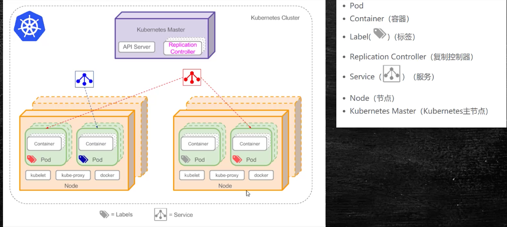

# K8S

## 特点

自动化容器的部署与复制

随时扩展或收缩容器规模

容器分组，提供容器间的负载均衡

实时监控，即时故障发现，自动替换

**Kubernetes Master**主服务器，整个集群的管理者

**node**节点

**pod**

pod是k8s最小可部署单元，一个pod就是一个进程

pod是容器，可以包含多个Container

pod内部网络互通，每个pod都有独立的虚拟ip

pod都是部署完整的应用或模块 

---

pod中必备的一个容器就是Pause

1. 提供共享网络空间
2. 提供共享的挂载数据卷，pod中不同应用数据，可以挂载到Pause中的不同卷

**service**

多个不同的pod进行通信

**label**

说明性标签，pod的别名

**Replication Controller**

复制控制器，存在于master中，对pod数量进行监控

**Kubelet**

执行k8s的命令

**kube-proxy**

代理，跨容器通信，依赖kube-proxy

**docker**