# Kakfa

## AKF划分

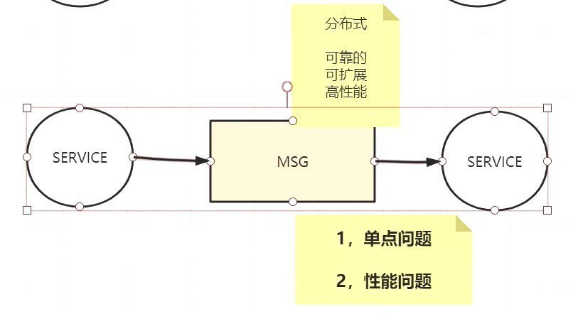


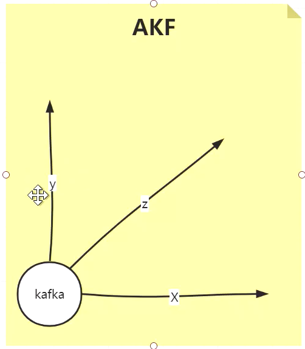

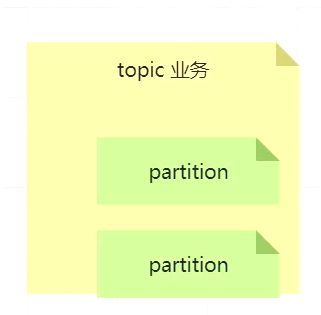

x轴：解决单点问题，高可用

y轴：解决业务划分，不同服务之间发送的消息按业务划分，业务隔离性比较好，解耦每个业务只关注自己的节点。（日志、数据库binlog）在Kafka中是不同的topic

z轴：解决分片分治（同一业务数据的拆分，在kafka中叫不同的partition），比如按业务拆分时binlog文件很大，讲binlog继续拆分，数据分片，细分的时候可以使用的手段有regin、随机哈希、映射

---

数据分区带了一致性问题，无关的数据分散到不同的分区中，以追求并发并行；有关的数据，一定要按原有的顺序发送到同一个分区里。（分区内部有序，分区外部无序）

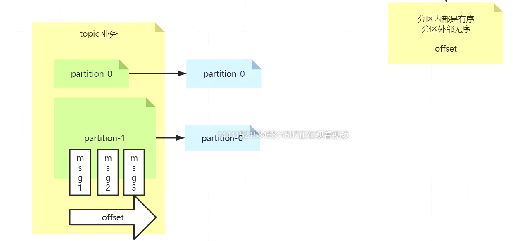

因为有offset偏移量能够保证，记录消费者读取到哪

topic是逻辑概念，partition是topic的子域，有物理实现 partition-0、partition-1，每个分区（会持久化到磁盘）做副本x轴，在x轴可以做读写分离，但是会有一致性的问题，kafka只能在主片上进行读写，什么时候挂了什么时候启用副本。

## 拓扑图

## 消息中间件

异步、解偶、流量削峰

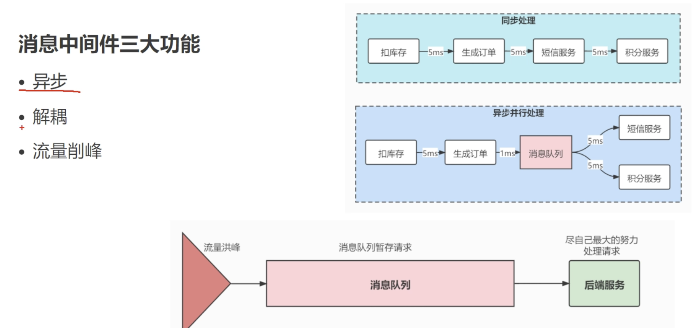

异步：用户最直观的感受就是接口响应速度变快了

解藕：短信发送失败了、积分没加成功不影响用户请求

削峰：节约服务器成本、续报10min大流量请求，放到消息队列里，后端服务慢慢消费

为什么不用线程池？

没办法存储数据，处理失败了不提交偏移量，下次还能继续处理

## 消息中间件对比

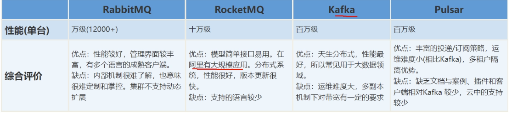

## Kafka

集群分布式、自由伸缩、数据持久化

早期版本依赖zk，集群部署做服务发现

怎么去除zk依赖的？

每个节点生成uuid，kraft文件中源数据记录信息

## 基本概念

主题和分区

分区的意义：提高消费消息的并发度，就是队列

一个消费者可以消费多个分区，但是一个分区只能被一个消费者消费

为什么？

多个消费者消费同一个分区（队列）就乱序了

Offset 记录的是一个群组的

## 硬件

cpu：要求不高

磁盘吞吐量/磁盘容量：要求很高，影响生产者，写的能力越快

内存：要求不高，影响消费者，读到内存

网络：要求很高，复制，同一个内网

## 生产消费全流程

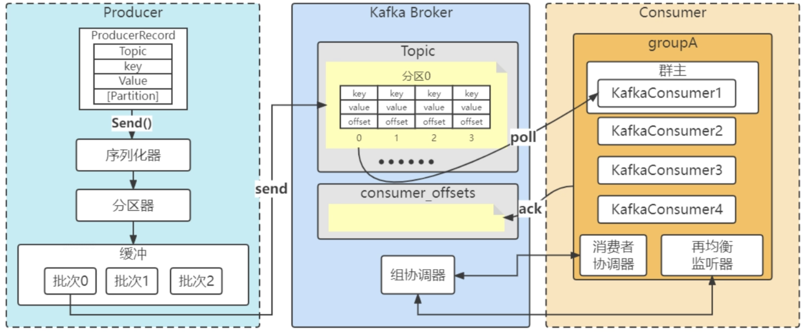

动态增加消费者 会定期进行负载再均衡

比如4个分区3个消费者，肯定有一个消费者消费两个分区的数据，此时增加一个消费者，过一段时间（5s）会分配给他一个分区

负载均衡建立在分区级别

## 消费与群组

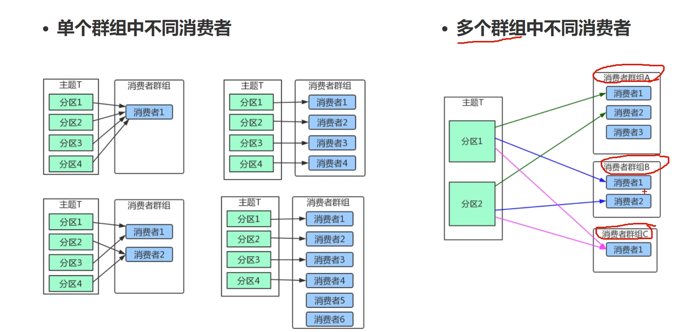

## 多线程安全问题

kafka生产者是多线程安全的，所有成员变量final修饰

kafka消费者不是线程安全的，

线程封闭，每个线程实例化一个consumer对象

## 群组协调

群主：第一个加入group的消费者，负责分配分区，可以看到所有消费者的分区信息，群员只能看到自己的

消费者协调器（consumer）与组协调器（broker）通信

组协调器：

1. 选举leader消费者客户端
2. 处理加入群组的客户端
3. 再平衡后 同步新的分配方案
4. 心跳机制 判断哪些客户端离线了
5. 管理消费者的偏移量 topic consumer_offset 默认50个

消费者协调器： 

1. 向组协调器 发起入组请求（第一个成为群主 ）

2. 发起同步组（消费者分区划分情况）的请求（leader客户端 ，负责计算，分配策略作为入参传入）

3. 心跳机制

4. 发起Ack提交偏移量的请求

5. 主动发起离组的请求

   

### 完整过程

1. 消费者客户端启动、重连（joinGroup 请求 - > 组协调器）
2. 1执行完后，向组协调器发送SyncGroup（同步组获取新的分配方案）
3. 关机、异常触发离组
4. 加入后一直保持心跳

## 集群与可靠性

1. 高并发
2. 高可用
3. 动态扩容

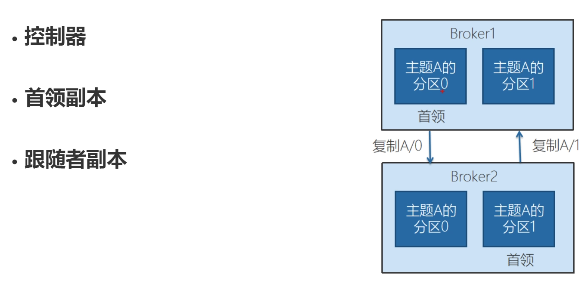

写消息和读消息只在首领

副本和首领在不同的broker

## kafka处理请求的内部机制

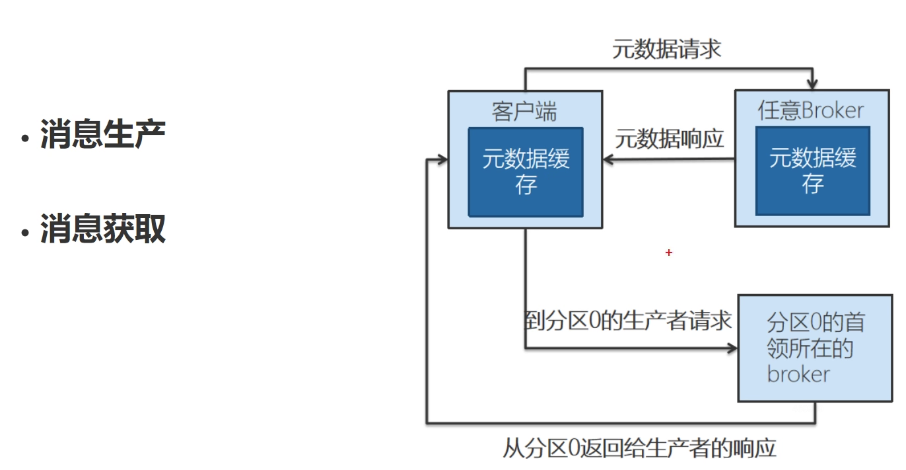

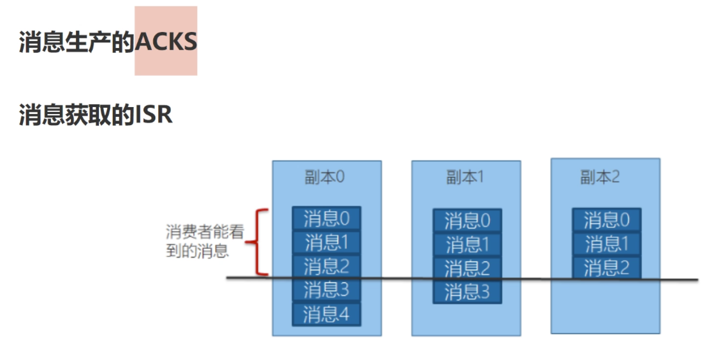

acks = 0 、1 -1/al

- "-1"：这意味着生产者在发送消息后，将等待所有的副本（包括 Leader 和所有的 Follower）都确认接收到该消息。这种模式提供了最高级别的数据持久性保证，但可能会导致更高的延迟。（不一定是所有默认是3，可以配置min.insync.replicas）
- "0"：这意味着生产者在发送消息后不会等待任何来自服务器的确认。这种模式提供了最低的延迟，但存在数据丢失的风险
- "1"：这意味着生产者在发送消息后，将等待 Leader 确认接收到该消息。这种模式提供了中等级别的数据持久性保证，同时也保持了较低的延迟。

性能和安全性的权衡

### 消费者重要参数

1. group.id
2. Auto.offest.reset offset丢失时候怎么处理(当 Kafka 中没有初始偏移量或服务器上不再存在当前偏移量（例如，因为该数据已被删除）时该怎么办： earliest：自动将偏移量重置为最早的偏移量latest：自动将偏移量重置为最新的偏移量none： 如果未找到消费者组的先前偏移量，则向消费者抛出异常anything else：向消费者抛出异常)
3. enable.auto.commit 自动提交
4. auto.commit.interval.ms 自动提交开启时候多久提交一次

## Kafka存储机制

基本的分区。

kafka的超时数据的清理机制。

## 源码分析

### Producer

在 Kafka 中, 我们把产生消息的一方称为 Producer 即 生产者, 它是 Kafka 的核心组件之一, 也是消息的来源所在。它的主要功能是将客户端的请求打包封装发送到 kafka 集群的某个 Topic 的某个分区上。那么这些生产者产生的消息是怎么传到 Kafka 服务端的呢?

KafkaProducer

1. Producer初始化
2. Producer发送流程
3. Producer缓冲区
4. Producer之参数与调优

从生产流程可以知道，Producer里面的核心有序列化器，分区器，还有缓冲区，所以初始化的流程肯定是围绕这几个核心来处理。


```java
Properties properties = new Properties();
properties.put(ProducerConfig.KEY_SERIALIZER_CLASS_CONFIG, StringSerializer.class.getName());
properties.put(ProducerConfig.VALUE_SERIALIZER_CLASS_CONFIG, StringSerializer.class.getName());
KafkaProducer kafkaProducer = new KafkaProducer<>(properties);
String topicName = "topic";
for (int i = 0; i < 20; i++) {
    String msg = i + " This is message";
    kafkaProducer.send(new ProducerRecord<String, String>(topicName, msg));
}
```

#### 初始化

```java
// https://kafka.apache.org/documentation.html#producerconfigs 官方配置文档
Properties properties = new Properties();

KafkaProducer kafkaProducer = new KafkaProducer<>(properties);
```

```java
KafkaProducer(ProducerConfig config,
              Serializer<K> keySerializer,
              Serializer<V> valueSerializer,
              ProducerMetadata metadata,
              KafkaClient kafkaClient,
              ProducerInterceptors<K, V> interceptors,
              Time time) {
    try {
        this.producerConfig = config;
        this.time = time;

        String transactionalId = config.getString(ProducerConfig.TRANSACTIONAL_ID_CONFIG);

        this.clientId = config.getString(ProducerConfig.CLIENT_ID_CONFIG);

        LogContext logContext;
        if (transactionalId == null)
            logContext = new LogContext(String.format("[Producer clientId=%s] ", clientId));
        else
            logContext = new LogContext(String.format("[Producer clientId=%s, transactionalId=%s] ", clientId, transactionalId));
        log = logContext.logger(KafkaProducer.class);
        log.trace("Starting the Kafka producer");

        Map<String, String> metricTags = Collections.singletonMap("client-id", clientId);
        MetricConfig metricConfig = new MetricConfig().samples(config.getInt(ProducerConfig.METRICS_NUM_SAMPLES_CONFIG))
                .timeWindow(config.getLong(ProducerConfig.METRICS_SAMPLE_WINDOW_MS_CONFIG), TimeUnit.MILLISECONDS)
                .recordLevel(Sensor.RecordingLevel.forName(config.getString(ProducerConfig.METRICS_RECORDING_LEVEL_CONFIG)))
                .tags(metricTags);
        List<MetricsReporter> reporters = config.getConfiguredInstances(ProducerConfig.METRIC_REPORTER_CLASSES_CONFIG,
                MetricsReporter.class,
                Collections.singletonMap(ProducerConfig.CLIENT_ID_CONFIG, clientId));
        JmxReporter jmxReporter = new JmxReporter();
        jmxReporter.configure(config.originals(Collections.singletonMap(ProducerConfig.CLIENT_ID_CONFIG, clientId)));
        reporters.add(jmxReporter);
        MetricsContext metricsContext = new KafkaMetricsContext(JMX_PREFIX,
                config.originalsWithPrefix(CommonClientConfigs.METRICS_CONTEXT_PREFIX));
        this.metrics = new Metrics(metricConfig, reporters, time, metricsContext);
        this.producerMetrics = new KafkaProducerMetrics(metrics);
      	// 1. 设置分区器，支持自定义
        this.partitioner = config.getConfiguredInstance(
                ProducerConfig.PARTITIONER_CLASS_CONFIG,
                Partitioner.class,
                Collections.singletonMap(ProducerConfig.CLIENT_ID_CONFIG, clientId));
        warnIfPartitionerDeprecated();
        this.partitionerIgnoreKeys = config.getBoolean(ProducerConfig.PARTITIONER_IGNORE_KEYS_CONFIG);
      	// 如果发送消息到broker时抛出异常，且是允许重试的异常
      	// 2. 设置重试间隔时间默认100ms 需要开启重试才会生效
        long retryBackoffMs = config.getLong(ProducerConfig.RETRY_BACKOFF_MS_CONFIG);
      	// 3. 设置序列化器 
        if (keySerializer == null) {
            this.keySerializer = config.getConfiguredInstance(ProducerConfig.KEY_SERIALIZER_CLASS_CONFIG,
                                                                                     Serializer.class);
            this.keySerializer.configure(config.originals(Collections.singletonMap(ProducerConfig.CLIENT_ID_CONFIG, clientId)), true);
        } else {
            config.ignore(ProducerConfig.KEY_SERIALIZER_CLASS_CONFIG);
            this.keySerializer = keySerializer;
        }
        if (valueSerializer == null) {
            this.valueSerializer = config.getConfiguredInstance(ProducerConfig.VALUE_SERIALIZER_CLASS_CONFIG,
                                                                                       Serializer.class);
            this.valueSerializer.configure(config.originals(Collections.singletonMap(ProducerConfig.CLIENT_ID_CONFIG, clientId)), false);
        } else {
            config.ignore(ProducerConfig.VALUE_SERIALIZER_CLASS_CONFIG);
            this.valueSerializer = valueSerializer;
        }
				// 4. 设置拦截器 生产之前加一些自定义代码
        List<ProducerInterceptor<K, V>> interceptorList = (List) config.getConfiguredInstances(
                ProducerConfig.INTERCEPTOR_CLASSES_CONFIG,
                ProducerInterceptor.class,
                Collections.singletonMap(ProducerConfig.CLIENT_ID_CONFIG, clientId));
        if (interceptors != null)
            this.interceptors = interceptors;
        else
            this.interceptors = new ProducerInterceptors<>(interceptorList);
      	// 集群参数监听
        ClusterResourceListeners clusterResourceListeners = configureClusterResourceListeners(keySerializer,
                valueSerializer, interceptorList, reporters);
      	// 生产者发送批量消息的最大消息体大小（字节数），服务端也会有消息容量限制，如果启动了消息压缩就是压缩后的容量，与这个字段不同
        this.maxRequestSize = config.getInt(ProducerConfig.MAX_REQUEST_SIZE_CONFIG);
        // 生产者最大内存中缓存的未发送到server的消息大小
      	this.totalMemorySize = config.getLong(ProducerConfig.BUFFER_MEMORY_CONFIG);
        // 设置压缩格式 通过压缩消息缩小消息体大小提高系统吞吐率
      	this.compressionType = CompressionType.forName(config.getString(ProducerConfig.COMPRESSION_TYPE_CONFIG));
				// 最大阻塞时间
        this.maxBlockTimeMs = config.getLong(ProducerConfig.MAX_BLOCK_MS_CONFIG);
        // 超时时间
      	int deliveryTimeoutMs = configureDeliveryTimeout(config, log);

        this.apiVersions = new ApiVersions();
        this.transactionManager = configureTransactionState(config, logContext);
        // There is no need to do work required for adaptive partitioning, if we use a custom partitioner.
        boolean enableAdaptivePartitioning = partitioner == null &&
            config.getBoolean(ProducerConfig.PARTITIONER_ADPATIVE_PARTITIONING_ENABLE_CONFIG);
        RecordAccumulator.PartitionerConfig partitionerConfig = new RecordAccumulator.PartitionerConfig(
            enableAdaptivePartitioning,
            config.getLong(ProducerConfig.PARTITIONER_AVAILABILITY_TIMEOUT_MS_CONFIG)
        );
      	// 5. 设置缓冲区 消息累加器
        this.accumulator = new RecordAccumulator(logContext,
                // 批量大小
                config.getInt(ProducerConfig.BATCH_SIZE_CONFIG),
                this.compressionType,
                // 多久发送一次（缓冲池没满，时间到了也会发送）
                lingerMs(config),
                retryBackoffMs,
                deliveryTimeoutMs,
                partitionerConfig,
                metrics,
                PRODUCER_METRIC_GROUP_NAME,
                time,
                apiVersions,
                transactionManager,
                new BufferPool(this.totalMemorySize, config.getInt(ProducerConfig.BATCH_SIZE_CONFIG), metrics, time, PRODUCER_METRIC_GROUP_NAME));

        List<InetSocketAddress> addresses = ClientUtils.parseAndValidateAddresses(
                config.getList(ProducerConfig.BOOTSTRAP_SERVERS_CONFIG),
                config.getString(ProducerConfig.CLIENT_DNS_LOOKUP_CONFIG));
      	// 初始化集群对应的一些元数据 topic 、partition
        if (metadata != null) {
            this.metadata = metadata;
        } else {
            this.metadata = new ProducerMetadata(retryBackoffMs,
                    config.getLong(ProducerConfig.METADATA_MAX_AGE_CONFIG),
                    config.getLong(ProducerConfig.METADATA_MAX_IDLE_CONFIG),
                    logContext,
                    clusterResourceListeners,
                    Time.SYSTEM);
            this.metadata.bootstrap(addresses);
        }
        this.errors = this.metrics.sensor("errors");
      	// 创建Sender线程
        this.sender = newSender(logContext, kafkaClient, this.metadata);
        String ioThreadName = NETWORK_THREAD_PREFIX + " | " + clientId;
      	// KafkaThread将Sender设置为守护线程并启动
        this.ioThread = new KafkaThread(ioThreadName, this.sender, true);
        this.ioThread.start();
        config.logUnused();
        AppInfoParser.registerAppInfo(JMX_PREFIX, clientId, metrics, time.milliseconds());
        log.debug("Kafka producer started");
    } catch (Throwable t) {
        // call close methods if internal objects are already constructed this is to prevent resource leak. see KAFKA-2121
        close(Duration.ofMillis(0), true);
        // now propagate the exception
        throw new KafkaException("Failed to construct kafka producer", t);
    }
}
```


**拦截器**

拦截器可以做发送统计、加Key前缀，一般不用，有性能消耗

想要实现拦截器，我们需要先实现ProducerInterceptor接口即可，然后在生产者中设置进去即可。

```java
public interface ProducerInterceptor<K, V> extends Configurable, AutoCloseable {

		// 发送前的方法 可以把想要把发送的数据都带上时间戳
		ProducerRecord<K, V> onSend(ProducerRecord<K, V> record);

		// 发送后的方法  一般异常如果为空就说明发送成功了，反之就说明发送失败了。可以用来统计发送次数
		void onAcknowledgement(RecordMetadata metadata, Exception exception);
  
		// interceptor 关闭前调用s
    void close();
}
```

**Sender**

```java
Sender newSender(LogContext logContext, KafkaClient kafkaClient, ProducerMetadata metadata) {
    int maxInflightRequests = producerConfig.getInt(ProducerConfig.MAX_IN_FLIGHT_REQUESTS_PER_CONNECTION);
  	// 请求超时时间 默认30s
    int requestTimeoutMs = producerConfig.getInt(ProducerConfig.REQUEST_TIMEOUT_MS_CONFIG);
    ChannelBuilder channelBuilder = ClientUtils.createChannelBuilder(producerConfig, time, logContext);
    ProducerMetrics metricsRegistry = new ProducerMetrics(this.metrics);
    Sensor throttleTimeSensor = Sender.throttleTimeSensor(metricsRegistry.senderMetrics);
  	 /**
     * 创建kafkaClient
     * connections.max.idle.ms 关闭空闲channel连接的时间 默认为5min
     *
     */
    KafkaClient client = kafkaClient != null ? kafkaClient : new NetworkClient(
            new Selector(producerConfig.getLong(ProducerConfig.CONNECTIONS_MAX_IDLE_MS_CONFIG),
                    this.metrics, time, "producer", channelBuilder, logContext),
            metadata,
            clientId,
            maxInflightRequests,
            producerConfig.getLong(ProducerConfig.RECONNECT_BACKOFF_MS_CONFIG),
            producerConfig.getLong(ProducerConfig.RECONNECT_BACKOFF_MAX_MS_CONFIG),
            producerConfig.getInt(ProducerConfig.SEND_BUFFER_CONFIG),
            producerConfig.getInt(ProducerConfig.RECEIVE_BUFFER_CONFIG),
            requestTimeoutMs,
            producerConfig.getLong(ProducerConfig.SOCKET_CONNECTION_SETUP_TIMEOUT_MS_CONFIG),
            producerConfig.getLong(ProducerConfig.SOCKET_CONNECTION_SETUP_TIMEOUT_MAX_MS_CONFIG),
            time,
            true,
            apiVersions,
            throttleTimeSensor,
            logContext);

  /**
   * 创建sender线程
   * ack=0 生产者发送消息后不等待server端返回，也就是不关系发送结果
   * ack=1 server端leader已经写入本地log，不关心follower是否写入成功
   * ack=-1 或 ack=all server端leader等到所有副本集ready后再返回，最强的高可用保障
   */
    short acks = Short.parseShort(producerConfig.getString(ProducerConfig.ACKS_CONFIG));
    return new Sender(logContext,
            client,
            metadata,
            this.accumulator,
            maxInflightRequests == 1,
            producerConfig.getInt(ProducerConfig.MAX_REQUEST_SIZE_CONFIG),
            acks,
            producerConfig.getInt(ProducerConfig.RETRIES_CONFIG),
            metricsRegistry.senderMetrics,
            time,
            requestTimeoutMs,
            producerConfig.getLong(ProducerConfig.RETRY_BACKOFF_MS_CONFIG),
            this.transactionManager,
            apiVersions);
}
```

**总结**

我们一起来看下，在KafkaProducer初始化的时候初始了哪些核心组件和核心参数

- 核心组件Partitioner： 分区选择器，用来决定一个record应该被分配到哪一个partition
- 核心组件keySerializer：Key序列化器，用来对record的key进行序列化【默认为 Serializer 序列化器】
- 核心组件valueSerializer： Value序列化器，用来对record的Value进行序列化【默认为 Serializer 序列化器】
- 核心组件interceptors：拦截器，用来对消息进行预先处理和消息记录等
- 核心组件RecordAccumulator：生产者消息缓冲区，用来缓冲未发送到broker的消息，里面包括了若干个Batch
  - batch.size：默认情况下只有batch.size，默认为16KB，也就意味着每一次需要凑齐16KB的batch才会发送到Broker，但是这样会有一个问题，如果你发送了一个record但是迟迟没有发送新的record，使得batch一直无法达到16KB，所以一直没有办法发送，通过设置 linger.ms 可以解决
  - linger.ms：所以说要设置一个linger.ms，如果在指定时间范围内，都没凑出来一个batch把这条消息发送出去，那么到了这个linger.ms指定的时间，比如说5ms，如果5ms还没凑出来一个batch，那么就必须立即把这个消息发送出去
- 核心组件metadata：元数据信息，通过网络拉取broker集群中Cluster信息，包括Node partition ISR等信息，提供给Sender线程发送时使用
  - metadata.max.age.ms：每隔一段时间刷新一下metadata信息【默认为5min】
- 核心组件sender：sender线程，用于后台发送Accumulator中的批量消息
  - acks（0）不重试，acks（1）只要leader接收成功就算成功 acks(-1或all) 保证数据不丢失，完成leader和follower数据同步 【默认为1】
  - retries：重试次数【默认为0】


#### 发送

```java
    @Override
    public Future<RecordMetadata> send(ProducerRecord<K, V> record, Callback callback) {
        // intercept the record, which can be potentially modified; this method does not throw exceptions
      	// 1. 执行拦截器方法
        ProducerRecord<K, V> interceptedRecord = this.interceptors.onSend(record);
        return doSend(interceptedRecord, callback);
    }

		/**
     * Implementation of asynchronously send a record to a topic.
     */
    private Future<RecordMetadata> doSend(ProducerRecord<K, V> record, Callback callback) {
        // Append callback takes care of the following:
        //  - call interceptors and user callback on completion
        //  - remember partition that is calculated in RecordAccumulator.append
        AppendCallbacks<K, V> appendCallbacks = new AppendCallbacks<K, V>(callback, this.interceptors, record);

        try {
            throwIfProducerClosed();
            // first make sure the metadata for the topic is available
            long nowMs = time.milliseconds();
            ClusterAndWaitTime clusterAndWaitTime;
            try {
              	// 2. 获取集群的元数据
                clusterAndWaitTime = waitOnMetadata(record.topic(), record.partition(), nowMs, maxBlockTimeMs);
            } catch (KafkaException e) {
                if (metadata.isClosed())
                    throw new KafkaException("Producer closed while send in progress", e);
                throw e;
            }
            nowMs += clusterAndWaitTime.waitedOnMetadataMs;
            long remainingWaitMs = Math.max(0, maxBlockTimeMs - clusterAndWaitTime.waitedOnMetadataMs);
            Cluster cluster = clusterAndWaitTime.cluster;
            byte[] serializedKey;
            try {
              	// 3. 序列化处理
                serializedKey = keySerializer.serialize(record.topic(), record.headers(), record.key());
            } catch (ClassCastException cce) {
                throw new SerializationException("Can't convert key of class " + record.key().getClass().getName() +
                        " to class " + producerConfig.getClass(ProducerConfig.KEY_SERIALIZER_CLASS_CONFIG).getName() +
                        " specified in key.serializer", cce);
            }
            byte[] serializedValue;
            try {
                serializedValue = valueSerializer.serialize(record.topic(), record.headers(), record.value());
            } catch (ClassCastException cce) {
                throw new SerializationException("Can't convert value of class " + record.value().getClass().getName() +
                        " to class " + producerConfig.getClass(ProducerConfig.VALUE_SERIALIZER_CLASS_CONFIG).getName() +
                        " specified in value.serializer", cce);
            }

            // Try to calculate partition, but note that after this call it can be RecordMetadata.UNKNOWN_PARTITION,
            // which means that the RecordAccumulator would pick a partition using built-in logic (which may
            // take into account broker load, the amount of data produced to each partition, etc.).
          	// 4. 分区的处理 选择合适的分区策略，给消息体 Producer Record 分配要发送的 topic 分区号
            int partition = partition(record, serializedKey, serializedValue, cluster);

            setReadOnly(record.headers());
            Header[] headers = record.headers().toArray();

            int serializedSize = AbstractRecords.estimateSizeInBytesUpperBound(apiVersions.maxUsableProduceMagic(),
                    compressionType, serializedKey, serializedValue, headers);
            ensureValidRecordSize(serializedSize);
            long timestamp = record.timestamp() == null ? nowMs : record.timestamp();

            // A custom partitioner may take advantage on the onNewBatch callback.
            boolean abortOnNewBatch = partitioner != null;

            // Append the record to the accumulator.  Note, that the actual partition may be
            // calculated there and can be accessed via appendCallbacks.topicPartition.
          
          	// 5. 累加器写到缓冲区里,最后判断是否要发送。
          	// 缓冲区里Sender线程发送
            RecordAccumulator.RecordAppendResult result = accumulator.append(record.topic(), partition, timestamp, serializedKey,
                    serializedValue, headers, appendCallbacks, remainingWaitMs, abortOnNewBatch, nowMs, cluster);
            assert appendCallbacks.getPartition() != RecordMetadata.UNKNOWN_PARTITION;

            // 如果 abortForNewBatch 为true，上面第一次不存在batch，首次完成创建，等第二次进入再append
            if (result.abortForNewBatch) {
                int prevPartition = partition;
                onNewBatch(record.topic(), cluster, prevPartition);
                partition = partition(record, serializedKey, serializedValue, cluster);
                if (log.isTraceEnabled()) {
                    log.trace("Retrying append due to new batch creation for topic {} partition {}. The old partition was {}", record.topic(), partition, prevPartition);
                }
                result = accumulator.append(record.topic(), partition, timestamp, serializedKey,
                    serializedValue, headers, appendCallbacks, remainingWaitMs, false, nowMs, cluster);
            }

            // Add the partition to the transaction (if in progress) after it has been successfully
            // appended to the accumulator. We cannot do it before because the partition may be
            // unknown or the initially selected partition may be changed when the batch is closed
            // (as indicated by `abortForNewBatch`). Note that the `Sender` will refuse to dequeue
            // batches from the accumulator until they have been added to the transaction.
            if (transactionManager != null) {
                transactionManager.maybeAddPartition(appendCallbacks.topicPartition());
            }
						// 批量满了 或者建立了新批次 说明要发送了 唤醒sender
            if (result.batchIsFull || result.newBatchCreated) {
                log.trace("Waking up the sender since topic {} partition {} is either full or getting a new batch", record.topic(), appendCallbacks.getPartition());
                this.sender.wakeup();
            }
            return result.future;
            // handling exceptions and record the errors;
            // for API exceptions return them in the future,
            // for other exceptions throw directly
        } catch (ApiException e) {
            log.debug("Exception occurred during message send:", e);
            if (callback != null) {
                TopicPartition tp = appendCallbacks.topicPartition();
                RecordMetadata nullMetadata = new RecordMetadata(tp, -1, -1, RecordBatch.NO_TIMESTAMP, -1, -1);
                callback.onCompletion(nullMetadata, e);
            }
            this.errors.record();
            this.interceptors.onSendError(record, appendCallbacks.topicPartition(), e);
            if (transactionManager != null) {
                transactionManager.maybeTransitionToErrorState(e);
            }
            return new FutureFailure(e);
        } catch (InterruptedException e) {
            this.errors.record();
            this.interceptors.onSendError(record, appendCallbacks.topicPartition(), e);
            throw new InterruptException(e);
        } catch (KafkaException e) {
            this.errors.record();
            this.interceptors.onSendError(record, appendCallbacks.topicPartition(), e);
            throw e;
        } catch (Exception e) {
            // we notify interceptor about all exceptions, since onSend is called before anything else in this method
            this.interceptors.onSendError(record, appendCallbacks.topicPartition(), e);
            throw e;
        }
    }

// 分区器方法
    private int partition(ProducerRecord<K, V> record, byte[] serializedKey, byte[] serializedValue, Cluster cluster) {
      	// 带了分区直接返回 
        Integer partition = record.partition();
        return partition != null ?
                partition :
      					// 默认分区器 or 自定义分区器 多态
                partitioner.partition(
                        record.topic(), record.key(), serializedKey, record.value(), serializedValue, cluster);
    }
```

**RecordAccumulator append**

```java
public RecordAppendResult append(String topic,
                                 int partition,
                                 long timestamp,
                                 byte[] key,
                                 byte[] value,
                                 Header[] headers,
                                 AppendCallbacks callbacks,
                                 long maxTimeToBlock,
                                 boolean abortOnNewBatch,
                                 long nowMs,
                                 Cluster cluster) throws InterruptedException {
    /**
     * 步骤1 根据topic获取 TopicInfo
     * 这里再第一次进来的时候肯定是无法获取到 TopicInfo 的，会创建一个新的放进去
     * 当第二次进来的时候，如果还是这个topic就可以获取到topicInfo
     * 里面主要基于CopyOnWrite做的
     */

    TopicInfo topicInfo = topicInfoMap.computeIfAbsent(topic, k -> new TopicInfo(logContext, k, batchSize));

    // We keep track of the number of appending thread to make sure we do not miss batches in
    // abortIncompleteBatches().
    appendsInProgress.incrementAndGet();
    ByteBuffer buffer = null;
    if (headers == null) headers = Record.EMPTY_HEADERS;
    try {
        // Loop to retry in case we encounter partitioner's race conditions.
        /**
         * 通过循环重试的方式获取partition信息，避免因为竞争阻塞
         */
        while (true) {
            // If the message doesn't have any partition affinity, so we pick a partition based on the broker
            // availability and performance.  Note, that here we peek current partition before we hold the
            // deque lock, so we'll need to make sure that it's not changed while we were waiting for the
            // deque lock.
            final BuiltInPartitioner.StickyPartitionInfo partitionInfo;
            final int effectivePartition;
            /**
             * 步骤2 获取真实的partition信息
             * 如果 partition == RecordMetadata.UNKNOWN_PARTITION 未分配分区器，随机选择一个分区器
             * 如果给定了分区器，使用给定的分区器信息
             *
             */

            if (partition == RecordMetadata.UNKNOWN_PARTITION) {
                partitionInfo = topicInfo.builtInPartitioner.peekCurrentPartitionInfo(cluster);
                effectivePartition = partitionInfo.partition();
            } else {
                partitionInfo = null;
                effectivePartition = partition;
            }

            // Now that we know the effective partition, let the caller know.
            setPartition(callbacks, effectivePartition);

            // check if we have an in-progress batch
            /**
             * 步骤3 根据partition获得deque信息
             * 根据partition信息，获取TopicInfo中 Deque<ProducerBatch> dq
             * 如果不存在则创建新的队列
             */
            Deque<ProducerBatch> dq = topicInfo.batches.computeIfAbsent(effectivePartition, k -> new ArrayDeque<>());
            /**
             * 加锁：锁住需要的使用到的partition，采用分段锁思想
             */
            synchronized (dq) {
                // After taking the lock, validate that the partition hasn't changed and retry.
                /**
                 * 由于在锁外面就已经获取到了partition信息，需要double check分区信息是否发生变更
                 */
                if (partitionChanged(topic, topicInfo, partitionInfo, dq, nowMs, cluster))
                    continue;

                /**
                 * 步骤4 将消息append到 RecordAccumulator中
                 * 已经分配过内存buffer会在这里完成添加，如果没有分配过内存buffer下面代码不执行
                 * 如果返回null，则证明没有空间了
                 * 不等于null，证明有空间
                 */

                RecordAppendResult appendResult = tryAppend(timestamp, key, value, headers, callbacks, dq, nowMs);
                if (appendResult != null) {
                    // If queue has incomplete batches we disable switch (see comments in updatePartitionInfo).
                    boolean enableSwitch = allBatchesFull(dq);
                    topicInfo.builtInPartitioner.updatePartitionInfo(partitionInfo, appendResult.appendedBytes, cluster, enableSwitch);
                    return appendResult;
                }
            }

            // we don't have an in-progress record batch try to allocate a new batch
            /**
             * 步骤5 判断是否第一次进来分配batch，如果是第一次分配完直接返回
             */
            if (abortOnNewBatch) {
                // Return a result that will cause another call to append.
                return new RecordAppendResult(null, false, false, true, 0);
            }

            if (buffer == null) {
                byte maxUsableMagic = apiVersions.maxUsableProduceMagic();
                int size = Math.max(this.batchSize, AbstractRecords.estimateSizeInBytesUpperBound(maxUsableMagic, compression, key, value, headers));
                log.trace("Allocating a new {} byte message buffer for topic {} partition {} with remaining timeout {}ms", size, topic, partition, maxTimeToBlock);
                // This call may block if we exhausted buffer space.
                // 申请内存空间
                buffer = free.allocate(size, maxTimeToBlock);
                // Update the current time in case the buffer allocation blocked above.
                // NOTE: getting time may be expensive, so calling it under a lock
                // should be avoided.
                nowMs = time.milliseconds();
            }

            /**
             * 步骤6 代码能够走到这里，可能有几种因素
             * 1. 没有分配Buffer，需要在这里分配空间
             * 2. batch已经满了，所以需要分配buffer重新添加
             */
            synchronized (dq) {
                // After taking the lock, validate that the partition hasn't changed and retry.
                if (partitionChanged(topic, topicInfo, partitionInfo, dq, nowMs, cluster))
                    continue;

                RecordAppendResult appendResult = appendNewBatch(topic, effectivePartition, dq, timestamp, key, value, headers, callbacks, buffer, nowMs);
                // Set buffer to null, so that deallocate doesn't return it back to free pool, since it's used in the batch.
                if (appendResult.newBatchCreated)
                    buffer = null;
                // If queue has incomplete batches we disable switch (see comments in updatePartitionInfo).
                boolean enableSwitch = allBatchesFull(dq);
                topicInfo.builtInPartitioner.updatePartitionInfo(partitionInfo, appendResult.appendedBytes, cluster, enableSwitch);
                return appendResult;
            }
        }
    } finally {
        free.deallocate(buffer);
        appendsInProgress.decrementAndGet();
    }
}
```


##### ConcurrentMap定义如下

```java
/**
 * 1.采用读写分离的思想
 * 2.适用于读多写少的场景
 */
public class CopyOnWriteMap<K, V> implements ConcurrentMap<K, V> {
    // 多个线程操作同一个Map，使用volatile修饰，修改对其他线程可见
    private volatile Map<K, V> map;
    
    /**
     * 读取数据是没有加锁的，再高并发的场景下性能是非常高的，并且是线程安全的
     * 采用了读写分离的思想
     */
    @Override
    public V get(Object k) {
        return map.get(k);
    }
    // 省略部分代码
    
    /**
     * 1) 整个方法使用的是synchronized关键字去修饰的，说明这个方法是线程安全
     * 2)这种设计方式，采用的是读写分离的设计思想。
     * 3) map 使用 volatile 修饰，如果变化了那么get可以感知到
     * 
     */
    @Override
    public synchronized V put(K k, V v) {
        Map<K, V> copy = new HashMap<K, V>(this.map);
        V prev = copy.put(k, v);
        this.map = Collections.unmodifiableMap(copy);
        return prev;
    }
    // 省略部分代码
}
```


```java

/**
 * Per topic info.
 */
private static class TopicInfo {
  
  	// key: partition
  	// value: ProducerBatch 队列
    public final ConcurrentMap<Integer /*partition*/, Deque<ProducerBatch>> batches = new CopyOnWriteMap<>();
    public final BuiltInPartitioner builtInPartitioner;

    public TopicInfo(LogContext logContext, String topic, int stickyBatchSize) {
        builtInPartitioner = new BuiltInPartitioner(logContext, topic, stickyBatchSize);
    }
}
```


#### 缓冲区

Kafka生产者的缓冲区，也就是内存池，可以将其类比为连接池(DB, Redis),主要是避免不必要的创建连接的开销, 这样内存池可以对 RecordBatch 做到反复利用, 防止引起Full GC问题。


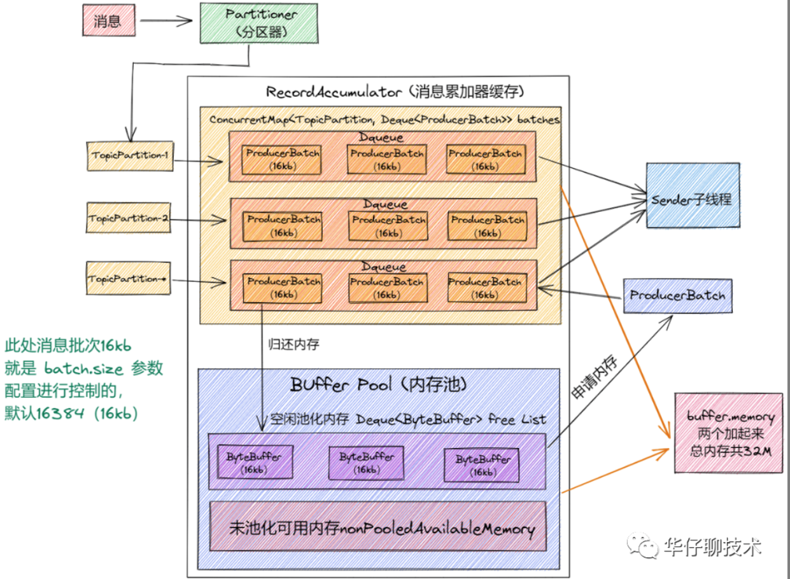

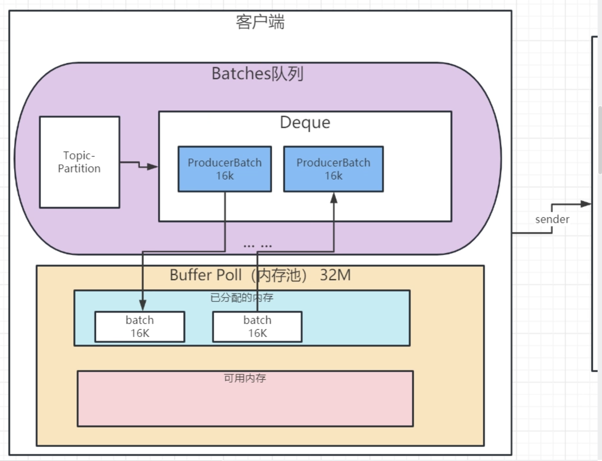

池子大小默认32MB 每个批次默认16KB

最终放到了ByteBuffer

```java
public BufferPool(long memory, int poolableSize, boolean blockOnExhaustion, Metrics metrics, Time time , String metricGrpName , Map<String, String> metricTags) {
     this.poolableSize = poolableSize;
     this.blockOnExhaustion = blockOnExhaustion;
     this.lock = new ReentrantLock();
     this.free = new ArrayDeque<ByteBuffer>();
     this.waiters = new ArrayDeque<Condition>();
     this.totalMemory = memory;
     this.availableMemory = memory;
     this.metrics = metrics;
     this.time = time;
     this.waitTime = this.metrics.sensor("bufferpool-wait-time");
     MetricName metricName = new MetricName("bufferpool-wait-ratio",
                                           metricGrpName,
                                           "The fraction of time an appender waits for space allocation.",
                                           metricTags);
     this.waitTime.add(metricName, new Rate(TimeUnit.NANOSECONDS));
}
```


首次分配内存

```java
public ByteBuffer allocate(int size) throws InterruptedException {
  	// 申请资源 大于池子总大小抛出异常
    if (size > this.totalMemory)
        throw new IllegalArgumentException("Attempt to allocate " + size
                                           + " bytes, but there is a hard limit of "
                                           + this.totalMemory
                                           + " on memory allocations.");
		// 加锁ReentrantLock
    this.lock.lock();
    try {
        // check if we have a free buffer of the right size pooled
      	// 如果申请的大小是每个 recordBatch 的大小（16K），并且已分配内存不为空，则直接取出来一个返回。
        if (size == poolableSize && !this.free.isEmpty())
            return this.free.pollFirst();

        // now check if the request is immediately satisfiable with the
        // memory on hand or if we need to block
        int freeListSize = this.free.size() * this.poolableSize;
        if (this.availableMemory + freeListSize >= size) {
            // we have enough unallocated or pooled memory to immediately
            // satisfy the request
            freeUp(size);
            this.availableMemory -= size;
            lock.unlock();
            return ByteBuffer.allocate(size);
        } else if (!blockOnExhaustion) {
            throw new BufferExhaustedException("You have exhausted the " + this.totalMemory
                                               + " bytes of memory you configured for the client and the client is configured to error"
                                               + " rather than block when memory is exhausted.");
        } else {
            // we are out of memory and will have to block
            int accumulated = 0;
            ByteBuffer buffer = null;
            Condition moreMemory = this.lock.newCondition();
            this.waiters.addLast(moreMemory);
            // loop over and over until we have a buffer or have reserved
            // enough memory to allocate one
            while (accumulated < size) {
                long startWait = time.nanoseconds();
                moreMemory.await();
                long endWait = time.nanoseconds();
                this.waitTime.record(endWait - startWait, time.milliseconds());

                // check if we can satisfy this request from the free list,
                // otherwise allocate memory
                if (accumulated == 0 && size == this.poolableSize && !this.free.isEmpty()) {
                    // just grab a buffer from the free list
                    buffer = this.free.pollFirst();
                    accumulated = size;
                } else {
                    // we'll need to allocate memory, but we may only get
                    // part of what we need on this iteration
                    freeUp(size - accumulated);
                    int got = (int) Math.min(size - accumulated, this.availableMemory);
                    this.availableMemory -= got;
                    accumulated += got;
                }
            }

            // remove the condition for this thread to let the next thread
            // in line start getting memory
            Condition removed = this.waiters.removeFirst();
            if (removed != moreMemory)
                throw new IllegalStateException("Wrong condition: this shouldn't happen.");

            // signal any additional waiters if there is more memory left
            // over for them
            if (this.availableMemory > 0 || !this.free.isEmpty()) {
                if (!this.waiters.isEmpty())
                    this.waiters.peekFirst().signal();
            }

            // unlock and return the buffer
            lock.unlock();
            if (buffer == null)
                return ByteBuffer.allocate(size);
            else
                return buffer;
        }
    } finally {
        if (lock.isHeldByCurrentThread())
            lock.unlock();
    }
}
```


#### 如何优化生产者

1. acks
2. Max.request.size  **表示生产端能够发送的最大消息大小，默认值为1048576(1M)** 。适当调大
3. Retries 重试参数 生产重试次数 ，默认是0 ，建议3，rocketMQ 2 ,retryBackoffMs 重试间隔 默认100
4. Compression.type 默认没有压缩，压缩消耗cpu
5. buffer.memory 缓冲区的大小，默认32MB，可以调大 ，占用客户端内存 因此减小 batch 大小有利于降低消息延时，增加 batch 大小有利于提升吞吐量。
6. batch.size 发送到缓冲区消息的大小默认16KB，建议适当调大 实际情况中, 这是吞吐量与延时之间的权衡。默认值为0，表示消息需要被立即发送，无需关系 batch 是否被填满。
7. linger.ms 间隔时间多久发一次，看业务 业务允许延迟200ms 配置成50ms 


### Consumer

想一下消费者要做什么事情

1、consumer初始化
2、如何选举Consumer Leader
3、Consumer Leader是如何制定分区方案

4、Consumer如何拉取数据
5、Consumer的自动偏移量提交

#### 初始化

```java
KafkaConsumer(ConsumerConfig config, Deserializer<K> keyDeserializer, Deserializer<V> valueDeserializer) {
    try {
        GroupRebalanceConfig groupRebalanceConfig = new GroupRebalanceConfig(config,
                GroupRebalanceConfig.ProtocolType.CONSUMER);

        this.groupId = Optional.ofNullable(groupRebalanceConfig.groupId);
        this.clientId = config.getString(CommonClientConfigs.CLIENT_ID_CONFIG);

        LogContext logContext;

        // If group.instance.id is set, we will append it to the log context.
        if (groupRebalanceConfig.groupInstanceId.isPresent()) {
            logContext = new LogContext("[Consumer instanceId=" + groupRebalanceConfig.groupInstanceId.get() +
                    ", clientId=" + clientId + ", groupId=" + groupId.orElse("null") + "] ");
        } else {
            logContext = new LogContext("[Consumer clientId=" + clientId + ", groupId=" + groupId.orElse("null") + "] ");
        }

        this.log = logContext.logger(getClass());
        boolean enableAutoCommit = config.maybeOverrideEnableAutoCommit();
        groupId.ifPresent(groupIdStr -> {
            if (groupIdStr.isEmpty()) {
                log.warn("Support for using the empty group id by consumers is deprecated and will be removed in the next major release.");
            }
        });

        log.debug("Initializing the Kafka consumer");
        this.requestTimeoutMs = config.getInt(ConsumerConfig.REQUEST_TIMEOUT_MS_CONFIG);
        this.defaultApiTimeoutMs = config.getInt(ConsumerConfig.DEFAULT_API_TIMEOUT_MS_CONFIG);
        this.time = Time.SYSTEM;
        this.metrics = buildMetrics(config, time, clientId);
        this.retryBackoffMs = config.getLong(ConsumerConfig.RETRY_BACKOFF_MS_CONFIG);

        List<ConsumerInterceptor<K, V>> interceptorList = (List) config.getConfiguredInstances(
                ConsumerConfig.INTERCEPTOR_CLASSES_CONFIG,
                ConsumerInterceptor.class,
                Collections.singletonMap(ConsumerConfig.CLIENT_ID_CONFIG, clientId));
        this.interceptors = new ConsumerInterceptors<>(interceptorList);
        if (keyDeserializer == null) {
            this.keyDeserializer = config.getConfiguredInstance(ConsumerConfig.KEY_DESERIALIZER_CLASS_CONFIG, Deserializer.class);
            this.keyDeserializer.configure(config.originals(Collections.singletonMap(ConsumerConfig.CLIENT_ID_CONFIG, clientId)), true);
        } else {
            config.ignore(ConsumerConfig.KEY_DESERIALIZER_CLASS_CONFIG);
            this.keyDeserializer = keyDeserializer;
        }
        if (valueDeserializer == null) {
            this.valueDeserializer = config.getConfiguredInstance(ConsumerConfig.VALUE_DESERIALIZER_CLASS_CONFIG, Deserializer.class);
            this.valueDeserializer.configure(config.originals(Collections.singletonMap(ConsumerConfig.CLIENT_ID_CONFIG, clientId)), false);
        } else {
            config.ignore(ConsumerConfig.VALUE_DESERIALIZER_CLASS_CONFIG);
            this.valueDeserializer = valueDeserializer;
        }
        OffsetResetStrategy offsetResetStrategy = OffsetResetStrategy.valueOf(config.getString(ConsumerConfig.AUTO_OFFSET_RESET_CONFIG).toUpperCase(Locale.ROOT));
        this.subscriptions = new SubscriptionState(logContext, offsetResetStrategy);
        ClusterResourceListeners clusterResourceListeners = configureClusterResourceListeners(keyDeserializer,
                valueDeserializer, metrics.reporters(), interceptorList);
        this.metadata = new ConsumerMetadata(retryBackoffMs,
                config.getLong(ConsumerConfig.METADATA_MAX_AGE_CONFIG),
                !config.getBoolean(ConsumerConfig.EXCLUDE_INTERNAL_TOPICS_CONFIG),
                config.getBoolean(ConsumerConfig.ALLOW_AUTO_CREATE_TOPICS_CONFIG),
                subscriptions, logContext, clusterResourceListeners);
        List<InetSocketAddress> addresses = ClientUtils.parseAndValidateAddresses(
                config.getList(ConsumerConfig.BOOTSTRAP_SERVERS_CONFIG), config.getString(ConsumerConfig.CLIENT_DNS_LOOKUP_CONFIG));
        this.metadata.bootstrap(addresses);
        String metricGrpPrefix = "consumer";

        FetcherMetricsRegistry metricsRegistry = new FetcherMetricsRegistry(Collections.singleton(CLIENT_ID_METRIC_TAG), metricGrpPrefix);
        ChannelBuilder channelBuilder = ClientUtils.createChannelBuilder(config, time, logContext);
        this.isolationLevel = IsolationLevel.valueOf(
                config.getString(ConsumerConfig.ISOLATION_LEVEL_CONFIG).toUpperCase(Locale.ROOT));
        Sensor throttleTimeSensor = Fetcher.throttleTimeSensor(metrics, metricsRegistry);
        int heartbeatIntervalMs = config.getInt(ConsumerConfig.HEARTBEAT_INTERVAL_MS_CONFIG);

        ApiVersions apiVersions = new ApiVersions();

        // 网络通讯
        NetworkClient netClient = new NetworkClient(
                new Selector(config.getLong(ConsumerConfig.CONNECTIONS_MAX_IDLE_MS_CONFIG), metrics, time, metricGrpPrefix, channelBuilder, logContext),
                this.metadata,
                clientId,
                100, // a fixed large enough value will suffice for max in-flight requests
                config.getLong(ConsumerConfig.RECONNECT_BACKOFF_MS_CONFIG),
                config.getLong(ConsumerConfig.RECONNECT_BACKOFF_MAX_MS_CONFIG),
                config.getInt(ConsumerConfig.SEND_BUFFER_CONFIG),
                config.getInt(ConsumerConfig.RECEIVE_BUFFER_CONFIG),
                config.getInt(ConsumerConfig.REQUEST_TIMEOUT_MS_CONFIG),
                config.getLong(ConsumerConfig.SOCKET_CONNECTION_SETUP_TIMEOUT_MS_CONFIG),
                config.getLong(ConsumerConfig.SOCKET_CONNECTION_SETUP_TIMEOUT_MAX_MS_CONFIG),
                time,
                true,
                apiVersions,
                throttleTimeSensor,
                logContext);
        // 消费者的network
        this.client = new ConsumerNetworkClient(
                logContext,
                netClient,
                metadata,
                time,
                retryBackoffMs,
                config.getInt(ConsumerConfig.REQUEST_TIMEOUT_MS_CONFIG),
                heartbeatIntervalMs); //Will avoid blocking an extended period of time to prevent heartbeat thread starvation

        this.assignors = ConsumerPartitionAssignor.getAssignorInstances(
                config.getList(ConsumerConfig.PARTITION_ASSIGNMENT_STRATEGY_CONFIG),
                config.originals(Collections.singletonMap(ConsumerConfig.CLIENT_ID_CONFIG, clientId))
        );

        // no coordinator will be constructed for the default (null) group id
        if (!groupId.isPresent()) {
            config.ignore(ConsumerConfig.AUTO_COMMIT_INTERVAL_MS_CONFIG);
            config.ignore(ConsumerConfig.THROW_ON_FETCH_STABLE_OFFSET_UNSUPPORTED);
            this.coordinator = null;
        } else {
            // 核心组件 消费者协调器
            this.coordinator = new ConsumerCoordinator(groupRebalanceConfig,
                    logContext,
                    this.client,
                    assignors,
                    this.metadata,
                    this.subscriptions,
                    metrics,
                    metricGrpPrefix,
                    this.time,
                    enableAutoCommit,
                    config.getInt(ConsumerConfig.AUTO_COMMIT_INTERVAL_MS_CONFIG),
                    this.interceptors,
                    config.getBoolean(ConsumerConfig.THROW_ON_FETCH_STABLE_OFFSET_UNSUPPORTED));
        }
        // 拉取消息组件
        this.fetcher = new Fetcher<>(
                logContext,
                this.client,
                // 每次拉取的最小字节数 一直等到有足够的数据才会返回 默认1
                config.getInt(ConsumerConfig.FETCH_MIN_BYTES_CONFIG),
                // 每次拉取的最大字节数 默认50M，假如有大消息100M会卡住不断重试
                config.getInt(ConsumerConfig.FETCH_MAX_BYTES_CONFIG),
                // 拉取的最大等待时间 默认500ms
                config.getInt(ConsumerConfig.FETCH_MAX_WAIT_MS_CONFIG),
                // 在每一个分区里返回的最大字节数 默认1M
                config.getInt(ConsumerConfig.MAX_PARTITION_FETCH_BYTES_CONFIG),
                // 每次拉取的最大数量 默认500条
                config.getInt(ConsumerConfig.MAX_POLL_RECORDS_CONFIG),
                config.getBoolean(ConsumerConfig.CHECK_CRCS_CONFIG),
                config.getString(ConsumerConfig.CLIENT_RACK_CONFIG),
                this.keyDeserializer,
                this.valueDeserializer,
                this.metadata,
                this.subscriptions,
                metrics,
                metricsRegistry,
                this.time,
                this.retryBackoffMs,
                this.requestTimeoutMs,
                isolationLevel,
                apiVersions);

        this.kafkaConsumerMetrics = new KafkaConsumerMetrics(metrics, metricGrpPrefix);

        config.logUnused();
        AppInfoParser.registerAppInfo(JMX_PREFIX, clientId, metrics, time.milliseconds());
        log.debug("Kafka consumer initialized");
    } catch (Throwable t) {
        // call close methods if internal objects are already constructed; this is to prevent resource leak. see KAFKA-2121
        // we do not need to call `close` at all when `log` is null, which means no internal objects were initialized.
        if (this.log != null) {
            close(0, true);
        }
        // now propagate the exception
        throw new KafkaException("Failed to construct kafka consumer", t);
    }
}
```

1. 网络通讯组件
2. 消费者协调器组件
3. 拉取消息的组件

**fetch.min.bytes** 每次拉取消息的最小字节数，如果没有满足，则等待，直到满足条件 默认1

**fetch.max.bytes** 每次拉取消息的最大字节数，50M ，只能消费50M一下的数据，假如单个消息达到100M就会有问题 一直卡在这里 无限重试。默认值50M

服务端设置的message.max.bytes 要>=fetch.max.bytes

**fetch.max.wait.ms** 与 fetch.min.bytes配合使用 拉取的最大等待时间 默认500ms

**max.partition.fetch.bytes** 在每一个分区里返回的最大字节数 默认1M 

假如A主题下有20个分区，5个消费者。消费者内存计算和预估时：每个消费者最少要有多少内存来接收消息呢？

4M

**max.poll.records** 每次拉取的最大数量 默认500条

#### 如何选举Consumer leader

1. 向broker打了个招呼 我来了
2. 发起入组请求
3. 选举Leader（服务端做的，逻辑就是第一个就是leader）

```java
private ConsumerRecords<K, V> poll(final Timer timer, final boolean includeMetadataInTimeout) {
    acquireAndEnsureOpen();
    try {
        this.kafkaConsumerMetrics.recordPollStart(timer.currentTimeMs());

        if (this.subscriptions.hasNoSubscriptionOrUserAssignment()) {
            throw new IllegalStateException("Consumer is not subscribed to any topics or assigned any partitions");
        }

        // 不断拉取数据
        do {
            client.maybeTriggerWakeup();

            if (includeMetadataInTimeout) {
                // try to update assignment metadata BUT do not need to block on the timer for join group
                // 核心方法
                updateAssignmentMetadataIfNeeded(timer, false);
            } else {
                // 入组请求
                while (!updateAssignmentMetadataIfNeeded(time.timer(Long.MAX_VALUE), true)) {
                    log.warn("Still waiting for metadata");
                }
            }

            final Fetch<K, V> fetch = pollForFetches(timer);
            if (!fetch.isEmpty()) {
                // before returning the fetched records, we can send off the next round of fetches
                // and avoid block waiting for their responses to enable pipelining while the user
                // is handling the fetched records.
                //
                // NOTE: since the consumed position has already been updated, we must not allow
                // wakeups or any other errors to be triggered prior to returning the fetched records.
                if (fetcher.sendFetches() > 0 || client.hasPendingRequests()) {
                    client.transmitSends();
                }

                if (fetch.records().isEmpty()) {
                    log.trace("Returning empty records from `poll()` "
                            + "since the consumer's position has advanced for at least one topic partition");
                }

                return this.interceptors.onConsume(new ConsumerRecords<>(fetch.records()));
            }
            // 时间没有失效一直poll
        } while (timer.notExpired());

        return ConsumerRecords.empty();
    } finally {
        release();
        this.kafkaConsumerMetrics.recordPollEnd(timer.currentTimeMs());
    }
}
```

```java
boolean updateAssignmentMetadataIfNeeded(final Timer timer, final boolean waitForJoinGroup) {
    // 消费者协调器开始工作了
    if (coordinator != null && !coordinator.poll(timer, waitForJoinGroup)) {
        return false;
    }

    return updateFetchPositions(timer);
}
```

```java
public boolean poll(Timer timer, boolean waitForJoinGroup) {
    maybeUpdateSubscriptionMetadata();

    invokeCompletedOffsetCommitCallbacks();

    if (subscriptions.hasAutoAssignedPartitions()) {
        if (protocol == null) {
            throw new IllegalStateException("User configured " + ConsumerConfig.PARTITION_ASSIGNMENT_STRATEGY_CONFIG +
                " to empty while trying to subscribe for group protocol to auto assign partitions");
        }
        // Always update the heartbeat last poll time so that the heartbeat thread does not leave the
        // group proactively due to application inactivity even if (say) the coordinator cannot be found.
        // 心跳
        pollHeartbeat(timer.currentTimeMs());
        // 看一眼 打个招呼 我来了
        if (coordinatorUnknownAndUnreadySync(timer)) {
            return false;
        }

        if (rejoinNeededOrPending()) {
            // due to a race condition between the initial metadata fetch and the initial rebalance,
            // we need to ensure that the metadata is fresh before joining initially. This ensures
            // that we have matched the pattern against the cluster's topics at least once before joining.
            if (subscriptions.hasPatternSubscription()) {
                // For consumer group that uses pattern-based subscription, after a topic is created,
                // any consumer that discovers the topic after metadata refresh can trigger rebalance
                // across the entire consumer group. Multiple rebalances can be triggered after one topic
                // creation if consumers refresh metadata at vastly different times. We can significantly
                // reduce the number of rebalances caused by single topic creation by asking consumer to
                // refresh metadata before re-joining the group as long as the refresh backoff time has
                // passed.
                if (this.metadata.timeToAllowUpdate(timer.currentTimeMs()) == 0) {
                    this.metadata.requestUpdate();
                }

                if (!client.ensureFreshMetadata(timer)) {
                    return false;
                }

                maybeUpdateSubscriptionMetadata();
            }

            // if not wait for join group, we would just use a timer of 0
            // 激活组 选举
            if (!ensureActiveGroup(waitForJoinGroup ? timer : time.timer(0L))) {
                // since we may use a different timer in the callee, we'd still need
                // to update the original timer's current time after the call
                timer.update(time.milliseconds());

                return false;
            }
        }
    } else {
        // For manually assigned partitions, we do not try to pro-actively lookup coordinator;
        // instead we only try to refresh metadata when necessary.
        // If connections to all nodes fail, wakeups triggered while attempting to send fetch
        // requests result in polls returning immediately, causing a tight loop of polls. Without
        // the wakeup, poll() with no channels would block for the timeout, delaying re-connection.
        // awaitMetadataUpdate() in ensureCoordinatorReady initiates new connections with configured backoff and avoids the busy loop.
        if (metadata.updateRequested() && !client.hasReadyNodes(timer.currentTimeMs())) {
            client.awaitMetadataUpdate(timer);
        }

        // if there is pending coordinator requests, ensure they have a chance to be transmitted.
        client.pollNoWakeup();
    }

    maybeAutoCommitOffsetsAsync(timer.currentTimeMs());
    return true;
}
```

**coordinatorUnknownAndUnreadySync**

```java
private boolean coordinatorUnknownAndUnreadySync(Timer timer) {
    return coordinatorUnknown() && !ensureCoordinatorReady(timer);
}
```

```java
private synchronized boolean ensureCoordinatorReady(final Timer timer, boolean disableWakeup) {
    if (!coordinatorUnknown())
        return true;

    do {
        if (fatalFindCoordinatorException != null) {
            final RuntimeException fatalException = fatalFindCoordinatorException;
            fatalFindCoordinatorException = null;
            throw fatalException;
        }
        // 看一眼
        final RequestFuture<Void> future = lookupCoordinator();
        client.poll(future, timer, disableWakeup);

        if (!future.isDone()) {
            // ran out of time
            break;
        }

        RuntimeException fatalException = null;

        if (future.failed()) {
            if (future.isRetriable()) {
                log.debug("Coordinator discovery failed, refreshing metadata", future.exception());
                client.awaitMetadataUpdate(timer);
            } else {
                fatalException = future.exception();
                log.info("FindCoordinator request hit fatal exception", fatalException);
            }
        } else if (coordinator != null && client.isUnavailable(coordinator)) {
            // we found the coordinator, but the connection has failed, so mark
            // it dead and backoff before retrying discovery
            markCoordinatorUnknown("coordinator unavailable");
            timer.sleep(rebalanceConfig.retryBackoffMs);
        }

        clearFindCoordinatorFuture();
        if (fatalException != null)
            throw fatalException;
    } while (coordinatorUnknown() && timer.notExpired());

    return !coordinatorUnknown();
}
```

```java
protected synchronized RequestFuture<Void> lookupCoordinator() {
    if (findCoordinatorFuture == null) {
        // find a node to ask about the coordinator
        // 拿到最近的一个节点
        Node node = this.client.leastLoadedNode();
        if (node == null) {
            log.debug("No broker available to send FindCoordinator request");
            return RequestFuture.noBrokersAvailable();
        } else {
            // 发送我来了请求
            findCoordinatorFuture = sendFindCoordinatorRequest(node);
        }
    }
    return findCoordinatorFuture;
}
```

```java
private RequestFuture<Void> sendFindCoordinatorRequest(Node node) {
    // initiate the group metadata request
    log.debug("Sending FindCoordinator request to broker {}", node);
    FindCoordinatorRequestData data = new FindCoordinatorRequestData()
            .setKeyType(CoordinatorType.GROUP.id())
            .setKey(this.rebalanceConfig.groupId);
    FindCoordinatorRequest.Builder requestBuilder = new FindCoordinatorRequest.Builder(data);
    // 网络通讯组件 发送请求到一个节点
    return client.send(node, requestBuilder)
            .compose(new FindCoordinatorResponseHandler());
}
```

**发起入组请求**

```java
boolean ensureActiveGroup(final Timer timer) {
    // always ensure that the coordinator is ready because we may have been disconnected
    // when sending heartbeats and does not necessarily require us to rejoin the group.
    if (!ensureCoordinatorReady(timer)) {
        return false;
    }

    // 启动心跳线程
    startHeartbeatThreadIfNeeded();
    // 加入群组
    return joinGroupIfNeeded(timer);
}
```

```java
boolean joinGroupIfNeeded(final Timer timer) {
    while (rejoinNeededOrPending()) {
        if (!ensureCoordinatorReady(timer)) {
            return false;
        }

        // call onJoinPrepare if needed. We set a flag to make sure that we do not call it a second
        // time if the client is woken up before a pending rebalance completes. This must be called
        // on each iteration of the loop because an event requiring a rebalance (such as a metadata
        // refresh which changes the matched subscription set) can occur while another rebalance is
        // still in progress.
        if (needsJoinPrepare) {
            // need to set the flag before calling onJoinPrepare since the user callback may throw
            // exception, in which case upon retry we should not retry onJoinPrepare either.
            needsJoinPrepare = false;
            // return false when onJoinPrepare is waiting for committing offset
            if (!onJoinPrepare(timer, generation.generationId, generation.memberId)) {
                needsJoinPrepare = true;
                //should not initiateJoinGroup if needsJoinPrepare still is true
                return false;
            }
        }

        // 发送加入群组请求
        final RequestFuture<ByteBuffer> future = initiateJoinGroup();
        client.poll(future, timer);
        if (!future.isDone()) {
            // we ran out of time
            return false;
        }

        if (future.succeeded()) {
            Generation generationSnapshot;
            MemberState stateSnapshot;

            // Generation data maybe concurrently cleared by Heartbeat thread.
            // Can't use synchronized for {@code onJoinComplete}, because it can be long enough
            // and shouldn't block heartbeat thread.
            // See {@link PlaintextConsumerTest#testMaxPollIntervalMsDelayInAssignment}
            synchronized (AbstractCoordinator.this) {
                generationSnapshot = this.generation;
                stateSnapshot = this.state;
            }

            if (!hasGenerationReset(generationSnapshot) && stateSnapshot == MemberState.STABLE) {
                // Duplicate the buffer in case `onJoinComplete` does not complete and needs to be retried.
                ByteBuffer memberAssignment = future.value().duplicate();

                onJoinComplete(generationSnapshot.generationId, generationSnapshot.memberId, generationSnapshot.protocolName, memberAssignment);

                // Generally speaking we should always resetJoinGroupFuture once the future is done, but here
                // we can only reset the join group future after the completion callback returns. This ensures
                // that if the callback is woken up, we will retry it on the next joinGroupIfNeeded.
                // And because of that we should explicitly trigger resetJoinGroupFuture in other conditions below.
                resetJoinGroupFuture();
                needsJoinPrepare = true;
            } else {
                final String reason = String.format("rebalance failed since the generation/state was " +
                        "modified by heartbeat thread to %s/%s before the rebalance callback triggered",
                        generationSnapshot, stateSnapshot);

                resetStateAndRejoin(reason, true);
                resetJoinGroupFuture();
            }
        } else {
            final RuntimeException exception = future.exception();

            resetJoinGroupFuture();
            synchronized (AbstractCoordinator.this) {
                final String simpleName = exception.getClass().getSimpleName();
                final String shortReason = String.format("rebalance failed due to %s", simpleName);
                final String fullReason = String.format("rebalance failed due to '%s' (%s)",
                    exception.getMessage(),
                    simpleName);
                requestRejoin(shortReason, fullReason);
            }

            if (exception instanceof UnknownMemberIdException ||
                exception instanceof IllegalGenerationException ||
                exception instanceof RebalanceInProgressException ||
                exception instanceof MemberIdRequiredException)
                continue;
            else if (!future.isRetriable())
                throw exception;

            timer.sleep(rebalanceConfig.retryBackoffMs);
        }
    }
    return true;
}
```

```java
private synchronized RequestFuture<ByteBuffer> initiateJoinGroup() {
    // we store the join future in case we are woken up by the user after beginning the
    // rebalance in the call to poll below. This ensures that we do not mistakenly attempt
    // to rejoin before the pending rebalance has completed.
    if (joinFuture == null) {
        state = MemberState.PREPARING_REBALANCE;
        // a rebalance can be triggered consecutively if the previous one failed,
        // in this case we would not update the start time.
        if (lastRebalanceStartMs == -1L)
            lastRebalanceStartMs = time.milliseconds();
        // 发送加入群组请求
        joinFuture = sendJoinGroupRequest();
        // 添加监听器
        joinFuture.addListener(new RequestFutureListener<ByteBuffer>() {
            @Override
            public void onSuccess(ByteBuffer value) {
                // 成功了怎样
                // do nothing since all the handler logic are in SyncGroupResponseHandler already
            }

            @Override
            public void onFailure(RuntimeException e) {
                // we handle failures below after the request finishes. if the join completes
                // after having been woken up, the exception is ignored and we will rejoin;
                // this can be triggered when either join or sync request failed
                // 失败了怎样
                synchronized (AbstractCoordinator.this) {
                    sensors.failedRebalanceSensor.record();
                }
            }
        });
    }
    return joinFuture;
}
```

```java
RequestFuture<ByteBuffer> sendJoinGroupRequest() {
    if (coordinatorUnknown())
        return RequestFuture.coordinatorNotAvailable();

    // send a join group request to the coordinator
    log.info("(Re-)joining group");
    // 网络通讯 JoinGroupRequest继承AbstractRequest 处理不同的请求
    JoinGroupRequest.Builder requestBuilder = new JoinGroupRequest.Builder(
            new JoinGroupRequestData()
                    .setGroupId(rebalanceConfig.groupId)
                    .setSessionTimeoutMs(this.rebalanceConfig.sessionTimeoutMs)
                    .setMemberId(this.generation.memberId)
                    .setGroupInstanceId(this.rebalanceConfig.groupInstanceId.orElse(null))
                    .setProtocolType(protocolType())
                    .setProtocols(metadata())
                    .setRebalanceTimeoutMs(this.rebalanceConfig.rebalanceTimeoutMs)
                    .setReason(JoinGroupRequest.maybeTruncateReason(this.rejoinReason))
    );

    log.debug("Sending JoinGroup ({}) to coordinator {}", requestBuilder, this.coordinator);

    // Note that we override the request timeout using the rebalance timeout since that is the
    // maximum time that it may block on the coordinator. We add an extra 5 seconds for small delays.
    int joinGroupTimeoutMs = Math.max(
        client.defaultRequestTimeoutMs(),
        Math.max(
            rebalanceConfig.rebalanceTimeoutMs + JOIN_GROUP_TIMEOUT_LAPSE,
            rebalanceConfig.rebalanceTimeoutMs) // guard against overflow since rebalance timeout can be MAX_VALUE
        );
    // 发送 返回信息告诉你是不是leader
    return client.send(coordinator, requestBuilder, joinGroupTimeoutMs)
            .compose(new JoinGroupResponseHandler(generation));
}
```

#### 定制分区方案

分区策略

range：平分，把连续的分区分配给消费者

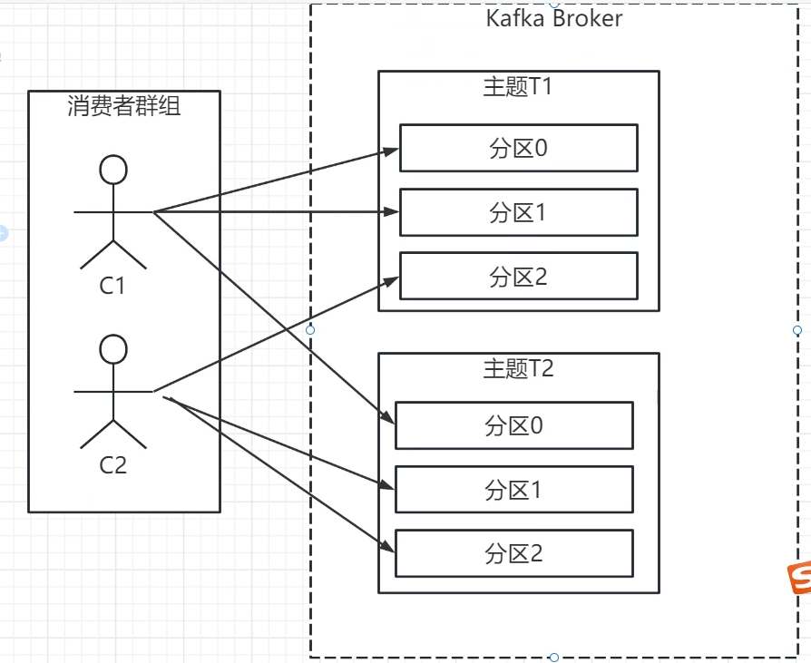

RoundRobin： 通过循环把主题分配给消费者

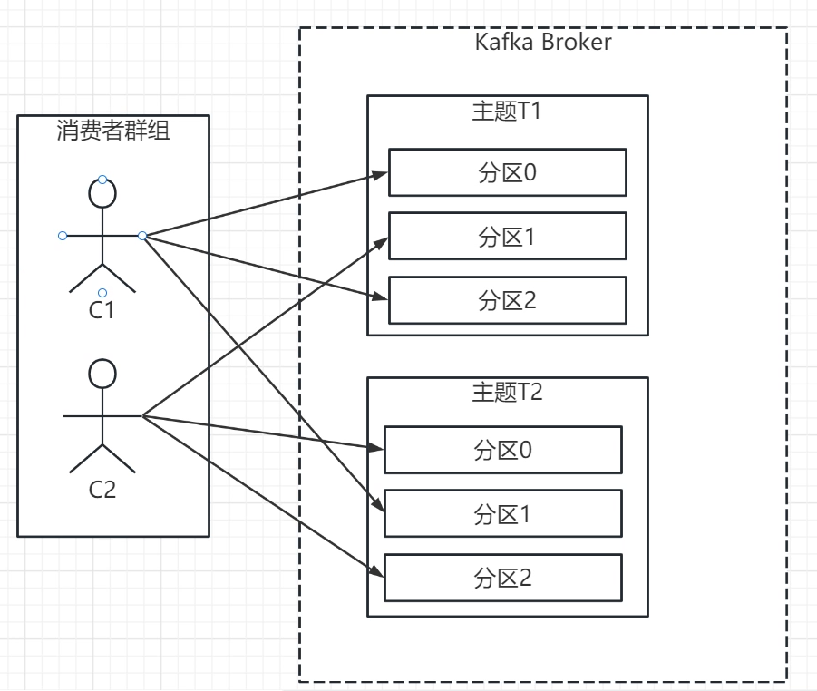

Sticky 粘性分区： 初始分区和 RoundRobin一致，每一次分配变更，相对做最少的变动

初始化分区

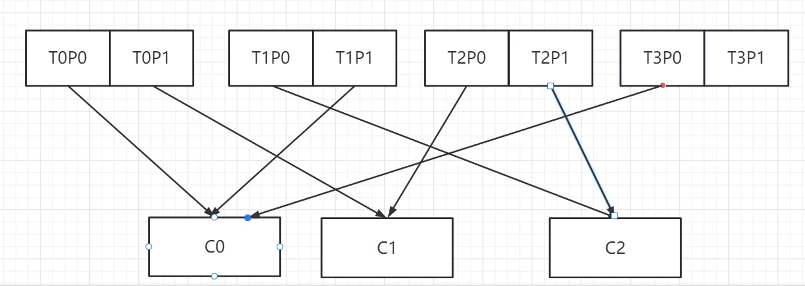

消费者这时候C1下线了

**如果是RoundRobin**

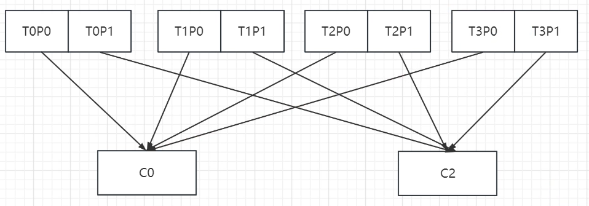

C0 变化了2个 T1P0 T2P0

C2 变化了3个 T0P1 T1P T2P1 T3P1

一共变化了5个

**如果是Sticky**

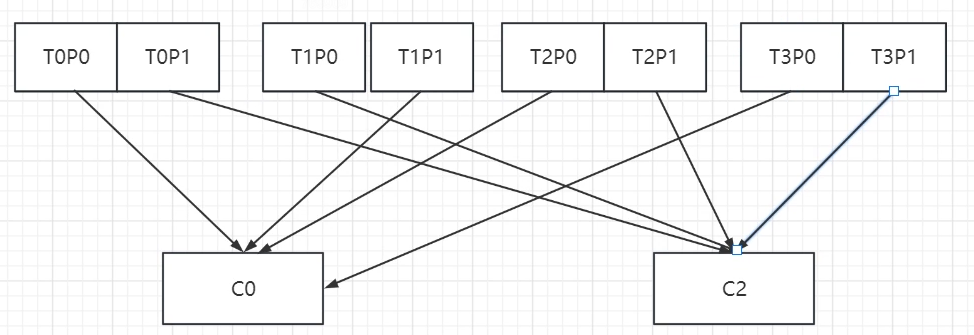

C0 T2P0

C1 T0P1 T3P1

一共变化了3个

```java
private class JoinGroupResponseHandler extends CoordinatorResponseHandler<JoinGroupResponse, ByteBuffer> {
    private JoinGroupResponseHandler(final Generation generation) {
        super(generation);
    }

    @Override
    public void handle(JoinGroupResponse joinResponse, RequestFuture<ByteBuffer> future) {
        Errors error = joinResponse.error();
        if (error == Errors.NONE) {
            if (isProtocolTypeInconsistent(joinResponse.data().protocolType())) {
                log.error("JoinGroup failed: Inconsistent Protocol Type, received {} but expected {}",
                    joinResponse.data().protocolType(), protocolType());
                future.raise(Errors.INCONSISTENT_GROUP_PROTOCOL);
            } else {
                log.debug("Received successful JoinGroup response: {}", joinResponse);
                sensors.joinSensor.record(response.requestLatencyMs());

                synchronized (AbstractCoordinator.this) {
                    if (state != MemberState.PREPARING_REBALANCE) {
                        // if the consumer was woken up before a rebalance completes, we may have already left
                        // the group. In this case, we do not want to continue with the sync group.
                        future.raise(new UnjoinedGroupException());
                    } else {
                        state = MemberState.COMPLETING_REBALANCE;

                        // we only need to enable heartbeat thread whenever we transit to
                        // COMPLETING_REBALANCE state since we always transit from this state to STABLE
                        if (heartbeatThread != null)
                            heartbeatThread.enable();

                        AbstractCoordinator.this.generation = new Generation(
                            joinResponse.data().generationId(),
                            joinResponse.data().memberId(), joinResponse.data().protocolName());

                        log.info("Successfully joined group with generation {}", AbstractCoordinator.this.generation);
                        // 1. 所有消息都可发送joinGroup请求
                        // 2. 只会有一个leader
                        // 3. 如果是leader就要进行分区，发送给broker
                        // 4. 如果不是，则从leader进行同步
                        if (joinResponse.isLeader()) {
                            onLeaderElected(joinResponse).chain(future);
                        } else {
                            onJoinFollower().chain(future);
                        }
                    }
                }
            }
        } else if (error == Errors.COORDINATOR_LOAD_IN_PROGRESS) {
            log.info("JoinGroup failed: Coordinator {} is loading the group.", coordinator());
            // backoff and retry
            future.raise(error);
        } else if (error == Errors.UNKNOWN_MEMBER_ID) {
            log.info("JoinGroup failed: {} Need to re-join the group. Sent generation was {}",
                     error.message(), sentGeneration);
            // only need to reset the member id if generation has not been changed,
            // then retry immediately
            if (generationUnchanged())
                resetStateOnResponseError(ApiKeys.JOIN_GROUP, error, true);

            future.raise(error);
        } else if (error == Errors.COORDINATOR_NOT_AVAILABLE
                || error == Errors.NOT_COORDINATOR) {
            // re-discover the coordinator and retry with backoff
            markCoordinatorUnknown(error);
            log.info("JoinGroup failed: {} Marking coordinator unknown. Sent generation was {}",
                      error.message(), sentGeneration);
            future.raise(error);
        } else if (error == Errors.FENCED_INSTANCE_ID) {
            // for join-group request, even if the generation has changed we would not expect the instance id
            // gets fenced, and hence we always treat this as a fatal error
            log.error("JoinGroup failed: The group instance id {} has been fenced by another instance. " +
                          "Sent generation was {}", rebalanceConfig.groupInstanceId, sentGeneration);
            future.raise(error);
        } else if (error == Errors.INCONSISTENT_GROUP_PROTOCOL
                || error == Errors.INVALID_SESSION_TIMEOUT
                || error == Errors.INVALID_GROUP_ID
                || error == Errors.GROUP_AUTHORIZATION_FAILED
                || error == Errors.GROUP_MAX_SIZE_REACHED) {
            // log the error and re-throw the exception
            log.error("JoinGroup failed due to fatal error: {}", error.message());
            if (error == Errors.GROUP_MAX_SIZE_REACHED) {
                future.raise(new GroupMaxSizeReachedException("Consumer group " + rebalanceConfig.groupId +
                        " already has the configured maximum number of members."));
            } else if (error == Errors.GROUP_AUTHORIZATION_FAILED) {
                future.raise(GroupAuthorizationException.forGroupId(rebalanceConfig.groupId));
            } else {
                future.raise(error);
            }
        } else if (error == Errors.UNSUPPORTED_VERSION) {
            log.error("JoinGroup failed due to unsupported version error. Please unset field group.instance.id " +
                      "and retry to see if the problem resolves");
            future.raise(error);
        } else if (error == Errors.MEMBER_ID_REQUIRED) {
            // Broker requires a concrete member id to be allowed to join the group. Update member id
            // and send another join group request in next cycle.
            String memberId = joinResponse.data().memberId();
            log.debug("JoinGroup failed due to non-fatal error: {}. Will set the member id as {} and then rejoin. " +
                          "Sent generation was {}", error, memberId, sentGeneration);
            synchronized (AbstractCoordinator.this) {
                AbstractCoordinator.this.generation = new Generation(OffsetCommitRequest.DEFAULT_GENERATION_ID, memberId, null);
            }
            requestRejoin("need to re-join with the given member-id: " + memberId);

            future.raise(error);
        } else if (error == Errors.REBALANCE_IN_PROGRESS) {
            log.info("JoinGroup failed due to non-fatal error: REBALANCE_IN_PROGRESS, " +
                "which could indicate a replication timeout on the broker. Will retry.");
            future.raise(error);
        } else {
            // unexpected error, throw the exception
            log.error("JoinGroup failed due to unexpected error: {}", error.message());
            future.raise(new KafkaException("Unexpected error in join group response: " + error.message()));
        }
    }
}
```

```java
private RequestFuture<ByteBuffer> onLeaderElected(JoinGroupResponse joinResponse) {
    try {
        // perform the leader synchronization and send back the assignment for the group
        // 制定分区的方案
        Map<String, ByteBuffer> groupAssignment = onLeaderElected(
            joinResponse.data().leader(),
            joinResponse.data().protocolName(),
            joinResponse.data().members(),
            joinResponse.data().skipAssignment()
        );

        // 分组数据的分配
        List<SyncGroupRequestData.SyncGroupRequestAssignment> groupAssignmentList = new ArrayList<>();
        for (Map.Entry<String, ByteBuffer> assignment : groupAssignment.entrySet()) {
            groupAssignmentList.add(new SyncGroupRequestData.SyncGroupRequestAssignment()
                    .setMemberId(assignment.getKey())
                    .setAssignment(Utils.toArray(assignment.getValue()))
            );
        }

        // 网络通讯
        SyncGroupRequest.Builder requestBuilder =
                new SyncGroupRequest.Builder(
                        new SyncGroupRequestData()
                                .setGroupId(rebalanceConfig.groupId)
                                .setMemberId(generation.memberId)
                                .setProtocolType(protocolType())
                                .setProtocolName(generation.protocolName)
                                .setGroupInstanceId(this.rebalanceConfig.groupInstanceId.orElse(null))
                                .setGenerationId(generation.generationId)
                                .setAssignments(groupAssignmentList)
                );
        log.debug("Sending leader SyncGroup to coordinator {}: {}", this.coordinator, requestBuilder);
        // 发送分组情况
        return sendSyncGroupRequest(requestBuilder);
    } catch (RuntimeException e) {
        return RequestFuture.failure(e);
    }
}
```

#### 如何拉取数据

```java
private ConsumerRecords<K, V> poll(final Timer timer, final boolean includeMetadataInTimeout) {
    acquireAndEnsureOpen();
    try {
        this.kafkaConsumerMetrics.recordPollStart(timer.currentTimeMs());

        if (this.subscriptions.hasNoSubscriptionOrUserAssignment()) {
            throw new IllegalStateException("Consumer is not subscribed to any topics or assigned any partitions");
        }

        // 不断拉取数据
        do {
            client.maybeTriggerWakeup();

            if (includeMetadataInTimeout) {
                // try to update assignment metadata BUT do not need to block on the timer for join group
                // 核心方法
                updateAssignmentMetadataIfNeeded(timer, false);
            } else {
                while (!updateAssignmentMetadataIfNeeded(time.timer(Long.MAX_VALUE), true)) {
                    log.warn("Still waiting for metadata");
                }
            }
						// 拉数据
            final Fetch<K, V> fetch = pollForFetches(timer);
            if (!fetch.isEmpty()) {
                // before returning the fetched records, we can send off the next round of fetches
                // and avoid block waiting for their responses to enable pipelining while the user
                // is handling the fetched records.
                //
                // NOTE: since the consumed position has already been updated, we must not allow
                // wakeups or any other errors to be triggered prior to returning the fetched records.
                if (fetcher.sendFetches() > 0 || client.hasPendingRequests()) {
                    client.transmitSends();
                }

                if (fetch.records().isEmpty()) {
                    log.trace("Returning empty records from `poll()` "
                            + "since the consumer's position has advanced for at least one topic partition");
                }

                return this.interceptors.onConsume(new ConsumerRecords<>(fetch.records()));
            }
            // 时间没有失效一直poll
        } while (timer.notExpired());

        return ConsumerRecords.empty();
    } finally {
        release();
        this.kafkaConsumerMetrics.recordPollEnd(timer.currentTimeMs());
    }
}
```

```java
/**
 * @throws KafkaException if the rebalance callback throws exception
 */
private Fetch<K, V> pollForFetches(Timer timer) {
    long pollTimeout = coordinator == null ? timer.remainingMs() :
            Math.min(coordinator.timeToNextPoll(timer.currentTimeMs()), timer.remainingMs());

    // if data is available already, return it immediately
    final Fetch<K, V> fetch = fetcher.collectFetch();
    if (!fetch.isEmpty()) {
        return fetch;
    }

    // send any new fetches (won't resend pending fetches)
    fetcher.sendFetches();

    // We do not want to be stuck blocking in poll if we are missing some positions
    // since the offset lookup may be backing off after a failure

    // NOTE: the use of cachedSubscriptionHasAllFetchPositions means we MUST call
    // updateAssignmentMetadataIfNeeded before this method.
    if (!cachedSubscriptionHasAllFetchPositions && pollTimeout > retryBackoffMs) {
        pollTimeout = retryBackoffMs;
    }

    log.trace("Polling for fetches with timeout {}", pollTimeout);

    Timer pollTimer = time.timer(pollTimeout);
    client.poll(pollTimer, () -> {
        // since a fetch might be completed by the background thread, we need this poll condition
        // to ensure that we do not block unnecessarily in poll()
        return !fetcher.hasAvailableFetches();
    });
    timer.update(pollTimer.currentTimeMs());

    return fetcher.collectFetch();
}
```

```java
/**
 * @throws KafkaException if the rebalance callback throws exception
 */
private Fetch<K, V> pollForFetches(Timer timer) {
    long pollTimeout = coordinator == null ? timer.remainingMs() :
            Math.min(coordinator.timeToNextPoll(timer.currentTimeMs()), timer.remainingMs());

    // if data is available already, return it immediately
    final Fetch<K, V> fetch = fetcher.collectFetch();
    if (!fetch.isEmpty()) {
        return fetch;
    }

    // send any new fetches (won't resend pending fetches)
    fetcher.sendFetches();

    // We do not want to be stuck blocking in poll if we are missing some positions
    // since the offset lookup may be backing off after a failure

    // NOTE: the use of cachedSubscriptionHasAllFetchPositions means we MUST call
    // updateAssignmentMetadataIfNeeded before this method.
    if (!cachedSubscriptionHasAllFetchPositions && pollTimeout > retryBackoffMs) {
        pollTimeout = retryBackoffMs;
    }

    log.trace("Polling for fetches with timeout {}", pollTimeout);

    Timer pollTimer = time.timer(pollTimeout);
    client.poll(pollTimer, () -> {
        // since a fetch might be completed by the background thread, we need this poll condition
        // to ensure that we do not block unnecessarily in poll()
        return !fetcher.hasAvailableFetches();
    });
    timer.update(pollTimer.currentTimeMs());

    return fetcher.collectFetch();
}
```

```java
public synchronized int sendFetches() {
    // Update metrics in case there was an assignment change
    sensors.maybeUpdateAssignment(subscriptions);

    Map<Node, FetchSessionHandler.FetchRequestData> fetchRequestMap = prepareFetchRequests();
    for (Map.Entry<Node, FetchSessionHandler.FetchRequestData> entry : fetchRequestMap.entrySet()) {
        final Node fetchTarget = entry.getKey();
        final FetchSessionHandler.FetchRequestData data = entry.getValue();
        final short maxVersion;
        if (!data.canUseTopicIds()) {
            maxVersion = (short) 12;
        } else {
            maxVersion = ApiKeys.FETCH.latestVersion();
        }
        // 构造拉取请求
        final FetchRequest.Builder request = FetchRequest.Builder
                .forConsumer(maxVersion, this.maxWaitMs, this.minBytes, data.toSend())
                .isolationLevel(isolationLevel)
                .setMaxBytes(this.maxBytes)
                .metadata(data.metadata())
                .removed(data.toForget())
                .replaced(data.toReplace())
                .rackId(clientRackId);

        if (log.isDebugEnabled()) {
            log.debug("Sending {} {} to broker {}", isolationLevel, data.toString(), fetchTarget);
        }
        // 网络组件调用
        RequestFuture<ClientResponse> future = client.send(fetchTarget, request);
        // We add the node to the set of nodes with pending fetch requests before adding the
        // listener because the future may have been fulfilled on another thread (e.g. during a
        // disconnection being handled by the heartbeat thread) which will mean the listener
        // will be invoked synchronously.
        this.nodesWithPendingFetchRequests.add(entry.getKey().id());
        // 添加监听器
        future.addListener(new RequestFutureListener<ClientResponse>() {
            @Override
            public void onSuccess(ClientResponse resp) {
                synchronized (Fetcher.this) {
                    try {
                        FetchResponse response = (FetchResponse) resp.responseBody();
                        FetchSessionHandler handler = sessionHandler(fetchTarget.id());
                        if (handler == null) {
                            log.error("Unable to find FetchSessionHandler for node {}. Ignoring fetch response.",
                                    fetchTarget.id());
                            return;
                        }
                        if (!handler.handleResponse(response, resp.requestHeader().apiVersion())) {
                            if (response.error() == Errors.FETCH_SESSION_TOPIC_ID_ERROR) {
                                metadata.requestUpdate();
                            }
                            return;
                        }

                        Map<TopicPartition, FetchResponseData.PartitionData> responseData = response.responseData(handler.sessionTopicNames(), resp.requestHeader().apiVersion());
                        Set<TopicPartition> partitions = new HashSet<>(responseData.keySet());
                        FetchResponseMetricAggregator metricAggregator = new FetchResponseMetricAggregator(sensors, partitions);

                        for (Map.Entry<TopicPartition, FetchResponseData.PartitionData> entry : responseData.entrySet()) {
                            TopicPartition partition = entry.getKey();
                            FetchRequest.PartitionData requestData = data.sessionPartitions().get(partition);
                            if (requestData == null) {
                                String message;
                                if (data.metadata().isFull()) {
                                    message = MessageFormatter.arrayFormat(
                                            "Response for missing full request partition: partition={}; metadata={}",
                                            new Object[]{partition, data.metadata()}).getMessage();
                                } else {
                                    message = MessageFormatter.arrayFormat(
                                            "Response for missing session request partition: partition={}; metadata={}; toSend={}; toForget={}; toReplace={}",
                                            new Object[]{partition, data.metadata(), data.toSend(), data.toForget(), data.toReplace()}).getMessage();
                                }

                                // Received fetch response for missing session partition
                                throw new IllegalStateException(message);
                            } else {
                                long fetchOffset = requestData.fetchOffset;
                                FetchResponseData.PartitionData partitionData = entry.getValue();

                                log.debug("Fetch {} at offset {} for partition {} returned fetch data {}",
                                        isolationLevel, fetchOffset, partition, partitionData);

                                Iterator<? extends RecordBatch> batches = FetchResponse.recordsOrFail(partitionData).batches().iterator();
                                short responseVersion = resp.requestHeader().apiVersion();

                                completedFetches.add(new CompletedFetch(partition, partitionData,
                                        metricAggregator, batches, fetchOffset, responseVersion));
                            }
                        }

                        sensors.fetchLatency.record(resp.requestLatencyMs());
                    } finally {
                        nodesWithPendingFetchRequests.remove(fetchTarget.id());
                    }
                }
            }

            @Override
            public void onFailure(RuntimeException e) {
                synchronized (Fetcher.this) {
                    try {
                        FetchSessionHandler handler = sessionHandler(fetchTarget.id());
                        if (handler != null) {
                            handler.handleError(e);
                        }
                    } finally {
                        nodesWithPendingFetchRequests.remove(fetchTarget.id());
                    }
                }
            }
        });

    }
    return fetchRequestMap.size();
}
```

#### 偏移量自动提交

ConsumerCoordinator

```java
    public void maybeAutoCommitOffsetsAsync(long now) {
        if (autoCommitEnabled) {
            // 开启自动提交修改计时器
            nextAutoCommitTimer.update(now);
            if (nextAutoCommitTimer.isExpired()) {
                // 隔多久提交
                nextAutoCommitTimer.reset(autoCommitIntervalMs);
                //
                autoCommitOffsetsAsync();
            }
        }
    }
```

```java
private RequestFuture<Void> autoCommitOffsetsAsync() {
    // 拿取所有消费者的偏移量
    Map<TopicPartition, OffsetAndMetadata> allConsumedOffsets = subscriptions.allConsumed();
    log.debug("Sending asynchronous auto-commit of offsets {}", allConsumedOffsets);

    return commitOffsetsAsync(allConsumedOffsets, (offsets, exception) -> {
        if (exception != null) {
            if (exception instanceof RetriableCommitFailedException) {
                log.debug("Asynchronous auto-commit of offsets {} failed due to retriable error: {}", offsets,
                    exception);
                nextAutoCommitTimer.updateAndReset(rebalanceConfig.retryBackoffMs);
            } else {
                log.warn("Asynchronous auto-commit of offsets {} failed: {}", offsets, exception.getMessage());
            }
        } else {
            log.debug("Completed asynchronous auto-commit of offsets {}", offsets);
        }
    });
}
```

```java
public RequestFuture<Void> commitOffsetsAsync(final Map<TopicPartition, OffsetAndMetadata> offsets, final OffsetCommitCallback callback) {
    invokeCompletedOffsetCommitCallbacks();

    RequestFuture<Void> future = null;
    if (offsets.isEmpty()) {
        // No need to check coordinator if offsets is empty since commit of empty offsets is completed locally.
        future = doCommitOffsetsAsync(offsets, callback);
    } else if (!coordinatorUnknownAndUnreadyAsync()) {
        // we need to make sure coordinator is ready before committing, since
        // this is for async committing we do not try to block, but just try once to
        // clear the previous discover-coordinator future, resend, or get responses;
        // if the coordinator is not ready yet then we would just proceed and put that into the
        // pending requests, and future poll calls would still try to complete them.
        //
        // the key here though is that we have to try sending the discover-coordinator if
        // it's not known or ready, since this is the only place we can send such request
        // under manual assignment (there we would not have heartbeat thread trying to auto-rediscover
        // the coordinator).
        future = doCommitOffsetsAsync(offsets, callback);
    } else {
        // we don't know the current coordinator, so try to find it and then send the commit
        // or fail (we don't want recursive retries which can cause offset commits to arrive
        // out of order). Note that there may be multiple offset commits chained to the same
        // coordinator lookup request. This is fine because the listeners will be invoked in
        // the same order that they were added. Note also that AbstractCoordinator prevents
        // multiple concurrent coordinator lookup requests.
        pendingAsyncCommits.incrementAndGet();
        lookupCoordinator().addListener(new RequestFutureListener<Void>() {
            @Override
            public void onSuccess(Void value) {
                pendingAsyncCommits.decrementAndGet();
                doCommitOffsetsAsync(offsets, callback);
                client.pollNoWakeup();
            }

            @Override
            public void onFailure(RuntimeException e) {
                pendingAsyncCommits.decrementAndGet();
                completedOffsetCommits.add(new OffsetCommitCompletion(callback, offsets,
                        new RetriableCommitFailedException(e)));
            }
        });
    }

    // ensure the commit has a chance to be transmitted (without blocking on its completion).
    // Note that commits are treated as heartbeats by the coordinator, so there is no need to
    // explicitly allow heartbeats through delayed task execution.
    client.pollNoWakeup();
    return future;
}
```

```java
private RequestFuture<Void> doCommitOffsetsAsync(final Map<TopicPartition, OffsetAndMetadata> offsets, final OffsetCommitCallback callback) {
    //
    RequestFuture<Void> future = sendOffsetCommitRequest(offsets);
    final OffsetCommitCallback cb = callback == null ? defaultOffsetCommitCallback : callback;
    future.addListener(new RequestFutureListener<Void>() {
        @Override
        public void onSuccess(Void value) {
            if (interceptors != null)
                interceptors.onCommit(offsets);
            completedOffsetCommits.add(new OffsetCommitCompletion(cb, offsets, null));
        }

        @Override
        public void onFailure(RuntimeException e) {
            Exception commitException = e;

            if (e instanceof RetriableException) {
                commitException = new RetriableCommitFailedException(e);
            }
            completedOffsetCommits.add(new OffsetCommitCompletion(cb, offsets, commitException));
            if (commitException instanceof FencedInstanceIdException) {
                asyncCommitFenced.set(true);
            }
        }
    });
    return future;
}
```

```java
RequestFuture<Void> sendOffsetCommitRequest(final Map<TopicPartition, OffsetAndMetadata> offsets) {
    if (offsets.isEmpty())
        return RequestFuture.voidSuccess();

    Node coordinator = checkAndGetCoordinator();
    if (coordinator == null)
        return RequestFuture.coordinatorNotAvailable();

    // create the offset commit request
    // 主题相关的核心信息
    Map<String, OffsetCommitRequestData.OffsetCommitRequestTopic> requestTopicDataMap = new HashMap<>();
    for (Map.Entry<TopicPartition, OffsetAndMetadata> entry : offsets.entrySet()) {
        TopicPartition topicPartition = entry.getKey();
        OffsetAndMetadata offsetAndMetadata = entry.getValue();
        if (offsetAndMetadata.offset() < 0) {
            return RequestFuture.failure(new IllegalArgumentException("Invalid offset: " + offsetAndMetadata.offset()));
        }

        OffsetCommitRequestData.OffsetCommitRequestTopic topic = requestTopicDataMap
                .getOrDefault(topicPartition.topic(),
                        new OffsetCommitRequestData.OffsetCommitRequestTopic()
                                .setName(topicPartition.topic())
                );

        topic.partitions().add(new OffsetCommitRequestData.OffsetCommitRequestPartition()
                .setPartitionIndex(topicPartition.partition())
                .setCommittedOffset(offsetAndMetadata.offset())
                .setCommittedLeaderEpoch(offsetAndMetadata.leaderEpoch().orElse(RecordBatch.NO_PARTITION_LEADER_EPOCH))
                .setCommittedMetadata(offsetAndMetadata.metadata())
        );
        requestTopicDataMap.put(topicPartition.topic(), topic);
    }

    final Generation generation;
    final String groupInstanceId;
    if (subscriptions.hasAutoAssignedPartitions()) {
        generation = generationIfStable();
        groupInstanceId = rebalanceConfig.groupInstanceId.orElse(null);
        // if the generation is null, we are not part of an active group (and we expect to be).
        // the only thing we can do is fail the commit and let the user rejoin the group in poll().
        if (generation == null) {
            log.info("Failing OffsetCommit request since the consumer is not part of an active group");

            if (rebalanceInProgress()) {
                // if the client knows it is already rebalancing, we can use RebalanceInProgressException instead of
                // CommitFailedException to indicate this is not a fatal error
                return RequestFuture.failure(new RebalanceInProgressException("Offset commit cannot be completed since the " +
                    "consumer is undergoing a rebalance for auto partition assignment. You can try completing the rebalance " +
                    "by calling poll() and then retry the operation."));
            } else {
                return RequestFuture.failure(new CommitFailedException("Offset commit cannot be completed since the " +
                    "consumer is not part of an active group for auto partition assignment; it is likely that the consumer " +
                    "was kicked out of the group."));
            }
        }
    } else {
        generation = Generation.NO_GENERATION;
        groupInstanceId = null;
    }
		
    // 构建网络通讯参数 
    OffsetCommitRequest.Builder builder = new OffsetCommitRequest.Builder(
            new OffsetCommitRequestData()
                    .setGroupId(this.rebalanceConfig.groupId)
                    .setGenerationId(generation.generationId)
                    .setMemberId(generation.memberId)
                    .setGroupInstanceId(groupInstanceId)
                    .setTopics(new ArrayList<>(requestTopicDataMap.values()))
    );

    log.trace("Sending OffsetCommit request with {} to coordinator {}", offsets, coordinator);
		// 网络通讯
    return client.send(coordinator, builder)
      			// OffsetCommitResponseHandler里获取结果
            .compose(new OffsetCommitResponseHandler(offsets, generation));
}
```

自动偏移量提交默认5s

核心组件是ConsumerCoordinator来提交

每次poll 到最后的代码处理会自动提交

间隔时间5s，如果没到下次自动提交的时间也不会提交

### 网络通讯模型

 

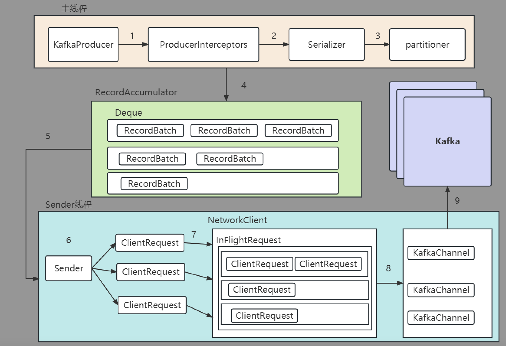

#### producer

```java
/**
 * Implementation of asynchronously send a record to a topic.
 */
private Future<RecordMetadata> doSend(ProducerRecord<K, V> record, Callback callback) {
    // Append callback takes care of the following:
    //  - call interceptors and user callback on completion
    //  - remember partition that is calculated in RecordAccumulator.append
    AppendCallbacks<K, V> appendCallbacks = new AppendCallbacks<K, V>(callback, this.interceptors, record);

    try {
        throwIfProducerClosed();
        // first make sure the metadata for the topic is available
        long nowMs = time.milliseconds();
        ClusterAndWaitTime clusterAndWaitTime;
        try {
            // 获取集群的元数据
            clusterAndWaitTime = waitOnMetadata(record.topic(), record.partition(), nowMs, maxBlockTimeMs);
        } catch (KafkaException e) {
            if (metadata.isClosed())
                throw new KafkaException("Producer closed while send in progress", e);
            throw e;
        }
        nowMs += clusterAndWaitTime.waitedOnMetadataMs;
        long remainingWaitMs = Math.max(0, maxBlockTimeMs - clusterAndWaitTime.waitedOnMetadataMs);
        Cluster cluster = clusterAndWaitTime.cluster;
        byte[] serializedKey;
        try {
            serializedKey = keySerializer.serialize(record.topic(), record.headers(), record.key());
        } catch (ClassCastException cce) {
            throw new SerializationException("Can't convert key of class " + record.key().getClass().getName() +
                    " to class " + producerConfig.getClass(ProducerConfig.KEY_SERIALIZER_CLASS_CONFIG).getName() +
                    " specified in key.serializer", cce);
        }
        byte[] serializedValue;
        try {
            serializedValue = valueSerializer.serialize(record.topic(), record.headers(), record.value());
        } catch (ClassCastException cce) {
            throw new SerializationException("Can't convert value of class " + record.value().getClass().getName() +
                    " to class " + producerConfig.getClass(ProducerConfig.VALUE_SERIALIZER_CLASS_CONFIG).getName() +
                    " specified in value.serializer", cce);
        }

        // Try to calculate partition, but note that after this call it can be RecordMetadata.UNKNOWN_PARTITION,
        // which means that the RecordAccumulator would pick a partition using built-in logic (which may
        // take into account broker load, the amount of data produced to each partition, etc.).
        int partition = partition(record, serializedKey, serializedValue, cluster);

        setReadOnly(record.headers());
        Header[] headers = record.headers().toArray();

        int serializedSize = AbstractRecords.estimateSizeInBytesUpperBound(apiVersions.maxUsableProduceMagic(),
                compressionType, serializedKey, serializedValue, headers);
        ensureValidRecordSize(serializedSize);
        long timestamp = record.timestamp() == null ? nowMs : record.timestamp();

        // A custom partitioner may take advantage on the onNewBatch callback.
        boolean abortOnNewBatch = partitioner != null;

        // Append the record to the accumulator.  Note, that the actual partition may be
        // calculated there and can be accessed via appendCallbacks.topicPartition.
        RecordAccumulator.RecordAppendResult result = accumulator.append(record.topic(), partition, timestamp, serializedKey,
                serializedValue, headers, appendCallbacks, remainingWaitMs, abortOnNewBatch, nowMs, cluster);
        assert appendCallbacks.getPartition() != RecordMetadata.UNKNOWN_PARTITION;

        if (result.abortForNewBatch) {
            int prevPartition = partition;
            onNewBatch(record.topic(), cluster, prevPartition);
            partition = partition(record, serializedKey, serializedValue, cluster);
            if (log.isTraceEnabled()) {
                log.trace("Retrying append due to new batch creation for topic {} partition {}. The old partition was {}", record.topic(), partition, prevPartition);
            }
            result = accumulator.append(record.topic(), partition, timestamp, serializedKey,
                serializedValue, headers, appendCallbacks, remainingWaitMs, false, nowMs, cluster);
        }

        // Add the partition to the transaction (if in progress) after it has been successfully
        // appended to the accumulator. We cannot do it before because the partition may be
        // unknown or the initially selected partition may be changed when the batch is closed
        // (as indicated by `abortForNewBatch`). Note that the `Sender` will refuse to dequeue
        // batches from the accumulator until they have been added to the transaction.
        if (transactionManager != null) {
            transactionManager.maybeAddPartition(appendCallbacks.topicPartition());
        }

        // 批量满了 或者建立了新批次 说明要发送了 唤醒sender
        if (result.batchIsFull || result.newBatchCreated) {
            log.trace("Waking up the sender since topic {} partition {} is either full or getting a new batch", record.topic(), appendCallbacks.getPartition());
            this.sender.wakeup();
        }
        return result.future;
        // handling exceptions and record the errors;
        // for API exceptions return them in the future,
        // for other exceptions throw directly
    } catch (ApiException e) {
        log.debug("Exception occurred during message send:", e);
        if (callback != null) {
            TopicPartition tp = appendCallbacks.topicPartition();
            RecordMetadata nullMetadata = new RecordMetadata(tp, -1, -1, RecordBatch.NO_TIMESTAMP, -1, -1);
            callback.onCompletion(nullMetadata, e);
        }
        this.errors.record();
        this.interceptors.onSendError(record, appendCallbacks.topicPartition(), e);
        if (transactionManager != null) {
            transactionManager.maybeTransitionToErrorState(e);
        }
        return new FutureFailure(e);
    } catch (InterruptedException e) {
        this.errors.record();
        this.interceptors.onSendError(record, appendCallbacks.topicPartition(), e);
        throw new InterruptException(e);
    } catch (KafkaException e) {
        this.errors.record();
        this.interceptors.onSendError(record, appendCallbacks.topicPartition(), e);
        throw e;
    } catch (Exception e) {
        // we notify interceptor about all exceptions, since onSend is called before anything else in this method
        this.interceptors.onSendError(record, appendCallbacks.topicPartition(), e);
        throw e;
    }
}
```


```java
public class Sender implements Runnable { // 被唤醒 执行run方法
```

```java
public void run() {
    log.debug("Starting Kafka producer I/O thread.");

    // main loop, runs until close is called
    while (running) {
        try {
            runOnce();
        } catch (Exception e) {
            log.error("Uncaught error in kafka producer I/O thread: ", e);
        }
    }

    log.debug("Beginning shutdown of Kafka producer I/O thread, sending remaining records.");

    // okay we stopped accepting requests but there may still be
    // requests in the transaction manager, accumulator or waiting for acknowledgment,
    // wait until these are completed.
    while (!forceClose && ((this.accumulator.hasUndrained() || this.client.inFlightRequestCount() > 0) || hasPendingTransactionalRequests())) {
        try {
            runOnce();
        } catch (Exception e) {
            log.error("Uncaught error in kafka producer I/O thread: ", e);
        }
    }

    // Abort the transaction if any commit or abort didn't go through the transaction manager's queue
    while (!forceClose && transactionManager != null && transactionManager.hasOngoingTransaction()) {
        if (!transactionManager.isCompleting()) {
            log.info("Aborting incomplete transaction due to shutdown");
            transactionManager.beginAbort();
        }
        try {
            // 执行一次
            runOnce();
        } catch (Exception e) {
            log.error("Uncaught error in kafka producer I/O thread: ", e);
        }
    }

    if (forceClose) {
        // We need to fail all the incomplete transactional requests and batches and wake up the threads waiting on
        // the futures.
        if (transactionManager != null) {
            log.debug("Aborting incomplete transactional requests due to forced shutdown");
            transactionManager.close();
        }
        log.debug("Aborting incomplete batches due to forced shutdown");
        this.accumulator.abortIncompleteBatches();
    }
    try {
        this.client.close();
    } catch (Exception e) {
        log.error("Failed to close network client", e);
    }

    log.debug("Shutdown of Kafka producer I/O thread has completed.");
}
```

```java
void runOnce() {
    if (transactionManager != null) {
        try {
            transactionManager.maybeResolveSequences();

            // do not continue sending if the transaction manager is in a failed state
            if (transactionManager.hasFatalError()) {
                RuntimeException lastError = transactionManager.lastError();
                if (lastError != null)
                    maybeAbortBatches(lastError);
                client.poll(retryBackoffMs, time.milliseconds());
                return;
            }

            // Check whether we need a new producerId. If so, we will enqueue an InitProducerId
            // request which will be sent below
            transactionManager.bumpIdempotentEpochAndResetIdIfNeeded();

            if (maybeSendAndPollTransactionalRequest()) {
                return;
            }
        } catch (AuthenticationException e) {
            // This is already logged as error, but propagated here to perform any clean ups.
            log.trace("Authentication exception while processing transactional request", e);
            transactionManager.authenticationFailed(e);
        }
    }

    long currentTimeMs = time.milliseconds();
    // 核心发送
    long pollTimeout = sendProducerData(currentTimeMs);
    client.poll(pollTimeout, currentTimeMs);
}
```

```java
private long sendProducerData(long now) {
    // 拿到集群元数据
    Cluster cluster = metadata.fetch();
    // get the list of partitions with data ready to send
    // 获取相关的partitions列表准备发送
    RecordAccumulator.ReadyCheckResult result = this.accumulator.ready(cluster, now);

    // if there are any partitions whose leaders are not known yet, force metadata update
    if (!result.unknownLeaderTopics.isEmpty()) {
        // The set of topics with unknown leader contains topics with leader election pending as well as
        // topics which may have expired. Add the topic again to metadata to ensure it is included
        // and request metadata update, since there are messages to send to the topic.
        for (String topic : result.unknownLeaderTopics)
            this.metadata.add(topic, now);

        log.debug("Requesting metadata update due to unknown leader topics from the batched records: {}",
            result.unknownLeaderTopics);
        this.metadata.requestUpdate();
    }

    // remove any nodes we aren't ready to send to
    Iterator<Node> iter = result.readyNodes.iterator();
    long notReadyTimeout = Long.MAX_VALUE;
    while (iter.hasNext()) {
        Node node = iter.next();
        if (!this.client.ready(node, now)) {
            // Update just the readyTimeMs of the latency stats, so that it moves forward
            // every time the batch is ready (then the difference between readyTimeMs and
            // drainTimeMs would represent how long data is waiting for the node).
            this.accumulator.updateNodeLatencyStats(node.id(), now, false);
            iter.remove();
            notReadyTimeout = Math.min(notReadyTimeout, this.client.pollDelayMs(node, now));
        } else {
            // Update both readyTimeMs and drainTimeMs, this would "reset" the node
            // latency.
            this.accumulator.updateNodeLatencyStats(node.id(), now, true);
        }
    }

    // create produce requests
    // 从accumulator里拿到了批次 获取dq加锁
    Map<Integer, List<ProducerBatch>> batches = this.accumulator.drain(cluster, result.readyNodes, this.maxRequestSize, now);
  	// 添加到inflightRequest里
    addToInflightBatches(batches);
    if (guaranteeMessageOrder) {
        // Mute all the partitions drained
        for (List<ProducerBatch> batchList : batches.values()) {
            for (ProducerBatch batch : batchList)
                this.accumulator.mutePartition(batch.topicPartition);
        }
    }

    accumulator.resetNextBatchExpiryTime();
    List<ProducerBatch> expiredInflightBatches = getExpiredInflightBatches(now);
    List<ProducerBatch> expiredBatches = this.accumulator.expiredBatches(now);
    expiredBatches.addAll(expiredInflightBatches);

    // Reset the producer id if an expired batch has previously been sent to the broker. Also update the metrics
    // for expired batches. see the documentation of @TransactionState.resetIdempotentProducerId to understand why
    // we need to reset the producer id here.
    if (!expiredBatches.isEmpty())
        log.trace("Expired {} batches in accumulator", expiredBatches.size());
    for (ProducerBatch expiredBatch : expiredBatches) {
        String errorMessage = "Expiring " + expiredBatch.recordCount + " record(s) for " + expiredBatch.topicPartition
            + ":" + (now - expiredBatch.createdMs) + " ms has passed since batch creation";
        failBatch(expiredBatch, new TimeoutException(errorMessage), false);
        if (transactionManager != null && expiredBatch.inRetry()) {
            // This ensures that no new batches are drained until the current in flight batches are fully resolved.
            transactionManager.markSequenceUnresolved(expiredBatch);
        }
    }
    sensors.updateProduceRequestMetrics(batches);

    // If we have any nodes that are ready to send + have sendable data, poll with 0 timeout so this can immediately
    // loop and try sending more data. Otherwise, the timeout will be the smaller value between next batch expiry
    // time, and the delay time for checking data availability. Note that the nodes may have data that isn't yet
    // sendable due to lingering, backing off, etc. This specifically does not include nodes with sendable data
    // that aren't ready to send since they would cause busy looping.
    long pollTimeout = Math.min(result.nextReadyCheckDelayMs, notReadyTimeout);
    pollTimeout = Math.min(pollTimeout, this.accumulator.nextExpiryTimeMs() - now);
    pollTimeout = Math.max(pollTimeout, 0);
    if (!result.readyNodes.isEmpty()) {
        log.trace("Nodes with data ready to send: {}", result.readyNodes);
        // if some partitions are already ready to be sent, the select time would be 0;
        // otherwise if some partition already has some data accumulated but not ready yet,
        // the select time will be the time difference between now and its linger expiry time;
        // otherwise the select time will be the time difference between now and the metadata expiry time;
        pollTimeout = 0;
    }
  	// 发送
    sendProduceRequests(batches, now);
    return pollTimeout;
}
```

```java
private void sendProduceRequest(long now, int destination, short acks, int timeout, List<ProducerBatch> batches) {
    if (batches.isEmpty())
        return;

    final Map<TopicPartition, ProducerBatch> recordsByPartition = new HashMap<>(batches.size());

    // find the minimum magic version used when creating the record sets
    byte minUsedMagic = apiVersions.maxUsableProduceMagic();
    for (ProducerBatch batch : batches) {
        if (batch.magic() < minUsedMagic)
            minUsedMagic = batch.magic();
    }
    ProduceRequestData.TopicProduceDataCollection tpd = new ProduceRequestData.TopicProduceDataCollection();
    for (ProducerBatch batch : batches) {
        TopicPartition tp = batch.topicPartition;
        MemoryRecords records = batch.records();

        // down convert if necessary to the minimum magic used. In general, there can be a delay between the time
        // that the producer starts building the batch and the time that we send the request, and we may have
        // chosen the message format based on out-dated metadata. In the worst case, we optimistically chose to use
        // the new message format, but found that the broker didn't support it, so we need to down-convert on the
        // client before sending. This is intended to handle edge cases around cluster upgrades where brokers may
        // not all support the same message format version. For example, if a partition migrates from a broker
        // which is supporting the new magic version to one which doesn't, then we will need to convert.
        if (!records.hasMatchingMagic(minUsedMagic))
            records = batch.records().downConvert(minUsedMagic, 0, time).records();
        ProduceRequestData.TopicProduceData tpData = tpd.find(tp.topic());
        if (tpData == null) {
            tpData = new ProduceRequestData.TopicProduceData().setName(tp.topic());
            tpd.add(tpData);
        }
        tpData.partitionData().add(new ProduceRequestData.PartitionProduceData()
                .setIndex(tp.partition())
                .setRecords(records));
        recordsByPartition.put(tp, batch);
    }

    String transactionalId = null;
    if (transactionManager != null && transactionManager.isTransactional()) {
        transactionalId = transactionManager.transactionalId();
    }
    // 构建请求
    ProduceRequest.Builder requestBuilder = ProduceRequest.forMagic(minUsedMagic,
            new ProduceRequestData()
                    .setAcks(acks)
                    .setTimeoutMs(timeout)
                    .setTransactionalId(transactionalId)
                    .setTopicData(tpd));
    RequestCompletionHandler callback = response -> handleProduceResponse(response, recordsByPartition, time.milliseconds());

    String nodeId = Integer.toString(destination);
    // new 网络发送的客户端
    ClientRequest clientRequest = client.newClientRequest(nodeId, requestBuilder, now, acks != 0,
            requestTimeoutMs, callback);
    client.send(clientRequest, now);
    log.trace("Sent produce request to {}: {}", nodeId, requestBuilder);
}
```

```java
private void doSend(ClientRequest clientRequest, boolean isInternalRequest, long now, AbstractRequest request) {
    String destination = clientRequest.destination();
    RequestHeader header = clientRequest.makeHeader(request.version());
    if (log.isDebugEnabled()) {
        log.debug("Sending {} request with header {} and timeout {} to node {}: {}",
            clientRequest.apiKey(), header, clientRequest.requestTimeoutMs(), destination, request);
    }
    Send send = request.toSend(header);
    InFlightRequest inFlightRequest = new InFlightRequest(
            clientRequest,
            header,
            isInternalRequest,
            request,
            send,
            now);
    this.inFlightRequests.add(inFlightRequest);
    // selector 模型
    selector.send(new NetworkSend(clientRequest.destination(), send));
}
```

##### NIO的三大核心组件

Selector、Channel、buffer缓冲区

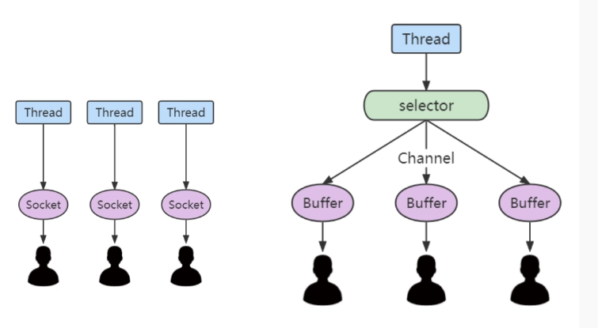

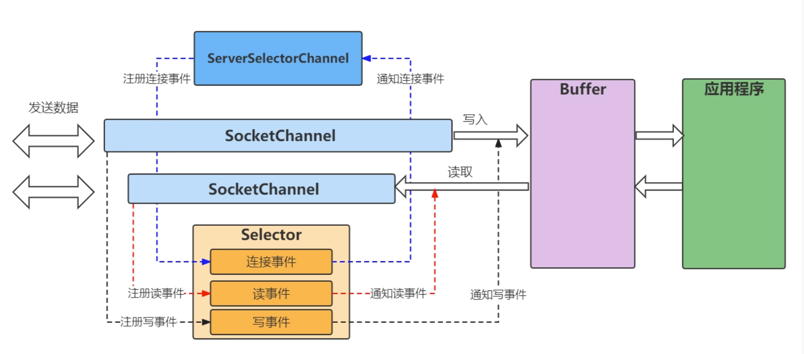

要使用Selector，得向Selector注册Channel，然后调用它的select()方法。这个方法会一直阻塞到某个注册的通道有事件就绪。一旦这个方法返回，线程就可以处理这些事件，事件的例子有如新连接进来，数据接收等。

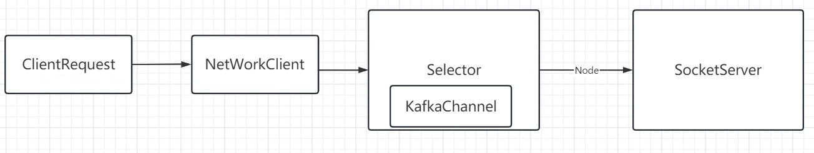


NetworkClient

构造方法执行之后调用ready

```java
public boolean ready(Node node, long now) {
    if (node.isEmpty())
        throw new IllegalArgumentException("Cannot connect to empty node " + node);

    if (isReady(node, now))
        return true;

    if (connectionStates.canConnect(node.idString(), now))
        // if we are interested in sending to a node and we don't have a connection to it, initiate one
        // 可以连接
        initiateConnect(node, now);

    return false;
}
```

```java
private void initiateConnect(Node node, long now) {
    String nodeConnectionId = node.idString();
    try {
        connectionStates.connecting(nodeConnectionId, now, node.host());
        InetAddress address = connectionStates.currentAddress(nodeConnectionId);
        log.debug("Initiating connection to node {} using address {}", node, address);
      	// 进入seletor 的connect方法
        selector.connect(nodeConnectionId,
                new InetSocketAddress(address, node.port()),
                this.socketSendBuffer,
                this.socketReceiveBuffer);
    } catch (IOException e) {
        log.warn("Error connecting to node {}", node, e);
        // Attempt failed, we'll try again after the backoff
        connectionStates.disconnected(nodeConnectionId, now);
        // Notify metadata updater of the connection failure
        metadataUpdater.handleServerDisconnect(now, nodeConnectionId, Optional.empty());
    }
}
```

Selector

```java
public class Selector implements Selectable, AutoCloseable {
  	// Java NIO中用来建厅网络I/O事件的 selector
    private final java.nio.channels.Selector nioSelector;
  	// chaanels 通道 方便管理
    private final Map<String, KafkaChannel> channels;
  	// 已经发送完成的send 的list
    private final List<NetworkSend> completedSends;
  	// 已经接收完成的send 的list
    private final LinkedHashMap<String, NetworkReceive> completedReceives;
  	// 立刻连接的key的集合
    private final Set<SelectionKey> immediatelyConnectedKeys;
		// 关闭连接的key的集合
    private final Map<String, ChannelState> disconnected;
  	// 连接成功的节点集合
    private final List<String> connected;
		// 用来构造KafkaChannel的工具类
    private final ChannelBuilder channelBuilder;
  	// 可以接收的最大数量大小
    private final int maxReceiveSize;
  
    // 空闲超时到期连接的管理类
    private final IdleExpiryManager idleExpiryManager;
		// 用来管理ByteBuffer的内存池
    private final MemoryPool memoryPool;
    private final long lowMemThreshold;
    private final int failedAuthenticationDelayMs;

    //indicates if the previous call to poll was able to make progress in reading already-buffered data.
    //this is used to prevent tight loops when memory is not available to read any more data
    private boolean madeReadProgressLastPoll = true;

    /**
     * Create a new nioSelector
     * @param maxReceiveSize Max size in bytes of a single network receive (use {@link NetworkReceive#UNLIMITED} for no limit)
     * @param connectionMaxIdleMs Max idle connection time (use {@link #NO_IDLE_TIMEOUT_MS} to disable idle timeout)
     * @param failedAuthenticationDelayMs Minimum time by which failed authentication response and channel close should be delayed by.
     *                                    Use {@link #NO_FAILED_AUTHENTICATION_DELAY} to disable this delay.
     * @param metrics Registry for Selector metrics
     * @param time Time implementation
     * @param metricGrpPrefix Prefix for the group of metrics registered by Selector
     * @param metricTags Additional tags to add to metrics registered by Selector
     * @param metricsPerConnection Whether or not to enable per-connection metrics
     * @param channelBuilder Channel builder for every new connection
     * @param logContext Context for logging with additional info
     */
    public Selector(int maxReceiveSize,
            long connectionMaxIdleMs,
            int failedAuthenticationDelayMs,
            Metrics metrics,
            Time time,
            String metricGrpPrefix,
            Map<String, String> metricTags,
            boolean metricsPerConnection,
            boolean recordTimePerConnection,
            ChannelBuilder channelBuilder,
            MemoryPool memoryPool,
            LogContext logContext) {
        try {
            // 拿到NIO的selector 本质包了一层
            this.nioSelector = java.nio.channels.Selector.open();
        } catch (IOException e) {
            throw new KafkaException(e);
        }
        this.maxReceiveSize = maxReceiveSize;
        this.time = time;
        //     private final Map<String, KafkaChannel> channels;
        this.channels = new HashMap<>();
        this.explicitlyMutedChannels = new HashSet<>();
        this.outOfMemory = false;
        this.completedSends = new ArrayList<>();
        this.completedReceives = new LinkedHashMap<>();
        this.immediatelyConnectedKeys = new HashSet<>();
        this.closingChannels = new HashMap<>();
        this.keysWithBufferedRead = new HashSet<>();
        this.connected = new ArrayList<>();
        this.disconnected = new HashMap<>();
        this.failedSends = new ArrayList<>();
        this.log = logContext.logger(Selector.class);
        this.sensors = new SelectorMetrics(metrics, metricGrpPrefix, metricTags, metricsPerConnection);
        this.channelBuilder = channelBuilder;
        this.recordTimePerConnection = recordTimePerConnection;
        this.idleExpiryManager = connectionMaxIdleMs < 0 ? null : new IdleExpiryManager(time, connectionMaxIdleMs);
        this.memoryPool = memoryPool;
        this.lowMemThreshold = (long) (0.1 * this.memoryPool.size());
        this.failedAuthenticationDelayMs = failedAuthenticationDelayMs;
        this.delayedClosingChannels = (failedAuthenticationDelayMs > NO_FAILED_AUTHENTICATION_DELAY) ? new LinkedHashMap<String, DelayedAuthenticationFailureClose>() : null;
    }
```

selector.connect

```java
public void connect(String id, InetSocketAddress address, int sendBufferSize, int receiveBufferSize) throws IOException {
    ensureNotRegistered(id);
    // 打开得到socketChannel
    SocketChannel socketChannel = SocketChannel.open();
    SelectionKey key = null;
    try {
        // 配置socketChannel
        configureSocketChannel(socketChannel, sendBufferSize, receiveBufferSize);
        // 尝试建立连接
        boolean connected = doConnect(socketChannel, address);
        // 将socketChannel 注册到Selector上 并且关注OP_CONNECT事件
        key = registerChannel(id, socketChannel, SelectionKey.OP_CONNECT);

        if (connected) {
            // OP_CONNECT won't trigger for immediately connected channels
            log.debug("Immediately connected to node {}", id);
            // 如果立刻连接成功，将key加入到immediatelyConnectedKeys中
            immediatelyConnectedKeys.add(key);
            // 取消对OP_CONNECT事件的关注 连接成功了就不用关注了
            key.interestOps(0);
        }
    } catch (IOException | RuntimeException e) {
        if (key != null)
            immediatelyConnectedKeys.remove(key);
        channels.remove(id);
        socketChannel.close();
        throw e;
    }
}
```

```java
private void configureSocketChannel(SocketChannel socketChannel, int sendBufferSize, int receiveBufferSize)
        throws IOException {
  	// 设置为非阻塞
    socketChannel.configureBlocking(false);
    Socket socket = socketChannel.socket();
  	// 启动长连接
    socket.setKeepAlive(true);
    if (sendBufferSize != Selectable.USE_DEFAULT_BUFFER_SIZE)
      	// 发送缓冲大小
        socket.setSendBufferSize(sendBufferSize);
    if (receiveBufferSize != Selectable.USE_DEFAULT_BUFFER_SIZE)
      	// 接受缓冲大小
        socket.setReceiveBufferSize(receiveBufferSize);
  	// 取消tcp发送延迟 不管数据量多少直接发送
    socket.setTcpNoDelay(true);
}
```

```java
protected SelectionKey registerChannel(String id, SocketChannel socketChannel, int interestedOps) throws IOException {
    // 吧socketChannel注册到Selector上
    SelectionKey key = socketChannel.register(nioSelector, interestedOps);
    // 绑定
    KafkaChannel channel = buildAndAttachKafkaChannel(socketChannel, id, key);
    // put
    this.channels.put(id, channel);
    if (idleExpiryManager != null)
        idleExpiryManager.update(channel.id(), time.nanoseconds());
    return key;
}
```


Send 方法

```java
public void send(NetworkSend send) {
        // 同服务端 获取connectionId
        String connectionId = send.destinationId();
        // 获取相关的连接
        KafkaChannel channel = openOrClosingChannelOrFail(connectionId);
        if (closingChannels.containsKey(connectionId)) {
            // 如果连接正在关闭中，直接放入失败集合
            // ensure notification via `disconnected`, leave channel in the state in which closing was triggered
            this.failedSends.add(connectionId);
        } else {
            try {
                // 并没有真正发送 数据的预发送
                channel.setSend(send);
            } catch (Exception e) {
                // update the state for consistency, the channel will be discarded after `close`
                channel.state(ChannelState.FAILED_SEND);
                // ensure notification via `disconnected` when `failedSends` are processed in the next poll
                this.failedSends.add(connectionId);
                close(channel, CloseMode.DISCARD_NO_NOTIFY);
                if (!(e instanceof CancelledKeyException)) {
                    log.error("Unexpected exception during send, closing connection {} and rethrowing exception {}",
                            connectionId, e);
                    throw e;
                }
            }
        }
   }
```

```java
public void setSend(NetworkSend send) {
    if (this.send != null)
        throw new IllegalStateException("Attempt to begin a send operation with prior send operation still in progress, connection id is " + id);
    this.send = send;
    // 这是设置op——write标志位并没有真正的数据发送
    this.transportLayer.addInterestOps(SelectionKey.OP_WRITE);
}
```

poll方法才是真正的消息发送

```java
public void poll(long timeout) throws IOException {
    if (timeout < 0)
        throw new IllegalArgumentException("timeout should be >= 0");

    boolean madeReadProgressLastCall = madeReadProgressLastPoll;
    clear();

    boolean dataInBuffers = !keysWithBufferedRead.isEmpty();

    if (!immediatelyConnectedKeys.isEmpty() || (madeReadProgressLastCall && dataInBuffers))
        timeout = 0;

    if (!memoryPool.isOutOfMemory() && outOfMemory) {
        //we have recovered from memory pressure. unmute any channel not explicitly muted for other reasons
        log.trace("Broker no longer low on memory - unmuting incoming sockets");
        for (KafkaChannel channel : channels.values()) {
            if (channel.isInMutableState() && !explicitlyMutedChannels.contains(channel)) {
                channel.maybeUnmute();
            }
        }
        outOfMemory = false;
    }

    /* check ready keys */
    long startSelect = time.nanoseconds();
  	// 核心方法 调用NIO的select this.nioSelector.select(timeoutMs);
    int numReadyKeys = select(timeout);
    long endSelect = time.nanoseconds();
    this.sensors.selectTime.record(endSelect - startSelect, time.milliseconds());

    if (numReadyKeys > 0 || !immediatelyConnectedKeys.isEmpty() || dataInBuffers) {
        Set<SelectionKey> readyKeys = this.nioSelector.selectedKeys();

        // Poll from channels that have buffered data (but nothing more from the underlying socket)
        if (dataInBuffers) {
            keysWithBufferedRead.removeAll(readyKeys); //so no channel gets polled twice
            Set<SelectionKey> toPoll = keysWithBufferedRead;
            keysWithBufferedRead = new HashSet<>(); //poll() calls will repopulate if needed
          	// 处理事件的核心逻辑 准备就绪的
            pollSelectionKeys(toPoll, false, endSelect);
        }

        // Poll from channels where the underlying socket has more data
      	// 处理事件的核心逻辑 已经连接的
        pollSelectionKeys(readyKeys, false, endSelect);
        // Clear all selected keys so that they are included in the ready count for the next select
        readyKeys.clear();

        pollSelectionKeys(immediatelyConnectedKeys, true, endSelect);
        immediatelyConnectedKeys.clear();
    } else {
        madeReadProgressLastPoll = true; //no work is also "progress"
    }

    long endIo = time.nanoseconds();
    this.sensors.ioTime.record(endIo - endSelect, time.milliseconds());

    // Close channels that were delayed and are now ready to be closed
    completeDelayedChannelClose(endIo);

    // we use the time at the end of select to ensure that we don't close any connections that
    // have just been processed in pollSelectionKeys
    maybeCloseOldestConnection(endSelect);
}
```

```java
void pollSelectionKeys(Set<SelectionKey> selectionKeys,
                       boolean isImmediatelyConnected,
                       long currentTimeNanos) {
    // 遍历每一个key
    for (SelectionKey key : determineHandlingOrder(selectionKeys)) {
        KafkaChannel channel = channel(key);
        long channelStartTimeNanos = recordTimePerConnection ? time.nanoseconds() : 0;
        boolean sendFailed = false;
        String nodeId = channel.id();

        // register all per-connection metrics at once
        sensors.maybeRegisterConnectionMetrics(nodeId);
        if (idleExpiryManager != null)
            idleExpiryManager.update(nodeId, currentTimeNanos);

        try {
            /* complete any connections that have finished their handshake (either normally or immediately) */
            if (isImmediatelyConnected || key.isConnectable()) {
                if (channel.finishConnect()) {
                    // 处理连接完成的
                    this.connected.add(nodeId);
                    this.sensors.connectionCreated.record();

                    SocketChannel socketChannel = (SocketChannel) key.channel();
                    log.debug("Created socket with SO_RCVBUF = {}, SO_SNDBUF = {}, SO_TIMEOUT = {} to node {}",
                            socketChannel.socket().getReceiveBufferSize(),
                            socketChannel.socket().getSendBufferSize(),
                            socketChannel.socket().getSoTimeout(),
                            nodeId);
                } else {
                    continue;
                }
            }

            /* if channel is not ready finish prepare */
            // 还有没有完成连接的 tcp还没连接成功 还在握手
            if (channel.isConnected() && !channel.ready()) {
                channel.prepare();
                if (channel.ready()) {
                    long readyTimeMs = time.milliseconds();
                    boolean isReauthentication = channel.successfulAuthentications() > 1;
                    if (isReauthentication) {
                        sensors.successfulReauthentication.record(1.0, readyTimeMs);
                        if (channel.reauthenticationLatencyMs() == null)
                            log.warn(
                                "Should never happen: re-authentication latency for a re-authenticated channel was null; continuing...");
                        else
                            sensors.reauthenticationLatency
                                .record(channel.reauthenticationLatencyMs().doubleValue(), readyTimeMs);
                    } else {
                        sensors.successfulAuthentication.record(1.0, readyTimeMs);
                        if (!channel.connectedClientSupportsReauthentication())
                            sensors.successfulAuthenticationNoReauth.record(1.0, readyTimeMs);
                    }
                    log.debug("Successfully {}authenticated with {}", isReauthentication ?
                        "re-" : "", channel.socketDescription());
                }
            }
            if (channel.ready() && channel.state() == ChannelState.NOT_CONNECTED)
                channel.state(ChannelState.READY);
            Optional<NetworkReceive> responseReceivedDuringReauthentication = channel.pollResponseReceivedDuringReauthentication();
            responseReceivedDuringReauthentication.ifPresent(receive -> {
                long currentTimeMs = time.milliseconds();
                addToCompletedReceives(channel, receive, currentTimeMs);
            });

            //if channel is ready and has bytes to read from socket or buffer, and has no
            //previous completed receive then read from it
          	// 连接准备好了  可以读 channel里有缓冲数据 没有读的对象（对象还没有读完）
            if (channel.ready() && (key.isReadable() || channel.hasBytesBuffered()) && !hasCompletedReceive(channel)
                    && !explicitlyMutedChannels.contains(channel)) {
                // 处理读事件
                attemptRead(channel);
            }

            if (channel.hasBytesBuffered() && !explicitlyMutedChannels.contains(channel)) {
                //this channel has bytes enqueued in intermediary buffers that we could not read
                //(possibly because no memory). it may be the case that the underlying socket will
                //not come up in the next poll() and so we need to remember this channel for the
                //next poll call otherwise data may be stuck in said buffers forever. If we attempt
                //to process buffered data and no progress is made, the channel buffered status is
                //cleared to avoid the overhead of checking every time.
                keysWithBufferedRead.add(key);
            }

            /* if channel is ready write to any sockets that have space in their buffer and for which we have data */

            long nowNanos = channelStartTimeNanos != 0 ? channelStartTimeNanos : currentTimeNanos;
            try {
                // 处理写事件
                attemptWrite(key, channel, nowNanos);
            } catch (Exception e) {
                sendFailed = true;
                throw e;
            }

            /* cancel any defunct sockets */
            if (!key.isValid())
                close(channel, CloseMode.GRACEFUL);

        } catch (Exception e) {
            String desc = String.format("%s (channelId=%s)", channel.socketDescription(), channel.id());
            if (e instanceof IOException) {
                log.debug("Connection with {} disconnected", desc, e);
            } else if (e instanceof AuthenticationException) {
                boolean isReauthentication = channel.successfulAuthentications() > 0;
                if (isReauthentication)
                    sensors.failedReauthentication.record();
                else
                    sensors.failedAuthentication.record();
                String exceptionMessage = e.getMessage();
                if (e instanceof DelayedResponseAuthenticationException)
                    exceptionMessage = e.getCause().getMessage();
                log.info("Failed {}authentication with {} ({})", isReauthentication ? "re-" : "",
                    desc, exceptionMessage);
            } else {
                log.warn("Unexpected error from {}; closing connection", desc, e);
            }

            if (e instanceof DelayedResponseAuthenticationException)
                maybeDelayCloseOnAuthenticationFailure(channel);
            else
                close(channel, sendFailed ? CloseMode.NOTIFY_ONLY : CloseMode.GRACEFUL);
        } finally {
            maybeRecordTimePerConnection(channel, channelStartTimeNanos);
        }
    }
}
```

```java
private void attemptWrite(SelectionKey key, KafkaChannel channel, long nowNanos) throws IOException {
    // channel可以发送 ready状态 key可以写 且没有开始客户端重新认证
    if (channel.hasSend()
            && channel.ready()
            && key.isWritable()
            && !channel.maybeBeginClientReauthentication(() -> nowNanos)) {
        write(channel);
    }
}
```

```java
void write(KafkaChannel channel) throws IOException {
    // 拿到channelId
    String nodeId = channel.id();
    // 这里才是真正的发送
    // 写数据 拿到写长度 > 0代表已经发送出去了
    long bytesSent = channel.write();
    // 判断发送是不是完成
    NetworkSend send = channel.maybeCompleteSend();
    // We may complete the send with bytesSent < 1 if `TransportLayer.hasPendingWrites` was true and `channel.write()`
    // caused the pending writes to be written to the socket channel buffer
    if (bytesSent > 0 || send != null) {
        long currentTimeMs = time.milliseconds();
        if (bytesSent > 0)
            // 记录每次发送的大小
            this.sensors.recordBytesSent(nodeId, bytesSent, currentTimeMs);
        if (send != null) {
            // 记录
            this.completedSends.add(send);
            this.sensors.recordCompletedSend(nodeId, send.size(), currentTimeMs);
        }
    }
}
```

## Kafka与时间轮

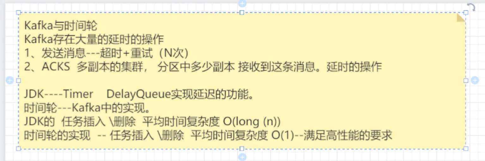

jdk 基于堆（优先级队列）

kafka 时间轮

## 面试题

1. Kafka如何保证消息的可靠性传输

   1）消费端弄丢了数据

   自动提交偏移量->消费者挂了（拿到消息，没有消费成功--宕机了）消息丢失

   解决：关闭自动提交

   2）Kafka自身弄丢了

   解决： 集群架构（多副本）

​	  3）重试（发成功了再提交事务）+多副本机制

2. 如何实现Kafka高性能

   1）分区：消费端，并发数越高

   2）生产角度：不同的partition 放在不同的机器、不同磁盘（I/O独立）

   3）减少网络的开销--批处理 linger适当增加

   4）压缩消息 broker直接直接化压缩后的 consumer解压

   5）高效序列化：avro 、protocal buffer
