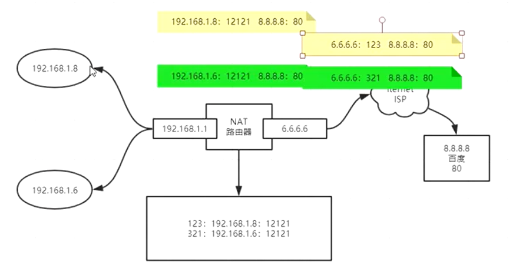
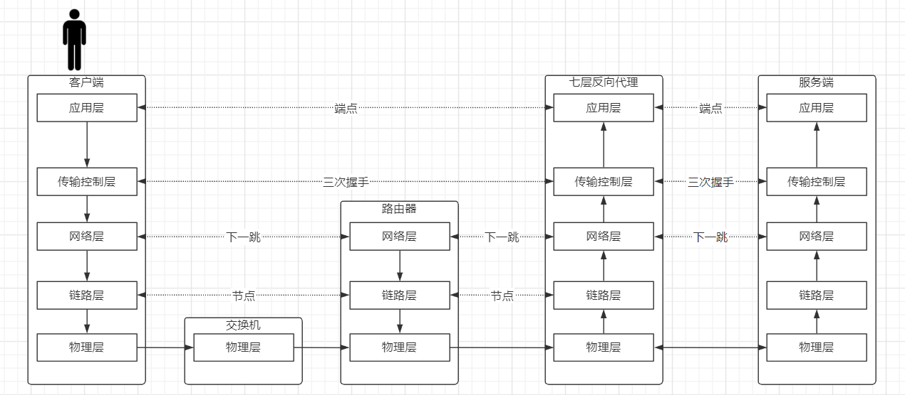

# LVS

## 5层网络模型

### 应用层

http协议、ssh协议（连接虚拟机）、smtp协议（发邮件）

1. 建立连接
2. 传输数据 http

用户态

``` sh
# 当前shell的进程ID的文件标识符
cd /proc/$$/fd
```


任何一个文件都有0、1、2

0：输入  1：输出  2：报错

```sh
# 创建文件标识符8 <>输入输出  目录
exec 8<> /dev/tcp/www.baidu.com/80
# 关掉
exec 8<& -
```


```sh
# echo打印的意思 -e 开启转义 
# GET请求 /表示请求的资源 协议 版本
# >输出重定向到某个文件 &代表后面的8不是文件是文件标识符
echo -e 'GET / HTTP/1.0\n' >& 8

# 读文件 0标准输入
cat  0<& 8

HTTP/1.0 200 OK
Accept-Ranges: bytes
Cache-Control: no-cache
Content-Length: 14615
Content-Type: text/html
Date: Sun, 28 Mar 2021 03:04:21 GMT
P3p: CP=" OTI DSP COR IVA OUR IND COM "
P3p: CP=" OTI DSP COR IVA OUR IND COM "
Pragma: no-cache
Server: BWS/1.1
Set-Cookie: BAIDUID=3BFB3D008B07A3C46A6DA89244CD8D3B:FG=1; expires=Thu, 31-Dec-37 23:55:55 GMT; max-age=2147483647; path=/; domain=.baidu.com
Set-Cookie: BIDUPSID=3BFB3D008B07A3C46A6DA89244CD8D3B; expires=Thu, 31-Dec-37 23:55:55 GMT; max-age=2147483647; path=/; domain=.baidu.com
Set-Cookie: PSTM=1616900661; expires=Thu, 31-Dec-37 23:55:55 GMT; max-age=2147483647; path=/; domain=.baidu.com
Set-Cookie: BAIDUID=3BFB3D008B07A3C455C17F5064AE9CA0:FG=1; max-age=31536000; expires=Mon, 28-Mar-22 03:04:21 GMT; domain=.baidu.com; path=/; version=1; comment=bd
Traceid: 161690066128378979947299148099439009917
Vary: Accept-Encoding
X-Ua-Compatible: IE=Edge,chrome=1

<!DOCTYPE html><!--STATUS OK-->
<html>
	...页面   百度一下，你就知道
</html>
```

### 传输层

由此进入内核态

**tcp三次握手**

三次握手的目的是确认双方的输入、输出正常

1. A->B  B收到后，知道自己的输入OK、对方输出OK
2. A-<B  A收到后，知道自己的输入输出OK，对方输入输出OK
3. A->B  B收到后，知道自己的输入输出OK，对方的输入输出OK

**数据传输**

至此双方都确认了自己和对方的I/O ok ，可以开始数据的传输

**四次挥手**

断开是双方协商的过程，不能单独一方直接断开

1. A->B A不再发数据，提出断开连接的请求
2. A-<B B知道A要分手的意愿
3. A->B B也不再发数据，提出断开连接的请求并关闭B的端口
4. A-<B A接收到后关闭A的端口

### 网络层

``` sh
#显示路由表
route -n
```


gateway是0.0.0.0的代表在同一局域网内（能够直接通信），172.24.226.253是默认网关，下一跳的的地址


当ping百度时，220.181.38.149会去路由表中，和子网掩码（Genmask）进行按位与运算，得到的结果去匹配Destination，当与0.0.0.0进行与运算时得到的还是0.0.0.0，匹配上了（找到下一跳172.24.223.253）

---

### 数据链路层

172.24.223.253怎么才能找到220.181.38.149呢？

arp协议：解释网卡硬件地址和IP地址映射的协议（同一局域网内的）

``` sh
arp -a
```


172.24.223.253的mac地址ee:ff:ff:ff:ff:ff

此时数据包中包含了 （下一个MAC地址、目标地址、目标端口号），去172.24.223.253的路由表中进行路由判定（下一跳是找IP地址），数据包每次只改MAC地址，数据包中只能存在一个IP地址（目标地址）

### 物理层

## 四层负载均衡器

速度特别快、数据包级别转发、不会进行握手，后端服务器镜像

### NAT（Network Address Translation）协议

路由器内的IP是私有IP，对外访问互联网是一个公有IP，这样做能够解决IP不够用的问题



对外访问都是6.6.6.6，会通过123或者321区分是哪台主机

### Nat模式


**CIP**：Client IP

**VIP**：Virtual IP

**DIP**：Distribute IP

**RIP**：Real IP

对于客户端来说 永远都是CIP想访问VIP，经过下一跳最终到达负载均衡器的网卡上

D-NAT 把VIP转换成RIP才能到server上

返回数据包时 RIP->CIP，还需要发送回负载均衡器，进行反地址转换，恢复成VIP->CIP

**瓶颈**

非对称：上传的带宽很少，下载的带宽很大

地址转换需要消耗算力

---

### DR（Direct Route）模式(重点)

如果能直接返回数据包给客户端，不经过负载均衡器

要想实现server就需要知道VIP->CIP的映射关系

红色的VIP是暴露给客户端进行访问的，绿色的VIP是server隐藏的，对外隐藏，对内可见

VIP配在虚拟网卡（lo）上，对内可见

CIP->VIP时负载均衡器又封装了RIP的MAC地址，所以CIP->VIP可以找到server，基于2层速度快

负载和server要在同一局域网


### TUN隧道技术

​	

DIP->RIP数据包中封装了CIP->VIP

## LVS(Linux Virtual Server)


三次握手在客户端和服务器之间，LVS只是偷窥了数据包

---

七层反向代理Nginx



---

负载均衡不是增加吞吐量，而是将并发分治

### 调度算法

#### 静态

rr（Round Robin）轮询、wrr、dh、sh

#### 动态

lc：最少连接数，哪个server的连接数最少

### 搭建LVS


虚拟机启动四个节点，1是lvs，2、3是服务

### 主备 主从 主主

主备：读写都在主上，备机是备用使用，主挂了取而代之。主机还活着情况下，**同步主机数据，不对外提供服务**

​	优点：主备之间只是单纯的同步数据比较简单

​	缺点：浪费了备机的资源，还有选主的问题

主从：在主备的基础上，从节点能够进行读操作，主节点可以选择读写都可以也可以选择只有读。一般主从中还会对主节点做高可用

​	优点：利用了备机的资源，主挂了备机还能读

​	缺点：客户端需要判断，不同操作发送给不同的服务器；读取从节点的数据会有主从同步的问题（延迟）；选主问题

主主：所有的都是主节点，都可以提供读写的操作，客户端可以访问任意一台

​	优点：分担了主节点的写操作

​	缺点：两个主同时写一个数据，会有数据不一致的问题（分布式锁）	

### 单点问题

LVS和server有可能会挂掉server下线只会让一部分业务出现问题

解决思路：一边多，主备模型或主主模型

#### 主备方式

从节点怎么知道主节点挂掉了？

1. 备用节点主动轮询，主动询问主是否挂掉了
2. 主节点主动广播，发送自己的状态
3. 中间件 Zookeeper、keepalived

server挂掉了怎么解决？

---

keepalived：代替人工运维，解决单点故障

1. 监控服务
2. Master通告自己还活着，Backup监听Master的状态，Master挂了一堆Backup推举出一个新的Master
3. 配置vip，添加ipvs，keepalived是配置文件
4. 对后端server做健康检查