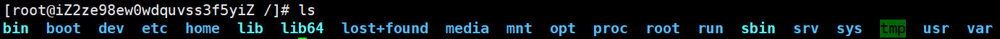

# Linux文件目录结构

/用来表示根目录

* /bin ：bin 是 Binaries (二进制文件) 的缩写, 这个目录存放着最经常使用的命令。
* /boot ：这里存放的是启动 Linux 时使用的一些核心文件，包括一些连接文件以及镜像文件
* /dev：dev 是 Device(设备) 的缩写, 该目录下存放的是 Linux 的外部设备，在 Linux 中访问设备的方式和访问文件的方式是相同的。
* /etc：etc 是 Etcetera(等等) 的缩写,这个目录用来存放所有的系统管理所需要的配置文件和子目录。
* /home：用户的主目录，在 Linux 中，每个用户都有一个自己的目录，一般该目录名是以用户的账号命名的。
* /lib：lib 是 Library(库) 的缩写这个目录里存放着系统最基本的动态连接共享库，其作用类似于 Windows 里的 DLL 文件。几乎所有的应用程序都需要用到这些共享库。
* /lost+found：这个目录一般情况下是空的，当系统非法关机后，这里就存放了一些文件。 
* /media：linux 系统会自动识别一些设备，例如U盘、光驱等等，当识别后，Linux 会把识别的设备挂载到这个目录下。
* /mnt：系统提供该目录是为了让用户临时挂载别的文件系统的，我们可以将光驱挂载在 /mnt/ 上，然后进入该目录就可以查看光驱里的内容了。
* /opt：opt 是 optional(可选) 的缩写，这是给主机额外安装软件所摆放的目录。比如你安装一个ORACLE数据库则就可以放到这个目录下。默认是空的。
* /proc：proc 是 Processes(进程) 的缩写，/proc 是一种伪文件系统（也即虚拟文件系统），存储的是当前内核运行状态的一系列特殊文件，这个目录是一个虚拟的目录，它是系统内存的映射，我们可以通过直接访问这个目录来获取系统信息。这个目录的内容不在硬盘上而是在内存里，我们也可以直接修改里面的某些文件。
* /root：该目录为系统管理员，也称作超级权限者的用户主目录。
* /run：是一个临时文件系统，存储系统启动以来的信息。当系统重启时，这个目录下的文件应该被删掉或清除。如果你的系统上有 /var/run 目录，应该让它指向 run。
* /sbin： s 就是 Super User 的意思，是 Superuser Binaries (超级用户的二进制文件) 的缩写，这里存放的是系统管理员使用的系统管理程序。
* /srv：该目录存放一些服务启动之后需要提取的数据。
* /sys：这是linux2.6内核的一个很大的变化。该目录下安装了2.6内核中新出现的一个文件系统 sysfs 。sysfs文件系统集成了下面3种文件系统的信息：针对进程信息的proc文件系统、针对设备的devfs文件系统以及针对伪终端的devpts文件系统。该文件系统是内核设备树的一个直观反映。当一个内核对象被创建的时候，对应的文件和目录也在内核对象子系统中
* /tmp： tmp 是 temporary(临时) 的缩写这个目录是用来存放一些临时文件的。
* /usr：用户的很多应用程序和文件都放在这个目录下，类似于windows下的program files目录。
* /usr/bin：系统用户使用的应用程序与指令。
* /usr/sbin：超级用户使用的比较高级的管理程序和系统守护程序。

- /usr/src：内核源代码默认的放置目录。
- /var：存放经常修改的数据，比如程序运行的日志文件（/var/log 目录下）。

# Linux命令

## 机器的命令

### 登录

[root@linux ~]#

​	**root:**表示登录的是root用户  

​	**@:**相当at

　 **Linux:**表示所登录的服务器,一般为服务器名称

　 **~:**表示目前位于/root目录下

　 **#:**表示root的提示符号

​	 **$:**普通用户为 	  

### 关机

   -h:hale关闭系统

   shutdown -h now 立刻关机

   shutdown -h 21:30 今天21：30关机

   shutdown -h +10 十分钟后关机 

   **init 0：**

​		一. init是Linux系统操作中不可缺少的程序之一。
　　所谓的init进程，它是一个由**内核启动**的**用户级进程**。
　　内核自行启动（已经被载入内存，开始运行，并已初始化所有的设备驱动程序和数据结构等）之后，就通过启动一个用户级程序init的方式，完成引导进程。所以,init始终是第一个进程（其进程编号始终为1）。
　　内核会在过去曾使用过init的几个地方查找它，它的正确位置（对Linux系统来说）是/sbin/init。如果内核找不到init，它就会试着运行/bin/sh，如果运行失败，系统的启动也会失败。

​		二. init一共分为7个级别，这7个级别的所代表的含义如下

​		0：停机或者关机（千万不能将initdefault设置为0）

​		1：单用户模式，只root用户进行维护

​		2：多用户模式，不能使用NFS(Net File System)

​		3：完全多用户模式（标准的运行级别）

​		4：安全模式

​		5：图形化（即图形界面）

​		6：重启（千万不要把initdefault设置为6）

   	**poweroff：**关闭系统

   	**halt ：**

### 	重启

​	   -r：restart

​	   shutdown -r now 立刻重启

   	shutdown -r +10 十分钟后重启

### 	注销

​		logout

## 帮助

内部命令：help 命令

外部命令：man 命令 q退出 空格翻页 

## 	当前路径

​		**pwd：**Print Working Directory (打印工作目录)

## 	切换目录

​	    cd 路径或标识符

​        ‘.’当前路径

​		‘..’上一级路径

​		‘~’当前用户home

​        绝对路径 /root/test 

​		相对路径  ../test1

   	 补全命令 TAB 键

## 	显示

  	 **ls** （windows系统的dir命令）

​	   **ls –l :**   显示详细信息（简写为ll）(long长列表)

 	  **ls –a :**   显示文件及隐藏文件（all）

 	  **ls / :**    显示路径/下的文件

 	  **ls –lt :**   将显示文件以时间排序	

## 	建立路径

​	   mkdir 文件夹名称（make directory）

## 	删除路径

​		rmdir 文件夹名（remove diretory）

## 	建立文件

​		touch 	文件名

## 	删除文件

​	   rm 文件名   

   	rm –f 文件名    直接删除文件

   	rm –rf 文件名（可以是文件夹）   直接删除文件或文件夹	 

## 	 移动文件

​	   mv 原路径/文件 新路径/新文件

   	mv 命令的活用-更改文件名称

## 	 复制文件

​	   cp 原路径/文件 新路径/新文件

## 	 搜索文件

​	   locate 文件名 查询出来绝对路径

   	find . –name “文件名” 查询出来相对路径

  	 注意区别

## 	 修改文件内容

​	   vi 文件名

   	vi 命令的活用-建立文件

## 	  显示文件内容

​		   cat 文件名    显示文件（从头到尾）后直接退出

   		head 文件名   显示文件开头10行后直接退出

   		tail 文件名    显示文件结尾10行后直接退出

   		more 文件名  显示文件，可向下翻页  space  q退出

   		less 文件名    显示文件，可随意翻页  f、b、g、G  q退出

## 	   搜索文件内容

​			   1、返回内容

   			less 文件名后：     

   			/string（在文件中搜索string字段，向后）

   			?string（在文件中搜索string字段，向前）

   			n搜索下一个

   			N搜索上一个

   			2、返回文件相对路径+名称

   			grep –lr 内容 *    

   			l：输出文件名，r：包含子目录，*：路径下所有文件

## 	用户的建立

 	  useradd 用户        新建用户

  	 useradd –d 路径 用户  新建用户并设定用户路径

   	passwd 用户         为用户设定/修改密码

  	 userdel –r 用户       删除用户，r：连同目录一起删除

   

## 	查询当前用户

   	whoami

## 	直接切换用户

   	su – root（用户名）   切换用户及环境变量（switch user）

  	 su root（用户名）     切换用户但保留之前的环境变量 

## 	组的建立

   	groupadd 组名称

## 	组的删除

   	groupdel 组名称

## 	关于权限

 	  linux将文件夹与文件分为三类角色：自己，同组用户，其他用户

  	 可以通过ll命令查看

​		d rwxrwxrwx. 3   esb  bea   4096 8月 29 14:49 1234

​		属性   权限   连结 用户  组    大小   修改时间   文件

##      改变所属组

​	   chgrp –R 组 文件    R：递归

## 	改变所属用户

   	chown –R 用户 文件  R：递归	

## 	改变文件属性  

   chmod –R 777 文件  R：递归

   777 = rwx rwx rwx （421 421 421）所属用户 所属组 其他用户

   例如：

   644 = 420 400 400 = rw- r-- r-- 

## 	查看性能

​	   top         多用于查看内存，CPU使用率

## 	查看空间

​	   df –h       

## 	关于LVM

   	PV：物理硬盘   

   	PE：空间单元

   	VG：整合盘

   	LV：逻辑盘

   	FS：文件系统

##      关于空间的分配	

   	查看硬盘：fdisk –l

   	查看pv情况：pvdisplay

   	查看vg情况：vgdisplay

​	   将新物理卷挂到vg下：vgextend vg名 pv名

​	   查看lv对应的fs：df -h

   	扩展lv：lvextend -L +10G lv名

  	 激活配置：resize2fs lv名

   	再次查看lv的大小：df -h 

## 	关于时钟

   	查看系统时间：date

   	查看硬件时间：hwclock

​	   改系统时间date –s 05/15/20

​	   硬件时间与系统时间

​	   hwclock –s 硬件写入系统

   	hwclock –w 系统写入硬件

​	