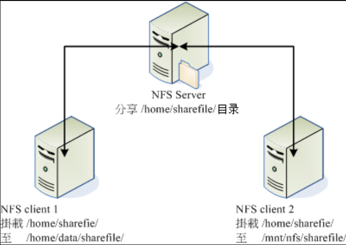
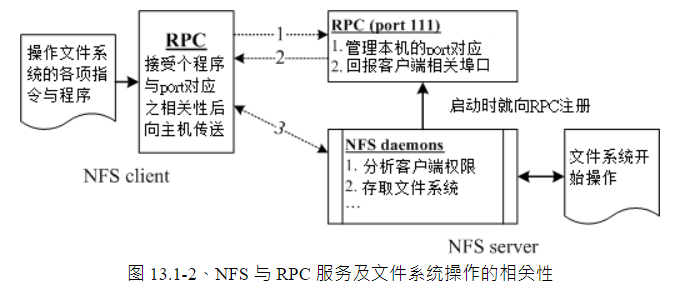
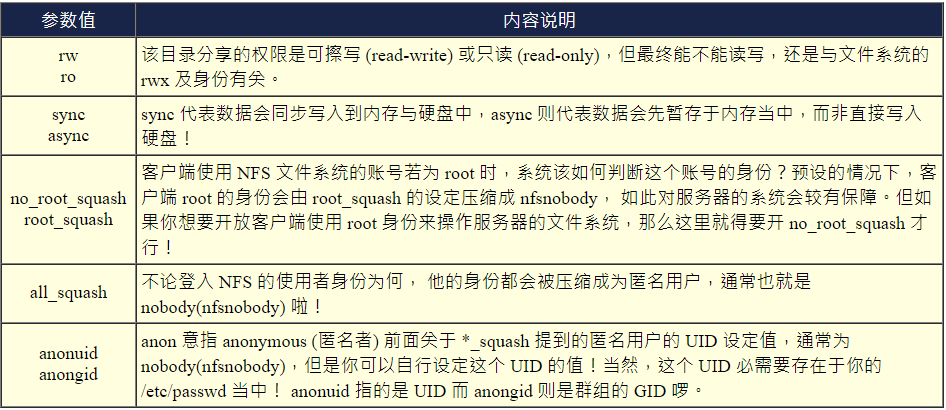

# NFS

http://cn.linux.vbird.org/linux_server/0330nfs.php#What_NFS_0

## 什么是NFS

NFS 就是 **N**etwork **F**ile**S**ystem 的缩写

最大的功能就是可以通过网络，让不同的机器、不同的操作系统、可以彼此分享文件。

可以简单的将他看做是一个文件服务器 (file server) 

这个 NFS 服务器可以让你的 PC 来将网络远程的 NFS 服务器分享的目录，挂载到本地端的机器当中， 在本地端的机器看起来，**那个远程主机的目录就好像是自己的一个磁盘分区槽一样 (partition)！**



就如同上面的图示一般，当我们的 NFS 服务器设定好了分享出来的 /home/sharefile 这个目录后，其他的 NFS 客户端就可以将这个目录挂载到自己系统上面的某个挂载点 (挂载点可以自定义)，例如前面图示中的 NFS client 1 与 NFS client 2 挂载的目录就不相同。我只要在 NFS client 1 系统中进入 /home/data/sharefile 内，就可以看到 NFS 服务器系统内的 /home/sharefile 目录下的所有数据了 (当然，权限要足够啊！^_^)！这个 /home/data/sharefile 就好像 NFS client 1 自己机器里面的一个 partition 喔！只要权限对了，那么你可以使用 cp, cd, mv, rm... 等等磁盘或档案相关的指令！

NFS的端口号大概位于2049，但是因为文件系统非常复杂，往往的情况是端口号不固定（2049+的形式），以及NFS需要启动额外的端口，这些端口是1024以下的随机端口。那么客户机如何知道服务器的端口号呢？答案是：通过rpcbind实现

---

## **什么是 RPC (Remote Procedure Call)**

 NFS 为 RPC server 的一种

RPC 最主要的功能就是在指定每个 NFS 功能所对应的端口号，并且回报给客户端，让客户端可以连结到正确的端口上去。 

当服务器在启动 NFS 时会随机取用数个端口，并主动的向 RPC 注册，因此 RPC 可以知道每个端口对应的 NFS 功能，然后 RPC 又是固定使用 port 111 来监听客户端的需求并回报客户端正确的端口。

要启动 NFS 之前，RPC 就要先启动了，否则 NFS 会无法向 RPC 注册。 另外，RPC 若重新启动时，原本注册的数据会不见，因此 RPC 重新启动后，它管理的所有服务都需要重新启动来重新向 RPC 注册。



1. 客户端会向服务器端的 RPC (port 111) 发出 NFS 档案存取功能的询问要求；
2. 服务器端找到对应的已注册的 NFS daemon 端口后，会回报给客户端；
3. 客户端了解正确的端口后，就可以直接与 NFS 守护进程来联机。

---

## NFS部署

**RPC 主程序：rpcbind**

启动任何一个 RPC 服务之前，我们都需要启动 rpcbind 

**NFS 主程序：nfs-utils**

NFS 服务所需要的主要软件

---

简单的使用『 rpm -qa | grep nfs 』与『 rpm -qa | grep rpcbind 』即可知道啦！如果没有安装的话， 在 CentOS 内可以使用『 [yum](http://linux.vbird.org/linux_server/0210network-secure.php#update) install nfs-utils 』来安装！

**安装：**
yum install nfs-utils -y
**配置共享文件**
vim /etc/exports
**共享格式**： 共享目录绝对路径 授权的ip或网段（权限1，权限2）


**启动**：
systemctl status rpcbind.server 确保rpc启动
systemctl start nfs 启动nfs
systemctl enable nfs 确保开机启动
**验证**：
systeam is-active nfs

在确认启动没有问题之后，接下来我们来瞧一瞧那么 NFS 到底开了哪些埠口？

```
netstat -tulnp| grep -E '(rpc|nfs)'
```

每个 RPC 服务的注册状况？

```
# 1. 显示出目前这部主机的 RPC 状态
[root@www ~]# rpcinfo -p localhost
```

在 server 端先自我测试一下是否可以联机

```
# 1. 请显示出刚刚我们所设定好的相关 exports 分享目录信息
[root@www ~]# showmount -e localhost
```

 **NFS 客户端的设定**

1. 确认本地端已经启动了 rpcbind 服务！

2. 扫瞄 NFS 服务器分享的目录有哪些，并了解我们是否可以使用 ([showmount](http://cn.linux.vbird.org/linux_server/0330nfs.php#showmount))；

3. 在本地端建立预计要挂载的挂载点目录 (mkdir)；

4. 利用 mount 将远程主机直接挂载到相关目录。

   ```sh
   # 2. 查询服务器提供哪些资源给我们使用呢？
   [root@clientlinux ~]# showmount -e 192.168.100.254
   
   # 3. 建立挂载点，并且实际挂载看看啰！
   [root@clientlinux ~]# mkdir -p /home/nfs/public
   [root@clientlinux ~]# mount -t nfs 192.168.100.254:/home/public \
   > /home/nfs/public
   # 注意一下挂载的语法！『 -t nfs 』指定文件系统类型，
   # IP:/dir 则是指定某一部主机的某个提供的目录！另外，如果出现如下错误：
   mount: 192.168.100.254:/home/public failed, reason given by server: No such file 
   or directory
   # 这代表你在 Server 上面并没有建立 /home/public 啦！自己在服务器端建立他吧！
   
   # 4. 总是得要看看挂载之后的情况如何，可以使用 df 或 mount 啦！
   [root@clientlinux ~]# df
   文件系统               1K-区段      已用     可用 已用% 挂载点
   ```

挂载的 NFS 目录卸除

```
[root@clientlinux ~]# umount /home/nfs/public 
```

**客户端可处理的挂载参数与开机挂载**

