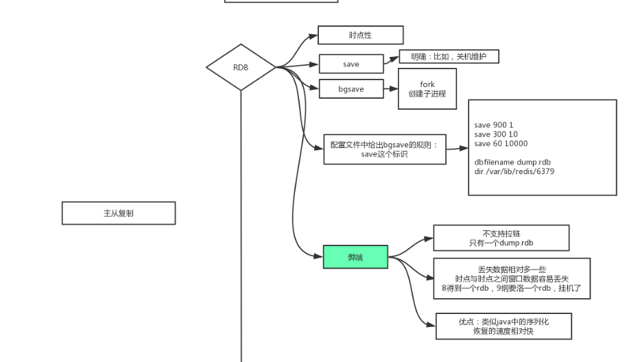

# Redis

## 常识：

数据在内存和磁盘体积不一样，内存中索引可以指向不同表的相同字段，磁盘中只能重复建索引

硬盘带宽指的是硬盘或设备(路由器/交换机)在传输数据的时候数据流的速度

（Input/Output Operations Per Second）磁盘的 IOPS、也就是每秒能进行多少次IO

**硬盘：**

​				1. 寻址： ms

​				2. 带宽：G / M

**内存：**

​				1. 寻址：ms 

​				2. 带宽：很大 硬盘比内存在寻址上慢了10W倍

**I/O Buffer**：成本问题

​				磁盘有磁道和扇区，一扇区512Byte，如果容器太小，索引成本会变大

**4K对齐**

​				操作系统，从磁盘最小读取4k

**面试题**

​				表越大，数据库性能下降？

​						1. 有索引 增删改变慢，维护索引，一个或少量查询依然很快，并发大时受硬盘带宽影响会变慢

## 简介

 				

## IO发展过程


一个连接对应一个文件标识符fd，read命令可以读取fd

BIO时期，线程通过内核读取client发送的数据，读取不到就阻塞着，没办法执行后续代码，某一时间片上有可能fd 8 的线程抢到了cpu，但是fd8的数据包还没到，此时fd9的数据包已经到了，cpu没有时时刻刻处理真正到达的数据

jvm一个线程的成本是1MB，线程多了有维护成本（cpu忙着调度、内存成本）

NIO时期，socket变成了非阻塞，此时可以用一个线程，死循环读fd8 fd9 ，有数据的返回有，没数据返回没有，不阻塞

线程在**用户态轮询**读取数据，同步非阻塞，如果轮询次数太多成本很高（轮训在用户态但是read命令频繁用户态与内核态的切换）


多路复用，还是同步非阻塞，减少了内核和用户的切换次数

内核变了，增加了系统调用select，传1000个fd，内核去进行监听这1000个

为了解决问题，内核要变， 进程只需调用内核中的select（轮询在内核，之前调用1000次，现在只需要一次），哪个fd有返回结果了再拿着fd（有数据的）去调用read，也就是说不会调用没有数据fd 的read

每次传，传完回复谁能用，再拿能用的去read 

这些都是jvm帮咱们进行调用

---

问题：还是传1000个文件标识符来回传？？？怎么解决

内核和用户维护共享空间都可以访问，通过mmap进行调用

线程1000fd放到红黑树里，内核就可以看到都有哪些fd

epoll有三个系统调用 create 、 ctl（增加或删除fd） 、 wait

1.create 产生epoll的文件标识符，用来操作mmap的，作为参数传入到ctl系统条臃肿

2.1000个连接注册到红黑树（ctl add然后调用wait等待）

3.数据到了从红黑树->链表（有顺序）

4.用户从链表取，然后调用read

epoll准备文件共享空间mmap，kernel调用后返回数据到链表中（用户态与内核态有共享的空间，没有了1000文件标识符的拷贝过程）

，此时也是NIO

## Redis模型


redis是单进程、单线程处理用户请求

通过epoll遍历链表，哪个有数据（有顺序，网络到达的顺序）哪个返回

redis默认16个库 -n选择连接哪个库

### 数据类型

二进制安全：只取字节流

**string**

> type  key  查看value的类型
>
> obj  encoding key  查看编码类型  有可能 type是string   ，这个命令是int
>
> 


字符串

> set key value   // 如果value值存在，无视旧值、类型直接覆盖
>
> get key // 获取key
>
> exists key // 判断某个key是否存在
>
> strlen key // 返回key所存储的字符串的长度 'value' 长度是5
>
> del key // 删除某个key
>
> mset k3 a k4 b //  批量设置多个k、v  	
>
> mget  k3 k4 //  同时取出多个k 
>
> expire key  60  // 数据在 60s 后过期
>
> setex key 60 value // 数据在 60s 后过期 (setex:[set] + [ex]pire)
>
> ttl key // 查看数据还有多久过期
>
> Setnx  k1 ooxx    nx表示ooxx不存在时才进行设置(不能覆盖)，应用场景分布式锁，一堆人想删除一个文件，谁成功了拿到锁
>
> append   k1   value  // 字符串追加 
>
> getRange  k1 0  6 	// 截取Key中value的某一部分  -1表示最后一个字符，如图正反向索引
>
> getset k1 value   //  取出后更新
>
> setrange  key  偏移量  value   // 设置到偏移量的某个位置
>
> 

数值

>set key 1      //  value 是数值类型
>
>Incrby key  22  // 加22   不写默认加一
>
>decrby  key 22  // 减22  不写默认减一
>
>incrbyfloat  k1  0.5  //  加浮点数

bitmap

>setbit   key  1  1  // 将第一位bit设置位1，1字节=8bit
>
>bitpos  key   bit  start end  // start和end是字节的索引，找到bit在索引的哪个位置（bit的索引）
>
>bitcount  key   bit  start end  // 统计出现次数
>
>bitop   operation（与或非） destkey  key..  // 操作目标key..进行操作，可以有多个

应用场景：

只需要保存状态信息的场景（0、1就能表示），登录信息、是否签到、是否点赞

用户在线状态

对于获取或者统计用户在线状态，使用 bitmap 是一个节约空间且效率又高的一种方法。

只需要一个 key，然后用户 ID 为 offset，如果在线就设置为 1，不在线就设置为 0。

统计活跃用户

使用时间作为 key，然后用户 ID 为 offset，如果当日活跃过就设置为 1

使用位运算，统计连续在线的用户有多少


**list**

Redis 的 list 的实现为一个 **双向链表**


> 栈 同向命令  
>
> 队列  反向命令
>
> lpush key value  ,value1...  // 从左边插入
>
> rpush key value  ,value1...  // 从右边插入
>
> l/rpop key	// 弹出左/右边第一个元素
>
> lrange key  start  stop   // 范围查询，可以使用正负索引，l是list的意思  所有0，-1
>
> lindex key index  // 获取索引元素，-1取出最后一个
>
> lset key  index value  // 将索引位置设为value
>
> lrem key count value  // 移除几个值为value的元素  count大于0时从左往右数
>
> linsert before/after pivot value  // 在某个位置插入一个元素 ，pivot是元素的值，如果有两个pivot在第一个位置加
>
> blpop key timeout  // 阻塞获取元素，后面是超时时间，push后，第一个阻塞的获得到元素  阻塞的，单播队列FIFO
>
> ltrim key start end // 删除两端的元素start左边，end右边
>
> Llen key // 查看链表长度 

 **hash**


key value本身就是哈希，value是hash相当于又套了一层

> hset key field value  // field是子key
>
> hmset key  field value，field1 value，field2 value // 对已存在的key批量进行设置
>
> hget key field  
>
> hmget key field field1 field2..
>
> hkeys key // 取出所有的field
>
> hvalues key // 取出所有的value
>
> hegetall key   // 取出所有的field value
>
> hincrbyfloat key field 0.5/-1 // 增加0.5 ，减1

  **set**

Redis 中的 set 类型是一种无序集合，集合中的元素没有先后顺序。当你需要存储一个列表数据，又不希望出现重复数据时，set 是一个很好的选择，并且 set 提供了判断某个成员是否在一个 set 集合内的重要接口，这个也是 list 所不能提供的。可以基于 set 轻易实现交集、并集、差集的操作。比如：你可以将一个用户所有的关注人存在一个集合中，将其所有粉丝存在一个集合。Redis 可以非常方便的实现如共同关注、共同粉丝、共同喜好等功能。这个过程也就是求交集的过程。 

集合


> sadd key member member1 member2
>
> smembers key // 给出key中所有member
>
> scard key // 给出集合中元素的个数（set长度）
>
> srem key member member1 member2 // 删除
>
> sinter key1 key2 // 取key1 key2交集 
>
> sinterstore  key3 key1 key2 //  取key1 key2交集放入key3
>
> sunion // 并集 
>
> sdiff  key1 key2  // 差集带方向，调整顺序得到不同的结果
>
> sranmember key count  // count为正数时随机取count个，如果count大于元素个数则全部返回，如果为负数时可以重复，一定满足所需要的数量，0不返回

### sorted_set

去重排序

和 set 相比，sorted set 增加了一个权重参数 score，使得集合中的元素能够按 score 进行有序排列，还可以通过 score 的范围来获取元素的列表。

应用场景：排行榜


> zadd k1 8 apple 2 banana 3 orange  物理内存左小右大，不随命令发生变化
>
> zrange k1                                           banana orange  apple 
>
> zrange k1 0 - 1 withscores						banana 2 orange 3  apple 8
>
> zrangebyscore k1  3 8                       orange apple 
>
> zrevrange k1 0 1 							  apple orange 
>
> zscore k1  apple								8
>
> zrank   k1  	apple									 2    排名从 0开始
>
> zincrby k1 2.5  banana					   4.5	 顺序会变化，实时维护
>
> zunionstore  目标key   2  k1 k2      1 0.5       并集排序，1、0.5是权重，k2的值要全部除2
>
> zunionstore  目标key   2  k1 k2   aggregte max 相同元素取最大值排序

**底层结构跳跃表**

双向链表

查询从上向下找

插入从下向上调整

如图，查找很容易，如何插入?

插入时，随机造层，需要修改指针，从最下层向插入位置左边找，向上找

修改，先删除再走一遍插入逻辑

## Redis使用

### 安装

```sh
wget https://download.redis.io/releases/redis-5.0.5.tar.gz
# 解压 -x：解开一个压缩文件的参数指令！extract提取 
#-f: 使用档案（压缩文件）名字(这是最后一个参数，后面只能接档案名，而且必须接在最后)
tar xf redis-5.0.5.tar.gz
```


```sh
# 进行编译
make 
```


```sh
# 开启Redis
./redis-server 
```


```sh
# 将启动命令迁出，不和源码放在一起
make install PREFIX=/opt/nyq/redis5
```


```sh
cd /root/soft/redis-5.0.5/utils
vi /etc/profile
# 最后一行定义REDIS_HOME，添加环境变量保证任何路径都能执行脚本
export REDIS_HOME=/opt/nyq/redis5
export PATH=$PATH:$REDIS_HOME/bin
./install_server.sh
```


启动脚本redis_6379


任意目录都可以启动

```sh
service redis_6379 start/stop/status
```


### 消息发布订阅

> publish ooxx hello   向ooxx通道推送hello
>
> subscribe ooxx  	接收消息，未收到  ，先订阅后发送才能收到


### 事务


线是时间轴从右往左，mutli开启事务，exec执行，exec谁先到达谁先执行（队列右边是先到达的）

watch监控k1，cas操作，如果被更改，撤销操作，不会回滚交给客户端处理

### 布隆过滤器


元素3是真正用户想请求的，有可能发现bitmap是1代表有数据，但实际上是被别的元素标记的（哈希碰撞）

有概率放行，可能会被误标记，概率解决问题


如果穿透了不存在，进行标记，下次就直接返回不走布隆

### Redis作为缓存和数据库的区别


时间有效期不会延长，发生写剔出过期时间，需要重新设置过期时间


### redis数据持久化



RDB全称redis database，在指定的时间间隔内将内存中的数据集快照写入磁盘，也就是行话讲的Snapshot快照，它恢复时 直接将快照文件直接读到内存里；

bgsave： background save


阻塞实现快照，8点redis不对外提供服务了，将内存数据一个个写入磁盘，文件的状态属于8点


非阻塞实现，不能正确写入文件，可能8.10分b的值被改了


export可以让子进程看到父进程的数据，并且子进程的修改不会破坏父进程

8点的时候fork一个子进程进行写入磁盘，父进程修改不影响子进程的写磁盘的操作

写时复制，速度快，占用特别小的空间，第一行是子进程

父子进程隔离，fork命令创建子进程，父子进程指向同一物理地址（指针复制），很小的空间，速度很快

copy on write 修改数据时会复制数据，修改指针不是覆盖，不用修改所有数据，改的地方复制

**redis实现**


父进程修改只会改变父进程的指针，子进程的指针不变，所以能读取到8点的数据


AOF（append only file）日志


记录文件的写操作

有可能来回写（写成a，写成b来回反复），然而aof的日志会很多，4.0之前会合并重复命令，删除抵消命令

弊端：体量大、恢复慢

优点：丢失数据少

混合开启时只会用AOF来进行恢复（aof恢复数据完整性好一些），4.0后aof中包含rdb全量，增量追加写操作


no是缓存区满了才写入磁盘，always是每次都写入，每秒在他俩之间

> bjrewriteaof 合并数据，覆盖重复数据
>
> auto-aof-rewrite-min-size 64mb  数据文件达到64m自动触发rewrite

## Redis集群

redis是单节点、单实例、单机的会遇到的问题

1.单点故障，数据可以持久化，但是如果物理机器也坏了

2.容量有限

3.访问压力

## AKF

AKF 扩展立方体（AKF Scale Cube）

x轴：全量镜像，数据库副本，读写分离，单点故障解决，压力能解决一部分，容量没解决

y轴：功能业务、功能分不同redis存储，客户端根据业务实现访问不同redis

z轴：在xy拆分的基础上，按照优先级、逻辑再拆分，比如说相同业务不同用户


最终一致性，还是又可能取到不一致的数据


监控就是sentinel

自动故障转移，主挂了，找一个从节点做主节点


1个说话算数（提出Redis挂了），统计不准确有可能自己网络不好。

网络分区：访问不同服务，不同服务能拿到不同的结果。（分区容忍性，是否可以出现数据不一致，客户端自己处理，拿到正确的数据）

2个说话算数 大于N/2（使用奇数台，因为奇数偶数承担的风险一致，而奇数会少用一台节省资源，降低风险），少数服从多数

### cap原则

CAP原则又称CAP定理，指的是在一个分布式系统中，[一致性](https://baike.baidu.com/item/一致性/9840083)（Consistency）、[可用性](https://baike.baidu.com/item/可用性/109628)（Availability）、[分区容错性](https://baike.baidu.com/item/分区容错性/23734073)（Partition tolerance）。CAP 原则指的是，这三个[要素](https://baike.baidu.com/item/要素/5261200)最多只能同时实现两点，不可能三者兼顾。

设置主从

client中  replicaofhost port 追随哪个主，5.0以前是 slaveof

replicaofno one 不追随其他

从节点更新数据之前，需要将old data flush 掉（清空），然后再同步 

如果某个从节点突然挂掉了，在这期间主节点数据有更新，当从节点恢复时会增量同步(队列中记录偏移量)

如果开启aof appendonlyof会全量同步（aof模式没有记录 master id，RDB模式记录了）

总结：

​		不开启aof时同步rdb，如果从挂掉了且期间有数据更新，主中会有队列记录偏移量，可以进行增量更新；

​		开启aof时每次都全量同步（不碰rdb），因为aof中没有记录masterID


```sh
# 当一个slave失去和master的连接，或者同步正在进行中，slave的行为有两种可能：
# 1) 如果 slave-serve-stale-data 设置为 "yes" (默认值)，slave会继续响应客户端请求，可能是正常数据，也可能是还没获得值的空数据。
# 2) 如果 slave-serve-stale-data 设置为 "no"，slave会回复"正在从master同步（SYNC with master in progress）"来处理各种请求，除了 INFO 和 SLAVEOF 命令。
slave-serve-stale-data yes

# 你可以配置salve实例是否接受写操作。可写的slave实例可能对存储临时数据比较有用(因为写入salve# 的数据在同master同步之后将很容被删除)，但是如果客户端由于配置错误在写入时也可能产生一些问题。
# 从Redis2.6默认所有的slave为只读
# 注意:只读的slave不是为了暴露给互联网上不可信的客户端而设计的。它只是一个防止实例误用的保护层。
# 一个只读的slave支持所有的管理命令比如config,debug等。为了限制你可以用'rename-command'来隐藏所有的管理和危险命令来增强只读slave的安全性。
slave-read-only yes
 
# 同步策略: 磁盘或socket，默认磁盘方式
repl-diskless-sync no
 
# 如果非磁盘同步方式开启，可以配置同步延迟时间，以等待master产生子进程通过socket传输RDB数据给slave。
# 默认值为5秒，设置为0秒则每次传输无延迟。
repl-diskless-sync-delay 5
 
# slave根据指定的时间间隔向master发送ping请求。默认10秒。
# repl-ping-slave-period 10
 
# 同步的超时时间
# 1）slave在与master SYNC期间有大量数据传输，造成超时
# 2）在slave角度，master超时，包括数据、ping等
# 3）在master角度，slave超时，当master发送REPLCONF ACK pings# 确保这个值大于指定的repl-ping-slave-period，否则在主从间流量不高时每次都会检测到超时
# repl-timeout 60
 
# 是否在slave套接字发送SYNC之后禁用 TCP_NODELAY
# 如果选择yes，Redis将使用更少的TCP包和带宽来向slaves发送数据。但是这将使数据传输到slave上有延迟，Linux内核的默认配置会达到40毫秒。
# 如果选择no，数据传输到salve的延迟将会减少但要使用更多的带宽。
# 默认我们会为低延迟做优化，但高流量情况或主从之间的跳数过多时，可以设置为“yes”。
repl-disable-tcp-nodelay no
#增量同步的队列大小，如果增量大于队列大小就会全量同步
repl-blocking-size 1mb


```

### Sentinell哨兵

通过发送命令，让Redis服务器返回监控其运行状态，包括主服务器和从服务器。

当哨兵监测到master宕机，会自动将slave切换成master，然后通过**发布订阅模式**通知其他的从服务器，修改配置文件，让它们切换主机。

哨兵和redis部署在同一台机器上，只是端口号不一样


### 数据拆分（客户端）


1. 根据业务拆分redis，不同业务访问不同redis
2. 通过算法，hash+取模（数据分片）
3. random，随机放入redis，另一个客户端取数据，一般用作消息队列
4. 一致性哈希算法

取模方法会有弊端，没法进行redis的扩展，客户端代码也得变。

#### **一致性哈希**


data和redis node一起参与哈希算法，node通过hash算法映射到hash环上

数据来了，也进行hash运算

node节点在哈希环上是物理的，data找到虚拟的点，通过一些算法，比如说找最近的，写入最近的节点

新增node3节点物理的，一小部分不能命中（顺时针到新增节点的部分，新机器没有存储过），击穿到mysql，对比哈希取模不会进行所有数据重新hash计算

解决方案：如果不能一命中，再向前找一个；或者redis进行淘汰方案，LRU、LFU、FIFO

> - LRU (Least recently used) 最近最少使用，如果数据最近被访问过，那么将来被访问的几率也更高。
> - LFU (Least frequently used) 最不经常使用，如果一个数据在最近一段时间内使用次数很少，那么在将来一段时间内被使用的可能性也很小。
> - FIFO (Fist in first out) 先进先出， 如果一个数据最先进入缓存中，则应该最早淘汰掉。


假如只有两个物理点，有可能会出现数据偏移，都到一个节点上，可以让node后接9个数，一共算出20个节点，其中2个是物理节点，18个是虚拟的，数据来了找最近的虚拟节点，再跳转到物理节点


对server造成连接成本很高


透明的，看不见后面，只关注接口

无状态的代理


当有新的redis3加入时，将redis1、2槽位中的数据取一部分放到redis3中，这样比重新遍历一遍哈希要快

redis实现，redis服务器中有算法+其他节点的mapping，找到后给客户端返回，重定向。（**Redis无主模型**）

数据一但被分开就很难整合使用，不分开就能使用事务

{oo}k1  {oo}k2 此写法保证k1、k2哈希到同一个节点

## 面试常问

### 简述

Redis是C语言开发的数据库，与传统的数据库的区别是他的数据存储在内存中，因此它的读写速度非常的快，广泛应用在缓存中。另外除了做缓存外，还可以做分布式锁、消息队列。Redis提供了多种数据类型来满足不同的业务场景。Redis还支持事务、持久化、Lua脚本、多种集群方案

### 分布式缓存常见的技术选型方案有哪些？

用的比较多的是Memcached和Redis，分布式缓存是解决本地缓存在两个服务之间无法共用的问题

### Redis 和 Memcached 的区别和共同点

**共同点**

1. 都是内存数据库，一般都当作缓存来用
2. 都有过期策略（内存的特性断电消失、容量小不够了会进行置换算法）
3. 两者的性能都很高（内存的特性快）

**区别**

1. Redis支持丰富的的数据类型（支持更加复杂的应用场景）。Memcached只支持k/v数据类型，Redis支持string、list、hash、set、zset
2. Redis支持数据持久化，可以将数据持久化到磁盘之中，挂了可以恢复。Memcached数据都在内存之中
3. 服务器内存使用完了之后，可以将不用的数据放到磁盘上，Memcached就会报异常
4. Redis原声支持集群模式，Memcached没有原生集群模式
5. Redis是单线程使用多路IO复用模型，Memcached是多线程，非阻塞IO复用的网络模型
6. Redis支持更多语言客户端，支持订阅发布模型、Lua事务、事务等功能，Memcached不支持
7. Memcached 过期数据的删除策略只用了惰性删除，而 Redis 同时使用了惰性删除与定期删除。

**定时删除**

创建一个定时器，当key设置有过期时间，且过期时间到达时，由定时器任务立即执行对键的删除操作 
优点：节约内存，到时就删除，快速释放掉不必要的内存占用 
缺点：CPU压力很大，无论CPU此时负载量多高，均占用CPU，会影响redis服务器响应时间和指令吞吐量 
总结：用处理器性能换取存储空间 （拿时间换空间） 

**惰性删除**

数据到达过期时间，不做处理。等下次访问该数据时，如果未过期，返回数据 ；发现已过期，删除，返回不存在。 

优点：节约CPU性能，发现必须删除的时候才删除 

缺点：内存压力很大，出现长期占用内存的数据 

总结：用存储空间换取处理器性能（拿空间换时间）

**定期删除**

周期性轮询redis库中的时效性数据，采用随机抽取的策略，利用过期数据占比的方式控制删除频度 

特点1：CPU性能占用设置有峰值，检测频度可自定义设置 

特点2：内存压力不是很大，长期占用内存的冷数据会被持续清理 

总结：周期性抽查存储空间 （随机抽查，重点抽查）

### Redis6.0之前为什么不使用多线程

1. 单线程编程容易并且更容易维护；
2. Redis 的性能瓶颈不在 CPU ，主要在内存和网络；
3. 多线程就会存在死锁、线程上下文切换等问题，甚至会影响性能。

### Redis6.0之后为何引入多线程

**Redis6.0 引入多线程主要是为了提高网络 IO 读写性能**，因为这个算是 Redis 中的一个性能瓶颈（Redis 的瓶颈主要受限于内存和网络）。

虽然，Redis6.0 引入了多线程，但是 Redis 的多线程只是在网络数据的读写这类耗时操作上使用了，执行命令仍然是单线程顺序执行。

默认禁用

### Redis 数据淘汰策略

**volatile-lru（least recently used）**：从**已设置过期时间**的数据集（server.db[i].expires）中挑选最近最少使用的数据淘汰

**volatile-ttl**：从已设置过期时间的数据集（server.db[i].expires）中挑选将要过期的数据淘汰

**volatile-random**：从已设置过期时间的数据集（server.db[i].expires）中任意选择数据淘汰

**allkeys-lru（least recently used）**：当内存不足以容纳新写入数据时，在键空间中，移除最近最少使用的 key（**这个是最常用的**）

**allkeys-random**：从数据集（server.db[i].dict）中任意选择数据淘汰

**no-eviction**：禁止驱逐数据，也就是说当内存不足以容纳新写入数据时，新写入操作会报错。

4.0 版本后增加以下两种：

1. **volatile-lfu（least frequently used）**：从已设置过期时间的数据集（server.db[i].expires）中挑选最不经常使用的数据淘汰
2. **allkeys-lfu（least frequently used）**：当内存不足以容纳新写入数据时，在键空间中，移除最不经常使用的 key


### 击穿


redis做缓存用！！，高并发下，key过期或者key被算法淘汰掉 ，穿过redis到数据库。

**解决办法**

redis单进程单实例，第一个发现key不存在时，setnx()约等于创建一把锁，获得锁的人才能访问DB

获得锁没挂，超时了，再起一个线程去检查锁是否超时，更新超时时间。

### 穿透


在缓存的情况下，搜索不存在的数据，缓存没有，数据库也没有的数据。

**解决方案**

布隆过滤器

1.在客户端

2.客户端有算法，bitmap在redis

3.redis集成

弊端：不支持删除数据库的数据

### 雪崩


做缓存用，大量key同时失效，不是一个key有大量请求，是大量的key有请求

### **解决方案**

与时间无关的雪崩，可以将过期时间打散。

如果和过期时间有关，强依赖击穿方案，锁、排队，业务层延时

### 分布式锁

redis做分布式锁

setnx 过期时间 多线程延长过期时间  redisson  zookeeper

