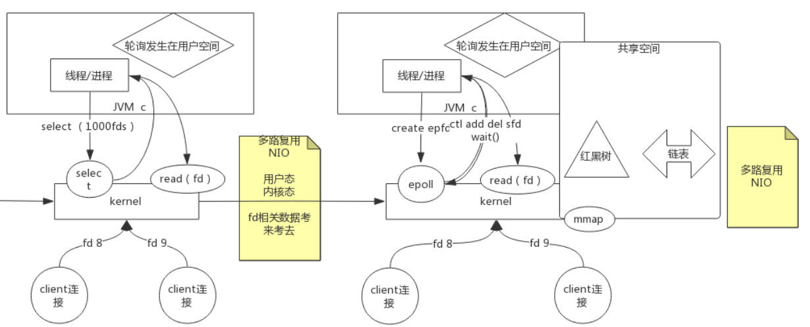

# Redis

## 常识：

数据在内存和磁盘体积不一样，内存中索引可以指向不同表的相同字段，磁盘中只能重复建索引

硬盘带宽指的是硬盘或设备(路由器/交换机)在传输数据的时候数据流的速度

（Input/Output Operations Per Second）磁盘的 IOPS、也就是每秒能进行多少次IO

### 		硬盘：

​				1. 寻址： ms

​				2. 带宽：G / M

### 		内存：

​				1. 寻址：ms 

​				2. 带宽：很大 硬盘比内存在寻址上慢了10W倍

### 		I/O Buffer：成本问题

​				磁盘有磁道和扇区，一扇区512Byte，如果容器太小，索引成本会变大

### 		4K对齐

​				操作系统，从磁盘最小读取4k

### 		面试题

​				表越大，数据库性能下降？

​						1. 有索引 增删改变慢，维护索引，一个或少量查询依然很快，并发大时受硬盘带宽影响会变慢

## 简介

## 				

## IO发展过程




epoll准备文件共享空间mmap，用户写入共享空间红黑树，kernel调用后返回到链表中

，此时也是NIO

## Redis模型


redis是单进程、单线程处理用户请求

redis默认16个库 -n选择连接哪个库

### 数据类型

二进制安全：只取字节流

**string**

> type  key  查看value的类型
>
> obj  encoding key  查看编码类型  有可能 type是string   ，这个命令是int
>
> 


字符串

> set k1 ooxx nx   nx表示ooxx不存在时才进行设置，应用场景分布式锁，一堆人想删除一个文件，谁成功了拿到锁
>
> set k2 ooxx xx   xx只有存在的时候才能更新
>
> mset k3 a k4 b  同时设置多个  	mget  k3 k4 同时取出
>
> append   k1   value 追加 
>
> getRange  k1 0  6 	截取Key中value的某一部分  -1表示最后一个字符，如图正反向索引
>
> getset k1 value    取出后更新
>
> setrange  key  偏移量  value  设置到偏移量的某个位置
>
> strlen key 	返回字符串长度
>
> 

数值

>Incrby key  22 加22   不写默认加一
>
>decrby  key 22  减22  不写默认减一
>
>incrbyfloat  k1  0.5   加浮点数

bitmap

>setbit   key  1  1  将第一位bit设置位1，1字节=8bit
>
>bitpos  key   bit  start end  start和end是字节的索引，找到bit在索引的哪个位置（bit的索引）
>
>bitcount  key   bit  start end  start统计出现次数
>
>bitop   operation（与或非） destkey  key..  操作目标key..进行操作，可以有多个

**list**


> 栈 同向命令   队列  反向命令
>
> lpush key value  ,value1...  从左边插入
>
> rpush key value  ,value1...  从右边插入
>
> l/rpop key	弹出左/右边第一个元素
>
> lrange key  start  stop  范围查询，可以使用正负索引，l是list的意思  所有0，-1
>
> lindex key index  去除索引元素，-1取出最后一个
>
> lset key  index value  将索引位置设为value
>
> lrem key count value  移除几个值为value的元素  count大于0时从左往右数
>
> linsert before/after pivot value  在某个位置插入一个元素 ，pivot是元素的值，如果有两个pivot在第一个位置加
>
> blpop key timeout  阻塞获取元素，后面是超时时间，push后，第一个阻塞的获得到元素  阻塞的，单播队列FIFO
>
> ltrim key start end 删除两端的元素start左边，end右边

 **hash**


key value本身就是哈希，value是hash相当于又套了一层

> hset key field value  field是子key
>
> hmset key  field value，field1 value，field2 value 对已存在的key进行设置
>
> hget key field  
>
> hmget key field field1 field2..
>
> hkeys key 取出所有的field
>
> hvalues key 取出所有的value
>
> hegetall key   取出所有的field value
>
> hincrbyfloat key field 0.5/-1 增加0.5 ，减1

  **set**

集合


> sadd key member member1 member2
>
> smembers key 给出key中所有member
>
> scard key 给出集合的个数
>
> srem key member member1 member2
>
> sinter key1 key2 取key1 key2交集
>
> sinterstore  key3 key1 key2 取key1 key2交集放入key3
>
> sunion 并集 sdiff  key1 key2  差集带方向，调整顺序得到不同的结果
>
> sranmember key count  count为正数时随机取count个，如果count大于元素个数则全部返回，如果为负数时可以重复，一定满足所需要的数量，0不返回

### sorted_set

去重排序


> zadd k1 8 apple 2 banana 3 orange  物理内存左小右大，不随命令发生变化
>
> zrange k1                                           banana orange  apple 
>
> zrange k1  withscores						banana 2 orange 3  apple 8
>
> zrangebyscore k1  3 8                       orange apple 
>
> zdevrange k1 0 1 							  apple orange 
>
> zscore k1  apple								8
>
> zrank   k1  										 2 排名
>
> zincrby k1 2.5  banana					   4.5	 顺序会变化，实时维护
>
> zunionstore  目标key   2  k1 k2      1 0.5       并集排序，1、0.5是权重，k2的值要全部除2
>
> zunionstore  目标key   2  k1 k2   aggregte max 相同元素取最大值排序

**底层结构跳跃表**

双向链表

如图，查找很容易，如何插入?

插入时，随机造层，需要修改指针，从最下层向插入位置左边找，向上找

修改，先删除再走一遍插入逻辑

## Redis使用

### 消息发布订阅

> publish ooxx hello   向ooxx通道推送hello
>
> subscribe ooxx  	接收消息，未收到  ，先订阅后发送才能收到


### 事务


线是时间轴，mutli开启事务，exec执行，exec谁先到达谁先执行

watch监控k1，cas操作，如果被更改，撤销操作，不会回滚交给客户端处理

### 布隆过滤器


有概率放行，可能会被误标记，概率解决问题


如果穿透了不存在，进行标记，下次就直接返回不走布隆

### Redis作为缓存和数据库的区别


时间有效期不会延长，发生写剔出过期时间，需要重新设置过期时间


### redis数据持久化


RDB全称redis database，在指定的时间间隔内将内存中的数据集快照写入磁盘，也就是行话讲的Snapshot快照，它恢复时 直接将快照文件直接读到内存里；

bgsave： background save


阻塞实现快照，8点redis不对外提供服务了，将内存数据一个个写入磁盘，文件的状态属于8点


非阻塞实现，不能正确写入文件，可能8.10分b的值被改了


父子进程隔离，fork命令创建子进程，父子进程指向同一物理地址（指针复制），很小的空间，速度很快

copy on write 修改数据时会复制数据，修改指针不是覆盖，不用修改所有数据，改的地方复制

**redis实现**


父进程修改只会改变父进程的指针，子进程的指针不变，所以能读取到8点的数据


AOF（append only file）日志


no是缓存区满了才写入磁盘，always是每次都写入，每秒在他俩之间

> bjrewriteaof 合并数据，覆盖重复数据
>
> auto-aof-rewrite-min-size 64mb  数据文件达到64m自动触发rewrite

## Redis集群

redis是单节点、单实例、单机的会遇到的问题

1.单点故障，数据可以持久化，但是如果物理机器也坏了

2.容量有限

3.访问压力

## AKF

AKF 扩展立方体（AKF Scale Cube）

x轴：全量镜像，数据库副本，读写分离，单点故障解决，压力能解决一部分，容量没解决

y轴：功能业务、功能分不同redis存储，客户端根据业务实现访问不同redis

z轴：在xy拆分的基础上，按照优先级、逻辑再拆分，比如说相同业务不同用户


最终一致性，还是又可能取到不一致的数据


自动故障转移，主挂了，找一个从节点做主节点


1个说话算数（提出Redis挂了），统计不准确有可能自己网络不好。

网络分区：访问不同服务，不同服务能拿到不同的结果。（分区容忍性，是否可以出现数据不一致，客户端自己处理，拿到正确的数据）

2个说话算数 大于N/2（使用奇数台，因为奇数偶数承担的风险一致，而奇数会少用一台节省资源，降低风险），少数服从多数

### cap原则

CAP原则又称CAP定理，指的是在一个分布式系统中，[一致性](https://baike.baidu.com/item/一致性/9840083)（Consistency）、[可用性](https://baike.baidu.com/item/可用性/109628)（Availability）、[分区容错性](https://baike.baidu.com/item/分区容错性/23734073)（Partition tolerance）。CAP 原则指的是，这三个[要素](https://baike.baidu.com/item/要素/5261200)最多只能同时实现两点，不可能三者兼顾。

设置主从

client中  replaceof host port 追随哪个主，5.0以前是 slaveof

replaceof no one 不追随其他

从节点更新数据之前，需要将old data flush 掉（清空），然后再同步 

如果某个从节点突然挂掉了，在这期间主节点数据有更新，当从节点恢复时会增量同步，如果开启aof appendonlyof

会全量同步（aof模式没有记录 master id，RDB模式记录了）


```sh
# 当一个slave失去和master的连接，或者同步正在进行中，slave的行为有两种可能：
# 1) 如果 slave-serve-stale-data 设置为 "yes" (默认值)，slave会继续响应客户端请求，可能是正常数据，也可能是还没获得值的空数据。
# 2) 如果 slave-serve-stale-data 设置为 "no"，slave会回复"正在从master同步（SYNC with master in progress）"来处理各种请求，除了 INFO 和 SLAVEOF 命令。
slave-serve-stale-data yes

# 你可以配置salve实例是否接受写操作。可写的slave实例可能对存储临时数据比较有用(因为写入salve# 的数据在同master同步之后将很容被删除)，但是如果客户端由于配置错误在写入时也可能产生一些问题。
# 从Redis2.6默认所有的slave为只读
# 注意:只读的slave不是为了暴露给互联网上不可信的客户端而设计的。它只是一个防止实例误用的保护层。
# 一个只读的slave支持所有的管理命令比如config,debug等。为了限制你可以用'rename-command'来隐藏所有的管理和危险命令来增强只读slave的安全性。
slave-read-only yes
 
# 同步策略: 磁盘或socket，默认磁盘方式
repl-diskless-sync no
 
# 如果非磁盘同步方式开启，可以配置同步延迟时间，以等待master产生子进程通过socket传输RDB数据给slave。
# 默认值为5秒，设置为0秒则每次传输无延迟。
repl-diskless-sync-delay 5
 
# slave根据指定的时间间隔向master发送ping请求。默认10秒。
# repl-ping-slave-period 10
 
# 同步的超时时间
# 1）slave在与master SYNC期间有大量数据传输，造成超时
# 2）在slave角度，master超时，包括数据、ping等
# 3）在master角度，slave超时，当master发送REPLCONF ACK pings# 确保这个值大于指定的repl-ping-slave-period，否则在主从间流量不高时每次都会检测到超时
# repl-timeout 60
 
# 是否在slave套接字发送SYNC之后禁用 TCP_NODELAY
# 如果选择yes，Redis将使用更少的TCP包和带宽来向slaves发送数据。但是这将使数据传输到slave上有延迟，Linux内核的默认配置会达到40毫秒。
# 如果选择no，数据传输到salve的延迟将会减少但要使用更多的带宽。
# 默认我们会为低延迟做优化，但高流量情况或主从之间的跳数过多时，可以设置为“yes”。
repl-disable-tcp-nodelay no
#增量同步的队列大小，如果增量大于队列大小就会全量同步
repl-blocking-size 1mb


```

### Sentinell哨兵


### 数据拆分（客户端）


取模方法会有弊端，没法进行redis的扩展，客户端代码也得变。

**一致性哈希**


node节点在哈希环上是物理的，data找到虚拟的点，通过一些算法，比如说找最近的，写入最近的节点

新增node3节点物理的，一小部分不能命中，击穿到mysql

假如只有两个物理点，有可能会出现数据偏移，都到一个节点上，可以让node后接9个数，一共算出20个节点，其中2个是物理节点，18个是虚拟的，数据来了找最近的虚拟节点，再跳转到物理节点


对server造成连接成本很高


透明的，看不见后面，只关注接口

无状态的代理


当有新的redis3加入时，将redis1、2槽位中的数据取一部分放到redis3中，这样比重新遍历一遍哈希要快

redis实现，redis服务器中有算法+其他节点的mapping，找到后给客户端返回，重定向。（**Redis无主模型**）

数据一但被分开就很难整合使用，不分开就能使用事务

{oo}k1  {oo}k2 此写法保证k1、k2哈希到同一个节点

## 面试常问

### 击穿


redis做缓存用！！，高并发下，key过期或者key被算法淘汰掉 ，穿过redis到数据库。

**解决办法**

redis单进程单实例，第一个发现key不存在时，setnx()约等于创建一把锁，获得锁的人才能访问DB

获得锁没挂，超时了，再起一个线程去检查锁是否超时，更新超时时间。

### 穿透


在缓存的情况下，搜索不存在的数据，缓存没有，数据库也没有的数据。

**解决方案**

布隆过滤器

1.在客户端

2.客户端有算法，bitmap在redis

3.redis集成

弊端：不支持删除数据库的数据

### 雪崩


做缓存用，大量key同时失效，不是一个key有大量请求，是大量的key有请求

### **解决方案**

与时间无关的雪崩，可以将过期时间打散。

如果和过期时间有关，强依赖击穿方案，锁、排队，业务层延时

### 分布式锁

redis做分布式锁

setnx 过期时间 多线程延长过期时间  redisson  zookeeper

