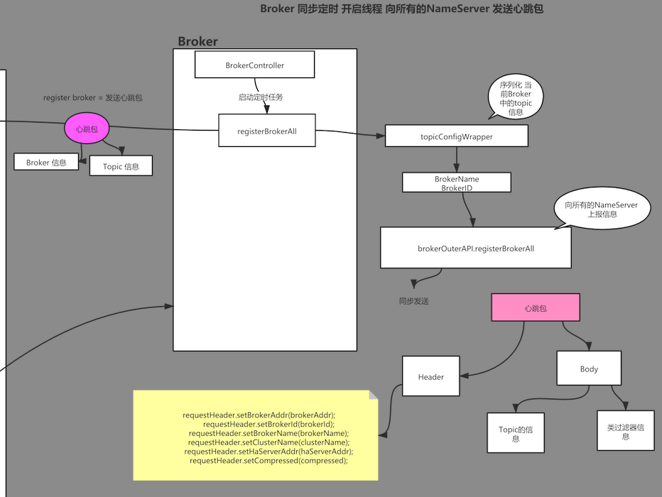
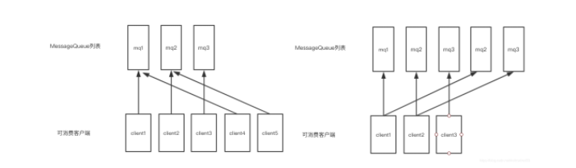

# RocketMQ

## 安装

官网：https://rocketmq.apache.org/dowloading/releases/

下载对应的版本后进入到项目目录下

 执行 mvn -Prelease-**all** -DskipTests clean install -U


现在目录是发布版 我们将它挪出来


进入bin目录下


先启动mqnamesrv

相当于注册中心


再开启另一个窗口启动mqbroker 默认分配8G内存，我们本地不需要那么多内存

修改vim runbroker.sh 


**启动一定要加参数注册** ./mqbroker -n localhost:9876


**测试消息发送**

使用`tool.sh`脚本执行测试程序

在`bin`目录下执行

```
./tools.sh org.apache.rocketmq.example.quickstart.Producer
```


**发送失败提示connect to null failed**

```
 ./tools.sh org.apache.rocketmq.example.quickstart.Producer
22:49:02.470 [main] DEBUG i.n.u.i.l.InternalLoggerFactory - Using SLF4J as the default logging framework
RocketMQLog:WARN No appenders could be found for logger (io.netty.util.internal.PlatformDependent0).
RocketMQLog:WARN Please initialize the logger system properly.
java.lang.IllegalStateException: org.apache.rocketmq.remoting.exception.RemotingConnectException: connect to
 null failed
```

**原因：**不知道`nameserver`在哪儿

在`tools`脚本中添加

```
export NAMESRV_ADDR=localhost:9876
```


执行成功

消费消息

``` sh
 ./tools.sh org.apache.rocketmq.example.quickstart.Consumer
```


消费后卡住等待新的消息来

### 安装控制台

#### 下载

https://github.com/apache/rocketmq-externals

**中文指南**

https://github.com/apache/rocketmq-externals/blob/master/rocketmq-console/doc/1_0_0/UserGuide_CN.md


有pom文件了，可以进行编译

执行编译

```
mvn clean package -Dmaven.test.skip=true
```


把jar包mv出来

Java -jar 执行默认启动8080端口


启动时，直接动态添加`nameserver`地址或编辑`application.properties`添加属性

```
java -jar rocketmq-console-ng-1.0.1.jar --rocketmq.config.namesrvAddr=127.0.0.1:9876

```


是list可以添加多个


切换语言


 

## 介绍

### 消息中间件功能

#### 应用解耦

AB应用不在互相依赖

#### 流量削峰

流量达到高峰的时候，通常使用限流算法来控制流量涌入系统，避免系统被击瘫，但是这种方式损失了一部分请求

此时可以使用消息中间件来缓冲大量的请求，匀速消费，当消息队列中堆积消息过多时，我们可以动态上线增加消费端，来保证不丢失重要请求。

#### 大数据处理

消息中间件可以把各个模块中产生的管理员操作日志、用户行为、系统状态等数据文件作为消息收集到主题中

数据使用方可以订阅自己感兴趣的数据内容互不影响，进行消费

#### 异构系统

跨语言

### 角色


#### broker

- Broker面向producer和consumer接受和发送消息
- 向nameserver提交自己的信息
- 是消息中间件的消息存储、转发服务器。
- 每个Broker节点，在启动时，都会遍历NameServer列表，与每个NameServer建立长连接，注册自己的信息，之后定时上报。


##### broker集群

- Broker高可用，可以配成Master/Slave结构，Master可写可读，Slave只可以读，Master将写入的数据同步给Slave。
  - 一个Master可以对应多个Slave，但是一个Slave只能对应一个Master
  - Master与Slave的对应关系通过指定相同的BrokerName，不同的BrokerId来定义BrokerId为0表示Master，非0表示Slave
- Master多机负载，可以部署多个broker
  - 每个Broker与nameserver集群中的所有节点建立长连接，定时注册Topic信息到所有nameserver。


#### producer

- 消息的生产者
- 通过集群中的其中一个节点（随机选择）建立长连接，获得Topic的路由信息，包括Topic下面有哪些Queue，这些Queue分布在哪些Broker上等
- 接下来向提供Topic服务的Master建立长连接，且定时向Master发送心跳

#### consumer

消息的消费者，通过NameServer集群获得Topic的路由信息，连接到对应的Broker上消费消息。

注意，由于Master和Slave都可以读取消息，因此Consumer会与Master和Slave都建立连接。

#### nameserver

底层由netty实现，提供了路由管理、服务注册、服务发现的功能，是一个无状态节点

**nameserver是服务发现者**，集群中各个角色（producer、broker、consumer等）都需要定时想nameserver上报自己的状态，以便互相发现彼此，超时不上报的话，nameserver会把它从列表中剔除

**nameserver可以部署多个**，当多个nameserver存在的时候，其他角色同时向他们上报信息，以保证高可用，

**NameServer集群间互不通信**，没有主备的概念

**nameserver内存式存储**，nameserver中的broker、topic等信息默认不会持久化

**为什么不用zookeeper？**：rocketmq希望为了提高性能，CAP定理，客户端负载均衡

### 对比JSM中的Topic和Queue

Topic是一个逻辑上的概念，实际上Message是在每个Broker上以Queue的形式记录。


对应到JMS中的topic实现是由客户端来完成的

```
        consumer.setMessageModel(MessageModel.BROADCASTING);
```

### 搭建Maven项目

```xml
<dependency>
   <groupId>org.apache.rocketmq</groupId>
   <artifactId>rocketmq-client</artifactId>
   <version>4.6.1</version>
</dependency>
```

## 消息发送方式

### 同步消息

消息发送中进入同步等待状态，可以保证消息投递一定到达

**Producer**

```java
public class Producer {

   public static void main(String[] args)throws Exception {
      
      DefaultMQProducer producer = new DefaultMQProducer("xoxogp");
      
      // 设置nameserver地址
      producer.setNamesrvAddr("192.168.21.103:9876");
      producer.start();
      
      // topic 消息将要发送到的地址
      // body  消息中的具体数据
      Message msg1 = new Message("myTopic001", "xxxxooo 第一条".getBytes());
      Message msg2 = new Message("myTopic001", "xxxxooo 第2条".getBytes());
      Message msg3 = new Message("myTopic001", "xxxxooo 第3条".getBytes());
      // list发送更有效率，如果一个个发是三个阻塞
      ArrayList<Message> list = new ArrayList<Message>();
      list.add(msg1);
      list.add(msg2);
      list.add(msg3);
      
      // 同步消息发送  阻塞状态 不会丢消息
      // for  
      // list.add
      
      SendResult sendResult3 = producer.send(list);
      
      System.out.println(sendResult3);
      producer.shutdown();
      System.out.println("已经停机");
      
   }
}
```

**Consumer**

```java
    public static void main(String[] args)throws Exception {
      
      DefaultMQPushConsumer consumer = new DefaultMQPushConsumer("xxoocsm");
      
      consumer.setNamesrvAddr("192.168.21.103:9876");
      
      
      /**
       * a()
       * c()
       * d()
       * b -> 向 rocketmq 写入一条消息()
       * rollback()
       * 
       * 
       * 
       */
      
      // 每个consumer 关注一个topic
      
      // topic 关注的消息的地址
      // 过滤器 * 表示不过滤
      consumer.subscribe("myTopic002", "*");
      
      // 注册监听器	 
      consumer.registerMessageListener(new MessageListenerConcurrently() {
         
         public ConsumeConcurrentlyStatus consumeMessage(List<MessageExt> msgs, ConsumeConcurrentlyContext context) {

            for (MessageExt msg : msgs) {
               
               System.out.println(new String(msg.getBody()));;
            }
            // 默认情况下 这条消息只会被 一个consumer 消费到 点对点
            // message 状态修改
            // ack
            return ConsumeConcurrentlyStatus.CONSUME_SUCCESS;
         }
      });
      
      
      // 讲道理 冲突，首先，别这么干
      // 集群模式只消费一次
      consumer.setMessageModel(MessageModel.CLUSTERING);
      consumer.start();
      
      // 集群 -> 一组consumer
      // 广播
      
      System.out.println("Consumer 02 start...");
   }
}
```

### 异步消息

想要快速发送消息，又不想丢失的时候可以使用异步消息

producer执行完send方法后不会卡住，会继续执行下面的代码

**producer**

```java
public static void main(String[] args)throws Exception {
      
      DefaultMQProducer producer = new DefaultMQProducer("xoxogp");
      
      // 设置nameserver地址
      producer.setNamesrvAddr("localhost:9876");
      producer.start();

      // 异步可靠消息
      // 不会阻塞，等待broker的确认
      // 采用事件监听方式接受broker返回的确认
      Message message = new Message("myTopic001", "xxoo".getBytes());
   
      
   // producer.setRetryTimesWhenSendAsyncFailed(retryTimesWhenSendAsyncFailed);
      producer.send(message,new SendCallback() {
         
         public void onSuccess(SendResult sendResult) {
            // TODO Auto-generated method stub
            System.out.println("消息发送成功。。。");
            System.out.println("sendResult ：" + sendResult);
            
         }
         
         public void onException(Throwable e) {

            // 如果发生异常 case 异常，尝试重投
            // 或者调整业务逻辑
            
            e.printStackTrace();
            System.out.println("发送异常");
         }
      });
   
      
//    producer.shutdown();
      System.out.println("已经停机");
      
   }
```

### 单向消息

只发送消息，不等待服务器响应，只发送请求不等待应答。此方式发送消息的过程耗时非常短，一般在微秒级别。

```java
public static void main(String[] args)throws Exception {
   
   DefaultMQProducer producer = new DefaultMQProducer("xoxogp");
   
   // 设置nameserver地址
   producer.setNamesrvAddr("localhost:9876");
   producer.start();

   Message message = new Message("myTopic001", "xxooxx".getBytes());

   // 单向消息
   // p 网络不确定
   producer.sendOneway(message);
   
// producer.shutdown();
   System.out.println("已经停机");
   
}
```

## 消息消费模式

消息消费模式由**消费者来决定**，可以由消费者设置MessageModel来决定消息模式。

消息模式默认为集群消费模式

```java
 consumer.setMessageModel(MessageModel.BROADCASTING);// 广播模式
 consumer.setMessageModel(MessageModel.CLUSTERING);// 集群模式
```

### 集群消息


集群消息是指**集群化部署消费者**

当使用集群消费模式时，MQ 认为任意一条消息只需要被集群内的任意一个消费者处理即可。

**特点**

- 每条消息只需要被处理一次，broker只会把消息发送给消费集群中的一个消费者
- 在消息重投时，不能保证路由到同一台机器上
- **消费状态由broker维护**

### 广播消息


当使用广播消费模式时，MQ 会将每条消息推送给集群内所有注册过的客户端，保证消息至少被每台机器消费一次。

**特点**

- 消费进度由consumer维护

- 保证每个消费者消费一次消息

- 消费失败的消息不会重投

## 消息过滤

### TAG

可以使用tag来过滤消费

 在Producer中使用Tag：

```java
Message msg = new Message("TopicTest","TagA" ,("Hello RocketMQ " ).getBytes(RemotingHelper.DEFAULT_CHARSET));
```

  在Consumer中订阅Tag：

```java
consumer.subscribe("TopicTest", "TagA||TagB");// * 代表订阅Topic下的所有消息
```

**producer**

```java
public static void main(String[] args)throws Exception {
   
   DefaultMQProducer producer = new DefaultMQProducer("xoxogp");
   
   // 设置nameserver地址
   producer.setNamesrvAddr("localhost:9876");
   producer.start();

   // tag 是用来过滤消息，消息分组
   
   Message message = new Message("myTopic003", "TAG-B","KEY-xx","xxooxx".getBytes());

   // 单向消息
   // p 网络不确定
   producer.send(message);
   
   producer.shutdown();
   System.out.println("已经停机");
   
}
```

**consumer**

```java
public static void main(String[] args)throws Exception {
   
   DefaultMQPushConsumer consumer = new DefaultMQPushConsumer("xxoo0TAG-B");
   
   consumer.setNamesrvAddr("localhost:9876");
   
   
   // 每个consumer 关注一个topic
   
   // topic 关注的消息的地址
   // 过滤器 * 表示不过滤
   // tag selector 在一个group中的消费者，都不能随便变，要保持统一
   // 只接收TAG-B标签的消息
   consumer.subscribe("myTopic003", "TAG-B");
   
   consumer.registerMessageListener(new MessageListenerConcurrently() {
      
      public ConsumeConcurrentlyStatus consumeMessage(List<MessageExt> msgs, ConsumeConcurrentlyContext context) {

         for (MessageExt msg : msgs) {
            
            System.out.println(new String(msg.getBody()));;
         }
         // 默认情况下 这条消息只会被 一个consumer 消费到 点对点
         // message 状态修改
         // ack
         return ConsumeConcurrentlyStatus.CONSUME_SUCCESS;
      }
   });
   
   
   // 讲道理 冲突，首先，别这么干
   consumer.setMessageModel(MessageModel.CLUSTERING);
   consumer.start();
   
   // 集群 -> 一组consumer
   // 广播
   
   System.out.println("Consumer TAG-B start...");
}
```


### SQL表达式过滤

消费者将收到包含TAGA或TAGB或TAGB的消息. 但限制是一条消息只能有一个标签，而这对于复杂的情况可能无效。 在这种情况下，您可以使用SQL表达式筛选出消息.

#### 配置

在`broker.conf `中添加配置

```
enablePropertyFilter=true
```


启动broker 加载指定配置文件

```
../bin/mqbroker -n 192.168.150.113:9876 -c broker.conf 
```

随后在集群配置中可以看到


#### **实例**

```java
        MessageSelector selector = MessageSelector.bySql("order > 5");
        consumer.subscribe("xxoo3", selector);
```

#### 语法

RocketMQ只定义了一些基本的语法来支持这个功能。 你也可以很容易地扩展它.

1. 数字比较, 像 `>`, `>=`, `<`, `<=`, `BETWEEN`, `=`;
2. 字符比较, 像 `=`, `<>`, `IN`;
3. `IS NULL` 或者 `IS NOT NULL`;
4. 逻辑运算`AND`, `OR`, `NOT`;

常量类型是:

1. 数字, 像123, 3.1415;
2. 字符串, 像‘abc’,必须使用单引号;
3. `NULL`, 特殊常数;
4. 布尔常量, `TRUE` 或`FALSE`;

**producer**

```java
public static void main(String[] args)throws Exception {
   
   DefaultMQProducer producer = new DefaultMQProducer("xoxogp");
   
   // 设置nameserver地址
   producer.setNamesrvAddr("localhost:9876");
   producer.start();

   // tag 是用来过滤消息，消息分组
   
   
   for (int i = 1; i <= 100; i++) {
      
      Message message = new Message("myTopic003", "TAG-B","KEY-xx",("xxooxx:" + i ).getBytes());
      message.putUserProperty("age", String.valueOf(i));
      producer.send(message);
   }
   
   
   
   // 单向消息
   // p 网络不确定
   
   producer.shutdown();
   System.out.println("已经停机");
   
}
```

**consumer**

```java
public static void main(String[] args)throws Exception {
   
   DefaultMQPushConsumer consumer = new DefaultMQPushConsumer("xxoo0TAG-B");
   
   consumer.setNamesrvAddr("localhost:9876");
   
   
   /**
    * a()
    * c()
    * d()
    * b -> 向 rocketmq 写入一条消息()
    * rollback()
    * 
    * 
    * 
    */
   
   // 每个consumer 关注一个topic
   
   // topic 关注的消息的地址
   // 过滤器 * 表示不过滤
   // tag selector 在一个group中的消费者，都不能随便变，要保持统一
   
   MessageSelector messageSelector = MessageSelector.bySql("age >= 18 and age <= 28");
   
   consumer.subscribe("myTopic003",messageSelector );
   
   consumer.registerMessageListener(new MessageListenerConcurrently() {
      
      public ConsumeConcurrentlyStatus consumeMessage(List<MessageExt> msgs, ConsumeConcurrentlyContext context) {

         for (MessageExt msg : msgs) {
            
            System.out.println(new String(msg.getBody()));;
         }
         // 默认情况下 这条消息只会被 一个consumer 消费到 点对点
         // message 状态修改
         // ack
         return ConsumeConcurrentlyStatus.CONSUME_SUCCESS;
      }
   });
   
   
   // 讲道理 冲突，首先，别这么干
   consumer.setMessageModel(MessageModel.CLUSTERING);
   consumer.start();
   
   // 集群 -> 一组consumer
   // 广播
   
   System.out.println("Consumer TAG-B start...");
}
```


## 事务消息


1. 开始事务，发送半消息，写入半消息队列
2. 返回ack给producer
3. 执行本地事物
4. rocket定时任务检查本地方法是否成功，需要调用producer的回调方法
5. consumer消费

### RocketMQ实现方式

**Half Message：**预处理消息，当broker收到此类消息后，会存储到RMQ_SYS_TRANS_HALF_TOPIC的消息消费队列中

**检查事务状态：**Broker会开启一个定时任务，消费RMQ_SYS_TRANS_HALF_TOPIC队列中的消息，每次执行任务会向消息发送者确认事务执行状态（提交、回滚、未知），如果是未知，等待下一次回调。

**超时：**如果超过回查次数，默认回滚消息

#### TransactionListener的两个方法

##### executeLocalTransaction

半消息发送成功触发此方法来执行本地事务

##### checkLocalTransaction

broker将发送检查消息来检查事务状态，并将调用此方法来获取本地事务状态

##### 本地事务执行状态

**LocalTransactionState.COMMIT_MESSAGE**

执行事务成功，确认提交

**LocalTransactionState.ROLLBACK_MESSAGE**

回滚消息，broker端会删除半消息

**LocalTransactionState.UNKNOW**

暂时为未知状态，等待broker回查

```java
public static void main(String[] args)throws Exception {
   
   TransactionMQProducer producer = new TransactionMQProducer("xoxogp1");
   
   producer.setNamesrvAddr("localhost:9876");
   
   // 回调
   
   producer.setTransactionListener(new TransactionListener() {
      
      public LocalTransactionState executeLocalTransaction(Message msg, Object arg) {
         // 执行 本地事务
         
         
         System.out.println("=====executeLocalTransaction");
         System.out.println("msg:" + new String(msg.getBody()));
         System.out.println("msg:" + msg.getTransactionId());
         
         /**
          * 
          * 事务方法 写这里
          * 
          * 同步执行
          * -----a----
          * a 提交注册信息()  ;
          * b 写入数据库();
          * c 新用户() -> 发消息;
          * 
          * 事务消息的应用场景是不是适合发送多个消息要保证同时成功或失败？
          * 
          * ----b----
          * 
          * 读取消息
          * 拿到新用户的信息 发短信
          * 
          * 
          * 那如果最后一个commit发送失败，
          * 业务的事务 异常， 然后broker等超时回调检查 发现失败，就扔掉数据是吗？
          * 
          * 
          * 下订单，发半消息 尝试扣款，
            如果订单成功，就真正扣款 ，如果订单失败，则不扣款，  如果半消息扣款失败 则回滚订单   是这样的吗
            
            mysql 的事务           
          */
         try {
            
            // 业务
         } catch (Exception e) {
            // 
            return LocalTransactionState.ROLLBACK_MESSAGE;
         }
         // 真正发出去的数据 可用
         return LocalTransactionState.COMMIT_MESSAGE;
      }
      
      // 回调检查
      public LocalTransactionState checkLocalTransaction(MessageExt msg) {
         // Broker 端 回调 ，检查事务
         
         System.out.println("=====checkLocalTransaction");
         System.out.println("msg:" + new String(msg.getBody()));
         System.out.println("msg:" + msg.getTransactionId());
               
         // 事务执行成功
         return LocalTransactionState.COMMIT_MESSAGE;
         // 等会儿
   //    return LocalTransactionState.UNKNOW;
         // 回滚消息
   //    return LocalTransactionState.ROLLBACK_MESSAGE;
      }
   });
  
   producer.start();
   

   TransactionSendResult sendResult = producer.sendMessageInTransaction(new Message("xxoo003", "测试！这是事务消息".getBytes()), null);
   
   System.out.println("sendResult:" + sendResult);
   
// producer.shutdown();
   System.out.println("已经停机");
   
}
```

## 重试机制

#### producer

**默认超时时间**

```java
    /**
     * Timeout for sending messages.
     */
    private int sendMsgTimeout = 3000;
```

```java
	// 异步发送时 重试次数，默认 2
	producer.setRetryTimesWhenSendAsyncFailed(1);
	// 同步发送时 重试次数，默认 2
	producer.setRetryTimesWhenSendFailed(1);	
	
	// 是否向其他broker发送请求 默认false
	producer.setRetryAnotherBrokerWhenNotStoreOK(true);
```

#### Consumer

消费超时，单位分钟

`consumer.setConsumeTimeout()`

发送ack，消费失败

`RECONSUME_LATER`

#### broker投递

只有在消息模式为MessageModel.CLUSTERING集群模式时，Broker才会自动进行重试，广播消息不重试

重投使用`messageDelayLevel`

默认值

```
messageDelayLevel	1s 5s 10s 30s 1m 2m 3m 4m 5m 6m 7m 8m 9m 10m 20m 30m 1h 2h
```


## 顺序消费

队列先天支持FIFO模型，单一生产和消费者下只要保证使用`MessageListenerOrderly`监听器即可

顺序消费表示消息消费的顺序同生产者为每个消息队列发送的顺序一致，所以如果正在处理全局顺序是强制性的场景，需要确保使用的主题只有一个消息队列。

并行消费不再保证消息顺序，消费的最大并行数量受每个消费者客户端指定的线程池限制。

那么只要顺序的发送，再保证一个线程只去消费一个队列上的消息，那么他就是有序的。


跟普通消息相比，顺序消息的使用需要在producer的send()方法中添加MessageQueueSelector接口的实现类，并重写select选择使用的队列，因为顺序消息局部顺序，需要将所有消息指定发送到同一队列中。


**保证有序参与因素**

- FIFO
- 队列内保证有序
- 消费线程

```java
Message message = new Message("xxoo007", ("hi!" ).getBytes());

producer.send(message,
      // queue 选择器
      new MessageQueueSelector() {
   public MessageQueue select(
         // list中所有的queue
         List<MessageQueue> list,
                        // 具体要发的那条消息
                        Message message,
                        Object arg) {
      // arg 就是外边传入的0
      // 向固定的queue写入消息
      final MessageQueue messageQueue = list.get((Integer) (arg));
      return messageQueue;
   }
},0,3000);
```

MessageListenerConcurrently一个queue多个线程

```java
    /**
       * MessageListenerConcurrently   并发消费 / 开多个线程
       */
    consumer.registerMessageListener(new MessageListenerConcurrently() {
       
      public ConsumeConcurrentlyStatus consumeMessage(List<MessageExt> msgs, ConsumeConcurrentlyContext context) {

          for (MessageExt msg : msgs) {
             
             System.out.println(new String(msg.getBody()));;
          }
          return ConsumeConcurrentlyStatus.CONSUME_SUCCESS;
       }
    });
```

MessageListenerOrderly对于一个queue开启一个线程，多个queue开启多个线程

```java
// 最大开启线程数
// consumer.setConsumeThreadMax(consumeThreadMax);
// 最小开启线程数
// consumer.setConsumeThreadMin(consumeThreadMin);
   consumer.registerMessageListener(new MessageListenerOrderly() {
      
      public ConsumeOrderlyStatus consumeMessage(List<MessageExt> msgs, ConsumeOrderlyContext context) {
         for (MessageExt msg : msgs) {
         
         System.out.println(new String(msg.getBody()) + " Thread:" + Thread.currentThread().getName());;
      }
      return ConsumeOrderlyStatus.SUCCESS;
      }
   });
   
   consumer.start();
```

## 消息持久化


topic是逻辑概念，物理结构是consumequeue,真实的消息存储在commitlog上，queue中存储的是每个msg的索引


## NameServer

无状态、高可用、高性能、数据会有不一致

**核心功能**：维持心跳


## 集群


brokerid > 0 的是slave

生产消息从master，消费消息从slave


同步双写？

producer 写入master，master同步到slave后再给producer返回ack，可用性差，一致性强

主备都写成功，向应用返回成功。

还有一个异步执行 master直接返回，再写slave，有可能丢消息


### 主备切换故障转移

在 RocketMQ 4.5 版本之前，RocketMQ 只有 Master/Slave 一种部署方式，一组 broker 中有一个 Master ，有零到多个 
Slave，Slave 通过同步复制或异步复制的方式去同步 Master 数据。Master/Slave 部署模式，提供了一定的高可用性。 
但这样的部署模式，有一定缺陷。比如故障转移方面，如果主节点挂了，还需要人为手动进行重启或者切换，无法自动将一个从节点转换为主节点。因此，我们希望能有一个新的多副本架构，去解决这个问题。

新的多副本架构首先需要解决自动故障转移的问题，本质上来说是自动选主的问题。这个问题的解决方案基本可以分为两种：

利用第三方协调服务集群完成选主，比如 zookeeper 或者 etcd（raft）。这种方案会引入了重量级外部组件，加重部署，运维和故障诊断成本，比如在维护 RocketMQ 集群还需要维护 zookeeper 集群，并且 zookeeper 集群故障会影响到 RocketMQ 集群。
利用 raft 协议来完成一个自动选主，raft 协议相比前者的优点是不需要引入外部组件，自动选主逻辑集成到各个节点的进程中，节点之间通过通信就可以完成选主。

### DLedger

提供选举（选主）和数据同步功能

至少要组件3台服务器集群，不然无法提供选举

broker配置

```
# dleger
enableDLegerCommitLog = true
dLegerGroup = broker-a
dLegerPeers = n0-192.168.150.210:40911;n1-192.168.150.211:40911
dLegerSelfId = n0
sendMessageThreadPoolNums = 4

```


# 源码

## consumer

```java
DefaultMQPushConsumer consumer = new DefaultMQPushConsumer("xxoocsm");
```

### DefaultMQPushConsumer

```java
public DefaultMQPushConsumer(final String consumerGroup) {
    this(null, consumerGroup, null, new AllocateMessageQueueAveragely());
}
```

```java
public DefaultMQPushConsumer(final String namespace, final String consumerGroup, RPCHook rpcHook,
    AllocateMessageQueueStrategy allocateMessageQueueStrategy) {
  	// 消费者组
    this.consumerGroup = consumerGroup;
  	// 命名空间
    this.namespace = namespace;
  	// 消息分配算法
    this.allocateMessageQueueStrategy = allocateMessageQueueStrategy;
    defaultMQPushConsumerImpl = new DefaultMQPushConsumerImpl(this, rpcHook);// ->
}
```

### DefaultMQPushConsumerImpl

真实的实现

```java
public DefaultMQPushConsumerImpl(DefaultMQPushConsumer defaultMQPushConsumer, RPCHook rpcHook) {
  	// 上边的defaultMQPushConsumer
    this.defaultMQPushConsumer = defaultMQPushConsumer;
    // RPC挂钩
    this.rpcHook = rpcHook;
  	// 赋值1000
    this.pullTimeDelayMillsWhenException = defaultMQPushConsumer.getPullTimeDelayMillsWhenException();
}
```


broker把消息推给consumer

#### **start方法**

```java
@Override
public void start() throws MQClientException {
    setConsumerGroup(NamespaceUtil.wrapNamespace(this.getNamespace(), this.consumerGroup));
    // 实现类的start方法
    this.defaultMQPushConsumerImpl.start(); // ->
    if (null != traceDispatcher) {
        try {
            // 内部追踪器，追踪消息到哪里了
            // 默认是null
            traceDispatcher.start(this.getNamesrvAddr(), this.getAccessChannel());
        } catch (MQClientException e) {
            log.warn("trace dispatcher start failed ", e);
        }
    }
}
```


```java
public synchronized void start() throws MQClientException {
    switch (this.serviceState) {
        // 刚刚启动 
        case CREATE_JUST:
            log.info("the consumer [{}] start beginning. messageModel={}, isUnitMode={}", this.defaultMQPushConsumer.getConsumerGroup(),
                this.defaultMQPushConsumer.getMessageModel(), this.defaultMQPushConsumer.isUnitMode());
            this.serviceState = ServiceState.START_FAILED;

            this.checkConfig();

            this.copySubscription();

            if (this.defaultMQPushConsumer.getMessageModel() == MessageModel.CLUSTERING) {
                this.defaultMQPushConsumer.changeInstanceNameToPID();
            }
// 客户端连接工厂
            this.mQClientFactory = MQClientManager.getInstance().getOrCreate	MQClientInstance(this.defaultMQPushConsumer, this.rpcHook);

// 基于客户端的负载均衡
        this.rebalanceImpl.setConsumerGroup(this.defaultMQPushConsumer.getConsumerGroup());
            this.rebalanceImpl.setMessageModel(this.defaultMQPushConsumer.getMessageModel());
            this.rebalanceImpl.setAllocateMessageQueueStrategy(this.defaultMQPushConsumer.getAllocateMessageQueueStrategy());
            this.rebalanceImpl.setmQClientFactory(this.mQClientFactory);
						// pull模型的请求包装器
            this.pullAPIWrapper = new PullAPIWrapper(
                mQClientFactory,
                this.defaultMQPushConsumer.getConsumerGroup(), isUnitMode());
            this.pullAPIWrapper.registerFilterMessageHook(filterMessageHookList);

            if (this.defaultMQPushConsumer.getOffsetStore() != null) {
                // 消费进度
                this.offsetStore = this.defaultMQPushConsumer.getOffsetStore();
            } else {
                switch (this.defaultMQPushConsumer.getMessageModel()) {
                    case BROADCASTING:
                        this.offsetStore = new LocalFileOffsetStore(this.mQClientFactory, this.defaultMQPushConsumer.getConsumerGroup());
                        break;
                    case CLUSTERING:
                        this.offsetStore = new RemoteBrokerOffsetStore(this.mQClientFactory, this.defaultMQPushConsumer.getConsumerGroup());
                        break;
                    default:
                        break;
                }
                this.defaultMQPushConsumer.setOffsetStore(this.offsetStore);
            }
            this.offsetStore.load();

            if (this.getMessageListenerInner() instanceof MessageListenerOrderly) {
                this.consumeOrderly = true;
                // 创建消费服务
                this.consumeMessageService =
                    new ConsumeMessageOrderlyService(this, (MessageListenerOrderly) this.getMessageListenerInner());
            } else if (this.getMessageListenerInner() instanceof MessageListenerConcurrently) {
                this.consumeOrderly = false;
                this.consumeMessageService =
                    new ConsumeMessageConcurrentlyService(this, (MessageListenerConcurrently) this.getMessageListenerInner());
            }
						// 
            this.consumeMessageService.start();
						// 向broker注册连接信息
            boolean registerOK = mQClientFactory.registerConsumer(this.defaultMQPushConsumer.getConsumerGroup(), this);
            if (!registerOK) {
                this.serviceState = ServiceState.CREATE_JUST;
                this.consumeMessageService.shutdown();
                throw new MQClientException("The consumer group[" + this.defaultMQPushConsumer.getConsumerGroup()
                    + "] has been created before, specify another name please." + FAQUrl.suggestTodo(FAQUrl.GROUP_NAME_DUPLICATE_URL),
                    null);
            }
						
            mQClientFactory.start();// MQClientInstance ->
            log.info("the consumer [{}] start OK.", this.defaultMQPushConsumer.getConsumerGroup());
            this.serviceState = ServiceState.RUNNING;
            break;
        case RUNNING:
        case START_FAILED:
        case SHUTDOWN_ALREADY:
            throw new MQClientException("The PushConsumer service state not OK, maybe started once, "
                + this.serviceState
                + FAQUrl.suggestTodo(FAQUrl.CLIENT_SERVICE_NOT_OK),
                null);
        default:
            break;
    }

    this.updateTopicSubscribeInfoWhenSubscriptionChanged();
    this.mQClientFactory.checkClientInBroker();
    this.mQClientFactory.sendHeartbeatToAllBrokerWithLock();
    this.mQClientFactory.rebalanceImmediately();
}
```

##### subscribe

```java
public void subscribe(String topic, String subExpression) throws MQClientException {
    try {
      	// 构建订阅数据
        SubscriptionData subscriptionData = FilterAPI.buildSubscriptionData(this.defaultMQPushConsumer.getConsumerGroup(),
            topic, subExpression);
      	// 负载均衡中加入本地缓存数据
        this.rebalanceImpl.getSubscriptionInner().put(topic, subscriptionData);
        if (this.mQClientFactory != null) {
          	// 发送心跳包，向所有被加锁的心跳包 此处只发送一次
            this.mQClientFactory.sendHeartbeatToAllBrokerWithLock();
        }
    } catch (Exception e) {
        throw new MQClientException("subscription exception", e);
    }
}
```

###### sendHeartbeatToAllBrokerWithLock

```java
public void sendHeartbeatToAllBrokerWithLock() {
  	// 获得锁
    if (this.lockHeartbeat.tryLock()) {
        try {
          	// 发送心跳包
            this.sendHeartbeatToAllBroker();
          	// 类过滤器
            this.uploadFilterClassSource();
        } catch (final Exception e) {
            log.error("sendHeartbeatToAllBroker exception", e);
        } finally {
          	// 解锁
            this.lockHeartbeat.unlock();
        }
    } else {
        log.warn("lock heartBeat, but failed.");
    }
}
```

#### MQClientInstance.start()

```java
public void start() throws MQClientException {

    synchronized (this) {
        switch (this.serviceState) {
            // 是不是刚刚启动
            case CREATE_JUST:
                this.serviceState = ServiceState.START_FAILED;
                // If not specified,looking address from name server
            		// 动态维护nameServer
                if (null == this.clientConfig.getNamesrvAddr()) {
                    this.mQClientAPIImpl.fetchNameServerAddr();
                }
                // Start request-response channel
            		// 通过netty建立远程连接
                this.mQClientAPIImpl.start();
                // Start various schedule tasks
            		// 任务调度器，发送心跳包、根据消息堆积动态调整线程池数量、定时记录消费进度
                this.startScheduledTask();
                // Start pull service
            		// 启动消息拉取服务，异步拿回来 执行run方法
                this.pullMessageService.start();
                // Start rebalance service
            		// 分发消息 推消息
                this.rebalanceService.start();
                // Start push service
                this.defaultMQProducer.getDefaultMQProducerImpl().start(false);
                log.info("the client factory [{}] start OK", this.clientId);
                this.serviceState = ServiceState.RUNNING;
                break;
            case START_FAILED:
                throw new MQClientException("The Factory object[" + this.getClientId() + "] has been created before, and failed.", null);
            default:
                break;
        }
    }
}
```

##### PullMessageService.run()

```java
@Override
public void run() {
    log.info(this.getServiceName() + " service started");
		// 死循环去取消息
    while (!this.isStopped()) {
        try {
          	// 拿出一个pullRequest
            PullRequest pullRequest = this.pullRequestQueue.take();
          	// 执行pullMessage方法
            this.pullMessage(pullRequest);
        } catch (InterruptedException ignored) {
        } catch (Exception e) {
            log.error("Pull Message Service Run Method exception", e);
        }
    }

    log.info(this.getServiceName() + " service end");
}
```

##### RebalanceService.run()

```java
@Override
public void run() {
    log.info(this.getServiceName() + " service started");

    while (!this.isStopped()) {
        this.waitForRunning(waitInterval);
        this.mqClientFactory.doRebalance();
    }

    log.info(this.getServiceName() + " service end");
}
```


## 长轮训


---


## pullMessage

```java
DefaultMQPushConsumerImpl.pullmessage();
```

向broker拉取消息

```java
public void pullMessage(final PullRequest pullRequest) {
    final ProcessQueue processQueue = pullRequest.getProcessQueue();
    if (processQueue.isDropped()) {
        log.info("the pull request[{}] is dropped.", pullRequest.toString());
        return;
    }

    pullRequest.getProcessQueue().setLastPullTimestamp(System.currentTimeMillis());

    try {
        this.makeSureStateOK();
    } catch (MQClientException e) {
        log.warn("pullMessage exception, consumer state not ok", e);
        this.executePullRequestLater(pullRequest, pullTimeDelayMillsWhenException);
        return;
    }

    if (this.isPause()) {
        log.warn("consumer was paused, execute pull request later. instanceName={}, group={}", this.defaultMQPushConsumer.getInstanceName(), this.defaultMQPushConsumer.getConsumerGroup());
        this.executePullRequestLater(pullRequest, PULL_TIME_DELAY_MILLS_WHEN_SUSPEND);
        return;
    }

    long cachedMessageCount = processQueue.getMsgCount().get();
    long cachedMessageSizeInMiB = processQueue.getMsgSize().get() / (1024 * 1024);

    if (cachedMessageCount > this.defaultMQPushConsumer.getPullThresholdForQueue()) {
        this.executePullRequestLater(pullRequest, PULL_TIME_DELAY_MILLS_WHEN_FLOW_CONTROL);
        if ((queueFlowControlTimes++ % 1000) == 0) {
            log.warn(
                "the cached message count exceeds the threshold {}, so do flow control, minOffset={}, maxOffset={}, count={}, size={} MiB, pullRequest={}, flowControlTimes={}",
                this.defaultMQPushConsumer.getPullThresholdForQueue(), processQueue.getMsgTreeMap().firstKey(), processQueue.getMsgTreeMap().lastKey(), cachedMessageCount, cachedMessageSizeInMiB, pullRequest, queueFlowControlTimes);
        }
        return;
    }

    if (cachedMessageSizeInMiB > this.defaultMQPushConsumer.getPullThresholdSizeForQueue()) {
        this.executePullRequestLater(pullRequest, PULL_TIME_DELAY_MILLS_WHEN_FLOW_CONTROL);
        if ((queueFlowControlTimes++ % 1000) == 0) {
            log.warn(
                "the cached message size exceeds the threshold {} MiB, so do flow control, minOffset={}, maxOffset={}, count={}, size={} MiB, pullRequest={}, flowControlTimes={}",
                this.defaultMQPushConsumer.getPullThresholdSizeForQueue(), processQueue.getMsgTreeMap().firstKey(), processQueue.getMsgTreeMap().lastKey(), cachedMessageCount, cachedMessageSizeInMiB, pullRequest, queueFlowControlTimes);
        }
        return;
    }

    if (!this.consumeOrderly) {
        if (processQueue.getMaxSpan() > this.defaultMQPushConsumer.getConsumeConcurrentlyMaxSpan()) {
            this.executePullRequestLater(pullRequest, PULL_TIME_DELAY_MILLS_WHEN_FLOW_CONTROL);
            if ((queueMaxSpanFlowControlTimes++ % 1000) == 0) {
                log.warn(
                    "the queue's messages, span too long, so do flow control, minOffset={}, maxOffset={}, maxSpan={}, pullRequest={}, flowControlTimes={}",
                    processQueue.getMsgTreeMap().firstKey(), processQueue.getMsgTreeMap().lastKey(), processQueue.getMaxSpan(),
                    pullRequest, queueMaxSpanFlowControlTimes);
            }
            return;
        }
    } else {
        if (processQueue.isLocked()) {
            if (!pullRequest.isLockedFirst()) {
                final long offset = this.rebalanceImpl.computePullFromWhere(pullRequest.getMessageQueue());
                boolean brokerBusy = offset < pullRequest.getNextOffset();
                log.info("the first time to pull message, so fix offset from broker. pullRequest: {} NewOffset: {} brokerBusy: {}",
                    pullRequest, offset, brokerBusy);
                if (brokerBusy) {
                    log.info("[NOTIFYME]the first time to pull message, but pull request offset larger than broker consume offset. pullRequest: {} NewOffset: {}",
                        pullRequest, offset);
                }

                pullRequest.setLockedFirst(true);
                pullRequest.setNextOffset(offset);
            }
        } else {
            this.executePullRequestLater(pullRequest, pullTimeDelayMillsWhenException);
            log.info("pull message later because not locked in broker, {}", pullRequest);
            return;
        }
    }

    final SubscriptionData subscriptionData = this.rebalanceImpl.getSubscriptionInner().get(pullRequest.getMessageQueue().getTopic());
    if (null == subscriptionData) {
        this.executePullRequestLater(pullRequest, pullTimeDelayMillsWhenException);
        log.warn("find the consumer's subscription failed, {}", pullRequest);
        return;
    }

    final long beginTimestamp = System.currentTimeMillis();

    PullCallback pullCallback = new PullCallback() {
        @Override
        public void onSuccess(PullResult pullResult) {
            if (pullResult != null) {
                pullResult = DefaultMQPushConsumerImpl.this.pullAPIWrapper.processPullResult(pullRequest.getMessageQueue(), pullResult,
                    subscriptionData);

                switch (pullResult.getPullStatus()) {
                    case FOUND:
                        long prevRequestOffset = pullRequest.getNextOffset();
                        pullRequest.setNextOffset(pullResult.getNextBeginOffset());
                        long pullRT = System.currentTimeMillis() - beginTimestamp;
                        DefaultMQPushConsumerImpl.this.getConsumerStatsManager().incPullRT(pullRequest.getConsumerGroup(),
                            pullRequest.getMessageQueue().getTopic(), pullRT);

                        long firstMsgOffset = Long.MAX_VALUE;
                        if (pullResult.getMsgFoundList() == null || pullResult.getMsgFoundList().isEmpty()) {
                            DefaultMQPushConsumerImpl.this.executePullRequestImmediately(pullRequest);
                        } else {
                            firstMsgOffset = pullResult.getMsgFoundList().get(0).getQueueOffset();

                            DefaultMQPushConsumerImpl.this.getConsumerStatsManager().incPullTPS(pullRequest.getConsumerGroup(),
                                pullRequest.getMessageQueue().getTopic(), pullResult.getMsgFoundList().size());

                            boolean dispatchToConsume = processQueue.putMessage(pullResult.getMsgFoundList());
                            DefaultMQPushConsumerImpl.this.consumeMessageService.submitConsumeRequest(
                                pullResult.getMsgFoundList(),
                                processQueue,
                                pullRequest.getMessageQueue(),
                                dispatchToConsume);

                            if (DefaultMQPushConsumerImpl.this.defaultMQPushConsumer.getPullInterval() > 0) {
                                DefaultMQPushConsumerImpl.this.executePullRequestLater(pullRequest,
                                    DefaultMQPushConsumerImpl.this.defaultMQPushConsumer.getPullInterval());
                            } else {
                                DefaultMQPushConsumerImpl.this.executePullRequestImmediately(pullRequest);
                            }
                        }

                        if (pullResult.getNextBeginOffset() < prevRequestOffset
                            || firstMsgOffset < prevRequestOffset) {
                            log.warn(
                                "[BUG] pull message result maybe data wrong, nextBeginOffset: {} firstMsgOffset: {} prevRequestOffset: {}",
                                pullResult.getNextBeginOffset(),
                                firstMsgOffset,
                                prevRequestOffset);
                        }

                        break;
                    case NO_NEW_MSG:
                        pullRequest.setNextOffset(pullResult.getNextBeginOffset());

                        DefaultMQPushConsumerImpl.this.correctTagsOffset(pullRequest);

                        DefaultMQPushConsumerImpl.this.executePullRequestImmediately(pullRequest);
                        break;
                    case NO_MATCHED_MSG:
                        pullRequest.setNextOffset(pullResult.getNextBeginOffset());

                        DefaultMQPushConsumerImpl.this.correctTagsOffset(pullRequest);

                        DefaultMQPushConsumerImpl.this.executePullRequestImmediately(pullRequest);
                        break;
                    case OFFSET_ILLEGAL:
                        log.warn("the pull request offset illegal, {} {}",
                            pullRequest.toString(), pullResult.toString());
                        pullRequest.setNextOffset(pullResult.getNextBeginOffset());

                        pullRequest.getProcessQueue().setDropped(true);
                        DefaultMQPushConsumerImpl.this.executeTaskLater(new Runnable() {

                            @Override
                            public void run() {
                                try {
                                    DefaultMQPushConsumerImpl.this.offsetStore.updateOffset(pullRequest.getMessageQueue(),
                                        pullRequest.getNextOffset(), false);

                                    DefaultMQPushConsumerImpl.this.offsetStore.persist(pullRequest.getMessageQueue());

                                    DefaultMQPushConsumerImpl.this.rebalanceImpl.removeProcessQueue(pullRequest.getMessageQueue());

                                    log.warn("fix the pull request offset, {}", pullRequest);
                                } catch (Throwable e) {
                                    log.error("executeTaskLater Exception", e);
                                }
                            }
                        }, 10000);
                        break;
                    default:
                        break;
                }
            }
        }

        @Override
        public void onException(Throwable e) {
            if (!pullRequest.getMessageQueue().getTopic().startsWith(MixAll.RETRY_GROUP_TOPIC_PREFIX)) {
                log.warn("execute the pull request exception", e);
            }

            DefaultMQPushConsumerImpl.this.executePullRequestLater(pullRequest, pullTimeDelayMillsWhenException);
        }
    };

    boolean commitOffsetEnable = false;
    long commitOffsetValue = 0L;
    if (MessageModel.CLUSTERING == this.defaultMQPushConsumer.getMessageModel()) {
        commitOffsetValue = this.offsetStore.readOffset(pullRequest.getMessageQueue(), ReadOffsetType.READ_FROM_MEMORY);
        if (commitOffsetValue > 0) {
            commitOffsetEnable = true;
        }
    }

    String subExpression = null;
    boolean classFilter = false;
    SubscriptionData sd = this.rebalanceImpl.getSubscriptionInner().get(pullRequest.getMessageQueue().getTopic());
    if (sd != null) {
        if (this.defaultMQPushConsumer.isPostSubscriptionWhenPull() && !sd.isClassFilterMode()) {
            subExpression = sd.getSubString();
        }

        classFilter = sd.isClassFilterMode();
    }

    int sysFlag = PullSysFlag.buildSysFlag(
        commitOffsetEnable, // commitOffset
        true, // suspend
        subExpression != null, // subscription
        classFilter // class filter
    );
    try {
        this.pullAPIWrapper.pullKernelImpl(
            pullRequest.getMessageQueue(),
            subExpression,
            subscriptionData.getExpressionType(),
            subscriptionData.getSubVersion(),
            pullRequest.getNextOffset(),
            this.defaultMQPushConsumer.getPullBatchSize(),
            sysFlag,
            commitOffsetValue,
            BROKER_SUSPEND_MAX_TIME_MILLIS,
            CONSUMER_TIMEOUT_MILLIS_WHEN_SUSPEND,
            CommunicationMode.ASYNC,
            pullCallback
        );
    } catch (Exception e) {
        log.error("pullKernelImpl exception", e);
        this.executePullRequestLater(pullRequest, pullTimeDelayMillsWhenException);
    }
}
```

### PullRequest

拉回来的报文包装类

```java
// 向broker拉取回来的请求
public class PullRequest {
    //
    private String consumerGroup;
    // 消息的元数据
    private MessageQueue messageQueue;
  	// 消息体，一次性拉去回来的实际的消息体，默认情况下是多条
    private ProcessQueue processQueue;
    private long nextOffset;
    private boolean lockedFirst = false;
}
```

#### ProcessQueue

```java
public class ProcessQueue {
    public final static long REBALANCE_LOCK_MAX_LIVE_TIME =
        Long.parseLong(System.getProperty("rocketmq.client.rebalance.lockMaxLiveTime", "30000"));
    public final static long REBALANCE_LOCK_INTERVAL = Long.parseLong(System.getProperty("rocketmq.client.rebalance.lockInterval", "20000"));
    private final static long PULL_MAX_IDLE_TIME = Long.parseLong(System.getProperty("rocketmq.client.pull.pullMaxIdleTime", "120000"));
  	// 日志
    private final InternalLogger log = ClientLogger.getLog();
  	// 可重入、可读可写锁、排他锁（别的线程来了可以拒绝掉）
    private final ReadWriteLock lockTreeMap = new ReentrantReadWriteLock();
  	// 红黑树 能保证节点顺序
    private final TreeMap<Long, MessageExt> msgTreeMap = new TreeMap<Long, MessageExt>();
    private final AtomicLong msgCount = new AtomicLong();
    private final AtomicLong msgSize = new AtomicLong();
    private final Lock lockConsume = new ReentrantLock();
    /**
     * A subset of msgTreeMap, will only be used when orderly consume
     */
    private final TreeMap<Long, MessageExt> consumingMsgOrderlyTreeMap = new TreeMap<Long, MessageExt>();
    private final AtomicLong tryUnlockTimes = new AtomicLong(0);
    private volatile long queueOffsetMax = 0L;
    private volatile boolean dropped = false;
  	// 最后一次拉取时间
    private volatile long lastPullTimestamp = System.currentTimeMillis();
    private volatile long lastConsumeTimestamp = System.currentTimeMillis();
    private volatile boolean locked = false;
    // 最后一次锁时间
    private volatile long lastLockTimestamp = System.currentTimeMillis();
    private volatile boolean consuming = false;
    private volatile long msgAccCnt = 0;
  	// 锁超时了 
  	public boolean isLockExpired() {
        return (System.currentTimeMillis() - this.lastLockTimestamp) > REBALANCE_LOCK_MAX_LIVE_TIME;// 30秒
    }
  	// 拉取是否过期
  	public boolean isPullExpired() {
        return (System.currentTimeMillis() - this.lastPullTimestamp) > PULL_MAX_IDLE_TIME;
    }
  
  
  
  
  	/**
      * 并发消费时 执行消息清理
      */
   	public void cleanExpiredMsg(DefaultMQPushConsumer pushConsumer) {
      	// 如果是顺序消费不会执行
        if (pushConsumer.getDefaultMQPushConsumerImpl().isConsumeOrderly()) {
            return;
        }
				// 每次只清理16条
        int loop = msgTreeMap.size() < 16 ? msgTreeMap.size() : 16;
        for (int i = 0; i < loop; i++) {
            MessageExt msg = null;
            try {
              	// 处理消息之前先拿到读锁 获取不到就阻塞，可以被打断的获取锁
                this.lockTreeMap.readLock().lockInterruptibly();
                try {
                  	// 第一条消息是不是超过了15分钟
                    if (!msgTreeMap.isEmpty() && System.currentTimeMillis() - Long.parseLong(MessageAccessor.getConsumeStartTimeStamp(msgTreeMap.firstEntry().getValue())) > pushConsumer.getConsumeTimeout() * 60 * 1000) {
                      	// 是 拿出第一条消息
                        msg = msgTreeMap.firstEntry().getValue();
                    } else {

                        break;
                    }
                } finally {
                    // 解锁
                    this.lockTreeMap.readLock().unlock();
                }
            } catch (InterruptedException e) {
                log.error("getExpiredMsg exception", e);
            }

            try {
								// 发回给broker 消息、 延迟级别，broker收到后会按照设定的延迟时间发回来
                pushConsumer.sendMessageBack(msg, 3);
                log.info("send expire msg back. topic={}, msgId={}, storeHost={}, queueId={}, queueOffset={}", msg.getTopic(), msg.getMsgId(), msg.getStoreHost(), msg.getQueueId(), msg.getQueueOffset());
                try {
                  	// 获取写锁
                    this.lockTreeMap.writeLock().lockInterruptibly();
                    try {
                        if (!msgTreeMap.isEmpty() && msg.getQueueOffset() == msgTreeMap.firstKey()) {
                            try {
                              	// 消息发回broker了 从本地的列表remove掉
                                removeMessage(Collections.singletonList(msg));
                            } catch (Exception e) {
                                log.error("send expired msg exception", e);
                            }
                        }
                    } finally {
                        this.lockTreeMap.writeLock().unlock();
                    }
                } catch (InterruptedException e) {
                    log.error("getExpiredMsg exception", e);
                }
            } catch (Exception e) {
                log.error("send expired msg exception", e);
            }
        }
    }
  
  
  /**
  	* 拉回来消息后 初始化属性
  	*/
  public boolean putMessage(final List<MessageExt> msgs) {
        boolean dispatchToConsume = false;
        try {
            this.lockTreeMap.writeLock().lockInterruptibly();
            try {
                int validMsgCnt = 0;
                for (MessageExt msg : msgs) {
                    MessageExt old = msgTreeMap.put(msg.getQueueOffset(), msg);
                    if (null == old) {
                        validMsgCnt++;
                        this.queueOffsetMax = msg.getQueueOffset();
                      	// 计算消息体的大小
                        msgSize.addAndGet(msg.getBody().length);
                    }
                }
                msgCount.addAndGet(validMsgCnt);
								// 如果不是空的且不是正在被消费
                if (!msgTreeMap.isEmpty() && !this.consuming) {
                  	// 可以被分发到consumer
                    dispatchToConsume = true;
                    this.consuming = true;
                }

                if (!msgs.isEmpty()) {
                  	// 拿最后一条消息
                    MessageExt messageExt = msgs.get(msgs.size() - 1);
                    String property = messageExt.getProperty(MessageConst.PROPERTY_MAX_OFFSET);
                    if (property != null) {
                      	// 服务器端的偏移量-最后一条消息的偏移量
                        long accTotal = Long.parseLong(property) - messageExt.getQueueOffset();
                      	// 还有消息没被消费
                        if (accTotal > 0) {
                            this.msgAccCnt = accTotal;
                        }
                    }
                }
            } finally {
                this.lockTreeMap.writeLock().unlock();
            }
        } catch (InterruptedException e) {
            log.error("putMessage exception", e);
        }

        return dispatchToConsume;
    }
  
  
  /**
  	* 两个偏移量差多少
  	*/ 
  public long getMaxSpan() {
        try {
            this.lockTreeMap.readLock().lockInterruptibly();
            try {
                if (!this.msgTreeMap.isEmpty()) {
                    return this.msgTreeMap.lastKey() - this.msgTreeMap.firstKey();
                }
            } finally {
                this.lockTreeMap.readLock().unlock();
            }
        } catch (InterruptedException e) {
            log.error("getMaxSpan exception", e);
        }

        return 0;
    }
}
```

## broker

### DefaultMessageStore


```java
public PutMessageResult putMessage(MessageExtBrokerInner msg) {
    if (this.shutdown) {
        log.warn("message store has shutdown, so putMessage is forbidden");
        return new PutMessageResult(PutMessageStatus.SERVICE_NOT_AVAILABLE, null);
    }

    if (BrokerRole.SLAVE == this.messageStoreConfig.getBrokerRole()) {
        long value = this.printTimes.getAndIncrement();
        if ((value % 50000) == 0) {
            log.warn("message store is slave mode, so putMessage is forbidden ");
        }

        return new PutMessageResult(PutMessageStatus.SERVICE_NOT_AVAILABLE, null);
    }

    if (!this.runningFlags.isWriteable()) {
        long value = this.printTimes.getAndIncrement();
        if ((value % 50000) == 0) {
            log.warn("message store is not writeable, so putMessage is forbidden " + this.runningFlags.getFlagBits());
        }

        return new PutMessageResult(PutMessageStatus.SERVICE_NOT_AVAILABLE, null);
    } else {
        this.printTimes.set(0);
    }

    if (msg.getTopic().length() > Byte.MAX_VALUE) {
        log.warn("putMessage message topic length too long " + msg.getTopic().length());
        return new PutMessageResult(PutMessageStatus.MESSAGE_ILLEGAL, null);
    }

    if (msg.getPropertiesString() != null && msg.getPropertiesString().length() > Short.MAX_VALUE) {
        log.warn("putMessage message properties length too long " + msg.getPropertiesString().length());
        return new PutMessageResult(PutMessageStatus.PROPERTIES_SIZE_EXCEEDED, null);
    }

    if (this.isOSPageCacheBusy()) {
        return new PutMessageResult(PutMessageStatus.OS_PAGECACHE_BUSY, null);
    }

    long beginTime = this.getSystemClock().now();
    PutMessageResult result = this.commitLog.putMessage(msg);

    long elapsedTime = this.getSystemClock().now() - beginTime;
    if (elapsedTime > 500) {
        log.warn("putMessage not in lock elapsed time(ms)={}, bodyLength={}", elapsedTime, msg.getBody().length);
    }
    this.storeStatsService.setPutMessageEntireTimeMax(elapsedTime);

    if (null == result || !result.isOk()) {
        this.storeStatsService.getPutMessageFailedTimes().incrementAndGet();
    }

    return result;
}
```

#### commitLog.putMessage(msg)

```java
public PutMessageResult putMessage(final MessageExtBrokerInner msg) {
    // Set the storage time
    msg.setStoreTimestamp(System.currentTimeMillis());
    // Set the message body BODY CRC (consider the most appropriate setting
    // on the client)
    msg.setBodyCRC(UtilAll.crc32(msg.getBody()));
    // Back to Results
    AppendMessageResult result = null;

    StoreStatsService storeStatsService = this.defaultMessageStore.getStoreStatsService();

    String topic = msg.getTopic();
    int queueId = msg.getQueueId();

  	// 检查是否是事物消息
    final int tranType = MessageSysFlag.getTransactionValue(msg.getSysFlag());
    if (tranType == MessageSysFlag.TRANSACTION_NOT_TYPE
        || tranType == MessageSysFlag.TRANSACTION_COMMIT_TYPE) {
        // Delay Delivery
        if (msg.getDelayTimeLevel() > 0) {
            if (msg.getDelayTimeLevel() > this.defaultMessageStore.getScheduleMessageService().getMaxDelayLevel()) {
                msg.setDelayTimeLevel(this.defaultMessageStore.getScheduleMessageService().getMaxDelayLevel());
            }

            topic = ScheduleMessageService.SCHEDULE_TOPIC;
            queueId = ScheduleMessageService.delayLevel2QueueId(msg.getDelayTimeLevel());

            // Backup real topic, queueId
            MessageAccessor.putProperty(msg, MessageConst.PROPERTY_REAL_TOPIC, msg.getTopic());
            MessageAccessor.putProperty(msg, MessageConst.PROPERTY_REAL_QUEUE_ID, String.valueOf(msg.getQueueId()));
            msg.setPropertiesString(MessageDecoder.messageProperties2String(msg.getProperties()));

            msg.setTopic(topic);
            msg.setQueueId(queueId);
        }
    }

    InetSocketAddress bornSocketAddress = (InetSocketAddress) msg.getBornHost();
    if (bornSocketAddress.getAddress() instanceof Inet6Address) {
        msg.setBornHostV6Flag();
    }

    InetSocketAddress storeSocketAddress = (InetSocketAddress) msg.getStoreHost();
    if (storeSocketAddress.getAddress() instanceof Inet6Address) {
        msg.setStoreHostAddressV6Flag();
    }

    long elapsedTimeInLock = 0;

    MappedFile unlockMappedFile = null;
  	// conmmitLog中存储的0000000000文件
    MappedFile mappedFile = this.mappedFileQueue.getLastMappedFile();

    putMessageLock.lock(); //spin or ReentrantLock ,depending on store config
    try {
        long beginLockTimestamp = this.defaultMessageStore.getSystemClock().now();
        this.beginTimeInLock = beginLockTimestamp;

        // Here settings are stored timestamp, in order to ensure an orderly
        // global
        msg.setStoreTimestamp(beginLockTimestamp);

        if (null == mappedFile || mappedFile.isFull()) {
            mappedFile = this.mappedFileQueue.getLastMappedFile(0); // Mark: NewFile may be cause noise
        }
        if (null == mappedFile) {
            log.error("create mapped file1 error, topic: " + msg.getTopic() + " clientAddr: " + msg.getBornHostString());
            beginTimeInLock = 0;
            return new PutMessageResult(PutMessageStatus.CREATE_MAPEDFILE_FAILED, null);
        }

        result = mappedFile.appendMessage(msg, this.appendMessageCallback);
        switch (result.getStatus()) {
            case PUT_OK:
                break;
            case END_OF_FILE:
                unlockMappedFile = mappedFile;
                // Create a new file, re-write the message
                mappedFile = this.mappedFileQueue.getLastMappedFile(0);
                if (null == mappedFile) {
                    // XXX: warn and notify me
                    log.error("create mapped file2 error, topic: " + msg.getTopic() + " clientAddr: " + msg.getBornHostString());
                    beginTimeInLock = 0;
                    return new PutMessageResult(PutMessageStatus.CREATE_MAPEDFILE_FAILED, result);
                }
                result = mappedFile.appendMessage(msg, this.appendMessageCallback);
                break;
            case MESSAGE_SIZE_EXCEEDED:
            case PROPERTIES_SIZE_EXCEEDED:
                beginTimeInLock = 0;
                return new PutMessageResult(PutMessageStatus.MESSAGE_ILLEGAL, result);
            case UNKNOWN_ERROR:
                beginTimeInLock = 0;
                return new PutMessageResult(PutMessageStatus.UNKNOWN_ERROR, result);
            default:
                beginTimeInLock = 0;
                return new PutMessageResult(PutMessageStatus.UNKNOWN_ERROR, result);
        }

        elapsedTimeInLock = this.defaultMessageStore.getSystemClock().now() - beginLockTimestamp;
        beginTimeInLock = 0;
    } finally {
        putMessageLock.unlock();
    }

    if (elapsedTimeInLock > 500) {
        log.warn("[NOTIFYME]putMessage in lock cost time(ms)={}, bodyLength={} AppendMessageResult={}", elapsedTimeInLock, msg.getBody().length, result);
    }

    if (null != unlockMappedFile && this.defaultMessageStore.getMessageStoreConfig().isWarmMapedFileEnable()) {
        this.defaultMessageStore.unlockMappedFile(unlockMappedFile);
    }

    PutMessageResult putMessageResult = new PutMessageResult(PutMessageStatus.PUT_OK, result);

    // Statistics
    storeStatsService.getSinglePutMessageTopicTimesTotal(msg.getTopic()).incrementAndGet();
    storeStatsService.getSinglePutMessageTopicSizeTotal(topic).addAndGet(result.getWroteBytes());

  	// 刷写到磁盘
    handleDiskFlush(result, putMessageResult, msg);
  	// 主从复制
    handleHA(result, putMessageResult, msg);

    return putMessageResult;
}
```

### BrokerStartup


### broker向nameserver发送心跳包




## NameServer启动流程


### nameserver接收心跳包


消息生产者怎么知道向哪一台broker服务器发送求情？

第一次：producer去nameserver获取信息，返回TopicRouteData，知道了topic 和queue的信息了

第二次：去broker中发请求了

消费者同理

# 面试题

## 为什么要使用MQ？

因为项目比较大，做了分布式系统，所有远程服务调用请求都是**同步执行**经常出问题，所以引入了mq

**解藕**

没有强依赖关系，降低系统的耦合度

**异步**

不需要同步执行的远程调用可以有效提高响应时间

**削峰**

请求达到峰值后，后端service还可以保持固定消费速率消费，不会被压垮

高并发场景下 a服务调用b服务，a能扛住100并发，b只能扛住30并发，b就超负载了

把消息扔到中间件中，让b以固定的流速去消费，b还可以提供针对单点的负载

### 多个mq如何选型？

**RabbitMQ**

erlang开发，延迟比较低，吞吐量万级，吞吐量比RocketMQ和Kafka要低了一个数量级

**RocketMQ**

java开发，面向互联网集群化功能丰富，经历双十一的磨练，api简单，分布式事务，10万级吞吐量

**kafka**

Scala开发，面向日志功能丰富，10万级别，这是kafka最大的优点，就是吞吐量高，一般配合大数据类的系统来进行实时数据计算、日志采集等场景

**ActiveMQ**

java开发，简单，稳定，jms协议

小项目：ActiveMQ，消息没那么多

大项目：RocketMQ或kafka、RabbitMq

## RocketMQ由哪些角色组成，每个角色作用和特点是什么？

nameserver 注册中心（producer、consumer、broker都会注册到上边） 存储的是路由消息，topic下的queue究竟在哪  无状态 动态列表 nameserver之间互相不通信，不需要数据一致性，所有broker都连每一个nameserver，也可以说broker来完成的数据一致性

随机连一个nameserver

producer

broker 存消息

topic 逻辑概念

consumer

## RocketMQ中的Topic和ActiveMQ有什么区别？

### ActiveMQ 

有destination的概念，即消息目的地

destination分为两类：

- topic
  - 广播消息 所有consumer消费一遍
- queue
  - 队列消息 一个consumer消费一遍

### RocketMQ

RocketMQ的Topic是一组Message Queue的集合 ConsumeQueue

一条消息是广播消息还是队列消息由客户端消费决定


## RocketMQ Broker中的消息被消费后会立即删除吗？

不会，每条消息都会持久化到CommitLog中，每个consumer连接到broker后会维持消费进度信息，当有消息消费后只是当前consumer的消费进度（CommitLog的offset）更新了。

### 那么消息会堆积吗？什么时候清理过期消息？

4.6版本默认48小时后会删除不再使用的CommitLog文件

- 检查这个文件最后访问时间
- 判断是否大于过期时间
- 指定时间删除，默认凌晨4点

## RocketMQ消费模式有几种？

消费模型由consumer决定，消费维度为Topic

### 集群消费

一组consumer同时消费一个topic，可以分配消费负载均衡策略分配consumer对应消费topic下的哪些queue


多个group同时消费一个topic时，每个group都会消费到数据


一条消息只会被一个group中的consumer消费，

### 广播消费

消息将对一 个Consumer Group 下的各个 Consumer 实例都消费一遍。即即使这些 Consumer 属于同一个Consumer Group ，消息也会被 Consumer Group 中的每个 Consumer 都消费一次。


## 消费消息时使用的是push还是pull？

在刚开始的时候就要决定使用哪种方式消费

两种：

`DefaultLitePullConsumerImpl`  拉

`DefaultMQPushConsumerImpl`推

两个实现 `DefaultLitePullConsumerImpl` `DefaultMQPushConsumerImpl`都实现了MQConsumerInner接口接口

名称上看起来是一个推，一个拉，但实际底层实现都是采用的**长轮询机制**，即拉取方式

broker端属性 longPollingEnable 标记是否开启长轮询。默认开启

都是拉，因为broker不知道consumer的消费能力，所以用拉


### 为什么要主动拉取消息而不使用事件监听方式？

事件驱动方式是建立好长连接，由事件（发送数据）的方式来实时推送。

如果broker主动推送消息的话有可能push速度快，消费速度慢的情况，那么就会造成消息在consumer端堆积过多，同时又不能被其他consumer消费的情况

#### 说一说几种常见的消息同步机制？

push：

如果broker主动推送消息的话有可能push速度快，消费速度慢的情况，那么就会造成消息在consumer端堆积过多，同时又不能被其他consumer消费的情况

pull：

轮训时间间隔，固定值的话会造成资源浪费

长轮询：


长连接 短连接（每秒） 长轮询

### broker如何处理拉取请求的？

consumer首次请求broker

- broker中是否有符合条件的消息
- 有 -> 
  - 响应consumer
  - 等待下次consumer的请求
- 没有
  - 挂起consumer的请求，即不断开连接，也不返回数据
  - 挂起时间长短，写死在代码里的吗？长轮询写死，短轮询可以配
  - 使用consumer的offset，
    - DefaultMessageStore#ReputMessageService#run方法
      - 每隔1ms检查commitLog中是否有新消息，有的话写入到pullRequestTable
      - 当有新消息的时候返回请求
    - PullRequestHoldService 来Hold连接，每个5s执行一次检查pullRequestTable有没有消息，有的话立即推送

## RocketMQ如何做负载均衡？

通过Topic在多broker种分布式存储实现

### producer端

发送端指定Target message queue发送消息到相应的broker，来达到写入时的负载均衡

- 提升写入吞吐量，当多个producer同时向一个broker写入数据的时候，性能会下降
- 消息分布在多broker种，为负载消费做准备

每 30 秒从 nameserver获取 Topic 跟 Broker 的映射关系，近实时获取最新数据存储单元，queue落地在哪个broker中

在使用api中send方法的时候，可以指定Target message queue写入或者使用MessageQueueSelector

#### **默认策略是随机选择：**

- producer维护一个index
- 每次取节点会自增
- index向所有broker个数取余
- 自带容错策略

#### 其他实现

- SelectMessageQueueByHash
  - hash的是传入的args
- SelectMessageQueueByRandom
- SelectMessageQueueByMachineRoom 没有实现

也可以自定义实现**MessageQueueSelector**接口中的select方法

```
MessageQueue select(final List<MessageQueue> mqs, final Message msg, final Object arg);
```

可以自定义规则来选择mqs

#### 如何知道mqs的，mqs的数据从哪儿来？

producer.start()方法

参考源码

- 启动producer的时候会向nameserver发送心跳包
- 获取nameserver中的topic列表
- 使用topic向nameserver获取topicRouteData

**TopicRouteData**对象表示与某一个topic有关系的broker节点信息，内部包含多个QueueData对象（可以有多个broker集群支持该topic）和多个BrokerData信息（多个集群的多个节点信息都在该列表中）


**producer加工TopicRouteData，对应的多节点信息后返回mqs。**


### consumer端

客户端完成负载均衡

- 获取集群其他节点
- 当前节点消费哪些queue
- **负载粒度直到Message Queue**
- **consumer的数量最好和Message Queue的数量对等或者是倍数，不然可能会有消费倾斜**
- 每个consumer通过**balanced**维护processQueueTable
  - processQueueTable为当前consumer的消费queue
  - processQueueTable中有 
    - ProcessQueue ：维护消费进度，从broker中拉取回来的消息缓冲
    - MessageQueue ： 用来定位查找queue

DefaultMQPushConsumer默认 使用AllocateMessageQueueAveragely（平均分配）

### 当消费负载均衡consumer和queue不对等的时候会发生什么？

#### 平均分配



#### 环形分配


#### 负载均衡算法

平均分配策略(默认)(AllocateMessageQueueAveragely)
环形分配策略(AllocateMessageQueueAveragelyByCircle)
手动配置分配策略(AllocateMessageQueueByConfig)
机房分配策略(AllocateMessageQueueByMachineRoom)
一致性哈希分配策略(AllocateMessageQueueConsistentHash)
靠近机房策略(AllocateMachineRoomNearby)

consumer启动流程参考源码


## 消息丢失

#### SendResult

producer在发送同步/异步可靠消息后，会接收到SendResult，表示消息发送成功

SendResult其中属性sendStatus表示了broker是否真正完成了消息存储

当sendStatus!="ok"的时候，应该重新发送消息，避免丢失

当producer.setRetryAnotherBrokerWhenNotStoreOK

## 消息重复消费

影响消息正常发送和消费的重要原因是网络的不确定性。

**可能是因为consumer首次启动引起重复消费**

需要设置`consumer.setConsumeFromWhere`

只对一个新的consumeGroup第一次启动时有效,设置从头消费还是从维护开始消费

**你们怎么保证投递出去的消息只有一条且仅仅一条，不会出现重复的数据?**

绑定业务key

**如果消费了重复的消息怎么保证数据的准确性?**

### 引起重复消费的原因

#### **ACK**

正常情况下在consumer真正消费完消息后应该发送ack，通知broker该消息已正常消费，从queue中剔除

当ack因为网络原因无法发送到broker，broker会认为词条消息没有被消费，此后会开启消息重投机制把消息再次投递到consumer

#### **group**

在CLUSTERING模式下，消息在broker中会保证相同group的consumer消费一次，但是针对不同group的consumer会推送多次

### 解决方案

#### 数据库表

处理消息前，使用消息主键在表中带有约束的字段中insert

#### Map

单机时可以使用map *ConcurrentHashMap* -> putIfAbsent   guava cache

#### Redis

使用主键或set操作

## 如何让RocketMQ保证消息的顺序消费

**你们线上业务用消息中间件的时候，是否需要保证消息的顺序性?**

**如果不需要保证消息顺序，为什么不需要?假如我有一个场景要保证消息的顺序，你们应该如何保证?**

- 同一topic

- 同一个QUEUE

- 发消息的时候一个线程去发送消息

- 消费的时候 一个线程 消费一个queue里的消息或者使用MessageListenerOrderly

- 多个queue 只能保证单个queue里的顺序

  

### 应用场景是啥？

应用系统和现实的生产业务绑定，避免在分布式系统中多端消费业务消息造成顺序混乱

比如需要严格按照顺序处理的数据或业务


**数据包装**/清洗

数据：

```
import java.nio.ByteBuffer;
import java.nio.charset.Charset;
import java.util.HashMap;
import java.util.Iterator;
import java.util.Map;
```


1. 去掉import
2. 统计某个字符出现次数

**业务流程处理**

返修过程

1. 收件录入信息
2. 信息核对
3. 送入检修系统处理

电商订单

1. 创建订单
2. 检查库存预扣库存
3. 支付
4. 真扣库存

binlog同步


## RocketMQ如何保证消息不丢失

1. 生产端如何保证投递出去的消息不丢失：消息在半路丢失，或者在MQ内存中宕机导致丢失，此时你如何基于MQ的功能保证消息不要丢失？
2. MQ自身如何保证消息不丢失？
3. 消费端如何保证消费到的消息不丢失：如果你处理到一半消费端宕机，导致消息丢失，此时怎么办？


### 解耦的思路

#### 发送方

发送消息时做消息备份（记日志或同步到数据库），判断sendResult是否正常返回

#### broker

**节点保证**

- master接受到消息后同步刷盘，保证了数据持久化到了本机磁盘中
- 同步写入slave
- 写入完成后返回SendResult


#### consumer

- 记日志
- 同步执行业务逻辑，最后返回ack
- 异常控制 

**磁盘保证**

使用Raid磁盘阵列保证数据磁盘安全

**网络数据篡改**

内置TLS可以开启，默认使用crc32校验数据


### 消息刷盘机制底层实现

每间隔10ms，执行一次数据持久化操作

两种， 同步刷、异步刷

```
   public void run() {
            CommitLog.log.info(this.getServiceName() + " service started");

            while (!this.isStopped()) {
                try {
                    this.waitForRunning(10);
                    this.doCommit();
                } catch (Exception e) {
                    CommitLog.log.warn(this.getServiceName() + " service has exception. ", e);
                }
            }

```

## rocketMq的消息堆积如何处理

**下游消费系统如果宕机了，导致几百万条消息在消息中间件里积压，此时怎么处理?**

**你们线上是否遇到过消息积压的生产故障?如果没遇到过，你考虑一下如何应对?**

具体表现为 ui中转圈圈

**可能consumer重启了，在重启的过程中堆积了很多消息**

对于大规模消息发送接收可以使用pull模式，手动处理消息拉取速度,消费的时候统计消费时间以供参考

保证消息消费速度固定，即可通过上线更多consumer临时解决消息堆积问题

### 如果consumer和queue不对等，上线了多台也在短时间内无法消费完堆积的消息怎么办？

- 准备一个临时的topic

- queue的数量是堆积的几倍
- queue分不到多broker种
- 上线一台consumer做消息的搬运工，把原来topic中的消息挪到新的topic里，不做业务逻辑处理，只是挪过去
- 上线N台consumer同时消费临时topic中的数据
- 改bug
- 恢复原来的consumer，继续消费之前的topic

### 堆积时间过长消息超时了？

RocketMQ中的消息只会在commitLog被删除的时候才会消失，不会超时

### 堆积的消息会不会进死信队列？

不会，消息在消费失败后会进入重试队列（%RETRY%+consumergroup），多次（默认16）才会进入死信队列（%DLQ%+consumergroup）

## 你们用的是RocketMQ?那你说说RocketMQ的底层架构原理，磁盘上数据如何存储的，整体分布式架构是如何实现的?

## 零拷贝等技术是如何运用的?

使用nio的MappedByteBuffer调起数据输出

## 你们用的是RocketMQ?RocketMQ很大的一个特点是对分布式事务的支持，你说说他在分布式事务支持这块机制的底层原理?

分布式系统中的事务可以使用TCC（Try、Confirm、Cancel）、2pc来解决分布式系统中的消息原子性

RocketMQ 4.3+提供分布事务功能，通过 RocketMQ 事务消息能达到分布式事务的最终一致

#### RocketMQ实现方式

**Half Message：**预处理消息，当broker收到此类消息后，会存储到RMQ_SYS_TRANS_HALF_TOPIC的消息消费队列中

**检查事务状态：**Broker会开启一个定时任务，消费RMQ_SYS_TRANS_HALF_TOPIC队列中的消息，每次执行任务会向消息发送者确认事务执行状态（提交、回滚、未知），如果是未知，等待下一次回调。

**超时：**如果超过回查次数，默认回滚消息

#### TransactionListener的两个方法

##### executeLocalTransaction

半消息发送成功触发此方法来执行本地事务

##### checkLocalTransaction

broker将发送检查消息来检查事务状态，并将调用此方法来获取本地事务状态

##### 本地事务执行状态

**LocalTransactionState.COMMIT_MESSAGE**

执行事务成功，确认提交

**LocalTransactionState.ROLLBACK_MESSAGE**

回滚消息，broker端会删除半消息

**LocalTransactionState.UNKNOW**

暂时为未知状态，等待broker回查

## 如果让你来动手实现一个分布式消息中间件，整体架构你会如何设计实现?

## 看过RocketMQ 的源码没有。如果看过，说说你对RocketMQ 源码的理解?

## 高吞吐量下如何优化生产者和消费者的性能?

### 消费

- 同一group下，多机部署，并行消费

- 单个consumer提高消费线程个数
- 批量消费
  - 消息批量拉取
  - 业务逻辑批量处理

### 运维

- 网卡调优
- jvm调优
- 多线程与cpu调优
- Page Cache

## 再说说RocketMQ 是如何保证数据的高容错性的?

- 在不开启容错的情况下，轮询队列进行发送，如果失败了，重试的时候过滤失败的Broker
- 如果开启了容错策略，会通过RocketMQ的预测机制来预测一个Broker是否可用
- 如果上次失败的Broker可用那么还是会选择该Broker的队列
- 如果上述情况失败，则随机选择一个进行发送
- 在发送消息的时候会记录一下调用的时间与是否报错，根据该时间去预测broker的可用时间
