#  Spring Cloud Alibaba


## 组件

**[Sentinel](https://github.com/alibaba/Sentinel)**：把流量作为切入点，从流量控制、熔断降级、系统负载保护等多个维度保护服务的稳定性。

**[Nacos](https://github.com/alibaba/Nacos)**：一个更易于构建云原生应用的动态服务发现、配置管理和服务管理平台。

**[RocketMQ](https://rocketmq.apache.org/)**：一款开源的分布式消息系统，基于高可用分布式集群技术，提供低延时的、高可靠的消息发布与订阅服务。

**[Dubbo](https://github.com/apache/dubbo)**：Apache Dubbo™ 是一款高性能 Java RPC 框架。

**[Seata](https://github.com/seata/seata)**：阿里巴巴开源产品，一个易于使用的高性能微服务分布式事务解决方案。

**[Alibaba Cloud ACM](https://www.aliyun.com/product/acm)**：一款在分布式架构环境中对应用配置进行集中管理和推送的应用配置中心产品。

**[Alibaba Cloud OSS](https://www.aliyun.com/product/oss)**: 阿里云对象存储服务（Object Storage Service，简称 OSS），是阿里云提供的海量、安全、低成本、高可靠的云存储服务。您可以在任何应用、任何时间、任何地点存储和访问任意类型的数据。

**[Alibaba Cloud SchedulerX](https://help.aliyun.com/document_detail/43136.html)**: 阿里中间件团队开发的一款分布式任务调度产品，提供秒级、精准、高可靠、高可用的定时（基于 Cron 表达式）任务调度服务。

**[Alibaba Cloud SMS](https://www.aliyun.com/product/sms)**: 覆盖全球的短信服务，友好、高效、智能的互联化通讯能力，帮助企业迅速搭建客户触达通道。

---


dubbo在tcp协议上封装了一层，传输的是二进制，不能跨语言

## 服务进化概述

1. 传统服务到微服务进化。

   > 《传统到分布式演进》

2. 单体应用-> SOA ->微服务

### 持续集成，持续部署，持续交付。

**集成:** 是指软件个人研发的部分向软件整体部分集成，以便尽早发现个人开发部分的问题；

**部署:** 是代码尽快向可运行的开发/测试节交付，以便尽早测试；

**交付:** 是指研发尽快向客户交付，以便尽早发现生产环境中存在的问题。

  	 如果说等到所有东西都完成了才向下个环节交付，导致所有的问题只能在最后才爆发出来，解决成本巨大甚至无法解决。而所谓的持续，就是说每完成一个完整的部分，就向下个环节交付，发现问题可以马上调整。使问题不会放大到其他部分和后面的环节。
  	这种做法的核心思想在于：既然事实上难以做到事先完全了解完整的、正确的需求，那么就干脆一小块一小块的做，并且加快交付的速度和频率，使得交付物尽早在下个环节得到验证。早发现问题早返工。

上面的3个持续，也都随着微服务的发展而发展。

持续集成的工具：https://jenkins.io/doc/book/pipeline/

### 单体应用

1. 概念：所有功能全部打包在一起。应用大部分是一个war包或jar包。一个乘客项目中有 用户、订单、消息、地图等功能。随着业务发展，功能增多，这个项目会越来越臃肿。

2. 好处：容易开发、测试、部署，适合项目初期试错。

3. 坏处：

   ​	随着项目越来越复杂，团队不断扩大。坏处就显现出来了。

   - 复杂性高：代码多，十万行，百万行级别。加一个小功能，会带来其他功能的隐患，因为它们在一起。
   - 技术债务：人员流动，不坏不修，因为不敢修。
   - 持续部署困难：由于是全量应用，改一个小功能，全部部署，会导致无关的功能暂停使用。编译部署上线耗时长，不敢随便部署，导致部署频率低，进而又导致两次部署之间 功能修改多，越不敢部署，恶性循环。
   - 可靠性差：某个小问题，比如小功能出现OOM，会导致整个应用崩溃。
   - 扩展受限：只能整体扩展，无法按照需要进行扩展，不能根据计算密集型（派单系统）和IO密集型（文件服务） 进行合适的区分。
   - 阻碍创新：单体应用是以一种技术解决所有问题，不容易引入新技术。但在高速的互联网发展过程中，适应的潮流是：用合适的语言做合适的事情。比如在单体应用中，一个项目用spring MVC，想换成spring boot，切换成本很高，因为有可能10万，百万行代码都要改，而微服务可以轻松切换，因为每个服务，功能简单，代码少。

### SOA

   	对单体应用的改进：引入SOA（Service-Oriented Architecture）面向服务架构，拆分系统，用服务的流程化来实现业务的灵活性。服务间需要某些方法进行连接，面向接口等，它是一种设计方法，其中包含多个服务， 服务之间通过相互依赖最终提供一系列的功能。一个服务 通常以独立的形式存在于操作系统进程中。各个服务之间 通过网络调用。但是还是需要用些方法来进行服务组合，有可能还是个单体应用。


所以要引入微服务，是SOA思想的一种具体实践。

微服务架构 = 80%的SOA服务架构思想 + 100%的组件化架构思想

### 微服务

#### 微服务概况

- 无严格定义。
- 微服务是一种架构风格，将单体应用划分为小型的服务单元。
- 微服务架构是一种使用一系列粒度较小的服务来开发单个应用的方式；每个服务运行在自己的进程中；服务间采用轻量级的方式进行通信(通常是HTTP API)；这些服务是基于业务逻辑和范围，通过自动化部署的机制来独立部署的，并且服务的集中管理应该是最低限度的，即每个服务可以采用不同的编程语言编写，使用不同的数据存储技术。
- 英文定义：

```sh
看这篇文章：
http://www.martinfowler.com/articles/microservices.html
```

- 小类比

  合久必分。分开后通信，独立部署，独立存储。

```sh
分封制：
服从天子命令：服从服务管理。
有为天子镇守疆土的义务：各自完成各自的一块业务。
随从作战：服务调用。
交纳贡献：分担流量压力。
```

- 段子（中台战略）

```
Q：大师大师，服务拆多了怎么办？
A：那就再合起来。
Q：那太没面子了。
A：那就说跨过了微服务初级阶段，在做中台（自助建站系统）。
```


#### 微服务特性

独立运行在自己进程中。

一系列独立服务共同构建起整个系统。

一个服务只关注自己的独立业务。

轻量的通信机制RESTful API

使用不同语言开发

全自动部署机制

#### 微服务组件介绍

不局限与具体的微服务实现技术。

- 服务注册与发现：服务提供方将己方调用地址注册到服务注册中心，让服务调用方能够方便地找到自己；服务调用方从服务注册中心找到自己需要调用的服务的地址。

- 负载均衡：服务提供方一般以多实例的形式提供服务，负载均衡功能能够让服务调用方连接到合适的服务节点。并且，服务节点选择的过程对服务调用方来说是透明的。

- 服务网关：服务网关是服务调用的唯一入口，可以在这个组件中实现用户鉴权、动态路由、灰度发布、A/B测试、负载限流等功能。

  ```
  灰度发布（又名金丝雀发布）是指在黑与白之间，能够平滑过渡的一种发布方式。在其上可以进行A/B testing，即让一部分用户继续用产品特性A，一部分用户开始用产品特性B，如果用户对B没有什么反对意见，那么逐步扩大范围，把所有用户都迁移到B上面来。灰度发布可以保证整体系统的稳定，在初始灰度的时候就可以发现、调整问题，以保证其影响度。
  ```

- 配置中心：将本地化的配置信息(Properties、XML、YAML等形式)注册到配置中心，实现程序包在开发、测试、生产环境中的无差别性，方便程序包的迁移，也是无状态特性。

- 集成框架：微服务组件都以职责单一的程序包对外提供服务，集成框架以配置的形式将所有微服务组件(特别是管理端组件)集成到统一的界面框架下，让用户能够在统一的界面中使用系统。Spring Cloud就是一个集成框架。

- 调用链监控：记录完成一次请求的先后衔接和调用关系，并将这种串行或并行的调用关系展示出来。在系统出错时，可以方便地找到出错点。

- 支撑平台：系统微服务化后，各个业务模块经过拆分变得更加细化，系统的部署、运维、监控等都比单体应用架构更加复杂，这就需要将大部分的工作自动化。现在，Docker等工具可以给微服务架构的部署带来较多的便利，例如持续集成、蓝绿发布、健康检查、性能监控等等。如果没有合适的支撑平台或工具，微服务架构就无法发挥它最大的功效。

  ```
  1. 蓝绿部署是不停老版本，部署新版本然后进行测试，确认OK，将流量切到新版本，然后老版本同时也升级到新版本。
  2. 灰度是选择部分部署新版本，将部分流量引入到新版本，新老版本同时提供服务。等待灰度的版本OK，可全量覆盖老版本。
  
  灰度是不同版本共存，蓝绿是新旧版本切换，2种模式的出发点不一样。
  ```

  

#### 微服务优点

1. 独立部署。不依赖其他服务，耦合性低，不用管其他服务的部署对自己的影响。
2. 易于开发和维护：关注特定业务，所以业务清晰，代码量少，模块变的易开发、易理解、易维护。
3. 启动快：功能少，代码少，所以启动快，有需要停机维护的服务，不会长时间暂停服务。
4. 局部修改容易：只需要部署 相应的服务即可，适合敏捷开发。
5. 技术栈不受限：java，node.js等
6. 按需伸缩：某个服务受限，可以按需增加内存，cpu等。
7. 职责专一。专门团队负责专门业务，有利于团队分工。
8. 代码复用。不需要重复写。底层实现通过接口方式提供。
9. 便于团队协作：每个团队只需要提供API就行，定义好API后，可以并行开发。

#### 微服务缺点

1. 分布式固有的复杂性：容错（某个服务宕机），网络延时，调用关系、分布式事务等，都会带来复杂。

2. 分布式事务的挑战：每个服务有自己的数据库，有点在于不同服务可以选择适合自身业务的数据库。订单用MySQL，评论用Mongodb等。目前最理想解决方案是：柔性事务的最终一致性。

   ```sh
   刚性事务：遵循ACID原则，强一致性。
   柔性事务：遵循BASE理论，最终一致性；与刚性事务不同，柔性事务允许一定时间内，不同节点的数据不一致，但要求最终一致。
   
   BASE 是 Basically Available(基本可用)、Soft state(软状态)和 Eventually consistent (最终一致性)三个短语的缩写。BASE理论是对CAP中AP的一个扩展，通过牺牲强一致性来获得可用性，当出现故障允许部分不可用但要保证核心功能可用，允许数据在一段时间内是不一致的，但最终达到一致状态。满足BASE理论的事务，我们称之为“柔性事务”。
   ```

3. 接口调整成本高：改一个接口，调用方都要改。

4. 测试难度提升：一个接口改变，所有调用方都得测。自动化测试就变的重要了。API文档的管理也尤为重要。推荐：yapi。

5. 运维要求高：需要维护 几十 上百个服务。监控变的复杂。并且还要关注多个集群，不像原来单体，一个应用正常运行即可。

6. 重复工作：比如java的工具类可以在共享common.jar中，但在多语言下行不通，C++无法直接用java的jar包。

#### 设计原则

单一职责原则：关注整个系统功能中单独，有界限的一部分。

服务自治原则：可以独立开发，测试，构建，部署，运行，与其他服务解耦。

轻量级通信原则：轻，跨平台，跨语言。REST,AMQP 等。

粒度把控：与自己实际相结合。 不要追求完美，随业务进化而调整。《淘宝技术这10年》。

## 技术选型

1. Spring Cloud和dubbo组件比较

   ```sh
   dubbo：zookeeper+dubbo+springmvc/springboot
   通信方式：rpc
   注册中心：zookeeper，nacos
   配置中心：diamond（淘宝开发）
   
   spring cloud：spring+Netflix
   通信方式：http restful
   注册中心：eureka，consul，nacos				
   配置中心：config
   断路器：hystrix
   网关：zuul，gateway
   分布式追踪系统：sleuth+zipkin
   
   ```

2. 差别

   |            | **dubbo**                                                 | **spring cloud**                                             |           |
   | ---------- | --------------------------------------------------------- | ------------------------------------------------------------ | --------- |
   | 背景       | 国内影响大                                                | 国外影响大                                                   | 平手      |
   | 社区活跃度 | 低(现在又好了)                                            | 高                                                           | cloud胜出 |
   | 架构完整度 | 不完善（dubbo有些不提供，需要用第三方，它只关注服务治理） | 比较完善，微服务组件应有尽有。                               | cloud胜出 |
   | 学习成本   | dubbo需要配套学习                                         | 无缝spring                                                   | cloud胜出 |
   | 性能       | 高。（基于Netty）                                         | 低。（基于http，每次都要创建）。 此性能的损耗对大部分应用是可以接受的。而HTTP风格的API,是很方便的。用小的性能损耗换来了方便。 | dubbo胜出 |

# Nacos

1. Nacos = **注册中心+配置中心组合**

2. Nacos支持几乎所有主流类型的“服务”的发现、配置和管理，常见的服务如下：

   Kubernetes Service

   gRPC & Dubbo RPC Service

   Spring Cloud RESTful Service


采用微服务以后，软件微服务组件各自独立，但最终还要组合为一个整体作为一个软件系统服务于最终客户，这时软件组件之间也需要彼此通讯，彼此调用方法。微服务架构内部发起通讯调用方法的一方成为“**服务消费者**”，提供远程方法调用的服务器称为“**服务提供者**”，往往为了提高系统性能，会提供多个服务器作为**服务提供者**，此时**服务消费者**找到**服务提供者**的过程，就类似于用户在找房间的过程。为了帮助**服务消费者**快速的发现**服务提供者**，在微服务框架中都会引入**注册中心。注册中心**类似于酒店的前台，提供在软件服务的注册和发现功能，**服务提供者**会先在注册中心进行**注册**，声明可以对外提供服务，而**服务消费者**只需要在注册中心就可以快速**发现**找到可以使用的服务，快速使用服务。注册中心实现了服务提供和服务消费的快速撮合功能。

## Nacos下载和安装

https://nacos.io/zh-cn/docs/what-is-nacos.html

### Nacos-Server快速开始

```sh
unzip nacos-server-$version.zip 或者 tar -xvf nacos-server-$version.tar.gz
cd nacos/bin
// 启动命令(standalone代表着单机模式运行，非集群模式):
sh startup.sh -m standalone
```

http://127.0.0.1:8848/nacos

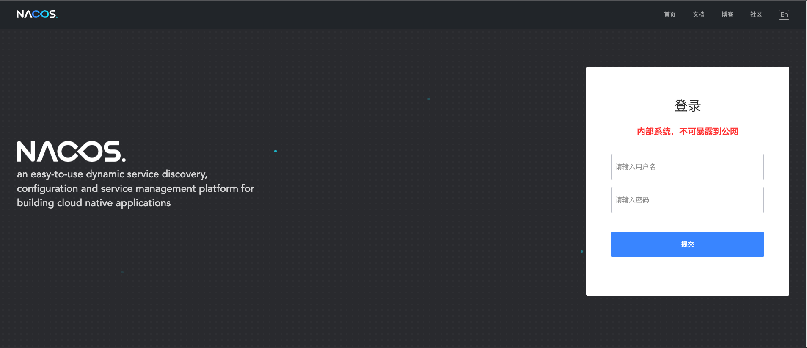

用户名密码：nacos/nacos


### Nacos Docker快速开始

```sh
git clone https://github.com/nacos-group/nacos-docker.git
docker-compose -f example/standalone-derby.yaml up
```


官网给我们提供的文档：https://spring.io/projects/spring-cloud-alibaba#learn

### nacos-client-provider

创建聚合项目

父pom

```xml
<?xml version="1.0" encoding="UTF-8"?>
<project xmlns="http://maven.apache.org/POM/4.0.0" xmlns:xsi="http://www.w3.org/2001/XMLSchema-instance"
         xsi:schemaLocation="http://maven.apache.org/POM/4.0.0 https://maven.apache.org/xsd/maven-4.0.0.xsd">
    <modelVersion>4.0.0</modelVersion>
    <groupId>com.nyq</groupId>
    <artifactId>SpringCloudAlibaba</artifactId>
    <version>0.0.1-SNAPSHOT</version>
    <name>SpringCloudAlibaba</name>
    <description>SpringCloudAlibaba</description>

    <properties>
        <java.version>1.8</java.version>
        <project.build.sourceEncoding>UTF-8</project.build.sourceEncoding>
        <project.reporting.outputEncoding>UTF-8</project.reporting.outputEncoding>
        <spring-boot.version>2.4.1</spring-boot.version>
    </properties>

    <dependencies>
        <dependency>
            <groupId>org.springframework.boot</groupId>
            <artifactId>spring-boot-starter-web</artifactId>
        </dependency>

        <dependency>
            <groupId>org.springframework.boot</groupId>
            <artifactId>spring-boot-starter-test</artifactId>
            <scope>test</scope>
        </dependency>
    </dependencies>

    <dependencyManagement>
        <dependencies>
            <dependency>
                <groupId>org.springframework.boot</groupId>
                <artifactId>spring-boot-dependencies</artifactId>
                <version>${spring-boot.version}</version>
                <type>pom</type>
                <scope>import</scope>
            </dependency>
        </dependencies>
    </dependencyManagement>

    <build>
        <plugins>
            <plugin>
                <groupId>org.apache.maven.plugins</groupId>
                <artifactId>maven-compiler-plugin</artifactId>
                <version>3.8.1</version>
                <configuration>
                    <source>1.8</source>
                    <target>1.8</target>
                    <encoding>UTF-8</encoding>
                </configuration>
            </plugin>
            <plugin>
                <groupId>org.springframework.boot</groupId>
                <artifactId>spring-boot-maven-plugin</artifactId>
                <version>2.4.1</version>
                <configuration>
                    <mainClass>com.nyq.springcloudalibaba.SpringCloudAlibabaApplication</mainClass>
                </configuration>
                <executions>
                    <execution>
                        <id>repackage</id>
                        <goals>
                            <goal>repackage</goal>
                        </goals>
                    </execution>
                </executions>
            </plugin>
        </plugins>
    </build>


    <modules><module>nacos</module></modules>
</project>
```

子pom

```xml
<?xml version="1.0" encoding="UTF-8"?>
<project xmlns="http://maven.apache.org/POM/4.0.0" xmlns:xsi="http://www.w3.org/2001/XMLSchema-instance"
         xsi:schemaLocation="http://maven.apache.org/POM/4.0.0 https://maven.apache.org/xsd/maven-4.0.0.xsd">
    <modelVersion>4.0.0</modelVersion>
    <parent>
        <groupId>com.nyq</groupId>
        <artifactId>SpringCloudAlibaba</artifactId>
        <version>0.0.1-SNAPSHOT</version>
        <relativePath/> <!-- lookup parent from repository -->
    </parent>
    <groupId>com.nyq</groupId>G
    <artifactId>nacos</artifactId>
    <version>0.0.1-SNAPSHOT</version>
    <name>nacos</name>
    <description>nacos</description>

    <properties>
        <java.version>1.8</java.version>
        <project.build.sourceEncoding>UTF-8</project.build.sourceEncoding>
        <project.reporting.outputEncoding>UTF-8</project.reporting.outputEncoding>
        <spring-boot.version>2.3.7.RELEASE</spring-boot.version>
        <spring-cloud-alibaba.version>2.2.2.RELEASE</spring-cloud-alibaba.version>
    </properties>

    <dependencies>
        <dependency>
            <groupId>org.springframework.boot</groupId>
            <artifactId>spring-boot-starter</artifactId>
        </dependency>
        <dependency>
            <groupId>com.alibaba.cloud</groupId>
            <artifactId>spring-cloud-starter-alibaba-nacos-discovery</artifactId>
        </dependency>

        <dependency>
            <groupId>org.springframework.boot</groupId>
            <artifactId>spring-boot-starter-test</artifactId>
            <scope>test</scope>
            <exclusions>
                <exclusion>
                    <groupId>org.junit.vintage</groupId>
                    <artifactId>junit-vintage-engine</artifactId>
                </exclusion>
            </exclusions>
        </dependency>
    </dependencies>

    <dependencyManagement>
        <dependencies>
            <dependency>
                <groupId>org.springframework.boot</groupId>
                <artifactId>spring-boot-dependencies</artifactId>
                <version>${spring-boot.version}</version>
                <type>pom</type>
                <scope>import</scope>
            </dependency>
            <dependency>
                <groupId>com.alibaba.cloud</groupId>
                <artifactId>spring-cloud-alibaba-dependencies</artifactId>
                <version>${spring-cloud-alibaba.version}</version>
                <type>pom</type>
                <scope>import</scope>
            </dependency>
        </dependencies>
    </dependencyManagement>

    <build>
        <plugins>
            <plugin>
                <groupId>org.apache.maven.plugins</groupId>
                <artifactId>maven-compiler-plugin</artifactId>
                <version>3.8.1</version>
                <configuration>
                    <source>1.8</source>
                    <target>1.8</target>
                    <encoding>UTF-8</encoding>
                </configuration>
            </plugin>
            <plugin>
                <groupId>org.springframework.boot</groupId>
                <artifactId>spring-boot-maven-plugin</artifactId>
                <version>2.3.7.RELEASE</version>
                <configuration>
                    <mainClass>com.nyq.nacos.NacosApplication</mainClass>
                </configuration>
                <executions>
                    <execution>
                        <id>repackage</id>
                        <goals>
                            <goal>repackage</goal>
                        </goals>
                    </execution>
                </executions>
            </plugin>
        </plugins>
    </build>

</project>
```

启动类

```java
package com.nyq.nacos;

import org.springframework.boot.SpringApplication;
import org.springframework.boot.autoconfigure.SpringBootApplication;
import org.springframework.cloud.client.discovery.EnableDiscoveryClient;

@SpringBootApplication
@EnableDiscoveryClient//加此注解
public class NacosApplication {

    public static void main(String[] args) {
        SpringApplication.run(NacosApplication.class, args);
    }

}
```

yml

```yml
server:
  port: 9001
spring:
  application:
    name: nacos-provider
  cloud:
    discovery:
      server-addr: 127.0.0.1:8848

management:
  endpoint:
    web:
      exposure:
        include:'*'
```

业务类

```java
package com.nyq.nacos;

import org.springframework.beans.factory.annotation.Value;
import org.springframework.web.bind.annotation.GetMapping;
import org.springframework.web.bind.annotation.RestController;

@RestController
public class DemoController {
    @Value("${server.port}")
    private String serverPort;

    @GetMapping(value = "/nyq")
    public String getServerPort(){
        return "Hello Nacos Discovery"+serverPort;
    }
}
```


测试


## Nacos服务注册和负载均衡

### Nacos Consumer

pom

```xml
<?xml version="1.0" encoding="UTF-8"?>
<project xmlns="http://maven.apache.org/POM/4.0.0" xmlns:xsi="http://www.w3.org/2001/XMLSchema-instance"
         xsi:schemaLocation="http://maven.apache.org/POM/4.0.0 https://maven.apache.org/xsd/maven-4.0.0.xsd">
    <modelVersion>4.0.0</modelVersion>
    <parent>
        <groupId>com.nyq</groupId>
        <artifactId>SpringCloudAlibaba</artifactId>
        <version>0.0.1-SNAPSHOT</version>
        <relativePath/> <!-- lookup parent from repository -->
    </parent>
    <groupId>com.example</groupId>
    <artifactId>nacos-consumer-8083</artifactId>
    <version>0.0.1-SNAPSHOT</version>
    <name>nacos-consumer-8083</name>
    <description>nacos-consumer-8083</description>

    <properties>
        <java.version>1.8</java.version>
        <project.build.sourceEncoding>UTF-8</project.build.sourceEncoding>
        <project.reporting.outputEncoding>UTF-8</project.reporting.outputEncoding>
        <spring-boot.version>2.3.7.RELEASE</spring-boot.version>
        <spring-cloud-alibaba.version>2.2.2.RELEASE</spring-cloud-alibaba.version>
    </properties>

    <dependencies>
        <dependency>
            <groupId>org.springframework.boot</groupId>
            <artifactId>spring-boot-starter-web</artifactId>
        </dependency>
        <dependency>
            <groupId>com.alibaba.cloud</groupId>
            <artifactId>spring-cloud-starter-alibaba-nacos-discovery</artifactId>
        </dependency>

        <dependency>
            <groupId>org.springframework.boot</groupId>
            <artifactId>spring-boot-starter-test</artifactId>
            <scope>test</scope>
            <exclusions>
                <exclusion>
                    <groupId>org.junit.vintage</groupId>
                    <artifactId>junit-vintage-engine</artifactId>
                </exclusion>
            </exclusions>
        </dependency>
    </dependencies>

    <dependencyManagement>
        <dependencies>
            <dependency>
                <groupId>org.springframework.boot</groupId>
                <artifactId>spring-boot-dependencies</artifactId>
                <version>${spring-boot.version}</version>
                <type>pom</type>
                <scope>import</scope>
            </dependency>
            <dependency>
                <groupId>com.alibaba.cloud</groupId>
                <artifactId>spring-cloud-alibaba-dependencies</artifactId>
                <version>${spring-cloud-alibaba.version}</version>
                <type>pom</type>
                <scope>import</scope>
            </dependency>
        </dependencies>
    </dependencyManagement>

    <build>
        <plugins>
            <plugin>
                <groupId>org.apache.maven.plugins</groupId>
                <artifactId>maven-compiler-plugin</artifactId>
                <version>3.8.1</version>
                <configuration>
                    <source>1.8</source>
                    <target>1.8</target>
                    <encoding>UTF-8</encoding>
                </configuration>
            </plugin>
            <plugin>
                <groupId>org.springframework.boot</groupId>
                <artifactId>spring-boot-maven-plugin</artifactId>
                <version>2.3.7.RELEASE</version>
                <configuration>
                    <mainClass>com.example.nacosconsumer8083.NacosConsumer8083Application</mainClass>
                </configuration>
                <executions>
                    <execution>
                        <id>repackage</id>
                        <goals>
                            <goal>repackage</goal>
                        </goals>
                    </execution>
                </executions>
            </plugin>
        </plugins>
    </build>

</project>
```

yml

```yml
server:
  port: 8083
spring:
  application:
    name: nacos-consumer
  cloud:
    discovery:
      server-addr: localhost:8848
```

启动类

```java
package com.example.nacosconsumer8083;

import org.springframework.boot.SpringApplication;
import org.springframework.boot.autoconfigure.SpringBootApplication;
import org.springframework.cloud.client.discovery.EnableDiscoveryClient;

@EnableDiscoveryClient
@SpringBootApplication
public class NacosConsumer8083Application {

    public static void main(String[] args) {
        SpringApplication.run(NacosConsumer8083Application.class, args);
    }

}
```


### 远程服务调用Ribbon

#### 什么是Ribbon

​	它是一个基于HTTP和TCP**客户端**负载均衡器。它虽然只是一个工具类库，它却是**每一个微服务**的基础设施。因为实际上，对于服务间调用、API网关请求转发都需要经过Ribbon负载均衡来实现。总体来说，Ribbon的主要作用是：从注册服务器端拿到对应服务列表后以负载均衡的方式访问对应服务。

​	何时使用Ribbon呢？一般情况下当一个模块需要从另外一个模块获取数据时候就需要使用Ribbon的远程访问功能了。

​	要注意的是Nacos已经整合了Ribbon，所以我们想要使用只需要导入Spring Cloud Alibaba Nacos的依赖就可以直接使用了。


#### 具体使用

RestTemplate封装了Ribbon调用的过程，其中getForObject是最常用方法，同时还要在服务消费者中配置RestTemplate：

```java
@Bean
@LoadBalanced
public RestTemplate restTemplate(){
    return new RestTemplate();
}

restTemplate.getForObject(arg1,arg2,arg3...);
```

**第一个参数url表示被调用的目标Rest接口位置**

		1. url的第一部分是在Nacos中注册的服务提供者名称，如果多个服务提供者注册相同名称，Ribbon会自动寻找其中一个服务提供者，并且调用接口方法。这个就是负载均衡功能。
		2. url后半部是控制器的请求路径。

**第二个参数是返回值类型**

1. JavaBean类型或者JavaBean数组类型，如果控制器返回的是List集合，需要使用数组类型接收。

**第三个参数是可变参数**

1. 是传递给url的动态参数，使用参数时候需要在url上需要使用{1}、{2}、{3}进行参数占位，这样传递的参数就会自动替换占位符。

---

启动9002consumer


修改yml中端口号为9002


消费者中加上

```yml
# 消费者将要去访问的微服务名称（注册成功的Nacos的微服务提供者）
# nacos-provider是provider注册的名字
# spring:
#  application:
#   name: nacos-provider
service-url:
  nacos-user-service: http://nacos-provider 
```

```java
package com.example.nacosconsumer8083;

import org.springframework.boot.SpringApplication;
import org.springframework.boot.autoconfigure.SpringBootApplication;
import org.springframework.cloud.client.discovery.EnableDiscoveryClient;
import org.springframework.cloud.client.loadbalancer.LoadBalanced;
import org.springframework.context.annotation.Bean;
import org.springframework.web.client.RestTemplate;

@EnableDiscoveryClient
@SpringBootApplication
public class NacosConsumer8083Application {

    public static void main(String[] args) {
        SpringApplication.run(NacosConsumer8083Application.class, args);
    }

    // 	因为我们要是使用Ribbon，所以我们还需要在启动类上配置restTemplate
    @Bean
    @LoadBalanced
    public RestTemplate restTemplate(){
        return new RestTemplate();
    }

}
```

消费者controller

```java
package com.example.nacosconsumer8083;

import org.springframework.beans.factory.annotation.Value;
import org.springframework.web.bind.annotation.GetMapping;
import org.springframework.web.bind.annotation.RestController;
import org.springframework.web.client.RestTemplate;

import javax.annotation.Resource;

@RestController
public class DemoController {

    @Resource
    private RestTemplate restTemplate;

    /**
     * 消费者去访问具体服务，这种写法可以实现
     * 配置文件和代码的分离
     */
    @Value("${service-url.nacos-user-service}")
    private String serverURL;


    @GetMapping(value = "consumer/nacos")
    public String getDiscovery(){
        System.err.println(serverURL);
        return restTemplate.getForObject(serverURL+"/nyq",String.class);
    }
}
```

测试结果：

```java
访问：http://localhost:8083/consumer/nacos

结果：Hello Nacos Discovery9001/9002(负载均衡切换显示)
```

总结：因为Nacos中本身就集成了Ribbon所以它本身就自带负载均衡

## Nacos服务注册中心对比提升

## 各种服务注册中心对比

| 服务注册与发现框架 | CAP模型 | 控制台管理 | 社区活跃度      |
| ------------------ | ------- | ---------- | --------------- |
| Eureka             | AP      | 支持       | 低(2.x版本闭源) |
| Zookeeper          | CP      | 不支持     | 中              |
| Consul             | CP      | 支持       | 高              |
| Nacos              | AP/CP   | 支持       | 高              |

### CAP模型

​	计算机专家 埃里克·布鲁尔（Eric Brewer）于 2000 年在 ACM 分布式计算机原理专题讨论会（简称：PODC）中提出的分布式系统设计要考虑的三个核心要素：

​		一致性（Consistency）：同一时刻的同一请求的实例返回的结果相同，所有的数据要求具有强一致性(Strong Consistency)

​		可用性（Availability）：所有实例的读写请求在一定时间内可以得到正确的响应

​		分区容错性（Partition tolerance）：在网络异常（光缆断裂、设备故障、宕机）的情况下，系统仍能提供正常的服务

​	以上三个特点就是CAP原则（又称CAP定理），但是三个特性不可能同时满足，所以分布式系统设计要考虑的是在满足P（分区容错性）的前提下选择C（一致性）还是A（可用性），即：CP或AP


### CP原则：一致性 + 分区容错性原则

​	CP 原则属于强一致性原则，要求所有节点可以查询的数据随时都要保持一直（同步中的数据不可查询），即：若干个节点形成一个逻辑的共享区域，某一个节点更新的数据都会立即同步到其他数据节点之中，当数据同步完成后才能返回成功的结果，但是在实际的运行过程中网络故障在所难免，如果此时若干个服务节点之间无法通讯时就会出现错误，从而牺牲了以可用性原则（A），例如关系型数据库中的事务。


### AP原则：可用性原则 + 分区容错性原则

​	AP原则属于弱一致性原则，在集群中只要有存活的节点那么所发送来的所有请求都可以得到正确的响应，在进行数据同步处理操作中即便某些节点没有成功的实现数据同步也返回成功，这样就牺牲一致性原则（C 原则）。

​	使用场景：对于数据的同步一定会发出指令，但是最终的节点是否真的实现了同步，并不保证，可是却可以及时的得到数据更新成功的响应，可以应用在网络环境不是很好的场景中。

​	

## Nacos支持CP和AP

​	Nacos无缝支持一些主流的开源生态，同时再阿里进行Nacos设计的时候重复的考虑到了市场化的运作（市面上大多都是以单一的实现形式为主，例如：Zookeeper使用的是 CP、而 Eureka采用的是AP），在Nacos中提供了两种模式的动态切换。

​	


## Nacos 何时选择切换模式

	1. 一般来说，如果不需要储存服务界别的信息且服务实例通过nacos-client注册，并能够保持心跳上报，那么就可以选择AP模式。如Spring Cloud 和 Dubbo，都适用于AP模式，AP模式为了服务的可用性减弱了一致性，因此AP模式下只支持注册临时实例。
	2. 如果需要在服务级别编辑或者储存配置信息，那么CP是必须的，K8S服务和DNS服务则是用于CP模式。CP模式下则支持注册持久化实例，此时则是以Raft协议为集群运行模式，该模式下注册实例之前必须先注册服务，如果服务不存在，则会返回错误。

3. 切换命令（默认是AP）：

```java
curl -X PUT '$NACOS_SERVER:8848/nacos/v1/ns/operator/switches?entry=serverMode&value=CP'
```


注意：**临时和持久化的区别主要在健康检查失败后的表现，持久化实例健康检查失败后会被标记成不健康，而临时实例会直接从列表中被删除**。

## Nacos之服务配置中心

Nacos不仅仅可以作为注册中心来使用，同时它支持作为配置中心


### 新建模块cloudalibaba-config

```xml
<dependency> 
    <groupId> com.alibaba.cloud </groupId> 
    <artifactId> spring-cloud-starter-alibaba-nacos-config </artifactId> 
</dependency>
```

### **YML配置**

​	要注意的是这里我们要配置两个，因为Nacos同SpringCloud-config一样，在项目初始化时，要保证先从配置中心进行配置拉取，拉取配置之后，才能保证项目的正常启动。

​	springboot中配置文件的加载是存在优先级顺序的，bootstrap优先级高于application

​	分别要配置的是，这里bootstrap.yml配置好了以后，作用是两个，第一个让3377这个服务注册到Nacos中，第二个作用就是去Nacos中去读取指定后缀为yaml的配置文件：

bootstrap.yml

```yml
# nacos配置
server:
  port: 3377

spring:
  application:
    name: nacos-config-client
  cloud:
    nacos:
      discovery:
        server-addr: localhost:8848 #Nacos服务注册中心地址
      config:
        server-addr: localhost:8848 #Nacos作为配置中心地址
        file-extension: yaml #指定yaml格式的配置
```

application.yml

```yml
spring:
  profiles:
    active: dev # 表示开发环境
```

### 主启动

```java
package com.example.cloudalibabaconfig;

import org.springframework.boot.SpringApplication;
import org.springframework.boot.autoconfigure.SpringBootApplication;
import org.springframework.cloud.client.discovery.EnableDiscoveryClient;

@SpringBootApplication
@EnableDiscoveryClient
public class CloudalibabaConfigApplication {

    public static void main(String[] args) {
        SpringApplication.run(CloudalibabaConfigApplication.class, args);
    }

}

```


### 业务类

​	这里的@RefreshScope实现配置自动更新，意思为如果想要使配置文件中的配置修改后不用重启项目即生效，可以使用@RefreshScope配置来实现

```java
package com.mashibing.cloudalibabaconfig3377.controller;

import org.springframework.beans.factory.annotation.Value;
import org.springframework.cloud.context.config.annotation.RefreshScope;
import org.springframework.web.bind.annotation.RestController;

@RestController
@RefreshScope //支持Nacos的动态刷新功能
public class ConfigClientController {

    @Value("${config.info}")
    private String configInfo;

    @Value("${/config/info}")
    public String getConfigInfo(){
        return configInfo;
    }

}
```

### Nacos配置规则


在 Nacos Spring Cloud 中，`dataId` 的完整格式如下（详情可以参考官网 https://nacos.io/zh-cn/docs/quick-start-spring-cloud.html）：

```java
${prefix}-${spring.profiles.active}.${file-extension}
```

	1. `prefix` 默认为 `spring.application.name` 的值，也可以通过配置项 `spring.cloud.nacos.config.prefix`来配置。
	2. `spring.profiles.active` 即为当前环境对应的 profile，注意：**当 `spring.profiles.active` 为空时，对应的连接符 `-` 也将不存在，dataId 的拼接格式变成 `${prefix}.${file-extension}`**（不能删除）
	3. `file-exetension` 为配置内容的数据格式，可以通过配置项 `spring.cloud.nacos.config.file-extension` 来配置。目前只支持 `properties` 和 `yaml` 类型。
	4. 通过 Spring Cloud 原生注解 `@RefreshScope` 实现配置自动更新：
	5. 所以根据官方给出的规则我们最终需要在Nacos配置中心添加的配置文件的名字规则和名字为：

```java
# ${spring.application.name}-${spring.profiles.active}.${file-extension}
# nacos-config-client-dev.yaml
# 微服务名称-当前环境-文件格式
```


## Nacos平台创建配置操作

增加配置


```java
config: 
    info: nacos config center,version = 1
```

然后在配置中心就会看到刚刚发布的配置


## 自动配置更新

修改Nacos配置，不需要重启项目即可自动刷新


修改版本号为2，点击发布


## 测试

 启动服务访问服务来测试（没有修改之前是1，修改之后不需要重启项目既可以直接获取最新配置）：http://localhost:3377/config/info


## Nacos命名空间分组和DataID三者关系

## 名词解释

**命名空间**（Namespace）

​	用于进行租户粒度的配置隔离。不同的命名空间下，可以存在相同的 Group 或 Data ID 的配置。Namespace 的常用场景之一是不同环境的配置的区分隔离，例如开发测试环境和生产环境的资源（如配置、服务）隔离等。

**配置分组**（Group）

​	Nacos 中的一组配置集，是组织配置的维度之一。通过一个有意义的字符串（如 Buy 或 Trade ）对配置集进行分组，从而区分 Data ID 相同的配置集。当您在 Nacos 上创建一个配置时，如果未填写配置分组的名称，则配置分组的名称默认采用 DEFAULT_GROUP 。配置分组的常见场景：不同的应用或组件使用了相同的配置类型，如 database_url 配置和 MQ_topic 配置。

**配置集 ID**（Data ID）

​	Nacos 中的某个配置集的 ID。配置集 ID 是组织划分配置的维度之一。Data ID 通常用于组织划分系统的配置集。一个系统或者应用可以包含多个配置集，每个配置集都可以被一个有意义的名称标识。Data ID 通常采用类 Java 包（如 com.taobao.tc.refund.log.level）的命名规则保证全局唯一性。此命名规则非强制。

​	配置集：一组相关或者不相关的配置项的集合称为配置集。在系统中，一个配置文件通常就是一个配置集，包含了系统各个方面的配置。例如，一个配置集可能包含了数据源、线程池、日志级别等配置项。


### 三者关系

​	这三者的关系类似于Java里面的package名和类名，最外层的Namespace是可以用于区分部署环境的，Group和DataID逻辑上区分两个目标对象。


**默认情况**

Namespace=public，Group=DEFAULT_GROUP，默认Cluster是DEFAULT


**具体情况**

​	Nacos默认的命名空间是public，我们就可以利用Namespace来实现隔离，比如我们现在有三个环境：开发、测试、生产环境，我们就可以创建三个Namespace，不同的N amespace之间是隔离的。

​	Group本身就是分组的意思，它可以把不同的微服务划分到同一个分组里面去。

​	剩下的就是具体微服务，一个Service可以包含多个Cluster，Nacos默认Cluster是DEFAULT，Cluster是对指定微服务的一个虚拟划分。比如说，将一个Service部署在北京和和杭州的机房中，北京机房的Service就可以起名为（BJ），杭州机房中的Service就可以起名为（HZ），这样就可以尽量让同一个机房的微服务互相调用，提升性能。


## 切换不同环境

### DataID方案

1. 指定spring.profile.active和配置文件的DataID来使不同环境下读取不同的配置，配置规则：默认空间+新建dev和test两个DataId：

   1. 新建dev配置DataID（已经创建完成）
   2. 新建test配置DataID

   

2. 通过spring.profile.active属性就能进行多环境下配置文件的读取

   

   

   ```java
   spring:
     profiles:
       # active: dev #表示开发环境
       active: test #表示测试环境
   ```

   

3. 测试

   最后再次访问：http://localhost:3377/localhost/config/info

   

   

### Group方案

​	根据之前的讲解我们都知道Group为分组默认是：DEFAULT_GROUP，所以现在我们就需要分出两组，一组是“Dev开发组”，一组是“test测试组”

 1. 新建Group

    DEV_GROUP


​		TEST_GROUP

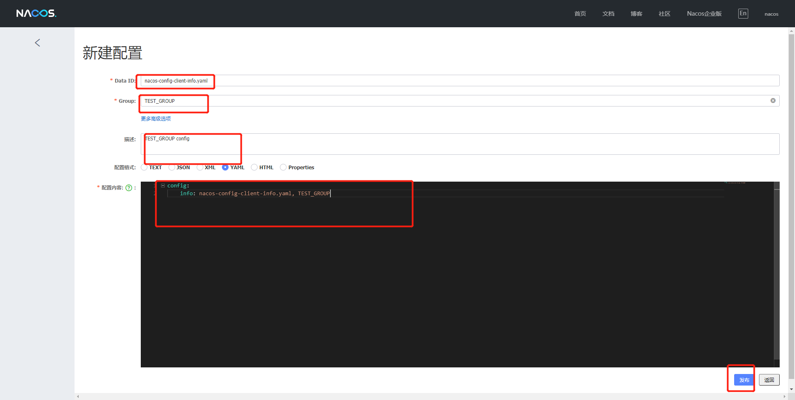

配置列表，两个DataID一致，但是分组不同的配置文件：


2. 完成以上配置以后，接下来就需要通过bootstrap+application来配合完成，具体方式：在config下增加一条Group的配置即可，可以配置为DEV_GROUP或TEST_GROUP

​	bootstrap:

```yml
# nacos配置
server:
  port: 3377

spring:
  application:
    name: nacos-config-client
  cloud:
    nacos:
      discovery:
        server-addr: localhost:8848 #Nacos服务注册中心地址
      config:
        server-addr: localhost:8848 #Nacos作为配置中心地址
        file-extension: yaml #指定yaml格式的配置
        group: TEST_GROUP #增加分组

```

​	application:

```java
spring:
  profiles:
    # active: dev #表示开发环境
    # active: test #表示测试环境
    active: info
```


3. 测试（可以测试不同分组）：

   最后再次访问：http://localhost:3377/localhost/config/info


### Namespace空间方案

​	我们已经把DataID方案和Group方案完成了，然后接下来我们来看一下Namespace（命名空间）方案，默认此方案为public，此方案不能删除，我们现在来新建两个命名空间方案


1. 新建dev/test的Namespace

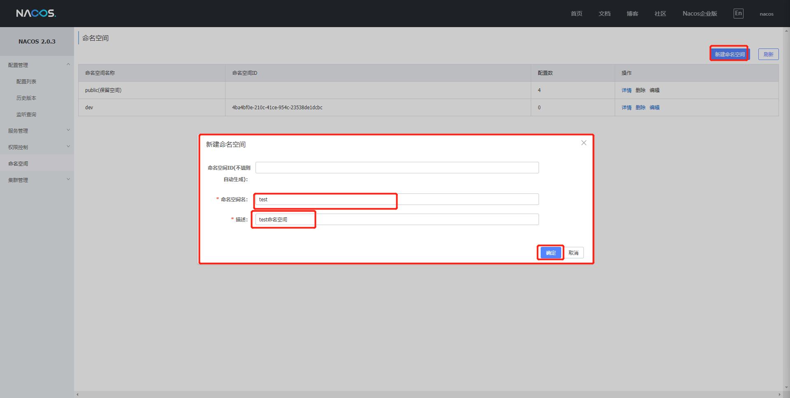


1. 服务管理-服务列表页面查看

   此时我们就可以切换对应的命名空间，然后再通过Group和DataID来进行切换，如果想要切换命名空间，我们就需要通过命名空间ID来进行切换

   

2. 按照域名配置（Namespace+Group+DataId）编写

   ​	先通过namespace命名空间ID来确认使用的命名空间

   

   ```javayml
   # nacos配置
   server:
     port: 3377
   
   spring:
     application:
       name: nacos-config-client
     cloud:
       nacos:
         discovery:
           server-addr: localhost:8848 #Nacos服务注册中心地址
         config:
           server-addr: localhost:8848 #Nacos作为配置中心地址
           file-extension: yaml #指定yaml格式的配置
           group: TEST_GROUP # 指定分组
           namespace: 4ba4bf0e-210c-41ce-954c-23538de1dcbc #指定命名空间
   ```

   ```java
   spring:
     profiles:
       active: dev #表示开发环境
       # active: test #表示测试环境
       # active: info
   ```

   ​	

   然后再回到Nacos配置列表，添加Dev命名空间下的配置，添加3条

   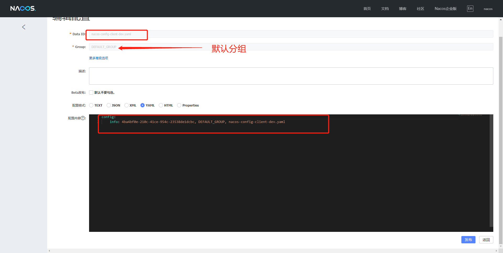

   

   

3. 测试：访问http://localhost:3377/localhost/config/info来进行测试

## Nacos集群架构说明

​	到目前为止，我们已经对Nacos的一些基本使用和配置已经掌握，但是这些还不够，我们还需要了解一个非常重要的点，就是Nacos的集群相关的操作，那我们就先从Nacos集群配置的概念说起

## Nacos支持三种部署模式

1. 单机模式 - 用于测试和单机试用
2. 集群模式 - 用于生产环境，确保高可用
3. 多集群模式 - 用于多数据中心场景

## 集群部署说明

参考网站：https://nacos.io/zh-cn/docs/cluster-mode-quick-start.html

**架构图**：部署生产使用的集群模式


**具体拆分**


## 预备环境

​	默认Nacos使用嵌入式数据库实现数据的存储，所以，如果启动多个默认配置下的Nacos节点，数据储存存在一致性问题，为了解决这个问题，Nacos采用了集中存储方式来支持集群化部署，目前仅支持MySql的存储。

1. 推荐使用Linux
2. 可以使用内部数据源或者外部数据源（推荐使用外部）MySql

## Nacos持久化切换配置

​	Nacos默认自带嵌入式数据库derby，所以我们每次创建一个Nacos实例就会有一个derby，当有多个Nacos节点的时候，就会出现一致性问题，所以Nacos支持了外部数据库统一数据管理MySql。

## Nacos默认derby切换MySql

具体配置方式可以参考官网：https://nacos.io/zh-cn/docs/deployment.html

1. 我们需要找到Nacos安装目录下的conf目录中的Sql脚本，然后在数据库中进行执行

   注意：需要我们先创建好数据库并且使用：

/nacos/conf目录下

nacos-mysql.sql 执行到本地数据库

2. 修改conf/application.properties文件，增加支持mysql数据源配置（目前只支持mysql），添加mysql数据源的url、用户名和密码。

```java
spring.datasource.platform=mysql

db.num=1
db.url.0=jdbc:mysql://127.0.0.1:3306/nacos_config?characterEncoding=utf8&connectTimeout=1000&socketTimeout=3000&autoReconnect=true&serverTimezone=UTC
db.user=root
db.password=root
```

​	这里表示更改Nacos数据库为本机MySql数据库

**注意：**这里需要注意几个点，一个是url地址需要改，另外数据库的用户和密码也需要更改，同时还有一个是官网上在**db.url.0=jdbc:mysql**这个属性上少了一个属性为**serverTimezone=UTC**需要我们手动添加

## 测试

重启Nacos服务，此时之前所创建的Namespace+Group+DataID将全部消失，因为这些数据是保存在之前Nacos内嵌的derby数据库中，现在使用的是本地的MySql数据库，此时我们可以添加配置测试，在查看数据库nacos_config中的config_info表，此时就会有新添加的配置内容

## Nacos集群配置

 

## 更改Nacos启动命令配置原理

​	我们现在知道，想要启动Naocs只需要启动startup.sh命令即可，但是如果启动3个Nacos那？所以如果我们需要启动多个Nacos，就需要自行修改startup命令。


## 具体配置


### Linux服务器上MySql数据库配置

1. 在Linux系统上执行SQL脚本，具体位置在nacos目录下的conf中，这里的操作和之前是一样的，我们可以直接打开这个文件然后拷贝到数据库中执行，当然也是要创建数据库使用数据库然后在复制脚本内容，执行即可

```java
create database nacos_config;
use nacos_config;
```


2. 修改application.properties配置文件，但是修改之前我们最好做一个备份。

```java
cp application.properties application.properties.init
```

3. 这里的修改和我们之间的在win上的修改是完全一样的，所以我们只要打开这个文件，加上对应的内容即可

```java
spring.datasource.platform=mysql

db.num=1
db.url.0=jdbc:mysql://127.0.0.1:3306/nacos_config?characterEncoding=utf8&connectTimeout=1000&socketTimeout=3000&autoReconnect=true&serverTimezone=UTC
db.user=root
db.password=123456
```


### Linux服务器上Nacos的集群配置cluter.conf

1. 这里开始正式配置集群，首先我们要更改cluter.conf这个配置文件，当然我们也需要备份，但是这里它的原始名称为：cluster.conf.example，我们需要把它保留同时复制出一个cluster.conf来进行更改

```java
cp cluster.conf.example cluster.conf
```


2. 具体配置内容，这里我们在配置集群的时候不能直接写127.0.0.1这样，这样分不清楚，所以我们需要知道具体的IP地址，我们可以通过：

```java
ifconfig -a #查看具体ip	
```

	

具体需修改内容

```java
# 格式： ip地址:端口号
#
# Copyright 1999-2018 Alibaba Group Holding Ltd.
#
# Licensed under the Apache License, Version 2.0 (the "License");
# you may not use this file except in compliance with the License.
# You may obtain a copy of the License at
#
#      http://www.apache.org/licenses/LICENSE-2.0
#
# Unless required by applicable law or agreed to in writing, software
# distributed under the License is distributed on an "AS IS" BASIS,
# WITHOUT WARRANTIES OR CONDITIONS OF ANY KIND, either express or implied.
# See the License for the specific language governing permissions and
# limitations under the License.
#

#it is ip
#example
#192.168.16.101:8847
#192.168.16.102
#192.168.16.10
192.168.124.133:3333
192.168.124.133:4444
192.168.124.133:5555
```

### 编辑Nacos的启动脚本startup.sh

1. 编辑这个脚本的目的，是为了能够让我们在使用此命令启动的时候传入对应的端口号参数，这样携带着具体端口号参数的启动就能启动具体的Nacos节点了，此脚本的为止在/nacos/bin中


2. 核心点：传递不同的端口号启动不同的nacos实例，命令：./startup.sh -p 3333表示启动端口号为3333的nacos服务器实例，这里要和config保持一直。

3. 具体修改，依旧要备份：

```java
cp startup.sh starup.sh.bk
```


### Nginx配置

1. 我们需要找到Nginx的配置文件，然后做备份

```java
cd /usr/local/nginx
cp nginx.conf nginx.conf.bk
```

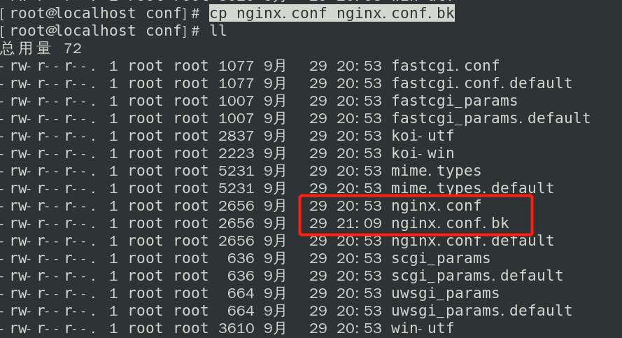

2. 修改nginx.conf


## 测试启动


### 启动Nacos

1. 这里注意，我们在启动之前必须要保证JDK环境变量配置好，同时保证以上配置没有问题，具体启动命令：

   ./stratup.sh -o 3333/4444/5555

```java
[root@localhost bin]# ./startup.sh -o 3333
[root@localhost bin]# ./startup.sh -o 4444
[root@localhost bin]# ./startup.sh -o 5555
```


2. 启动完成之后我们需要通过如下指令来测试Nacos集群是否正常启动，数量为3

```java
ps -ef|grep nacos|grep -v grep |wc -l
```


### 启动Nginx

1. 首先进入到Nginx目录下，启动Nginx，同时要带着我们设置过得配置文件启动

```java
cd /usr/local/nginx/sbin
./nginx -c /usr/local/nginx/conf/nginx.conf
```

2. 通过访问Nginx来测试是否能够访问到Nacos，在win系统浏览器网址上输入：

```java
192.168.124.133:1111/nacos
```


3. 使用账号密码nacos，nacos成功登录就表示此时已经完成全部配置


### 添加配置

1. 在Nacos平台上添加配置


2. 在数据库中检查是否有这一条配置，如果有表示成功添加


### 配置微服务为Linux版Nacos集群并注册进Nacos

1. 我们以9002为例，此时我们要修改application.yaml文件，把之前的Nacos端口换成Nacos集群

```java
server:
  port: 9002
spring:
  application:
    name: nacos-provider
  cloud:
    nacos:
      discovery:
        # server-addr: localhost:8848
        # 换成nginx的1111端口，做集群
        server-addr: http://192.168.124.133:1111


management:
  endpoint:
    web:
      exponsure:
        include: '*'

```

2. 配置完成启动服务，我们就可以在Naocs平台上看见对应的微服务了，此时表示服务注册成功


### 总结


# Sentinel

## 什么是Sentinel

1. **分布式系统的流量防卫兵**：随着微服务的普及，服务调用的稳定性变得越来越重要。[Sentinel](https://github.com/alibaba/Sentinel)以“流量”为切入点，在流量控制、断路、负载保护等多个领域开展工作，保障服务可靠性。

2. 特点：
   1. **+丰富的应用场景**：Sentinel 承接了阿里巴巴近 10 年的双十一大促流量的核心场景，例如秒杀（即突发流量控制在系统容量可以承受的范围）、消息削峰填谷、集群流量控制、实时熔断下游不可用应用等。
   2. **完备的实时监控**：Sentinel 同时提供实时的监控功能。您可以在控制台中看到接入应用的单台机器秒级数据，甚至 500 台以下规模的集群的汇总运行情况。
   3. **广泛的开源生态**：Sentinel 提供开箱即用的与其它开源框架/库的整合模块，例如与 Spring Cloud、Apache Dubbo、gRPC、Quarkus 的整合。您只需要引入相应的依赖并进行简单的配置即可快速地接入 Sentinel。同时 Sentinel 提供 Java/Go/C++ 等多语言的原生实现。
   4. **完善的 SPI 扩展机制**：Sentinel 提供简单易用、完善的 SPI 扩展接口。您可以通过实现扩展接口来快速地定制逻辑。例如定制规则管理、适配动态数据源等。
   
3. 官网文档：https://github.com/alibaba/Sentinel/wiki/%E4%BB%8B%E7%BB%8D


## Sentinel好处

​	分布式系统面临的问题：复杂的体系结构中的应用程序有数十个依赖关系，每个依赖关系在某些时候将不可避免的失败，比如如下的例子中，当我们调用A、E、F、J、K这几个服务的时候如果其中一个服务出现问题会造成什么问题？其实就会出现整体系统效率全部下降，而且严重就会出现**服务雪崩**的问题！


​	**服务雪崩：**

​		多个微服务之间调用的时候，假设A调用B和C，B和C又调用其他的微服务，这就是所谓的**扇出**。如果扇出的某个链路上某个微服务调用的响应时间过程或者不可用，微服务A的调用就用占用越来越多的系统资源，从而引起系统崩溃，这也就是**服务雪崩**。其实就是服务的**高可用**遭到了破坏。

​		对于高流量的应用来说，单一的后端依赖可能会导致服务器上的所有资源都在几秒钟内饱和。同时还有可能造成这些应用程序导致服务之间的延迟增加，备份列队，线程和其他的系统资源紧张，导致整个系统发生更多的级联故障。这些都表示需要对故障和延迟进行隔离和管理，以便单个依赖关系失败，不能取消整个应用程序或系统，所以通常发生了一个模块的某个实例失败后，这时候这个模块依然还会接受流量，然后这个有问题的模块还调用其他的模块，这样就会发生级联故障，或者叫做**雪崩**。

​		要解决这种问题的出现我们就需要用到服务降级，而Sentinel就可以保证在一个依赖出现问题的情况下，不会导致整体服务失败，避免级联故障，提高分布式系统的弹性。

​	**Sentinel的熔断降级通过断路器实现：**

​		断路器：它本身是一种开关装置，当某个服务单元发生故障之后，通过断路器的故障监控（类似于熔断保险丝），向调用方返回一个符合预期的、可处理的备选响应（FallBack），而不是长时间的等待或者抛出调用方法无法出的异常，这样就保证了服务调用方的不会被长时间、不必要的占用，从而避免了故障在分布式系统中蔓延（类似于病毒传染），从而避免了故障在系统中蔓延，乃至崩溃。

​	**好处体现：**

​	对比与其他的产品而言，比如说Hystrix，他不需要我们自己手动搭建监控平台，而且它有一套类似于Nacos的Web界面，可以让我们进行更加细粒度的配置流控、速率、服务熔断、服务降级等

​	目前主流编程都是 约定>配置>代码，虽然我们的配置都可以写在代码中，但是我们还是要大面积的学习配置和注解的方式，尽量少些代码，这也是Sentinel的理念和初衷。

 


## Sentinel下载和安装

​	下载地址：https://github.com/alibaba/Sentinel/releases


官方提供的手册：https://spring-cloud-alibaba-group.github.io/github-pages/hoxton/en-us/index.html#_spring_cloud_alibaba_sentinel

**启动步骤**

- 前提：jdk1.8环境和8080端口不能被占用
- 启动命令：java -jar sentinel-dashboard-1.8.2.jar
- 访问地址：localhost:8080
- 输入默认账号密码：sentinel/sentinel

## Sentinel初始化监控


## Sentinel初始化工程演示

​	我们现在通过一个案例来让大家了解Sentinel的初始化演示，现在我们需要做几件事：

1. 启动Nacos8848成功
2. 创建新的Module：cloudalibaba-sentinel-service8401
3. 启动Sentinel8080
4. 启动微服务8401
5. 启动8401微服务后查看Sentinel控制台


## 搭建Sentinel项目

1. Sentinel的官方文档网址：https://sentinelguard.io/zh-cn/docs/quick-start.html
2. 创建项目cloudalibaba-sentinel-service8401
3. 导入依赖：

```java
<!-- Nacos客户端依赖 -->
<dependency>
    <groupId>com.alibaba.cloud</groupId>
    <artifactId>spring-cloud-starter-alibaba-nacos-discovery</artifactId>
</dependency>
<!-- sentinel依赖 -->
<dependency>
    <groupId>com.alibaba.cloud</groupId>
    <artifactId>spring-cloud-starter-alibaba-sentinel</artifactId>
</dependency>
```

4. 配置yaml文件，目的是让当前8401注册进Nacos，然后被Sentinel8080进行监控

```java
server:
  port: 8401

spring:
  application:
    name: cloudalibaba-sentinel-service
  cloud:
    nacos:
      discovery:
        server-addr: localhost:8848
    sentinel:
      transport:
        # 配置Sentinel dashboard地址
        dashboard: localhost:8080
        # 默认8719端口，键入被占用会自动从8719+1，直到找到未被占用的端口
        port: 8719

management:
  endpoints:
    web:
      exposure:
        include: '*'
```

5. 编写FlowLimitController

```java
package com.example.cloudalibabasentinel8401.controller;

import org.springframework.web.bind.annotation.GetMapping;
import org.springframework.web.bind.annotation.RestController;

@RestController
public class FlowLimitController {
    @GetMapping("/testA")
    public String testA(){
        return "-----testA";
    }

    @GetMapping("/testB")
    public String testB(){
        return "-----testB";
    }
}
```


## 测试

1. 当以上的这些配置配置好以后，我们就可以进行测试了，那我们的测试方式就是，首先保证Nacos和Sentinel都是启动状态，然后再来启动项目，按照我们的理解这个时候，就应该在Sentinel的dashboard上能体现出它监控的服务，但是此时并没有，原因是因为Sentinel本身采用的是懒加载机制，所以我们需要首先访问服务对应的接口，Sentinel才能工作。

```java
http://localhost:8401/testA
http://localhost:8401/testB
```

2. 访问之后我们来查看Sentinel的dashboard


3. 那么这个时候我们频繁快速的访问testA或者testB那么我们再来查看实时监控的时候，就会出现波动，体现此时Sentinel正在监控这我们的8401这个服务


## Sentinel流控规则

### 流控规则基本介绍


### 名词解释

- 资源名：唯一名称，默认请求路径
- 针对来源：Sentinel可以针对调用者进行限流，填写微服务名，默认default（不区分来源）
- 阈值类型/单机阈值：
  - QPS（每秒钟的请求数量）：当调用该API的QPS达到阈值的时候，进行限流
  - 线程数：当调用该API的线程数量达到阈值的时候，进行限流
- 是否集群：当前不需要集群
- 流控模式：
  - 直接：API达到限流条件时，直接限流
  - 关联：当关联的资源达到阈值时，就限流自己
  - 链路：只记录指定链路上的流量（指定资源从入口资源进来的流量，如果达到阈值，就进行限流）(API级别的针对来源)
- 流控效果：
  - 快速失败：直接失败，抛异常
  - Wam Up：根据codeFactor（冷加载因子，默认3）的值，从阈值/codeFacotor，经过预热时长，才达到设置的QPS阈值
  - 排队等待：匀速排队，让请求以匀速的速度通过，**阈值类型必须设置为QPS**，否则无效


### 具体操作

### 新增流控

**QPS直接失败案例**

1. 添加有两种方式，可以直接在流控规则选项中添加，也可以在簇点链路中添加，一般会采取第二种方式


2. 现在我们给"/testA"添加流控。


3. 这里的意思就是我们现在单机阈值设定为1，代表的是当前这个接口只能被1秒访问一次，超过这个阈值，就会被Sentinel阻塞，现在默认为直接失败，也就是会在前台有一个体现


**线程数直接失败案例**

1. 刚才我们可以的设置是通过QPS（每秒钟请求的数量）来设置的限流规则，但是我们这里其实还有一个线程数，是什么意思那？

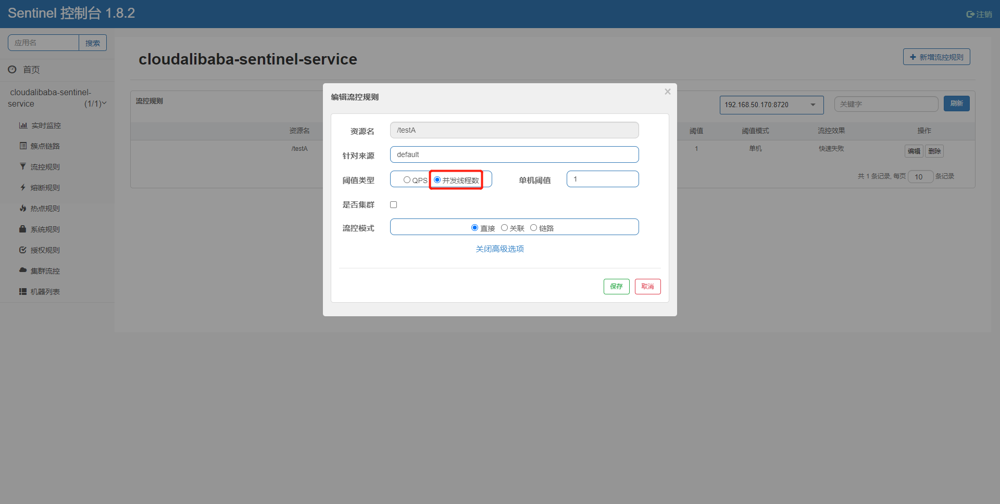

2. QPS和并发线程数规则详解


3. 那我们要演示这种效果，我们就需要让一个线程再进来办理的时候需要0.8秒，但是这个时候后面的线程也在疯狂的访问，所以后面的线程就会不会生效。

```java
package com.example.cloudalibabasentinel8401.controller;

import com.alibaba.csp.sentinel.annotation.SentinelResource;
import org.springframework.web.bind.annotation.GetMapping;
import org.springframework.web.bind.annotation.RestController;

import java.util.concurrent.TimeUnit;

@RestController
public class FlowLimitController {
    @GetMapping("/testA")
    public String testA(){
        //暂停0.8秒
        try {
            TimeUnit.MILLISECONDS.sleep(800);
        } catch (InterruptedException e) {
            e.printStackTrace();
        }
        return "-----testA";
    }

    @GetMapping("/testB")
    public String testB(){
        return "-----testB";
    }
}
```

4. 这个时候我们重启项目，然后重新通过访问testA接口，通过两个网页（线程）来快速访问，这个时候我们来看效果，这里要注意，要重新添加流控规则。


**注意：这个时候虽然效果一致，但是是两种完全不同的规则，一种是QPS（每秒进行限制），一种是并发线程(如果前面的还没有处理完就被限流)，这点大家一定要分清！**

## 流控规则-关联

​	首先我们先来回顾一下之前讲过的一些概念

### 名词解释

- 资源名：唯一名称，默认请求路径
- 针对来源：Sentinel可以针对调用者进行限流，填写微服务名，默认default（不区分来源）
- 阈值类型/单机阈值：
  - QPS（每秒钟的请求数量）：当调用该API的QPS达到阈值的时候，进行限流
  - 线程数：当调用该API的线程数量达到阈值的时候，进行限流
- 是否集群：当前不需要集群
- 流控模式：
  - 直接：API达到限流条件时，直接限流
  - 关联：当关联的资源达到阈值时，就限流自己
  - 链路：只记录指定链路上的流量（指定资源从入口资源进来的流量，如果达到阈值，就进行限流）(API级别的针对来源)
- 流控效果：
  - 快速失败：直接失败，抛异常
  - Wam Up：根据codeFactor（冷加载因子，默认3）的值，从阈值/codeFacotor，经过预热时长，才达到设置的QPS阈值
  - 排队等待：匀速排队，让请求以匀速的速度通过，阈值类型必须设置为QPS，否则无效


### 关联

​	官方解释：当关联的资源达到阈值时，就限流自己。

​	通俗解释来说，比如那我们的程序，现在有**testA**接口和**testB**接口，当A关联的资源B达到阈值后，就限流自己，也就是B到达阈值，限流A本身。就好像我家孩子在外面打架，我来处理一样。换到程序里面来说比如一个电商系统中，支付系统达到阈值，就限流下订单系统。


#### 具体演示

​	当关联资源**/testB**的qps阈值超时1时，就限流**/testA**的Rest访问地址，当关联资源到阈值后限制配置好的资源名，首先我们先把FlowLimitController接口恢复原样

```java
@RestController
public class FlowLimitController {
    @GetMapping("/testA")
    public String testA(){
        return "-----testA";
    }

    @GetMapping("/testB")
    public String testB(){
        return "-----testB";
    }
}
```

​	给testA添加流控规则


​	为了演示效果，所以这里我们需要借助一个工具Postman，来模仿并发密集访问/testB，先来测试访问testB接口


​	这个时候我们需要多次密集访问TestB接口，所以我们需要添加配置，具体操作如下：


把数值修改为：

- Iterations：为20
- Delay：300

意思就是20个线程每间隔0.3秒访问一次，然后跑起来

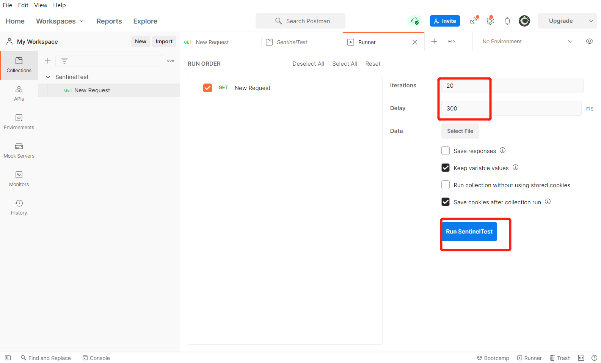

​		这个时候我们来看网页中testA接口的效果


## 流控规则-链路

​	链路流控模式指的是，当从某个接口过来的资源达到限流条件时，开启限流，它的功能有点类似于针对来源配置项，区别在于：针对来源是针对上级微服务，而链路流控是针对上级接口，也就是说它的粒度更细。

​	比如在一个微服务中，两个接口都调用了同一个Service中的方法，并且该方法用SentinelResource（用于定义资源）注解标注了，然后对该注解标注的资源（方法）进行配置，则可以选择链路模式。

​	

### 具体演示

首先我们编写一个Service

```java
//service.TestService
@Service
public class TestService {
    // 定义限流资源
    @SentinelResource("common")
    public String common(){
        return "common";
    }
}
```

然后更改接口调用这个Service方法

```java
@RestController
public class FlowLimitController {
    @Autowired
    TestService testService;
    
    @GetMapping("/testA")
    public String testA(){
        return testService.common();
    }

    @GetMapping("/testB")
    public String testB(){
        return testService.common();
    }
}
```

接下来配置流控规则：

这里要注意不要对/testA或者/testB进行限流规则的配置，要给用SentinelResource注解标注的资源进行配置限流规则，这里的意思为当我们用入口资源访问被SentinelResource注解标注的资源方法时，当超过阈值就会被限流，但是此时实际效果是没有效果。


没有效果的原因是因为我们还需要添加配置，让Sentinel 源码中 CommonFilter 中的 WEB_CONTEXT_UNIFY 参数为 false，将其配置为 false 即可根据不同的URL 进行链路限流，如果不配置将不会生效。

```java
spring:
  application:
    name: cloudalibaba-sentinel-service
  cloud:
    nacos:
      discovery:
        server-addr: localhost:8848
    sentinel:
      transport:
        # 配置Sentinel dashboard地址
        dashboard: localhost:8080
        # 默认8719端口，键入被占用会自动从8719+1，直到找到未被占用的端口
        port: 8719
      # 配置为false
      web-context-unify: false
```

最后这个时候我们再来频繁的访问testB接口，就会出现异常的情况，这也是流量效果快速失败在链路上的体现，是直接抛出异常。

最后这个时候我们再来频繁的访问testB接口，就会出现异常的情况，这也是流量效果快速失败在链路上的体现，是直接抛出异常。


### 预热

官网手册地址：https://sentinelguard.io/zh-cn/docs/flow-control.html

概念：Warm Up方式，即预热/冷启动方式。该方式主要用于系统长期处于低水位的情况下，当流量突然增加时，直接把系统拉升到高水位可能瞬间把系统压垮。通过"冷启动"，让通过的流量缓慢增加，在一定时间内逐渐增加到阈值上限，给冷系统一个预热的时间，避免冷系统被压垮的情况。

​	预热公式：阈值/coldFactor（默认值为3），经过预热时间后才会达到阈值。

​	冷启动的过程系统允许通过的QPS曲线如下图：


简单理解：


​	使用场景：一般秒杀系统中会有这样的流控设置，为了防止秒杀瞬间造成系统崩溃。


### 案例

​	默认coldFactor为3，当发起请求即请求QPS从（阈值/3）开始，经过多长预热时长才逐步升至设定的QPS阈值，当前阈值设置为10，预热时长设置为5秒。

​	最终的效果，系统初始化时阈值/3约等于3，即阈值在此时为3，经过5秒后阈值才慢慢升高到10

首先我们先来设置流控效果：


测试，我们用最简单的方法进行测试，直接在浏览器上手动刷新，然后我们来看Sentinel的实时监控

测试，我们用最简单的方法进行测试，直接在浏览器上手动刷新，然后我们来看Sentinel的实时监控

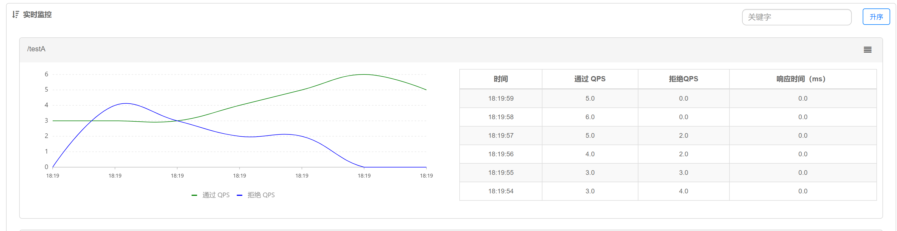

## 流控规则-排队等待

​	官方文档：https://sentinelguard.io/zh-cn/docs/flow-control.html

​	概念：匀速排队方式会严格控制请求通过的间隔时间，也即是让请求以均匀的速度通过，对应的是漏桶算法。

​	这种方式主要用于处理间隔性突发的流量，例如消息队列。想象一下这样的场景，在某一秒有大量的请求到来，而接下来的几秒则处于空闲状态，我们希望系统能够在接下来的空闲期间逐渐处理这些请求，而不是在第一秒直接拒绝多余的请求（削峰填谷）。

​	例图：


## Sentinel 熔断降级简介

### 基本介绍	

​	除了流量控制以外，对调用链路中不稳定的资源进行熔断降级也是保障高可用的重要措施之一。一个服务常常会调用别的模块，可能是另外的一个远程服务、数据库，或者第三方 API 等。例如，支付的时候，可能需要远程调用银联提供的 API；查询某个商品的价格，可能需要进行数据库查询。然而，这个被依赖服务的稳定性是不能保证的。如果依赖的服务出现了不稳定的情况，请求的响应时间变长，那么调用服务的方法的响应时间也会变长，线程会产生堆积，最终可能耗尽业务自身的线程池，服务本身也变得不可用。


​	现代微服务架构都是分布式的，由非常多的服务组成。不同服务之间相互调用，组成复杂的调用链路。以上的问题在链路调用中会产生放大的效果。复杂链路上的某一环不稳定，就可能会层层级联，最终导致整个链路都不可用。因此我们需要对不稳定的**弱依赖服务调用**进行熔断降级，暂时切断不稳定调用，避免局部不稳定因素导致整体的雪崩。熔断降级作为保护自身的手段，通常在客户端（调用端）进行配置。


### 熔断策略

​	Sentinel 提供了一下几种熔断策略：

- 慢调用比例 (`SLOW_REQUEST_RATIO`)：选择以慢调用比例作为阈值，需要设置允许的慢调用 RT（即最大的响应时间），请求的响应时间大于该值则统计为慢调用。当单位统计时长（`statIntervalMs`）内请求数目大于设置的最小请求数目，并且慢调用的比例大于阈值，则接下来的熔断时长内请求会自动被熔断。经过熔断时长后熔断器会进入探测恢复状态（HALF-OPEN 状态），若接下来的一个请求响应时间小于设置的慢调用 RT 则结束熔断，若大于设置的慢调用 RT 则会再次被熔断。

- 异常比例 (`ERROR_RATIO`)：当单位统计时长（`statIntervalMs`）内请求数目大于设置的最小请求数目，并且异常的比例大于阈值，则接下来的熔断时长内请求会自动被熔断。经过熔断时长后熔断器会进入探测恢复状态（HALF-OPEN 状态），若接下来的一个请求成功完成（没有错误）则结束熔断，否则会再次被熔断。异常比率的阈值范围是 `[0.0, 1.0]`，代表 0% - 100%。
- 异常数 (`ERROR_COUNT`)：当单位统计时长内的异常数目超过阈值之后会自动进行熔断。经过熔断时长后熔断器会进入探测恢复状态（HALF-OPEN 状态），若接下来的一个请求成功完成（没有错误）则结束熔断，否则会再次被熔断。


Sentinel在1.8.0版本对熔断降级做了大的调整，可以定义任意时长的熔断时间，引入了半开启恢复支持。下面梳理下相关特性。

熔断状态有三种状态，非别为OPEN、HALF_OPEN、CLOSED

| 状态      | 说明                                                         |
| --------- | ------------------------------------------------------------ |
| OPEN      | 表示熔断开启，拒绝所有请求                                   |
| HALF_OPEN | 探测恢复状态，如果接下来的一个请求顺利通过则表示结束熔断，否则继续熔断 |
| CLOSE     | 表示熔断关闭，请求顺利通过                                   |

### 熔断规则

熔断降级规则包含下面几个重要的属性：

| Field              | 说明                                                         | 默认值     |
| ------------------ | ------------------------------------------------------------ | ---------- |
| resource           | 资源名，即规则的作用对象                                     |            |
| grade              | 熔断策略，支持慢调用比例/异常比例/异常数策略                 | 慢调用比例 |
| count              | 慢调用比例模式下为慢调用临界 RT（超出该值计为慢调用）；异常比例/异常数模式下为对应的阈值 |            |
| timeWindow         | 熔断时长，单位为 s                                           |            |
| minRequestAmount   | 熔断触发的最小请求数，请求数小于该值时即使异常比率超出阈值也不会熔断（1.7.0 引入） | 5          |
| statIntervalMs     | 统计时长（单位为 ms），如 60*1000 代表分钟级（1.8.0 引入）   | 1000 ms    |
| slowRatioThreshold | 慢调用比例阈值，仅慢调用比例模式有效（1.8.0 引入）           |            |

官方文档网址：https://sentinelguard.io/zh-cn/docs/circuit-breaking.html


### 匀速器

​	它的中心思想是，以固定的间隔时间让请求通过。当请求到来的时候，如果当前请求距离上个通过的请求通过的时间间隔不小于预设值，则让当前请求通过。否则，计算当前请求的预期通过时间，如果该请求的预期通过时间小于规则预设的 timeout 时间，则该请求会等待直到预设时间到来通过（排队等待处理）；若预期的通过时间超出最大排队时长，则直接拒接这个请求。


​	Sentinel 匀速排队等待策略是漏桶算法结合虚拟队列等待机制实现的。

​	注意：匀速排队模式暂时不支持 QPS > 1000 的场景。


### 演示

流控规则：


为了看到效果，我们在代码中进行打印，更改8401微服务中的FlowLimitController

```java
package com.example.cloudalibabasentinel8401.controller;

import com.alibaba.csp.sentinel.annotation.SentinelResource;
import com.example.cloudalibabasentinel8401.service.TestService;
import lombok.extern.slf4j.Slf4j;
import org.springframework.beans.factory.annotation.Autowired;
import org.springframework.web.bind.annotation.GetMapping;
import org.springframework.web.bind.annotation.RestController;

import java.util.concurrent.TimeUnit;

@RestController
@Slf4j
public class FlowLimitController {
    @Autowired
    TestService testService;
    @GetMapping("/testA")
    public String testA(){
        log.info(Thread.currentThread().getName()+"：testA");
        return testService.common();
    }

    @GetMapping("/testB")
    public String testB(){
        return testService.common();
    }
}
```

最后我们可以通过Postman来进行测试，发送请求时没有延迟，同时发送10条请求，然后我们会发现就是排队效果1秒执行一个请求，同时我们在Idea中也可以看到打桩效果


## 慢调用比例

​	概念：选择以慢调用比例作为阈值，需要设置允许的慢调用 RT（即最大的响应时间），请求的响应时间大于该值则统计为慢调用。当单位统计时长（`statIntervalMs`）内请求数目大于设置的最小请求数目，并且慢调用的比例大于阈值，则接下来的熔断时长内请求会自动被熔断。经过熔断时长后熔断器会进入探测恢复状态（HALF-OPEN 状态），若接下来的一个请求响应时间小于设置的慢调用 RT 则结束熔断，若大于设置的慢调用 RT 则会再次被熔断。


​	简单理解：


举例：


### 案例演示

首先我们先添加一个控制器方法：

```java
//FlowLimitController.java
@GetMapping("/testC")
public String testC(){
    try {
        TimeUnit.SECONDS.sleep(5);
    } catch (InterruptedException e) {
        e.printStackTrace();
    }
    return "----testC";
}
```

设置熔断策略，1QPS>5 并且这些请求的RT>300 并且大于比例阈值触发熔断

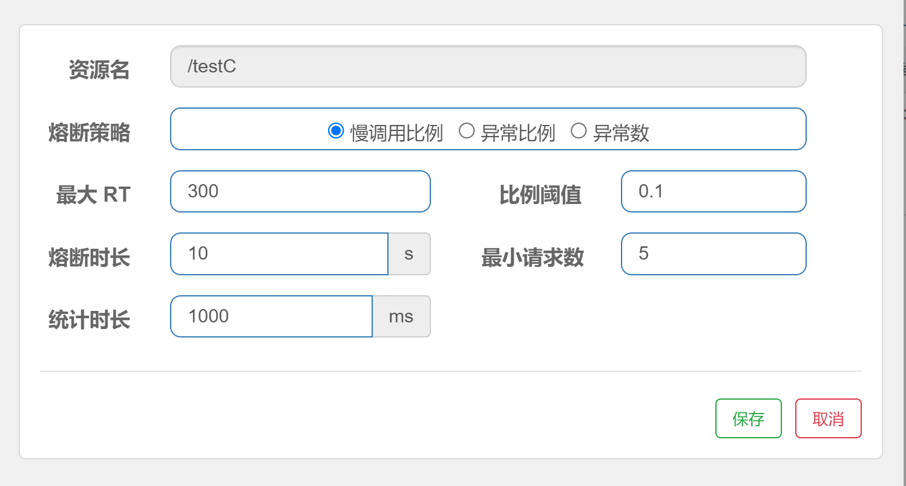

### 测试

通过JMeter测试，1秒钟发起10个线程请求/testC，此时就会触发熔断效果，停止测试以后，10秒钟以后恢复正常


## 异常比例

​	概念：异常比例 (`ERROR_RATIO`)：当单位统计时长（`statIntervalMs`）内请求数目大于设置的最小请求数目，并且异常的比例大于阈值，则接下来的熔断时长内请求会自动被熔断。经过熔断时长后熔断器会进入探测恢复状态（HALF-OPEN 状态），若接下来的一个请求成功完成（没有错误）则结束熔断，否则会再次被熔断。异常比率的阈值范围是 `[0.0, 1.0]`，代表 0% - 100%。

​	注意：异常降级**仅针对业务异常**，对 Sentinel 限流降级本身的异常（`BlockException`）不生效。

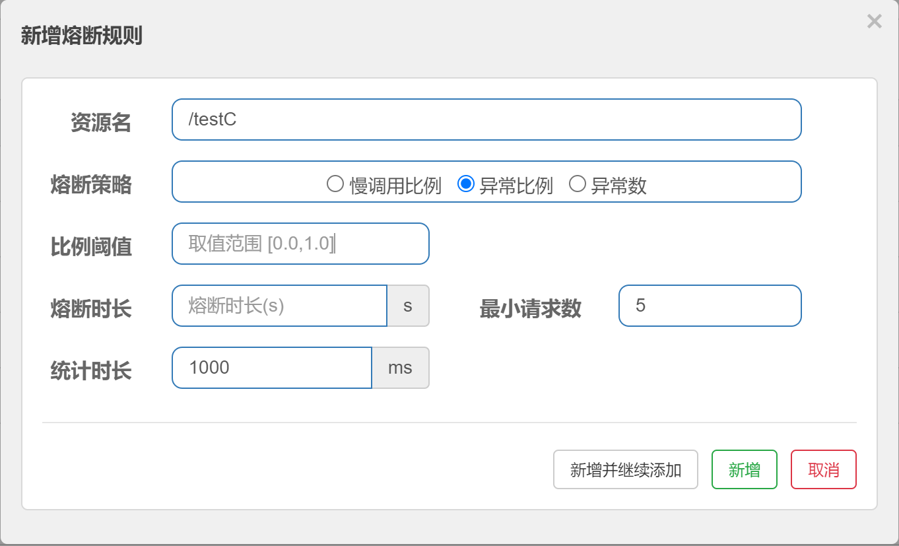

简单理解：


### 案例

编写测试接口

```java
//FlowLimitController
@GetMapping("/testD")
public String testD(Integer id){
    if(id != null && id > 1){
        throw new RuntimeException("异常比例测试");
    }
    return "------------testD";
}
```

设置熔断策略异常比例


### 测试

我们通过JMeter来测试，设定HTTP请求地址


1秒钟发送10个请求


当启动JMeter的时候，就会触发熔断，因为此时我们1秒钟发送10个请求超过了最小请求数5，同时超过了阈值，满足了两个条件，当熔断时长过后就会恢复正常。


## 异常数

​	概念：异常数 (`ERROR_COUNT`)：当单位统计时长内的异常数目超过阈值之后会自动进行熔断。经过熔断时长后熔断器会进入探测恢复状态（HALF-OPEN 状态），若接下来的一个请求成功完成（没有错误）则结束熔断，否则会再次被熔断。

​	注意：异常降级**仅针对业务异常**，对 Sentinel 限流降级本身的异常（`BlockException`）不生效。

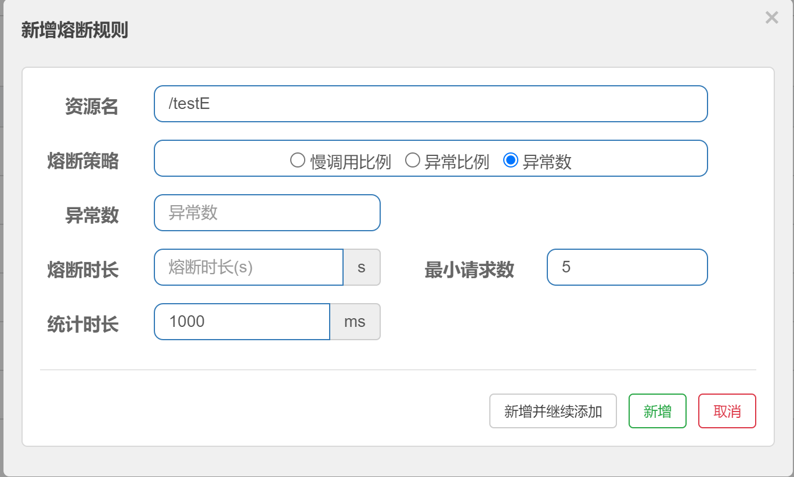

简单理解：

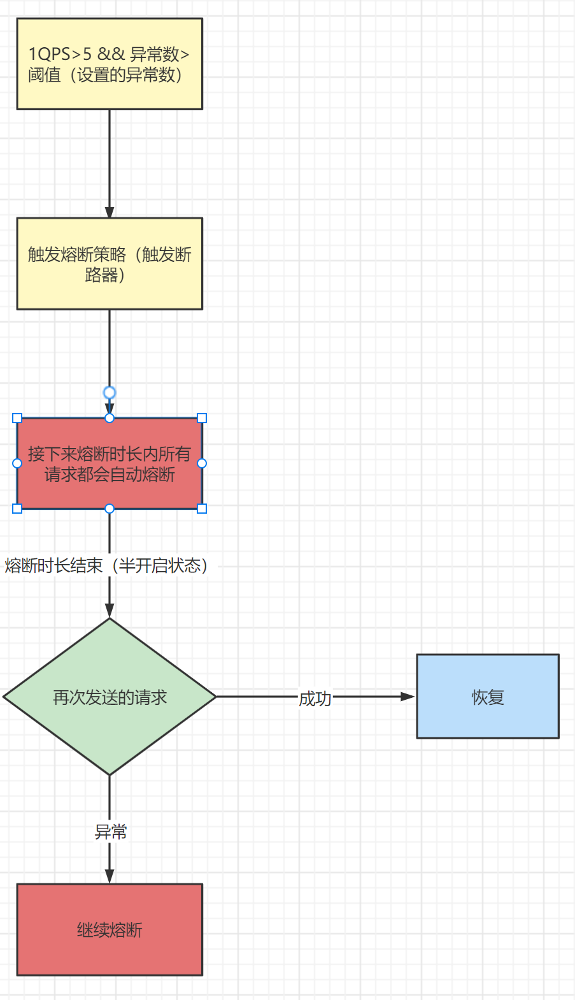

### 案例演示

编写接口

```java
//FlowLimitController
@GetMapping("/testE")
public String testE(Integer id){
    if(id != null && id > 1){
        throw new RuntimeException("异常数测试");
    }
    return "------------testE";
}
```

设置异常数策略，当1秒钟内请求超过5并且异常数大约5个的时候触发熔断


### 测试

通过JMeter来测试

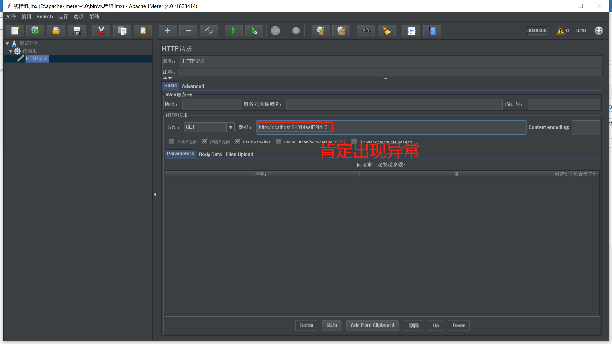

1秒钟发送10个请求


此时就会触发熔断


## Sentinel 热点规则

### 概念

何为热点？热点即经常访问的数据。很多时候我们希望统计某个热点数据中访问频次最高的 Top K 数据，并对其访问进行限制。比如：

- 商品 ID 为参数，统计一段时间内最常购买的商品 ID 并进行限制
- 用户 ID 为参数，针对一段时间内频繁访问的用户 ID 进行限制

热点参数限流会统计传入参数中的热点参数，并根据配置的限流阈值与模式，对包含热点参数的资源调用进行限流。热点参数限流可以看做是一种特殊的流量控制，仅对包含热点参数的资源调用生效

官网：https://sentinelguard.io/zh-cn/docs/parameter-flow-control.html


这里还有相对应的高级选项，我们这里先了解基本规则。

### 使用@SentinelResource注解

其实这个热点限流其实就是更加细粒度的流控规则，那么如果想使用它就必须要配合对应SentinelResource注解。

Sentinel 提供了 @SentinelResource 注解用于定义资源，它有很多的参数，我们这里主要关注两个参数：

1. value：代表资源名称，必需项，因为需要通过resource name找到对应的规则，这个是必须配置的
2. blockHandler：blockHandler 对应处理 BlockException 的方法名称，可选项，访问范围需要是 public，返回类型需要与原方法相匹配，参数类型需要和原方法相匹配并且最后加一个额外的参数，类型为 BlockException。

### 案例讲解


### @SentinelResource(value="xxx")

那现在我们要完成以上图中的效果，这个时候我们首先要编写代码，在FlowLimitController中编写代码

```java
@GetMapping("/testHotKey")
@SentinelResource("testHotKey")
public String testHotKey(@RequestParam(value = "hot1",required = false) String hot1,
                         @RequestParam(value = "hot2",required = false)String hot2,
                         @RequestParam(value = "hot13",required = false) String hot3){
    return "----testHotKey";
}
```

然后再来配置热点规则

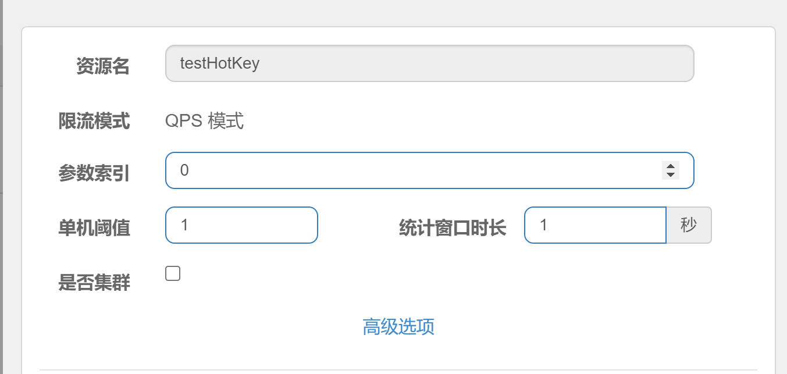

这里要说明一下，参数索引0实际上代表的就是我们设置的hot1参数


测试，此时如果我们传入参数hot1，并且超过阈值，就会出现限流，但是此时的限流效果为报错，显示不友好


### @SentinelResource(value="xxx",blockHandler="xxx")

刚才的演示中，我们明显发现这种限流方法的提示效果非常不友好，所以如果我们需要能够得到友好的提示，我们就需要使用@SentinelResource注解提供的另外一个参数blockHandler，这个参数是可以指定当出现异常时的处理方法，具体操作如下：

```java
@GetMapping("/testHotKey")
@SentinelResource(value = "testHotKey",blockHandler = "handler_HotKey")
public String testHotKey(@RequestParam(value = "hot1",required = false) String hot1,
                         @RequestParam(value = "hot2",required = false)String hot2,
                         @RequestParam(value = "hot13",required = false) String hot3){
    return "----testHotKey";
}

//处理异常方法，方法签名要和对应的接口方法保持一致
public String handler_HotKey(String hot1, String hot2,String hot3,BlockException exception){
    return "系统繁忙稍后重试。。";
}
```

然后热点规则不变，我们最终的到的限流效果如下：


### 参数例外项


​	其实参数例外项就是可以达到更加细粒度的控制，比如我们当前的例子中，目前hot1参数在访问时超过阈值就会被限流，但是我们可以通过参数例外项设置hot1具体等于特殊的某个值的时候，触发不同的限流效果。假如hot1的值等于5时，它的阈值可以达到200。

​	**注意：**参数例外项中的参数类型仅支持一下7种数据类型

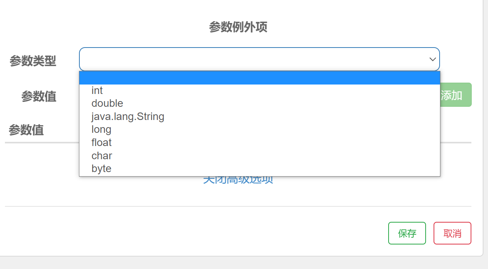

### 案例演示

当前我们需要让hot1的值为5的时候阈值可以达到200，首先Sentinel页面中修改对应热点规则（在这之前，先演示传递一个参数，否则配置失败）


此时的规则为：如果当前hot1值为除5以外的其他值，都会走普通的阈值规则，但是如果一旦hot1的值为5的时候，将会走参数例外项，此时的阈值为200，我们通过浏览器测试，当hot1的值等于5是只要阈值不超过200就不会出现限流。


​	注意：题我们到现在代码中使用了@SentinelResource注解，此注解处理的是**Sentinel控制台配置的异常**，通过blockHandler属性设置对应方法来处理和程序本身异常无关。

​	所以以下程序中如果hot1的值等于6还是会出现RuntimeException。

```java
@SentinelResource(value = "testHotKey",blockHandler = "handler_HotKey")
public String testHotKey(@RequestParam(value = "hot1",required = false) String hot1,
                         @RequestParam(value = "hot2",required = false) String hot2,
                         @RequestParam(value = "hot3",required = false) String hot3){
    if("6".equals(hot1)){
        throw new RuntimeException("运行时异常");
    }
    return "-----testHotKey";
}
```

## Sentinel 系统规则	

​	Sentinel 系统自适应限流从整体维度对应用入口流量进行控制，结合应用的 Load、CPU 使用率、总体平均 RT、入口 QPS 和并发线程数等几个维度的监控指标，通过自适应的流控策略，让系统的入口流量和系统的负载达到一个平衡，让系统尽可能跑在最大吞吐量的同时保证系统整体的稳定性。

### 系统规则

​	系统保护规则是从应用级别的入口流量进行控制，从单台机器的 load、CPU 使用率、平均 RT、入口 QPS 和并发线程数等几个维度监控应用指标，让系统尽可能跑在最大吞吐量的同时保证系统整体的稳定性。

​	系统保护规则是应用整体维度的，而不是资源维度的，并且**仅对入口流量生效**。入口流量指的是进入应用的流量，比如 Web 服务或 Dubbo 服务端接收的请求，都属于入口流量。


**系统规则支持一下的模式：**

- **Load 自适应**（仅对 Linux/Unix-like 机器生效）：系统的 load1（1分钟平均负载） 作为启发指标，进行自适应系统保护。当系统 load1（1分钟平均负载） 超过设定的启发值（阈值），且系统当前的并发线程数超过估算的系统容量时才会触发系统保护（BBR 阶段）。系统容量由系统的 `maxQps(秒级统计的最大QPS) * minRt(秒级统计的最小响应时间)` 估算得出。设定参考值一般是 `CPU cores * 2.5`。
- **CPU usage**（1.5.0+ 版本）：当系统 CPU 使用率超过阈值即触发系统保护（取值范围 0.0-1.0），比较灵敏。
- **平均 RT**：当单台机器上所有入口流量的平均 RT 达到阈值即触发系统保护，单位是毫秒。
- **并发线程数**：当单台机器上所有入口流量的并发线程数达到阈值即触发系统保护。
- **入口 QPS**：当单台机器上所有入口流量的 QPS 达到阈值即触发系统保护。


### 案例演示

这里我们只通过入口QPS来进行测试，直接设置规则


最后测试效果不管现在我们访问那个接口只要超过阈值就会被限流


## 自定义限流处理逻辑

其实我们在使用@SentinelResource注解这两种方案的时候，会出现一些问题：

1. 没有体现我们自己的业务要求。
2. 自定义处理方法和业务代码耦合在一起。
3. 每个业务方法都添加一个限流处理方法，代码将会加剧膨胀。
4. 无法实现统一全局处理。 

解决：@SentinelResource除了blockHandler可以设置自定义限流处理逻辑方法以外，还提供另外一个属性来设置限流处理逻辑类型blockHandlerClass属性，此属性中设置的方法必需为 static 函数，否则无法解析。

### 具体逻辑

**第一步**

创建CustomerBlockHandler类型用于处理自定义限流处理逻辑，首先创建myhandler.CustomerBlockHandler

```java
/**
 * 此类型用来处理限流自定义逻辑
 */
public class CustomerBlockHandler {
    public static String handlerException1(BlockException exception){
        return "handlerException1：系统异常，请稍后重试！";
    }
    public static String handlerException2(BlockException exception){
        return "handlerException2：网络崩溃了，请稍后重试！";
    }
}
```

**第二步**

我们在SentinelResourceTestController类型中添加一个接口方法，同时设置@SentinelResource注解和blockHandlerClass属性对应的类型和这个类型中对应的处理方法

```java
/**
* 此方法用到了自定义限流处理类型CustomerBlockHandler
* 中的handlerException1方法来处理限流逻辑。
*/
@GetMapping("/bycustomer")
@SentinelResource(value = "bycustomer",
                  blockHandlerClass = CustomerBlockHandler.class,
                  blockHandler = "handlerException1")
public String bycustomer(){
    return "-----bycustomer";
}
```

**第三步**

测试：给bycustomer资源添加限流规则，然后来测试在超过限流阈值时处理方法是否为CustomerBlockHandler中handlerException1来进行处理。


添加流控规则以后，我们再来频繁访问http://localhost:8401/bycustomer，就会看见是CustomerBlockHandler类型的handlerException1方法来处理自定义限流逻辑


### 对应关系图

 

# Gateway

在微服务架构中，如果没有网关，客户端记录每个服务的地址，分别调用会产生很多问题

* 客户端多次请求不同的微服务，增加客户端代码或配置编写的复杂性
* 认证复杂，每个微服务都有独立认证
* 存在跨域请求，在一定场景下处理相对复杂

为解决上面的问题所以引入了网关的概念：所谓的API网关，就是指系统的统一入口，提供内部服务的路由中转，为客户端提供统一服务，一些与业务本身功能无关的公共逻辑可以在这里实现，诸如认证、鉴权、监控、路由转发等。

SpringCloud GateWay使用的是Webflux中的reactor-netty响应式编程组件，底层使用了Netty通讯框架。

## 网关对比

* Zuul 1.x
  Netflix开源的网关，基于Servlet框架构建，功能丰富，使用JAVA开发，易于二次开发 问题：即一个线程处理一次连接请求，这种方式在内部延迟严重、设备故障较多情况下会引起存活的连接增多和线程增加的情况发生。
* Zuul 2.x
  Zuul2 采用了Netty实现异步非阻塞编程模型，每个 CPU 核一个线程，处理所有的请求和响应，请求和响应的生命周期是通过事件和回调来处理的，这种方式减少了线程数量，因此开销较小。
* GateWay
  Spring公司为了替换Zuul而开发的网关服务，底层为Netty，将在下面具体介绍。
* Nginx+lua
  使用nginx的反向代理和负载均衡可实现对api服务器的负载均衡及高可用，lua是一种脚本语言,可以来编写一些简单的逻辑, nginx支持lua脚本，问题在于：无法融入到微服务架构中
* Kong
  基于Nginx+Lua开发，性能高，稳定，有多个可用的插件(限流、鉴权等等)可以开箱即用。 问题：只支持Http协议；二次开发，自由扩展困难；提供管理API，缺乏更易用的管控、配置方式。

### 基本概念：

路由(Route) 是 gateway 中最基本的组件之一，表示一个具体的路由信息载体。主要定义了下面的几个信息:

* id：路由标识、区别于其他route
* uri：路由指向的目的地uri，即客户端请求最终被转发到的微服务
* order：用于多个route之间的排序，数值越小排序越靠前，匹配优先级越高
* predicate：断言的作用是进行条件判断，只有断言都返回真，才会真正的执行路由
* filter：过滤器用于修改请求和响应信息

```yml
  routes:
        - id: wrong_question
          uri: https://xxxx.com
          predicates:
            - Path=/xxx/wrong/**
          filters:
            - StripPrefix=1
```

### 执行流程：

1. Gateway Client向Gateway Server发送请求
2. 请求首先会被HttpWebHandlerAdapter进行提取组装成网关上下文
3. 然后网关的上下文会传递到DispatcherHandler，它负责将请求分发给RoutePredicateHandlerMapping
4. RoutePredicateHandlerMapping负责路由查找，并根据路由断言判断路由是否可用
5. 如果过断言成功，由FilteringWebHandler创建过滤器链并调用
6. 请求会一次经过PreFilter--微服务--PostFilter的方法，最终返回响应

## 断言种类

1. After：匹配在指定日期时间之后发生的请求。
2. Before：匹配在指定日期之前发生的请求。
3. Between：需要指定两个日期参数，设定一个时间区间，匹配此时间区间内的请求。
4. Cookie：需要指定两个参数，分别为name和regexp（正则表达式），也可以理解Key和Value，匹配具有给定名称且其值与正则表达式匹配的Cookie。
5. Header：需要两个参数header和regexp（正则表达式），也可以理解为Key和Value，匹配请求携带信息。
6. Host：匹配当前请求是否来自于设置的主机。
7. Method：可以设置一个或多个参数，匹配HTTP请求，比如GET、POST
8. Path：匹配指定路径下的请求，可以是多个用逗号分隔
9. Query：需要指定一个或者多个参数，一个必须参数和一个可选的正则表达式，匹配请求中是否包含第一个参数，如果有两个参数，则匹配请求中第一个参数的值是否符合正则表达式。
10. RemoteAddr：匹配指定IP或IP段，符合条件转发。
11. Weight：需要两个参数group和weight（int），实现了路由权重功能，按照路由权重选择同一个分组中的路由

## 自定义Filter

要实现GateWay自定义过滤器，那么我们需要实现两个接口

* GlobalFilter
* Ordered