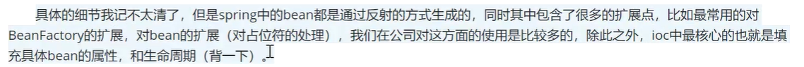
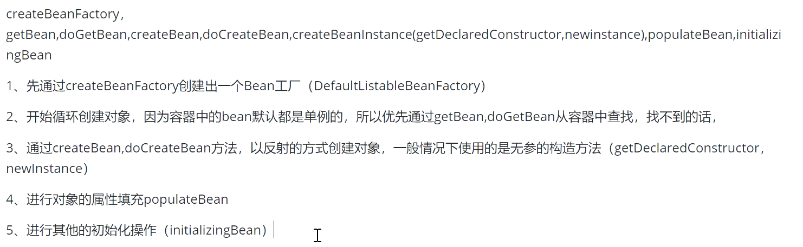
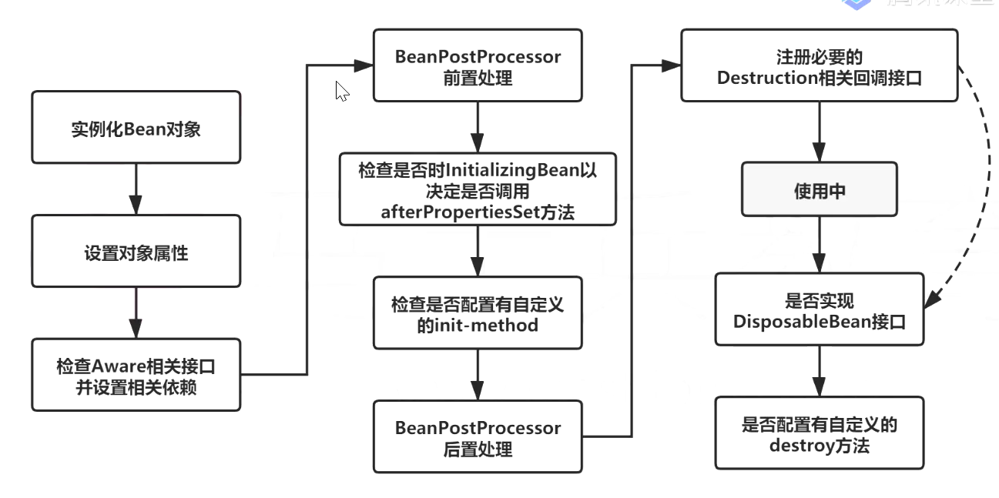
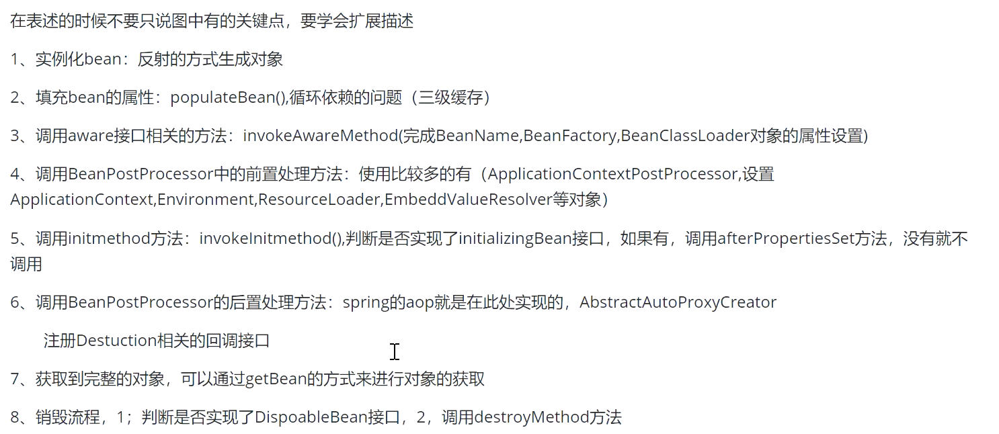
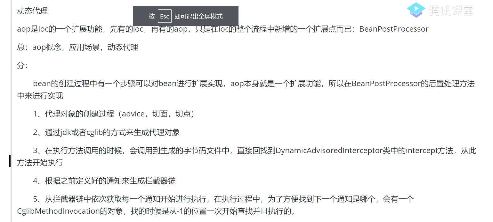

# Spring

# 1.谈谈Spring IOC的理解，原理与实现

总：

控制反转：原来的对象是由使用者控制，有了容器，把整个对象交给spring来管理

DI：依赖注入，把对应属性的值注入到具体对象中，@Autowired，populateBean完成属性值的注入

容器：存储对象，使用map来存储，在spring中一般存在三级缓存，singletonObject存放完整的对象，整个bean的生命周期，从创建、使用、到销毁的全部过程都是容器来管理（bean的生命周期）

分：

1.容器的创建过程，BeanFactory，DefaultListableBeanFacroty，向Bean工厂中设置一些参数（BeanPostProcessor，Awared接口的子类）等等属性

2.加载解析Bean对象，准备要创建Bean对象的定义对象beanDefinition（XML或者注解的解析过程）

3.beanFactoryPostProcessor的处理，此处是扩展点

总：

# 2.谈一谈Spring IOC底层实现

反射、工厂、设计模式，关键的几个方法

# 3.描述Bean的生命周期

# 4.循环依赖怎么解决

1.三级缓存，提前暴露对象，aop

总：A依赖B，B依赖A

# AOP原理

