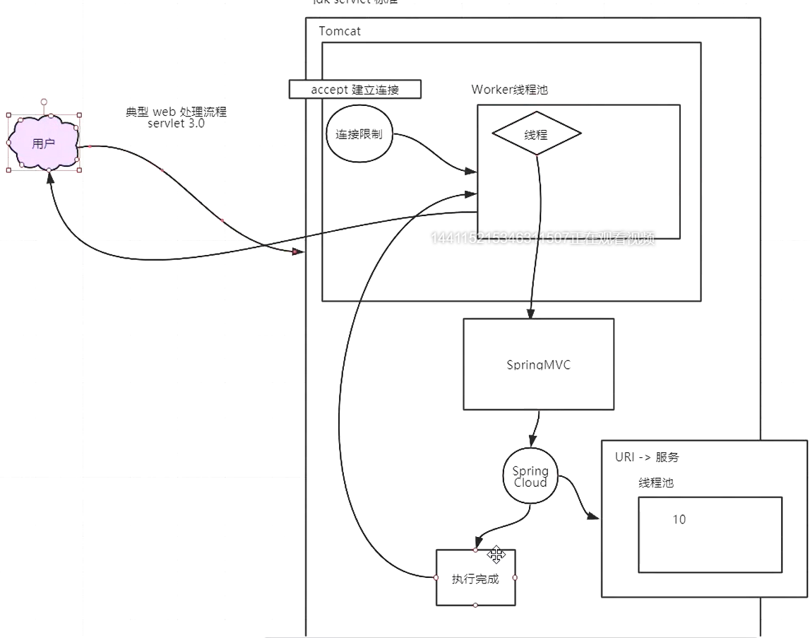

# Eureka

#### 整体介绍

1. 背景：在传统应用中，组件之间的调用，通过有规范的约束的接口来实现，从而实现不同模块间良好的协作。但是被拆分成微服务后，每个微服务实例的网络地址都可能动态变化，数量也会变化，使得原来硬编码（写死）的地址失去了作用。**需要一个中心化的组件来进行服务的登记和管理**。
2. 概念：**实现服务治理，即管理所有的服务信息和状态**。

```sh
注册中心相当于买票乘车，只看有没有票（有没有服务），有就去买票（获取注册列表），然后乘车（调用）。不必关心有多少火车在运行。
```

3. 注册中心好处：不用关心有多少提供方。

4. 注册中心有哪些:Eureka，Nacos，Consul，Zookeeper等。

5. 服务注册与发现包括两部分，一个是服务器端，另一个是客户端。

   Server是一个公共服务，为Client提供服务注册和发现的功能，维护注册到自身的Client的相关信息，同时提供接口给Client获取注册表中其他服务的信息，使得动态变化的Client能够进行服务间的相互调用。

   Client将自己的服务信息通过一定的方式登记到Server上，并在正常范围内维护自己信息一致性，方便其他服务发现自己，同时可以通过Server获取到自己依赖的其他服务信息，完成服务调用，还内置了负载均衡器，用来进行基本的负载均衡。

6. 我们课程的Spring Cloud是用Eureka作为服务注册中心。

7. Eureka：是一个RESTful风格的服务，是一个用于服务发现和注册的基础组件，是搭建Spring Cloud微服务的前提之一，它**屏蔽了Server和client的交互细节，使得开发者将精力放到业务上**。

8. serverA从serverB同步信息，则serverB是serverA的peer。

9. 上面例子中如果service-url为空，且register-with-eureka，fetch-registry为true，则会报错，Cannot execute request on any known server，因为server同时也是一个client，他会尝试注册自己，所以要有一个注册中心url去注册。

10. Netflix开源的组件。包括server和client两部分。

    ```sh
    https://github.com/Netflix/Eureka
    ```

#### 注册中心和微服务间的关系

> 《服务注册与发现关系图》

#### client功能

1. 注册：每个微服务启动时，将自己的网络地址等信息注册到注册中心，注册中心会存储（内存中）这些信息。
2. 获取服务注册表：服务消费者从注册中心，查询服务提供者的网络地址，并使用该地址调用服务提供者，为了避免每次都查注册表信息，所以client会定时去server拉取注册表信息到缓存到client本地。
3. 心跳：各个微服务与注册中心通过某种机制（心跳）通信，若注册中心长时间和服务间没有通信，就会注销该实例。
4. 调用：实际的服务调用，通过注册表，解析服务名和具体地址的对应关系，找到具体服务的地址，进行实际调用。

#### server注册中心功能

1. 服务注册表：记录各个微服务信息，例如服务名称，ip，端口等。

   注册表提供 查询API（查询可用的微服务实例）和管理API（用于服务的注册和注销）。

2. 服务注册与发现：注册：将微服务信息注册到注册中心。发现：查询可用微服务列表及其网络地址。

3. 服务检查：定时检测已注册的服务，如发现某实例长时间无法访问，就从注册表中移除。

组件：Eureka , Consul , ZooKeeper，nacos等。

### 高可用集群

1.服务注册好的信息提交到Eureka,两台服务器互相作为对方的客户端，互相拉取


2. 两个服务器没有依赖关系，服务需要分别到两个服务器去注册


缺点：获取服务列表时，需要向每台服务器去获取信息

### 搭建互相注册的集群

如果两个服务ip地址一样要配置不同的主机名

C:\Windows\System32\drivers\etc\hosts

加上

```properties
127.0.0.1 euk1.com
127.0.0.1 euk2.com
```

1.application.properties

```properties
spring.profiles.active=euk2
spring.application.name=EurekaServer

#hostname 是用来查找主机地址的 appname表示分组的（用来表示一组服务）
```

2.application-euk1.properties

```properties
#是否将自己注册到Eureka Server,默认为true，由于当前就是server，故而设置成false，表明该服务不会向eureka注册自己的信息
#eureka.client.register-with-eureka=false
#是否从eureka server获取注册信息，由于单节点，不需要同步其他节点数据，用false
#eureka.client.fetch-registry=false
#设置服务注册中心的URL，用于client和server端交流
eureka.client.service-url.defaultZone=http://euk2.com:7002/eureka/
eureka.instance.hostname=euk1.com
server.port=7001
```

3.application-euk2.properties

```properties
#是否将自己注册到Eureka Server,默认为true，由于当前就是server，故而设置成false，表明该服务不会向eureka注册自己的信息
#eureka.client.register-with-eureka=false
#是否从eureka server获取注册信息，由于单节点，不需要同步其他节点数据，用false
#eureka.client.fetch-registry=false
#设置服务注册中心的URL，用于client和server端交流,端口是要找的端口号
eureka.client.service-url.defaultZone=http://euk1.com:7001/eureka/
eureka.instance.hostname=euk2.com
server.port=7002

```

成功界面


## Eureka原理

eureka来源于古希腊词汇，意为“发现了”

eureka分为两部分，Server端和Client端

### Register

**服务注册**

想要参与服务注册发现的实例首先需要向Eureka服务器注册信息

注册在第一次心跳发生时提交

## Renew

**续租，心跳**

Eureka客户需要每30秒发送一次心跳来续租

10:00 00 第一次

10:00 30

10:01

10:01 30 最后

更新通知Eureka服务器实例仍然是活动的。如果服务器在90秒内没有看到更新，它将从其注册表中删除实例

## Fetch Registry

Eureka客户端从服务器获取注册表信息并将其缓存在本地。

之后，客户端使用这些信息来查找其他服务。

通过获取上一个获取周期和当前获取周期之间的增量更新，可以定期(每30秒)更新此信息。

节点信息在服务器中保存的时间更长(大约3分钟)，因此获取节点信息时可能会再次返回相同的实例。Eureka客户端自动处理重复的信息。

在获得增量之后，Eureka客户机通过比较服务器返回的实例计数来与服务器协调信息，如果由于某种原因信息不匹配，则再次获取整个注册表信息。

## Cancel

Eureka客户端在关闭时向Eureka服务器发送取消请求。这将从服务器的实例注册表中删除实例，从而有效地将实例从通信量中取出。

## Time Lag

同步时间延迟

来自Eureka客户端的所有操作可能需要一段时间才能反映到Eureka服务器上，然后反映到其他Eureka客户端上。这是因为eureka服务器上的有效负载缓存，它会定期刷新以反映新信息。Eureka客户端还定期地获取增量。因此，更改传播到所有Eureka客户机可能需要2分钟。

## Communication mechanism

通讯机制

Http协议下的Rest请求

默认情况下Eureka使用Jersey和Jackson以及JSON完成节点间的通讯

### Eureka单独使用

### /eureka/status 服务状态

使用浏览器请求url会返回服务器状态信息

```xml
<com.netflix.eureka.util.StatusInfo>
  <generalStats>
    <environment>test</environment>
    <num-of-cpus>16</num-of-cpus>
    <total-avail-memory>526mb</total-avail-memory>
    <current-memory-usage>183mb (34%)</current-memory-usage>
    <server-uptime>00:00</server-uptime>
  </generalStats>
  <applicationStats>
    <registered-replicas></registered-replicas>
    <available-replicas></available-replicas>
    <unavailable-replicas></unavailable-replicas>
  </applicationStats>
  <instanceInfo>
    <instanceId>localhost</instanceId>
    <hostName>localhost</hostName>
    <app>UNKNOWN</app>
    <ipAddr>192.168.29.1</ipAddr>
    <status>UP</status>
    <overriddenstatus>UNKNOWN</overriddenstatus>
    <port enabled="true">8080</port>
    <securePort enabled="false">443</securePort>
    <countryId>1</countryId>
    <dataCenterInfo class="com.netflix.appinfo.InstanceInfo$DefaultDataCenterInfo">
      <name>MyOwn</name>
    </dataCenterInfo>
    <leaseInfo>
      <renewalIntervalInSecs>30</renewalIntervalInSecs>
      <durationInSecs>90</durationInSecs>
      <registrationTimestamp>0</registrationTimestamp>
      <lastRenewalTimestamp>0</lastRenewalTimestamp>
      <evictionTimestamp>0</evictionTimestamp>
      <serviceUpTimestamp>0</serviceUpTimestamp>
    </leaseInfo>
    <metadata>
      <management.port>8080</management.port>
      <jmx.port>7649</jmx.port>
    </metadata>
    <homePageUrl>http://localhost:8080/</homePageUrl>
    <statusPageUrl>http://localhost:8080/actuator/info</statusPageUrl>
    <healthCheckUrl>http://localhost:8080/actuator/health</healthCheckUrl>
    <vipAddress>unknown</vipAddress>
    <secureVipAddress>unknown</secureVipAddress>
    <isCoordinatingDiscoveryServer>false</isCoordinatingDiscoveryServer>
    <lastUpdatedTimestamp>1586328420409</lastUpdatedTimestamp>
    <lastDirtyTimestamp>1586328420519</lastDirtyTimestamp>
  </instanceInfo>
</com.netflix.eureka.util.StatusInfo>
```

如果需要json格式 可以加个请求头`Accept:application/json`

```json
{
    "generalStats": {
        "environment": "test",
        "num-of-cpus": "16",
        "total-avail-memory": "517mb",
        "current-memory-usage": "45mb (8%)",
        "server-uptime": "00:03"
    },
    "applicationStats": {
        "registered-replicas": "",
        "available-replicas": "",
        "unavailable-replicas": ""
    },
    "instanceInfo": {
        "instanceId": "localhost",
        "hostName": "localhost",
        "app": "UNKNOWN",
        "ipAddr": "192.168.29.1",
        "status": "UP",
        "overriddenStatus": "UNKNOWN",
        "port": {
            "$": 8080,
            "@enabled": "true"
        },
        "securePort": {
            "$": 443,
            "@enabled": "false"
        },
        "countryId": 1,
        "dataCenterInfo": {
            "@class": "com.netflix.appinfo.InstanceInfo$DefaultDataCenterInfo",
            "name": "MyOwn"
        },
        "leaseInfo": {
            "renewalIntervalInSecs": 30,
            "durationInSecs": 90,
            "registrationTimestamp": 0,
            "lastRenewalTimestamp": 0,
            "evictionTimestamp": 0,
            "serviceUpTimestamp": 0
        },
        "metadata": {
            "management.port": "8080",
            "jmx.port": "7649"
        },
        "homePageUrl": "http://localhost:8080/",
        "statusPageUrl": "http://localhost:8080/actuator/info",
        "healthCheckUrl": "http://localhost:8080/actuator/health",
        "vipAddress": "unknown",
        "secureVipAddress": "unknown",
        "isCoordinatingDiscoveryServer": "false",
        "lastUpdatedTimestamp": "1586328420409",
        "lastDirtyTimestamp": "1586328420519"
    }
```

### 元数据

Eureka的元数据有两种：标准元数据和自定义元数据。
标准元数据：主机名、IP地址、端口号、状态页和健康检查等信息，这些信息都会被发布在服务注册表中，用于服务之间的调用。
自定义元数据：可以使用eureka.instance.metadata-map配置，这些元数据可以在远程客户端中访问，但是一般不改变客户端行为，除非客户端知道该元数据的含义。

可以在配置文件中对当前服务设置自定义元数据，可后期用户个性化使用

元数据可以配置在eureka服务器和eureka的客户端上

```
eureka.instance.metadata-map.dalao=mashibing

```

#### 服务端：


#### 客户端：

```json
{
    "applications": {
        "versions__delta": "1",
        "apps__hashcode": "UP_2_",
        "application": [
            {
                "name": "EUREKA-CONSUMER",
                "instance": [
                    {
                        "instanceId": "localhost:Eureka-Consumer:9001",
                        "hostName": "localhost",
                        "app": "EUREKA-CONSUMER",
                        "ipAddr": "192.168.29.1",
                        "status": "UP",
                        "overriddenStatus": "UNKNOWN",
                        "port": {
                            "$": 9001,
                            "@enabled": "true"
                        },
                        "securePort": {
                            "$": 443,
                            "@enabled": "false"
                        },
                        "countryId": 1,
                        "dataCenterInfo": {
                            "@class": "com.netflix.appinfo.InstanceInfo$DefaultDataCenterInfo",
                            "name": "MyOwn"
                        },
                        "leaseInfo": {
                            "renewalIntervalInSecs": 30,
                            "durationInSecs": 90,
                            "registrationTimestamp": 1586331982283,
                            "lastRenewalTimestamp": 1586331982283,
                            "evictionTimestamp": 0,
                            "serviceUpTimestamp": 1586331982283
                        },
                        "metadata": {
                            "dalao": "mashibing666",
                            "management.port": "9001",
                            "jmx.port": "10158"
                        },
                        "homePageUrl": "http://localhost:9001/",
                        "statusPageUrl": "http://localhost:9001/actuator/info",
                        "healthCheckUrl": "http://localhost:9001/actuator/health",
                        "vipAddress": "Eureka-Consumer",
                        "secureVipAddress": "Eureka-Consumer",
                        "isCoordinatingDiscoveryServer": "false",
                        "lastUpdatedTimestamp": "1586331982283",
                        "lastDirtyTimestamp": "1586331982260",
                        "actionType": "ADDED"
                    },
                    {
                        "instanceId": "localhost:Eureka-Consumer:9000",
                        "hostName": "localhost",
                        "app": "EUREKA-CONSUMER",
                        "ipAddr": "192.168.29.1",
                        "status": "UP",
                        "overriddenStatus": "UNKNOWN",
                        "port": {
                            "$": 9000,
                            "@enabled": "true"
                        },
                        "securePort": {
                            "$": 443,
                            "@enabled": "false"
                        },
                        "countryId": 1,
                        "dataCenterInfo": {
                            "@class": "com.netflix.appinfo.InstanceInfo$DefaultDataCenterInfo",
                            "name": "MyOwn"
                        },
                        "leaseInfo": {
                            "renewalIntervalInSecs": 30,
                            "durationInSecs": 90,
                            "registrationTimestamp": 1586331637223,
                            "lastRenewalTimestamp": 1586332057220,
                            "evictionTimestamp": 0,
                            "serviceUpTimestamp": 1586331637223
                        },
                        "metadata": {
                            "dalao": "mashibing",
                            "management.port": "9000",
                            "jmx.port": "10000"
                        },
                        "homePageUrl": "http://localhost:9000/",
                        "statusPageUrl": "http://localhost:9000/actuator/info",
                        "healthCheckUrl": "http://localhost:9000/actuator/health",
                        "vipAddress": "Eureka-Consumer",
                        "secureVipAddress": "Eureka-Consumer",
                        "isCoordinatingDiscoveryServer": "false",
                        "lastUpdatedTimestamp": "1586331637223",
                        "lastDirtyTimestamp": "1586331637182",
                        "actionType": "ADDED"
                    }
                ]
            }
        ]
    }
}
```

## EurekaClient 

EurekaClient 可以在客户端获取eureka服务器上的注册者信息

**org.springframework.cloud.client.discovery与com.netflix.discovery.DiscoveryClient**

org.springframework.cloud.client.discovery是SpringCloud对注册中心client的抽象封装，提供公用功能

org.springframework.cloud.client.discovery定义用来服务发现的客户端接口，是客户端进行服务发现的核心接口，是spring cloud用来进行服务发现的顶级接口，在common中可以看到其地位。在Netflix Eureka和Consul中都有具体的实现类。

代表通用于服务发现的读操作，例如在 eureka或consul中。

```
有
	String description();//获取实现类的描述。
	List<String> getServices();//获取所有服务实例id。
	List<ServiceInstance> getInstances(String serviceId);//通过服务id查询服务实例信息列表。
```

com.netflix.discovery.DiscoveryClient为Eureka注册中心客户端的接口，功能更丰富

## 自我保护机制

### 机制

Eureka在CAP理论当中是属于AP ， 也就说当产生网络分区时，Eureka保证系统的可用性，但不保证系统里面数据的一致性

默认开启，服务器端容错的一种方式，即短时间心跳不到达仍不剔除服务列表里的节点

```
EMERGENCY! EUREKA MAY BE INCORRECTLY CLAIMING INSTANCES ARE UP WHEN THEY'RE NOT. RENEWALS ARE LESSER THAN THRESHOLD AND HENCE THE INSTANCES ARE NOT BEING EXPIRED JUST TO BE SAFE.
```

默认情况下，Eureka Server在一定时间内，没有接收到某个微服务心跳，会将某个微服务注销（90S）。但是当网络故障时，微服务与Server之间无法正常通信，上述行为就非常危险，因为微服务正常，不应该注销。

Eureka Server通过自我保护模式来解决整个问题，当Server在短时间内丢失过多客户端时，那么Server会进入自我保护模式，会保护注册表中的微服务不被注销掉。当网络故障恢复后，退出自我保护模式。

**思想：宁可保留健康的和不健康的，也不盲目注销任何健康的服务。**

#### 自我保护触发

**客户端每分钟续约数量小于客户端总数的85%时会触发保护机制**


### 关闭自我保护机制

```properties
eureka.server.enable-self-preservation=false
```


关闭后会提示


## 使用Spring Boot2.x Actuator监控应用

### 开启监控

   ```xml
<dependency>
     <groupId>org.springframework.boot</groupId>
     <artifactId>spring-boot-starter-actuator</artifactId>
 </dependency>
   ```

### 默认端点

Spring Boot 2.0 的Actuator只暴露了health和info端点，提供的监控信息无法满足我们的需求

在1.x中有n多可供我们监控的节点，官方的回答是为了安全….


### 开启所有端点

在application.yml中加入如下配置信息

*代表所有节点都加载

```properties
#开启所有端点
management.endpoints.web.exposure.include=*
```


所有端点都开启后的api列表

```
{"_links":{"self":{"href":"http://localhost:8080/actuator","templated":false},"archaius":{"href":"http://localhost:8080/actuator/archaius","templated":false},"beans":{"href":"http://localhost:8080/actuator/beans","templated":false},"caches-cache":{"href":"http://localhost:8080/actuator/caches/{cache}","templated":true},"caches":{"href":"http://localhost:8080/actuator/caches","templated":false},"health":{"href":"http://localhost:8080/actuator/health","templated":false},"health-path":{"href":"http://localhost:8080/actuator/health/{*path}","templated":true},"info":{"href":"http://localhost:8080/actuator/info","templated":false},"conditions":{"href":"http://localhost:8080/actuator/conditions","templated":false},"configprops":{"href":"http://localhost:8080/actuator/configprops","templated":false},"env":{"href":"http://localhost:8080/actuator/env","templated":false},"env-toMatch":{"href":"http://localhost:8080/actuator/env/{toMatch}","templated":true},"loggers":{"href":"http://localhost:8080/actuator/loggers","templated":false},"loggers-name":{"href":"http://localhost:8080/actuator/loggers/{name}","templated":true},"heapdump":{"href":"http://localhost:8080/actuator/heapdump","templated":false},"threaddump":{"href":"http://localhost:8080/actuator/threaddump","templated":false},"metrics":{"href":"http://localhost:8080/actuator/metrics","templated":false},"metrics-requiredMetricName":{"href":"http://localhost:8080/actuator/metrics/{requiredMetricName}","templated":true},"scheduledtasks":{"href":"http://localhost:8080/actuator/scheduledtasks","templated":false},"mappings":{"href":"http://localhost:8080/actuator/mappings","templated":false},"refresh":{"href":"http://localhost:8080/actuator/refresh","templated":false},"features":{"href":"http://localhost:8080/actuator/features","templated":false},"service-registry":{"href":"http://localhost:8080/actuator/service-registry","templated":false}}}
```


### api端点功能

#### Health

会显示系统状态

{"status":"UP"}

 

#### shutdown 

用来关闭节点

开启远程关闭功能

```properties
management.endpoint.shutdown.enabled=true
```


使用Post方式请求端点

{

  "message": "Shutting down, bye..."

}

 

 autoconfig 

获取应用的自动化配置报告 
 beans 

获取应用上下文中创建的所有Bean 

 

#### configprops 

获取应用中配置的属性信息报告 

  

#### env 

获取应用所有可用的环境属性报告 

#### Mappings

 获取应用所有Spring Web的控制器映射关系报告

####  info 

获取应用自定义的信息 

#### metrics

返回应用的各类重要度量指标信息 

**Metrics**节点并没有返回全量信息，我们可以通过不同的**key**去加载我们想要的值

 metrics/jvm.memory.max

 

### Threaddump

1.x中为**dump**

返回程序运行中的线程信息 


## RestTemplate 

### 依赖注入

```
	@Bean
	// 开启负载均衡
	@LoadBalanced
	RestTemplate restTemplate() {
		return new RestTemplate();
	}
```

接下来便可以使用资源地址调用服务

```
String url ="http://provider/getHi";
String respStr = restTemplate.getForObject(url, String.class);
		
```


### get 请求处理

#### getForEntity

getForEntity方法的返回值是一个ResponseEntity，ResponseEntity是Spring对HTTP请求响应的封装，包括了几个重要的元素，如响应码、contentType、contentLength、响应消息体等。

```
<200,Hi,[Content-Type:"text/plain;charset=UTF-8", Content-Length:"8", Date:"Fri, 10 Apr 2020 09:58:44 GMT", Keep-Alive:"timeout=60", Connection:"keep-alive"]>
```


#### 返回一个Map

**调用方**

```
		String url ="http://provider/getMap";
		   
		ResponseEntity<Map> entity = restTemplate.getForEntity(url, Map.class);
		   
		System.out.println("respStr: "  + entity.getBody() );
```

**生产方**

```
	@GetMapping("/getMap")
	public Map<String, String> getMap() {
		
		HashMap<String, String> map = new HashMap<>();
		map.put("name", "500");
		return map; 
	}
```

#### 返回对象

**调用方**

```
		ResponseEntity<Person> entity = restTemplate.getForEntity(url, Person.class);
		   
		System.out.println("respStr: "  + ToStringBuilder.reflectionToString(entity.getBody() ));
```

**生产方**

```
	@GetMapping("/getObj")
	public Person getObj() {


		Person person = new Person();
		person.setId(100);
		person.setName("xiaoming");
		return person; 
	}
```

**Person类**

```
	private int id;
	private String name;
```

#### 传参调用

**使用占位符**

		String url ="http://provider/getObjParam?name={1}";
		   
		ResponseEntity<Person> entity = restTemplate.getForEntity(url, Person.class,"hehehe...");

**使用map**

```
		String url ="http://provider/getObjParam?name={name}";
		   
		Map<String, String> map = Collections.singletonMap("name", " memeda");
		ResponseEntity<Person> entity = restTemplate.getForEntity(url, Person.class,map);
```

#### 返回对象

```
Person person = restTemplate.getForObject(url, Person.class,map);
```

### post 请求处理

**调用方**

```
	
		String url ="http://provider/postParam";
		   
		Map<String, String> map = Collections.singletonMap("name", " memeda");
		 ResponseEntity<Person> entity = restTemplate.postForEntity(url, map, Person.class);
```

**生产方**

```java
	@PostMapping("/postParam")
	public Person postParam(@RequestBody String name) {

		System.out.println("name:" + name);

		Person person = new Person();
		person.setId(100);
		person.setName("xiaoming" + name);
		return person; 
	}
```

### postForLocation 

**调用方**

```java
		String url ="http://provider/postParam";
		   
		Map<String, String> map = Collections.singletonMap("name", " memeda");
		URI location = restTemplate.postForLocation(url, map, Person.class);
		
		System.out.println(location);
```

**生产方**

需要设置头信息，不然返回的是null

```java
	public URI postParam(@RequestBody Person person,HttpServletResponse response) throws Exception {

	URI uri = new URI("https://www.baidu.com/s?wd="+person.getName());
	response.addHeader("Location", uri.toString());
```

### exchange

可以自定义http请求的头信息，同时保护get和post方法

### 拦截器

需要实现`ClientHttpRequestInterceptor`接口

**拦截器**

```
public class LoggingClientHttpRequestInterceptor implements ClientHttpRequestInterceptor {

	@Override
	public ClientHttpResponse intercept(HttpRequest request, byte[] body, ClientHttpRequestExecution execution)
			throws IOException {

		System.out.println("拦截啦！！！");
		System.out.println(request.getURI());

		ClientHttpResponse response = execution.execute(request, body);

		System.out.println(response.getHeaders());
		return response;
	}
```

添加到resttemplate中

```
	@Bean
	@LoadBalanced
	RestTemplate restTemplate() {
		RestTemplate restTemplate = new RestTemplate();
		restTemplate.getInterceptors().add(new LoggingClientHttpRequestInterceptor());
		return restTemplate;
	}
```


## ribbon

### 两种负载均衡

​		当系统面临大量的用户访问，负载过高的时候，通常会增加服务器数量来进行横向扩展（集群），多个服务器的负载需要均衡，以免出现服务器负载不均衡，部分服务器负载较大，部分服务器负载较小的情况。通过负载均衡，使得集群中服务器的负载保持在稳定高效的状态，从而提高整个系统的处理能力。

```sh
软件负载均衡：nginx,lvs

硬件负载均衡：F5

我们只关注软件负载均衡，
第一层可以用DNS，配置多个A记录，让DNS做第一层分发。
第二层用比较流行的是反向代理，核心原理：代理根据一定规则，将http请求转发到服务器集群的单一服务器上。
```


软件负载均衡分为：服务端（集中式），客户端。

服务端负载均衡：在客户端和服务端中间使用代理，nginx。

客户端负载均衡：根据自己的情况做负载。Ribbon就是。

客户端负载均衡和服务端负载均衡最大的区别在于 ***服务端地址列表的存储位置，以及负载算法在哪里***。

### 客户端负载均衡

在客户端负载均衡中，所有的客户端节点都有一份自己要访问的服务端地址列表，这些列表统统都是从服务注册中心获取的；

### 服务端负载均衡

在服务端负载均衡中，客户端节点只知道单一服务代理的地址，服务代理则知道所有服务端的地址。


我们要学的Ribbon使用的是客户端负载均衡。

而在Spring Cloud中我们如果想要使用客户端负载均衡，方法很简单，使用@LoadBalanced注解即可，这样客户端在发起请求的时候会根据负载均衡策略从服务端列表中选择一个服务端，向该服务端发起网络请求，从而实现负载均衡。

```sh
https://github.com/Netflix/ribbon
```

------


上面几种负载均衡，硬件，软件（服务端nginx，客户端ribbon）。目的：将请求分发到其他功能相同的服务。

手动实现，其实也是它的原理，做事的方法。

```sh
手写客户端负载均衡
1、知道自己的请求目的地（虚拟主机名，默认是spring.application.name）
2、获取所有服务端地址列表（也就是注册表）。
3、选出一个地址，找到虚拟主机名对应的ip、port（将虚拟主机名 对应到 ip和port上）。
4、发起实际请求(最朴素的请求)。
```


Ribbon是Netflix开发的客户端负载均衡器，为Ribbon配置**服务提供者地址列表**后，Ribbon就可以基于某种**负载均衡策略算法**，自动地帮助服务消费者去请求 提供者。Ribbon默认为我们提供了很多负载均衡算法，例如轮询、随机等。我们也可以实现自定义负载均衡算法。


Ribbon作为Spring Cloud的负载均衡机制的实现，

1. Ribbon可以单独使用，作为一个独立的负载均衡组件。只是需要我们手动配置 服务地址列表。
2. Ribbon与Eureka配合使用时，Ribbon可自动从Eureka Server获取服务提供者地址列表（DiscoveryClient），并基于负载均衡算法，请求其中一个服务提供者实例。
3. Ribbon与OpenFeign和RestTemplate进行无缝对接，让二者具有负载均衡的能力。OpenFeign默认集成了ribbon。

### Ribbon组成

官网首页：https://github.com/Netflix/ribbon

ribbon-core: 核心的通用性代码。api一些配置。

ribbon-eureka：基于eureka封装的模块，能快速集成eureka。

ribbon-examples：学习示例。

ribbon-httpclient：基于apache httpClient封装的rest客户端，集成了负载均衡模块，可以直接在项目中使用。

ribbon-loadbalancer：负载均衡模块。

ribbon-transport：基于netty实现多协议的支持。比如http，tcp，udp等。


### 负载均衡算法

默认实现：

ZoneAvoidanceRule（区域权衡策略）：复合判断Server所在区域的性能和Server的可用性，轮询选择服务器。

其他规则：

BestAvailableRule（最低并发策略）：会先过滤掉由于多次访问故障而处于断路器跳闸状态的服务，然后选择一个并发量最小的服务。逐个找服务，如果断路器打开，则忽略。

RoundRobinRule（轮询策略）：以简单轮询选择一个服务器。按顺序循环选择一个server。

RandomRule（随机策略）：随机选择一个服务器。

AvailabilityFilteringRule（可用过滤策略）：会先过滤掉多次访问故障而处于断路器跳闸状态的服务和过滤并发的连接数量超过阀值得服务，然后对剩余的服务列表安装轮询策略进行访问。

WeightedResponseTimeRule（响应时间加权策略）：据平均响应时间计算所有的服务的权重，响应时间越快服务权重越大，容易被选中的概率就越高。刚启动时，如果统计信息不中，则使用RoundRobinRule(轮询)策略，等统计的信息足够了会自动的切换到WeightedResponseTimeRule。响应时间长，权重低，被选择的概率低。反之，同样道理。此策略综合了各种因素（网络，磁盘，IO等），这些因素直接影响响应时间。

RetryRule（重试策略）：先按照RoundRobinRule(轮询)的策略获取服务，如果获取的服务失败则在指定的时间会进行重试，进行获取可用的服务。如多次获取某个服务失败，就不会再次获取该服务。主要是在一个时间段内，如果选择一个服务不成功，就继续找可用的服务，直到超时。

### 切换负载均衡策略

#### 注解方式

```
@Bean
	public IRule myRule(){
		//return new RoundRobinRule();
		//return new RandomRule();
		return new RetryRule(); 
```

#### 配置文件

针对服务定ribbon策略：

```sh
provider.ribbon.NFLoadBalancerRuleClassName=com.netflix.loadbalancer.RandomRule

```

给所有服务定ribbon策略：

```sh
ribbon.NFLoadBalancerRuleClassName=com.netflix.loadbalancer.RandomRule
```

属性配置方式优先级高于Java代码。

### Ribbon脱离Eureka

```sh
ribbon.eureka.enabled=false
ribbon.listOfServers=localhost:80,localhost:81

```

为service-sms设置 请求的网络地址列表。

Ribbon可以和服务注册中心Eureka一起工作，从服务注册中心获取服务端的地址信息，也可以在配置文件中使用listOfServers字段来设置服务端地址。


## 作业：

使用resttemplate 发起远程服务调用

### 

## Restful 风格 api 接口规范

### 为啥用spring cloud

​	1.生态

​	2.异构平台：对于语言的异构 java调别的语言

​	3.可插拔式的服务：http协议无状态服务，解决网路不可靠（牺牲了性能，降低一致性，可用性无限提高），不像dubbo长连接

## Feign

**consumer中写接口，provide中提供具体实现，实现远程调用实现，返回结果。**

OpenFeign是Netflix 开发的声明式、模板化的HTTP请求客户端。可以更加便捷、优雅地调用http api。

OpenFeign会根据带有注解的函数信息构建出网络请求的模板，在发送网络请求之前，OpenFeign会将函数的参数值设置到这些请求模板中。

feign主要是构建微服务消费端。只要使用OpenFeign提供的注解修饰定义网络请求的接口类，就可以使用该接口的实例发送RESTful的网络请求。还可以集成Ribbon和Hystrix，提供负载均衡和断路器。

英文表意为“假装，伪装，变形”， 是一个 Http 请求调用的轻量级框架，可以以 Java 接口注解的方式调用 Http 请求，而不用像 Java 中通过封装 HTTP 请求报文的方式直接调用。通过处理注解，将请求模板化，当实际调用的时候，传入参数，根据参数再应用到请求上，进而转化成真正的请求，这种请求相对而言比较直观。Feign 封装 了HTTP 调用流程，面向接口编程，回想第一节课的SOP。

### Feign和OpenFeign的关系

Feign本身不支持Spring MVC的注解，它有一套自己的注解

OpenFeign是Spring Cloud 在Feign的基础上支持了Spring MVC的注解，如@RequesMapping等等。
OpenFeign的`@FeignClient`可以解析SpringMVC的@RequestMapping注解下的接口，
并通过动态代理的方式产生实现类，实现类中做负载均衡并调用其他服务。


## 声明式服务调用

provider方提供公用API包，Feign通过SpringMVC的注解来加载URI

### 1.创建项目User-Provider

#### **选择依赖**

Eureka Discovery Client

Spring Web

### 配置

```properties
eureka.client.service-url.defaultZone=http://euk1.com:7001/eureka/
server.port=81
spring.application.name=user-provider
```

### 具体实现UserController

```java
package com.mashibing.UserProvider;
import org.springframework.web.bind.annotation.GetMapping;
import org.springframework.web.bind.annotation.RestController;

@RestController
public class UserController {
    @GetMapping("/alive")
    public String alive(){
        return "ok";
    }

}
```


### 2.创建项目User-Consumer

### 依赖

Spring Web

Eureka Discovery Client

OpenFeign

### UserConsumerApplication中加注解（坑！）

```java
package com.mashibing.UserConsumer;

import org.springframework.boot.SpringApplication;
import org.springframework.boot.autoconfigure.SpringBootApplication;
import org.springframework.cloud.netflix.eureka.EnableEurekaClient;
import org.springframework.cloud.openfeign.EnableFeignClients;
import org.springframework.cloud.openfeign.FeignClient;

@SpringBootApplication
@EnableFeignClients//注意一定不要写成@EnableEurekaClinet！！！

public class UserConsumerApplication {

    public static void main(String[] args) {
        SpringApplication.run(UserConsumerApplication.class, args);
    }

}
```

#### 创建一个接口 UserApi

```java
package com.mashibing.UserConsumer;

import org.springframework.cloud.openfeign.FeignClient;
import org.springframework.web.bind.annotation.GetMapping;

@FeignClient(name = "xxoo",url = "http://localhost:81")//可以不写url ，name='user-provier'
public interface UserApi {
    @GetMapping("/alive")
    public String alive();

    @GetMapping("/register")
    public String register();

}

```

#### 配置文件

```properties

eureka.client.service-url.defaultZone=http://euk1.com:7001/eureka/

server.port=90

spring.application.name=consumer

```

## 通过jar包进行调用

### 大坑！

1.spring-boot maven打包，一般pom.xml文件里会加

```xml
<plugin>
    <groupId>org.springframework.boot</groupId>
    <artifactId>spring-boot-maven-plugin</artifactId>
</plugin>
```


这样打的jar里会多一个目录BOOT-INF。

2.引起问题，程序包不存在。

3.解决办法，如果A子模块包依赖了B子模块包，（打包前）在B子模块的pom文件，加入

```xml
<plugin>
    <groupId>org.springframework.boot</groupId>
    <artifactId>spring-boot-maven-plugin</artifactId>
    <configuration>
        <skip>true</skip>
    </configuration>
</plugin>
```


#### 引入API

1.User-Api项目 maven-》lifecycle-》 install 

2.这时User-Api项目中pom.xml出现

```xml
		<dependency>
				<groupId>com.mashibing.User-API</groupId>
				<artifactId>User-API</artifactId>
				<version>0.0.1-SNAPSHOT</version>
		</dependency>
```

3.User-Provider复制上面的到自己的pom.xml中，更新一下maven

#### UserConsumer继承刚才的接口

```java
package com.mashibing.UserConsumer;

import com.mashibing.userapi.UserApi;
import org.springframework.cloud.openfeign.FeignClient;
import org.springframework.web.bind.annotation.GetMapping;


@FeignClient(name = "user-provider")
public interface ConsumerApi extends UserApi {

}


```

#### UserProvider实现刚才的接口（别忘pom里引入）

```java
package com.mashibing.UserProvider;

import com.mashibing.userapi.UserApi;
import org.springframework.web.bind.annotation.GetMapping;
import org.springframework.web.bind.annotation.RestController;

@RestController
public class UserController implements UserApi {
    @Override
    @GetMapping("/alive")
    public String alive() {
        return "ok";
    }

}

```

### 5.测试

访问 http://localhost:90/alive 即可完成声明式远程服务调用


## Get和Post

Feign默认所有带参数的请求都是Post，想要使用指定的提交方式需引入依赖

```xml
        <dependency>
            <groupId>io.github.openfeign</groupId>
            <artifactId>feign-httpclient</artifactId>
        </dependency>
```


并指明提交方式

```java
@RequestMapping(value = "/alived", method = RequestMethod.POST)
@GetMapping("/findById")
```

### 带参请求

```java
	@GetMapping("/findById")
	public Map findById(@RequestParam("id") Integer id);
	
	@PostMapping("/register")
	public Map<String, String> reg(@RequestBody User user);
```

## 权限

feign的默认配置类是：org.springframework.cloud.openfeign.FeignClientsConfiguration。默认定义了feign使用的编码器，解码器等。

允许使用@FeignClient的configuration的属性自定义Feign配置。自定义的配置优先级高于上面的FeignClientsConfiguration。


通过权限的例子，学习feign的自定义配置。

服务提供者。上述例子开放service-valuation的权限 后，访问。

```sh
开放权限：
<!-- 安全认证 -->
<dependency>
	<groupId>org.springframework.boot</groupId>
	<artifactId>spring-boot-starter-security</artifactId>
</dependency>

@Configuration
@EnableWebSecurity
public class WebSecurityConfig extends WebSecurityConfigurerAdapter {

	@Override
	protected void configure(HttpSecurity http) throws Exception {
		// 关闭csrf
		http.csrf().disable();
		// 表示所有的访问都必须认证，认证处理后才可以正常进行
		http.httpBasic().and().authorizeRequests().anyRequest().fullyAuthenticated();
		// 所有的rest服务一定要设置为无状态，以提升操作效率和性能
		http.sessionManagement().sessionCreationPolicy(SessionCreationPolicy.STATELESS);
	}
}
		
spring: 
  security: 
    user: 
      name: root
      password: root
      
      
```

继续feign原来访问，报错。401。


有如下两种方式：

1. 自定义配置类。
2. 增加拦截器。


**自定义配置**

```sh
配置类：
public class FeignAuthConfiguration {
	
	@Bean
	public BasicAuthRequestInterceptor basicAuthRequestInterceptor() {
		return new BasicAuthRequestInterceptor("root", "root");
	}
}

在feign上加配置
@FeignClient(name = "service-valuation",configuration = FeignAuthConfiguration.class)


```

OK，可以正常访问了。


小结：如果在配置类上添加了@Configuration注解，并且该类在@ComponentScan所扫描的包中，那么该类中的配置信息就会被所有的@FeignClient共享。最佳实践是：不指定@Configuration注解（或者指定configuration，用注解忽略），而是手动：

@FeignClient(name = "service-valuation",configuration = FeignAuthConfiguration.class)


**拦截器**

```sh
import feign.RequestInterceptor;
import feign.RequestTemplate;

public class MyBasicAuthRequestInterceptor implements RequestInterceptor {

	@Override
	public void apply(RequestTemplate template) {
		// TODO Auto-generated method stub
		template.header("Authorization", "Basic cm9vdDpyb290");
	}
}

feign:
  client: 
    config:  
      service-valuation: 
        
        request-interceptors:
        - com.online.taxi.passenger.feign.interceptor.MyBasicAuthRequestInterceptor
```


代码中取消上面的配置，访问，报401.用下面的方式。

### 属性定义

1. 接上面例子，此例子和上面例子实现的功能一样。记得两者取一个即可。说明用属性而不是用属性中的configuration。

```sh
定义拦截器
public class MyBasicAuthRequestInterceptor implements RequestInterceptor {

	@Override
	public void apply(RequestTemplate template) {
		// TODO Auto-generated method stub
		template.header("Authorization", "Basic cm9vdDpyb290");
	}
}

配置文件
feign:
  client: 
    config:  
      service-valuation: 
        request-interceptors:
        - com.online.taxi.passenger.feign.interceptor.MyBasicAuthRequestInterceptor
        

```

再次访问，测试Ok。

2. 扩展

指定服务名称配置：

```sh
   feign:
     client: 
       config:  
         service-valuation: 
           connect-timeout: 5000
           read-timeout: 5000
           logger-level: full
           
```

   通用配置

```sh
   feign:
     client: 
       config:  
         default: 
           connect-timeout: 5000
           read-timeout: 5000
           logger-level: full
```

 属性配置比Java代码优先级高。也可通过配置设置java代码优先级高。

```sh
feign:
	client: 
		default-to-properties: false
```

feign在方法上可以设置：@RequestMapping,@ResponseBody。

方法中的参数可以设置：@RequestBody等等，Spring MVC中的注解。


推荐使用yml配置方式，在yml中按 代码提示键，可以看到所有配置。

## 原理

1. 主程序入口添加@EnableFeignClients注解开启对Feign Client扫描加载处理。根据Feign Client的开发规范，定义接口并加@FeignClient注解。
2. 当程序启动时，会进行包扫描，扫描所有@FeignClient注解的类，并将这些信息注入Spring IoC容器中。当定义的Feign接口中的方法被调用时，通过JDK的代理方式，来生成具体的RequestTemplate。当生成代理时，Feign会为每个接口方法创建一个RequestTemplate对象，该对象封装了HTTP请求需要的全部信息，如请求参数名、请求方法等信息都在这个过程中确定。
3. 然后由RequestTemplate生成Request，然后把这个Request交给client处理，这里指的Client可以是JDK原生的URLConnection、Apache的Http Client，也可以是Okhttp。最后Client被封装到LoadBalanceClient类，这个类结合Ribbon负载均衡发起服务之间的调用。

## 压缩

服务端provider配置

```sh
#服务端开启压缩
server.compression.enabled=true

```

调用方consumer配置

```sh
#配置请求GZIP压缩
feign.compression.request.enabled=true
#配置响应GZIP压缩
feign.compression.response.enabled=true
#单位是B
feign.compression.request.min-request-size=100
```

### 请求


#### API

```java
@FeignClient(name = "user-provider")
public interface ConsumerApi extends UserApi {

	@GetMapping("/getMap")
	Map<Integer, String> getMap(@RequestParam("id") Integer id);
	@GetMapping("/getMap2")
	Map<Integer, String> getMap2(@RequestParam("id") Integer id,@RequestParam("name") String name);
	
	@GetMapping("/getMap3")
	Map<Integer, String> getMap3(@RequestParam Map<String, Object> map);
	
	@PostMapping("/postMap")
	Map<Integer, String> postMap(Map<String, Object> map);

}
```


#### Controller

```java
package com.mashibing.UserConsumer;

import java.util.Collections;
import java.util.HashMap;
import java.util.Map;

import org.springframework.beans.factory.annotation.Autowired;
import org.springframework.web.bind.annotation.GetMapping;
import org.springframework.web.bind.annotation.RequestParam;
import org.springframework.web.bind.annotation.RestController;

import com.mashibing.UserAPI.UserApi;

@RestController
public class MainController {

	@Autowired
	ConsumerApi api;
	
	@Autowired
	MashibingApi mapi;

	@GetMapping("/alive")
	public String alive() {
		/**
		 * URL 不能变 
		 * 
		 * jar
		 * 文档
		 */
		return api.alive();
	}
	
	
	@GetMapping("/vip")
	public String vip() {
		
		return mapi.getVip();
	}
	
	@GetMapping("/map")
	public Map<Integer, String> map(Integer id) {
		System.out.println(id);
		return api.getMap(id);
	}
	
	@GetMapping("/map2")
	public Map<Integer, String> map2(Integer id,String name) {
		System.out.println(id);
		return api.getMap2(id,name);
	}
	
	
	@GetMapping("/map3")
	public Map<Integer, String> map3(@RequestParam Map<String, Object> map) {
//		System.out.println(id);
//		HashMap<String, Object> map = new HashMap<>(2);
//		
//		map.put("id", id);
//		map.put("name", name);
//		syso
		System.out.println(map);
		return api.getMap3(map);
	}
	
	
	@GetMapping("/map4")
	public Map<Integer, String> map4(@RequestParam Map<String, Object> map) {
//		System.out.println(id);
//		HashMap<String, Object> map = new HashMap<>(2);
//		
//		map.put("id", id);
//		map.put("name", name);
//		syso
		System.out.println(map);
		return api.postMap(map);
	}
}

```

#### Provider

```java
package com.mashibing.UserProvider;

import java.util.Collections;
import java.util.Map;
import java.util.concurrent.atomic.AtomicInteger;

import org.springframework.beans.factory.annotation.Value;
import org.springframework.web.bind.annotation.GetMapping;
import org.springframework.web.bind.annotation.PostMapping;
import org.springframework.web.bind.annotation.RequestBody;
import org.springframework.web.bind.annotation.RequestParam;
import org.springframework.web.bind.annotation.RestController;

import com.mashibing.UserAPI.UserApi;

@RestController
public class UserController implements UserApi {

	@Value("${server.port}")
	String port;
	
	
	private AtomicInteger count = new AtomicInteger();
	
	@Override
	public String alive() {

		try {
			System.out.println("准备睡");
			
			Thread.sleep(500);
		} catch (InterruptedException e) {
			// TODO Auto-generated catch block
			e.printStackTrace();
		}
 
		int i = count.getAndIncrement();
		System.out.println("====好的第：" + i + "次调用");
		return "port:" + port;
	}

	@Override
	public String getById(Integer id) {
		// TODO Auto-generated method stub
		return null;
	}
	
	@GetMapping("/getMap")
	public Map<Integer, String> getMap(@RequestParam("id") Integer id) {
		// TODO Auto-generated method stub
		System.out.println(id);
		return Collections.singletonMap(id, "mmeme");
	}
	@GetMapping("/getMap2")
	public Map<Integer, String> getMap2(Integer id,String name) {
		// TODO Auto-generated method stub
		System.out.println(id);
		return Collections.singletonMap(id, name);
	}
	
	@GetMapping("/getMap3")
	public Map<Integer, String> getMap3(@RequestParam Map<String, Object> map) {
		// TODO Auto-generated method stub
		System.out.println(map);
		return Collections.singletonMap(Integer.parseInt(map.get("id").toString()), map.get("name").toString());
	}
	
	
	@PostMapping("/postMap")
	public Map<Integer, String> postMap(@RequestBody Map<String, Object> map) {
		// TODO Auto-generated method stub
		System.out.println(map);
		return Collections.singletonMap(Integer.parseInt(map.get("id").toString()), map.get("name").toString());
	}

	

}

```


### 开启日志

#### 配置文件

```
logging.level.com.mashibing.UserConsumer:debug
```

#### 重写日志等级

```java
package com.mashibing.UserConsumer;

import org.springframework.context.annotation.Bean;
import org.springframework.context.annotation.Configuration;

import feign.Logger;

@Configuration
public class FeiginConfig {

	@Bean
	Logger.Level logLevel(){
		
		return Logger.Level.BASIC;
	}
}

```

### 超时

Feign默认支持Ribbon；Ribbon的重试机制和Feign的重试机制有冲突，所以源码中默认关闭Feign的重试机制,使用Ribbon的重试机制

```properties
#连接超时时间(ms)
ribbon.ConnectTimeout=1000
#业务逻辑超时时间(ms)
ribbon.ReadTimeout=2000
```

### 重试

```properties
#同一台实例最大重试次数,不包括首次调用
ribbon.MaxAutoRetries=1
#重试负载均衡其他的实例最大重试次数,不包括首次调用
ribbon.MaxAutoRetriesNextServer=1
#是否所有操作都重试
ribbon.OkToRetryOnAllOperations=false
```

使用ribbon重试机制，请求失败后，每个6秒会重新尝试 	


## Hystrix

spring cloud 用的是 hystrix，是一个容错组件。

Hystrix实现了 超时机制和断路器模式。

Hystrix是Netflix开源的一个类库，用于隔离远程系统、服务或者第三方库，防止级联失败，从而提升系统的可用性与容错性。主要有以下几点功能：

1. 为系统提供保护机制。在依赖的服务出现高延迟或失败时，为系统提供保护和控制。
2. 防止雪崩。
3. 包裹请求：使用HystrixCommand（或HystrixObservableCommand）包裹对依赖的调用逻辑，每个命令在独立线程中运行。
4. 跳闸机制：当某服务失败率达到一定的阈值时，Hystrix可以自动跳闸，停止请求该服务一段时间。
5. 资源隔离：Hystrix为每个请求都的依赖都维护了一个小型线程池，如果该线程池已满，发往该依赖的请求就被立即拒绝，而不是排队等候，从而加速失败判定。防止级联失败。
6. 快速失败：Fail Fast。同时能快速恢复。侧重点是：（不去真正的请求服务，发生异常再返回），而是直接失败。
7. 监控：Hystrix可以实时监控运行指标和配置的变化，提供近实时的监控、报警、运维控制。
8. 回退机制：fallback，当请求失败、超时、被拒绝，或当断路器被打开时，执行回退逻辑。回退逻辑我们自定义，提供优雅的服务降级。
9. 自我修复：断路器打开一段时间后，会自动进入“半开”状态，可以进行打开，关闭，半开状态的转换。前面有介绍。

### hystrix独立使用脱离spring cloud

```java
package com.mashibing.UserConsumer;

import java.util.concurrent.ExecutionException;
import java.util.concurrent.Future;

import com.netflix.hystrix.HystrixCommand;
import com.netflix.hystrix.HystrixCommandGroupKey;

public class HystrixTest extends HystrixCommand {

	protected HystrixTest(HystrixCommandGroupKey group) {
		super(group);
		// TODO Auto-generated constructor stub
	}

	public static void main(String[] args) {

		
	//	HystrixTest hystrixTest = new HystrixTest(HystrixCommandGroupKey.Factory.asKey("ext"));
		/**
		 * execute()：以同步阻塞方式执行run()。以demo为例，调用execute()后，
		 * hystrix先创建一个新线程运行run()，
		 * 	接着调用程序要在execute()调用处一直阻塞着，直到run()运行完成 
		 */
	//	System.out.println("result:" + hystrixTest.execute());
		
		/**
		 * queue()：以异步非阻塞方式执行run()。以demo为例，
		 * 	一调用queue()就直接返回一个Future对象，
		 * 	同时hystrix创建一个新线程运行run()，
		 * 	调用程序通过Future.get()拿到run()的返回结果，
		 * 	而Future.get()是阻塞执行的
		 */
		Future<String> futureResult = new HystrixTest(HystrixCommandGroupKey.Factory.asKey("ext")).queue();
		String result = "";
		try {
			result = futureResult.get();
		} catch (InterruptedException e) {
			// TODO Auto-generated catch block
			e.printStackTrace();
		} catch (ExecutionException e) {
			// TODO Auto-generated catch block
			e.printStackTrace();
		}
		
		System.out.println("程序结果："+result);
	}

	@Override
	protected Object run() throws Exception {
		// TODO Auto-generated method stub
		System.out.println("执行逻辑");
		int i = 1/0;
		return "ok";
	}

	@Override
	protected Object getFallback() {
		// TODO Auto-generated method stub
		return "getFallbackgetFallback";
	}
	
	
	
}

```

### 整合Resttemplate

#### Service

```java
	@HystrixCommand(fallbackMethod = "back")
	public String alive() {
		// 自动处理URL
		
		RestTemplate restTemplate = new RestTemplate();
		
		String url ="http://user-provider/User/alive";
		String object = restTemplate.getForObject(url, String.class);
		
		return object;
		
	}
	
	
	public String back() {
		
		return "请求失败~bbb...";
	}
```

#### 启动类

```java
@EnableCircuitBreaker
```

### 整合Feign

#### 配置

```properties
feign.hystrix.enabled=true
```


#### 接口

```java
@FeignClient(name = "user-provider",fallback = AliveBack.class)
public interface ConsumerApi {

	@RequestMapping(value = "/User/alive",method = RequestMethod.GET)
	public String alive();
	
	@RequestMapping(value = "/User/getById",method = RequestMethod.GET)
	public String getById(Integer id);
}
```

#### 实现

```java
package com.mashibing.UserConsumer;

import java.util.Map;

import org.springframework.stereotype.Component;
import org.springframework.web.bind.annotation.RequestMapping;
@Component
public class AliveBack implements ConsumerApi{

	@Override
	public String alive() {
		// TODO Auto-generated method stub
		return "aaa";
	}

	@Override
	public String getById(Integer id) {
		// TODO Auto-generated method stub
		return null;
	}

}

```


### 使用fallbackFactory检查具体错误

#### 实现类

```java
package com.mashibing.UserConsumer;

import java.util.Map;

import org.apache.commons.lang.builder.ToStringBuilder;
import org.springframework.stereotype.Component;

import com.mashibing.UserAPI.Person;

import feign.hystrix.FallbackFactory;

@Component
public class WebError implements FallbackFactory<ConsumerApi> {

	@Override
	public ConsumerApi create(Throwable cause) {
		// TODO Auto-generated method stub
		return new ConsumerApi() {
			
			@Override
			public Person postPserson(Person person) {
				// TODO Auto-generated method stub
				return null;
			}
			
			@Override
			public String getById(Integer id) {
				// TODO Auto-generated method stub
				return null;
			}
			
			@Override
			public String alive() {
				// TODO Auto-generated method stub
				System.out.println(cause.getLocalizedMessage());
				cause.printStackTrace();
				return ToStringBuilder.reflectionToString(cause);
			}
			
			@Override
			public Map<Integer, String> postMap(Map<String, Object> map) {
				// TODO Auto-generated method stub
				return null;
			}
			
			@Override
			public Map<Integer, String> getMap3(Map<String, Object> map) {
				// TODO Auto-generated method stub
				return null;
			}
			
			@Override
			public Map<Integer, String> getMap2(Integer id, String name) {
				// TODO Auto-generated method stub
				return null;
			}
			
			@Override
			public Map<Integer, String> getMap(Integer id) {
				// TODO Auto-generated method stub
				return null;
			}
		};
	}

}

```


#### 针对不同异常返回响应

```java
			@Override
			public String alive() {
				// TODO Auto-generated method stub
				System.out.println(cause);
				if(cause instanceof InternalServerError) {
					System.out.println("InternalServerError");
					return "远程服务报错";
				}else if(cause instanceof RuntimeException) {
					
					return "请求时异常：" + cause;
				}else {
					return "都算不上";
				}
			}
```

### 信号量隔离与线程隔离


默认情况下hystrix使用线程池控制请求隔离

线程池隔离技术，是用 Hystrix 自己的线程去执行调用；而信号量隔离技术，是直接让 tomcat 线程去调用依赖服务。信号量隔离，只是一道关卡，信号量有多少，就允许多少个 tomcat 线程通过它，然后去执行。


信号量隔离主要维护的是Tomcat的线程，不需要内部线程池，更加轻量级。

配置

```sh
hystrix.command.default.execution.isolation.strategy 隔离策略，默认是Thread, 可选Thread｜Semaphore
thread 通过线程数量来限制并发请求数，可以提供额外的保护，但有一定的延迟。一般用于网络调用
semaphore 通过semaphore count来限制并发请求数，适用于无网络的高并发请求
hystrix.command.default.execution.isolation.thread.timeoutInMilliseconds 命令执行超时时间，默认1000ms
hystrix.command.default.execution.timeout.enabled 执行是否启用超时，默认启用true
hystrix.command.default.execution.isolation.thread.interruptOnTimeout 发生超时是是否中断，默认true
hystrix.command.default.execution.isolation.semaphore.maxConcurrentRequests 最大并发请求数，默认10，该参数当使用ExecutionIsolationStrategy.SEMAPHORE策略时才有效。如果达到最大并发请求数，请求会被拒绝。理论上选择semaphore size的原则和选择thread size一致，但选用semaphore时每次执行的单元要比较小且执行速度快（ms级别），否则的话应该用thread。
semaphore应该占整个容器（tomcat）的线程池的一小部分。
```


#### Feign下配置

```
hystrix.command.default.execution.isolation.strategy=SEMAPHORE
```


### 开启dashboard

启动类

```java
@EnableHystrixDashboard
```


引入依赖

```xml
		<dependency>
			<groupId>org.springframework.cloud</groupId>
			<artifactId>
				spring-cloud-starter-netflix-hystrix-dashboard
			</artifactId>
		</dependency>
		
<dependency>
    <groupId>org.springframework.boot</groupId>
    <artifactId>spring-boot-starter-actuator</artifactId>
</dependency>
```

健康上报

http://localhost:90/actuator/hystrix.stream

图形化

http://localhost:90/hystrix


### hystrix原理


try{

1.发起向服务方请求

​	1.1 判断连接超时

​			-》这次请求记录到当前服务里，供下次请求参考（这个服务可能调不通）	 

### 			隔离：

​			http请求每次开一个线程 map（URI，线程数）或线程池 为一组，限定个数

​		if（当前线程满了）{

​		throw Exception

}

### 			熔断：

​		count++

​		if（count =10）{

​		new random  == 1发请求 （尝试请求）/按时间，成了不熔断了，不成继续熔断

​		throw Exception

}	

​		记录当前请求的失败次数，超过阈值，熔断，切断当前服务的全部请求，下次直接进入catch


​	1.2 尝试向其他服务发起请求

2.还是没成功

}catch（Excepton e）{

​		降级策略：

​					1.避免返回不友好的错误信息 

​								好看的页面 重试按钮  联系方式 邮箱

​					2.换一个另外的东西  写道MQ里

​					3.

​		return  "等会再来"

}

### Servlet3.0



一个用户对应一个线程，线程执行完了才会得到结果，阻塞式web。

Worker的线程个数要和springCloud的线程池保持差不多


信号量在Worker线程级别进行隔离（绑定tomcat线程池，一对一，springcloud没有new线程），不用维护线程池，更加轻量级。

**线程池的而好处**

1.失败策略可以设置不同

2.异步请求（SpringCloud的线程池），解放Worker的线程阻塞

3.线程池异常隔离（SpringCloud线程池异常，不影响tomcat线程池的使用）

**信号量的使用场景**

1.代码健壮 不可能出现问题（由于信号量和tomcat线程一一对应）

2.计算速度飞快，等不及分配线程

**好处**

虽然和下图比不能复用tomcat线程，tomcat但是可以不干活消耗可以忽略，压榨系统的性能（官方推荐）

### Servlet3.1


第一个线程池处理简单的请求（可以复用），第二个线程池处理业务请求。

真正的异步响应要用netty，建立长连接，用长轮询的方式

# 网关

Starter阿里云镜像

https://start.aliyun.com/


### 网关单点问题解决


加Nginx或LVS


### LVS


性能最高，只转发请求不做其他的


## 概念

服务治理，服务注册发现，服务调用，熔断。已经学完。

微服务基本模块已经有了，也可以做微服务了。但完成一个复杂的业务，可能需要多个微服务合作来完成，比如下单，需要用户服务，支付服务，地图服务，订单服务。一般是我们对外服务的窗口，进行服务内外隔离。一般微服务都在内网，不做安全验证，

就好像：很多明星，可以独立开演唱会（独立提供服务）。也可以去春晚（微服务群提供服务）。但一台春晚就不能让 观众一个一个调用了。观众要调用，需要检票啥的，检票就类似于网关，进来之后，界面随便看，不会说你 看个小品，还需要再检票。

微服务没有网关，会有下面的问题：

1. 客户端请求多个微服务，增加了客户端复杂性，每个微服务都要做用户认证，限流等，避免和多个微服务打交道的复杂性。

2. 有跨域问题，不在同一个域。

3. 认证复杂，每个服务都要独立认证，服务要求的权限不一致。

4. 难以重构。因为微服务被客户端调用着，重构难以实施。

   

网关是介于客户端（外部调用方比如app，h5）和微服务的中间层。

**zuul和Nginx的区别在于语言不同**

Zuul是Netflix开源的微服务网关，核心是一系列过滤器。这些过滤器可以完成以下功能。

1. 是所有微服务入口，进行分发。
2. 身份认证与安全。识别合法的请求，拦截不合法的请求。
3. 监控。在入口处监控，更全面。
4. 动态路由。动态将请求分发到不同的后端集群。
5. 压力测试。可以逐渐增加对后端服务的流量，进行测试。
6. 负载均衡。也是用ribbon。
7. 限流（望京超市）。比如我每秒只要1000次，10001次就不让访问了。
8. 服务熔断

网关和服务的关系：演员和剧场检票人员的关系。


zuul默认集成了：ribbon和hystrix。

## 启用网关


新建项目引入依赖

```xml
		<dependency>
			<groupId>org.springframework.cloud</groupId>
			<artifactId>spring-cloud-starter-netflix-eureka-client</artifactId>
		</dependency>
		<dependency>
			<groupId>org.springframework.cloud</groupId>
			<artifactId>spring-cloud-starter-netflix-zuul</artifactId>
		</dependency>
```


配置文件

```properties
eureka.client.service-url.defaultZone=http://euk1.com:7001/eureka/
spring.application.name=zuulserver
server.port=80
```

启动类

```java
@EnableZuulProxy
```

测试访问

网关会将服务名转换成具体服务的ip和端口，实际进行访问

```
http://localhost/consumer/alive
```

### 负载均衡

启动两个Consumer

轮询访问上面地址，会看到返回结果中，端口一直轮询在变。说明负载均衡生效了，默认是轮询

```
consumer.ribbon.NFLoadBalancerRuleClassName=com.netflix.loadbalancer.RandomRule
```

### 路由端点

调试的时候，看网关请求的地址，以及 映射是否正确。网关请求有误时，可以通过此处排查错误。

配置

```properties
management.endpoints.web.exposure.include=*
management.endpoint.health.show-details=always
management.endpoint.health.enabled=true
management.endpoint.routes.enabled=true
```

### 配置指定微服务的访问路径

1. 通过服务名配置（虚拟主机名）

```sh
zuul.routes.consumer=/xxoo/**
```

配置前先访问，然后做对比。

2.自定义映射

```
zuul.routes.xx.path=/xx/**
zuul.routes.xx.url=http://mashibing.com
```

3. .自定义下的负载均衡

```
zuul.routes.xx.path=/xx/**
zuul.routes.xx.service-id=cuid

cuid.ribbon.listOfServers=localhost:82,localhost:83
ribbon.eureka.enabled=false

```

### 忽略微服务

配置

```
zuul.ignored-services=user-provider
```

### 前缀

```
zuul.prefix=/api/v1
```

带上前缀请求

```
zuul.strip-prefix=false
```

### 高可用

Nginx

## 链路追踪


### 分布式计算八大误区

网络可靠。

延迟为零。

带宽无限。

网络绝对安全。

网络拓扑不会改变。

必须有一名管理员。

传输成本为零。

网络同质化。（操作系统，协议）


### 链路追踪的必要性

如果能跟踪每个请求，中间请求经过哪些微服务，请求耗时，网络延迟，业务逻辑耗时等。我们就能更好地分析系统瓶颈、解决系统问题。因此链路跟踪很重要。


我们自己思考解决方案：在调用前后加时间戳。捕获异常。

链路追踪目的：解决错综复杂的服务调用中链路的查看。排查慢服务。

市面上链路追踪产品，大部分基于google的Dapper论文。

```sh
zipkin,twitter开源的。是严格按照谷歌的Dapper论文来的。

pinpoint 韩国的 Naver公司的。

Cat 美团点评的

EagleEye 淘宝的
```

### 链路追踪要考虑的几个问题

1. 探针的性能消耗。尽量不影响 服务本尊。
2. 易用。开发可以很快接入，别浪费太多精力。
3. 数据分析。要实时分析。维度足够。

### Sleuth简介

Sleuth是Spring cloud的分布式跟踪解决方案。

1. span(跨度)，基本工作单元。一次链路调用，创建一个span，

   span用一个64位id唯一标识。包括：id，描述，时间戳事件，spanId,span父id。

   span被启动和停止时，记录了时间信息，初始化span叫：root span，它的span id和trace id相等。

2. trace(跟踪)，一组共享“root span”的span组成的树状结构 称为 trace，trace也有一个64位ID，trace中所有span共享一个trace id。类似于一颗 span 树。

3. annotation（标签），annotation用来记录事件的存在，其中，核心annotation用来定义请求的开始和结束。

   - CS(Client Send客户端发起请求)。客户端发起请求描述了span开始。
   - SR(Server Received服务端接到请求)。服务端获得请求并准备处理它。SR-CS=网络延迟。
   - SS（Server Send服务器端处理完成，并将结果发送给客户端）。表示服务器完成请求处理，响应客户端时。SS-SR=服务器处理请求的时间。
   - CR（Client Received 客户端接受服务端信息）。span结束的标识。客户端接收到服务器的响应。CR-CS=客户端发出请求到服务器响应的总时间。


其实数据结构是一颗树，从root span 开始。

### 使用

#### Sleuth单独

1. pom

   每个需要监控的系统

```sh
<!-- 引入sleuth依赖 -->
		<dependency>
			<groupId>org.springframework.cloud</groupId>
			<artifactId>spring-cloud-starter-sleuth</artifactId>
		</dependency>
```

测试点：

1. 启动eureka 7900，service-sms 8002，api-driver 9002.
2. 访问一次。看日志结果。

```sh
 [api-driver,1a409c98e7a3cdbf,1a409c98e7a3cdbf,true] 
 
 [服务名称，traceId（一条请求调用链中 唯一ID），spanID（基本的工作单元，获取数据等），是否让zipkin收集和展示此信息]

看下游
[service-sms,1a409c98e7a3cdbf,b3d93470b5cf8434,true]

traceId， 是一样的。

服务名必须得写。
```


#### zipkin

上面拍错看日志，很原始。刀耕火种，加入利器 zipkin。

zipkin是twitter开源的分布式跟踪系统。

原理收集系统的时序数据，从而追踪微服务架构中系统延时等问题。还有一个友好的界面。


由4个部分组成：

Collector、Storage、Restful API、Web UI组成

采集器，存储器，接口，UI。


原理：

sleuth收集跟踪信息通过http请求发送给zipkin server，zipkin将跟踪信息存储，以及提供RESTful API接口，zipkin ui通过调用api进行数据展示。

默认内存存储，可以用mysql，ES等存储。


操作步骤：

1. 每个需要监听的服务的pom中添加。

```sh
<!-- zipkin -->
		<dependency>
			<groupId>org.springframework.cloud</groupId>
			<artifactId>spring-cloud-starter-zipkin</artifactId>
		</dependency>
```

2. 每个需要监听的服务yml中

```sh
spring:
  #zipkin
  zipkin:
    base-url: http://localhost:9411/
    #采样比例1
  sleuth:
    sampler:
      rate: 1  
```

3. 启动zipkin。

```sh
jar包下载：curl -sSL https://zipkin.io/quickstart.sh | bash -s
我放到了 目录：C:\github\online-taxi-demo  下面。


java -jar zipkin.jar

或者docker：
docker run -d -p 9411:9411 openzipkin/zipkin

```

## SpringCloud Admin健康检查

### Admin服务器端

### 引入依赖

```xml
server端：
<!-- Admin 服务 -->
		<dependency>
			<groupId>de.codecentric</groupId>
			<artifactId>spring-boot-admin-starter-server</artifactId>
		</dependency>
		<!-- Admin 界面 -->
		<dependency>
			<groupId>de.codecentric</groupId>
			<artifactId>spring-boot-admin-server-ui</artifactId>
		</dependency>


```

启动类

```java
package com.mashibing.admin;

import org.springframework.boot.SpringApplication;
import org.springframework.boot.autoconfigure.SpringBootApplication;

import de.codecentric.boot.admin.server.config.EnableAdminServer;

@SpringBootApplication
@EnableAdminServer
public class AdminApplication {

	public static void main(String[] args) {
		SpringApplication.run(AdminApplication.class, args);
	}

}

```

### 微服务端

```xml
微服务端：
		<!-- Admin 服务 -->
      <dependency>
        <groupId>de.codecentric</groupId>
        <artifactId>spring-boot-admin-starter-client</artifactId>
        <version>2.2.1</version>
      </dependency>

		<dependency>
			<groupId>org.springframework.boot</groupId>
			<artifactId>spring-boot-starter-actuator</artifactId>
		</dependency>
```

配置

```properties
management.endpoints.web.exposure.include=*
management.endpoint.health.show-details=always
spring.boot.admin.client.url=http://localhost:8080
```


### 邮件通知

1. pom

   ```sh
   <dependency>
   			<groupId>org.springframework.boot</groupId>
   			<artifactId>spring-boot-starter-mail</artifactId>
   		</dependency>
   ```

2. yml

   ```sh
   spring: 
     application: 
       name: cloud-admin
     security:
       user:
         name: root
         password: root
     # 邮件设置
     mail:
       host: smtp.qq.com
       username: 单纯QQ号
       password: xxxxxxx授权码
       properties:
         mail: 
           smpt: 
             auth: true
             starttls: 
               enable: true
               required: true
   #收件邮箱
   spring.boot.admin.notify.mail.to: 2634982208@qq.com   
   # 发件邮箱
   spring.boot.admin.notify.mail.from: xxxxxxx@qq.com   
   ```


### 钉钉群通知

#### 启动类

```java
package com.mashibing.admin;

import org.springframework.boot.SpringApplication;
import org.springframework.boot.autoconfigure.SpringBootApplication;
import org.springframework.context.annotation.Bean;

import de.codecentric.boot.admin.server.config.EnableAdminServer;
import de.codecentric.boot.admin.server.domain.entities.InstanceRepository;

@SpringBootApplication
@EnableAdminServer
public class AdminApplication {

	public static void main(String[] args) {
		SpringApplication.run(AdminApplication.class, args);
	}
	   @Bean
	    public DingDingNotifier dingDingNotifier(InstanceRepository repository) {
	        return new DingDingNotifier(repository);
	    }
}

```

#### 通知类

```
package com.mashibing.admin;

import java.util.Map;

import com.alibaba.fastjson.JSONObject;

import de.codecentric.boot.admin.server.domain.entities.Instance;
import de.codecentric.boot.admin.server.domain.entities.InstanceRepository;
import de.codecentric.boot.admin.server.domain.events.InstanceEvent;
import de.codecentric.boot.admin.server.notify.AbstractStatusChangeNotifier;
import reactor.core.publisher.Mono;

public class DingDingNotifier extends AbstractStatusChangeNotifier  {
	public DingDingNotifier(InstanceRepository repository) {
        super(repository);
    }
    @Override
    protected Mono<Void> doNotify(InstanceEvent event, Instance instance) {
        String serviceName = instance.getRegistration().getName();
        String serviceUrl = instance.getRegistration().getServiceUrl();
        String status = instance.getStatusInfo().getStatus();
        Map<String, Object> details = instance.getStatusInfo().getDetails();
        StringBuilder str = new StringBuilder();
        str.append("服务预警 : 【" + serviceName + "】");
        str.append("【服务地址】" + serviceUrl);
        str.append("【状态】" + status);
        str.append("【详情】" + JSONObject.toJSONString(details));
        return Mono.fromRunnable(() -> {
            DingDingMessageUtil.sendTextMessage(str.toString());
        });
    }
}

```

#### 发送工具类

```
package com.mashibing.admin;

import java.io.InputStream;
import java.io.OutputStream;
import java.net.HttpURLConnection;
import java.net.URL;

import com.alibaba.fastjson.JSONObject;

public class DingDingMessageUtil {
	public static String access_token = "Token";
    public static void sendTextMessage(String msg) {
        try {
            Message message = new Message();
            message.setMsgtype("text");
            message.setText(new MessageInfo(msg));
            URL url = new URL("https://oapi.dingtalk.com/robot/send?access_token=" + access_token);
            // 建立 http 连接
            HttpURLConnection conn = (HttpURLConnection) url.openConnection();
            conn.setDoOutput(true);
            conn.setDoInput(true);
            conn.setUseCaches(false);
            conn.setRequestMethod("POST");
            conn.setRequestProperty("Charset", "UTF-8");
            conn.setRequestProperty("Content-Type", "application/Json; charset=UTF-8");
            conn.connect();
            OutputStream out = conn.getOutputStream();
            String textMessage = JSONObject.toJSONString(message);
            byte[] data = textMessage.getBytes();
            out.write(data);
            out.flush();
            out.close();
            InputStream in = conn.getInputStream();
            byte[] data1 = new byte[in.available()];
            in.read(data1);
            System.out.println(new String(data1));
        } catch (Exception e) {
            e.printStackTrace();
        }
    }
}

```

#### 消息类

```
package com.mashibing.admin;

public class Message {
	private String msgtype;
    private MessageInfo text;
    public String getMsgtype() {
        return msgtype;
    }
    public void setMsgtype(String msgtype) {
        this.msgtype = msgtype;
    }
    public MessageInfo getText() {
        return text;
    }
    public void setText(MessageInfo text) {
        this.text = text;
    }
}


package com.mashibing.admin;

public class MessageInfo {
    private String content;
    public MessageInfo(String content) {
        this.content = content;
    }
    public String getContent() {
        return content;
    }
    public void setContent(String content) {
        this.content = content;
    }
}

```

### 微信通知

服务号 模板消息

# 配置中心


### 为什么需要配置中心

单体应用，配置写在配置文件中，没有什么大问题。如果要切换环境 可以切换不同的profile（2种方式），但在微服务中。

1. 微服务比较多。成百上千，配置很多，需要集中管理。

2. 管理不同环境的配置。

3. 需要动态调整配置参数，更改配置不停服。

   

### 配置中心介绍

分布式配置中心包括3个部分：

1. 存放配置的地方：git ，本地文件 等。
2. config  server。从 1 读取配置。
3. config client。是 config server 的客户端 消费配置。


## 服务搭建

### 基于GITHUB

#### 1.创建仓库


登录GitHub创建仓库，并上传几个配置文件

#### 2.新建微服务作为配置中心服务

依赖

```
		<dependency>
			<groupId>org.springframework.cloud</groupId>
			<artifactId>spring-cloud-config-server</artifactId>
		</dependency>
		
		<dependency>
			<groupId>org.springframework.cloud</groupId>
			<artifactId>spring-cloud-starter-netflix-eureka-client</artifactId>
		</dependency>
```

配置文件

```
spring.cloud.config.server.git.uri=https://github.com/piziniao/config-center.git
spring.cloud.config.label=master

eureka.client.service-url.defaultZone=http://euk1.com:7002/eureka/
```

启动类

```
package com.mashibing.admin;

import org.springframework.boot.SpringApplication;
import org.springframework.boot.autoconfigure.SpringBootApplication;
import org.springframework.cloud.config.server.EnableConfigServer;
@EnableConfigServer
@SpringBootApplication
public class AConfigApplication {

	public static void main(String[] args) {
		SpringApplication.run(AConfigApplication.class, args);
	}

}
```

#### 3.启动测试拉取

启动服务后访问服务

http://localhost:70/master/config-client-dev.properties

正确配置后能读到来自git的配置文件

### 匹配规则

```
获取配置规则：根据前缀匹配
/{name}-{profiles}.properties
/{name}-{profiles}.yml
/{name}-{profiles}.json
/{label}/{name}-{profiles}.yml

name 服务名称
profile 环境名称，开发、测试、生产：dev qa prd
lable 仓库分支、默认master分支

匹配原则：从前缀开始。
```

### 分支读取

## 客户端配置

### 配置文件

修改 application.properties为bootstrap.properties

```properties
#直接URL方式查找配置中心
spring.cloud.config.uri=http://localhost:9999/
#通过注册中心查找
#spring.cloud.config.discovery.enabled=true
#spring.cloud.config.discovery.service-id=a-config
spring.cloud.config.profile=dev
spring.cloud.config.label=dev
```

### 引入依赖

```
		<dependency>
			<groupId>org.springframework.cloud</groupId>
			<artifactId>spring-cloud-config-client</artifactId>
		</dependency>
```

### 使用远程配置

```
	
	@Value("${config.info}")
	String info;
```

consumer-dev.properties

```
config.info="config-dev,v1"
```

## 刷新配置

### 手动配置热更新

1. 开启actuator中的refresh端点
2. Controller中添加`@RefreshScope`注解
3. 向客户端 url `http://localhost:91/actuator/refresh`发送Post请求

### 自动刷新

#### erlang安装

http://www.erlang.org/downloads

#### RabbitMQ安装

http://www.rabbitmq.com/install-windows.html

#### 环境变量

path中添加 `%ERLANG_HOME%\bin`

```bash
# 开启RabbitMQ节点
rabbitmqctl start_app
# 开启RabbitMQ管理模块的插件，并配置到RabbitMQ节点上
rabbitmq-plugins enable rabbitmq_management
```

#### 管理界面

http://localhost:15672

用户名密码均为guest

#### 服务配置

配置文件

```
spring.rabbitmq.host=localhost
spring.rabbitmq.port=5672
spring.rabbitmq.username=guest
spring.rabbitmq.password=guest
```

依赖

```
		<dependency>
			<groupId>org.springframework.cloud</groupId>
			<artifactId>spring-cloud-starter-bus-amqp</artifactId>
		</dependency>
```

#### 测试

启动两个微服务

修改配置文件后向其中一个端点发送post请求

http://localhost:91/actuator/bus-refresh

观察另一个服务是否也跟着刷新了

## 完整配置

### Config

#### application.properties

```
#################################### common config : ####################################
spring.application.name=a-config
# 应用服务web访问端口
server.port=9999
# ActuatorWeb访问端口
management.server.port=8081
management.endpoints.jmx.exposure.include=*
management.endpoints.web.exposure.include=*
management.endpoint.health.show-details=always

spring.cloud.config.server.git.uri=https://github.com/piziniao/config-center.git
spring.cloud.config.label=master

eureka.client.service-url.defaultZone=http://euk1.com:7002/eureka/


spring.rabbitmq.host=localhost
spring.rabbitmq.port=5672
spring.rabbitmq.username=guest
spring.rabbitmq.password=guest
```

#### 启动类

```
@EnableConfigServer
```

#### 依赖

```
		<dependency>
			<groupId>org.springframework.cloud</groupId>
			<artifactId>spring-cloud-starter-bus-amqp</artifactId>
		</dependency>
		
		
			<dependency>
			<groupId>org.springframework.boot</groupId>
			<artifactId>spring-boot-starter-actuator</artifactId>
		</dependency>
		
		
		<dependency>
			<groupId>org.springframework.cloud</groupId>
			<artifactId>spring-cloud-config-server</artifactId>
		</dependency>
```

### Consumer

#### bootstrap.properties

```
spring.cloud.config.discovery.enabled=true
spring.cloud.config.discovery.service-id=a-config
spring.cloud.config.profile=dev
spring.cloud.config.label=dev


spring.rabbitmq.host=localhost
spring.rabbitmq.port=5672
spring.rabbitmq.username=guest
spring.rabbitmq.password=guest
```

#### 依赖

```
		<dependency>
			<groupId>org.springframework.cloud</groupId>
			<artifactId>spring-cloud-starter-bus-amqp</artifactId>
		</dependency>
		
		<dependency>
			<groupId>org.springframework.boot</groupId>
			<artifactId>spring-boot-starter-actuator</artifactId>
		</dependency>
		
		<dependency>
			<groupId>org.springframework.cloud</groupId>
			<artifactId>spring-cloud-config-client</artifactId>
		</dependency>
```

### 远程配置

#### consumer-dev.properties

```
config.info="config-dev,v8"
```

