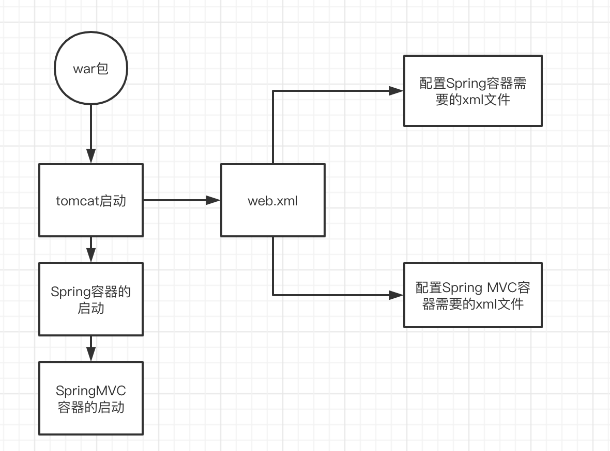
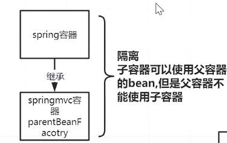
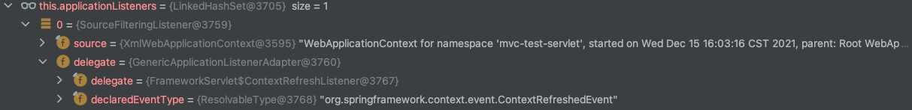
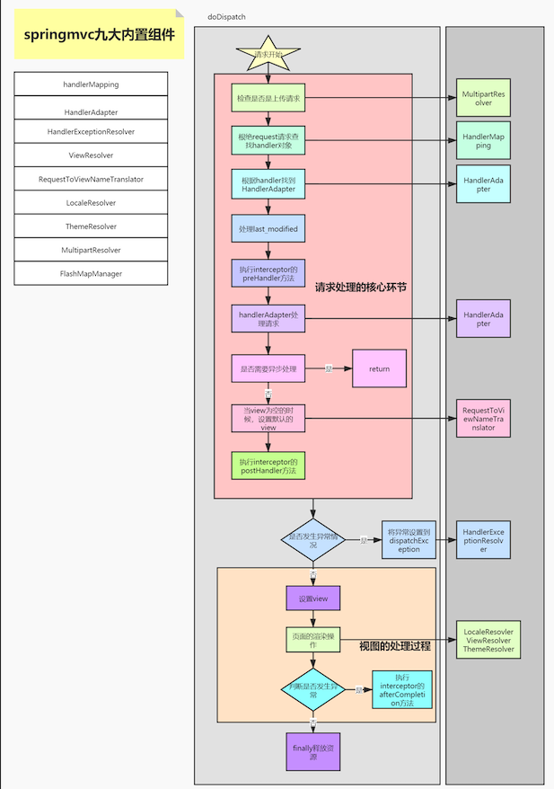
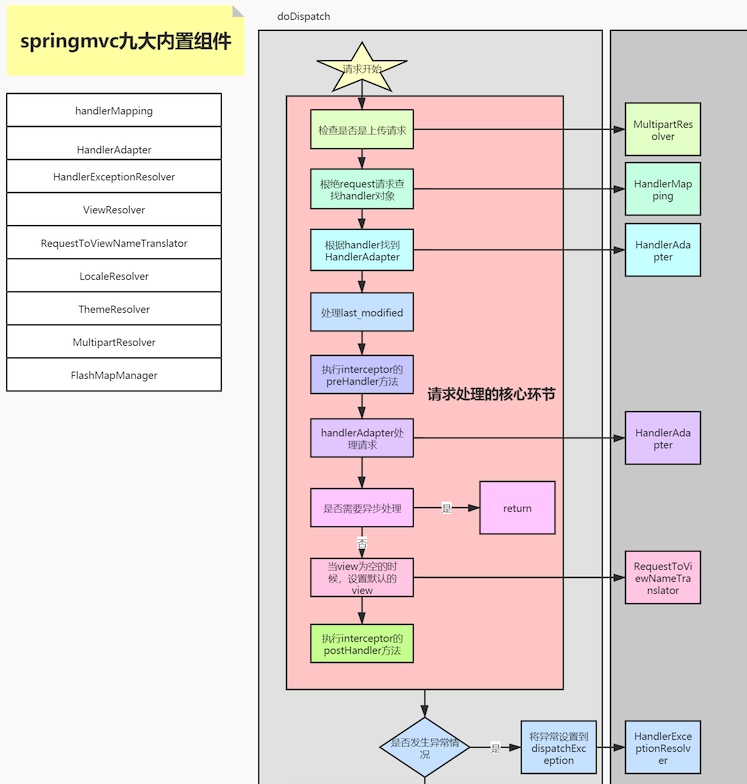
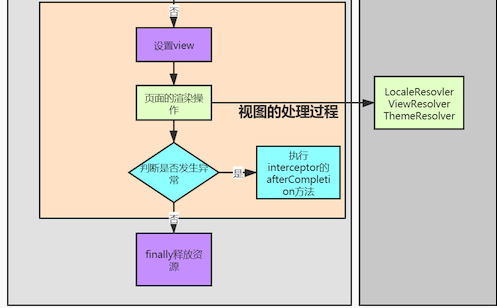
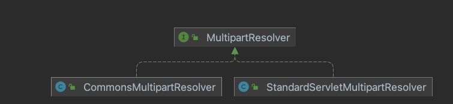
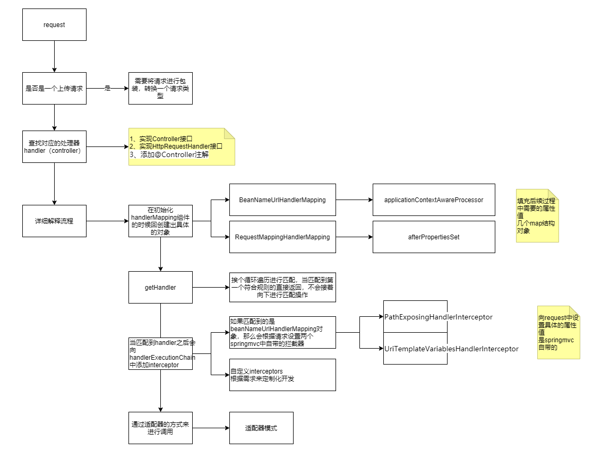
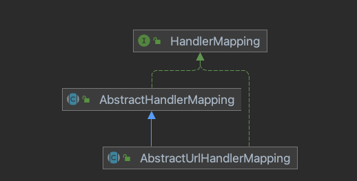
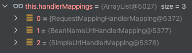

# SpringMVC源码


思考

Spring MVC 相当于在Spring框架上进行了扩展的工作，如果我们自己实现可以从哪里开始入手？

---

Spring 中有许多bean通过xml文件进行配置 new ClassPathXmlApplicationContext("text.xml");

那Spring MVC 中也需要它自己进行使用的bean 也需要xml进行配置

**容器隔离**

**父子容器**

在启动Spring MVC时需要把Spring容器先启动起来





Spring MVC的本质就是Servlet，Servlet的init方法读取配置文件 

**web.xml**

```xml
<!--Spring配置文件 给整个容器来进行使用的-->
<context-param>
  <param-name>contextConfigLocation</param-name>
  <param-value>classpath:spring-config.xml</param-value>
</context-param>

<servlet>
    <servlet-name>mvc-test</servlet-name>
    <servlet-class>org.springframework.web.servlet.DispatcherServlet</servlet-class>
    <!--SpringMVC配置文件 给servlet来进行使用的-->
    <init-param>
        <param-name>contextConfigLocation</param-name>
        <param-value>classpath:applicationContext.xml</param-value>
    </init-param>
  
    <load-on-startup>1</load-on-startup>
    <async-supported>true</async-supported>
</servlet>

 <servlet-mapping>
        <servlet-name>mvc-test</servlet-name>
        <url-pattern>/</url-pattern>
 </servlet-mapping>
<!--监听器，监听启动-->
<listener>
  <listener-class>
    org.springframework.web.context.ContextLoaderListener 
  </listener-class>
</listener>
</web-app>
```

## 启动Spring容器

**ContextLoaderListener**

```java
/**
 * Initialize the root web application context.
 */
@Override
public void contextInitialized(ServletContextEvent event) {
   initWebApplicationContext(event.getServletContext());
}


/**
 * Close the root web application context.
 */
@Override
public void contextDestroyed(ServletContextEvent event) {
   closeWebApplicationContext(event.getServletContext());// ->
   ContextCleanupListener.cleanupAttributes(event.getServletContext());
}
```

ContextLoaderListener父类**ContextLoader**

```java
public WebApplicationContext initWebApplicationContext(ServletContext servletContext) {

   try {
      // Store context in local instance variable, to guarantee that
      // it is available on ServletContext shutdown.
      if (this.context == null) {
				 // 初始化context，第一次执行的时候获取到一个root webApplicationcontext
         this.context = createWebApplicationContext(servletContext);// ->
      }
      if (this.context instanceof ConfigurableWebApplicationContext) {
         ConfigurableWebApplicationContext cwac = (ConfigurableWebApplicationContext) this.context;
         if (!cwac.isActive()) {
            // The context has not yet been refreshed -> provide services such as
            // setting the parent context, setting the application context id, etc
            if (cwac.getParent() == null) {
               // The context instance was injected without an explicit parent ->
               // determine parent for root web application context, if any.
               ApplicationContext parent = loadParentContext(servletContext);
               cwac.setParent(parent);
            }
            // refresh ->
            configureAndRefreshWebApplicationContext(cwac, servletContext);
         }
      }
      
// 创建并且准备好了spring容器
     servletContext.setAttribute(WebApplicationContext.ROOT_WEB_APPLICATION_CONTEXT_ATTRIBUTE, this.context);

      ClassLoader ccl = Thread.currentThread().getContextClassLoader();
      if (ccl == ContextLoader.class.getClassLoader()) {
         currentContext = this.context;
      }
      else if (ccl != null) {
         currentContextPerThread.put(ccl, this.context);
      }

      if (logger.isInfoEnabled()) {
         long elapsedTime = System.currentTimeMillis() - startTime;
         logger.info("Root WebApplicationContext initialized in " + elapsedTime + " ms");
      }

      return this.context;
   }
   catch (RuntimeException | Error ex) {
      logger.error("Context initialization failed", ex);
      servletContext.setAttribute(WebApplicationContext.ROOT_WEB_APPLICATION_CONTEXT_ATTRIBUTE, ex);
      throw ex;
   }
}
```

```java
protected WebApplicationContext createWebApplicationContext(ServletContext sc) {
   // 获取contextClass的Class对象
   Class<?> contextClass = determineContextClass(sc);
   // 如果是自定义的contextClass对象，那么必须要实现，ConfigurableWebApplicationContext接口，否则无法直接运行
   if (!ConfigurableWebApplicationContext.class.isAssignableFrom(contextClass)) {
      throw new ApplicationContextException("Custom context class [" + contextClass.getName() +
            "] is not of type [" + ConfigurableWebApplicationContext.class.getName() + "]");
   }
   return (ConfigurableWebApplicationContext) BeanUtils.instantiateClass(contextClass);
}
```

```java
protected Class<?> determineContextClass(ServletContext servletContext) {
   String contextClassName = servletContext.getInitParameter(CONTEXT_CLASS_PARAM);
   if (contextClassName != null) {
      try {
         // 反射创建对象
         return ClassUtils.forName(contextClassName, ClassUtils.getDefaultClassLoader());
      }
      catch (ClassNotFoundException ex) {
         throw new ApplicationContextException(
               "Failed to load custom context class [" + contextClassName + "]", ex);
      }
   }
   else {
      contextClassName = defaultStrategies.getProperty(WebApplicationContext.class.getName());
      try {
         return ClassUtils.forName(contextClassName, ContextLoader.class.getClassLoader());
      }
      catch (ClassNotFoundException ex) {
         throw new ApplicationContextException(
               "Failed to load default context class [" + contextClassName + "]", ex);
      }
   }
}
```


**configureAndRefreshWebApplicationContext**

```java
protected void configureAndRefreshWebApplicationContext(ConfigurableWebApplicationContext wac, ServletContext sc) {
   if (ObjectUtils.identityToString(wac).equals(wac.getId())) {
      // The application context id is still set to its original default value
      // -> assign a more useful id based on available information
      String idParam = sc.getInitParameter(CONTEXT_ID_PARAM);
      if (idParam != null) {
         wac.setId(idParam);
      }
      else {
         // Generate default id...
         wac.setId(ConfigurableWebApplicationContext.APPLICATION_CONTEXT_ID_PREFIX +
               ObjectUtils.getDisplayString(sc.getContextPath()));
      }
   }

   wac.setServletContext(sc);
   String configLocationParam = sc.getInitParameter(CONFIG_LOCATION_PARAM);
   if (configLocationParam != null) {
      wac.setConfigLocation(configLocationParam);
   }

   // The wac environment's #initPropertySources will be called in any case when the context
   // is refreshed; do it eagerly here to ensure servlet property sources are in place for
   // use in any post-processing or initialization that occurs below prior to #refresh
   ConfigurableEnvironment env = wac.getEnvironment();
   if (env instanceof ConfigurableWebEnvironment) {
      ((ConfigurableWebEnvironment) env).initPropertySources(sc, null);
   }

   customizeContext(sc, wac);
   // refresh ->
   wac.refresh();
}
```

**AbstractApplicationContext**

```java
@Override
public void refresh() throws BeansException, IllegalStateException {
   synchronized (this.startupShutdownMonitor) {
      // Prepare this context for refreshing.
      prepareRefresh();

      // Tell the subclass to refresh the internal bean factory.
      ConfigurableListableBeanFactory beanFactory = obtainFreshBeanFactory();

      // Prepare the bean factory for use in this context.
      prepareBeanFactory(beanFactory);

      try {
         // Allows post-processing of the bean factory in context subclasses.
         // -> Spring中是空实现，此处有实现
         postProcessBeanFactory(beanFactory);

         // Invoke factory processors registered as beans in the context.
         invokeBeanFactoryPostProcessors(beanFactory);

         // Register bean processors that intercept bean creation.
         registerBeanPostProcessors(beanFactory);

         // Initialize message source for this context.
         initMessageSource();

         // Initialize event multicaster for this context.
         initApplicationEventMulticaster();

         // Initialize other special beans in specific context subclasses.
         // mvc 加了初始化主题资源
         onRefresh();

         // Check for listener beans and register them.
         registerListeners();

         // Instantiate all remaining (non-lazy-init) singletons.
         finishBeanFactoryInitialization(beanFactory);

         // Last step: publish corresponding event.
         // ->
         finishRefresh();
      }

      catch (BeansException ex) {
         if (logger.isWarnEnabled()) {
            logger.warn("Exception encountered during context initialization - " +
                  "cancelling refresh attempt: " + ex);
         }

         // Destroy already created singletons to avoid dangling resources.
         destroyBeans();

         // Reset 'active' flag.
         cancelRefresh(ex);

         // Propagate exception to caller.
         throw ex;
      }

      finally {
         // Reset common introspection caches in Spring's core, since we
         // might not ever need metadata for singleton beans anymore...
         resetCommonCaches();
      }
   }
}
```

```java
protected void postProcessBeanFactory(ConfigurableListableBeanFactory beanFactory) {
   beanFactory.addBeanPostProcessor(new ServletContextAwareProcessor(this.servletContext, this.servletConfig));
   beanFactory.ignoreDependencyInterface(ServletContextAware.class);
   beanFactory.ignoreDependencyInterface(ServletConfigAware.class);

   WebApplicationContextUtils.registerWebApplicationScopes(beanFactory, this.servletContext);
   WebApplicationContextUtils.registerEnvironmentBeans(beanFactory, this.servletContext, this.servletConfig);
}
```

```java
protected void finishRefresh() {
   // Clear context-level resource caches (such as ASM metadata from scanning).
   clearResourceCaches();

   // Initialize lifecycle processor for this context.
   initLifecycleProcessor();

   // Propagate refresh to lifecycle processor first.
   getLifecycleProcessor().onRefresh();

   // Publish the final event.
   // 新建ContextRefreshedEvent事件对象，将其发布到所有监听器
   publishEvent(new ContextRefreshedEvent(this));// ->

   // Participate in LiveBeansView MBean, if active.
   LiveBeansView.registerApplicationContext(this);
}
```

```java
protected void publishEvent(Object event, @Nullable ResolvableType eventType) {
   Assert.notNull(event, "Event must not be null");

   // Decorate event as an ApplicationEvent if necessary
   ApplicationEvent applicationEvent;
   if (event instanceof ApplicationEvent) {
      applicationEvent = (ApplicationEvent) event;
   }
   else {
      applicationEvent = new PayloadApplicationEvent<>(this, event);
      if (eventType == null) {
         eventType = ((PayloadApplicationEvent<?>) applicationEvent).getResolvableType();
      }
   }

   // Multicast right now if possible - or lazily once the multicaster is initialized
   if (this.earlyApplicationEvents != null) {
      this.earlyApplicationEvents.add(applicationEvent);
   }
   else {
      // 多播到所有监听器集合 
      // ->
      getApplicationEventMulticaster().multicastEvent(applicationEvent, eventType);
   }

   // Publish event via parent context as well...
   if (this.parent != null) {
      if (this.parent instanceof AbstractApplicationContext) {
         ((AbstractApplicationContext) this.parent).publishEvent(event, eventType);
      }
      else {
         this.parent.publishEvent(event);
      }
   }
}
```

```java
@Override
public void multicastEvent(final ApplicationEvent event, @Nullable ResolvableType eventType) {
   ResolvableType type = (eventType != null ? eventType : resolveDefaultEventType(event));
   Executor executor = getTaskExecutor();
   for (ApplicationListener<?> listener : getApplicationListeners(event, type)) {
      if (executor != null) {
         executor.execute(() -> invokeListener(listener, event));
      }
      else {
         invokeListener(listener, event);
      }
   }
}
```

## 启动Spring MVC容器

### DispatcherServlet

tomcat自动调用DispatcherServlet的构造方法

然后执行DispatcherServlet中的init方法

找到父类HttpServletBean中的init方法

```java
public final void init() throws ServletException {

   // Set bean properties from init parameters.
   // 将servlet中配置的init-param参数封装到pvs变量中
   /** <init-param>
      	<param-name>contextConfigLocation</param-name>
      	<param-value>/WEB-INF/applicationContext.xml</param-value>
    	</init-param>
   **/
   PropertyValues pvs = new ServletConfigPropertyValues(getServletConfig(), this.requiredProperties);
   if (!pvs.isEmpty()) {
      try {
         // 包装类，spring中的核心接口，是Spring中的一个包装类，具有单独或者批量获取和设置属性值，获取属性描述符以及查询属性可读可写的能力，还可以完成类型转化
         BeanWrapper bw = PropertyAccessorFactory.forBeanPropertyAccess(this);
         ResourceLoader resourceLoader = new ServletContextResourceLoader(getServletContext());
         // 注册自定义属性编辑器，一旦有Resource类型的属性，会使用ResourceEditor进行解析
         bw.registerCustomEditor(Resource.class, new ResourceEditor(resourceLoader, getEnvironment()));
         // 模板方法，可以在子类调用，做一些初始化工作，bw代表的是DispatcherServlet
         initBeanWrapper(bw);
         // 以Spring的方式来将pvs注入到该beanWrapper对象中，将配置的初始化值设置到DispatcherServlet
         bw.setPropertyValues(pvs, true);
      }
      catch (BeansException ex) {
         if (logger.isErrorEnabled()) {
            logger.error("Failed to set bean properties on servlet '" + getServletName() + "'", ex);
         }
         throw ex;
      }
   }

   // Let subclasses do whatever initialization they like.
   // 模板方法，子类初始化的入口方法
   initServletBean();// ->
}
```


```java
protected final void initServletBean() throws ServletException {
   getServletContext().log("Initializing Spring " + getClass().getSimpleName() + " '" + getServletName() + "'");
   if (logger.isInfoEnabled()) {
      logger.info("Initializing Servlet '" + getServletName() + "'");
   }
   long startTime = System.currentTimeMillis();

   try {
      // 创建或刷新WebApplicationContext实例并对Servlet功能所使用的变量进行初始化
      this.webApplicationContext = initWebApplicationContext();// ->
      initFrameworkServlet();
   }
   catch (ServletException | RuntimeException ex) {
      logger.error("Context initialization failed", ex);
      throw ex;
   }

   if (logger.isDebugEnabled()) {
      String value = this.enableLoggingRequestDetails ?
            "shown which may lead to unsafe logging of potentially sensitive data" :
            "masked to prevent unsafe logging of potentially sensitive data";
      logger.debug("enableLoggingRequestDetails='" + this.enableLoggingRequestDetails +
            "': request parameters and headers will be " + value);
   }

   if (logger.isInfoEnabled()) {
      logger.info("Completed initialization in " + (System.currentTimeMillis() - startTime) + " ms");
   }
}
```

```java
protected WebApplicationContext initWebApplicationContext() {
   // 获取根webApplicationContext对象
   WebApplicationContext rootContext =
         WebApplicationContextUtils.getWebApplicationContext(getServletContext());
   // 获取webApplicationContext wac对象
   WebApplicationContext wac = null;

   // 如果构造方法中已经传入了webApplicationContext属性，则可以直接使用
   if (this.webApplicationContext != null) {
      // A context instance was injected at construction time -> use it
      wac = this.webApplicationContext;
      if (wac instanceof ConfigurableWebApplicationContext) {
         ConfigurableWebApplicationContext cwac = (ConfigurableWebApplicationContext) wac;
         if (!cwac.isActive()) {
            // The context has not yet been refreshed -> provide services such as
            // setting the parent context, setting the application context id, etc
            if (cwac.getParent() == null) {
               // The context instance was injected without an explicit parent -> set
               // the root application context (if any; may be null) as the parent
               cwac.setParent(rootContext);
            }
            configureAndRefreshWebApplicationContext(cwac);
         }
      }
   }
   if (wac == null) {
      // No context instance was injected at construction time -> see if one
      // has been registered in the servlet context. If one exists, it is assumed
      // that the parent context (if any) has already been set and that the
      // user has performed any initialization such as setting the context id
      wac = findWebApplicationContext();
   }
   if (wac == null) {
      // No context instance is defined for this servlet -> create a local one
      // 
      wac = createWebApplicationContext(rootContext);// ->
   }

   if (!this.refreshEventReceived) {
      // Either the context is not a ConfigurableApplicationContext with refresh
      // support or the context injected at construction time had already been
      // refreshed -> trigger initial onRefresh manually here.
      synchronized (this.onRefreshMonitor) {
         onRefresh(wac);
      }
   }

   if (this.publishContext) {
      // Publish the context as a servlet context attribute.
      String attrName = getServletContextAttributeName();
      getServletContext().setAttribute(attrName, wac);
   }

   return wac;
}
```

**createWebApplicationContext**

```java
protected WebApplicationContext createWebApplicationContext(@Nullable ApplicationContext parent) {
   Class<?> contextClass = getContextClass();
   if (!ConfigurableWebApplicationContext.class.isAssignableFrom(contextClass)) {
      throw new ApplicationContextException(
            "Fatal initialization error in servlet with name '" + getServletName() +
            "': custom WebApplicationContext class [" + contextClass.getName() +
            "] is not of type ConfigurableWebApplicationContext");
   }
   ConfigurableWebApplicationContext wac =
         (ConfigurableWebApplicationContext) BeanUtils.instantiateClass(contextClass);

   wac.setEnvironment(getEnvironment());
   // 设置父容器spring
   wac.setParent(parent);
   String configLocation = getContextConfigLocation();
   if (configLocation != null) {
      wac.setConfigLocation(configLocation);
   }
   // 配置和初始化wac WebApplicationContext
   configureAndRefreshWebApplicationContext(wac); // ->

   return wac;
}
```

   **configureAndRefreshWebApplicationContext**(wac);

```java
protected void configureAndRefreshWebApplicationContext(ConfigurableWebApplicationContext wac) {
   if (ObjectUtils.identityToString(wac).equals(wac.getId())) {
      // The application context id is still set to its original default value
      // -> assign a more useful id based on available information
      if (this.contextId != null) {
         wac.setId(this.contextId);
      }
      else {
         // Generate default id...
         wac.setId(ConfigurableWebApplicationContext.APPLICATION_CONTEXT_ID_PREFIX +
               ObjectUtils.getDisplayString(getServletContext().getContextPath()) + '/' + getServletName());
      }
   }
	 // 属性设置
   wac.setServletContext(getServletContext());
   wac.setServletConfig(getServletConfig());
   wac.setNamespace(getNamespace());
   // 添加监听器sourceFilteringListener到wac中,实际监听的是ContextRefreshListener所监听的事件，监听ContextRefreshedEvent事件，
	 // 当接收到消息之后会调用onApplicationEvent方法，调用onRefresh方法，并将refreshEventReceived标志设置为true，表示已经refresh过
		
   wac.addApplicationListener(new SourceFilteringListener(wac, new ContextRefreshListener()));

   // The wac environment's #initPropertySources will be called in any case when the context
   // is refreshed; do it eagerly here to ensure servlet property sources are in place for
   // use in any post-processing or initialization that occurs below prior to #refresh
   ConfigurableEnvironment env = wac.getEnvironment();
   if (env instanceof ConfigurableWebEnvironment) {
      ((ConfigurableWebEnvironment) env).initPropertySources(getServletContext(), getServletConfig());
   }
	 // 空实现留给后续扩展
   postProcessWebApplicationContext(wac);
   applyInitializers(wac);
   wac.refresh();// ->
}
```

**refresh**

```java
public void refresh() throws BeansException, IllegalStateException {
   synchronized (this.startupShutdownMonitor) {
      // Prepare this context for refreshing.
      prepareRefresh();

      // Tell the subclass to refresh the internal bean factory.
      ConfigurableListableBeanFactory beanFactory = obtainFreshBeanFactory();

      // Prepare the bean factory for use in this context.
      prepareBeanFactory(beanFactory);

      try {
         // Allows post-processing of the bean factory in context subclasses.
         postProcessBeanFactory(beanFactory);

         // Invoke factory processors registered as beans in the context.
         invokeBeanFactoryPostProcessors(beanFactory);

         // Register bean processors that intercept bean creation.
         registerBeanPostProcessors(beanFactory);

         // Initialize message source for this context.
         initMessageSource();

         // Initialize event multicaster for this context.
         initApplicationEventMulticaster();

         // Initialize other special beans in specific context subclasses.
         onRefresh();

         // Check for listener beans and register them.
         registerListeners();

         // Instantiate all remaining (non-lazy-init) singletons.
         finishBeanFactoryInitialization(beanFactory);

         // Last step: publish corresponding event.
         finishRefresh();// ->
      }

      catch (BeansException ex) {
         if (logger.isWarnEnabled()) {
            logger.warn("Exception encountered during context initialization - " +
                  "cancelling refresh attempt: " + ex);
         }

         // Destroy already created singletons to avoid dangling resources.
         destroyBeans();

         // Reset 'active' flag.
         cancelRefresh(ex);

         // Propagate exception to caller.
         throw ex;
      }

      finally {
         // Reset common introspection caches in Spring's core, since we
         // might not ever need metadata for singleton beans anymore...
         resetCommonCaches();
      }
   }
}
```

**prepareRefresh**

```java
protected void prepareRefresh() {
   // Switch to active.
   this.startupDate = System.currentTimeMillis();
   this.closed.set(false);
   this.active.set(true);

   if (logger.isDebugEnabled()) {
      if (logger.isTraceEnabled()) {
         logger.trace("Refreshing " + this);
      }
      else {
         logger.debug("Refreshing " + getDisplayName());
      }
   }

   // Initialize any placeholder property sources in the context environment.
   initPropertySources();

   // Validate that all properties marked as required are resolvable:
   // see ConfigurablePropertyResolver#setRequiredProperties
   getEnvironment().validateRequiredProperties();

   // Store pre-refresh ApplicationListeners...
   // 将监听器加入到此集合之中如图
   if (this.earlyApplicationListeners == null) {
      this.earlyApplicationListeners = new LinkedHashSet<>(this.applicationListeners);
   }
   else {
      // Reset local application listeners to pre-refresh state.
      this.applicationListeners.clear();
      this.applicationListeners.addAll(this.earlyApplicationListeners);
   }

   // Allow for the collection of early ApplicationEvents,
   // to be published once the multicaster is available...
   // 创建刷新前的监听时间集合
   this.earlyApplicationEvents = new LinkedHashSet<>();
}
```



**finishRefresh**

```java
protected void finishRefresh() {
   // Clear context-level resource caches (such as ASM metadata from scanning).
   clearResourceCaches();

   // Initialize lifecycle processor for this context.
   initLifecycleProcessor();

   // Propagate refresh to lifecycle processor first.
   getLifecycleProcessor().onRefresh();

   // Publish the final event.
   // 发布事件到所有监听器 -> 
   publishEvent(new ContextRefreshedEvent(this));

   // Participate in LiveBeansView MBean, if active.
   LiveBeansView.registerApplicationContext(this);
}
```

```java
protected void publishEvent(Object event, @Nullable ResolvableType eventType) {
   Assert.notNull(event, "Event must not be null");

   // Decorate event as an ApplicationEvent if necessary
   ApplicationEvent applicationEvent;
   if (event instanceof ApplicationEvent) {
      applicationEvent = (ApplicationEvent) event;
   }
   else {
      applicationEvent = new PayloadApplicationEvent<>(this, event);
      if (eventType == null) {
         eventType = ((PayloadApplicationEvent<?>) applicationEvent).getResolvableType();
      }
   }

   // Multicast right now if possible - or lazily once the multicaster is initialized
   if (this.earlyApplicationEvents != null) {
      this.earlyApplicationEvents.add(applicationEvent);
   }
   else {
      // 多播ApplicationEvent到合适的监听器
      // ->
      getApplicationEventMulticaster().multicastEvent(applicationEvent, eventType);
   }

   // Publish event via parent context as well...
   if (this.parent != null) {
      if (this.parent instanceof AbstractApplicationContext) {
         ((AbstractApplicationContext) this.parent).publishEvent(event, eventType);
      }
      else {
         this.parent.publishEvent(event);
      }
   }
}
```

```java
public void multicastEvent(final ApplicationEvent event, @Nullable ResolvableType eventType) {
   ResolvableType type = (eventType != null ? eventType : resolveDefaultEventType(event));
   Executor executor = getTaskExecutor();
   // 遍历获取所有支持event的监听器
   for (ApplicationListener<?> listener : getApplicationListeners(event, type)) {
      if (executor != null) {
         executor.execute(() -> invokeListener(listener, event));
      }
      else {
         invokeListener(listener, event);// ->
      }
   }
}
```

```java
protected void invokeListener(ApplicationListener<?> listener, ApplicationEvent event) {
   ErrorHandler errorHandler = getErrorHandler();
   if (errorHandler != null) {
      try {
         doInvokeListener(listener, event);
      }
      catch (Throwable err) {
         errorHandler.handleError(err);
      }
   }
   else {
      doInvokeListener(listener, event);// ->
   }
}
```

```java
private void doInvokeListener(ApplicationListener listener, ApplicationEvent event) {
   try {
      listener.onApplicationEvent(event);// —>
   }
   catch (ClassCastException ex) {
      String msg = ex.getMessage();
      if (msg == null || matchesClassCastMessage(msg, event.getClass())) {
         // Possibly a lambda-defined listener which we could not resolve the generic event type for
         // -> let's suppress the exception and just log a debug message.
         Log logger = LogFactory.getLog(getClass());
         if (logger.isTraceEnabled()) {
            logger.trace("Non-matching event type for listener: " + listener, ex);
         }
      }
      else {
         throw ex;
      }
   }
}
```

```java
public void onApplicationEvent(ContextRefreshedEvent event) {
   this.refreshEventReceived = true;
   synchronized (this.onRefreshMonitor) {
      onRefresh(event.getApplicationContext());// ->
   }
}
```

```java
protected void onRefresh(ApplicationContext context) {
   initStrategies(context);// ->
}
```

springMVC 九大初始化策略

```java
protected void initStrategies(ApplicationContext context) {
   // 主要用来处理文件上传，如果没有定义为空值
   initMultipartResolver(context);
   // 国际化操作，如果没有定义执行默认策略
   initLocaleResolver(context);
   // 设置主题
   initThemeResolver(context);
   // 初始化 HandlerMapping 映射器，用来将request和controller进行对应
   initHandlerMappings(context);
   // HandlerAdapter 处理适配器，主要包含Http请求处理器适配器，简单控制处理器适配器，注解方法处理器适配器
   initHandlerAdapters(context);
   // HandlerException 接口异常处理
   initHandlerExceptionResolvers(context);
	// 初始化 RequestToViewNameTranslator:当controller处理器方法没有返回一个View对象或逻辑视图名称，并且在该方法中没有直接往response的输出流里面写数据的时候，spring将会采用约定好的方式提供一个逻辑视图名称
		initRequestToViewNameTranslator(context);
		// 初始化 ViewResolver: 将ModelAndView选择合适的视图进行渲染的处理器
		initViewResolvers(context);
		// 初始化 FlashMapManager: 提供请求存储属性，可供其他请求使用
		initFlashMapManager(context);
}
```

 **initMultipartResolver(context);**

```java
private void initMultipartResolver(ApplicationContext context) {
   try {
      // 从一级缓存里获取对象multipartResolver，如果一级缓存中没有的话去找父容器
      this.multipartResolver = context.getBean(MULTIPART_RESOLVER_BEAN_NAME, MultipartResolver.class);
      if (logger.isTraceEnabled()) {
         logger.trace("Detected " + this.multipartResolver);
      }
      else if (logger.isDebugEnabled()) {
         logger.debug("Detected " + this.multipartResolver.getClass().getSimpleName());
      }
   }
   catch (NoSuchBeanDefinitionException ex) {
      // Default is no multipart resolver.
      this.multipartResolver = null;
      if (logger.isTraceEnabled()) {
         logger.trace("No MultipartResolver '" + MULTIPART_RESOLVER_BEAN_NAME + "' declared");
      }
   }
}
```

至此所有容器准备完成，等待请求进来

## 请求执行总流程







```java
@Override
protected void service(HttpServletRequest request, HttpServletResponse response)
      throws ServletException, IOException {

   HttpMethod httpMethod = HttpMethod.resolve(request.getMethod());
   // httpMethod 是get请求，处理patch请求
   if (httpMethod == HttpMethod.PATCH || httpMethod == null) {
      processRequest(request, response);
   }
   else {
      // 处理其他类型的请求
      super.service(request, response);
   }
}
```

**doGet**

```java
@Override
protected final void doGet(HttpServletRequest request, HttpServletResponse response)
      throws ServletException, IOException {

   processRequest(request, response);// ->
}
```

**processRequest**

```java
protected final void processRequest(HttpServletRequest request, HttpServletResponse response)
      throws ServletException, IOException {
	 // 记录时间
   long startTime = System.currentTimeMillis();
   // 记录异常
   Throwable failureCause = null;
   // 
   LocaleContext previousLocaleContext = LocaleContextHolder.getLocaleContext();
   LocaleContext localeContext = buildLocaleContext(request);
   // 获取当前请求的ServletRequestAttributes
   RequestAttributes previousAttributes = RequestContextHolder.getRequestAttributes();
   ServletRequestAttributes requestAttributes = buildRequestAttributes(request, response, previousAttributes);
	 // 获取异步管理器
   WebAsyncManager asyncManager = WebAsyncUtils.getAsyncManager(request);
   asyncManager.registerCallableInterceptor(FrameworkServlet.class.getName(), new RequestBindingInterceptor());
   // 将上边的属性设置到，LocalContextHolder 和 RequestContextHoler
   initContextHolders(request, localeContext, requestAttributes);

   try {
      // 执行真正的逻辑
      doService(request, response); // ->
   }
   catch (ServletException | IOException ex) {
      // 记录抛出的异常
      failureCause = ex;
      throw ex;
   }
   catch (Throwable ex) {
      // 记录抛出的异常
      failureCause = ex;
      throw new NestedServletException("Request processing failed", ex);
   }

   finally {
      resetContextHolders(request, previousLocaleContext, previousAttributes);
      if (requestAttributes != null) {
         requestAttributes.requestCompleted();
      }
      logResult(request, response, failureCause, asyncManager);
      publishRequestHandledEvent(request, response, startTime, failureCause);
   }
}
```

**doService**

```java
protected void doService(HttpServletRequest request, HttpServletResponse response) throws Exception {
   // 如果日志级别为DEBUG，则打印请求日志 
   logRequest(request);

   // Keep a snapshot of the request attributes in case of an include,
   // to be able to restore the original attributes after the include.
   Map<String, Object> attributesSnapshot = null;
   if (WebUtils.isIncludeRequest(request)) {
      attributesSnapshot = new HashMap<>();
      Enumeration<?> attrNames = request.getAttributeNames();
      while (attrNames.hasMoreElements()) {
         String attrName = (String) attrNames.nextElement();
         if (this.cleanupAfterInclude || attrName.startsWith(DEFAULT_STRATEGIES_PREFIX)) {
            attributesSnapshot.put(attrName, request.getAttribute(attrName));
         }
      }
   }

   // Make framework objects available to handlers and view objects.
   // 设置Spring框架中的常用对象到request属性中，这四个属性都会在handler和view中使用
   request.setAttribute(WEB_APPLICATION_CONTEXT_ATTRIBUTE, getWebApplicationContext());
   request.setAttribute(LOCALE_RESOLVER_ATTRIBUTE, this.localeResolver);
   request.setAttribute(THEME_RESOLVER_ATTRIBUTE, this.themeResolver);
   request.setAttribute(THEME_SOURCE_ATTRIBUTE, getThemeSource());

   // 重定向时方便进行传递
   if (this.flashMapManager != null) {
      FlashMap inputFlashMap = this.flashMapManager.retrieveAndUpdate(request, response);
      if (inputFlashMap != null) {
         request.setAttribute(INPUT_FLASH_MAP_ATTRIBUTE, Collections.unmodifiableMap(inputFlashMap));
      }
      request.setAttribute(OUTPUT_FLASH_MAP_ATTRIBUTE, new FlashMap());
      request.setAttribute(FLASH_MAP_MANAGER_ATTRIBUTE, this.flashMapManager);
   }

   try {
      // 执行请求的分发
      doDispatch(request, response);// ->
   }
   finally {
      if (!WebAsyncUtils.getAsyncManager(request).isConcurrentHandlingStarted()) {
         // Restore the original attribute snapshot, in case of an include.
         if (attributesSnapshot != null) {
            restoreAttributesAfterInclude(request, attributesSnapshot);
         }
      }
   }
}
```

### 1 doDispatch

```java
protected void doDispatch(HttpServletRequest request, HttpServletResponse response) throws Exception {
   // 实际处理时所用的request 
   HttpServletRequest processedRequest = request;
   // 处理请求的处理器链
   HandlerExecutionChain mappedHandler = null;
   // 是不是上传请求的标志
   boolean multipartRequestParsed = false;

   // 获取异步管理器
   WebAsyncManager asyncManager = WebAsyncUtils.getAsyncManager(request);

   try {
      // 封装model和view的容器
      ModelAndView mv = null;
      // 处理请求中抛出的异常，但是不包含渲染过程中抛出的异常
      Exception dispatchException = null;

      try {
         // 检查是否是上传请求
         processedRequest = checkMultipart(request);// -> 1.1
         // 设置上传请求标识
         multipartRequestParsed = (processedRequest != request);

         // Determine handler for the current request.
         // 获取请求对应的HandlerExceptionChain对象
         mappedHandler = getHandler(processedRequest); // -> 1.2
         // 如果获取不到，根据配置抛出异常或返回404错误 
         if (mappedHandler == null) {
            noHandlerFound(processedRequest, response);
            return;
         }

         // Determine handler adapter for the current request.
         // 根据mappedHandler获取对应的HandlerAdapter对象
         HandlerAdapter ha = getHandlerAdapter(mappedHandler.getHandler());

         // Process last-modified header, if supported by the handler.
         // 处理GET、HEAD请求的Last-Modified,当浏览器第一次跟服务器请求资源时，服务器会在返回的请求头里包含一个last_modified的属性，
				 // 代表资源最后时什么时候修改的，在浏览器以后发送请求的时候，会同时发送之前接收到的Last_modified.服务器接收到带last_modified的请求后，
				 // 会跟实际资源的最后修改时间做对比，如果过期了返回新的资源，否则直接返回304表示未过期，直接使用之前缓存的结果即可
				
         String method = request.getMethod();
         boolean isGet = "GET".equals(method);
         if (isGet || "HEAD".equals(method)) {
            long lastModified = ha.getLastModified(request, mappedHandler.getHandler());
            if (new ServletWebRequest(request, response).checkNotModified(lastModified) && isGet) {
               return;
            }
         }
				 // 拦截器的前置处理
         if (!mappedHandler.applyPreHandle(processedRequest, response)) {
            return;
         }

         // Actually invoke the handler.
         // 真正调用handler方法，也就是执行对应的方法，并返回视图
         mv = ha.handle(processedRequest, response, mappedHandler.getHandler());

         // 如果需要异步处理，直接返回
         if (asyncManager.isConcurrentHandlingStarted()) {
            return;
         }
				 // 设置默认的view
         applyDefaultViewName(processedRequest, mv);
         // 执行相应interceptor的postHandler方法
         mappedHandler.applyPostHandle(processedRequest, response, mv);
      }
      catch (Exception ex) {
         dispatchException = ex;
      }
      catch (Throwable err) {
         // As of 4.3, we're processing Errors thrown from handler methods as well,
         // making them available for @ExceptionHandler methods and other scenarios.
         dispatchException = new NestedServletException("Handler dispatch failed", err);
      }
      // 处理返回结果，包括处理异常，渲染页面
      processDispatchResult(processedRequest, response, mappedHandler, mv, dispatchException);
   }
   catch (Exception ex) {
      triggerAfterCompletion(processedRequest, response, mappedHandler, ex);
   }
   catch (Throwable err) {
      triggerAfterCompletion(processedRequest, response, mappedHandler,
            new NestedServletException("Handler processing failed", err));
   }
   finally {
      if (asyncManager.isConcurrentHandlingStarted()) {
         // Instead of postHandle and afterCompletion
         if (mappedHandler != null) {
            mappedHandler.applyAfterConcurrentHandlingStarted(processedRequest, response);
         }
      }
      else {
         // Clean up any resources used by a multipart request.
         if (multipartRequestParsed) {
            cleanupMultipart(processedRequest);
         }
      }
   }
}
```

#### 1.1 MultipartResolver

处理上传文件请求的接口

```java
public interface MultipartResolver {

   // 判断是否是上传请求
   boolean isMultipart(HttpServletRequest request);

   // 将request请求包装成 MultipartHttpServletRequest
   MultipartHttpServletRequest resolveMultipart(HttpServletRequest request) throws MultipartException;

   // 清除上传的资源
   void cleanupMultipart(MultipartHttpServletRequest request);

}
```

最常用的两个实现类



左边最常用

---

继续doDispatch中的**checkMultipart**

```java
protected HttpServletRequest checkMultipart(HttpServletRequest request) throws MultipartException {
   // 如果该请求是一个涉及到mutipart（文件）的请求 
   if (this.multipartResolver != null && this.multipartResolver.isMultipart(request)) {
      if (WebUtils.getNativeRequest(request, MultipartHttpServletRequest.class) != null) {
         if (request.getDispatcherType().equals(DispatcherType.REQUEST)) {
            logger.trace("Request already resolved to MultipartHttpServletRequest, e.g. by MultipartFilter");
         }
      }
      else if (hasMultipartException(request)) {
         logger.debug("Multipart resolution previously failed for current request - " +
               "skipping re-resolution for undisturbed error rendering");
      }
      else {
         try {
            // 将HttpServletRequest 请求封装成 MultipartHttpServletRequest对象，解析里面的请求参数及文件
            return this.multipartResolver.resolveMultipart(request);// ->
         }
         catch (MultipartException ex) {
            if (request.getAttribute(WebUtils.ERROR_EXCEPTION_ATTRIBUTE) != null) {
               logger.debug("Multipart resolution failed for error dispatch", ex);
               // Keep processing error dispatch with regular request handle below
            }
            else {
               throw ex;
            }
         }
      }
   }
   // If not returned before: return original request.
   return request;
}
```

**resolveMultipart**

```java
public MultipartHttpServletRequest resolveMultipart(final HttpServletRequest request) throws MultipartException {
   Assert.notNull(request, "Request must not be null");
   // 懒加载，如果为true只有会在实际调用的时候才会加载
   if (this.resolveLazily) {
      return new DefaultMultipartHttpServletRequest(request) {
         @Override
         protected void initializeMultipart() {
            MultipartParsingResult parsingResult = parseRequest(request);
            setMultipartFiles(parsingResult.getMultipartFiles());
            setMultipartParameters(parsingResult.getMultipartParameters());
            setMultipartParameterContentTypes(parsingResult.getMultipartParameterContentTypes());
         }
      };
   }
   else {
      // 解析请求 ->
      MultipartParsingResult parsingResult = parseRequest(request);
      return new DefaultMultipartHttpServletRequest(request, parsingResult.getMultipartFiles(),
            parsingResult.getMultipartParameters(), parsingResult.getMultipartParameterContentTypes());
   }
}
```

**parseRequest**

```java
protected MultipartParsingResult parseRequest(HttpServletRequest request) throws MultipartException {
   // 获取当前请求的编码
   String encoding = determineEncoding(request);
   // 根据请求的编码，获取一个FileUpload对象 
   FileUpload fileUpload = prepareFileUpload(encoding);
   try {
      // 对请求中的multipart文件进行具体的处理
      List<FileItem> fileItems = ((ServletFileUpload) fileUpload).parseRequest(request);
      return parseFileItems(fileItems, encoding);
   }
   catch (FileUploadBase.SizeLimitExceededException ex) {
      throw new MaxUploadSizeExceededException(fileUpload.getSizeMax(), ex);
   }
   catch (FileUploadBase.FileSizeLimitExceededException ex) {
      throw new MaxUploadSizeExceededException(fileUpload.getFileSizeMax(), ex);
   }
   catch (FileUploadException ex) {
      throw new MultipartException("Failed to parse multipart servlet request", ex);
   }
}
```

#### 1.2  HandlerMapping

用来匹配对应的controller



接口

```java
public interface HandlerMapping {

		HandlerExecutionChain getHandler(HttpServletRequest request) throws Exception;

}
```



---



根据url能够找到对应的controller

```java
protected HandlerExecutionChain getHandler(HttpServletRequest request) throws Exception {
   if (this.handlerMappings != null) {
      // 3个 
      for (HandlerMapping mapping : this.handlerMappings) {
         
         HandlerExecutionChain handler = mapping.getHandler(request);// ->
         // 取到一个就停止 
         if (handler != null) {
            return handler;
         }
      }
   }
   return null;
}
```

```java
public final HandlerExecutionChain getHandler(HttpServletRequest request) throws Exception {
   Object handler = getHandlerInternal(request);// ->
   if (handler == null) {
      handler = getDefaultHandler();
   }
   if (handler == null) {
      return null;
   }
   // Bean name or resolved handler?
   if (handler instanceof String) {
      String handlerName = (String) handler;
      handler = obtainApplicationContext().getBean(handlerName);
   }
	 // 创建包含处理器handler和拦截器interceptor的对象
   HandlerExecutionChain executionChain = getHandlerExecutionChain(handler, request);

   if (logger.isTraceEnabled()) {
      logger.trace("Mapped to " + handler);
   }
   else if (logger.isDebugEnabled() && !request.getDispatcherType().equals(DispatcherType.ASYNC)) {
      logger.debug("Mapped to " + executionChain.getHandler());
   }

   if (hasCorsConfigurationSource(handler) || CorsUtils.isPreFlightRequest(request)) {
      CorsConfiguration config = (this.corsConfigurationSource != null ? this.corsConfigurationSource.getCorsConfiguration(request) : null);
      CorsConfiguration handlerConfig = getCorsConfiguration(handler, request);
      config = (config != null ? config.combine(handlerConfig) : handlerConfig);
      executionChain = getCorsHandlerExecutionChain(request, executionChain, config);
   }

   return executionChain;
}
```

```java
@Override
protected HandlerMethod getHandlerInternal(HttpServletRequest request) throws Exception {
   request.removeAttribute(PRODUCIBLE_MEDIA_TYPES_ATTRIBUTE);
   try {
      return super.getHandlerInternal(request); // ->
   }
   finally {
      ProducesRequestCondition.clearMediaTypesAttribute(request);
   }
}
```

```java
protected HandlerMethod getHandlerInternal(HttpServletRequest request) throws Exception {
   // 获取访问路径
   String lookupPath = getUrlPathHelper().getLookupPathForRequest(request);
   request.setAttribute(LOOKUP_PATH, lookupPath);
   // 获取读锁 
   this.mappingRegistry.acquireReadLock();
   try {
      // 找到需要处理的方法
      HandlerMethod handlerMethod = lookupHandlerMethod(lookupPath, request);// ->
      return (handlerMethod != null ? handlerMethod.createWithResolvedBean() : null);
   }
   finally {
      this.mappingRegistry.releaseReadLock();
   }
}
```

```java
protected HandlerMethod lookupHandlerMethod(String lookupPath, HttpServletRequest request) throws Exception {
   List<Match> matches = new ArrayList<>();
   // 获取到匹配条件
   List<T> directPathMatches = this.mappingRegistry.getMappingsByUrl(lookupPath);
   if (directPathMatches != null) {
      addMatchingMappings(directPathMatches, matches, request);
   }
   if (matches.isEmpty()) {
      // No choice but to go through all mappings...
      addMatchingMappings(this.mappingRegistry.getMappings().keySet(), matches, request);
   }

   if (!matches.isEmpty()) {
      Match bestMatch = matches.get(0);
      if (matches.size() > 1) {
         Comparator<Match> comparator = new MatchComparator(getMappingComparator(request));
         matches.sort(comparator);
         bestMatch = matches.get(0);
         if (logger.isTraceEnabled()) {
            logger.trace(matches.size() + " matching mappings: " + matches);
         }
         if (CorsUtils.isPreFlightRequest(request)) {
            return PREFLIGHT_AMBIGUOUS_MATCH;
         }
         Match secondBestMatch = matches.get(1);
         if (comparator.compare(bestMatch, secondBestMatch) == 0) {
            Method m1 = bestMatch.handlerMethod.getMethod();
            Method m2 = secondBestMatch.handlerMethod.getMethod();
            String uri = request.getRequestURI();
            throw new IllegalStateException(
                  "Ambiguous handler methods mapped for '" + uri + "': {" + m1 + ", " + m2 + "}");
         }
      }
      request.setAttribute(BEST_MATCHING_HANDLER_ATTRIBUTE, bestMatch.handlerMethod);
      handleMatch(bestMatch.mapping, lookupPath, request);
      return bestMatch.handlerMethod;
   }
   else {
      return handleNoMatch(this.mappingRegistry.getMappings().keySet(), lookupPath, request);
   }
}
```
