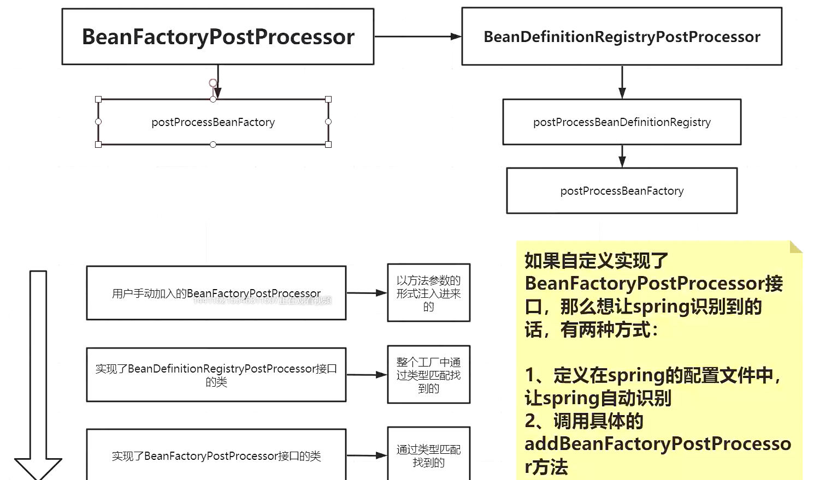
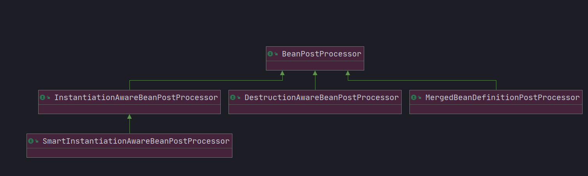
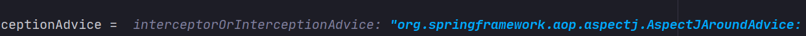

# Spring源码


## Bean的创建过程BeanFactory

1.经历一堆XXXAware，把Bean需要的Spring组件给bean，通过setXX方法

2.BeanPostProcessors 中的postProcessBeforeInitialization

3.IntializingBean 调用init方法

4.init-method 用户自定义的方法

5.BeanPostProcessors中的 postProcessAfterInitialization  初始化完毕后进行 

6.DisposableBean 的destory方法销毁容器

7.Destroy-Method  用户自定义销毁的方法

```java
<p>Bean factory implementations should support the standard bean lifecycle interfaces
* as far as possible. The full set of initialization methods and their standard order is:
* <ol>
* <li>BeanNameAware's {@code setBeanName}
* <li>BeanClassLoaderAware's {@code setBeanClassLoader}
* <li>BeanFactoryAware's {@code setBeanFactory}
* <li>EnvironmentAware's {@code setEnvironment}
* <li>EmbeddedValueResolverAware's {@code setEmbeddedValueResolver}
* <li>ResourceLoaderAware's {@code setResourceLoader}
* (only applicable when running in an application context)
* <li>ApplicationEventPublisherAware's {@code setApplicationEventPublisher}
* (only applicable when running in an application context)
* <li>MessageSourceAware's {@code setMessageSource}
* (only applicable when running in an application context)
* <li>ApplicationContextAware's {@code setApplicationContext}
* (only applicable when running in an application context)
* <li>ServletContextAware's {@code setServletContext}
* (only applicable when running in a web application context)
* <li>{@code postProcessBeforeInitialization} methods of BeanPostProcessors
* <li>InitializingBean's {@code afterPropertiesSet}
* <li>a custom init-method definition
* <li>{@code postProcessAfterInitialization} methods of BeanPostProcessors
* </ol>
*
* <p>On shutdown of a bean factory, the following lifecycle methods apply:
* <ol>
* <li>{@code postProcessBeforeDestruction} methods of DestructionAwareBeanPostProcessors
* <li>DisposableBean's {@code destroy}
* <li>a custom destroy-method definition
* </ol> 
```

## FactoryBean

DefaultListableBeanFactory类图


# 启动整体流程

```java
public class Test {
    public static void main(String[] args) {
        ClassPathXmlApplicationContext cs = new ClassPathXmlApplicationContext("applicationContext.xml");
    }
}
```

```java
public class ClassPathXmlApplicationContext extends AbstractXmlApplicationContext {
    
	public ClassPathXmlApplicationContext(String configLocation) throws BeansException {
   		this(new String[] {configLocation}, true, null);//configLocation："applicationContext.xml"
	}
    
    public ClassPathXmlApplicationContext(
			String[] configLocations, boolean refresh, @Nullable ApplicationContext parent)
			throws BeansException {

		super(parent); // -> 1 调用父类的构造方法，初始化成员属性
		setConfigLocations(configLocations);//设置配置文件路径 -> 2
		if (refresh) {
			refresh();//13个核心方法  3 -> 
		}
	}
}

```


## ClassPathXmlApplicationContext构造方法

```java
public ClassPathXmlApplicationContext(
      String[] configLocations, boolean refresh, @Nullable ApplicationContext parent)
      throws BeansException {

   super(parent); // -> 1 调用父类的构造方法，初始化成员属性
   setConfigLocations(configLocations); //  -> 2
   if (refresh) {
      refresh(); // 3 -> 
   }
}
```

### 1

```java
public abstract class AbstractApplicationContext extends DefaultResourceLoader
		implements ConfigurableApplicationContext {

/**
 * Create a new AbstractApplicationContext with the given parent context.
 * @param parent the parent context
 */
public AbstractApplicationContext(@Nullable ApplicationContext parent) {
   this(); // -> 1.1 
   setParent(parent); // -> 1.2 parent == null
	}
}

/** Logger used by this class. Available to subclasses. */
protected final Log logger = LogFactory.getLog(getClass()); // 创建logger 

/** Unique id for this context, if any. */
private String id = ObjectUtils.identityToString(this); //启动容器的时候分配全局唯一标识 org.springframework.context.support.ClassPathXmlApplicationContext@35f983a6

/** Display name. */
private String displayName = ObjectUtils.identityToString(this); //org.springframework.context.support.ClassPathXmlApplicationContext@35f983a6

/** BeanFactoryPostProcessors to apply on refresh. */
private final List<BeanFactoryPostProcessor> beanFactoryPostProcessors = new ArrayList<>(); // null

/** Flag that indicates whether this context is currently active. */ 
private final AtomicBoolean active = new AtomicBoolean(); // 指示此上下文是否是激活状态 false

/** Flag that indicates whether this context has been closed already. */
private final AtomicBoolean closed = new AtomicBoolean(); // 指示此上下文是否是关闭状态 false

/** Synchronization monitor for the "refresh" and "destroy". */
	private final Object startupShutdownMonitor = new Object(); // 刷新和销毁是一个完整的操作需要加锁，操作不能够被中断

/**
 * Create a new AbstractApplicationContext with no parent.
 */
public AbstractApplicationContext() { // 先初始化上方的变量
    // 创建资源模式处理器
   this.resourcePatternResolver = getResourcePatternResolver(); // ->
}

protected ResourcePatternResolver getResourcePatternResolver() {
		return new PathMatchingResourcePatternResolver(this); // 创建一个资源模式解释器 解析xml文件
}

}
```

#### 1.2

```java
public abstract class AbstractApplicationContext extends DefaultResourceLoader
		implements ConfigurableApplicationContext {

	@Override
	public void setParent(@Nullable ApplicationContext parent) {
		this.parent = parent;
		if (parent != null) { // 如果父容器不等于空，获取父容器的环境变量 ，spingMVC中才有父子容器的概念
			Environment parentEnvironment = parent.getEnvironment();
			if (parentEnvironment instanceof ConfigurableEnvironment) { // 如果当前环境变量可以配置
				getEnvironment().merge((ConfigurableEnvironment) parentEnvironment); // 合并环境变量
			}
		}
	}
}
```

```java
public abstract class AbstractXmlApplicationContext extends AbstractRefreshableConfigApplicationContext {
// xml文件的验证标志，是否符合xml规范，默认true
	private boolean validating = true;
}
```

### 2

```java
/**
 * Set the config locations for this application context.
 * <p>If not set, the implementation may use a default as appropriate.
 */
public void setConfigLocations(@Nullable String... locations) { // 传入当前配置文件 applicationContext.xml
   if (locations != null) {
      Assert.noNullElements(locations, "Config locations must not be null");
      this.configLocations = new String[locations.length];
      for (int i = 0; i < locations.length; i++) {
         this.configLocations[i] = resolvePath(locations[i]).trim();// 解析给定的路径，有可能${xxx}.xml -> 2.1
      }
   }
   else {
      this.configLocations = null;
   }
}
```

#### 2.1

```JAVA
protected String resolvePath(String path) {
	return getEnvironment().resolveRequiredPlaceholders(path);// 创建环境变量，处理占位符，匹配${}
}
@Override
public ConfigurableEnvironment getEnvironment() {
   if (this.environment == null) {
      this.environment = createEnvironment();
   }
   return this.environment;
}

/**
 * Create and return a new {@link StandardEnvironment}.
 * <p>Subclasses may override this method in order to supply
 * a custom {@link ConfigurableEnvironment} implementation.
 */
protected ConfigurableEnvironment createEnvironment() {
   return new StandardEnvironment(); // 子类没有构造方法，调用的是父类的无参否早方法 初始化系统环境变量
}
```

##### resolveRequiredPlaceholders

```java
protected String parseStringValue(
      String value, PlaceholderResolver placeholderResolver, @Nullable Set<String> visitedPlaceholders) {
// value ${xxx}.xml
   int startIndex = value.indexOf(this.placeholderPrefix); // this.placeholderPrefix == ${
   if (startIndex == -1) {
      return value;
   }

   StringBuilder result = new StringBuilder(value);
   while (startIndex != -1) {
      int endIndex = findPlaceholderEndIndex(result, startIndex); //找到 }
      if (endIndex != -1) {
         String placeholder = result.substring(startIndex + this.placeholderPrefix.length(), endIndex);
         String originalPlaceholder = placeholder;
         if (visitedPlaceholders == null) {
            visitedPlaceholders = new HashSet<>(4);
         }
         if (!visitedPlaceholders.add(originalPlaceholder)) {
            throw new IllegalArgumentException(
                  "Circular placeholder reference '" + originalPlaceholder + "' in property definitions");
         }
         // Recursive invocation, parsing placeholders contained in the placeholder key.
         placeholder = parseStringValue(placeholder, placeholderResolver, visitedPlaceholders);// 递归解析{adf{xv}}
         // Now obtain the value for the fully resolved key...
         String propVal = placeholderResolver.resolvePlaceholder(placeholder); // 从环境变量中取值替换
         if (propVal == null && this.valueSeparator != null) {
            int separatorIndex = placeholder.indexOf(this.valueSeparator);
            if (separatorIndex != -1) {
               String actualPlaceholder = placeholder.substring(0, separatorIndex);
               String defaultValue = placeholder.substring(separatorIndex + this.valueSeparator.length());
               propVal = placeholderResolver.resolvePlaceholder(actualPlaceholder);
               if (propVal == null) {
                  propVal = defaultValue;
               }
            }
         }
         if (propVal != null) {
            // Recursive invocation, parsing placeholders contained in the
            // previously resolved placeholder value.
            propVal = parseStringValue(propVal, placeholderResolver, visitedPlaceholders);
            result.replace(startIndex, endIndex + this.placeholderSuffix.length(), propVal);
            if (logger.isTraceEnabled()) {
               logger.trace("Resolved placeholder '" + placeholder + "'");
            }
            startIndex = result.indexOf(this.placeholderPrefix, startIndex + propVal.length());
         }
         else if (this.ignoreUnresolvablePlaceholders) {
            // Proceed with unprocessed value.
            startIndex = result.indexOf(this.placeholderPrefix, endIndex + this.placeholderSuffix.length());
         }
         else {
            throw new IllegalArgumentException("Could not resolve placeholder '" +
                  placeholder + "'" + " in value \"" + value + "\"");
         }
         visitedPlaceholders.remove(originalPlaceholder);
      }
      else {
         startIndex = -1;
      }
   }
   return result.toString();
}
```

## 3.0 refresh()13个核心方法

```java
public abstract class AbstractApplicationContext extends DefaultResourceLoader implements ConfigurableApplicationContext {
    
@Override
public void refresh() throws BeansException, IllegalStateException {
   synchronized (this.startupShutdownMonitor) {
      // Prepare this context for refreshing.
       
      // 1.设置容器得启动时间
      // 2.设置活跃状态为true
      // 3.设置关闭状态为false
      // 4.获取Environment对象，并加载当前系统的属性值到Environment对象中
      // 5.准备监听器和事件集合对象，默认为空的集合
      prepareRefresh();//准备工作 -> 3.1

      // Tell the subclass to refresh the internal bean factory.
      // 创建容器对象：DefaultListableBeanFactory
      // 加载xml配置文件的属性到当前工厂中，最重要的是BeanDefinition
      ConfigurableListableBeanFactory beanFactory = obtainFreshBeanFactory();//获得当前工厂 -> 3.2

      // Prepare the bean factory for use in this context.
      // 初始化bean工厂，设置一些属性值
      prepareBeanFactory(beanFactory);

      try {
         // Allows post-processing of the bean factory in context subclasses.
         postProcessBeanFactory(beanFactory);//空的方便扩展 

         // Invoke factory processors registered as beans in the context.
         invokeBeanFactoryPostProcessors(beanFactory);//执行ProcessBeanFactory

         // Register bean processors that intercept bean creation.
         registerBeanPostProcessors(beanFactory);//准备工作

         // Initialize message source for this context.
         initMessageSource();//国际化

         // Initialize event multicaster for this context.
         initApplicationEventMulticaster();

         // Initialize other special beans in specific context subclasses.
         onRefresh();//空 留做扩展

         // Check for listener beans and register them.
         registerListeners();//注册监听器

         // Instantiate all remaining (non-lazy-init) singletons.
         finishBeanFactoryInitialization(beanFactory);//实例化操作 -> 3.3

         // Last step: publish corresponding event.
         finishRefresh();
      }

      catch (BeansException ex) {
         if (logger.isWarnEnabled()) {
            logger.warn("Exception encountered during context initialization - " +
                  "cancelling refresh attempt: " + ex);
         }

         // Destroy already created singletons to avoid dangling resources.
         destroyBeans();

         // Reset 'active' flag.
         cancelRefresh(ex);

         // Propagate exception to caller.
         throw ex;
      }

      finally {
         // Reset common introspection caches in Spring's core, since we
         // might not ever need metadata for singleton beans anymore...
         resetCommonCaches();
      }
   }
}
    
}
```

##  3.1 prepareRefresh()

准备工作

```java

public abstract class AbstractApplicationContext extends DefaultResourceLoader implements ConfigurableApplicationContext {
/**
 * Prepare this context for refreshing, setting its startup date and
 * active flag as well as performing any initialization of property sources.
 */
    
 /** 1. 设置开启时间
  *	2. 设置关闭和活跃标志位
  *	3. 获取环境对象
  * 4. 设置监听器和事件的集合对象
  */
protected void prepareRefresh() {
   // Switch to active.
   this.startupDate = System.currentTimeMillis();// 创建启动时间
   //设置标记状态
   this.closed.set(false);
   this.active.set(true); // 将激活设置为true 在1中创建过，默认为false
   //日志相关
   if (logger.isDebugEnabled()) {
      if (logger.isTraceEnabled()) {
         logger.trace("Refreshing " + this);
      }
      else {
         logger.debug("Refreshing " + getDisplayName());
      }
   }

   // Initialize any placeholder property sources in the context environment.
   initPropertySources();//初始化熟悉资源，空的，为了子类进行扩展，默认什么都没做,扩展点可以自行扩展 ->3.1.1

   // Validate that all properties marked as required are resolvable:
   // see ConfigurablePropertyResolver#setRequiredProperties
   getEnvironment().validateRequiredProperties();//获取环境对象 验证需要的属性

   // Store pre-refresh ApplicationListeners... 存储预刷新的监听器
   //方便拓展，准备监听器集合
   if (this.earlyApplicationListeners == null) {
      this.earlyApplicationListeners = new LinkedHashSet<>(this.applicationListeners);
   }
   else {
      // Reset local application listeners to pre-refresh state.
      this.applicationListeners.clear();
      this.applicationListeners.addAll(this.earlyApplicationListeners);
   }

   // Allow for the collection of early ApplicationEvents,
   // to be published once the multicaster is available...
   //监听器事件的集合
   this.earlyApplicationEvents = new LinkedHashSet<>();
}
}
```

#### 3.1.1 自定义initPropertySources

```java
public class MyClassPathXmlApplicationContext extends ClassPathXmlApplicationContext {

    public MyClassPathXmlApplicationContext(String... configLocations ){
        super(configLocations);
    }

    @Override
    protected void initPropertySources() {

        System.out.println("扩展initPropertySources");
        getEnvironment().setRequiredProperties("username");
        //getEnvironment().validateRequiredProperties();

    }
}
// Main调用
 ClassPathXmlApplicationContext cs = new MyClassPathXmlApplicationContext("applicationContext.xml");

```

## 3.2 obtainFreshBeanFactory()

```java
public abstract class AbstractApplicationContext extends DefaultResourceLoader implements ConfigurableApplicationContext {
	protected ConfigurableListableBeanFactory obtainFreshBeanFactory() {
   	 refreshBeanFactory();//刷新存在的bean工厂
  	 return getBeanFactory();
	}
}
```


```java
public abstract class AbstractRefreshableApplicationContext extends AbstractApplicationContext {

protected final void refreshBeanFactory() throws BeansException {
    
   if (hasBeanFactory()) {//如果有工厂了把他销毁掉、关闭
      destroyBeans();
      closeBeanFactory();
   }
   //创建新的工厂
   try {
      DefaultListableBeanFactory beanFactory = createBeanFactory();//new DefaultListableBeanFactory
       
      beanFactory.setSerializationId(getId()); // 唯一ID
      customizeBeanFactory(beanFactory);//设设置属性值 1.是否允许bean的定义信息被覆盖 2.是否允许循环依赖 可以重写！！！
       
       /**
       public class MyClassPathXmlApplicationContext extends ClassPathXmlApplicationContext {
       @Override
    protected void customizeBeanFactory(DefaultListableBeanFactory beanFactory) {
        beanFactory.setAllowBeanDefinitionOverriding(false);
        beanFactory.setAllowCircularReferences(false);
        super.customizeBeanFactory(beanFactory);
    } 
    }
    */
       
      loadBeanDefinitions(beanFactory);//装载bean的定义信息，配置文件中的bean定义，很复杂 ->
      synchronized (this.beanFactoryMonitor) {
         this.beanFactory = beanFactory;
      }
   }
    
   catch (IOException ex) {
      throw new ApplicationContextException("I/O error parsing bean definition source for " + getDisplayName(), ex);
   }
}
    
}
```

```java
protected void loadBeanDefinitions(DefaultListableBeanFactory beanFactory) throws BeansException, IOException {
   // Create a new XmlBeanDefinitionReader for the given BeanFactory.
   // BeanDefinitionReader的子类解析xml的reader对象
   XmlBeanDefinitionReader beanDefinitionReader = new XmlBeanDefinitionReader(beanFactory);// 适配器模式

   // Configure the bean definition reader with this context's
   // resource loading environment.
   // 给reader对象设置一堆环境变量
   beanDefinitionReader.setEnvironment(this.getEnvironment());
   beanDefinitionReader.setResourceLoader(this);
   // 设置实体对象解析器，每个一标签都可以当作一个实体对象
   beanDefinitionReader.setEntityResolver(new ResourceEntityResolver(this));//-> 用来解析xml标签对象

   // Allow a subclass to provide custom initialization of the reader,
   // then proceed with actually loading the bean definitions.
   // 适配器？装饰？
   initBeanDefinitionReader(beanDefinitionReader);
   //-> //重载
   loadBeanDefinitions(beanDefinitionReader);
}
```

ResourceEntityResolver.super()的构造方法

```java
public DelegatingEntityResolver(@Nullable ClassLoader classLoader) {
   //dtd格式的用他来解析
   this.dtdResolver = new BeansDtdResolver();
   // schema格式的用他
   this.schemaResolver = new PluggableSchemaResolver(classLoader);
}

```

 loadBeanDefinitions()

```java
protected void loadBeanDefinitions(XmlBeanDefinitionReader reader) throws BeansException, IOException {
   // 获取资源文件的位置
   Resource[] configResources = getConfigResources();
   if (configResources != null) {
      reader.loadBeanDefinitions(configResources);
   }
   // 以String的形式获取配置文件的位置
   String[] configLocations = getConfigLocations();
   if (configLocations != null) {
      reader.loadBeanDefinitions(configLocations); // ->
   }
}
```

```java
public int loadBeanDefinitions(String location, @Nullable Set<Resource> actualResources) throws BeanDefinitionStoreException {
   ResourceLoader resourceLoader = getResourceLoader();
   if (resourceLoader == null) {
      throw new BeanDefinitionStoreException(
            "Cannot load bean definitions from location [" + location + "]: no ResourceLoader available");
   }

   if (resourceLoader instanceof ResourcePatternResolver) {
      // Resource pattern matching available.
      try {
         Resource[] resources = ((ResourcePatternResolver) resourceLoader).getResources(location);
         int count = loadBeanDefinitions(resources);
         if (actualResources != null) {
            Collections.addAll(actualResources, resources);
         }
         if (logger.isTraceEnabled()) {
            logger.trace("Loaded " + count + " bean definitions from location pattern [" + location + "]");
         }
         return count;
      }
      catch (IOException ex) {
         throw new BeanDefinitionStoreException(
               "Could not resolve bean definition resource pattern [" + location + "]", ex);
      }
   }
   else {
      // Can only load single resources by absolute URL.
      Resource resource = resourceLoader.getResource(location);
      int count = loadBeanDefinitions(resource);
      if (actualResources != null) {
         actualResources.add(resource);
      }
      if (logger.isTraceEnabled()) {
         logger.trace("Loaded " + count + " bean definitions from location [" + location + "]");
      }
      return count;
   }
}
```

```JAVA
	private final ThreadLocal<Set<EncodedResource>> resourcesCurrentlyBeingLoaded =
			new NamedThreadLocal<>("XML bean definition resources currently being loaded");

public int loadBeanDefinitions(EncodedResource encodedResource) throws BeanDefinitionStoreException {
   Assert.notNull(encodedResource, "EncodedResource must not be null");
   if (logger.isTraceEnabled()) {
      logger.trace("Loading XML bean definitions from " + encodedResource);
   }
   // 获取当前线程的资源threadlocal
   Set<EncodedResource> currentResources = this.resourcesCurrentlyBeingLoaded.get();
   if (currentResources == null) {
      currentResources = new HashSet<>(4);
      this.resourcesCurrentlyBeingLoaded.set(currentResources);
   }
   if (!currentResources.add(encodedResource)) {
      throw new BeanDefinitionStoreException(
            "Detected cyclic loading of " + encodedResource + " - check your import definitions!");
   }
   try {
      InputStream inputStream = encodedResource.getResource().getInputStream();
      try {
         InputSource inputSource = new InputSource(inputStream);
         if (encodedResource.getEncoding() != null) {
            inputSource.setEncoding(encodedResource.getEncoding());
         }
         return doLoadBeanDefinitions(inputSource, encodedResource.getResource());
      }
      finally {
         inputStream.close();
      }
   }
   catch (IOException ex) {
      throw new BeanDefinitionStoreException(
            "IOException parsing XML document from " + encodedResource.getResource(), ex);
   }
   finally {
      currentResources.remove(encodedResource);
      if (currentResources.isEmpty()) {
         this.resourcesCurrentlyBeingLoaded.remove(); // ->
      }
   }
}
```

```java
protected int doLoadBeanDefinitions(InputSource inputSource, Resource resource)
      throws BeanDefinitionStoreException {

   try {
       // 获取xml文件的document对象，真个解析过程是documentLoader完成的
       // string[] -> Resource[] -> 最开始将resource读取成一个个documnet文档，根据文档的节点（标签）信息封装成beanDefinitaion对象
      Document doc = doLoadDocument(inputSource, resource);
      int count = registerBeanDefinitions(doc, resource); // ->
      if (logger.isDebugEnabled()) {
         logger.debug("Loaded " + count + " bean definitions from " + resource);
      }
      return count;
   }
   catch (BeanDefinitionStoreException ex) {
      throw ex;
   }
   catch (SAXParseException ex) {
      throw new XmlBeanDefinitionStoreException(resource.getDescription(),
            "Line " + ex.getLineNumber() + " in XML document from " + resource + " is invalid", ex);
   }
   catch (SAXException ex) {
      throw new XmlBeanDefinitionStoreException(resource.getDescription(),
            "XML document from " + resource + " is invalid", ex);
   }
   catch (ParserConfigurationException ex) {
      throw new BeanDefinitionStoreException(resource.getDescription(),
            "Parser configuration exception parsing XML from " + resource, ex);
   }
   catch (IOException ex) {
      throw new BeanDefinitionStoreException(resource.getDescription(),
            "IOException parsing XML document from " + resource, ex);
   }
   catch (Throwable ex) {
      throw new BeanDefinitionStoreException(resource.getDescription(),
            "Unexpected exception parsing XML document from " + resource, ex);
   }
}
```

```java
protected void doRegisterBeanDefinitions(Element root) {
   // Any nested <beans> elements will cause recursion in this method. In
   // order to propagate and preserve <beans> default-* attributes correctly,
   // keep track of the current (parent) delegate, which may be null. Create
   // the new (child) delegate with a reference to the parent for fallback purposes,
   // then ultimately reset this.delegate back to its original (parent) reference.
   // this behavior emulates a stack of delegates without actually necessitating one.
   BeanDefinitionParserDelegate parent = this.delegate;
   this.delegate = createDelegate(getReaderContext(), root, parent);

   if (this.delegate.isDefaultNamespace(root)) {
      String profileSpec = root.getAttribute(PROFILE_ATTRIBUTE); //指定读取哪个环境的配置文件 profile dev
      if (StringUtils.hasText(profileSpec)) {
         String[] specifiedProfiles = StringUtils.tokenizeToStringArray(
               profileSpec, BeanDefinitionParserDelegate.MULTI_VALUE_ATTRIBUTE_DELIMITERS);
         // We cannot use Profiles.of(...) since profile expressions are not supported
         // in XML config. See SPR-12458 for details.
         if (!getReaderContext().getEnvironment().acceptsProfiles(specifiedProfiles)) {
            if (logger.isDebugEnabled()) {
               logger.debug("Skipped XML bean definition file due to specified profiles [" + profileSpec +
                     "] not matching: " + getReaderContext().getResource());
            }
            return;
         }
      }
   }

   preProcessXml(root); // 空方法 扩展
   parseBeanDefinitions(root, this.delegate); // 解析bean定义信息 ->
   postProcessXml(root); // 空方法 扩展

   this.delegate = parent;
}
```

```java
protected void parseBeanDefinitions(Element root, BeanDefinitionParserDelegate delegate) {
   if (delegate.isDefaultNamespace(root)) {
      NodeList nl = root.getChildNodes();
      for (int i = 0; i < nl.getLength(); i++) {
         Node node = nl.item(i);
         if (node instanceof Element) {
            Element ele = (Element) node;
            if (delegate.isDefaultNamespace(ele)) { // 当前元素是否是默认的命名空间，
               parseDefaultElement(ele, delegate); // 默认标签解析 ->
            }
            else {
               delegate.parseCustomElement(ele); // 自定义标签解析 ->
            }
         }
      }
   }
   else {
      delegate.parseCustomElement(root);
   }
}
```

```java
protected void processBeanDefinition(Element ele, BeanDefinitionParserDelegate delegate) {
   BeanDefinitionHolder bdHolder = delegate.parseBeanDefinitionElement(ele); // ->
   if (bdHolder != null) {
      bdHolder = delegate.decorateBeanDefinitionIfRequired(ele, bdHolder);
      try {
         // Register the final decorated instance.
         BeanDefinitionReaderUtils.registerBeanDefinition(bdHolder, getReaderContext().getRegistry());
      }
      catch (BeanDefinitionStoreException ex) {
         getReaderContext().error("Failed to register bean definition with name '" +
               bdHolder.getBeanName() + "'", ele, ex);
      }
      // Send registration event.
      getReaderContext().fireComponentRegistered(new BeanComponentDefinition(bdHolder));
   }
}
```

```java
public BeanDefinitionHolder parseBeanDefinitionElement(Element ele, @Nullable BeanDefinition containingBean) {
   String id = ele.getAttribute(ID_ATTRIBUTE); // 获取bean标签的id属性
   String nameAttr = ele.getAttribute(NAME_ATTRIBUTE);

   List<String> aliases = new ArrayList<>();
   if (StringUtils.hasLength(nameAttr)) {
      String[] nameArr = StringUtils.tokenizeToStringArray(nameAttr, MULTI_VALUE_ATTRIBUTE_DELIMITERS);
      aliases.addAll(Arrays.asList(nameArr));
   }

   String beanName = id;
   if (!StringUtils.hasText(beanName) && !aliases.isEmpty()) { // 如果有别名，切割分开解析
      beanName = aliases.remove(0);
      if (logger.isTraceEnabled()) {
         logger.trace("No XML 'id' specified - using '" + beanName +
               "' as bean name and " + aliases + " as aliases");
      }
   }

   if (containingBean == null) {
      checkNameUniqueness(beanName, aliases, ele);
   }
   // 重载，解析详细信息
   AbstractBeanDefinition beanDefinition = parseBeanDefinitionElement(ele, beanName, containingBean); // ->
   if (beanDefinition != null) {
      if (!StringUtils.hasText(beanName)) {
         try {
            if (containingBean != null) {
               // 向IOCr
               beanName = BeanDefinitionReaderUtils.generateBeanName(
                     beanDefinition, this.readerContext.getRegistry(), true);
            }
            else {
               beanName = this.readerContext.generateBeanName(beanDefinition);
               // Register an alias for the plain bean class name, if still possible,
               // if the generator returned the class name plus a suffix.
               // This is expected for Spring 1.2/2.0 backwards compatibility.
               String beanClassName = beanDefinition.getBeanClassName();
               if (beanClassName != null &&
                     beanName.startsWith(beanClassName) && beanName.length() > beanClassName.length() &&
                     !this.readerContext.getRegistry().isBeanNameInUse(beanClassName)) {
                  aliases.add(beanClassName);
               }
            }
            if (logger.isTraceEnabled()) {
               logger.trace("Neither XML 'id' nor 'name' specified - " +
                     "using generated bean name [" + beanName + "]");
            }
         }
         catch (Exception ex) {
            error(ex.getMessage(), ele);
            return null;
         }
      }
      String[] aliasesArray = StringUtils.toStringArray(aliases);
      return new BeanDefinitionHolder(beanDefinition, beanName, aliasesArray);
   }

   return null;
}
```

```java
@Nullable
public AbstractBeanDefinition parseBeanDefinitionElement(
      Element ele, String beanName, @Nullable BeanDefinition containingBean) {

   this.parseState.push(new BeanEntry(beanName));

   String className = null;
   if (ele.hasAttribute(CLASS_ATTRIBUTE)) {
      className = ele.getAttribute(CLASS_ATTRIBUTE).trim();
   }
   String parent = null;
   if (ele.hasAttribute(PARENT_ATTRIBUTE)) {
      parent = ele.getAttribute(PARENT_ATTRIBUTE);
   }

   try {
       // 将bean放到definition中去
      AbstractBeanDefinition bd = createBeanDefinition(className, parent);

      parseBeanDefinitionAttributes(ele, beanName, containingBean, bd);
      bd.setDescription(DomUtils.getChildElementValueByTagName(ele, DESCRIPTION_ELEMENT));

      parseMetaElements(ele, bd);
      parseLookupOverrideSubElements(ele, bd.getMethodOverrides());
      parseReplacedMethodSubElements(ele, bd.getMethodOverrides());

      parseConstructorArgElements(ele, bd);
      parsePropertyElements(ele, bd);
      parseQualifierElements(ele, bd);

      bd.setResource(this.readerContext.getResource());
      bd.setSource(extractSource(ele));

      return bd;
   }
   catch (ClassNotFoundException ex) {
      error("Bean class [" + className + "] not found", ele, ex);
   }
   catch (NoClassDefFoundError err) {
      error("Class that bean class [" + className + "] depends on not found", ele, err);
   }
   catch (Throwable ex) {
      error("Unexpected failure during bean definition parsing", ele, ex);
   }
   finally {
      this.parseState.pop();
   }

   return null;
}
```

### parseCustomElement自定义xml标签

```java
@Nullable
public BeanDefinition parseCustomElement(Element ele, @Nullable BeanDefinition containingBd) {
   String namespaceUri = getNamespaceURI(ele); // xml的命名空间url .xsd
   if (namespaceUri == null) {
      return null;
   }
    // 根据命名空间找到对应的NamespaceHandler
   NamespaceHandler handler = this.readerContext.getNamespaceHandlerResolver().resolve(namespaceUri);
   if (handler == null) {
      error("Unable to locate Spring NamespaceHandler for XML schema namespace [" + namespaceUri + "]", ele);
      return null;
   }
   // 调用自定义的NamespaceHandler进行解析
   return handler.parse(ele, new ParserContext(this.readerContext, this, containingBd));
}
```


```java
public BeanDefinition parse(Element element, ParserContext parserContext) {
   // 获取元素的解析器
   BeanDefinitionParser parser = findParserForElement(element, parserContext);
   return (parser != null ? parser.parse(element, parserContext) : null);
}

/**
 * Locates the {@link BeanDefinitionParser} from the register implementations using
 * the local name of the supplied {@link Element}.
 */
@Nullable
private BeanDefinitionParser findParserForElement(Element element, ParserContext parserContext) {
   // 获取元素名称
   String localName = parserContext.getDelegate().getLocalName(element);
   // 根据元素名称找到对应的解析器
   BeanDefinitionParser parser = this.parsers.get(localName);
   if (parser == null) {
      parserContext.getReaderContext().fatal(
            "Cannot locate BeanDefinitionParser for element [" + localName + "]", element);
   }
   return parser;
}
```

## 3.3 prepareBeanFactory(beanFactory);

beanFactory的准备工作，对各属性进行填充

```java
protected void prepareBeanFactory(ConfigurableListableBeanFactory beanFactory) {
   // Tell the internal bean factory to use the context's class loader etc.
   // 设置beanFatory的classLoader为当前context的classloader
   beanFactory.setBeanClassLoader(getClassLoader());
   // 注册SPEL表达式解析器
   beanFactory.setBeanExpressionResolver(new StandardBeanExpressionResolver(beanFactory.getBeanClassLoader()));
   // 为beanFactory增加一个默认的propertyEditorRegistrar，是对bean的属性设置管理的一个工具类
   beanFactory.addPropertyEditorRegistrar(new ResourceEditorRegistrar(this, getEnvironment()));

   // Configure the bean factory with context callbacks.
   // 添加后置处理器，用来完成某些Aware对象的注入
   beanFactory.addBeanPostProcessor(new ApplicationContextAwareProcessor(this));
    
   // 使用@Atuowire忽略这些接口
   beanFactory.ignoreDependencyInterface(EnvironmentAware.class);
   beanFactory.ignoreDependencyInterface(EmbeddedValueResolverAware.class);
   beanFactory.ignoreDependencyInterface(ResourceLoaderAware.class);
   beanFactory.ignoreDependencyInterface(ApplicationEventPublisherAware.class);
   beanFactory.ignoreDependencyInterface(MessageSourceAware.class);
   beanFactory.ignoreDependencyInterface(ApplicationContextAware.class);

   // BeanFactory interface not registered as resolvable type in a plain factory.
   // MessageSource registered (and found for autowiring) as a bean.
   // 设置几个自动装配的特殊规则，当进行ioc初始化的如果有多个实现，那么使用指定的对象进行注入
   beanFactory.registerResolvableDependency(BeanFactory.class, beanFactory);
   beanFactory.registerResolvableDependency(ResourceLoader.class, this);
   beanFactory.registerResolvableDependency(ApplicationEventPublisher.class, this);
   beanFactory.registerResolvableDependency(ApplicationContext.class, this);
    
   // 
   // Register early post-processor for detecting inner beans as ApplicationListeners.
   beanFactory.addBeanPostProcessor(new ApplicationListenerDetector(this));
   // Aspectj使用类加载器织入，aop设置工作
   // Detect a LoadTimeWeaver and prepare for weaving, if found.
   if (beanFactory.containsBean(LOAD_TIME_WEAVER_BEAN_NAME)) {
      beanFactory.addBeanPostProcessor(new LoadTimeWeaverAwareProcessor(beanFactory));
      // Set a temporary ClassLoader for type matching.
      beanFactory.setTempClassLoader(new ContextTypeMatchClassLoader(beanFactory.getBeanClassLoader()));
   }

   // Register default environment beans. 注册系统默认环境bean到一级缓存中去
   if (!beanFactory.containsLocalBean(ENVIRONMENT_BEAN_NAME)) {
      beanFactory.registerSingleton(ENVIRONMENT_BEAN_NAME, getEnvironment());
   }
   if (!beanFactory.containsLocalBean(SYSTEM_PROPERTIES_BEAN_NAME)) {
      beanFactory.registerSingleton(SYSTEM_PROPERTIES_BEAN_NAME, getEnvironment().getSystemProperties());
   }
   if (!beanFactory.containsLocalBean(SYSTEM_ENVIRONMENT_BEAN_NAME)) {
      beanFactory.registerSingleton(SYSTEM_ENVIRONMENT_BEAN_NAME, getEnvironment().getSystemEnvironment());
   }
}
```

### 扩展实现自定义属性编辑器

1. 自定义一个实现了PropertyEditorSupport接口的编辑器
2. 让spring能够识别，自定义一个实现编辑器的注册器，实现PropertyEditorRegistrar接口
3. 让spring能够识别对应的注册器
4. 配置文件

Address.java

```java
package com.mashibing.propertyEditor;

class Address {
    private String district;
    private String city;
    private String province;

    public String getDistrict() {
        return district;
    }

    public void setDistrict(String district) {
        this.district = district;
    }

    public String getCity() {
        return city;
    }

    public void setCity(String city) {
        this.city = city;
    }

    public String getProvince() {
        return province;
    }

    public void setProvince(String province) {
        this.province = province;
    }

    public String toString() {
        return this.province + "省" + this.city + "市" + this.district + "区";
    }
}
```

Customer.java

```java
package com.mashibing.propertyEditor;

public class Customer {
    private String name;
    private Address address;

    public String getName() {
        return name;
    }

    public void setName(String name) {
        this.name = name;
    }

    public Address getAddress() {
        return address;
    }

    public void setAddress(Address address) {
        this.address = address;
    }
        @Override
    public String toString() {
        return "Customer{" +
                "name='" + name + '\'' +
                ", address=" + address +
                '}';
    }
}
```

AddressPropertyEditor.java

```java
package com.mashibing.propertyEditor;

import java.beans.PropertyEditorSupport;

public class AddressPropertyEditor extends PropertyEditorSupport {
    @Override
    public void setAsText(String text) {
        try {
            String[] adds = text.split("-");
            Address address = new Address();
            address.setProvince(adds[0]);
            address.setCity(adds[1]);
            address.setDistrict(adds[2]);
            this.setValue(address);
        } catch (Exception e) {
            e.printStackTrace();
        }
    }
}
```

MyPropertyEditorRegistrar.java

```java
package com.mashibing.propertyEditor;

import org.springframework.beans.PropertyEditorRegistrar;
import org.springframework.beans.PropertyEditorRegistry;

public class MyPropertyEditorRegistrar implements PropertyEditorRegistrar {
    @Override
    public void registerCustomEditors(PropertyEditorRegistry registry) {
        registry.registerCustomEditor(Address.class,new AddressPropertyEditor());
    }
}

```

propertyEditor.xml

```xml
<?xml version="1.0" encoding="UTF-8"?>
<beans xmlns="http://www.springframework.org/schema/beans"
       xmlns:xsi="http://www.w3.org/2001/XMLSchema-instance"
       xsi:schemaLocation="http://www.springframework.org/schema/beans http://www.springframework.org/schema/beans/spring-beans.xsd">
    <bean id="customer" class="com.mashibing.propertyEditor.Customer">
        <property name="name" value="Jack" />
        <property name="address" value="浙江-杭州-西湖" />
    </bean>
    <!--第一种方式-->
    <bean class="org.springframework.beans.factory.config.CustomEditorConfigurer">
        <property name="propertyEditorRegistrars">
            <list>
                <bean class="com.mashibing.propertyEditor.MyPropertyEditorRegistrar"></bean>
            </list>
        </property>
    </bean>
    <!--第二种方式-->
    <bean class="org.springframework.beans.factory.config.CustomEditorConfigurer">
        <property name="customEditors">
            <map>
                <entry key="com.mashibing.propertyEditor.Address">
                    <value>com.mashibing.propertyEditor.AddressPropertyEditor</value>
                </entry>
            </map>
        </property>
    </bean>
</beans>
```

Test.java

```java
import com.mashibing.ignore.ListHolder;
import com.mashibing.propertyEditor.Customer;
import org.springframework.context.ApplicationContext;
import org.springframework.context.support.ClassPathXmlApplicationContext;
public class Test1 {
 public static void main(String[] args) {
  ClassPathXmlApplicationContext cs = new MyClassPathXmlApplicationContext("propertyEditor.xml");
        Customer bean = cs.getBean(Customer.class);
        System.out.println(bean); // Customer{name='Jack', address=浙江省杭州市西湖区}
 }
}
public class Test2 {

    public static void main(String[] args) {
        ApplicationContext ac = new ClassPathXmlApplicationContext("propertyEditor.xml");
        Customer c = ac.getBean("customer", Customer.class);
        //输出
        System.out.println(c.getAddress());
    }
}
```

## 3.4 postProcessBeanFactory(beanFactory);

默认为空，子类可以覆盖此方法实现扩展，继承ClassPathXmlApplicationContext重写该方法，springMVC、SpringBoot中有扩展实现

## 3.5 invokeBeanFactoryPostProcessors(beanFactory);

BBFP对BeanFactory中存在的属性进行修改




```java
protected void invokeBeanFactoryPostProcessors(ConfigurableListableBeanFactory beanFactory) {
   // AbstractApplicationContext委托执行postprocessors的工具类
   PostProcessorRegistrationDelegate.invokeBeanFactoryPostProcessors(beanFactory, getBeanFactoryPostProcessors());// ->

   // Detect a LoadTimeWeaver and prepare for weaving, if found in the meantime
   // (e.g. through an @Bean method registered by ConfigurationClassPostProcessor)
   if (beanFactory.getTempClassLoader() == null && beanFactory.containsBean(LOAD_TIME_WEAVER_BEAN_NAME)) {
      beanFactory.addBeanPostProcessor(new LoadTimeWeaverAwareProcessor(beanFactory));
      beanFactory.setTempClassLoader(new ContextTypeMatchClassLoader(beanFactory.getBeanClassLoader()));
   }
}
```

```java
public static void invokeBeanFactoryPostProcessors(
      ConfigurableListableBeanFactory beanFactory, List<BeanFactoryPostProcessor> beanFactoryPostProcessors) {
   // 传入bean工厂和beanPostProcessor的集合，beanPostProcessor默认是空
   // Invoke BeanDefinitionRegistryPostProcessors first, if any.
    
   // 已经处理过的BFPP，防止重复执行
   Set<String> processedBeans = new HashSet<>();

   // 判断beanFactory是不是BeanDefinitionRegistry（对beanFactory进行增删改查的类）的子类实现，此处是DefaultListableBeanFactory，实现了该接口
   if (beanFactory instanceof BeanDefinitionRegistry) {
       
      // 强制类型转化
      BeanDefinitionRegistry registry = (BeanDefinitionRegistry) beanFactory;
      // 创建两个集合，BeanDefinitionRegistryPostProcessor是BeanFactoryPostProcessor的子集
      // BeanFactoryPostProcessor主要操作的对象是BeanFactory，而BeanDefinitionRegistryPostProcessor主要操作的对象是BeanDefinition
      List<BeanFactoryPostProcessor> regularPostProcessors = new ArrayList<>();
      List<BeanDefinitionRegistryPostProcessor> registryProcessors = new ArrayList<>();

      // 处理BeanFactoryPostProcessor
      for (BeanFactoryPostProcessor postProcessor : beanFactoryPostProcessors) {
         // 如果是BeanDefinitionRegistryPostProcessor
         if (postProcessor instanceof BeanDefinitionRegistryPostProcessor) {
            BeanDefinitionRegistryPostProcessor registryProcessor =
                  (BeanDefinitionRegistryPostProcessor) postProcessor;
            // 直接执行BeanDefinitionRegistryPostProcessor中的postProcessBeanDefinitionRegistry方法
            registryProcessor.postProcessBeanDefinitionRegistry(registry);
            registryProcessors.add(registryProcessor); // 加入不同的集合
         }
         else {
            // 否则只是普通的BeanFactoryPostProcessor
            regularPostProcessors.add(postProcessor); // 加入不同的集合，他的方法postProcessBeanFactory可以和其他的BeanFactoryPostProcessor一起执行
         }
      }

      // Do not initialize FactoryBeans here: We need to leave all regular beans
      // uninitialized to let the bean factory post-processors apply to them!
      // Separate between BeanDefinitionRegistryPostProcessors that implement
      // PriorityOrdered, Ordered, and the rest.
      // 用于保存本次需要执行的BeanDefinitionRegistryPostProcessor，上面是外部传入的BeanDefinitionRegistryPostProcessor已经全部执行完毕，该执行内部的
      List<BeanDefinitionRegistryPostProcessor> currentRegistryProcessors = new ArrayList<>();

      // First, invoke the BeanDefinitionRegistryPostProcessors that implement PriorityOrdered.
      // 遍历所有实现PriorityOrdered接口的BeanDefinitionRegistryPostProcessor实现类
      // 找到所有实现BeanDefinitionRegistryPostProcessor接口的bean的beanName
      String[] postProcessorNames =
            beanFactory.getBeanNamesForType(BeanDefinitionRegistryPostProcessor.class, true, false);
      // 检测是否实现了PriorityOrdered接口
      for (String ppName : postProcessorNames) {
         if (beanFactory.isTypeMatch(ppName, PriorityOrdered.class)) {
            // 获取实例加入到集合中
            currentRegistryProcessors.add(beanFactory.getBean(ppName, BeanDefinitionRegistryPostProcessor.class));
            // 加入到已处理的集合中
            processedBeans.add(ppName);
         }
      }
      // 按照优先级进行排序
      sortPostProcessors(currentRegistryProcessors, beanFactory);
      // 添加到registryProcessors集合中
      registryProcessors.addAll(currentRegistryProcessors);
      // 遍历currentRegistryProcessors集合进行invoke
      invokeBeanDefinitionRegistryPostProcessors(currentRegistryProcessors, registry);
      // 执行完毕清空集合
      currentRegistryProcessors.clear();

      // 重新获取beanName，invokeBeanDefinitionRegistryPostProcessors中有新增的BeanDefinitionRegistryPostProcessor
      // Next, invoke the BeanDefinitionRegistryPostProcessors that implement Ordered.
          postProcessorNames = beanFactory.getBeanNamesForType(BeanDefinitionRegistryPostProcessor.class, true, false);
      for (String ppName : postProcessorNames) {
         // 检测是否实现了order接口与上面的priorityOrder区分，同时判断这个beanName是否执行过了 
         if (!processedBeans.contains(ppName) && beanFactory.isTypeMatch(ppName, Ordered.class)) {
            currentRegistryProcessors.add(beanFactory.getBean(ppName, BeanDefinitionRegistryPostProcessor.class));
            processedBeans.add(ppName);
         }
      }
      sortPostProcessors(currentRegistryProcessors, beanFactory);
      registryProcessors.addAll(currentRegistryProcessors);
      invokeBeanDefinitionRegistryPostProcessors(currentRegistryProcessors, registry);
      currentRegistryProcessors.clear();

      // Finally, invoke all other BeanDefinitionRegistryPostProcessors until no further ones appear.
      // 最后处理没有实现任何order的BeanDefinitionRegistryPostProcessors
      boolean reiterate = true; // 每次invoke都有可能有新的BeanDefinitionRegistryPostProcessor，一直循环直到为false
      while (reiterate) {
         reiterate = false;
         postProcessorNames = beanFactory.getBeanNamesForType(BeanDefinitionRegistryPostProcessor.class, true, false);
         for (String ppName : postProcessorNames) {
            if (!processedBeans.contains(ppName)) {
               currentRegistryProcessors.add(beanFactory.getBean(ppName, BeanDefinitionRegistryPostProcessor.class));
               processedBeans.add(ppName);
               reiterate = true;
            }
         }
         sortPostProcessors(currentRegistryProcessors, beanFactory);
         registryProcessors.addAll(currentRegistryProcessors);
         invokeBeanDefinitionRegistryPostProcessors(currentRegistryProcessors, registry);
         currentRegistryProcessors.clear();
      }

      // Now, invoke the postProcessBeanFactory callback of all processors handled so far.
      // 之前都是执行的postProcessorsBeanDefinitionRegistry看图
      // 执行两个集合，调用方法postProcessBeanFactory
      invokeBeanFactoryPostProcessors(registryProcessors, beanFactory);
      invokeBeanFactoryPostProcessors(regularPostProcessors, beanFactory);
   }

   else {
      // Invoke factory processors registered with the context instance.
      // 如果beanFactory不属于BeanDefinitionRegistry类型，那么直接执行postProcessBeanFactory
      invokeBeanFactoryPostProcessors(beanFactoryPostProcessors, beanFactory);
   }

   // Do not initialize FactoryBeans here: We need to leave all regular beans
   // uninitialized to let the bean factory post-processors apply to them!
   // 再处理所有实现BeanFactoryPostProcessor的类，之前处理的是BeanDefinitionRegistryPostProcessor
   String[] postProcessorNames =
         beanFactory.getBeanNamesForType(BeanFactoryPostProcessor.class, true, false);

   // Separate between BeanFactoryPostProcessors that implement PriorityOrdered,
   // Ordered, and the rest.
   List<BeanFactoryPostProcessor> priorityOrderedPostProcessors = new ArrayList<>();
   List<String> orderedPostProcessorNames = new ArrayList<>();
   List<String> nonOrderedPostProcessorNames = new ArrayList<>();
   for (String ppName : postProcessorNames) {
      if (processedBeans.contains(ppName)) {
         // skip - already processed in first phase above
      }
      else if (beanFactory.isTypeMatch(ppName, PriorityOrdered.class)) {
         priorityOrderedPostProcessors.add(beanFactory.getBean(ppName, BeanFactoryPostProcessor.class));
      }
      else if (beanFactory.isTypeMatch(ppName, Ordered.class)) {
         orderedPostProcessorNames.add(ppName);
      }
      else {
         nonOrderedPostProcessorNames.add(ppName);
      }
   }
   // 循环结束得到三个集合
   // First, invoke the BeanFactoryPostProcessors that implement PriorityOrdered.
   // 排序
   sortPostProcessors(priorityOrderedPostProcessors, beanFactory);
   // 调用
   invokeBeanFactoryPostProcessors(priorityOrderedPostProcessors, beanFactory);

   // Next, invoke the BeanFactoryPostProcessors that implement Ordered.
   List<BeanFactoryPostProcessor> orderedPostProcessors = new ArrayList<>(orderedPostProcessorNames.size());
   for (String postProcessorName : orderedPostProcessorNames) {
      orderedPostProcessors.add(beanFactory.getBean(postProcessorName, BeanFactoryPostProcessor.class));
   }
   sortPostProcessors(orderedPostProcessors, beanFactory);
   invokeBeanFactoryPostProcessors(orderedPostProcessors, beanFactory);

   // Finally, invoke all other BeanFactoryPostProcessors.
   List<BeanFactoryPostProcessor> nonOrderedPostProcessors = new ArrayList<>(nonOrderedPostProcessorNames.size());
   for (String postProcessorName : nonOrderedPostProcessorNames) {
      nonOrderedPostProcessors.add(beanFactory.getBean(postProcessorName, BeanFactoryPostProcessor.class));
   }
   invokeBeanFactoryPostProcessors(nonOrderedPostProcessors, beanFactory);

   // Clear cached merged bean definitions since the post-processors might have
   // modified the original metadata, e.g. replacing placeholders in values...
   beanFactory.clearMetadataCache();
}
```

### ConfigurationClassPostProcessor

此类是一个后置处理器类，主要参与beanFactory的建造

1. 解析了加@Configuration的配置类
2. 解析@ComponentScan扫描的包
3. 解析@ComponentScans扫描的包
4. 解析@Import注解

```java
public class ConfigurationClassPostProcessor implements BeanDefinitionRegistryPostProcessor,
      PriorityOrdered, ResourceLoaderAware, BeanClassLoaderAware, EnvironmentAware {
          
      @Override
	public void postProcessBeanDefinitionRegistry(BeanDefinitionRegistry registry) {
		int registryId = System.identityHashCode(registry);
		if (this.registriesPostProcessed.contains(registryId)) {
			throw new IllegalStateException(
					"postProcessBeanDefinitionRegistry already called on this post-processor against " + registry);
		}
		if (this.factoriesPostProcessed.contains(registryId)) {
			throw new IllegalStateException(
					"postProcessBeanFactory already called on this post-processor against " + registry);
		}
        	// 放入已处理的集合中
		this.registriesPostProcessed.add(registryId);
		// 处理配置类bean的定义信息
		processConfigBeanDefinitions(registry); // ->
	}
          
          
      }
```

```java
public void processConfigBeanDefinitions(BeanDefinitionRegistry registry) {
   // BeanDefinition的包装类
   List<BeanDefinitionHolder> configCandidates = new ArrayList<>();
   // 当前registry是DefaultListableBeanFactory，获取所有已注册的beanDefinition的beanName
   String[] candidateNames = registry.getBeanDefinitionNames();

   // 筛选被注解修饰的beanDefinition
   for (String beanName : candidateNames) {
      // 获取bean的Definition
      BeanDefinition beanDef = registry.getBeanDefinition(beanName);
      // 判断beanDefinition是否包含了configurationClass这个属性值
      if (beanDef.getAttribute(ConfigurationClassUtils.CONFIGURATION_CLASS_ATTRIBUTE) != null) {
         if (logger.isDebugEnabled()) {
            logger.debug("Bean definition has already been processed as a configuration class: " + beanDef);
         }
      }
      // 判断当前的beanDefinition是否是一个配置类，并把BeanDefinition设置属性位lite或者为full，为了后续调用
      // 如果Configuration配置proxyBeanMethods代理为true
      // 如果@Configuration标记为full
      // 如果加了@Bean、@Component、@ComponentScan、@Import、@ImportResource注解设置为lite
    
      else if (ConfigurationClassUtils.checkConfigurationClassCandidate(beanDef, this.metadataReaderFactory)) { // ->
         configCandidates.add(new BeanDefinitionHolder(beanDef, beanName));
      }
   }

   // Return immediately if no @Configuration classes were found
   if (configCandidates.isEmpty()) {
      return;
   }

   // Sort by previously determined @Order value, if applicable
   // 确定@Order的排序
   configCandidates.sort((bd1, bd2) -> {
      int i1 = ConfigurationClassUtils.getOrder(bd1.getBeanDefinition());
      int i2 = ConfigurationClassUtils.getOrder(bd2.getBeanDefinition());
      return Integer.compare(i1, i2);
   });

   // Detect any custom bean name generation strategy supplied through the enclosing application context
   SingletonBeanRegistry sbr = null;
   // 判断是否是SingletonBeanRegistry
   // 判断是否有自定义的命名生成器
   if (registry instanceof SingletonBeanRegistry) {
      sbr = (SingletonBeanRegistry) registry;
      if (!this.localBeanNameGeneratorSet) {
         BeanNameGenerator generator = (BeanNameGenerator) sbr.getSingleton(
               AnnotationConfigUtils.CONFIGURATION_BEAN_NAME_GENERATOR);
         if (generator != null) {
            this.componentScanBeanNameGenerator = generator;
            this.importBeanNameGenerator = generator;
         }
      }
   }

   // 检测环境变量
   if (this.environment == null) {
      this.environment = new StandardEnvironment();
   }

   // Parse each @Configuration class
   // 配置类的解析器ConfigurationClassParser，初始化参数
   ConfigurationClassParser parser = new ConfigurationClassParser(
         this.metadataReaderFactory, this.problemReporter, this.environment,
         this.resourceLoader, this.componentScanBeanNameGenerator, registry);

   // 需要处理的
   Set<BeanDefinitionHolder> candidates = new LinkedHashSet<>(configCandidates);
   // 已经处理过的集合
   Set<ConfigurationClass> alreadyParsed = new HashSet<>(configCandidates.size());
   do {
      // 核心解析，识别注解@Bean、@Component、@ComponentScan、@Import、@ImportResource、@PropertySource
      parser.parse(candidates);
      parser.validate();

      Set<ConfigurationClass> configClasses = new LinkedHashSet<>(parser.getConfigurationClasses());
      configClasses.removeAll(alreadyParsed);

      // Read the model and create bean definitions based on its content
      if (this.reader == null) {
         this.reader = new ConfigurationClassBeanDefinitionReader(
               registry, this.sourceExtractor, this.resourceLoader, this.environment,
               this.importBeanNameGenerator, parser.getImportRegistry());
      }
      this.reader.loadBeanDefinitions(configClasses);
      alreadyParsed.addAll(configClasses);

      candidates.clear();
      if (registry.getBeanDefinitionCount() > candidateNames.length) {
         String[] newCandidateNames = registry.getBeanDefinitionNames();
         Set<String> oldCandidateNames = new HashSet<>(Arrays.asList(candidateNames));
         Set<String> alreadyParsedClasses = new HashSet<>();
         for (ConfigurationClass configurationClass : alreadyParsed) {
            alreadyParsedClasses.add(configurationClass.getMetadata().getClassName());
         }
         for (String candidateName : newCandidateNames) {
            if (!oldCandidateNames.contains(candidateName)) {
               BeanDefinition bd = registry.getBeanDefinition(candidateName);
               if (ConfigurationClassUtils.checkConfigurationClassCandidate(bd, this.metadataReaderFactory) &&
                     !alreadyParsedClasses.contains(bd.getBeanClassName())) {
                  candidates.add(new BeanDefinitionHolder(bd, candidateName));
               }
            }
         }
         candidateNames = newCandidateNames;
      }
   }
   while (!candidates.isEmpty());

   // Register the ImportRegistry as a bean in order to support ImportAware @Configuration classes
   if (sbr != null && !sbr.containsSingleton(IMPORT_REGISTRY_BEAN_NAME)) {
      sbr.registerSingleton(IMPORT_REGISTRY_BEAN_NAME, parser.getImportRegistry());
   }

   if (this.metadataReaderFactory instanceof CachingMetadataReaderFactory) {
      // Clear cache in externally provided MetadataReaderFactory; this is a no-op
      // for a shared cache since it'll be cleared by the ApplicationContext.
      ((CachingMetadataReaderFactory) this.metadataReaderFactory).clearCache();
   }
}
```

```java
public static boolean checkConfigurationClassCandidate(
      BeanDefinition beanDef, MetadataReaderFactory metadataReaderFactory) {

   String className = beanDef.getBeanClassName();
   if (className == null || beanDef.getFactoryMethodName() != null) {
      return false;
   }

   AnnotationMetadata metadata;
   // 判断是否是AnnotatedBeanDefinition
   if (beanDef instanceof AnnotatedBeanDefinition &&
         className.equals(((AnnotatedBeanDefinition) beanDef).getMetadata().getClassName())) {
      // Can reuse the pre-parsed metadata from the given BeanDefinition...
      // 获取元数据信息
      metadata = ((AnnotatedBeanDefinition) beanDef).getMetadata();
   }
   // 判断是否是AbstractBeanDefinition
   else if (beanDef instanceof AbstractBeanDefinition && ((AbstractBeanDefinition) beanDef).hasBeanClass()) {
      // Check already loaded Class if present...
      // since we possibly can't even load the class file for this Class.
      // 获取class对象
      Class<?> beanClass = ((AbstractBeanDefinition) beanDef).getBeanClass();
      // 判断是否是这四种
      if (BeanFactoryPostProcessor.class.isAssignableFrom(beanClass) ||
            BeanPostProcessor.class.isAssignableFrom(beanClass) ||
            AopInfrastructureBean.class.isAssignableFrom(beanClass) ||
            EventListenerFactory.class.isAssignableFrom(beanClass)) {
         return false;
      }
      metadata = AnnotationMetadata.introspect(beanClass);
   }
   // 上述两种情况都不符合
   else {
      try {
         MetadataReader metadataReader = metadataReaderFactory.getMetadataReader(className);
         metadata = metadataReader.getAnnotationMetadata();
      }
      catch (IOException ex) {
         if (logger.isDebugEnabled()) {
            logger.debug("Could not find class file for introspecting configuration annotations: " +
                  className, ex);
         }
         return false;
      }
   }
   // 获取bean定义元数据被@Configuration注解标注的属性字典值
   Map<String, Object> config = metadata.getAnnotationAttributes(Configuration.class.getName());
   // 如果bean被@Configuration注解标注，且属性proxyBeanMethods为false使用代理模式，则将bean标记为full
   if (config != null && !Boolean.FALSE.equals(config.get("proxyBeanMethods"))) {
      beanDef.setAttribute(CONFIGURATION_CLASS_ATTRIBUTE, CONFIGURATION_CLASS_FULL);
   }
   // 如果bean被@Configuration注解标注，且被注解@Bean、@Component、@ComponentScan、@Import、@ImportResource注解标记，则将bean的定义标记为lite
   else if (config != null || isConfigurationCandidate(metadata)) {
      beanDef.setAttribute(CONFIGURATION_CLASS_ATTRIBUTE, CONFIGURATION_CLASS_LITE);
   }
   else {
      return false;
   }

   // It's a full or lite configuration candidate... Let's determine the order value, if any.
   Integer order = getOrder(metadata);
   if (order != null) {
      beanDef.setAttribute(ORDER_ATTRIBUTE, order);
   }

   return true;
}
```

## 3.6 registerBeanPostProcessors(beanFactory);



BeanPostProcessor处理的是Bean对象，它默认两个方法，初始化前后可以进行扩展

```java
	default Object postProcessBeforeInitialization(Object bean, String beanName) throws BeansException {
		return bean;
	}
	
	default Object postProcessAfterInitialization(Object bean, String beanName) throws BeansException {
		return bean;
	}
```

**子接口**

DestructionAwareBeanPostProcessor Bean被销毁前需要调用的方法

```java
// 销毁之前的方法
void postProcessBeforeDestruction(Object bean, String beanName) throws BeansException;

// 判断是否需要被销毁
default boolean requiresDestruction(Object bean) {
   return true;
}
```

MergedBeanDefinitionPostProcessor

```java
// 合并beanDefinition，有时父子类beanDefinition需要合并
void postProcessMergedBeanDefinition(RootBeanDefinition beanDefinition, Class<?> beanType, String beanName);


default void resetBeanDefinition(String beanName) {
}
```

InstantiationAwareBeanPostProcessor

```java
// 实例化前
@Nullable
default Object postProcessBeforeInstantiation(Class<?> beanClass, String beanName) throws BeansException {
   return null;
}

// 实例化后
default boolean postProcessAfterInstantiation(Object bean, String beanName) throws BeansException {
   return true;
}
```

SmartInstantiationAwareBeanPostProcessor

```java
// 预测bean类型
@Nullable
default Class<?> predictBeanType(Class<?> beanClass, String beanName) throws BeansException {
   return null;
}

// 筛选构造器
@Nullable
default Constructor<?>[] determineCandidateConstructors(Class<?> beanClass, String beanName)
      throws BeansException {

   return null;
}

// 解决循环依赖，提前暴露合格的bean
default Object getEarlyBeanReference(Object bean, String beanName) throws BeansException {
   return bean;
}
```


---


```java
public static void registerBeanPostProcessors(
      ConfigurableListableBeanFactory beanFactory, AbstractApplicationContext applicationContext) {

   // 找到所有实现了BeanPostProcessor接口的的类
   String[] postProcessorNames = beanFactory.getBeanNamesForType(BeanPostProcessor.class, true, false);

   // Register BeanPostProcessorChecker that logs an info message when
   // a bean is created during BeanPostProcessor instantiation, i.e. when
   // a bean is not eligible for getting processed by all BeanPostProcessors.
   // +1 
   int beanProcessorTargetCount = beanFactory.getBeanPostProcessorCount() + 1 + postProcessorNames.length;
   // 添加了BeanBeanPostProcessorChecker所以+1
   beanFactory.addBeanPostProcessor(new BeanPostProcessorChecker(beanFactory, beanProcessorTargetCount));

   // Separate between BeanPostProcessors that implement PriorityOrdered,
   // Ordered, and the rest.
   // 实现了priorityOrdered接口
   List<BeanPostProcessor> priorityOrderedPostProcessors = new ArrayList<>();
   // internal
   List<BeanPostProcessor> internalPostProcessors = new ArrayList<>();
   // ordered
   List<String> orderedPostProcessorNames = new ArrayList<>();
   List<String> nonOrderedPostProcessorNames = new ArrayList<>();
   for (String ppName : postProcessorNames) {
      if (beanFactory.isTypeMatch(ppName, PriorityOrdered.class)) {
         BeanPostProcessor pp = beanFactory.getBean(ppName, BeanPostProcessor.class);
         priorityOrderedPostProcessors.add(pp);
         if (pp instanceof MergedBeanDefinitionPostProcessor) {
            internalPostProcessors.add(pp);
         }
      }
      else if (beanFactory.isTypeMatch(ppName, Ordered.class)) {
         orderedPostProcessorNames.add(ppName);
      }
      else {
         nonOrderedPostProcessorNames.add(ppName);
      }
   }

   // First, register the BeanPostProcessors that implement PriorityOrdered.
   sortPostProcessors(priorityOrderedPostProcessors, beanFactory);
   registerBeanPostProcessors(beanFactory, priorityOrderedPostProcessors); // 统一注册priorityOrdered

   // Next, register the BeanPostProcessors that implement Ordered.
   List<BeanPostProcessor> orderedPostProcessors = new ArrayList<>(orderedPostProcessorNames.size());
   for (String ppName : orderedPostProcessorNames) {
      BeanPostProcessor pp = beanFactory.getBean(ppName, BeanPostProcessor.class);
      orderedPostProcessors.add(pp);
      if (pp instanceof MergedBeanDefinitionPostProcessor) {
         internalPostProcessors.add(pp);
      }
   }
   sortPostProcessors(orderedPostProcessors, beanFactory);
   registerBeanPostProcessors(beanFactory, orderedPostProcessors); // 统一注册Ordered


   // Now, register all regular BeanPostProcessors.
   List<BeanPostProcessor> nonOrderedPostProcessors = new ArrayList<>(nonOrderedPostProcessorNames.size());
   for (String ppName : nonOrderedPostProcessorNames) {
      BeanPostProcessor pp = beanFactory.getBean(ppName, BeanPostProcessor.class);
      nonOrderedPostProcessors.add(pp);
      if (pp instanceof MergedBeanDefinitionPostProcessor) {
         internalPostProcessors.add(pp);
      }
   }
   registerBeanPostProcessors(beanFactory, nonOrderedPostProcessors); // 统一注册nonOrdered

   // Finally, re-register all internal BeanPostProcessors.
   sortPostProcessors(internalPostProcessors, beanFactory);
   registerBeanPostProcessors(beanFactory, internalPostProcessors); // 统一注册internal


   // Re-register post-processor for detecting inner beans as ApplicationListeners,
   // moving it to the end of the processor chain (for picking up proxies etc).
   // 重新注册BeanPostProcessor  ApplicationListenerDetector
   beanFactory.addBeanPostProcessor(new ApplicationListenerDetector(applicationContext));
}
```

## 3.7 initMessageSource();

初始化message源，及不同的消息体，国际化处理

```java
protected void initMessageSource() {
   // 获取beanFactory，一般是DefaultListableBeanFactory
   ConfigurableListableBeanFactory beanFactory = getBeanFactory();
   // 判断xml文件中是否包已有xml文件定义了id为messageSource的bean对象
   if (beanFactory.containsLocalBean(MESSAGE_SOURCE_BEAN_NAME)) {
      // 如果有获取
      this.messageSource = beanFactory.getBean(MESSAGE_SOURCE_BEAN_NAME, MessageSource.class);
      // Make MessageSource aware of parent MessageSource.
      if (this.parent != null && this.messageSource instanceof HierarchicalMessageSource) {
         HierarchicalMessageSource hms = (HierarchicalMessageSource) this.messageSource;
         if (hms.getParentMessageSource() == null) {
            // Only set parent context as parent MessageSource if no parent MessageSource
            // registered already.
            hms.setParentMessageSource(getInternalParentMessageSource());
         }
      }
      if (logger.isTraceEnabled()) {
         logger.trace("Using MessageSource [" + this.messageSource + "]");
      }
   }
   else {
      // Use empty MessageSource to be able to accept getMessage calls.
      // 如果没有创建新的DelegatingMessageSource
      DelegatingMessageSource dms = new DelegatingMessageSource();
      dms.setParentMessageSource(getInternalParentMessageSource());
      this.messageSource = dms;
      // 将messageSource实例注册到bean工厂中
      beanFactory.registerSingleton(MESSAGE_SOURCE_BEAN_NAME, this.messageSource);
      if (logger.isTraceEnabled()) {
         logger.trace("No '" + MESSAGE_SOURCE_BEAN_NAME + "' bean, using [" + this.messageSource + "]");
      }
   }
}
```

## 3.8 initApplicationEventMulticaster();

初始化事件多路广播器**观察者模式**


```java
// 创建多播器对象
protected void initApplicationEventMulticaster() {
		ConfigurableListableBeanFactory beanFactory = getBeanFactory();
    	    // 去bean工厂里寻找
		if (beanFactory.containsLocalBean(APPLICATION_EVENT_MULTICASTER_BEAN_NAME)) {
			this.applicationEventMulticaster =
					beanFactory.getBean(APPLICATION_EVENT_MULTICASTER_BEAN_NAME, ApplicationEventMulticaster.class);
			if (logger.isTraceEnabled()) {
				logger.trace("Using ApplicationEventMulticaster [" + this.applicationEventMulticaster + "]");
			}
		}
		else {
            	    // 如果没有创建自定义的SimpleApplicationEventMulticaster
			this.applicationEventMulticaster = new SimpleApplicationEventMulticaster(beanFactory); //->
			beanFactory.registerSingleton(APPLICATION_EVENT_MULTICASTER_BEAN_NAME, this.applicationEventMulticaster);
			if (logger.isTraceEnabled()) {
				logger.trace("No '" + APPLICATION_EVENT_MULTICASTER_BEAN_NAME + "' bean, using " +
						"[" + this.applicationEventMulticaster.getClass().getSimpleName() + "]");
			}
		}
	}
```

```java
// SimpleApplicationEventMulticaster的父类中
public abstract class AbstractApplicationEventMulticaster
      implements ApplicationEventMulticaster, BeanClassLoaderAware, BeanFactoryAware {

   private final ListenerRetriever defaultRetriever = new ListenerRetriever(false);// ->
}
```

```java
private class ListenerRetriever {

   // 监听器集合，有序，不可重复
   public final Set<ApplicationListener<?>> applicationListeners = new LinkedHashSet<>();
}
```

## 3.8 registerListeners()

```java
protected void registerListeners() {
    
		// Register statically specified listeners first.
    	    // 遍历应用程序中存在的监听器集合，并将对应的监听器添加到多播器中 
		for (ApplicationListener<?> listener : getApplicationListeners()) {
			getApplicationEventMulticaster().addApplicationListener(listener);
		}

		// Do not initialize FactoryBeans here: We need to leave all regular beans
		// uninitialized to let post-processors apply to them!
    	    // 遍历所有实现了ApplicationListener接口的子类
		String[] listenerBeanNames = getBeanNamesForType(ApplicationListener.class, true, false);
		for (String listenerBeanName : listenerBeanNames) {
			getApplicationEventMulticaster().addApplicationListenerBean(listenerBeanName);
		}

		// Publish early application events now that we finally have a multicaster...
   		   // 发布早期监听器集合
		Set<ApplicationEvent> earlyEventsToProcess = this.earlyApplicationEvents;
		this.earlyApplicationEvents = null;
		if (earlyEventsToProcess != null) {
			for (ApplicationEvent earlyEvent : earlyEventsToProcess) {
				getApplicationEventMulticaster().multicastEvent(earlyEvent);
			}
		}
	}
```


## 3.11 finishBeanFactoryInitialization(beanFactory);

```java
public abstract class AbstractApplicationContext extends DefaultResourceLoader
		implements ConfigurableApplicationContext {
/**
 * Finish the initialization of this context's bean factory,
 * initializing all remaining singleton beans.
 */
protected void finishBeanFactoryInitialization(ConfigurableListableBeanFactory beanFactory) {
   // Initialize conversion service for this context.
   // 设置类型转换操作，初始化类型转换器
   if (beanFactory.containsBean(CONVERSION_SERVICE_BEAN_NAME) &&
         beanFactory.isTypeMatch(CONVERSION_SERVICE_BEAN_NAME, ConversionService.class)) {
      beanFactory.setConversionService(
            beanFactory.getBean(CONVERSION_SERVICE_BEAN_NAME, ConversionService.class));
   }
    	// Register a default embedded value resolver if no bean post-processor
		// (such as a PropertyPlaceholderConfigurer bean) registered any before:
		// at this point, primarily for resolution in annotation attribute values.
     	     // 如果beanFactory之前没有注册过嵌入值解析器，则注册一个默认的，主要用于注解属性值的解析
    	    // 此时在BFPP已经注册过了
		if (!beanFactory.hasEmbeddedValueResolver()) {
			beanFactory.addEmbeddedValueResolver(strVal -> getEnvironment().resolvePlaceholders(strVal));
		}

		// Initialize LoadTimeWeaverAware beans early to allow for registering their transformers early.
    	    // LoadTimeWeaverAware AOP会用到
		String[] weaverAwareNames = beanFactory.getBeanNamesForType(LoadTimeWeaverAware.class, false, false);
		for (String weaverAwareName : weaverAwareNames) {
			getBean(weaverAwareName);
		}

		// Stop using the temporary ClassLoader for type matching.
		beanFactory.setTempClassLoader(null);//设置临时的classLoader

		// Allow for caching all bean definition metadata, not expecting further changes.
    	    // 冻结所有的bean定义，放入冰冻集合
		beanFactory.freezeConfiguration();//某些类不再动了（配置不变），可以放在里面

		// Instantiate all remaining (non-lazy-init) singletons.
		beanFactory.preInstantiateSingletons();//实例化 重点 ->
	}
}
```


##### DefaultListableBeanFactory.preInstantiateSingletons()

**getBean-> doGetBean -> createBean -> doCreateBean**


```java
public class DefaultListableBeanFactory extends AbstractAutowireCapableBeanFactory
		implements ConfigurableListableBeanFactory, BeanDefinitionRegistry, Serializable {

@Override
public void preInstantiateSingletons() throws BeansException {
   //日志
   if (logger.isTraceEnabled()) {
      logger.trace("Pre-instantiating singletons in " + this);
   }

   // Iterate over a copy to allow for init methods which in turn register new bean definitions.
   // While this may not be part of the regular factory bootstrap, it does otherwise work fine.
   List<String> beanNames = new ArrayList<>(this.beanDefinitionNames);//beanDefinitionNames集合

   // Trigger initialization of all non-lazy singleton beans...
   for (String beanName : beanNames) {//遍历
       
      RootBeanDefinition bd = getMergedLocalBeanDefinition(beanName);//合并子类和父类bean的定义信息
       
       
      if (!bd.isAbstract() && bd.isSingleton() && !bd.isLazyInit()) {//判断是否是抽象、单例、懒加载
          
         if (isFactoryBean(beanName)) {//判断这个类是否实现了factoryBean这个接口
             
            Object bean = getBean(FACTORY_BEAN_PREFIX + beanName); // &+name
            if (bean instanceof FactoryBean) {
               final FactoryBean<?> factory = (FactoryBean<?>) bean;
               boolean isEagerInit;
               if (System.getSecurityManager() != null && factory instanceof SmartFactoryBean) {
                  isEagerInit = AccessController.doPrivileged((PrivilegedAction<Boolean>)
                              ((SmartFactoryBean<?>) factory)::isEagerInit,
                        getAccessControlContext());
               }
               else {
                  isEagerInit = (factory instanceof SmartFactoryBean &&
                        ((SmartFactoryBean<?>) factory).isEagerInit());
               }
               if (isEagerInit) {
                  getBean(beanName);
               }
            }
         }
         else {
            getBean(beanName);//->
         }
      }
   } 
}
```


##### AbstractBeanFactory.doGetBean()

```java
public abstract class AbstractBeanFactory extends FactoryBeanRegistrySupport implements ConfigurableBeanFactory {

@Override
public Object getBean(String name) throws BeansException {
   return doGetBean(name, null, null, false);//-> 
}

protected <T> T doGetBean(final String name, @Nullable final Class<T> requiredType,
			@Nullable final Object[] args, boolean typeCheckOnly) throws BeansException {

		final String beanName = transformedBeanName(name);//获取beanName
		Object bean;

		// Eagerly check singleton cache for manually registered singletons.
    	    // 检查缓存中有没有手动注册的单例对象
		Object sharedInstance = getSingleton(beanName);//-> 1 getSingleton() 一级缓存没有bean
		if (sharedInstance != null && args == null) {
			if (logger.isTraceEnabled()) {
				if (isSingletonCurrentlyInCreation(beanName)) {
					logger.trace("Returning eagerly cached instance of singleton bean '" + beanName +"' that is not fully initialized yet - a consequence of a circular reference");
		}
				else {
					logger.trace("Returning cached instance of singleton bean '" + beanName + "'");
				}
			}
            	    // 如果执行了getBean方法才会执行
            	    // factoryBean中的getObject方法获取除了实现beanFactory的子类外，需要的创建的bean
			bean = getObjectForBeanInstance(sharedInstance, name, beanName, null);
		}
    
    	else {
			// Fail if we're already creating this bean instance:
			// We're assumably within a circular reference.
             // 如果是单例的话会尝试解决循环依赖的问题，如果原型模式循环依赖直接抛异常 
			if (isPrototypeCurrentlyInCreation(beanName)) {
				throw new BeanCurrentlyInCreationException(beanName);
			}

			// Check if bean definition exists in this factory.
			BeanFactory parentBeanFactory = getParentBeanFactory();//获取父类容器
            	    // 当前容器找不到的去父容器里寻找getBean
			if (parentBeanFactory != null && !containsBeanDefinition(beanName)) {
				// Not found -> check parent.
				String nameToLookup = originalBeanName(name);
				if (parentBeanFactory instanceof AbstractBeanFactory) {
					return ((AbstractBeanFactory) parentBeanFactory).doGetBean(
							nameToLookup, requiredType, args, typeCheckOnly);
				}
				else if (args != null) {
					// Delegation to parent with explicit args.
					return (T) parentBeanFactory.getBean(nameToLookup, args);
				}
				else if (requiredType != null) {
					// No args -> delegate to standard getBean method.
					return parentBeanFactory.getBean(nameToLookup, requiredType);
				}
				else {
					return (T) parentBeanFactory.getBean(nameToLookup);
				}
			}
			
			if (!typeCheckOnly) {
				markBeanAsCreated(beanName);//标志当前对象正在创建中
			}

			try {
                		// 获取beanDefinition并合并父类定义
				final RootBeanDefinition mbd = getMergedLocalBeanDefinition(beanName);
				checkMergedBeanDefinition(mbd, beanName, args);

				// Guarantee initialization of beans that the current bean depends on.
                 		// 如果存在依赖的bean，优先实例化依赖的bean，依赖的对象要提前创建
				String[] dependsOn = mbd.getDependsOn();
				if (dependsOn != null) {//存在依赖bean
					for (String dep : dependsOn) {
						if (isDependent(beanName, dep)) {
							throw new BeanCreationException(mbd.getResourceDescription(), beanName,
									"Circular depends-on relationship between '" + beanName + "' and '" + dep + "'");
						}
						registerDependentBean(dep, beanName);
						try {
							getBean(dep);
						}
						catch (NoSuchBeanDefinitionException ex) {
							throw new BeanCreationException(mbd.getResourceDescription(), beanName,
									"'" + beanName + "' depends on missing bean '" + dep + "'", ex);
                        			}
                   				 }
               			 }

				// Create bean instance.
                 		 // 创建Bean核心
				if (mbd.isSingleton()) {
                    		    // 获取单例对象，ObjectFactory是一个函数式接口，当调用者调用getObject方法时，才会将实际传递的匿名内部类中实现的逻辑来执行
					sharedInstance = getSingleton(beanName, () -> {
						try {
							return createBean(beanName, mbd, args);// -> 2 getSingleton
						}
						catch (BeansException ex) {
							// Explicitly remove instance from singleton cache: It might have been put there
							// eagerly by the creation process, to allow for circular reference resolution.
							// Also remove any beans that received a temporary reference to the bean.
							destroySingleton(beanName);
							throw ex;
						}
					});
					bean = getObjectForBeanInstance(sharedInstance, name, beanName, mbd);
				}

				else if (mbd.isPrototype()) {
					// It's a prototype -> create a new instance.
					Object prototypeInstance = null;
					try {
						beforePrototypeCreation(beanName);
						prototypeInstance = createBean(beanName, mbd, args);
					}
					finally {
						afterPrototypeCreation(beanName);
					}
					bean = getObjectForBeanInstance(prototypeInstance, name, beanName, mbd);
				}

				else {
					String scopeName = mbd.getScope();
					final Scope scope = this.scopes.get(scopeName);
					if (scope == null) {
						throw new IllegalStateException("No Scope registered for scope name '" + scopeName + "'");
					}
					try {
						Object scopedInstance = scope.get(beanName, () -> {
							beforePrototypeCreation(beanName);
							try {
								return createBean(beanName, mbd, args);
							}
							finally {
								afterPrototypeCreation(beanName);
							}
						});
                        // 之前创建的都是工厂对象，这步调用了factory的getBean（）返回对象
						bean = getObjectForBeanInstance(scopedInstance, name, beanName, mbd);
					}
					catch (IllegalStateException ex) {
						throw new BeanCreationException(beanName,
								"Scope '" + scopeName + "' is not active for the current thread; consider " +
								"defining a scoped proxy for this bean if you intend to refer to it from a singleton",
								ex);
					}
				}
			}
			catch (BeansException ex) {
				cleanupAfterBeanCreationFailure(beanName);
				throw ex;
			}
		}

		// Check if required type matches the type of the actual bean instance.
		if (requiredType != null && !requiredType.isInstance(bean)) {
			try {
				T convertedBean = getTypeConverter().convertIfNecessary(bean, requiredType);
				if (convertedBean == null) {
					throw new BeanNotOfRequiredTypeException(name, requiredType, bean.getClass());
				}
				return convertedBean;
			}
			catch (TypeMismatchException ex) {
				if (logger.isTraceEnabled()) {
					logger.trace("Failed to convert bean '" + name + "' to required type '" +
							ClassUtils.getQualifiedName(requiredType) + "'", ex);
				}
				throw new BeanNotOfRequiredTypeException(name, requiredType, bean.getClass());
			}
		}
		return (T) bean;
	}
    
}
```

##### 1 DefaultSingletonBeanRegistry.getSingleton()

```java
public class DefaultSingletonBeanRegistry extends SimpleAliasRegistry implements SingletonBeanRegistry {
    
	/** Cache of singleton objects: bean name to bean instance. */
	// 一级缓存，用于保存BeanName和创建Bean实例之间的关系
	private final Map<String, Object> singletonObjects = new ConcurrentHashMap<>(256);

	/** Cache of early singleton objects: bean name to bean instance. */
	// 二级缓存，保存BeanName和创建Bean实例之间的关系，与一级不同的地方在于，当一个bean单例被放到这里时，
	// 那么当bean还在创建过程中就可以通过getBean方法获取到，可以方便循环依赖的检测
	private final Map<String, Object> earlySingletonObjects = new HashMap<>(16);
    
	/** Cache of singleton factories: bean name to ObjectFactory. */
	// 三级缓存，用于保存BeanName和创建Bean的工厂之间关系
	private final Map<String, ObjectFactory<?>> singletonFactories = new HashMap<>(16);
 
        @Override
	@Nullable
	public Object getSingleton(String beanName) {
		return getSingleton(beanName, true);
	}
    
protected Object getSingleton(String beanName, boolean allowEarlyReference) {
   Object singletonObject = this.singletonObjects.get(beanName);
   if (singletonObject == null && isSingletonCurrentlyInCreation(beanName)) {
      synchronized (this.singletonObjects) {
         singletonObject = this.earlySingletonObjects.get(beanName);
         if (singletonObject == null && allowEarlyReference) {
            ObjectFactory<?> singletonFactory = this.singletonFactories.get(beanName);
            if (singletonFactory != null) {
               singletonObject = singletonFactory.getObject();
               this.earlySingletonObjects.put(beanName, singletonObject);
               this.singletonFactories.remove(beanName);
            }
         }
      }
   }
   return singletonObject;
}
    
}


```


##### 2 DefaultSingletonBeanRegistry.getSingleton()

```java
public class DefaultSingletonBeanRegistry extends SimpleAliasRegistry implements SingletonBeanRegistry {
public Object getSingleton(String beanName, ObjectFactory<?> singletonFactory) {
   Assert.notNull(beanName, "Bean name must not be null");
   // 同步全局变量，一级缓存
   synchronized (this.singletonObjects) {
       // 从一级缓存中获取对象
      Object singletonObject = this.singletonObjects.get(beanName);
       // 如果为空需要我们，对bean进行实例化
      if (singletonObject == null) {
          // 当前对象是否正在被销毁
         if (this.singletonsCurrentlyInDestruction) {
            throw new BeanCreationNotAllowedException(beanName,
                  "Singleton bean creation not allowed while singletons of this factory are in destruction " +
                  "(Do not request a bean from a BeanFactory in a destroy method implementation!)");
         }
         if (logger.isDebugEnabled()) {
            logger.debug("Creating shared instance of singleton bean '" + beanName + "'");
         }
         // 记录下当前对象正在被创建
         beforeSingletonCreation(beanName);
         boolean newSingleton = false;
         boolean recordSuppressedExceptions = (this.suppressedExceptions == null);
         if (recordSuppressedExceptions) {
            this.suppressedExceptions = new LinkedHashSet<>();
         }
         try {
            singletonObject = singletonFactory.getObject();// -> createBean
            newSingleton = true;
         }
         catch (IllegalStateException ex) {
            // Has the singleton object implicitly appeared in the meantime ->
            // if yes, proceed with it since the exception indicates that state.
            // 开始对bean进行创建，执行匿名内部类的方法 ->
            singletonObject = this.singletonObjects.get(beanName);
            if (singletonObject == null) {
               throw ex;
            }
         }
         catch (BeanCreationException ex) {
            if (recordSuppressedExceptions) {
               for (Exception suppressedException : this.suppressedExceptions) {
                  ex.addRelatedCause(suppressedException);
               }
            }
            throw ex;
         }
         finally {
            if (recordSuppressedExceptions) {
               this.suppressedExceptions = null;
            }
            afterSingletonCreation(beanName); //移除缓存中的创建的状态
         }
         if (newSingleton) {
            addSingleton(beanName, singletonObject);
         }
      }
      return singletonObject;
   }
}
    

```

### createBean


```java
public abstract class AbstractAutowireCapableBeanFactory extends AbstractBeanFactory
		implements AutowireCapableBeanFactory {
/**
 * Central method of this class: creates a bean instance,
 * populates the bean instance, applies post-processors, etc.
 * @see #doCreateBean
 */
@Override
protected Object createBean(String beanName, RootBeanDefinition mbd, @Nullable Object[] args)
      throws BeanCreationException {

   if (logger.isTraceEnabled()) {
      logger.trace("Creating instance of bean '" + beanName + "'");
   }
   RootBeanDefinition mbdToUse = mbd;

   // Make sure bean class is actually resolved at this point, and
   // clone the bean definition in case of a dynamically resolved Class
   // which cannot be stored in the shared merged bean definition.
   // 传进来字符串->获得CLASS准备反射
   Class<?> resolvedClass = resolveBeanClass(mbd, beanName);
   if (resolvedClass != null && !mbd.hasBeanClass() && mbd.getBeanClassName() != null) {
      mbdToUse = new RootBeanDefinition(mbd);
      mbdToUse.setBeanClass(resolvedClass);
   }

   // Prepare method overrides.
   try {
      // 验证及准备覆盖的方法，lookup-method，replace-method，当需要配置的bean对象中包含这两个标签，会产生覆盖
      mbdToUse.prepareMethodOverrides();
   }
   catch (BeanDefinitionValidationException ex) {
      throw new BeanDefinitionStoreException(mbdToUse.getResourceDescription(),
            beanName, "Validation of method overrides failed", ex);
   }

   try {
      // Give BeanPostProcessors a chance to return a proxy instead of the target bean instance.
      // 如果之前定义了提前创建bean对象的BPP，就不执行后续的doCreateBean，直接返回bean
      Object bean = resolveBeforeInstantiation(beanName, mbdToUse);
      if (bean != null) {
         return bean;
      }
   }
   catch (Throwable ex) {
      throw new BeanCreationException(mbdToUse.getResourceDescription(), beanName,
            "BeanPostProcessor before instantiation of bean failed", ex);
   }

   try {
      // 实际创建bean调用
      Object beanInstance = doCreateBean(beanName, mbdToUse, args); //->
      if (logger.isTraceEnabled()) {
         logger.trace("Finished creating instance of bean '" + beanName + "'");
      }
      return beanInstance;
   }
   catch (BeanCreationException | ImplicitlyAppearedSingletonException ex) {
      // A previously detected exception with proper bean creation context already,
      // or illegal singleton state to be communicated up to DefaultSingletonBeanRegistry.
      throw ex;
   }
   catch (Throwable ex) {
      throw new BeanCreationException(
            mbdToUse.getResourceDescription(), beanName, "Unexpected exception during bean creation", ex);
   }
}
    /**
      *  doCreateBean()
      */ 
    
    rotected Object doCreateBean(final String beanName, final RootBeanDefinition mbd, final @Nullable Object[] args)
			throws BeanCreationException {

		// Instantiate the bean.
        	// 持有创建出来bean的包装类
		BeanWrapper instanceWrapper = null;
		if (mbd.isSingleton()) {
            	    // 如果是单例对象，从factorybean实例缓存中移除当前bean的定义信息		
			instanceWrapper = this.factoryBeanInstanceCache.remove(beanName);
		}
		if (instanceWrapper == null) {
            	    // 根据执行bean使用对应的策略创造新的实例，如工厂方法，构造函数主动注入，简单初始化
			instanceWrapper = createBeanInstance(beanName, mbd, args);//->
		}
		final Object bean = instanceWrapper.getWrappedInstance();
		Class<?> beanType = instanceWrapper.getWrappedClass();
		if (beanType != NullBean.class) {
			mbd.resolvedTargetType = beanType;
		}

		// Allow post-processors to modify the merged bean definition.
        	// 允许BPP去修改合并的beanDefinition
		synchronized (mbd.postProcessingLock) {
			if (!mbd.postProcessed) {
				try {
                    		    // MergedBeanDefinitionPostProcessor后置处理器修改合并bean的定义
					applyMergedBeanDefinitionPostProcessors(mbd, beanType, beanName);
				}
				catch (Throwable ex) {
					throw new BeanCreationException(mbd.getResourceDescription(), beanName,
							"Post-processing of merged bean definition failed", ex);
				}
				mbd.postProcessed = true;
			}
		}

		// Eagerly cache singletons to be able to resolve circular references 解决循环依赖
		// even when triggered by lifecycle interfaces like BeanFactoryAware.
        	// 判断bean是否需要被提前曝光： 单例 && 允许循环依赖 && 当前bean正在创建中
		boolean earlySingletonExposure = (mbd.isSingleton() && this.allowCircularReferences &&
				isSingletonCurrentlyInCreation(beanName));
		if (earlySingletonExposure) {
			if (logger.isTraceEnabled()) {
				logger.trace("Eagerly caching bean '" + beanName +
						"' to allow for resolving potential circular references");
			}
            	    // 将拉姆达表达式放入三级缓存
			addSingletonFactory(beanName, () -> getEarlyBeanReference(beanName, mbd, bean));
		}

		// Initialize the bean instance.
		Object exposedObject = bean;
		try {
            	    // 对bean进行属性填充
			populateBean(beanName, mbd, instanceWrapper);//填充属性
            	    // d
			exposedObject = initializeBean(beanName, exposedObject, mbd);// ->
		}
		catch (Throwable ex) {
			if (ex instanceof BeanCreationException && beanName.equals(((BeanCreationException) ex).getBeanName())) {
				throw (BeanCreationException) ex;
			}
			else {
				throw new BeanCreationException(
						mbd.getResourceDescription(), beanName, "Initialization of bean failed", ex);
			}
		}

		if (earlySingletonExposure) {
			Object earlySingletonReference = getSingleton(beanName, false);
			if (earlySingletonReference != null) {
				if (exposedObject == bean) {
					exposedObject = earlySingletonReference;
				}
				else if (!this.allowRawInjectionDespiteWrapping && hasDependentBean(beanName)) {
					String[] dependentBeans = getDependentBeans(beanName);
					Set<String> actualDependentBeans = new LinkedHashSet<>(dependentBeans.length);
					for (String dependentBean : dependentBeans) {
						if (!removeSingletonIfCreatedForTypeCheckOnly(dependentBean)) {
							actualDependentBeans.add(dependentBean);
						}
					}
					if (!actualDependentBeans.isEmpty()) {
						throw new BeanCurrentlyInCreationException(beanName,
								"Bean with name '" + beanName + "' has been injected into other beans [" +
								StringUtils.collectionToCommaDelimitedString(actualDependentBeans) +
								"] in its raw version as part of a circular reference, but has eventually been " +
								"wrapped. This means that said other beans do not use the final version of the " +
								"bean. This is often the result of over-eager type matching - consider using " +
								"'getBeanNamesOfType' with the 'allowEagerInit' flag turned off, for example.");
					}
				}
			}
		}

		// Register bean as disposable.
         // 销毁方法的构造函数
		try {
			registerDisposableBeanIfNecessary(beanName, bean, mbd);
		}
		catch (BeanDefinitionValidationException ex) {
			throw new BeanCreationException(
					mbd.getResourceDescription(), beanName, "Invalid destruction signature", ex);
		}

		return exposedObject;
	}
    
     /**
      *  createBeanInstance()
      */
    
    protected BeanWrapper createBeanInstance(String beanName, RootBeanDefinition mbd, @Nullable Object[] args) {
		// Make sure bean class is actually resolved at this point.
        	// 获取Class对象
		Class<?> beanClass = resolveBeanClass(mbd, beanName);
		// class不空且访问修饰符为public
		if (beanClass != null && !Modifier.isPublic(beanClass.getModifiers()) && !mbd.isNonPublicAccessAllowed()) {
			throw new BeanCreationException(mbd.getResourceDescription(), beanName,
					"Bean class isn't public, and non-public access not allowed: " + beanClass.getName());
		}
		// 函数式接口里面有个get方法当执行该方法时，实际执行的是传入的方法，判断当前beanDefinition中是否包含实例提供器，回调方法创造bean
		Supplier<?> instanceSupplier = mbd.getInstanceSupplier();
		if (instanceSupplier != null) {
			return obtainFromSupplier(instanceSupplier, beanName);
		}
		// 如果工厂方法不为空则使用工厂方法
		if (mbd.getFactoryMethodName() != null) {
			return instantiateUsingFactoryMethod(beanName, mbd, args);
		}

		// Shortcut when re-creating the same bean...
        	// 标记防止重复创建
		boolean resolved = false;
        	// 是否需要自动装配
		boolean autowireNecessary = false;
		if (args == null) {
			synchronized (mbd.constructorArgumentLock) {
				if (mbd.resolvedConstructorOrFactoryMethod != null) {
					resolved = true;
					autowireNecessary = mbd.constructorArgumentsResolved;
				}
			}
		}
		if (resolved) {
			if (autowireNecessary) {
                		// 构造函数自动注入
				return autowireConstructor(beanName, mbd, null, null);
			}
			else {
                		// 使用默认构造函数
				return instantiateBean(beanName, mbd);
			}
		}

		// Candidate constructors for autowiring?
        	// 获得构造器，从BeanPostProcessors寻找 @Autowired
		Constructor<?>[] ctors = determineConstructorsFromBeanPostProcessors(beanClass, beanName);
		if (ctors != null || mbd.getResolvedAutowireMode() == AUTOWIRE_CONSTRUCTOR ||
				mbd.hasConstructorArgumentValues() || !ObjectUtils.isEmpty(args)) {
			return autowireConstructor(beanName, mbd, ctors, args);
		}

		// Preferred constructors for default construction?
        	// 找出合适的构造方法
		ctors = mbd.getPreferredConstructors();
		if (ctors != null) {
			return autowireConstructor(beanName, mbd, ctors, null);
		}

		// No special handling: simply use no-arg constructor.如果没有则用无参的构造器
		return instantiateBean(beanName, mbd);//->
	}
    
    
    
    
   
    
      /**
      *  instantiateBean()
      */
    protected BeanWrapper instantiateBean(final String beanName, final RootBeanDefinition mbd) {
		try {
			Object beanInstance;
			final BeanFactory parent = this;
			if (System.getSecurityManager() != null) {
				beanInstance = AccessController.doPrivileged((PrivilegedAction<Object>) () ->
						getInstantiationStrategy().instantiate(mbd, beanName, parent),
						getAccessControlContext());
			}
			else {
                 	// 获取实例化策略 ->
				beanInstance = getInstantiationStrategy().instantiate(mbd, beanName, parent);
			}
			BeanWrapper bw = new BeanWrapperImpl(beanInstance);
			initBeanWrapper(bw);
			return bw;
		}
		catch (Throwable ex) {
			throw new BeanCreationException(
					mbd.getResourceDescription(), beanName, "Instantiation of bean failed", ex);
		}
	}
    /**
      *  initializeBean()
      */
    
    protected Object initializeBean(final String beanName, final Object bean, @Nullable RootBeanDefinition mbd) {
		if (System.getSecurityManager() != null) {
			AccessController.doPrivileged((PrivilegedAction<Object>) () -> {
				invokeAwareMethods(beanName, bean);
				return null;
			}, getAccessControlContext());
		}
		else {
			invokeAwareMethods(beanName, bean);//设置Aware接口的属性值
		}

		Object wrappedBean = bean;
		if (mbd == null || !mbd.isSynthetic()) {
             // BeanPostProccessorBefore方法
			wrappedBean = applyBeanPostProcessorsBeforeInitialization(wrappedBean, beanName);
		}

		try {
			invokeInitMethods(beanName, wrappedBean, mbd);//init 方法
		}
		catch (Throwable ex) {
			throw new BeanCreationException(
					(mbd != null ? mbd.getResourceDescription() : null),
					beanName, "Invocation of init method failed", ex);
		}
		if (mbd == null || !mbd.isSynthetic()) {
             // BeanPostProccessorAfter方法
			wrappedBean = applyBeanPostProcessorsAfterInitialization(wrappedBean, beanName);
		}

		return wrappedBean;
	}
}
```


##### SimpleInstantiationStrategy.instantiate()

```java
public class SimpleInstantiationStrategy implements InstantiationStrategy {

public Object instantiate(RootBeanDefinition bd, @Nullable String beanName, BeanFactory owner) {
   // Don't override the class with CGLIB if no overrides.
   // lookup-method、replaced-method会产生MethodOverrides，如果没有可以直接实例化
   if (!bd.hasMethodOverrides()) {
      Constructor<?> constructorToUse;
      synchronized (bd.constructorArgumentLock) {
         constructorToUse = (Constructor<?>) bd.resolvedConstructorOrFactoryMethod;
         if (constructorToUse == null) {
            final Class<?> clazz = bd.getBeanClass();
            if (clazz.isInterface()) {
               throw new BeanInstantiationException(clazz, "Specified class is an interface");
            }
            try {
               if (System.getSecurityManager() != null) {
                  constructorToUse = AccessController.doPrivileged(
                        (PrivilegedExceptionAction<Constructor<?>>) clazz::getDeclaredConstructor);
               }
               else {
                  constructorToUse = clazz.getDeclaredConstructor();//获取构造器
               }
               bd.resolvedConstructorOrFactoryMethod = constructorToUse;
            }
            catch (Throwable ex) {
               throw new BeanInstantiationException(clazz, "No default constructor found", ex);
            }
         }
      }
      return BeanUtils.instantiateClass(constructorToUse);//->
   }
   else {
      // Must generate CGLIB subclass.
      return instantiateWithMethodInjection(bd, beanName, owner);
   }
}
    
}
```

##### BeanUtils.instantiateClass()

```java
public abstract class BeanUtils {

public static <T> T instantiateClass(Constructor<T> ctor, Object... args) throws BeanInstantiationException {
   Assert.notNull(ctor, "Constructor must not be null");
   try {
      ReflectionUtils.makeAccessible(ctor);
      if (KotlinDetector.isKotlinReflectPresent() && KotlinDetector.isKotlinType(ctor.getDeclaringClass())) {
         return KotlinDelegate.instantiateClass(ctor, args);
      }
      else {
         Class<?>[] parameterTypes = ctor.getParameterTypes();
         Assert.isTrue(args.length <= parameterTypes.length, "Can't specify more arguments than constructor parameters");
         Object[] argsWithDefaultValues = new Object[args.length];
         for (int i = 0 ; i < args.length; i++) {
            if (args[i] == null) {
               Class<?> parameterType = parameterTypes[i];
               argsWithDefaultValues[i] = (parameterType.isPrimitive() ? DEFAULT_TYPE_VALUES.get(parameterType) : null);
            }
            else {
               argsWithDefaultValues[i] = args[i];
            }
         }
         return ctor.newInstance(argsWithDefaultValues);//返回实例化对象 堆中分配内存，属性是默认值
      }
   }
   catch (InstantiationException ex) {
      throw new BeanInstantiationException(ctor, "Is it an abstract class?", ex);
   }
   catch (IllegalAccessException ex) {
      throw new BeanInstantiationException(ctor, "Is the constructor accessible?", ex);
   }
   catch (IllegalArgumentException ex) {
      throw new BeanInstantiationException(ctor, "Illegal arguments for constructor", ex);
   }
   catch (InvocationTargetException ex) {
      throw new BeanInstantiationException(ctor, "Constructor threw exception", ex.getTargetException());
   }
}
    
}
```

## 

## 自定义xml标签

需求：自定义<nyq:user username email age>,完成整个标签的处理

1. 定义标签属性值类

```java
public class User {
    private String username;

    private String email;

    private String password;

    public String getUsername() {
        return username;
    }

    public void setUsername(String username) {
        this.username = username;
    }

    public String getEmail() {
        return email;
    }

    public void setEmail(String email) {
        this.email = email;
    }

    public String getPassword() {
        return password;
    }

    public void setPassword(String password) {
        this.password = password;
    }
}
```

2.创建Parser类

```java
public class UserBeanDefinitionPaser extends AbstractSingleBeanDefinitionParser {

    // 返回属性值所对应的对象
    @Override
    protected Class<?> getBeanClass(Element element) {
        return User.class;
    }

    @Override
    protected void doParse(Element element, BeanDefinitionBuilder builder) {

        // 获取标签的具体属性值
        String username = element.getAttribute("username");
        String email = element.getAttribute("email");
        String password = element.getAttribute("password");

        if (StringUtils.hasText(username)) {
            builder.addPropertyValue("username", username);
        }
        if (StringUtils.hasText(email)) {
            builder.addPropertyValue("email", email);
        }
        if (StringUtils.hasText(password)) {
            builder.addPropertyValue("password", password);
        }

    }
}
```

3.创建解析处理类

```java
public class UserNamespaceHandler extends NamespaceHandlerSupport {
    public void init() {
        registerBeanDefinitionParser("user",new UserBeanDefinitionPaser());
    }
}
```

创建下面的文件


```handlebars
# spring.handlers
http\://www.nyq.com/schema/user=com.nyq.selftag.UserNamespaceHandler
```

```
# spring.schemas
http\://www.nyq.com/schema/user.xsd=META-INF/user.xsd
```

```xml
<?xml version="1.0" encoding="UTF-8" standalone="no" ?>
<schema xmlns="http://www.w3.org/2001/XMLSchema"
            targetNamespace="http://www.nyq.com/schema/user"
                xmlns:tns="http://www.mashibing.com/schema/user"
            elementFormDefault="qualified">
    <element name="user">
        <complexType>
            <attribute name="id" type="string"/>
            <attribute name="username" type="string"/>
            <attribute name="email" type="string"/>
            <attribute name="password" type="string"/>
        </complexType>
    </element>
</schema>
```


```xml
<?xml version="1.0" encoding="UTF-8"?>
<beans xmlns="http://www.springframework.org/schema/beans"
       xmlns:xsi="http://www.w3.org/2001/XMLSchema-instance"
       xmlns:context="http://www.springframework.org/schema/context"
       xmlns:tx="http://www.springframework.org/schema/tx" xmlns:aop="http://www.springframework.org/schema/aop"
      				增加 xmlns:nyq="http://www.nyq.com/schema/user"
       xsi:schemaLocation="http://www.springframework.org/schema/beans
       http://www.springframework.org/schema/beans/spring-beans.xsd
       http://www.springframework.org/schema/context
       http://www.springframework.org/schema/context/spring-context.xsd
       http://www.springframework.org/schema/tx
       http://www.springframework.org/schema/tx/spring-tx.xsd http://www.springframework.org/schema/aop
       https://www.springframework.org/schema/aop/spring-aop.xsd
       
                          增加 http://www.nyq.com/schema/user http://www.nyq.com/schema/user.xsd">


    <nyq:user id="nyq" email="1" password="1" username="1"></nyq:user>
```

```java
public static void main(String[] args) {
    ClassPathXmlApplicationContext cs = new MyClassPathXmlApplicationContext("applicationContext.xml");
    User nyq = (User) cs.getBean("nyq");
    System.out.println(nyq.getEmail()); // 1
}
```

## BeanFactory和Factory的区别


## 单例模式引用原型模式


https://www.cnblogs.com/ViviChan/p/4981619.html

如果不使用lookup-method标签取到的引用对象也是单例的

## 为什么Spring用反射而不是new创建对象

https://blog.51cto.com/u_15281317/2942325

1. 反射和new都是创建对象实例的，但是new对象无法调用该类里面私有private的属性，而反射可以调用类中private的属性！
2. new属于静态编译。就是在编译的时候把所有的模块都确定，如果有添加或删除某些功能，需要重新编译。但系统不可能一次就把把它设计得很完美，当发现需要更新某些功能时，采用静态编译的话，需要把整个程序重新编译一次才可以实现功能的更新。也就是说，用户需要把以前的软件卸载了，再重新安装才会重新编译！这样的系统耦合严重，难以扩展！
3. 反射属于动态编译。在运行时确定类型并创建对象，通过反射指定模板，动态的向模板中传入要实例化的对象。动态编译最大限度发挥了Java的灵活性，体现了多态的应用，有以降低类之间的藕合性。其中spring中ioc的核心就是利用了反射解耦合。（传入字符串）
4. 反射效率较低，但经过jdk很多版本的优化，效率已经很高了！

**可以理解反射就是动态new对象的过程，如果用户定义了100对象，new就得100对象都得new出来，没办法用户需要哪个现new出来（new ${}这种是不可以的，反射就可以）**

## Bean的生命周期


## 循环依赖


当b创建时，填充属性a，a虽然已经实例化但是a不在123级缓存中,但是isSingletonCurrentlyInCreation为true去二级缓存中查找，还是找不到，allowEarlyReference是否允许提前引用true，去三级缓存中取出拉姆达表达式，返回a对象未初始化，放入二级，清除三级，此时，B持有A

B创建完成后放入一级缓存，移除2、3级缓存的B

A创建完成后放入一级缓存，移除2、3级缓存的B


```java
// doCreateBean中
final Object bean = instanceWrapper.getWrappedInstance();

addSingletonFactory(beanName, () -> getEarlyBeanReference(beanName, mbd, bean));
```

```java
protected Object getSingleton(String beanName, boolean allowEarlyReference) {
    
   Object singletonObject = this.singletonObjects.get(beanName);
    
   
   if (singletonObject == null && isSingletonCurrentlyInCreation(beanName)) {
      synchronized (this.singletonObjects) {
         singletonObject = this.earlySingletonObjects.get(beanName);
         if (singletonObject == null && allowEarlyReference) {
            ObjectFactory<?> singletonFactory = this.singletonFactories.get(beanName);
             
            if (singletonFactory != null) {
         	// 调用函数式方法getEarlyBeanReference三级缓存中的表达式
               singletonObject = singletonFactory.getObject();
               // 拿到对象放入二级缓存，不完整的对象
               this.earlySingletonObjects.put(beanName, singletonObject);
               // 清除三级缓存
               this.singletonFactories.remove(beanName);
            }
         }
      }
   }
   return singletonObject;
}
```

```java
protected Object getEarlyBeanReference(String beanName, RootBeanDefinition mbd, Object bean) {
   Object exposedObject = bean;
   if (!mbd.isSynthetic() && hasInstantiationAwareBeanPostProcessors()) {
      for (BeanPostProcessor bp : getBeanPostProcessors()) {
         if (bp instanceof SmartInstantiationAwareBeanPostProcessor) {
            SmartInstantiationAwareBeanPostProcessor ibp = (SmartInstantiationAwareBeanPostProcessor) bp;
            exposedObject = ibp.getEarlyBeanReference(exposedObject, beanName);
         }
      }
   }
   return exposedObject;
}
```


**不要三级缓存怎么改**


A中持有的是b的代理对象，B代理对象持有的A是空，B持有的A对象代理对象没有持有，一个Bean对象存在两个不同的version


**解决**

三级缓存，在获取对象的时候如果检测到代理对象直接获取代理对象，拉姆达表达式动态获取，该表达式可以判断是否需要代理对象

aop是在bean属性设置后发生的

实际上不用三级缓存也可以解决循环依赖，但是如果有需要aop增强的bean时，就要在初始化bean的时候对bean做增强了，这违背了Spring在结合AOP跟Bean的生命周期的设计！


使用三级缓存而非二级缓存并不是因为只有三级缓存才能解决循环引用问题，其实二级缓存同样也能很好解决循环引用问题。使用三级而非二级缓存并非出于IOC的考虑，而是出于AOP的考虑，即若使用二级缓存，在AOP情形下，注入到其他bean的，不是最终的代理对象，而是原始对象。

但是有网友来总结一个不错的理由：

并不是说二级缓存如果存在aop的话就无法将代理对象注入的问题，本质应该说是初始spring是没有解决循环引用问题的，设计原则是 bean 实例化、属性设置、初始化之后 再 生成aop对象，但是为了解决循环依赖但又尽量不打破这个设计原则的情况下，使用了存储了函数式接口的第三级缓存； 如果使用二级缓存的话，可以将aop的代理工作提前到 提前暴露实例的阶段执行； 也就是说所有的bean在创建过程中就先生成代理对象再初始化和其他工作； 但是这样的话，就和spring的aop的设计原则相驳，aop的实现需要与bean的正常生命周期的创建分离； 这样只有使用第三级缓存封装一个函数式接口对象到缓存中， 发生循环依赖时，触发代理类的生成


如果 Spring 选择二级缓存来解决循环依赖的话，那么就意味着所有 Bean 都需要在实例化完成之后就立马为其创建代理，而 Spring 的设计原则是在 Bean 初始化完成之后才为其创建代理。所以，Spring 选择了三级缓存。

https://juejin.cn/post/6882266649509298189


# Srping AOP

AOP是OOP的补充，当我们需要为多个对象引入一个公共行为，比如日志，操作记录等，就需要在每个对象中引用公共行为（每个类中都需要调用c.method()），这样程序就产生了大量的重复代码，使用AOP可以完美解决这个问题。

Aspect(切面、方面)：编写额外的逻辑类，拦截器类，其中会定义切点以及通知

joinPoint（连接点）：表达式匹配被应用在哪些方法上（**被代理的方法**）

PointCut（切入点）：一个匹配连接点的**表达式**，用它来指明一系列的连接点，表达式下边的方法名字就是切入点的名字

通知：切面当中的方法，声明通知方法在目标业务层的执行位置，通知类型如下：
		前置通知：@Before 在目标业务方法执行之前执行
		后置通知：@After 在目标业务方法执行之后执行
		返回通知：@AfterReturning 在目标业务方法返回结果之后执行
		异常通知：@AfterThrowing 在目标业务方法抛出异常之后
		环绕通知：@Around 功能强大，可代替以上四种通知，还可以控制目标业务方法是否执行以及何时执行


织入（Weaving）：织入是把切面应用到目标对象并**创建新的代理对象**的过程。切面在指定的连接点被织入到目标对象中。

在目标对象的生命周期中有很多个点可以进行织入：

**编译期**：切面在目标类编译时被织入。这种方式需要特殊的编译器。AspectJ的织入编译器就是以这种方式织入切面的。
**类加载期**：切面在目标类加载到JVM时被织入。这种方式需要特殊的类加载器，它可以在目标类被引入应用之前增强该目标类的字节码。AspectJ 5的加载时织入就支持这种方式织入切面。
**运行期**：切面在应用运行的某个时刻被织入。一般情况下，在织入切面时，AOP容器会为目标对象动态的创建一个代理对象。**Spring AOP就是以这种方式织入切面的。**

```java
@Aspect // 切面
@Component
public class LogUtil {
  
		// 切入点
    @Pointcut("execution(public Integer com.mashibing.aop.annotation.service.MyCalculator.*(Integer,Integer))")
  	// 切入点名字
    public void myPointCut(){}

//    @Pointcut("execution(* *(..))")
    public void myPointCut1(){}

    @Around("myPointCut()")// 通知
//    @Order(4)
  	// ProceedingJoinPoint is only supported for around advice，用其他注解会报错
    public Object around(ProceedingJoinPoint pjp) throws Throwable {
        Signature signature = pjp.getSignature();
        Object[] args = pjp.getArgs();
        Object result = null;
        try {
            System.out.println("log---环绕通知start："+signature.getName()+"方法开始执行，参数为："+Arrays.asList(args));
            //通过反射的方式调用目标的方法，相当于执行method.invoke(),可以自己修改结果值
            result = pjp.proceed(args);
//            result=100;
            System.out.println("log---环绕通知stop"+signature.getName()+"方法执行结束");
        } catch (Throwable throwable) {
            System.out.println("log---环绕异常通知："+signature.getName()+"出现异常");
            throw throwable;
        }finally {
            System.out.println("log---环绕返回通知："+signature.getName()+"方法返回结果是："+result);
        }
        return result;
    }

    @Before(value = "myPointCut()")
//    @Order(5)
    private int start(JoinPoint joinPoint){
        //获取方法签名
        Signature signature = joinPoint.getSignature();
        //获取参数信息
        Object[] args = joinPoint.getArgs();
        System.out.println("log---"+signature.getName()+"方法开始执行：参数是"+Arrays.asList(args));
        return 100;
    }

    @After("myPointCut()")
//    @Order(3)
    public static void logFinally(JoinPoint joinPoint){
        Signature signature = joinPoint.getSignature();
        System.out.println("log---"+signature.getName()+"方法执行结束。。。。。over");
    }


    @AfterReturning(value = "myPointCut()",returning = "result")
//    @Order(2)
    public static void stop(JoinPoint joinPoint,Object result){
        Signature signature = joinPoint.getSignature();
        System.out.println("log---"+signature.getName()+"方法执行结束，结果是："+result);
    }

    @AfterThrowing(value = "myPointCut()",throwing = "e")
//    @Order(1)
    public static void logException(JoinPoint joinPoint,Exception e){
        Signature signature = joinPoint.getSignature();
        System.out.println("log---"+signature.getName()+"方法抛出异常："+e.getMessage());
    }
}
```

## BPP实现增强


左边两个包含实例化

```java
public interface InstantiationAwareBeanPostProcessor extends BeanPostProcessor {
	// 前置方法
        @Nullable
        default Object postProcessBeforeInstantiation(Class<?> beanClass, String beanName) throws BeansException {
           return null;
        }
	
        // 后置方法
        default boolean postProcessAfterInstantiation(Object bean, String beanName) throws BeansException {
            return true;
        }

        @Nullable
        default PropertyValues postProcessProperties(PropertyValues pvs, Object bean, String beanName)
            throws BeansException {

            return null;
        }
}
```


```java
protected Object createBean(String beanName, RootBeanDefinition mbd, @Nullable Object[] args)
      throws BeanCreationException {

   if (logger.isTraceEnabled()) {
      logger.trace("Creating instance of bean '" + beanName + "'");
   }
   RootBeanDefinition mbdToUse = mbd;

   // Make sure bean class is actually resolved at this point, and
   // clone the bean definition in case of a dynamically resolved Class
   // which cannot be stored in the shared merged bean definition.
   Class<?> resolvedClass = resolveBeanClass(mbd, beanName);
   if (resolvedClass != null && !mbd.hasBeanClass() && mbd.getBeanClassName() != null) {
      mbdToUse = new RootBeanDefinition(mbd);
      mbdToUse.setBeanClass(resolvedClass);
   }

   // Prepare method overrides.
   try {
      mbdToUse.prepareMethodOverrides();
   }
   catch (BeanDefinitionValidationException ex) {
      throw new BeanDefinitionStoreException(mbdToUse.getResourceDescription(),
            beanName, "Validation of method overrides failed", ex);
   }

   try {
      // Give BeanPostProcessors a chance to return a proxy instead of the target bean instance.
      // 给BeanPostProcessors一个机会来返回代理来代替真实的实例，应用实例化前的前置处理类
      Object bean = resolveBeforeInstantiation(beanName, mbdToUse); // ->
      if (bean != null) {
         return bean;
      }
   }
   catch (Throwable ex) {
      throw new BeanCreationException(mbdToUse.getResourceDescription(), beanName,
            "BeanPostProcessor before instantiation of bean failed", ex);
   }

   try {
      Object beanInstance = doCreateBean(beanName, mbdToUse, args);
      if (logger.isTraceEnabled()) {
         logger.trace("Finished creating instance of bean '" + beanName + "'");
      }
      return beanInstance;
   }
   catch (BeanCreationException | ImplicitlyAppearedSingletonException ex) {
      // A previously detected exception with proper bean creation context already,
      // or illegal singleton state to be communicated up to DefaultSingletonBeanRegistry.
      throw ex;
   }
   catch (Throwable ex) {
      throw new BeanCreationException(
            mbdToUse.getResourceDescription(), beanName, "Unexpected exception during bean creation", ex);
   }
}
```

```java
protected Object resolveBeforeInstantiation(String beanName, RootBeanDefinition mbd) {
   Object bean = null;
   if (!Boolean.FALSE.equals(mbd.beforeInstantiationResolved)) {
      // Make sure bean class is actually resolved at this point.
      if (!mbd.isSynthetic() && hasInstantiationAwareBeanPostProcessors()) {
         Class<?> targetType = determineTargetType(beanName, mbd);
         if (targetType != null) {
            bean = applyBeanPostProcessorsBeforeInstantiation(targetType, beanName); // ->
            if (bean != null) {
               bean = applyBeanPostProcessorsAfterInitialization(bean, beanName);
            }
         }
      }
      mbd.beforeInstantiationResolved = (bean != null);
   }
   return bean;
}
```

```java
protected Object applyBeanPostProcessorsBeforeInstantiation(Class<?> beanClass, String beanName) {
   for (BeanPostProcessor bp : getBeanPostProcessors()) {
      if (bp instanceof InstantiationAwareBeanPostProcessor) {
         InstantiationAwareBeanPostProcessor ibp = (InstantiationAwareBeanPostProcessor) bp;
         Object result = ibp.postProcessBeforeInstantiation(beanClass, beanName);// ->
         if (result != null) {
            return result;
         }
      }
   }
   return null;
}
```

**postProcessBeforeInstantiation**

```java
class AbstractAutoProxyCreator
    
@Override
public Object postProcessBeforeInstantiation(Class<?> beanClass, String beanName) {
   Object cacheKey = getCacheKey(beanClass, beanName);

   if (!StringUtils.hasLength(beanName) || !this.targetSourcedBeans.contains(beanName)) {
      // 查缓存，是否有处理过了，不管是不是需要通知增强的，只要处理过了就放到里面
      if (this.advisedBeans.containsKey(cacheKey)) {
         return null;
      }
      // 判断是否是spring系统内部类、判断是否要跳过（是否需要被代理）
      if (isInfrastructureClass(beanClass) || shouldSkip(beanClass, beanName)) {// ->
         this.advisedBeans.put(cacheKey, Boolean.FALSE);
         return null;
      }
   }

   // Create proxy here if we have a custom TargetSource.
   // Suppresses unnecessary default instantiation of the target bean:
   // The TargetSource will handle target instances in a custom fashion.
   TargetSource targetSource = getCustomTargetSource(beanClass, beanName);
   if (targetSource != null) {
      if (StringUtils.hasLength(beanName)) {
         this.targetSourcedBeans.add(beanName);
      }
      Object[] specificInterceptors = getAdvicesAndAdvisorsForBean(beanClass, beanName, targetSource);
      Object proxy = createProxy(beanClass, beanName, specificInterceptors, targetSource);
      this.proxyTypes.put(cacheKey, proxy.getClass());
      return proxy;
   }

   return null;
}
```

```java
@Override
protected boolean shouldSkip(Class<?> beanClass, String beanName) {
   // TODO: Consider optimization by caching the list of the aspect names
   List<Advisor> candidateAdvisors = findCandidateAdvisors();
   for (Advisor advisor : candidateAdvisors) {
      if (advisor instanceof AspectJPointcutAdvisor &&
            ((AspectJPointcutAdvisor) advisor).getAspectName().equals(beanName)) {
         return true;
      }
   }
   return super.shouldSkip(beanClass, beanName);
}
```


```java
/**
 * Find all candidate Advisors to use in auto-proxying.
 * @return the List of candidate Advisors
 */
protected List<Advisor> findCandidateAdvisors() {
   Assert.state(this.advisorRetrievalHelper != null, "No BeanFactoryAdvisorRetrievalHelper available");
   return this.advisorRetrievalHelper.findAdvisorBeans();
}
```

```java
/**
 * Find all eligible Advisor beans in the current bean factory,
 * ignoring FactoryBeans and excluding beans that are currently in creation.
 * @return the list of {@link org.springframework.aop.Advisor} beans
 * @see #isEligibleBean
 * 寻找当前容器中所有Advisor.class的bean名字，如果存在就放入缓存，并进行创建，然后返回
 */
public List<Advisor> findAdvisorBeans() {
   // Determine list of advisor bean names, if not cached already.
   String[] advisorNames = this.cachedAdvisorBeanNames;
   if (advisorNames == null) {
      // Do not initialize FactoryBeans here: We need to leave all regular beans
      // uninitialized to let the auto-proxy creator apply to them!
      // 获取当前BeanFactory中所有实现了Advisor接口的bean的名称
      advisorNames = BeanFactoryUtils.beanNamesForTypeIncludingAncestors(
            this.beanFactory, Advisor.class, true, false);
      this.cachedAdvisorBeanNames = advisorNames;// 缓存
   }
   if (advisorNames.length == 0) {
      return new ArrayList<>();
   }

   List<Advisor> advisors = new ArrayList<>();
   for (String name : advisorNames) {
      // 默认实现true，可以自定义筛选advisor
      if (isEligibleBean(name)) {
         // 当前bean是否正在创建过程中
         if (this.beanFactory.isCurrentlyInCreation(name)) {
            if (logger.isTraceEnabled()) {
               logger.trace("Skipping currently created advisor '" + name + "'");
            }
         }
         else {
            try {
               // 实例化bean加入到advisros中，在创建bean时没有无参构造方法，使用有参构造方法时，参数的类需要递归创建
               advisors.add(this.beanFactory.getBean(name, Advisor.class));
            }
            catch (BeanCreationException ex) {
               Throwable rootCause = ex.getMostSpecificCause();
               if (rootCause instanceof BeanCurrentlyInCreationException) {
                  BeanCreationException bce = (BeanCreationException) rootCause;
                  String bceBeanName = bce.getBeanName();
                  if (bceBeanName != null && this.beanFactory.isCurrentlyInCreation(bceBeanName)) {
                     if (logger.isTraceEnabled()) {
                        logger.trace("Skipping advisor '" + name +
                              "' with dependency on currently created bean: " + ex.getMessage());
                     }
                     // Ignore: indicates a reference back to the bean we're trying to advise.
                     // We want to find advisors other than the currently created bean itself.
                     continue;
                  }
               }
               throw ex;
            }
         }
      }
   }
   return advisors;
}
```


 BeanFactoryUtils.beanNamesForTypeIncludingAncestors(this.beanFactory, Advisor.class, true, false);

筛选出Advisor（不同advice的包装类）


递归创建bean


```java

@Override
protected List<Advisor> findCandidateAdvisors() {
   // Add all the Spring advisors found according to superclass rules.
   // 找到系统中所有实现了Advisor接口的bean
   List<Advisor> advisors = super.findCandidateAdvisors();
   // Build Advisors for all AspectJ aspects in the bean factory.
   if (this.aspectJAdvisorsBuilder != null) {
      // 找到系统中使用@Aspect注解的bean，并且找到@Before、@Af
      advisors.addAll(this.aspectJAdvisorsBuilder.buildAspectJAdvisors());
   }
   return advisors;
}
```

## Spring 动态代理

### JDK实现

```java
public interface Calculator {

    public int add(int i, int j);

    public int sub(int i, int j);

    public int mult(int i, int j);

    public int div(int i, int j);
}
```

```java
public class MyCalculator implements Calculator {
    public int add(int i, int j) {
        int result = i + j;
        return result;
    }

    public int sub(int i, int j) {
        int result = i - j;
        return result;
    }

    public int mult(int i, int j) {
        int result = i * j;
        return result;
    }

    public int div(int i, int j) {
        int result = i / j;
        return result;
    }
}
```

```java
public class CalculatorProxy {
    public static Calculator getProxy(final Calculator calculator){
        ClassLoader loader = calculator.getClass().getClassLoader();
        Class<?>[] interfaces = calculator.getClass().getInterfaces();
        InvocationHandler h = new InvocationHandler() {
            public Object invoke(Object proxy, Method method, Object[] args) throws Throwable {
                Object result = null;
                try {
                    result = method.invoke(calculator, args);
                } catch (Exception e) {
                } finally {
                }
                return result;
            }
        };
        Object proxy = Proxy.newProxyInstance(loader, interfaces, h);
        return (Calculator) proxy;
    }
}
```


### Cglib实现


```java
public class MyCalculator {
    public int add(int i, int j) {
        int result = i + j;
        return result;
    }

    public int sub(int i, int j) {
        int result = i - j;
        return result;
    }

    public int mult(int i, int j) {
        int result = i * j;
        return result;
    }

    public int div(int i, int j) {
        int result = i / j;
        return result;
    }
}
```

```java
public class MyCglib implements MethodInterceptor {
    @Override
    public Object intercept(Object o, Method method, Object[] objects, MethodProxy methodProxy) throws Throwable {
        Object o1 = methodProxy.invokeSuper(o, objects);
        return o1;
    }
}
```

```java
public class MyTest {
    public static void main(String[] args) {
        //动态代理创建的class文件存储到本地
        System.setProperty(DebuggingClassWriter.DEBUG_LOCATION_PROPERTY,"d:\\code");
        //通过cglib动态代理获取代理对象的过程，创建调用的对象,在后续创建过程中EnhanceKey的对象，所以在进行enhancer对象创建的时候需要把EnhancerKey（newInstance）对象准备好,恰好这个对象也需要动态代理来生成
        Enhancer enhancer = new Enhancer();
        //设置enhancer对象的父类
        enhancer.setSuperclass(MyCalculator.class);
        //设置enhancer的回调对象
        enhancer.setCallback(new MyCglib());
        //创建代理对象
        MyCalculator myCalculator = (MyCalculator) enhancer.create();
        //通过代理对象调用目标方法
        myCalculator.add(1,1);
        System.out.println(myCalculator.getClass());
    }
}
```


### 动态代理

```java
protected Object wrapIfNecessary(Object bean, String beanName, Object cacheKey) {
		if (StringUtils.hasLength(beanName) && this.targetSourcedBeans.contains(beanName)) {
			return bean;
		}
		if (Boolean.FALSE.equals(this.advisedBeans.get(cacheKey))) {
			return bean;
		}
		if (isInfrastructureClass(bean.getClass()) || shouldSkip(bean.getClass(), beanName)) {
			this.advisedBeans.put(cacheKey, Boolean.FALSE);
			return bean;
		}

		// Create proxy if we have advice.
		Object[] specificInterceptors = getAdvicesAndAdvisorsForBean(bean.getClass(), beanName, null);
		if (specificInterceptors != DO_NOT_PROXY) {
			this.advisedBeans.put(cacheKey, Boolean.TRUE);
			Object proxy = createProxy(
					bean.getClass(), beanName, specificInterceptors, new SingletonTargetSource(bean));
			this.proxyTypes.put(cacheKey, proxy.getClass()); // ->createAopProxy
			return proxy;
		}

		this.advisedBeans.put(cacheKey, Boolean.FALSE);
		return bean;
	}
```

判断jdk还是cglib

```java
public AopProxy createAopProxy(AdvisedSupport config) throws AopConfigException {
   if (config.isOptimize() || config.isProxyTargetClass() || hasNoUserSuppliedProxyInterfaces(config)) {
      Class<?> targetClass = config.getTargetClass();
      if (targetClass == null) {
         throw new AopConfigException("TargetSource cannot determine target class: " +
               "Either an interface or a target is required for proxy creation.");
      }
      if (targetClass.isInterface() || Proxy.isProxyClass(targetClass)) {
         return new JdkDynamicAopProxy(config);
      }
      return new ObjenesisCglibAopProxy(config);
   }
   else {
      return new JdkDynamicAopProxy(config);
   }
}
```

**cglib**

```java
class CglibAopProxy implements AopProxy, Serializable {

@Override
public Object getProxy(@Nullable ClassLoader classLoader) {
   if (logger.isTraceEnabled()) {
      logger.trace("Creating CGLIB proxy: " + this.advised.getTargetSource());
   }

   try {
      Class<?> rootClass = this.advised.getTargetClass();
      Assert.state(rootClass != null, "Target class must be available for creating a CGLIB proxy");

      Class<?> proxySuperClass = rootClass;
      if (rootClass.getName().contains(ClassUtils.CGLIB_CLASS_SEPARATOR)) {
         proxySuperClass = rootClass.getSuperclass();
         Class<?>[] additionalInterfaces = rootClass.getInterfaces();
         for (Class<?> additionalInterface : additionalInterfaces) {
            this.advised.addInterface(additionalInterface);
         }
      }

      // Validate the class, writing log messages as necessary.
      validateClassIfNecessary(proxySuperClass, classLoader);

      // Configure CGLIB Enhancer...
      // 创建和配置enhancer
      Enhancer enhancer = createEnhancer();
      if (classLoader != null) {
         enhancer.setClassLoader(classLoader);
         if (classLoader instanceof SmartClassLoader &&
               ((SmartClassLoader) classLoader).isClassReloadable(proxySuperClass)) {
            enhancer.setUseCache(false);
         }
      }
      // 配置父类、代理类实现接口，回调方法
      enhancer.setSuperclass(proxySuperClass);
      enhancer.setInterfaces(AopProxyUtils.completeProxiedInterfaces(this.advised));
      enhancer.setNamingPolicy(SpringNamingPolicy.INSTANCE);
      enhancer.setStrategy(new ClassLoaderAwareGeneratorStrategy(classLoader));

      // 获取callback
      Callback[] callbacks = getCallbacks(rootClass);
      Class<?>[] types = new Class<?>[callbacks.length];
      for (int x = 0; x < types.length; x++) {
         types[x] = callbacks[x].getClass();
      }
      // fixedInterceptorMap only populated at this point, after getCallbacks call above
      enhancer.setCallbackFilter(new ProxyCallbackFilter(
            this.advised.getConfigurationOnlyCopy(), this.fixedInterceptorMap, this.fixedInterceptorOffset));
      enhancer.setCallbackTypes(types);

      // Generate the proxy class and create a proxy instance.
      return createProxyClassAndInstance(enhancer, callbacks);
   }
   catch (CodeGenerationException | IllegalArgumentException ex) {
      throw new AopConfigException("Could not generate CGLIB subclass of " + this.advised.getTargetClass() +
            ": Common causes of this problem include using a final class or a non-visible class",
            ex);
   }
   catch (Throwable ex) {
      // TargetSource.getTarget() failed
      throw new AopConfigException("Unexpected AOP exception", ex);
   }
}
```


```java
protected Object createProxy(Class<?> beanClass, @Nullable String beanName,
      @Nullable Object[] specificInterceptors, TargetSource targetSource) {

   if (this.beanFactory instanceof ConfigurableListableBeanFactory) {
      AutoProxyUtils.exposeTargetClass((ConfigurableListableBeanFactory) this.beanFactory, beanName, beanClass);
   }
   // 创建代理工厂
   ProxyFactory proxyFactory = new ProxyFactory();
   // 获取类的相关属性放入工厂中
   proxyFactory.copyFrom(this);
   // 决定给定的bean是否应该使用targetClass而不是其他代理接口，检查proxyTargetClass的设置，以及preserverTargetClass属性
   if (!proxyFactory.isProxyTargetClass()) {
      // 判断是JDK还是cglib代理
      if (shouldProxyTargetClass(beanClass, beanName)) {
         proxyFactory.setProxyTargetClass(true);
      }
      else {
         // 添加代理接口
         evaluateProxyInterfaces(beanClass, proxyFactory); // ->
      }
   }
   // 构造advisor对象
   Advisor[] advisors = buildAdvisors(beanName, specificInterceptors);
   proxyFactory.addAdvisors(advisors);
   // 设置要代理的类
   proxyFactory.setTargetSource(targetSource);
   // 定制代理
   customizeProxyFactory(proxyFactory);
   // 控制代理工厂被配置后，是否允许修改
   proxyFactory.setFrozen(this.freezeProxy);
   if (advisorsPreFiltered()) {
      proxyFactory.setPreFiltered(true);
   }
   // 真正的创建代理对象
   return proxyFactory.getProxy(getProxyClassLoader());// ->
}
```

```java
protected void evaluateProxyInterfaces(Class<?> beanClass, ProxyFactory proxyFactory) {
    // 获取到当前类的所有接口	    
    Class<?>[] targetInterfaces = ClassUtils.getAllInterfacesForClass(beanClass, getProxyClassLoader());
    boolean hasReasonableProxyInterface = false;
    for (Class<?> ifc : targetInterfaces) {
        if (!isConfigurationCallbackInterface(ifc) && !isInternalLanguageInterface(ifc) &&
            ifc.getMethods().length > 0) {
            // 使用jdk代理
            hasReasonableProxyInterface = true;
            break;
        }
    }
    // 有接口
    if (hasReasonableProxyInterface) {
        // Must allow for introductions; can't just set interfaces to the target's interfaces only.
        for (Class<?> ifc : targetInterfaces) {
            proxyFactory.addInterface(ifc);
        }
    }
    else {
        // 当前没有任何接口 
        proxyFactory.setProxyTargetClass(true);
    }
}
```


### 拦截器链的执行

```java
public static void main(String[] args) throws Exception {
    saveGeneratedCGlibProxyFiles(System.getProperty("user.dir")+"/proxy");
    ApplicationContext ac = new ClassPathXmlApplicationContext("aop.xml");
    MyCalculator bean = ac.getBean(MyCalculator.class);
    bean.add(1,1);// ->
    bean.sub(1,1);
}
```

```java
public Object intercept(Object proxy, Method method, Object[] args, MethodProxy methodProxy) throws Throwable {
   Object oldProxy = null;
   boolean setProxyContext = false;
   Object target = null;
   // 存放的是封装许多层的需要被代理对象
   TargetSource targetSource = this.advised.getTargetSource();
   try {
      if (this.advised.exposeProxy) {
         // Make invocation available if necessary.
         oldProxy = AopContext.setCurrentProxy(proxy);
         setProxyContext = true;
      }
      // Get as late as possible to minimize the time we "own" the target, in case it comes from a pool...
      target = targetSource.getTarget();
      Class<?> targetClass = (target != null ? target.getClass() : null);
      // 获取拦截器链，this.advised是ProxyFactory
      List<Object> chain = this.advised.getInterceptorsAndDynamicInterceptionAdvice(method, targetClass);// ->
      Object retVal;
      // Check whether we only have one InvokerInterceptor: that is,
      // no real advice, but just reflective invocation of the target.
      if (chain.isEmpty() && Modifier.isPublic(method.getModifiers())) {
         // We can skip creating a MethodInvocation: just invoke the target directly.
         // Note that the final invoker must be an InvokerInterceptor, so we know
         // it does nothing but a reflective operation on the target, and no hot
         // swapping or fancy proxying.
         Object[] argsToUse = AopProxyUtils.adaptArgumentsIfNecessary(method, args);
         retVal = methodProxy.invoke(target, argsToUse);
      }
      else {
         // We need to create a method invocation...
         // 通过CglibMethodInvocation来启动advice通知，链子的纽带
         retVal = new CglibMethodInvocation(proxy, target, method, args, targetClass, chain, methodProxy).proceed();// ->
      }
      retVal = processReturnType(proxy, target, method, retVal);
      return retVal;
   }
   finally {
      if (target != null && !targetSource.isStatic()) {
         targetSource.releaseTarget(target);
      }
      if (setProxyContext) {
         // Restore old proxy.
         AopContext.setCurrentProxy(oldProxy);
      }
   }
}
```

```java
public List<Object> getInterceptorsAndDynamicInterceptionAdvice(Method method, @Nullable Class<?> targetClass) {
   MethodCacheKey cacheKey = new MethodCacheKey(method);
   List<Object> cached = this.methodCache.get(cacheKey);
   if (cached == null) {
      // 缓存中取不到，进行创建
      cached = this.advisorChainFactory.getInterceptorsAndDynamicInterceptionAdvice(
            this, method, targetClass);// ->
      this.methodCache.put(cacheKey, cached);
   }
   return cached;
}
```

```java
@Override
public List<Object> getInterceptorsAndDynamicInterceptionAdvice(
      Advised config, Method method, @Nullable Class<?> targetClass) {

   // This is somewhat tricky... We have to process introductions first,
   // but we need to preserve order in the ultimate list.
   
   // Registryj结尾的代表是某一个类的增删改查，将advice适配为Advisor，将Advisor适配为对应的MethodInterceptor
   // 包含了三个适配器 ，如图
   AdvisorAdapterRegistry registry = GlobalAdvisorAdapterRegistry.getInstance();
   Advisor[] advisors = config.getAdvisors();
   List<Object> interceptorList = new ArrayList<>(advisors.length);
   Class<?> actualClass = (targetClass != null ? targetClass : method.getDeclaringClass());
   Boolean hasIntroductions = null;

   // 已排好序的advisor，构建拦截器链
   for (Advisor advisor : advisors) {
      // 判断是否是PointcutAdvisor类型的实例
      if (advisor instanceof PointcutAdvisor) {
         // Add it conditionally.
         PointcutAdvisor pointcutAdvisor = (PointcutAdvisor) advisor;
         // 类与切点进行匹配
         if (config.isPreFiltered() || pointcutAdvisor.getPointcut().getClassFilter().matches(actualClass)) {
            MethodMatcher mm = pointcutAdvisor.getPointcut().getMethodMatcher();
            boolean match;
            // 匹配方法
            if (mm instanceof IntroductionAwareMethodMatcher) {
               if (hasIntroductions == null) {
                  hasIntroductions = hasMatchingIntroductions(advisors, actualClass);
               }
               match = ((IntroductionAwareMethodMatcher) mm).matches(method, actualClass, hasIntroductions);
            }
            else {
               match = mm.matches(method, actualClass);
            }
            // 匹配成功
            if (match) {
               // 获取到interceptor
               MethodInterceptor[] interceptors = registry.getInterceptors(advisor);// ->
               if (mm.isRuntime()) {
                  // Creating a new object instance in the getInterceptors() method
                  // isn't a problem as we normally cache created chains.
                  for (MethodInterceptor interceptor : interceptors) {
                     interceptorList.add(new InterceptorAndDynamicMethodMatcher(interceptor, mm));
                  }
               }
               else {
                  interceptorList.addAll(Arrays.asList(interceptors));
               }
            }
         }
      }
      else if (advisor instanceof IntroductionAdvisor) {
         IntroductionAdvisor ia = (IntroductionAdvisor) advisor;
         if (config.isPreFiltered() || ia.getClassFilter().matches(actualClass)) {
            Interceptor[] interceptors = registry.getInterceptors(advisor);
            interceptorList.addAll(Arrays.asList(interceptors));
         }
      }
      else {
         Interceptor[] interceptors = registry.getInterceptors(advisor);
         interceptorList.addAll(Arrays.asList(interceptors));
      }
   }

   return interceptorList;
}
```


```java
@Override
public MethodInterceptor[] getInterceptors(Advisor advisor) throws UnknownAdviceTypeException {
   List<MethodInterceptor> interceptors = new ArrayList<>(3);
   // 从advisor中获取advice
   Advice advice = advisor.getAdvice();
   // 是否是MethodInterceptor的实现子类
   if (advice instanceof MethodInterceptor) {
      interceptors.add((MethodInterceptor) advice);
   }
   for (AdvisorAdapter adapter : this.adapters) {
      if (adapter.supportsAdvice(advice)) {
         // 匹配是否是AfterReturingAdviceInterceptor、MethodBeforeAdviceInterceptor、ThrowsAdviceInterceptor
         interceptors.add(adapter.getInterceptor(advisor));
      }
   }
   if (interceptors.isEmpty()) {
      throw new UnknownAdviceTypeException(advisor.getAdvice());
   }
   return interceptors.toArray(new MethodInterceptor[0]);
}
```


---

```java
private static class CglibMethodInvocation extends ReflectiveMethodInvocation {

    public Object proceed() throws Throwable {
       try {
          return super.proceed();// ->
       }
       catch (RuntimeException ex) {
          throw ex;
       }
       catch (Exception ex) {
          if (ReflectionUtils.declaresException(getMethod(), ex.getClass())) {
             throw ex;
          }
          else {
             throw new UndeclaredThrowableException(ex);
          }
       }
}
```

```java
public class ReflectiveMethodInvocation implements ProxyMethodInvocation, Cloneable {

    public Object proceed() throws Throwable {
       // We start with an index of -1 and increment early.
       // 从索引值为-1，从0开始，的拦截器开始调用，并按顺序递增，如果拦截器链中的拦截器迭代调用完毕，开始调用target函数，这个函数是通过反射完成的
       // 具体实现在AopUtils.invokeJoinpointUsingReflection
       if (this.currentInterceptorIndex == this.interceptorsAndDynamicMethodMatchers.size() - 1) {
          return invokeJoinpoint();
       }
       
       // 获取下一个要执行的拦截器，沿着定义好的interceptorOrInterceptionAdvice链进行处理
       Object interceptorOrInterceptionAdvice =
             this.interceptorsAndDynamicMethodMatchers.get(++this.currentInterceptorIndex);
       if (interceptorOrInterceptionAdvice instanceof InterceptorAndDynamicMethodMatcher) {
          // Evaluate dynamic method matcher here: static part will already have
          // been evaluated and found to match.
          InterceptorAndDynamicMethodMatcher dm =
                (InterceptorAndDynamicMethodMatcher) interceptorOrInterceptionAdvice;
          Class<?> targetClass = (this.targetClass != null ? this.targetClass : this.method.getDeclaringClass());
          if (dm.methodMatcher.matches(this.method, targetClass, this.arguments)) {
             return dm.interceptor.invoke(this);
          }
          else {
             // Dynamic matching failed.
             // Skip this interceptor and invoke the next in the chain.
             return proceed();
          }
       }
       else {
          // It's an interceptor, so we just invoke it: The pointcut will have
          // been evaluated statically before this object was constructed.
          return ((MethodInterceptor) interceptorOrInterceptionAdvice).invoke(this);// ->
       }
}
```


```java
@Override
public Object invoke(MethodInvocation mi) throws Throwable {
   MethodInvocation oldInvocation = invocation.get();
   invocation.set(mi);
   try {
      // mi = CglibMethodInvocation
      return mi.proceed();// ->// 递归调用到第一步
   }
   finally {
      invocation.set(oldInvocation);
   }
}
```

---

递归直到AroundAdvice



```java
// 
@Override
public Object invoke(MethodInvocation mi) throws Throwable {
   if (!(mi instanceof ProxyMethodInvocation)) {
      throw new IllegalStateException("MethodInvocation is not a Spring ProxyMethodInvocation: " + mi);
   }
   ProxyMethodInvocation pmi = (ProxyMethodInvocation) mi;
   ProceedingJoinPoint pjp = lazyGetProceedingJoinPoint(pmi);
   JoinPointMatch jpm = getJoinPointMatch(pmi);
   // 执行切点方法具体的处理逻辑
   return invokeAdviceMethod(pjp, jpm, null, null);// ->
}
```

```java
protected Object invokeAdviceMethodWithGivenArgs(Object[] args) throws Throwable {
   Object[] actualArgs = args;
   // 判断通知方法是否有参数
   if (this.aspectJAdviceMethod.getParameterCount() == 0) {
      actualArgs = null;
   }
   try {
      ReflectionUtils.makeAccessible(this.aspectJAdviceMethod);
      // TODO AopUtils.invokeJoinpointUsingReflection
      // 反射调用通知方法
      return this.aspectJAdviceMethod.invoke(this.aspectInstanceFactory.getAspectInstance(), actualArgs);// ->
   }
   catch (IllegalArgumentException ex) {
      throw new AopInvocationException("Mismatch on arguments to advice method [" +
            this.aspectJAdviceMethod + "]; pointcut expression [" +
            this.pointcut.getPointcutExpression() + "]", ex);
   }
   catch (InvocationTargetException ex) {
      throw ex.getTargetException();
   }
}
```

```java
@CallerSensitive
public Object invoke(Object obj, Object... args)
    throws IllegalAccessException, IllegalArgumentException,
       InvocationTargetException
{
    if (!override) {
        if (!Reflection.quickCheckMemberAccess(clazz, modifiers)) {
            Class<?> caller = Reflection.getCallerClass();
            checkAccess(caller, clazz, obj, modifiers);
        }
    }
    MethodAccessor ma = methodAccessor;             // read volatile
    if (ma == null) {
        ma = acquireMethodAccessor();
    }
    return ma.invoke(obj, args);// ->
}
```

```java
public Object invoke(Object var1, Object[] var2) throws IllegalArgumentException, InvocationTargetException {
    return this.delegate.invoke(var1, var2);// ->
}
```

```java
// 我们自定义的方法
public Object around(ProceedingJoinPoint pjp) throws Throwable {
        Signature signature = pjp.getSignature();
        Object[] args = pjp.getArgs();
        Object result = null;
        try {
            System.out.println("log---环绕通知start："+signature.getName()+"方法开始执行，参数为："+Arrays.asList(args));
            //通过反射的方式调用目标的方法，相当于执行method.invoke(),可以自己修改结果值
            result = pjp.proceed(args);// ->
//            result=100;
            System.out.println("log---环绕通知stop"+signature.getName()+"方法执行结束");
        } catch (Throwable throwable) {
            System.out.println("log---环绕异常通知："+signature.getName()+"出现异常");
            throw throwable;
        }finally {
            System.out.println("log---环绕返回通知："+signature.getName()+"方法返回结果是："+result);
        }
        return result;
    }
```

```java
@Override
public Object proceed(Object[] arguments) throws Throwable {
   Assert.notNull(arguments, "Argument array passed to proceed cannot be null");
   if (arguments.length != this.methodInvocation.getArguments().length) {
      throw new IllegalArgumentException("Expecting " +
            this.methodInvocation.getArguments().length + " arguments to proceed, " +
            "but was passed " + arguments.length + " arguments");
   }
   this.methodInvocation.setArguments(arguments);
   return this.methodInvocation.invocableClone(arguments).proceed();// mi.proceed() ->
}
```

```java
// 又回到了这里
public Object proceed() throws Throwable {
   try {
      return super.proceed();
   }
   catch (RuntimeException ex) {
      throw ex;
   }
   catch (Exception ex) {
      if (ReflectionUtils.declaresException(getMethod(), ex.getClass())) {
         throw ex;
      }
      else {
         throw new UndeclaredThrowableException(ex);
      }
   }
}
```

```java
public Object proceed() throws Throwable {
   // We start with an index of -1 and increment early.
   if (this.currentInterceptorIndex == this.interceptorsAndDynamicMethodMatchers.size() - 1) {
      return invokeJoinpoint();
   }

   Object interceptorOrInterceptionAdvice =
         this.interceptorsAndDynamicMethodMatchers.get(++this.currentInterceptorIndex);
   if (interceptorOrInterceptionAdvice instanceof InterceptorAndDynamicMethodMatcher) {
      // Evaluate dynamic method matcher here: static part will already have
      // been evaluated and found to match.
      InterceptorAndDynamicMethodMatcher dm =
            (InterceptorAndDynamicMethodMatcher) interceptorOrInterceptionAdvice;
      Class<?> targetClass = (this.targetClass != null ? this.targetClass : this.method.getDeclaringClass());
      if (dm.methodMatcher.matches(this.method, targetClass, this.arguments)) {
         return dm.interceptor.invoke(this);
      }
      else {
         // Dynamic matching failed.
         // Skip this interceptor and invoke the next in the chain.
         return proceed();
      }
   }
   else {
      // It's an interceptor, so we just invoke it: The pointcut will have
      // been evaluated statically before this object was constructed.
      return ((MethodInterceptor) interceptorOrInterceptionAdvice).invoke(this);// ->
   }
}
```

```java
@Override
public Object invoke(MethodInvocation mi) throws Throwable {
   this.advice.before(mi.getMethod(), mi.getArguments(), mi.getThis());// ->
   return mi.proceed();
}
```

```java
@Override
public void before(Method method, Object[] args, @Nullable Object target) throws Throwable {
   invokeAdviceMethod(getJoinPointMatch(), null, null);// ->
}
```

```java
protected Object invokeAdviceMethod(JoinPoint jp, @Nullable JoinPointMatch jpMatch,
      @Nullable Object returnValue, @Nullable Throwable t) throws Throwable {

   return invokeAdviceMethodWithGivenArgs(argBinding(jp, jpMatch, returnValue, t));// ->
}
```

```java
protected Object invokeAdviceMethodWithGivenArgs(Object[] args) throws Throwable {
   Object[] actualArgs = args;
   if (this.aspectJAdviceMethod.getParameterCount() == 0) {
      actualArgs = null;
   }
   try {
      ReflectionUtils.makeAccessible(this.aspectJAdviceMethod);
      // TODO AopUtils.invokeJoinpointUsingReflection
      return this.aspectJAdviceMethod.invoke(this.aspectInstanceFactory.getAspectInstance(), actualArgs);// ->
   }
   catch (IllegalArgumentException ex) {
      throw new AopInvocationException("Mismatch on arguments to advice method [" +
            this.aspectJAdviceMethod + "]; pointcut expression [" +
            this.pointcut.getPointcutExpression() + "]", ex);
   }
   catch (InvocationTargetException ex) {
      throw ex.getTargetException();
   }
}
```

```java
// 直到我们定义的start方法
private int start(JoinPoint joinPoint){
    //获取方法签名
    Signature signature = joinPoint.getSignature();
    //获取参数信息
    Object[] args = joinPoint.getArgs();
    System.out.println("log---"+signature.getName()+"方法开始执行：参数是"+Arrays.asList(args));
    return 100;
}
```

执行前置通知before方法结束

---

```java
@Override
public Object invoke(MethodInvocation mi) throws Throwable {
   this.advice.before(mi.getMethod(), mi.getArguments(), mi.getThis());
   return mi.proceed();// ->
}
```

```java
public Object proceed() throws Throwable {
   // We start with an index of -1 and increment early.
   if (this.currentInterceptorIndex == this.interceptorsAndDynamicMethodMatchers.size() - 1) {
      return invokeJoinpoint();// ->
   }

   Object interceptorOrInterceptionAdvice =
         this.interceptorsAndDynamicMethodMatchers.get(++this.currentInterceptorIndex);
   if (interceptorOrInterceptionAdvice instanceof InterceptorAndDynamicMethodMatcher) {
      // Evaluate dynamic method matcher here: static part will already have
      // been evaluated and found to match.
      InterceptorAndDynamicMethodMatcher dm =
            (InterceptorAndDynamicMethodMatcher) interceptorOrInterceptionAdvice;
      Class<?> targetClass = (this.targetClass != null ? this.targetClass : this.method.getDeclaringClass());
      if (dm.methodMatcher.matches(this.method, targetClass, this.arguments)) {
         return dm.interceptor.invoke(this);
      }
      else {
         // Dynamic matching failed.
         // Skip this interceptor and invoke the next in the chain.
         return proceed();
      }
   }
   else {
      // It's an interceptor, so we just invoke it: The pointcut will have
      // been evaluated statically before this object was constructed.
      return ((MethodInterceptor) interceptorOrInterceptionAdvice).invoke(this);
   }
}
```

```java
@Override
protected Object invokeJoinpoint() throws Throwable {
   if (this.methodProxy != null) {
      return this.methodProxy.invoke(this.target, this.arguments);
   }
   else {
      return super.invokeJoinpoint();// -> 
   }
}
```

```java
public Object invoke(Object obj, Object[] args) throws Throwable {
   try {
      init();
      FastClassInfo fci = fastClassInfo;
      return fci.f1.invoke(fci.i1, obj, args);// ->
   }
   catch (InvocationTargetException ex) {
      throw ex.getTargetException();
   }
   catch (IllegalArgumentException ex) {
      if (fastClassInfo.i1 < 0)
         throw new IllegalArgumentException("Protected method: " + sig1);
      throw ex;
   }
}
```

```java
public class MyCalculator /*implements Calculator */{
    // 我们编写的需要被代理
    public Integer add(Integer i, Integer j) throws NoSuchMethodException {
        Integer result = i+j;
        return result;
    }
    
```


# Spring 事务

​	


## 事务的传播特性

事务方法嵌套事务方法时如何使用

```java
@Service
public class DaoService {

    @Transactional
    public void laoda() {
        System.out.println("老大的方法");
        //在老大方法里面调用小弟方法
        xiaodi();
    }

    @Transactional
    public void xiaodi() {
        System.out.println("小弟的方法");
    }

}
```

### 分类


**支持老大事务**

​	**PROPAGATION_REQUIRED 老大没有，用小弟；老大有，用老大的** 

​	前提是小弟必须有事务。小弟去看老大有没有事务，有就用老大的事务形成一个整体，同时成功、同时失败；老大没有事务，使用自己的事务，自己事务回滚了不影响老大，因为老大没事务

​	**PROPAGATION_SUPPORTS: 老大有事务，用老大；老大没有，非事务执行**

​	老大有事务就用老大的，没有就算了

​	**PROPAGATION_MANDATORY** : 老大有，用老大；老大没有，抛异常**

​	前提是小弟必须有事务。老大有事务就用老大的，老大没有抛异常；他只能被一个父事务调用。否则，他就要抛出异常	

**不支持老大事务**

​	**PROPAGATION_REQUIRED_NEW: 有没有都会新建事务，如果原来有，就将原来的挂起;**

​	老大事务不影响小弟事务，独立的两个事务。

eg: 老大调用小弟方法，小弟方法必须要有事务，它会去看下老大有没有事务，老大有就将老大的挂起，反正不会用老大的事务，自己新建一个新的。小弟由于是一个新的事务，所以不受老大事务影响，但是如果小弟抛异常，小弟回滚，老大就要看下是否处理异常，没有处理也回滚，处理了就不会回滚
启动一个新的, 不依赖于环境的 “内部” 事务. 这个事务将被完全 commited 或 rolled back 而不依赖于外部事务, 它拥有自己的隔离范围, 自己的锁, 等等. 当内部事务开始执行时, 外部事务将被挂起, 内务事务结束时, 外部事务将继续执行.
比如我们设计ServiceA.methodA的事务级别为PROPAGATION_REQUIRED，ServiceB.methodB的事务级别为PROPAGATION_REQUIRES_NEW，那么当执行到ServiceB.methodB的时候，ServiceA.methodA所在的事务就会挂起，ServiceB.methodB会起一个新的事务，等待ServiceB.methodB的事务完成以后，他才继续执行。他与PROPAGATION_REQUIRED 的事务区别在于事务的回滚程度了。因为ServiceB.methodB是新起一个事务，那么就是存在两个不同的事务。
1、如果ServiceB.methodB已经提交，那么ServiceA.methodA失败回滚，ServiceB.methodB是不会回滚的。
2、如果ServiceB.methodB失败回滚，如果他抛出的异常被ServiceA.methodA的try…catch捕获并处理，ServiceA.methodA事务仍然可能提交；如果他抛出的异常未被ServiceA.methodA捕获处理，ServiceA.methodA事务将回滚。

​	**PROPAGATION_NOT_SUPPORTED: 老大有，小弟也不用；老大没有，非事务执行**

​	前提小弟不能有事务。老大有事务，挂起老大事务，自己非事务运行，不受约束

​	**PROPAGATION_NEVER: 老大有，抛异常；老大没有，非事务执行**

​	前提小弟不能有事务。老大有事务，抛异常


**嵌套事务**

​	**PROPAGATION_NESTED: 如果没有，就新建一个事务，如果有，就在当前事务中嵌套其他事务;**

​	老大事务影响小弟事务。

eg：老大调用小弟方法，小弟方法必须要有事务，它会去看下老大有没有事务，有就用老大的事务，没有就自己新建一个事务，嵌套其中。当小弟发生异常，会回滚到回滚点 savepoint.，也就是嵌套事务点，外界事务此时不会回滚，除非他对异常没有进行处理，但是如果老大发生异常，由于是嵌套，小弟必然回滚。

开始一个 “嵌套的” 事务, 它是已经存在事务的一个真正的子事务. 潜套事务开始执行时, 它将取得一个 savepoint. 如果这个嵌套事务失败, 我们将回滚到此 savepoint. 潜套事务是外部事务的一部分, 只有外部事务结束后它才会被提交.

比如我们设计ServiceA.methodA的事务级别为PROPAGATION_REQUIRED，ServiceB.methodB的事务级别为PROPAGATION_NESTED，那么当执行到ServiceB.methodB的时候，ServiceA.methodA所在的事务就会挂起，ServiceB.methodB会起一个新的子事务并设置savepoint，等待ServiceB.methodB的事务完成以后，他才继续执行。。因为ServiceB.methodB是外部事务的子事务，那么

1、如果ServiceB.methodB已经提交，那么ServiceA.methodA失败回滚，ServiceB.methodB也将回滚。
2、如果ServiceB.methodB失败回滚，如果他抛出的异常被ServiceA.methodA的try…catch捕获并处理，ServiceA.methodA事务仍然

可能提交；如果他抛出的异常未被ServiceA.methodA捕获处理，ServiceA.methodA事务将回滚。


理解Nested的关键是savepoint。他与PROPAGATION_REQUIRES_NEW的区别是：
PROPAGATION_REQUIRES_NEW 完全是一个新的事务,它与外部事务相互独立； 

PROPAGATION_NESTED **则是外部事务的子事务**, 如果外部事务 commit, 嵌套事务也会被 commit, 这个规则同样适用于 roll back.

## debug


afterReturning 是 finally


### 

tx.xml

```xml
<?xml version="1.0" encoding="UTF-8"?>
<beans xmlns="http://www.springframework.org/schema/beans"
       xmlns:xsi="http://www.w3.org/2001/XMLSchema-instance"
       xmlns:context="http://www.springframework.org/schema/context"
       xmlns:tx="http://www.springframework.org/schema/tx"
       xmlns:aop="http://www.springframework.org/schema/aop"
       xsi:schemaLocation="http://www.springframework.org/schema/beans
       http://www.springframework.org/schema/beans/spring-beans.xsd
       http://www.springframework.org/schema/context
       https://www.springframework.org/schema/context/spring-context.xsd
       http://www.springframework.org/schema/aop
       https://www.springframework.org/schema/aop/spring-aop.xsd
       http://www.springframework.org/schema/tx
       https://www.springframework.org/schema/tx/spring-tx.xsd

">

    <context:component-scan base-package="com.nyq"></context:component-scan>

    <context:property-placeholder location="classpath:db.properties"></context:property-placeholder>

    <bean id="dataSource" class="com.alibaba.druid.pool.DruidDataSource">
        <property name="username" value="${jdbc.username}"></property>
        <property name="password" value="${jdbc.password}"></property>
        <property name="url" value="${jdbc.url}"></property>
        <property name="driverClassName" value="${jdbc.driverName}"></property>
    </bean>

    <bean id="jdbcTemplate" class="org.springframework.jdbc.core.JdbcTemplate">
        <property name="dataSource" ref="dataSource"></property>
    </bean>

    <!--事务的配置-->
    <!--声明一个事务管理器-->
    <bean id="transactionManager" class="org.springframework.jdbc.datasource.DataSourceTransactionManager">
        <property name="dataSource" ref="dataSource"></property>
    </bean>
    <aop:config>
        <aop:pointcut id="txPointcut" expression="execution(* com.nyq.tx.xml.*.*.*(..))"/>
        <!--事务建议-->
        <aop:advisor advice-ref="myAdvice" pointcut-ref="txPointcut"></aop:advisor>
    </aop:config>
    <tx:advice id="myAdvice" transaction-manager="transactionManager">
        <!--配置事务的属性-->
        <tx:attributes>
            <!--配置在哪些方法上添加事务
            <tx:method name="*" propagation="REQUIRED" read-only="false" isolation="DEFAULT"/>-->
            <tx:method name="updatePrice" propagation="REQUIRED" ></tx:method>
            <tx:method name="update*" propagation="REQUIRED" ></tx:method>
        </tx:attributes>
    </tx:advice>
</beans>
```

**service**

```java
@Service
public class BookService {

    @Autowired
    BookDao1 bookDao1;

    public BookDao1 getBookDao1() {
        return bookDao1;
    }

    public void setBookDao1(BookDao1 bookDao1) {
        this.bookDao1 = bookDao1;
    }

    /**
     * 结账：传入哪个用户买了哪本书
     * @param username
     * @param id
     */
    public void checkout(String username,int id){

        try {
            bookDao1.updateStock(id);
        } catch (Exception e) {
            e.printStackTrace();
        }
//        for (int i = 1 ;i>=0 ;i--)
//            System.out.println(10/i);
//        int price = bookDao.getPrice(id);
//        bookDao.updateBalance(username,price);
    }
}
```

**dao**

```java
package com.nyq.tx.xml.dao;

import org.springframework.beans.factory.annotation.Autowired;
import org.springframework.jdbc.core.JdbcTemplate;
import org.springframework.stereotype.Repository;

@Repository
public class BookDao1 {

    @Autowired
    JdbcTemplate jdbcTemplate;

    public JdbcTemplate getJdbcTemplate() {
        return jdbcTemplate;
    }

    public void setJdbcTemplate(JdbcTemplate jdbcTemplate) {
        this.jdbcTemplate = jdbcTemplate;
    }

    /**
     * 减去某个用户的余额
     * @param userName
     * @param price
     */
    public void updateBalance(String userName,int price){
        String sql = "update account set balance=balance-? where username=?";
        jdbcTemplate.update(sql,price,userName);
    }

    /**
     * 按照图书的id来获取图书的价格
     * @param id
     * @return
     */
    public int getPrice(int id){
        String sql = "select price from book where id=?";
        return jdbcTemplate.queryForObject(sql,Integer.class,id);
    }

    /**
     * 减库存，减去某本书的库存
     * @param id
     */
    public void updateStock(int id){
        String sql = "update book_stock set stock=stock-1 where id=?";
        jdbcTemplate.update(sql,id);
//        for (int i = 1 ;i>=0 ;i--)
//            System.out.println(10/i);
    }
}
```

数据库


```java
private static class DynamicAdvisedInterceptor implements MethodInterceptor, Serializable {

   private final AdvisedSupport advised;

   public DynamicAdvisedInterceptor(AdvisedSupport advised) {
      this.advised = advised;
   }

   @Override
   @Nullable
   public Object intercept(Object proxy, Method method, Object[] args, MethodProxy methodProxy) throws Throwable {
       
      Object oldProxy = null;
      boolean setProxyContext = false;
      Object target = null;
      TargetSource targetSource = this.advised.getTargetSource();
      try {
         if (this.advised.exposeProxy) {
            // Make invocation available if necessary.
            oldProxy = AopContext.setCurrentProxy(proxy);
            setProxyContext = true;
         }
         // Get as late as possible to minimize the time we "own" the target, in case it comes from a pool...
         target = targetSource.getTarget();
         Class<?> targetClass = (target != null ? target.getClass() : null);
         // 获取拦截器链  ExposeInvocationInterceptor （前置的interceptor）、TransactionInterceptor（核心处理逻辑）
         List<Object> chain = this.advised.getInterceptorsAndDynamicInterceptionAdvice(method, targetClass);
         Object retVal;
         // Check whether we only have one InvokerInterceptor: that is,
         // no real advice, but just reflective invocation of the target.
         if (chain.isEmpty() && Modifier.isPublic(method.getModifiers())) {
            // We can skip creating a MethodInvocation: just invoke the target directly.
            // Note that the final invoker must be an InvokerInterceptor, so we know
            // it does nothing but a reflective operation on the target, and no hot
            // swapping or fancy proxying.
            Object[] argsToUse = AopProxyUtils.adaptArgumentsIfNecessary(method, args);
            retVal = methodProxy.invoke(target, argsToUse);
         }
         else {
            // We need to create a method invocation...
            // -> ReflectiveMethodInvocation.proceed()
            retVal = new CglibMethodInvocation(proxy, target, method, args, targetClass, chain, methodProxy).proceed();
         }
         retVal = processReturnType(proxy, target, method, retVal);
         return retVal;
      }
      finally {
         if (target != null && !targetSource.isStatic()) {
            targetSource.releaseTarget(target);
         }
         if (setProxyContext) {
            // Restore old proxy.
            AopContext.setCurrentProxy(oldProxy);
         }
      }
   }
```

```java
@Override
@Nullable
public Object proceed() throws Throwable {
   // We start with an index of -1 and increment early.
   if (this.currentInterceptorIndex == this.interceptorsAndDynamicMethodMatchers.size() - 1) {
      return invokeJoinpoint();// ->直到checkout
   }

   Object interceptorOrInterceptionAdvice =
         // ++取出当前位置的值 1. ExposeInvocationInterceptor （前置的interceptor）、2. TransactionInterceptor（核心处理逻辑）
         this.interceptorsAndDynamicMethodMatchers.get(++this.currentInterceptorIndex);
   if (interceptorOrInterceptionAdvice instanceof InterceptorAndDynamicMethodMatcher) {
      // Evaluate dynamic method matcher here: static part will already have
      // been evaluated and found to match.
      InterceptorAndDynamicMethodMatcher dm =
            (InterceptorAndDynamicMethodMatcher) interceptorOrInterceptionAdvice;
      Class<?> targetClass = (this.targetClass != null ? this.targetClass : this.method.getDeclaringClass());
      if (dm.methodMatcher.matches(this.method, targetClass, this.arguments)) {
         return dm.interceptor.invoke(this);
      }
      else {
         // Dynamic matching failed.
         // Skip this interceptor and invoke the next in the chain.
         return proceed();
      }
   }
   else {
      // It's an interceptor, so we just invoke it: The pointcut will have
      // been evaluated statically before this object was constructed.
      // 执行invoke 
      return ((MethodInterceptor) interceptorOrInterceptionAdvice).invoke(this);
   }
}
```

**ExposeInvocationInterceptor**

```java

@Override
public Object invoke(MethodInvocation mi) throws Throwable {
   MethodInvocation oldInvocation = invocation.get();
   invocation.set(mi);
   try {
      return mi.proceed();
   }
   finally {
      invocation.set(oldInvocation);
   }
}
```

**TransactionInterceptor**

```java
@Nullable
public Object invoke(MethodInvocation invocation) throws Throwable {
    // 获取目标的class对象
    Class<?> targetClass = invocation.getThis() != null ? AopUtils.getTargetClass(invocation.getThis()) : null;
    Method var10001 = invocation.getMethod();
    invocation.getClass();
    return this.invokeWithinTransaction(var10001, targetClass, invocation::proceed);// ->
}
```

```java
@Nullable
protected Object invokeWithinTransaction(Method method, @Nullable Class<?> targetClass,
      final InvocationCallback invocation) throws Throwable {

   // If the transaction attribute is null, the method is non-transactional.
   // 获取事务属性对象，xml中配置的两个方法checkout 、 updateStock
   TransactionAttributeSource tas = getTransactionAttributeSource();
   // 根据方法的名字获取需要的属性
   final TransactionAttribute txAttr = (tas != null ? tas.getTransactionAttribute(method, targetClass) : null);
   // 获取我们配置的事务管理器对象 xml中的DataSourceTransactionManager
   final TransactionManager tm = determineTransactionManager(txAttr);

   if (this.reactiveAdapterRegistry != null && tm instanceof ReactiveTransactionManager) {
      ReactiveTransactionSupport txSupport = this.transactionSupportCache.computeIfAbsent(method, key -> {
         if (KotlinDetector.isKotlinType(method.getDeclaringClass()) && KotlinDelegate.isSuspend(method)) {
            throw new TransactionUsageException(
                  "Unsupported annotated transaction on suspending function detected: " + method +
                  ". Use TransactionalOperator.transactional extensions instead.");
         }
         ReactiveAdapter adapter = this.reactiveAdapterRegistry.getAdapter(method.getReturnType());
         if (adapter == null) {
            throw new IllegalStateException("Cannot apply reactive transaction to non-reactive return type: " +
                  method.getReturnType());
         }
         return new ReactiveTransactionSupport(adapter);
      });
      return txSupport.invokeWithinTransaction(
            method, targetClass, invocation, txAttr, (ReactiveTransactionManager) tm);
   }

   PlatformTransactionManager ptm = asPlatformTransactionManager(tm);
   // 获取连接点的唯一表示 类名+方法名
   final String joinpointIdentification = methodIdentification(method, targetClass, txAttr);

   // 声明式事务处理
   if (txAttr == null || !(ptm instanceof CallbackPreferringPlatformTransactionManager)) {
      // Standard transaction demarcation with getTransaction and commit/rollback calls.
      // 创建 TransactionInfo
      TransactionInfo txInfo = createTransactionIfNecessary(ptm, txAttr, joinpointIdentification);// ->

      Object retVal;
      try {
         // This is an around advice: Invoke the next interceptor in the chain.
         // This will normally result in a target object being invoked.
         retVal = invocation.proceedWithInvocation();
      }
      catch (Throwable ex) {
         // target invocation exception
         // 异常回滚
         completeTransactionAfterThrowing(txInfo, ex);// ->
         throw ex;
      }
      finally {
         // 清除事务信息，恢复线程私有的老的事务信息
         cleanupTransactionInfo(txInfo);
      }

      if (vavrPresent && VavrDelegate.isVavrTry(retVal)) {
         // Set rollback-only in case of Vavr failure matching our rollback rules...
         TransactionStatus status = txInfo.getTransactionStatus();
         if (status != null && txAttr != null) {
            retVal = VavrDelegate.evaluateTryFailure(retVal, txAttr, status);
         }
      }

      //成功后提交，会进行资源储量，连接释放，恢复挂起的事务
      commitTransactionAfterReturning(txInfo);// ->
      return retVal;
   }

   else {
      final ThrowableHolder throwableHolder = new ThrowableHolder();

      // It's a CallbackPreferringPlatformTransactionManager: pass a TransactionCallback in.
      try {
         Object result = ((CallbackPreferringPlatformTransactionManager) ptm).execute(txAttr, status -> {
            TransactionInfo txInfo = prepareTransactionInfo(ptm, txAttr, joinpointIdentification, status);
            try {
               Object retVal = invocation.proceedWithInvocation();
               if (vavrPresent && VavrDelegate.isVavrTry(retVal)) {
                  // Set rollback-only in case of Vavr failure matching our rollback rules...
                  retVal = VavrDelegate.evaluateTryFailure(retVal, txAttr, status);
               }
               return retVal;
            }
            catch (Throwable ex) {
               if (txAttr.rollbackOn(ex)) {
                  // A RuntimeException: will lead to a rollback.
                  if (ex instanceof RuntimeException) {
                     throw (RuntimeException) ex;
                  }
                  else {
                     throw new ThrowableHolderException(ex);
                  }
               }
               else {
                  // A normal return value: will lead to a commit.
                  throwableHolder.throwable = ex;
                  return null;
               }
            }
            finally {
               // 清除事务信息，恢复线程私有的老的事务信息
               cleanupTransactionInfo(txInfo);
            }
         });

         // Check result state: It might indicate a Throwable to rethrow.
         if (throwableHolder.throwable != null) {
            throw throwableHolder.throwable;
         }
         return result;
      }
      catch (ThrowableHolderException ex) {
         throw ex.getCause();
      }
      catch (TransactionSystemException ex2) {
         if (throwableHolder.throwable != null) {
            logger.error("Application exception overridden by commit exception", throwableHolder.throwable);
            ex2.initApplicationException(throwableHolder.throwable);
         }
         throw ex2;
      }
      catch (Throwable ex2) {
         if (throwableHolder.throwable != null) {
            logger.error("Application exception overridden by commit exception", throwableHolder.throwable);
         }
         throw ex2;
      }
   }
}
```

**createTransactionIfNecessary**

```java
protected TransactionInfo createTransactionIfNecessary(@Nullable PlatformTransactionManager tm,
      @Nullable TransactionAttribute txAttr, final String joinpointIdentification) {

   // If no name specified, apply method identification as transaction name.
   if (txAttr != null && txAttr.getName() == null) {
      txAttr = new DelegatingTransactionAttribute(txAttr) {
         @Override
         public String getName() {
            return joinpointIdentification;
         }
      };
   }
   // 事务的具体状态状态
   TransactionStatus status = null;
   if (txAttr != null) {
      if (tm != null) {
         // 从事务管理器中获取事务的状态
         status = tm.getTransaction(txAttr);// ->
      }
      else {
         if (logger.isDebugEnabled()) {
            logger.debug("Skipping transactional joinpoint [" + joinpointIdentification +
                  "] because no transaction manager has been configured");
         }
      }
   }
   return prepareTransactionInfo(tm, txAttr, joinpointIdentification, status);// ->
}
```

**completeTransactionAfterThrowing**

```java
protected void completeTransactionAfterThrowing(@Nullable TransactionInfo txInfo, Throwable ex) {
   if (txInfo != null && txInfo.getTransactionStatus() != null) {
      if (logger.isTraceEnabled()) {
         logger.trace("Completing transaction for [" + txInfo.getJoinpointIdentification() +
               "] after exception: " + ex);
      }
      if (txInfo.transactionAttribute != null && txInfo.transactionAttribute.rollbackOn(ex)) {
         try {
            // 进行回滚
            txInfo.getTransactionManager().rollback(txInfo.getTransactionStatus());// ->
         }
         catch (TransactionSystemException ex2) {
            logger.error("Application exception overridden by rollback exception", ex);
            ex2.initApplicationException(ex);
            throw ex2;
         }
         catch (RuntimeException | Error ex2) {
            logger.error("Application exception overridden by rollback exception", ex);
            throw ex2;
         }
      }
      else {
         // We don't roll back on this exception.
         // Will still roll back if TransactionStatus.isRollbackOnly() is true.
         try {
            txInfo.getTransactionManager().commit(txInfo.getTransactionStatus());
         }
         catch (TransactionSystemException ex2) {
            logger.error("Application exception overridden by commit exception", ex);
            ex2.initApplicationException(ex);
            throw ex2;
         }
         catch (RuntimeException | Error ex2) {
            logger.error("Application exception overridden by commit exception", ex);
            throw ex2;
         }
      }
   }
}
```

```java
@Override
public final void rollback(TransactionStatus status) throws TransactionException {
   if (status.isCompleted()) {
      throw new IllegalTransactionStateException(
            "Transaction is already completed - do not call commit or rollback more than once per transaction");
   }

   DefaultTransactionStatus defStatus = (DefaultTransactionStatus) status;
   processRollback(defStatus, false);// ->
}
```

```java
private void processRollback(DefaultTransactionStatus status, boolean unexpected) {
   try {
      // 意外的回滚
      boolean unexpectedRollback = unexpected;

      try {
         // 回滚完成前回调
         triggerBeforeCompletion(status);

         // 有保存点回滚到保存点
         if (status.hasSavepoint()) {
            if (status.isDebug()) {
               logger.debug("Rolling back transaction to savepoint");
            }
            status.rollbackToHeldSavepoint();
         }
         // 是不是一个新的事务
         else if (status.isNewTransaction()) {
            if (status.isDebug()) {
               logger.debug("Initiating transaction rollback");
            }
            // 进行回滚
            doRollback(status);
         }
         else {
            // Participating in larger transaction
            if (status.hasTransaction()) {
               if (status.isLocalRollbackOnly() || isGlobalRollbackOnParticipationFailure()) {
                  if (status.isDebug()) {
                     logger.debug("Participating transaction failed - marking existing transaction as rollback-only");
                  }
                  // 设置连接要回滚标记，也就是全局回滚
                  doSetRollbackOnly(status);
               }
               else {
                  if (status.isDebug()) {
                     logger.debug("Participating transaction failed - letting transaction originator decide on rollback");
                  }
               }
            }
            else {
               logger.debug("Should roll back transaction but cannot - no transaction available");
            }
            // Unexpected rollback only matters here if we're asked to fail early
            if (!isFailEarlyOnGlobalRollbackOnly()) {
               unexpectedRollback = false;
            }
         }
      }
      catch (RuntimeException | Error ex) {
         triggerAfterCompletion(status, TransactionSynchronization.STATUS_UNKNOWN);
         throw ex;
      }

      // 回滚完成后回调
      triggerAfterCompletion(status, TransactionSynchronization.STATUS_ROLLED_BACK);

      // Raise UnexpectedRollbackException if we had a global rollback-only marker
      if (unexpectedRollback) {
         throw new UnexpectedRollbackException(
               "Transaction rolled back because it has been marked as rollback-only");
      }
   }
   finally {
      // t
      cleanupAfterCompletion(status);
   }
}
```


---

**getTransaction**

```java
@Override
public final TransactionStatus getTransaction(@Nullable TransactionDefinition definition)
      throws TransactionException {

   // Use defaults if no transaction definition given.
   // 如果没有事务定义信息则使用默认的事务管理器定义信息
   TransactionDefinition def = (definition != null ? definition : TransactionDefinition.withDefaults());

   // 获取事务
   Object transaction = doGetTransaction();// ->
   boolean debugEnabled = logger.isDebugEnabled();

   // 判断当前线程是否存在事务，判断依据为线程的连接记录不空，且连接中的transationActive属性不为空
   if (isExistingTransaction(transaction)) {
      // Existing transaction found -> check propagation behavior to find out how to behave.
      // 如果有得话使用当前已存在的事务
      return handleExistingTransaction(def, transaction, debugEnabled);
   }

   // Check definition settings for new transaction.
   // 事务超时设置验证
   if (def.getTimeout() < TransactionDefinition.TIMEOUT_DEFAULT) {
      throw new InvalidTimeoutException("Invalid transaction timeout", def.getTimeout());
   }

   // No existing transaction found -> check propagation behavior to find out how to proceed.
   // 当前不存在事务，且传播特性是PROPAGATION_MANDATORY报异常
   if (def.getPropagationBehavior() == TransactionDefinition.PROPAGATION_MANDATORY) {
      throw new IllegalTransactionStateException(
            "No existing transaction found for transaction marked with propagation 'mandatory'");
   }
   // PROPAGATION_REQUIRED、PROPAGATION_REQUIRES_NEW、PROPAGATION_NESTED需要创建新事务
   else if (def.getPropagationBehavior() == TransactionDefinition.PROPAGATION_REQUIRED ||
         def.getPropagationBehavior() == TransactionDefinition.PROPAGATION_REQUIRES_NEW ||
         def.getPropagationBehavior() == TransactionDefinition.PROPAGATION_NESTED) {
      // 没有当前事务，挂起空事务
      SuspendedResourcesHolder suspendedResources = suspend(null);
      if (debugEnabled) {
         logger.debug("Creating new transaction with name [" + def.getName() + "]: " + def);
      }
      try {
         boolean newSynchronization = (getTransactionSynchronization() != SYNCHRONIZATION_NEVER);
         DefaultTransactionStatus status = newTransactionStatus(
               def, transaction, true, newSynchronization, debugEnabled, suspendedResources);
         // 开启事务
         doBegin(transaction, def);// -》
         prepareSynchronization(status, def);
         return status;
      }
      catch (RuntimeException | Error ex) {
         // 恢复挂起的事务
         resume(null, suspendedResources);
         throw ex;
      }
   }
   else {
      // Create "empty" transaction: no actual transaction, but potentially synchronization.
      if (def.getIsolationLevel() != TransactionDefinition.ISOLATION_DEFAULT && logger.isWarnEnabled()) {
         logger.warn("Custom isolation level specified but no actual transaction initiated; " +
               "isolation level will effectively be ignored: " + def);
      }
      boolean newSynchronization = (getTransactionSynchronization() == SYNCHRONIZATION_ALWAYS);
      return prepareTransactionStatus(def, null, true, newSynchronization, debugEnabled, null);
   }
}
```

**doGetTransaction**

```java
protected Object doGetTransaction() {
    // 创建数据源事务对象 private boolean newConnectionHolder (连接的包装器) private boolean mustRestoreAutoCommit;（自动提交）
    DataSourceTransactionManager.DataSourceTransactionObject txObject = new DataSourceTransactionManager.DataSourceTransactionObject();
    // 是否允许当前事务设置保存点
    txObject.setSavepointAllowed(this.isNestedTransactionAllowed());
    // 包装了jdbc连接
    ConnectionHolder conHolder = (ConnectionHolder)TransactionSynchronizationManager.getResource(this.obtainDataSource());
    txObject.setConnectionHolder(conHolder, false);
    return txObject;
}
```

**doBegin**

```java
@Override
protected void doBegin(Object transaction, TransactionDefinition definition) {
   DataSourceTransactionObject txObject = (DataSourceTransactionObject) transaction;
   Connection con = null;

   try {
      // 判断事务是否有连接包装器
      if (!txObject.hasConnectionHolder() ||
            txObject.getConnectionHolder().isSynchronizedWithTransaction()) {
         // 获取连接对象
         Connection newCon = obtainDataSource().getConnection();
         if (logger.isDebugEnabled()) {
            logger.debug("Acquired Connection [" + newCon + "] for JDBC transaction");
         }
         // 把连接放到ConnectionHolder中
         txObject.setConnectionHolder(new ConnectionHolder(newCon), true);
      }

      txObject.getConnectionHolder().setSynchronizedWithTransaction(true);
      con = txObject.getConnectionHolder().getConnection();

      // 设置当前事务隔离级别
      Integer previousIsolationLevel = DataSourceUtils.prepareConnectionForTransaction(con, definition);
      // 设置先前事务隔离级别
      txObject.setPreviousIsolationLevel(previousIsolationLevel);
      // 设置是否只读
      txObject.setReadOnly(definition.isReadOnly());

      // Switch to manual commit if necessary. This is very expensive in some JDBC drivers,
      // so we don't want to do it unnecessarily (for example if we've explicitly
      // configured the connection pool to set it already).
      // 关闭自动提交
      if (con.getAutoCommit()) {
         txObject.setMustRestoreAutoCommit(true);
         if (logger.isDebugEnabled()) {
            logger.debug("Switching JDBC Connection [" + con + "] to manual commit");
         }
         // 关闭自动提交
         con.setAutoCommit(false);
      }

      // 判断事务是否是只读事务
      prepareTransactionalConnection(con, definition);
      // 标记激活事务
      txObject.getConnectionHolder().setTransactionActive(true);

      // 设置超时时间
      int timeout = determineTimeout(definition);
      if (timeout != TransactionDefinition.TIMEOUT_DEFAULT) {
         txObject.getConnectionHolder().setTimeoutInSeconds(timeout);
      }

      // Bind the connection holder to the thread.
      // 绑定我们的数据源和连接到同步管理器上，把数据源作为key，数据库连接作为value 设置到线程变量中
      if (txObject.isNewConnectionHolder()) {
         // 将当前获取的连接绑定到当前线程
         TransactionSynchronizationManager.bindResource(obtainDataSource(), txObject.getConnectionHolder());
      }
   }

   catch (Throwable ex) {
      if (txObject.isNewConnectionHolder()) {
         DataSourceUtils.releaseConnection(con, obtainDataSource());
         txObject.setConnectionHolder(null, false);
      }
      throw new CannotCreateTransactionException("Could not open JDBC Connection for transaction", ex);
   }
}
```

**prepareTransactionInfo**

```java
protected TransactionInfo prepareTransactionInfo(@Nullable PlatformTransactionManager tm,
      @Nullable TransactionAttribute txAttr, String joinpointIdentification,
      @Nullable TransactionStatus status) {

   // 创建事务信息
   TransactionInfo txInfo = new TransactionInfo(tm, txAttr, joinpointIdentification);
   if (txAttr != null) {
      // We need a transaction for this method...
      if (logger.isTraceEnabled()) {
         logger.trace("Getting transaction for [" + txInfo.getJoinpointIdentification() + "]");
      }
      // The transaction manager will flag an error if an incompatible tx already exists.
      txInfo.newTransactionStatus(status);
   }
   else {
      // The TransactionInfo.hasTransaction() method will return false. We created it only
      // to preserve the integrity of the ThreadLocal stack maintained in this class.
      if (logger.isTraceEnabled()) {
         logger.trace("No need to create transaction for [" + joinpointIdentification +
               "]: This method is not transactional.");
      }
   }

   // We always bind the TransactionInfo to the thread, even if we didn't create
   // a new transaction here. This guarantees that the TransactionInfo stack
   // will be managed correctly even if no transaction was created by this aspect.
   txInfo.bindToThread();
   return txInfo;
}
```

**checkout**

```java
  public void checkout(String username,int id){

        try {
            bookDao1.updateStock(id);// ->
        } catch (Exception e) {
            e.printStackTrace();
        }
//        for (int i = 1 ;i>=0 ;i--)
//            System.out.println(10/i);
//        int price = bookDao.getPrice(id);
//        bookDao.updateBalance(username,price);
    }
```

再次执行之前的流程

---

**commitTransactionAfterReturning**

是否提交的方法

```java
protected void commitTransactionAfterReturning(@Nullable TransactionInfo txInfo) {
   if (txInfo != null && txInfo.getTransactionStatus() != null) {
      if (logger.isTraceEnabled()) {
         logger.trace("Completing transaction for [" + txInfo.getJoinpointIdentification() + "]");
      }
      txInfo.getTransactionManager().commit(txInfo.getTransactionStatus());
   }
}
```

```java
public final void commit(TransactionStatus status) throws TransactionException {
   if (status.isCompleted()) {
      throw new IllegalTransactionStateException(
            "Transaction is already completed - do not call commit or rollback more than once per transaction");
   }

   DefaultTransactionStatus defStatus = (DefaultTransactionStatus) status;
   if (defStatus.isLocalRollbackOnly()) {
      if (defStatus.isDebug()) {
         logger.debug("Transactional code has requested rollback");
      }
      processRollback(defStatus, false);
      return;
   }

   if (!shouldCommitOnGlobalRollbackOnly() && defStatus.isGlobalRollbackOnly()) {
      if (defStatus.isDebug()) {
         logger.debug("Global transaction is marked as rollback-only but transactional code requested commit");
      }
      processRollback(defStatus, true);
      return;
   }

   processCommit(defStatus);
}
```

```java
private void processCommit(DefaultTransactionStatus status) throws TransactionException {
   try {
      boolean beforeCompletionInvoked = false;

      try {
         boolean unexpectedRollback = false;
         // 预留
         prepareForCommit(status);
         // 
         triggerBeforeCommit(status);
         // 提交完成前的回调
         triggerBeforeCompletion(status);
         beforeCompletionInvoked = true;

         // 有保存点
         if (status.hasSavepoint()) {
            if (status.isDebug()) {
               logger.debug("Releasing transaction savepoint");
            }
            // 是否有全局回滚标记
            unexpectedRollback = status.isGlobalRollbackOnly();
            // 如果存在保存点清除保存点信息
            status.releaseHeldSavepoint();
         }
         // 当前状态是新事务
         else if (status.isNewTransaction()) {
            if (status.isDebug()) {
               logger.debug("Initiating transaction commit");
            }
            unexpectedRollback = status.isGlobalRollbackOnly();
            // 如果是独立的事务直接提交
            doCommit(status);
         }
         else if (isFailEarlyOnGlobalRollbackOnly()) {
            unexpectedRollback = status.isGlobalRollbackOnly();
         }

         // Throw UnexpectedRollbackException if we have a global rollback-only
         // marker but still didn't get a corresponding exception from commit.
         if (unexpectedRollback) {
            throw new UnexpectedRollbackException(
                  "Transaction silently rolled back because it has been marked as rollback-only");
         }
      }
      catch (UnexpectedRollbackException ex) {
         // can only be caused by doCommit
      
         triggerAfterCompletion(status, TransactionSynchronization.STATUS_ROLLED_BACK);
         throw ex;
      }
      catch (TransactionException ex) {
         // can only be caused by doCommit
         if (isRollbackOnCommitFailure()) {
            doRollbackOnCommitException(status, ex);
         }
         else {
            triggerAfterCompletion(status, TransactionSynchronization.STATUS_UNKNOWN);
         }
         throw ex;
      }
      catch (RuntimeException | Error ex) {
         if (!beforeCompletionInvoked) {
            triggerBeforeCompletion(status);
         }
         doRollbackOnCommitException(status, ex);
         throw ex;
      }

      // Trigger afterCommit callbacks, with an exception thrown there
      // propagated to callers but the transaction still considered as committed.
      try {
         // 提交后回调
         triggerAfterCommit(status);
      }
      finally {
         // 提交后清除线程私有的同步状态
         triggerAfterCompletion(status, TransactionSynchronization.STATUS_COMMITTED);
      }

   }
   finally {
      // 根据条件，完成后数据清除，和线程私有资源解绑，重置连接自动提交，隔离级别，是否只读，释放连接，恢复挂起事务
      cleanupAfterCompletion(status);//- >
   }
}
```

```java
private void cleanupAfterCompletion(DefaultTransactionStatus status) {
   // 设置完成状态
   status.setCompleted();
   if (status.isNewSynchronization()) {
      // 线程同步状态清除
      TransactionSynchronizationManager.clear();
   }
   // 如果是新事务的话，进行数据清除，线程私有资源解绑， 重置连接自动提交，隔离级别，是否只读，释放连接
   if (status.isNewTransaction()) {
      doCleanupAfterCompletion(status.getTransaction());
   }
   // 恢复挂起事务
   if (status.getSuspendedResources() != null) {
      if (status.isDebug()) {
         logger.debug("Resuming suspended transaction after completion of inner transaction");
      }
      Object transaction = (status.hasTransaction() ? status.getTransaction() : null);
      resume(transaction, (SuspendedResourcesHolder) status.getSuspendedResources());
   }
}
```

只有在checkout方法完成后才会提交，因为服用的外层的jdbc连接，需要等外层的事务全部执行完才会提交

# Spring源码总结


