# Zookeeper

分布式应用程序的分布式协调服务

ZooKeeper是用于分布式应用程序的分布式，开放源代码协调服务。它公开了一组简单的原语，分布式应用程序可以基于这些原语来实现用于同步，配置维护以及组和命名的更高级别的服务。它的设计易于编程，并使用了按照文件系统熟悉的目录树结构样式设置的数据模型。它以Java运行，并且具有Java和C的绑定。

众所周知，协调服务很难做到。它们特别容易出现诸如比赛条件和死锁之类的错误。ZooKeeper背后的动机是减轻分布式应用程序从头开始实施协调服务的责任。

**ZooKeeper很简单。**ZooKeeper允许分布式进程通过共享的分层名称空间相互协调，该命名空间的组织方式类似于标准文件系统。名称空间由数据寄存器（在ZooKeeper看来，称为znode）组成，它们类似于文件和目录。与设计用于存储的典型文件系统不同，**ZooKeeper数据保留在内存中**，这意味着ZooKeeper可以实现高吞吐量和低延迟数。

ZooKeeper实施对高性能，高可用性，严格有序访问加以重视。ZooKeeper的性能方面意味着它可以在大型的分布式系统中使用。可靠性方面使它不会成为单点故障。严格的排序意味着可以在客户端上实现复杂的同步原语。

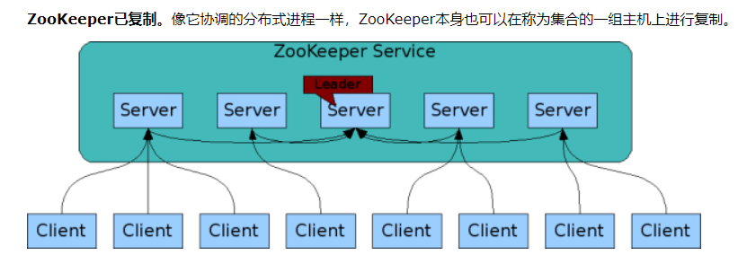

主从集群，主是单点，客户端想连谁连谁，读在从节点，写都在主节点发生。

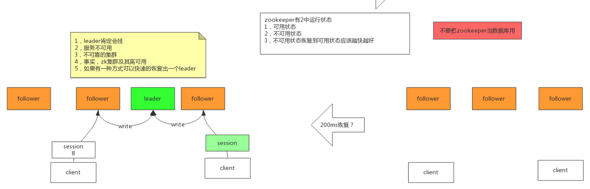

有一种技术，快速恢复leader

每个session代表一个客户端，客户端挂了session创建的锁也会消失，运行结束释放锁

**ZooKeeper很快。**在“读取为主”的工作负载中，它特别快。ZooKeeper应用程序可在数千台计算机上运行，并且在读取比写入更常见的情况下，其性能最佳，比率约为10：1。

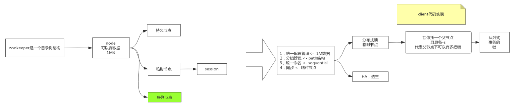

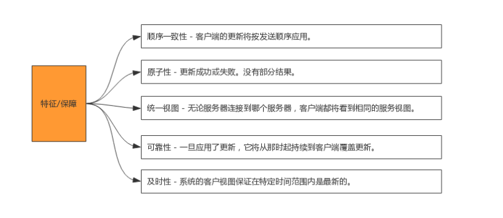

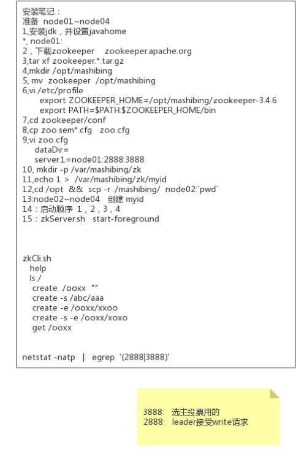

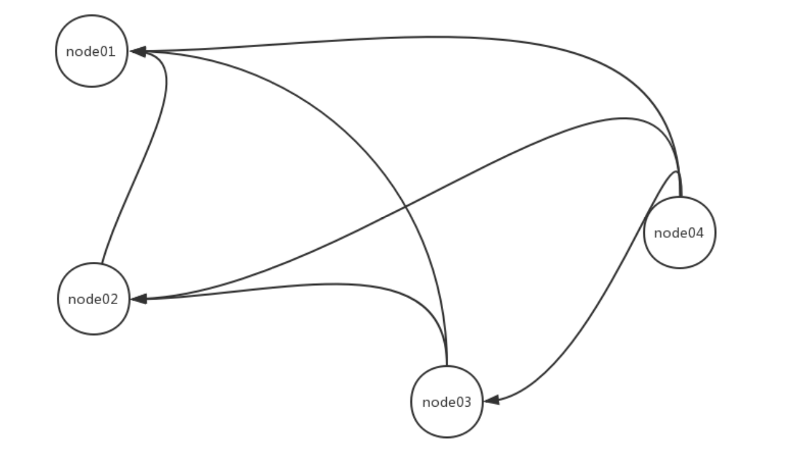

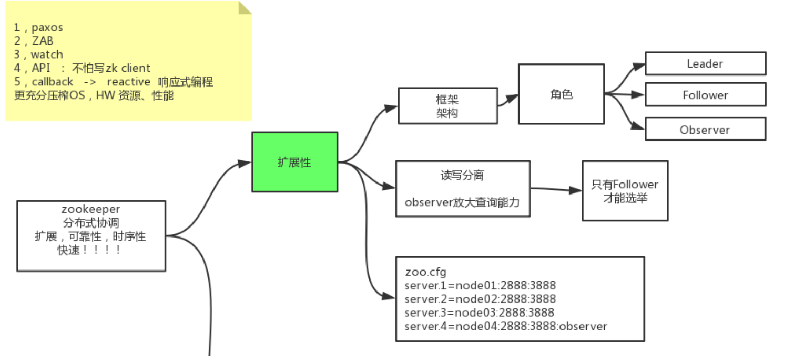

Observer只能查询不能额选举

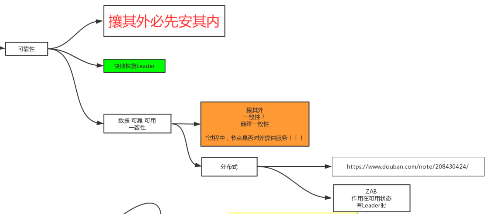

最终一致性过程中，没有达到过半数的节点要停止提供服务，同步后再开启服务。

## Paxos

原文https://www.douban.com/note/208430424/

前提：网络传输数据可靠

Paxos描述了这样一个场景，有一个叫做Paxos的小岛(Island)上面住了一批居民，岛上面所有的事情由一些特殊的人决定，他们叫做议员(Senator)。议员的总数(Senator Count)是确定的，不能更改。岛上每次环境事务的变更都需要通过一个提议(Proposal)，每个提议都有一个编号(PID)，这个编号是一直增长的，不能倒退。每个提议都需要超过半数((Senator Count)/2 +1)的议员同意才能生效。每个议员只会同意大于当前编号的提议，包括已生效的和未生效的。如果议员收到小于等于当前编号的提议，他会拒绝，并告知对方：你的提议已经有人提过了。这里的当前编号是每个议员在自己记事本上面记录的编号，他不断更新这个编号。整个议会不能保证所有议员记事本上的编号总是相同的。现在议会有一个目标：保证所有的议员对于提议都能达成一致的看法。

**两阶段提交**

好，现在议会开始运作，所有议员一开始记事本上面记录的编号都是0。有一个议员发了一个提议：将电费设定为1元/度。他首先看了一下记事本，嗯，当前提议编号是0，那么我的这个提议的编号就是1，于是他给所有议员发消息：1号提议，设定电费1元/度。其他议员收到消息以后查了一下记事本，哦，当前提议编号是0，这个提议可接受，于是他记录下这个提议并回复：我接受你的1号提议，同时他在记事本上记录：当前提议编号为1。发起提议的议员收到了超过半数的回复，立即给所有人发通知：1号提议生效！收到的议员会修改他的记事本，将1好提议由记录改成正式的法令，当有人问他电费为多少时，他会查看法令并告诉对方：1元/度。

**冲突的解决**

现在看冲突的解决：假设总共有三个议员S1-S3，S1和S2同时发起了一个提议:1号提议，设定电费。S1想设为1元/度, S2想设为2元/度。结果S3先收到了S1的提议，于是他做了和前面同样的操作。紧接着他又收到了S2的提议，结果他一查记事本，咦，这个提议的编号小于等于我的当前编号1，于是他拒绝了这个提议：对不起，这个提议先前提过了。于是S2的提议被拒绝，S1正式发布了提议: 1号提议生效。S2向S1或者S3打听并更新了1号法令的内容，然后他可以选择继续发起2号提议。

小岛(Island)——ZK Server Cluster

议员(Senator)——ZK Server

提议(Proposal)——ZNode Change(Create/Delete/SetData…)

提议编号(PID)——Zxid(ZooKeeper Transaction Id)

正式法令——所有ZNode及其数据

貌似关键的概念都能一一对应上，但是等一下，Paxos岛上的议员应该是人人平等的吧，而ZK Server好像有一个Leader的概念。没错，其实Leader的概念也应该属于Paxos范畴的。如果议员人人平等，在某种情况下会由于提议的冲突而产生一个“活锁”（所谓活锁我的理解是大家都没有死，都在动，但是一直解决不了冲突问题）。Paxos的作者Lamport在他的文章”The Part-Time Parliament“中阐述了这个问题并给出了解决方案——在所有议员中设立一个总统，只有总统有权发出提议，如果议员有自己的提议，必须发给总统并由总统来提出。好，我们又多了一个角色：总统。

总统——ZK Server Leader

情况一：

屁民甲(Client)到某个议员(ZK Server)那里询问(Get)某条法令的情况(ZNode的数据)，议员毫不犹豫的拿出他的记事本(local storage)，查阅法令并告诉他结果，同时声明：我的数据不一定是最新的。你想要最新的数据？没问题，等着，等我找总统Sync一下再告诉你。

情况二：

屁民乙(Client)到某个议员(ZK Server)那里要求政府归还欠他的一万元钱，议员让他在办公室等着，自己将问题反映给了总统，总统询问所有议员的意见，多数议员表示欠屁民的钱一定要还，于是总统发表声明，从国库中拿出一万元还债，国库总资产由100万变成99万。屁民乙拿到钱回去了(Client函数返回)。

情况三：

总统突然挂了，议员接二连三的发现联系不上总统，于是各自发表声明，推选新的总统，总统大选期间政府停业，拒绝屁民的请求。

### ZAB原子广播协议

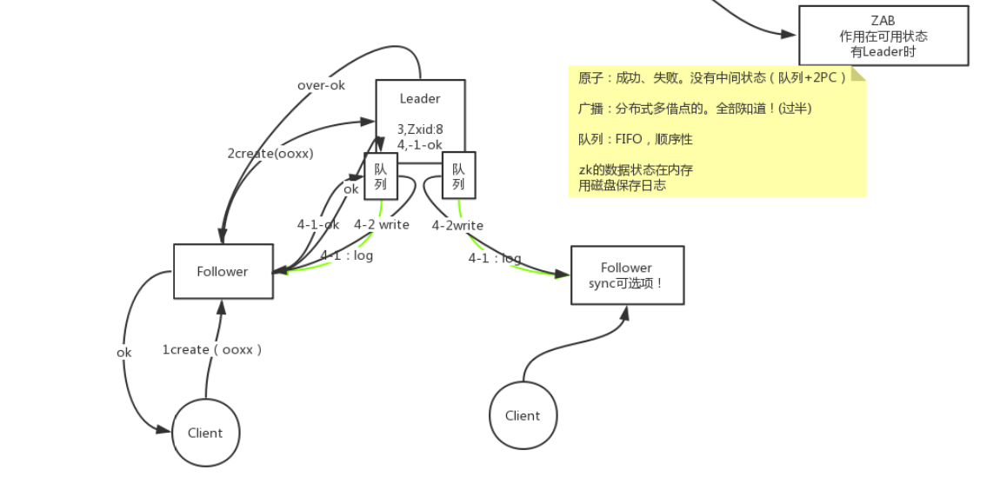

4：两阶段提交

左边回复ok已经过半

### 选主的过程

集群第一次启动，当有三个节点时1、2、4，能够投票选出主节点，4最大

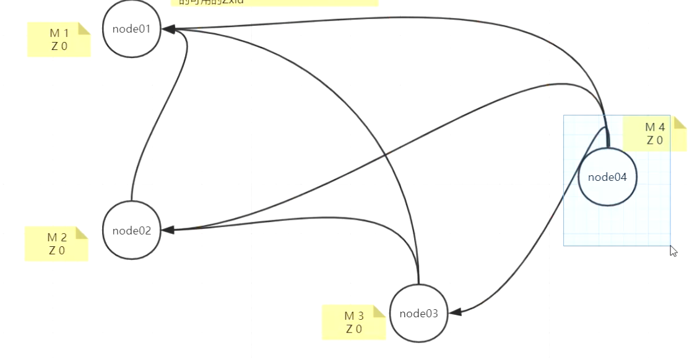

集群重启，leader 4挂了后，3把自己的数据并发送给1、2投了自己一票，2接收到3发来的数据发现，事务ID太小否定并把自己事务ID8发送给1 、3，1、3接受到后给2各投了一票（M2大于M1），最终每个节点上node2有三张票，匹配一下就选出。

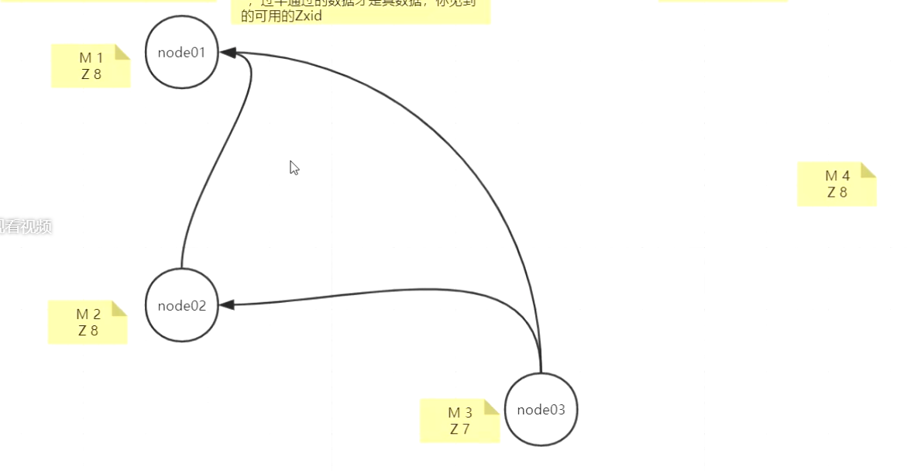

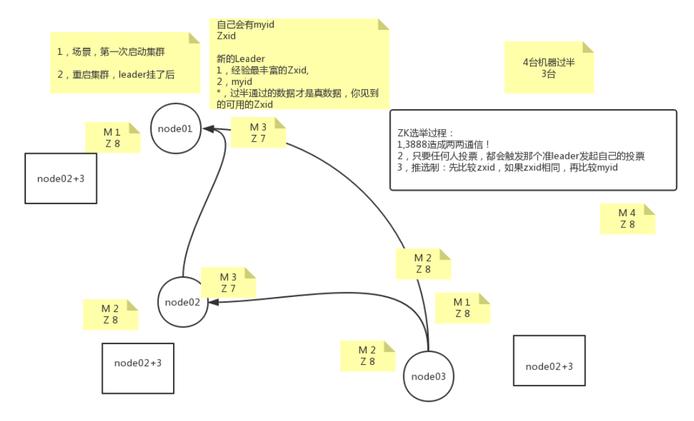

### Watch监控

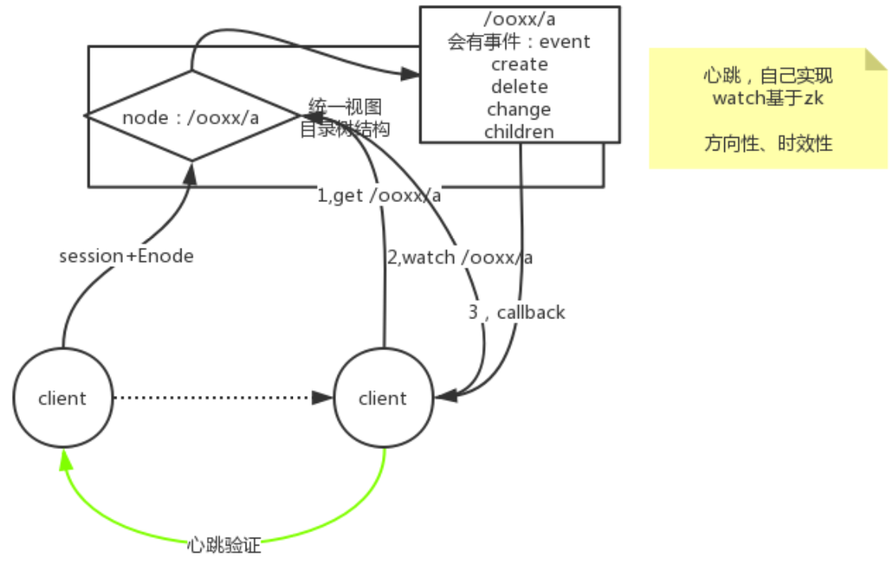

统一视图：访问不同节点得到相同数据

客户端判断另一个客户端状态可以通过心跳自己实现，也可以通过zk的watch

a节点消失会产生事件，给产生watch的客户端产生回调比心跳时效性更好，只要挂了session消失就能产生回调

## 分布式锁

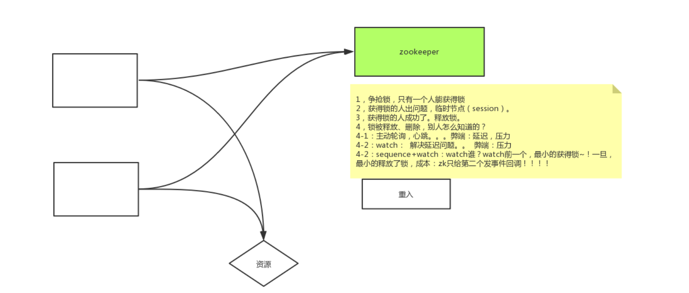

watch弊端，当锁消失了剩下的节点又会抢锁，有压力

4-2队列+watch 1000个人想获得锁，每个人watch前一个，按先来后到获得锁