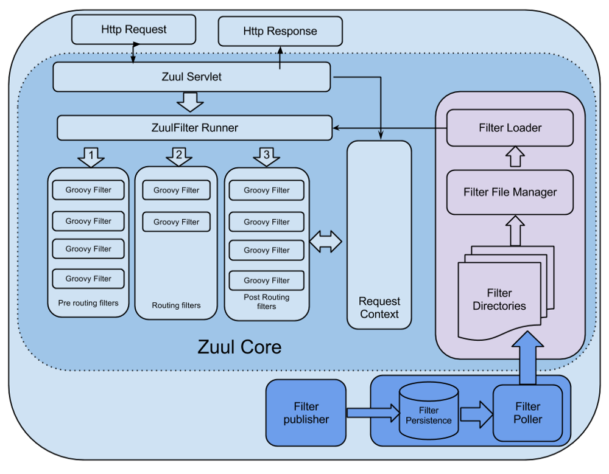
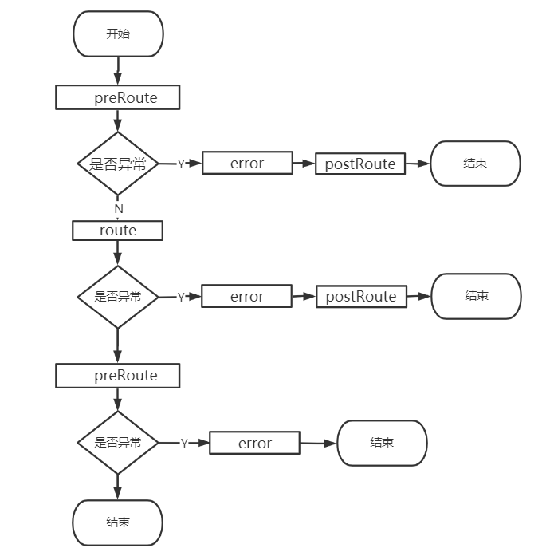
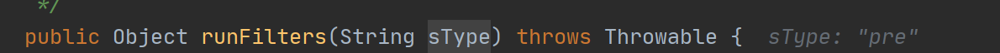
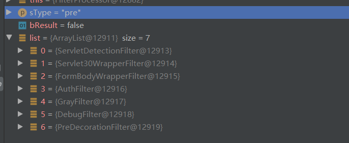
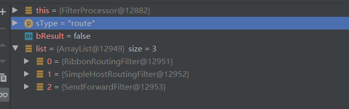
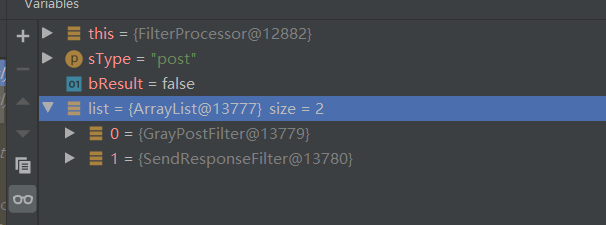

# Zuul源码解析

## Zuul架构图

https://netflixtechblog.com/announcing-zuul-edge-service-in-the-cloud-ab3af5be08ee



HTTP请求过来首先交给ZuulServlet处理


其中，ZuulServlet是整个流程的核心，请求的过程是具体这样的，当Zuulservlet收到请求后， 会创建一个ZuulRunner对象，该对象中初始化了RequestContext：作为存储整个请求的一些数据，并被所有的Zuulfilter共享。ZuulRunner中还有一个 FilterProcessor，FilterProcessor作为执行所有的Zuulfilter的管理器。FilterProcessor从filterloader 中获取zuulfilter，而zuulfilter是被filterFileManager所 加载，并支持groovy热加载，采用了轮询的方式热加载。有了这些filter之后，zuulservelet首先执行的Pre类型的过滤器，再执行route类型的过滤器， 最后执行的是post 类型的过滤器，如果在执行这些过滤器有错误的时候则会执行error类型的过滤器。执行完这些过滤器，最终将请求的结果返回给客户端。 RequestContext就是会一直跟着整个请求周期的上下文对象，filters之间有什么信息需要传递就set一些值进去就行了。

Zuul提供了一个能够对过滤器进行动态的加载、编译、运行的框架。这些过滤器是由Groovy写成，被放在Zuul Server上的特定目录下面。Zuul会按期轮询这些目录，修改过的过滤器会动态的加载到Zuul Server中。这样如果要对过滤器有改动，就不用进行网关的重新发布了，只需要把过滤器上传到指定目录即可（需要在pom中引入org.codehaus.groovy）

---

## Zuul启动

启动类上加@EnableZuulProxy

```java
@EnableCircuitBreaker//Hystrix相关
@Target(ElementType.TYPE)
@Retention(RetentionPolicy.RUNTIME)
@Import(ZuulProxyMarkerConfiguration.class)
public @interface EnableZuulProxy {
}
```

和Eureka一样这个配置类什么都没干，只是new了个Marker类

```java
/**
 * Responsible for adding in a marker bean to trigger activation of
 * {@link ZuulProxyAutoConfiguration}.
 *
 * @author Biju Kunjummen
 */
@Configuration(proxyBeanMethods = false)
public class ZuulProxyMarkerConfiguration {
   @Bean
   public Marker zuulProxyMarkerBean() {
      return new Marker();
   }
   class Marker {
   }
}
```

ZuulProxyAutoConfiguration依赖了这个Marker，用于触发配置

```java
@Configuration(proxyBeanMethods = false)
@Import({ RibbonCommandFactoryConfiguration.RestClientRibbonConfiguration.class,
      RibbonCommandFactoryConfiguration.OkHttpRibbonConfiguration.class,
      RibbonCommandFactoryConfiguration.HttpClientRibbonConfiguration.class,
      HttpClientConfiguration.class })//注入一些Ribbon配置，Zuul默认是用HttpClientRibbonConfiguration做负载均衡配置
@ConditionalOnBean(ZuulProxyMarkerConfiguration.Marker.class)
public class ZuulProxyAutoConfiguration extends ZuulServerAutoConfiguration {

   @SuppressWarnings("rawtypes")
   @Autowired(required = false)//表示忽略当前要注入的bean，如果有直接注入，没有跳过，不会报错，默认true
   private List<RibbonRequestCustomizer> requestCustomizers = Collections.emptyList();

   @Autowired(required = false)
   private Registration registration;
    
   //继承自SimpleRouteLocator，该类会将配置文件中的静态路由配置以及服务发现（比如eureka）中的路由信息进行合并，主要是靠它路由到具体服务。
   @Autowired
   private DiscoveryClient discovery;

   @Override
   public HasFeatures zuulFeature() {
      return HasFeatures.namedFeature("Zuul (Discovery)",
            ZuulProxyAutoConfiguration.class);
   }

   @Bean
   @ConditionalOnMissingBean(DiscoveryClientRouteLocator.class)
   public DiscoveryClientRouteLocator discoveryRouteLocator(
         ServiceRouteMapper serviceRouteMapper) {
      return new DiscoveryClientRouteLocator(this.server.getServlet().getContextPath(),
            this.discovery, this.zuulProperties, serviceRouteMapper,
            this.registration);
   }

   // pre filters
   @Bean
   @ConditionalOnMissingBean(PreDecorationFilter.class)
   public PreDecorationFilter preDecorationFilter(RouteLocator routeLocator,
         ProxyRequestHelper proxyRequestHelper) {
      return new PreDecorationFilter(routeLocator,
            this.server.getServlet().getContextPath(), this.zuulProperties,
            proxyRequestHelper);
   }

   // route filters
   @Bean
   @ConditionalOnMissingBean(RibbonRoutingFilter.class)
   public RibbonRoutingFilter ribbonRoutingFilter(ProxyRequestHelper helper,
         RibbonCommandFactory<?> ribbonCommandFactory) {
      RibbonRoutingFilter filter = new RibbonRoutingFilter(helper, ribbonCommandFactory,
            this.requestCustomizers);
      return filter;
   }

   @Bean
   @ConditionalOnMissingBean({ SimpleHostRoutingFilter.class,
         CloseableHttpClient.class })
   public SimpleHostRoutingFilter simpleHostRoutingFilter(ProxyRequestHelper helper,
         ZuulProperties zuulProperties,
         ApacheHttpClientConnectionManagerFactory connectionManagerFactory,
         ApacheHttpClientFactory httpClientFactory) {
      return new SimpleHostRoutingFilter(helper, zuulProperties,
            connectionManagerFactory, httpClientFactory);
   }

   @Bean
   @ConditionalOnMissingBean({ SimpleHostRoutingFilter.class })
   public SimpleHostRoutingFilter simpleHostRoutingFilter2(ProxyRequestHelper helper,
         ZuulProperties zuulProperties, CloseableHttpClient httpClient) {
      return new SimpleHostRoutingFilter(helper, zuulProperties, httpClient);
   }

   @Bean
   @ConditionalOnMissingBean(ServiceRouteMapper.class)
   public ServiceRouteMapper serviceRouteMapper() {
      return new SimpleServiceRouteMapper();
   }

   @Configuration(proxyBeanMethods = false)
   @ConditionalOnMissingClass("org.springframework.boot.actuate.health.Health")
   protected static class NoActuatorConfiguration {

      @Bean
      public ProxyRequestHelper proxyRequestHelper(ZuulProperties zuulProperties) {
         ProxyRequestHelper helper = new ProxyRequestHelper(zuulProperties);
         return helper;
      }

   }

   @Configuration(proxyBeanMethods = false)
   @ConditionalOnClass(Health.class)
   protected static class EndpointConfiguration {

      @Autowired(required = false)
      private HttpTraceRepository traces;

      @Bean
      @ConditionalOnAvailableEndpoint
      public RoutesEndpoint routesEndpoint(RouteLocator routeLocator) {
         return new RoutesEndpoint(routeLocator);
      }

      @ConditionalOnAvailableEndpoint
      @Bean
      public FiltersEndpoint filtersEndpoint() {
         FilterRegistry filterRegistry = FilterRegistry.instance();
         return new FiltersEndpoint(filterRegistry);
      }

      @Bean
      public ProxyRequestHelper proxyRequestHelper(ZuulProperties zuulProperties) {
         TraceProxyRequestHelper helper = new TraceProxyRequestHelper(zuulProperties);
         if (this.traces != null) {
            helper.setTraces(this.traces);
         }
         return helper;
      }

   }

}
```

这个类注册了很多组件，继承自父类ZuulServerAutoConfiguration

```java
@Configuration(proxyBeanMethods = false)
@EnableConfigurationProperties({ ZuulProperties.class })//配置文件，yml
@ConditionalOnClass({ ZuulServlet.class, ZuulServletFilter.class })
@ConditionalOnBean(ZuulServerMarkerConfiguration.Marker.class)
// Make sure to get the ServerProperties from the same place as a normal web app would
// FIXME @Import(ServerPropertiesAutoConfiguration.class)
public class ZuulServerAutoConfiguration {

   @Autowired
   protected ZuulProperties zuulProperties;

   @Autowired
   protected ServerProperties server;

   @Autowired(required = false)
   private ErrorController errorController;

   private Map<String, CorsConfiguration> corsConfigurations;

   @Autowired(required = false)
   private List<WebMvcConfigurer> configurers = emptyList();

   @Bean
   public HasFeatures zuulFeature() {
      return HasFeatures.namedFeature("Zuul (Simple)",
            ZuulServerAutoConfiguration.class);
   }

   @Bean
   @Primary
   public CompositeRouteLocator primaryRouteLocator(
         Collection<RouteLocator> routeLocators) {
      return new CompositeRouteLocator(routeLocators);
   }
   //SimpleRouteLocator 默认的路由定位器，主要负责维护配置文件中的路由配置
   @Bean
   @ConditionalOnMissingBean(SimpleRouteLocator.class)
   public SimpleRouteLocator simpleRouteLocator() {
      return new SimpleRouteLocator(this.server.getServlet().getContextPath(),
            this.zuulProperties);
   }

   @Bean
   public ZuulController zuulController() {
      return new ZuulController();
   }

   @Bean
   public ZuulHandlerMapping zuulHandlerMapping(RouteLocator routes,
         ZuulController zuulController) {
      ZuulHandlerMapping mapping = new ZuulHandlerMapping(routes, zuulController);
      mapping.setErrorController(this.errorController);
      mapping.setCorsConfigurations(getCorsConfigurations());
      return mapping;
   }

   protected final Map<String, CorsConfiguration> getCorsConfigurations() {
      if (this.corsConfigurations == null) {
         ZuulCorsRegistry registry = new ZuulCorsRegistry();
         this.configurers.forEach(configurer -> configurer.addCorsMappings(registry));
         this.corsConfigurations = registry.getCorsConfigurations();
      }
      return this.corsConfigurations;
   }

   @Bean
   public ApplicationListener<ApplicationEvent> zuulRefreshRoutesListener() {
      return new ZuulRefreshListener();
   }

   @Bean
   @ConditionalOnMissingBean(name = "zuulServlet")
   @ConditionalOnProperty(name = "zuul.use-filter", havingValue = "false",
         matchIfMissing = true)
   public ServletRegistrationBean zuulServlet() {
      ServletRegistrationBean<ZuulServlet> servlet = new ServletRegistrationBean<>(
            new ZuulServlet(), this.zuulProperties.getServletPattern());
      // The whole point of exposing this servlet is to provide a route that doesn't
      // buffer requests.
      servlet.addInitParameter("buffer-requests", "false");
      return servlet;
   }

   @Bean
   @ConditionalOnMissingBean(name = "zuulServletFilter")
   @ConditionalOnProperty(name = "zuul.use-filter", havingValue = "true",
         matchIfMissing = false)
   public FilterRegistrationBean zuulServletFilter() {
      final FilterRegistrationBean<ZuulServletFilter> filterRegistration = new FilterRegistrationBean<>();
      filterRegistration.setUrlPatterns(
            Collections.singleton(this.zuulProperties.getServletPattern()));
      filterRegistration.setFilter(new ZuulServletFilter());
      filterRegistration.setOrder(Ordered.LOWEST_PRECEDENCE);
      // The whole point of exposing this servlet is to provide a route that doesn't
      // buffer requests.
      filterRegistration.addInitParameter("buffer-requests", "false");
      return filterRegistration;
   }

   // pre filters

   @Bean
   public ServletDetectionFilter servletDetectionFilter() {
      return new ServletDetectionFilter();
   }

   @Bean
   @ConditionalOnMissingBean
   public FormBodyWrapperFilter formBodyWrapperFilter() {
      return new FormBodyWrapperFilter();
   }

   @Bean
   @ConditionalOnMissingBean
   public DebugFilter debugFilter() {
      return new DebugFilter();
   }

   @Bean
   @ConditionalOnMissingBean
   public Servlet30WrapperFilter servlet30WrapperFilter() {
      return new Servlet30WrapperFilter();
   }

   // post filters

   @Bean
   public SendResponseFilter sendResponseFilter(ZuulProperties properties) {
      return new SendResponseFilter(zuulProperties);
   }

   @Bean
   public SendErrorFilter sendErrorFilter() {
      return new SendErrorFilter();
   }

   @Bean
   public SendForwardFilter sendForwardFilter() {
      return new SendForwardFilter();
   }

   @Bean
   @ConditionalOnProperty("zuul.ribbon.eager-load.enabled")
   public ZuulRouteApplicationContextInitializer zuulRoutesApplicationContextInitiazer(
         SpringClientFactory springClientFactory) {
      return new ZuulRouteApplicationContextInitializer(springClientFactory,
            zuulProperties);
   }

   @Configuration(proxyBeanMethods = false)
   protected static class ZuulFilterConfiguration {

      @Autowired
      private Map<String, ZuulFilter> filters;
	  // 初始化ZuulFilterInitializer类，将所有的filter 向FilterRegistry注册。
      @Bean
      public ZuulFilterInitializer zuulFilterInitializer(CounterFactory counterFactory,
            TracerFactory tracerFactory) {
         FilterLoader filterLoader = FilterLoader.getInstance();
         FilterRegistry filterRegistry = FilterRegistry.instance();
         return new ZuulFilterInitializer(this.filters, counterFactory, tracerFactory,
               filterLoader, filterRegistry);
      }

   }

   @Configuration(proxyBeanMethods = false)
   @ConditionalOnClass(MeterRegistry.class)
   protected static class ZuulCounterFactoryConfiguration {

      @Bean
      @ConditionalOnBean(MeterRegistry.class)
      @ConditionalOnMissingBean(CounterFactory.class)
      public CounterFactory counterFactory(MeterRegistry meterRegistry) {
         return new DefaultCounterFactory(meterRegistry);
      }

   }

   @Configuration(proxyBeanMethods = false)
   protected static class ZuulMetricsConfiguration {

      @Bean
      @ConditionalOnMissingClass("io.micrometer.core.instrument.MeterRegistry")
      @ConditionalOnMissingBean(CounterFactory.class)
      public CounterFactory counterFactory() {
         return new EmptyCounterFactory();
      }

      @ConditionalOnMissingBean(TracerFactory.class)
      @Bean
      public TracerFactory tracerFactory() {
         return new EmptyTracerFactory();
      }

   }

   private static class ZuulRefreshListener
         implements ApplicationListener<ApplicationEvent> {

      @Autowired
      private ZuulHandlerMapping zuulHandlerMapping;

      private HeartbeatMonitor heartbeatMonitor = new HeartbeatMonitor();

      @Override
      public void onApplicationEvent(ApplicationEvent event) {
         if (event instanceof ContextRefreshedEvent
               || event instanceof RefreshScopeRefreshedEvent
               || event instanceof RoutesRefreshedEvent
               || event instanceof InstanceRegisteredEvent) {
            reset();
         }
         else if (event instanceof ParentHeartbeatEvent) {
            ParentHeartbeatEvent e = (ParentHeartbeatEvent) event;
            resetIfNeeded(e.getValue());
         }
         else if (event instanceof HeartbeatEvent) {
            HeartbeatEvent e = (HeartbeatEvent) event;
            resetIfNeeded(e.getValue());
         }
      }
      private void resetIfNeeded(Object value) {
         if (this.heartbeatMonitor.update(value)) {
            reset();
         }
      }
      private void reset() {
         this.zuulHandlerMapping.setDirty(true);
      }
   }

   private static class ZuulCorsRegistry extends CorsRegistry {
      @Override
      protected Map<String, CorsConfiguration> getCorsConfigurations() {
         return super.getCorsConfigurations();
      }

   }

}
```

- SimpleRouteLocator：默认的路由定位器，主要负责维护配置文件中的路由配置。
- DiscoveryClientRouteLocator：继承自SimpleRouteLocator，该类会将配置文件中的静态路由配置以及服务发现（比如eureka）中的路由信息进行合并，主要是靠它路由到具体服务。
- CompositeRouteLocator：组合路由定位器，看入参就知道应该是会保存好多个RouteLocator，构造过程中其实仅包括一个DiscoveryClientRouteLocator。
- ZuulController：Zuul创建的一个Controller，用于将请求交由ZuulServlet处理。
- ZuulHandlerMapping：这个会添加到SpringMvc的HandlerMapping链中，只有选择了ZuulHandlerMapping的请求才能出发到Zuul的后续流程。
- FilterLoader类持有FilterRegistry，FilterFileManager类持有FilterLoader，所以最终是由FilterFileManager注入 filterFilterRegistry的ConcurrentHashMap的。

## Zuul请求

```java
public class ZuulServlet extends HttpServlet {

 	private ZuulRunner zuulRunner;

    
@Override
public void service(javax.servlet.ServletRequest servletRequest, javax.servlet.ServletResponse servletResponse) throws ServletException, IOException {
    try {
        init((HttpServletRequest) servletRequest, (HttpServletResponse) servletResponse);

        // Marks this request as having passed through the "Zuul engine", as opposed to servlets
        // explicitly bound in web.xml, for which requests will not have the same data attached
        RequestContext context = RequestContext.getCurrentContext();
        context.setZuulEngineRan();

        try {
            preRoute();//实际上调用zuulRunner.preRoute()
        } catch (ZuulException e) {
            error(e);//实际上调用zuulRunner.error()
            postRoute();//实际上调用zuulRunner.postRoute()
            return;
        }
        try {
            route();//实际上调用zuulRunner.route()
        } catch (ZuulException e) {
            error(e);
            postRoute();
            return;
        }
        try {
            postRoute();
        } catch (ZuulException e) {
            error(e);
            return;
        }

    } catch (Throwable e) {
        error(new ZuulException(e, 500, "UNHANDLED_EXCEPTION_" + e.getClass().getName()));
    } finally {
        RequestContext.getCurrentContext().unset();
    }
}
}
```



pre、route、post、error最终都是FilterProcessor.getInstance().执行方法，processor是最终干活的类

```java
public class FilterProcessor {
    //sType：pre、route、error、post
public Object runFilters(String sType) throws Throwable {
    if (RequestContext.getCurrentContext().debugRouting()) {
        Debug.addRoutingDebug("Invoking {" + sType + "} type filters");
    }
    boolean bResult = false;
    List<ZuulFilter> list = FilterLoader.getInstance().getFiltersByType(sType);
    if (list != null) {
        for (int i = 0; i < list.size(); i++) {
            ZuulFilter zuulFilter = list.get(i);
            Object result = processZuulFilter(zuulFilter);
            if (result != null && result instanceof Boolean) {
                bResult |= ((Boolean) result);
            }
        }
    }
    return bResult;
}
    
}
```

打断点进行调试

### Pre





原生只有5个除了3、4

### route



RibbonRoutingFilter ：将url路由到服务

SimpleHostRoutingFilter ：将url路由到url地址

SendForwardFilter ：将url路由到自己

### post



原生只有1

```java
public abstract class ZuulFilter implements IZuulFilter, Comparable<ZuulFilter> {

public ZuulFilterResult runFilter() {
    ZuulFilterResult zr = new ZuulFilterResult();
    if (!isFilterDisabled()) {
        if (shouldFilter()) {//每个Filter都会重写这个方法
            Tracer t = TracerFactory.instance().startMicroTracer("ZUUL::" + this.getClass().getSimpleName());
            try {
                Object res = run();
                zr = new ZuulFilterResult(res, ExecutionStatus.SUCCESS);
            } catch (Throwable e) {
                t.setName("ZUUL::" + this.getClass().getSimpleName() + " failed");
                zr = new ZuulFilterResult(ExecutionStatus.FAILED);
                zr.setException(e);
            } finally {
                t.stopAndLog();
            }
        } else {
            zr = new ZuulFilterResult(ExecutionStatus.SKIPPED);
        }
    }
    return zr;
}
}
```

```java
//RibbonRoutingFilter
@Override
public boolean shouldFilter() {
   RequestContext ctx = RequestContext.getCurrentContext();
   return (ctx.getRouteHost() == null && ctx.get(SERVICE_ID_KEY) != null
         && ctx.sendZuulResponse());
}
```