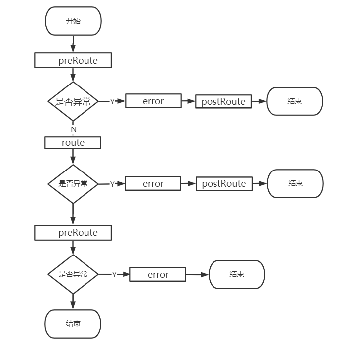
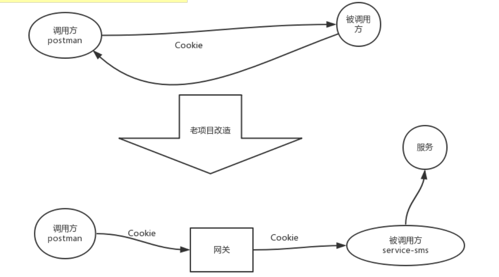
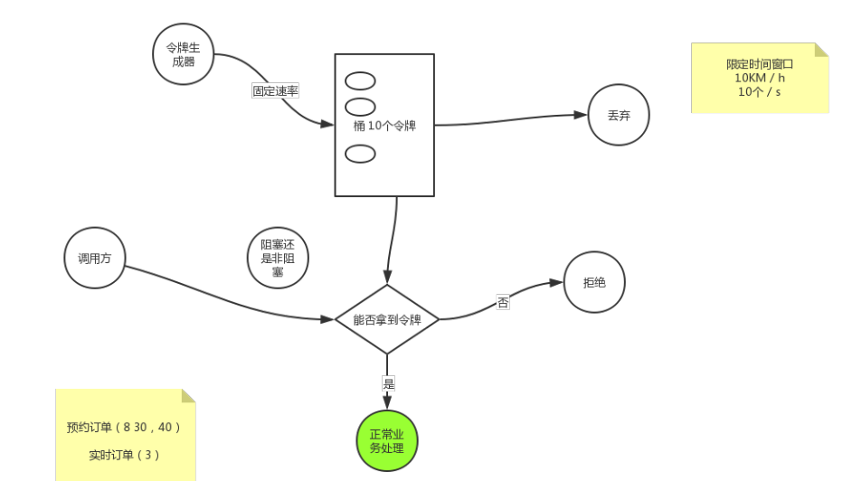

# Zuul生产问题

Zuul是Netflix开源的微服务网关，**核心是一系列过滤器**。这些过滤器可以完成以下功能。

1. 是所有微服务入口，进行分发。
2. 身份认证与安全。识别合法的请求，拦截不合法的请求。
3. 监控。在入口处监控，更全面。
4. 动态路由。动态将请求分发到不同的后端集群。
5. 压力测试。可以逐渐增加对后端服务的流量，进行测试。
6. 负载均衡。也是用ribbon。
7. 限流（望京超市）。比如我每秒只要1000次，10001次就不让访问了。

## 四种过滤器

PRE: 在请求被路由之前调用，可利用这种过滤器实现身份验证。选择微服务，记录日志。
ROUTING:在将请求路由到微服务调用，用于构建发送给微服务的请求，并用http clinet（或者ribbon）请求微服务。
POST:在调用微服务执行后。可用于添加header，记录日志，将响应发给客户端。
ERROR:在其他阶段发生错误是，走此过滤器。

执行顺序

```java
// ZuulServlet
try {
    preRoute();
} catch (ZuulException e) {
    error(e);
    postRoute();
    return;
}

try {
    route();
} catch (ZuulException e) {
    error(e);
    postRoute();
    return;
}
try {
    postRoute();
} catch (ZuulException e) {
    error(e);
    return;
}
```



### 自定义过滤器

1. 继承ZuulFilter
2. shouldFilter：true执行次过滤器，false不执行（我们可以动态判断是否执行过滤器，写判断逻辑）
3. run：过滤器的业务逻辑
4. filterType：pre、route、post、error
5. order：数字越小越先执行

```java
@Component
public class AuthFilter extends ZuulFilter {

   @Autowired
   private RedisTemplate<String, String> redisTemplate;

   /**
    *     该过滤器是否生效
    */
   @Override
   public boolean shouldFilter() {
      //获取上下文
      RequestContext requestContext = RequestContext.getCurrentContext();
      HttpServletRequest request = requestContext.getRequest();
      
//    String uri = request.getRequestURI();
//    System.out.println("来源uri："+uri);
//    //只有此接口/api-passenger/api-passenger-gateway-test/hello才被拦截
//    String checkUri = "/api-passenger/api-passenger-gateway-test/hello";
//    if(checkUri.equalsIgnoreCase(uri)) {
//       return true;
//    }
////       测试路径
//    if(uri.contains("api-driver")) {
//       return true;
//    }
      
      return false;
   }
   
   /**
    *     拦截后的具体业务逻辑
    */
   @Override
   public Object run() throws ZuulException {


      System.out.println("auth 拦截");
      //获取上下文（重要，贯穿 所有filter，包含所有参数）
      RequestContext requestContext = RequestContext.getCurrentContext();
      HttpServletRequest request = requestContext.getRequest();

//        parseBody(request);

      String token = request.getHeader("Authorization");
      if (StringUtils.isNotBlank(token)){
            JwtInfo tokenJwtInfo = JwtUtil.parseToken(token);

            if(null != tokenJwtInfo) {
                String tokenUserId = tokenJwtInfo.getSubject();
                Long tokenIssueDate = tokenJwtInfo.getIssueDate();

            requestContext.set("userId",tokenUserId);

            return null;


//                BoundValueOperations<String, String> stringStringBoundValueOperations = redisTemplate.boundValueOps(RedisKeyPrefixConstant.PASSENGER_LOGIN_TOKEN_APP_KEY_PRE + tokenUserId);
//                String redisToken = stringStringBoundValueOperations.get();
//                if (redisToken.equals(token)){
//
//
//                    return null;
//                }
            }
        }

        // 不往下走，还走剩下的过滤器，但是不向后面的服务转发。
        requestContext.setSendZuulResponse(false);
        requestContext.setResponseStatusCode(HttpStatus.UNAUTHORIZED.value());
        requestContext.setResponseBody("auth fail");

//        requestContext.set("ifContinue",false);

      return null;
   }
   /**
    * 拦截类型，4中类型。
    */
   @Override
   public String filterType() {
      // TODO Auto-generated method stub
      return FilterConstants.PRE_TYPE;
   }

   /**
    *     值越小，越在前
    */
   @Override
   public int filterOrder() {
      // TODO Auto-generated method stub
      return -1;
   }


// private void parseBody(HttpServletRequest request){
//        Map<String,Object> params = new HashMap<String, Object>();
//        BufferedReader br;
//        try {
//            br = request.getReader();
//            String str, wholeStr = "";
//            while((str = br.readLine()) != null){
//                wholeStr += str;
//            }
//            if(StringUtils.isNotEmpty(wholeStr)){
//                JSONObject jsonObject = JSONObject.fromObject(wholeStr);
//            }
//        } catch (IOException e1) {
//
//        }
//
//    }
}
```

**网关配置**

localhost:9100(网关ip+port)/（目标服务名）/（Controller路径）


设置过滤器设计顺序：节省计算资源，简单的过滤器放到前面，面对大流量

## Token不后传问题

单体项目->微服务，token不向后传递



解决：

```yml
zuul:
    #一下配置，表示忽略下面的值向微服务传播，以下配置为空表示：所有请求头都透传到后面微服务。
  sensitive-headers:   #置为空
```

```java
private Set<String> sensitiveHeaders = new LinkedHashSet<>(
      Arrays.asList("Cookie", "Set-Cookie", "Authorization"));//默认过滤三个值
```

真正的解决，将鉴权的处理放在网关

## 老项目改造路由问题

前端请求url不能变，而新服务没有提供原来的接口

需求：将url中的test31转成test3

解决：

1. 使用Filter灰度的方式改url，做好老url和新url的对应关系
2. nginx地址映射
3. **zuul自定义Filter** ，路由配置在配置文件中

使用Route过滤器

1. RibbonRoutingFilter ：将url路由到服务

```yml
zuul:
  routes:
   quality: /请求路径/**
```

1. SimpleHostRoutingFilter ：将url路由到url地址

```yml
zuul:
  routes:
   #自己转发到自己 名字任意起
   xxx:  如果找不到会报404的错误（类似于将让eureka找到自己的服务，这个是zuul里面的）
    path: /前端请求的地址/**
```

1. SendForwardFilter ：将url路由到自己

```yml
zuul:
  routes:
   #自己转发到自己 名字任意起
   xxx:
    path: /前端请求的地址/**
```

1. 编写route类型的过滤器
2. 获取请求过来的url
3. 进行映射 url（请求）= url（目的地）
4. 设置RequestContext中的serviceId，url 

```JAVA
@Component
public class RibbonFilter extends ZuulFilter {
    @Override
    public String filterType() {
        return FilterConstants.ROUTE_TYPE;
    }

    @Override
    public int filterOrder() {
        return 0;
    }

    @Override
    public boolean shouldFilter() {
        return true;
    }

    @Override
    public Object run() throws ZuulException {
        RequestContext currentContext = RequestContext.getCurrentContext();
        HttpServletRequest request = currentContext.getRequest();

        //获取请求的url地址
        String remoteAddr = request.getRequestURI();

        //进行映射
        if(remoteAddr.contains("sms-test31")){
            //remoteAddr -> new Addr
            currentContext.set(FilterConstants.SERVICE_ID_KEY,"service-sms");
            currentContext.set(FilterConstants.REQUEST_URI_KEY,"/test/sms-test3");

        }

        return null;
    }
}
```


## 动态路由

根据不同的用户，路由到不同的服务，北京用户到北京系统，上海用户到上海系统，强制分开，和灰度发布有差别

路由到具体地址，yml和代码中都要配置

```JAVA
@Component
public class HostFilter extends ZuulFilter {
    @Override
    public String filterType() {
        return FilterConstants.ROUTE_TYPE;
    }

    @Override
    public int filterOrder() {
        return 0;
    }

    @Override
    public boolean shouldFilter() {
        return true;
    }

    @SneakyThrows//不写URI报错
    @Override
    public Object run() throws ZuulException {
        RequestContext currentContext = RequestContext.getCurrentContext();
        HttpServletRequest request = currentContext.getRequest();

        //获取请求的url地址
        String remoteAddr = request.getRequestURI();

        //进行映射
        if(remoteAddr.contains("zuul-api-driver")){
            //remoteAddr -> new Addr
            currentContext.set(FilterConstants.SERVICE_ID_KEY,"service-sms");

            currentContext.setRouteHost(new URI("http://localhost:8003/test/sms-test3").toURL());

        }

        return null;
    }
}
```

```YML
zuul:
    #一下配置，表示忽略下面的值向微服务传播，以下配置为空表示：所有请求头都透传到后面微服务。
 # sensitive-headers:
  routes:
    xxx:
      path: /a-forward/**
      url: forward:/myController


    # 配合 风雨冷人
    xxxx: /zuul-api-driver/**
    #此处名字随便取
    custom-zuul-name:
      path: /zuul-api-driver/**
      url: http://localhost:8003/
```

## 路由小技巧

### 不重启配置开关

可以在后台管理系统上配置过滤器开关，不重启让过滤器生效，可以将开关放在库中

### 路由规则的查看

```xml
http://localhost:9100/actuator/routes
<dependency>
        <groupId>org.springframework.boot</groupId>
        <artifactId>spring-boot-starter-actuator</artifactId>
    </dependency>


```

```yml
management:
  endpoints:
    web:
      exposure:
        include: "*"
  endpoint:
    health:
      ##默认是never
      show-details: ALWAYS
      enabled: true
    routes:
      enabled: true
```

http://localhost:9100/actuator/filters 过滤器的查看

### 不向后边过滤器转发

pre：ip过滤、次数限制、设备号过滤

在前面的过滤器中senZuulResponse(false)

在后边的route过滤器中（ribbonRouteingFilter）的shouldFilter()中进行判断

### 网关限流



```java
@Component
public class LimitFilter extends ZuulFilter {

    @Override
    public String filterType() {
        return FilterConstants.PRE_TYPE;
    }

    @Override
    public int filterOrder() {
        return -10;
    }

    @Override
    public boolean shouldFilter() {
        return true;
    }

    // 2 qps(1秒  2个 请求 Query Per Second 每秒查询量)
    private static final RateLimiter RATE_LIMITER = RateLimiter.create(50);

    @Override
    public Object run() throws ZuulException {
        RequestContext currentContext = RequestContext.getCurrentContext();

        if (RATE_LIMITER.tryAcquire()){//能拿到令牌
            System.out.println("通过");
            return null;
        }else {
            // 被流控的逻辑
            System.out.println("被限流了");
            currentContext.setSendZuulResponse(false);
            currentContext.setResponseStatusCode(HttpStatus.TOO_MANY_REQUESTS.value());
        }
        return null;
    }
}
```

