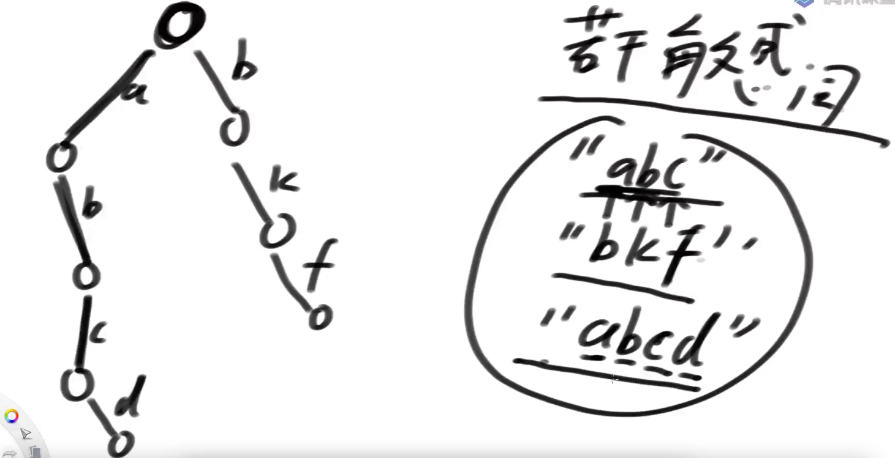
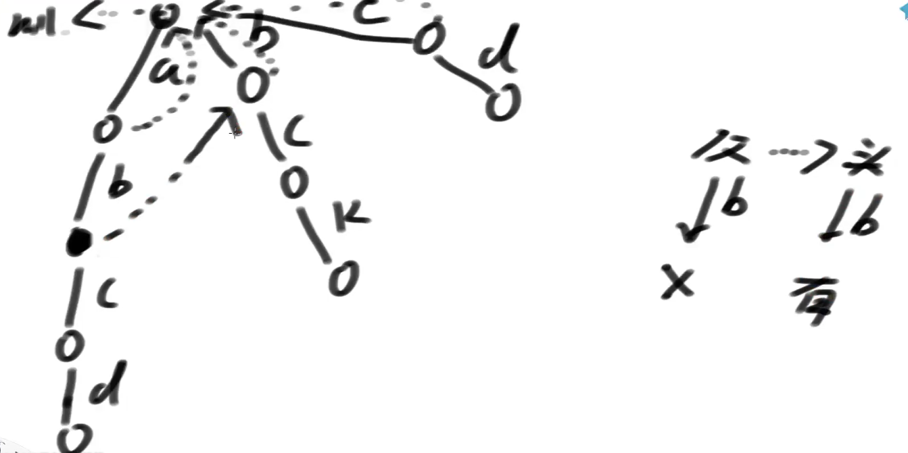

# AC自动机

解决在一个大字符串中，找到多个候选字符串的问题

大文章中，有若干敏感词，如何找到？

## AC自动机算法核心

1）把所有匹配串生成一棵前缀树

2）前缀树节点增加fail指针

3）fail指针的含义：如果必须以当前字符结尾，当前形成的路径是str，剩下哪一个字符串的前缀和str的后缀，拥有最大的匹配长度。fail指针就指向那个字符串的最后一个字符所对应的节点。（迷不迷？听讲述！）

---

敏感词建立前缀树





人为规定头节点的fail指针指向为null，第一层节点的fail指针指向为头节点

节点c的父节点是b，b的fail指针指向的是头节点，这是发现头节有指向节点b的指针，所以c节点的fail指针指向b，此时fail指针就连起来了，如果一直找不到指向节点b的指针，fail指针就指向头节点


---


end的含义，叶子节点才有值，沿途都是null


```java
// 前缀树的节点
public static class Node {
   // 如果一个node，end为空，不是结尾
   // 如果end不为空，表示这个点是某个字符串的结尾，end的值就是这个字符串
   public String end;
   // 只有在上面的end变量不为空的时候（叶子节点），endUse才有意义
   // 表示，这个字符串之前有没有加入过答案
   public boolean endUse;
   public Node fail;
   // 子节点，一共有26个
   public Node[] nexts;

   public Node() {
      endUse = false;
      end = null;
      fail = null;
      nexts = new Node[26];
   }
}

public static class ACAutomation {
   private Node root;

   public ACAutomation() {
      root = new Node();
   }
	 // 不连fail指针
   public void insert(String s) {
      char[] str = s.toCharArray();
      Node cur = root;
      int index = 0;
      for (int i = 0; i < str.length; i++) {
         index = str[i] - 'a';
         // 没有路新建，有路就复用
         if (cur.nexts[index] == null) {
            cur.nexts[index] = new Node();
         }
         cur = cur.nexts[index];
      }
      cur.end = s;
   }

   // 连接fail
   public void build() {
      Queue<Node> queue = new LinkedList<>();
      queue.add(root);
      Node cur = null;
      Node cfail = null;
      while (!queue.isEmpty()) {
         // 某个父亲，cur
         cur = queue.poll();
         for (int i = 0; i < 26; i++) { // 所有的路
            // cur -> 父亲  i号儿子，必须把i号儿子的fail指针设置好！
            if (cur.nexts[i] != null) { // 如果真的有i号儿子
               cur.nexts[i].fail = root;
               cfail = cur.fail;
               while (cfail != null) {
                  if (cfail.nexts[i] != null) {
                     cur.nexts[i].fail = cfail.nexts[i];
                     break;
                  }
                  cfail = cfail.fail;
               }
               queue.add(cur.nexts[i]);
            }
         }
      }
   }

   // 大文章：content
   public List<String> containWords(String content) {
      char[] str = content.toCharArray();
      Node cur = root;
      Node follow = null;
      int index = 0;
      List<String> ans = new ArrayList<>();
      for (int i = 0; i < str.length; i++) {
         index = str[i] - 'a'; // 路
         // 如果当前字符在这条路上没配出来，就随着fail方向走向下条路径
         while (cur.nexts[index] == null && cur != root) {
            cur = cur.fail;
         }
         // 1) 现在来到的路径，是可以继续匹配的
         // 2) 现在来到的节点，就是前缀树的根节点
         cur = cur.nexts[index] != null ? cur.nexts[index] : root;
         follow = cur;
         while (follow != root) {
            if (follow.endUse) {
               break;
            }
            // 不同的需求，在这一段之间修改
            if (follow.end != null) {
               ans.add(follow.end);
               follow.endUse = true;
            }
            // 不同的需求，在这一段之间修改
            follow = follow.fail;
         }
      }
      return ans;
   }

}
```