# Activiti

## 介绍

​	Alfresco软件在2010年5月17日宣布Activiti业务流程管理（BPM）开源项目的正式启动，其首席架构 师由业务流程管理BPM的专家 Tom Baeyens担任，Tom Baeyens就是原来jbpm的架构师，而jbpm是 一个非常有名的工作流引擎，当然activiti也是一个工作流引擎。

​	 Activiti是一个工作流引擎， activiti可以将业务系统中复杂的业务流程抽取出来，使用专门的建模语言 BPMN2.0进行定义，业务流程按照预先定义的流程进行执行，实现了系统的流程由activiti进行管理，减 少业务系统由于流程变更进行系统升级改造的工作量，从而提高系统的健壮性，同时也减少了系统开发 维护成本。 官方网站：https://www.activiti.org/

### BPM

​	BPM（Business Process Management），即业务流程管理，是一种规范化的构造端到端的业务流程， 以持续的提高组织业务效率。常见商业管理教育如EMBA、MBA等均将BPM包含在内。

### BPMN

​	BPMN（Business Process Model AndNotation）- 业务流程模型和符号 是由BPMI（BusinessProcess Management Initiative）开发的一套标准的业务流程建模符号，使用BPMN提供的符号可以创建业务流程。 

​	2004年5月发布了BPMN1.0规范.BPMI于2005年9月并入OMG（The Object Management Group对象 管理组织)组织。OMG于2011年1月发布BPMN2.0的最终版本。

#### Event 

用一个圆圈表示，它是流程中运行过程中发生的事情。


活动用圆角矩形表示，一个流程由一个活动或多个活动组成 Bpmn图形其实是通过xml表示业务流程，上边的.bpmn文件使用文本编辑器打开：

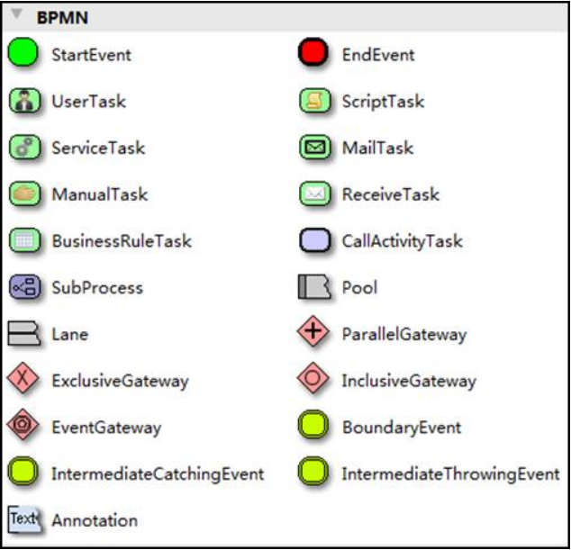

Bpmn图形其实是通过xml表示业务流程，上边的.bpmn文件使用文本编辑器打开：


## 使用步骤

### 部署activiti 

Activiti是一个工作流引擎（其实就是一堆jar包API），业务系统访问(操作)activiti的接口，就可以方便的 操作流程相关数据，这样就可以把工作流环境与业务系统的环境集成在一起。 

### 流程定义 

使用activiti流程建模工具(activity-designer)定义业务流程(.bpmn文件) 。 .bpmn文件就是业务流程定义文件，通过xml定义业务流程。                    

### 流程定义部署 

activiti部署业务流程定义（.bpmn文件）。 

使用activiti提供的api把流程定义内容存储起来，在Activiti执行过程中可以查询定义的内容 Activiti执行把流程定义内容存储在数据库中 

### 启动一个流程实例 

流程实例也叫：ProcessInstance 启动一个流程实例表示开始一次业务流程的运行。 在员工请假流程定义部署完成后，如果张三要请假就可以启动一个流程实例，如果李四要请假也启动一 个流程实例，两个流程的执行互相不影响。 

### 用户查询待办任务(Task) 

因为现在系统的业务流程已经交给activiti管理，通过activiti就可以查询当前流程执行到哪了，当前用户 需要办理什么任务了，这些activiti帮我们管理了，而不需要开发人员自己编写在sql语句查询。 

### 用户办理任务 

用户查询待办任务后，就可以办理某个任务，如果这个任务办理完成还需要其它用户办理，比如采购单 创建后由部门经理审核，这个过程也是由activiti帮我们完成了。 

### 流程结束 

当任务办理完成没有下一个任务结点了，这个流程实例就完成了。

## 基本使用

### 引入依赖

创建一个普通的Maven项目，并添加相关的依赖

```xml
<properties>
    <slf4j.version>1.6.6</slf4j.version>
    <log4j.version>1.2.12</log4j.version>
    <activiti.version>7.0.0.Beta1</activiti.version>
</properties>
<dependencies>
    <dependency>
        <groupId>org.activiti</groupId>
        <artifactId>activiti-engine</artifactId>
        <version>${activiti.version}</version>
    </dependency>
    <dependency>
        <groupId>org.activiti</groupId>
        <artifactId>activiti-spring</artifactId>
        <version>${activiti.version}</version>
    </dependency>
    <!-- bpmn 模型处理 -->
    <dependency>
        <groupId>org.activiti</groupId>
        <artifactId>activiti-bpmn-model</artifactId>
        <version>${activiti.version}</version>
    </dependency>
    <!-- bpmn 转换 -->
    <dependency>
        <groupId>org.activiti</groupId>
        <artifactId>activiti-bpmn-converter</artifactId>
        <version>${activiti.version}</version>
    </dependency>
    <!-- bpmn json数据转换 -->
    <dependency>
        <groupId>org.activiti</groupId>
        <artifactId>activiti-json-converter</artifactId>
        <version>${activiti.version}</version>
    </dependency>
    <!-- bpmn 布局 -->
    <dependency>
        <groupId>org.activiti</groupId>
        <artifactId>activiti-bpmn-layout</artifactId>
        <version>${activiti.version}</version>
        <exclusions>
            <exclusion>
                <groupId>com.github.jgraph</groupId>
                <artifactId>jgraphx</artifactId>
            </exclusion>
        </exclusions>
    </dependency>
    <!-- activiti 云支持 -->
    <dependency>
        <groupId>org.activiti.cloud</groupId>
        <artifactId>activiti-cloud-services-api</artifactId>
        <version>${activiti.version}</version>
    </dependency>
    <!-- mysql驱动 -->
    <dependency>
        <groupId>mysql</groupId>
        <artifactId>mysql-connector-java</artifactId>
         <version>8.0.24</version>
    </dependency>
    <!-- mybatis -->
    <dependency>
        <groupId>org.mybatis</groupId>
        <artifactId>mybatis</artifactId>
        <version>3.4.5</version>
    </dependency>
    <!-- 链接池 -->
    <dependency>
        <groupId>commons-dbcp</groupId>
        <artifactId>commons-dbcp</artifactId>
        <version>1.4</version>
    </dependency>
    <dependency>
        <groupId>junit</groupId>
        <artifactId>junit</artifactId>
        <version>4.12</version>
    </dependency>

    <dependency>
        <groupId>log4j</groupId>
        <artifactId>log4j</artifactId>
        <version>${log4j.version}</version>
    </dependency>
    <dependency>
        <groupId>org.slf4j</groupId>
        <artifactId>slf4j-api</artifactId>
        <version>${slf4j.version}</version>
    </dependency>
    <dependency>
        <groupId>org.slf4j</groupId>
        <artifactId>slf4j-log4j12</artifactId>
        <version>${slf4j.version}</version>
    </dependency>

</dependencies>
```

### 添加Activiti配置文件

在resources下创建activiti.cfg.xml文件，默认的方式的名称是不能修改的。

在配置文件中我们有两种配置方式：一种是单独配置数据源，另一种是不单独配置数据源

```xml
<?xml version="1.0" encoding="UTF-8"?>
<beans xmlns="http://www.springframework.org/schema/beans"
       xmlns:xsi="http://www.w3.org/2001/XMLSchema-instance"
       xsi:schemaLocation="http://www.springframework.org/schema/beans http://www.springframework.org/schema/beans/spring-beans.xsd">

    <bean class="org.activiti.engine.impl.cfg.StandaloneProcessEngineConfiguration" id="processEngineConfiguration">
        <property name="jdbcDriver" value="com.mysql.cj.jdbc.Driver"/>
        <property name="jdbcUrl" value="jdbc:mysql:///activiti?characterEncoding=utf-8&amp;nullCatalogMeansCurrent=true&amp;serverTimezone=UTC"
        />
        <property name="jdbcUsername" value="root" />
        <property name="jdbcPassword" value="root" />
        <property name="databaseSchemaUpdate" value="true" />
        <!--<property name="dataSource" ref="dataSource" />-->
    </bean>
    <!--
    <bean class="org.apache.commons.dbcp.BasicDataSource" id="dataSource">
        <property name="driverClassName" value="com.mysql.cj.jdbc.Driver" />
        <property name="url" value="jdbc:mysql:///activiti?characterEncoding=utf-8&amp;nullCatalogMeansCurrent=true&amp;serverTimezone=UTC"
        />
        <property name="username" value="root"/>
        <property name="password" value="root"/>
        <property name="maxActive" value="3" />
        <property name="maxIdle" value="2" />
    </bean>
	-->
</beans>
```

### Java程序生成表结构

创建一个工具类，调用Activiti的工具类来生成activiti需要的表结构

```java
/**
 * 生成Activiti的相关的表结构
 */
@Test
public void generate(){
    // 使用classpath下的activiti.cfg.xml中的配置来创建 ProcessEngine对象
    ProcessEngine engine = ProcessEngines.getDefaultProcessEngine();
    System.out.println(engine);
}


 /**
  * 自定义的方式来加载配置文件
  */
@Test
public void test02(){
    // 首先创建ProcessEngineConfiguration对象
    ProcessEngineConfiguration configuration =
        ProcessEngineConfiguration.createProcessEngineConfigurationFromResource("activi ti.cfg.xml");
    // 通过ProcessEngineConfiguration对象来创建 ProcessEngine对象
    ProcessEngine processEngine = configuration.buildProcessEngine();
}
```

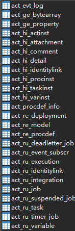

一共生成25张表

### 表结构

Activiti的后台是有数据库的支持，所有的表都以ACT_开头。 

第二部分是表示表的用途的两个字母标识。 用途也和服务的API对应。

**ACT_RE_ ***: 'RE'表示repository。 这个前缀的表包含了流程定义和流程静态资源 （图片，规则，等等）。

**ACT_RU_ ***: 'RU'表示runtime。 这些运行时的表，包含流程实例，任务，变量，异步任务，等运行中的数据。 Activiti只在流程实例执行_过程中保存这些数据，在流程结束时就会删除这些记录。这样运行时表可以一直很小速度很快。

**ACT_HI_ ***: 'HI'表示history。 这些表包含历史数据，比如历史流程实例， 变量，任务等等。
**ACT_GE_ ***: 通用数据，用于不同场景下，如存放资源文件。

| 表分类         | 表名                  | 解释                                                |
| :------------- | --------------------- | --------------------------------------------------- |
| 一般数据GE     |                       |                                                     |
|                | [ACT_GE_BYTEARRAY]    | 通用的流程定义和流程资源                            |
|                | [ACT_GE_PROPERTY]     | 系统相关属性                                        |
| 流程历史记录HI |                       |                                                     |
|                | [ACT_HI_ACTINST]      | 历史的流程实例                                      |
|                | [ACT_HI_ATTACHMENT]   | 历史的流程附件                                      |
|                | [ACT_HI_COMMENT]      | 历史的说明性信息                                    |
|                | [ACT_HI_DETAIL]       | 历史的流程运行中的细节信息                          |
|                | [ACT_HI_IDENTITYLINK] | 历史的流程运行过程中用户关系                        |
|                | [ACT_HI_PROCINST]     | 历史的流程实例                                      |
|                | [ACT_HI_TASKINST]     | 历史的任务实例                                      |
|                | [ACT_HI_VARINST]      | 历史的流程运行中的变量信息                          |
| 流程定义表RE   |                       |                                                     |
|                | [ACT_RE_DEPLOYMENT]   | 部署单元信息                                        |
|                | [ACT_RE_MODEL]        | 模型信息                                            |
|                | [ACT_RE_PROCDEF]      | 已部署的流程定义                                    |
| 运行实例表RU   |                       |                                                     |
|                | [ACT_RU_EVENT_SUBSCR] | 运行时事件                                          |
|                | [ACT_RU_EXECUTION]    | 运行时流程执行实例                                  |
|                | [ACT_RU_IDENTITYLINK] | 运行时用户关系信息，存储任务节点与参与者的相 关信息 |
|                | [ACT_RU_JOB]          | 运行时作业                                          |
|                | [ACT_RU_TASK]         | 运行时任务                                          |
|                | [ACT_RU_VARIABLE]     | 运行时变量表                                        |

## 核心Service接口

```java
public interface ProcessEngine {
    String VERSION = "7.0.0.0";

    String getName();

    void close();

    RepositoryService getRepositoryService();

    RuntimeService getRuntimeService();

    TaskService getTaskService();

    HistoryService getHistoryService();

    ManagementService getManagementService();

    DynamicBpmnService getDynamicBpmnService();

    ProcessEngineConfiguration getProcessEngineConfiguration();
}
```

**RepositoryService**

activiti的资源管理类，提供了管理和控制流程发布包和流程定义的操作。使用工作流建模工具设计的 业务流程图需要使用此service将流程定义文件的内容部署到计算机。

除了部署流程定义以外还可以：查询引擎中的发布包和流程定义。

暂停或激活发布包，对应全部和特定流程定义。

暂停意味着它们不能再执行任何操作了，激活是对应的 反向操作。获得多种资源，像是包含在发布包里的文件， 或引擎自动生成的流程图。 获得流程定义的pojo版本， 可以用来通过java解析流程，而不必通过xml。 

**RuntimeService** 

Activiti的流程运行管理类。可以从这个服务类中获取很多关于流程执行相关的信息 TaskService Activiti的任务管理类。可以从这个类中获取任务的信息。 

**HistoryService** 

Activiti的历史管理类，可以查询历史信息，执行流程时，引擎会保存很多数据（根据配置），比如流程 实例启动时间，任务的参与者，完成任务的时间，每个流程实例的执行路径，等等。 这个服务主要通过查询功能来获得这些数据。

**ManagementService** 

Activiti的引擎管理类，提供了对 Activiti 流程引擎的管理和维护功能，这些功能不在工作流驱动的应用 程序中使用，主要用于 Activiti 系统的日常维护。

## 工作流程绘制

使用的Eclipse集成Activiti插件

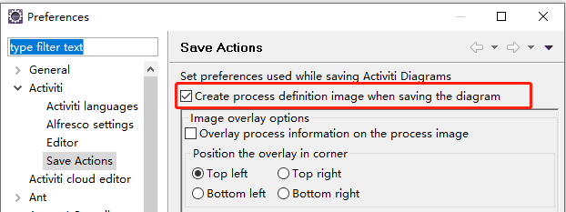

勾选自动生成图片

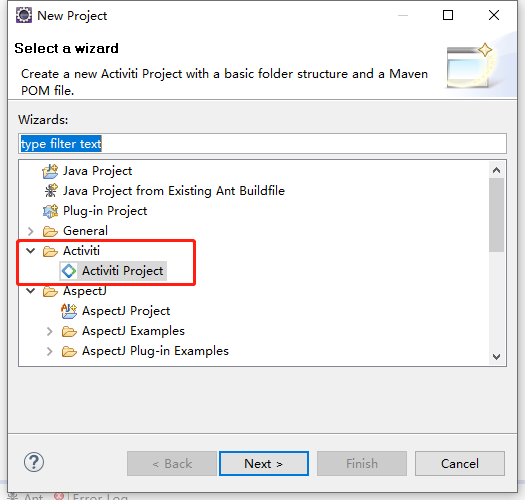

创建项目

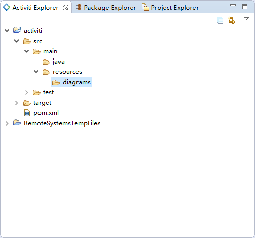

右键diagrams->new -> other

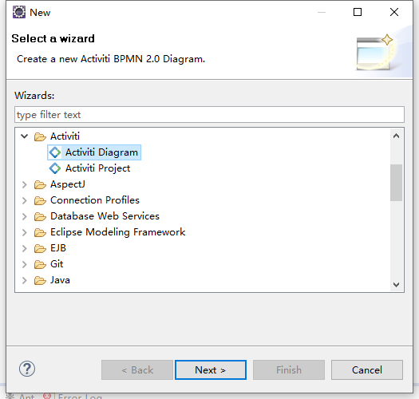


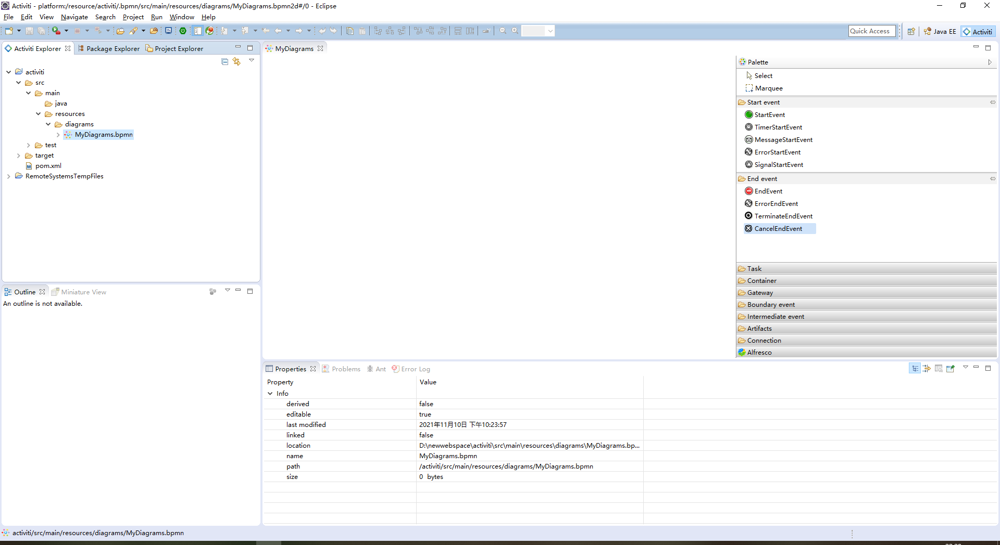

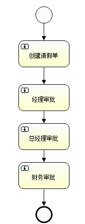

指定流程的主键，选中空白的地方

 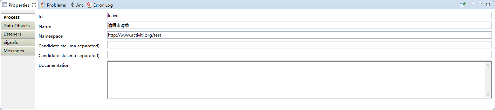

指定任务的负责人 点击创建请假单 在Properties视图中指定每个任务节点的负责人：

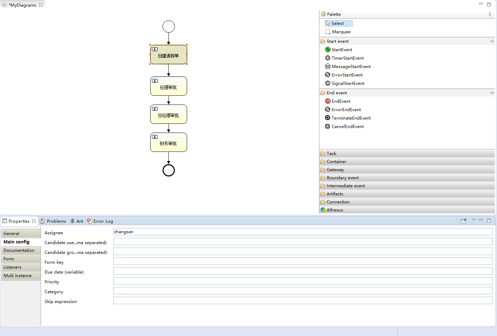

经理审批：lisi

总经理审批：wangwu

财务审批：zhaoliu

自动生成了png文件

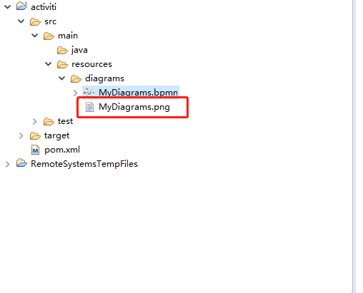

也可以使用idea插件actiBPMN

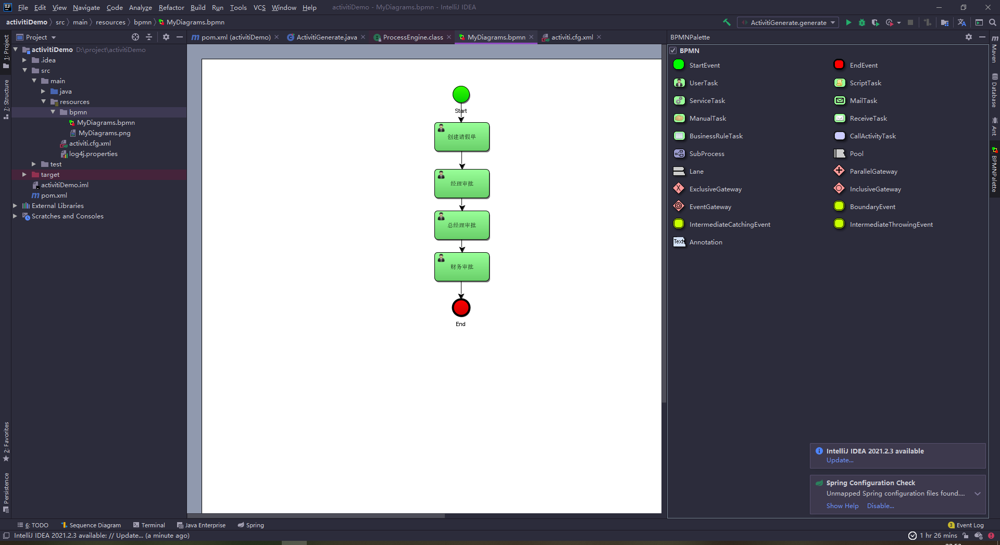

### 图标介绍

**流程符号**

​	BPMN2.0是业务流程建模符号2.0的缩写。它由Business Process Management Initiative这个非营利协会创建并不断发展。作为一种标识，BPMN 2.0是使用一些符号来明确业务流程设计流程图的一整套符号规范，它能增进业务建模时的沟通效率。 

​	目前BPMN2.0是最新的版本，它用于在BPM上下文中进行布局和可视化的沟通。接下来我们先来了解在流程设计中常见的符号。BPMN2.0的基本符合主要包含： 

**事件 Event** 

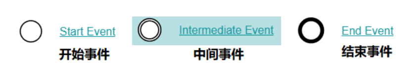

**活动 Activity** 

活动是工作或任务的一个通用术语。一个活动可以是一个任务，还可以是一个当前流程的子处理流程； 其次，你还可以为活动指定不同的类型。常见活动如下： 

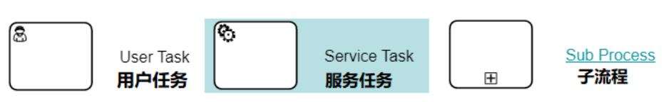

**网关 GateWay** 

网关用来处理决策，有几种常用网关需要了解： 

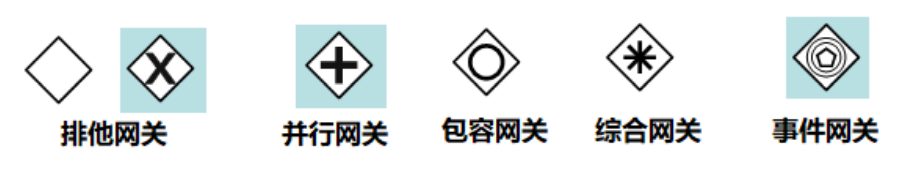

**排他网关(x)** 

——只有一条路径会被选择。流程执行到该网关时，按照输出流的顺序逐个计算，当条件的计算结果为 true时，继续执行当前网关的输出流； 如果多条线路计算结果都是 true，则会执行第一个值为 true 的线路。如果所有网关计算结果没有 true，则引擎会抛出异常。 排他网关需要和条件顺序流结合使用，default 属性指定默认顺序流，当所有的条件不满足时会执行默 认顺序流。 

**并行网关(+)** 

——所有路径会被同时选择 拆分 —— 并行执行所有输出顺序流，为每一条顺序流创建一个并行执行线路。 合并 —— 所有从并行网关拆分并执行完成的线路均在此等候，直到所有的线路都执行完成才继续向下 执行。 

**包容网关(+)** 

—— 可以同时执行多条线路，也可以在网关上设置条件 拆分 —— 计算每条线路上的表达式，当表达式计算结果为true时，创建一个并行线路并继续执行 合并 —— 所有从并行网关拆分并执行完成的线路均在此等候，直到所有的线路都执行完成才继续向下 执行。 

**事件网关(+)** 

—— 专门为中间捕获事件设置的，允许设置多个输出流指向多个不同的中间捕获事件。当流程执行到事 件网关后，流程处于等待状态，需要等待抛出事件才能将等待状态转换为活动状态。

**流向 Flow**

流是连接两个流程节点的连线。常见的流向包含以下几种： 

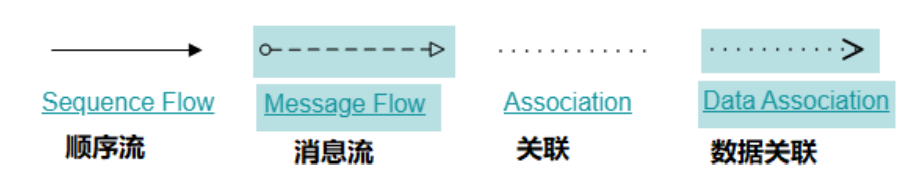

流程设计器使用 

**Palette（画板）** 

Connection—连接 

Event---事件 

Task---任务 

Gateway---网关 

Container—容器 

Boundary event—边界事件 

Intermediate event- -中间事件

## Activiti流程操作

### 部署文件

**单个文件部署**

```java
/**
 * 实现文件的单个部署
 */
@Test
public void test03(){
    // 1.获取ProcessEngine对象
            ProcessEngine engine = ProcessEngines.getDefaultProcessEngine();
    // 2.获取RepositoryService进行部署操作
            RepositoryService service = engine.getRepositoryService();
    // 3.使用RepositoryService进行部署操作
            Deployment deploy = service.createDeployment()
                    .addClasspathResource("bpmn/MyDiagrams.bpmn") // 添加bpmn资源
                    .addClasspathResource("bpmn/MyDiagrams.png") // 添加png资源
                    .name("请假申请流程")
                    .deploy();// 部署流程
    // 4.输出流程部署的信息
    System.out.println("流程部署的id:" + deploy.getId());
    System.out.println("流程部署的名称：" + deploy.getName());
}
```

**Zip包部署**

将bpmn文件和png文件两个打包为一个zip文件，统一上传

```java
/**
 * 通过一个zip文件来部署操作
 */
@Test
public void test04(){
    // 定义zip文件的输入流
    InputStream inputStream =
            this.getClass().getClassLoader().getResourceAsStream("bpmn/evection.zip");
    // 对 inputStream 做装饰
    ZipInputStream zipInputStream = new ZipInputStream(inputStream);
    ProcessEngine engine = ProcessEngines.getDefaultProcessEngine();
    RepositoryService repositoryService = engine.getRepositoryService();
    Deployment deploy = repositoryService.createDeployment()
            .addZipInputStream(zipInputStream)
            .name("请假申请流程")
            .deploy();
    // 4.输出流程部署的信息
    System.out.println("流程部署的id:" + deploy.getId());
    System.out.println("流程部署的名称：" + deploy.getName());
}
```

数据库中

流程定义部署后操作activiti中的三张表 

act_re_deployment: 流程定义部署表，每部署一次就增加一条记录

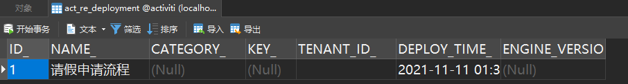

act_re_procdef ：流程定义表，部署每个新的流程定义都会在这张表中增加一条记录


act_ge_bytearray ：流程资源表，流程部署的 bpmn文件和png图片会保存在该表中

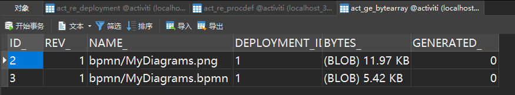

### 启动流程实例

流程定义部署在Activiti后就可以通过工作流管理业务流程，也就是说上边部署的出差申请流程可以使用了。 

针对该流程，启动一个流程表示发起一个新的请假申请单，这就相当于Java类和Java对象的关系，类定义好了后需要new创建一个对象使用，当然可以new出多个对象来，对于请假申请流程，张三可以发起一个请假申请单需要启动一个流程实例。

```java
/**
 * 启动一个流程实例
 */
@Test
public void test05(){
    // 1.创建ProcessEngine对象
    ProcessEngine engine = ProcessEngines.getDefaultProcessEngine();
    // 2.获取RuntimeService对象
    RuntimeService runtimeService = engine.getRuntimeService();
    // 3.根据流程定义的id启动流程
    String id= "leave";
    ProcessInstance processInstance =
            runtimeService.startProcessInstanceByKey(id);
    // 4.输出相关的流程实例信息
    System.out.println("流程定义的ID：" +
            processInstance.getProcessDefinitionId());
    System.out.println("流程实例的ID：" + processInstance.getId());
    System.out.println("当前活动的ID：" + processInstance.getActivityId());
}
```


启动流程实例涉及到的表结构 

act_hi_actinst 流程实例执行历史 

act_hi_identitylink 流程的参与用户的历史信息 

act_hi_procinst 流程实例历史信息 

act_hi_taskinst 流程任务历史信息 

act_ru_execution 流程执行信息 

act_ru_identitylink 流程的参与用户信息 

act_ru_task 任务信息

### 任务查询

流程启动后，任务的负责人就可以查询自己当前能够处理的任务了，查询出来的任务都是当前用户的待办任务

```java
/**
 * 任务查询
 */
@Test
public void test06(){
    String assignee ="zhangsan";
    ProcessEngine engine = ProcessEngines.getDefaultProcessEngine();
    // 任务查询 需要获取一个 TaskService 对象
    TaskService taskService = engine.getTaskService();
    // 根据流程的key和任务负责人 查询任务
    List<Task> list = taskService.createTaskQuery()
            .processDefinitionKey("leave")
            .taskAssignee(assignee)
            .list();
    // 输出当前用户具有的任务
    for (Task task : list) {
        System.out.println("流程实例id：" + task.getProcessInstanceId());
        System.out.println("任务id:" + task.getId());
        System.out.println("任务负责人：" + task.getAssignee());
        System.out.println("任务名称：" + task.getName());
    }
}
```

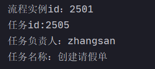

### 任务流程处理

任务负责人查询出来了待办的人，选择任务进行处理，完成任务

```java
/**
 * 流程任务的处理
 */
@Test
public void test07(){
    ProcessEngine engine = ProcessEngines.getDefaultProcessEngine();
    TaskService taskService = engine.getTaskService();
    Task task = taskService.createTaskQuery()
            .processDefinitionKey("leave")
            .taskAssignee("zhangsan")
            .singleResult();
    // 完成任务
    taskService.complete(task.getId());
}
```

完成任务后lisi就能查询到任务

### 流程定义查询

查询流程相关的信息，包括流程的定义，流程的部署，流程定义的版本

```java
/**
 * 查询流程的定义
 */
@Test
public void test08() {
    ProcessEngine engine = ProcessEngines.getDefaultProcessEngine();
    RepositoryService repositoryService = engine.getRepositoryService();
    // 获取一个 ProcessDefinitionQuery对象 用来查询操作
    ProcessDefinitionQuery processDefinitionQuery =
            repositoryService.createProcessDefinitionQuery();
    List<ProcessDefinition> list =
            processDefinitionQuery.processDefinitionKey("leave")
                    .orderByProcessDefinitionVersion() // 安装版本排序
                    .desc() // 倒序
                    .list();
    // 输出流程定义的信息
    for (ProcessDefinition processDefinition : list) {
        System.out.println("流程定义的ID：" + processDefinition.getId());
        System.out.println("流程定义的name：" + processDefinition.getName());
        System.out.println("流程定义的key:" + processDefinition.getKey());
        System.out.println("流程定义的version:" +
                processDefinition.getVersion());
        System.out.println("流程部署的id:" +
                processDefinition.getDeploymentId());
    }
}
```

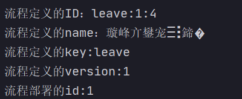

### 流程的删除

```java
/**
 * 删除流程
 */
@Test
public void test09(){
    ProcessEngine engine = ProcessEngines.getDefaultProcessEngine();
    RepositoryService repositoryService = engine.getRepositoryService();
    // 删除流程定义，如果该流程定义已经有了流程实例启动则删除时报错
    // act_re_deployment表中的id
    repositoryService.deleteDeployment("1");
    // 设置为TRUE 级联删除流程定义，及时流程有实例启动，也可以删除，设置为false 非级联删除操作。
    //repositoryService.deleteDeployment("1",true);
}
```

### 流程资源下载

从数据库中把 这些资源下载到本地。

使用activiti的api来操作我们需要添加commons-io的依赖

```xml
<dependency>
        <groupId>commons-io</groupId>
        <artifactId>commons-io</artifactId>
        <version>2.6</version>
</dependency>
```

```java
/**
 * 读取数据库中的资源文件
 */
@Test
public void test10() throws Exception{
    // 1.得到ProcessEngine对象
    ProcessEngine engine = ProcessEngines.getDefaultProcessEngine();
    // 2.获取RepositoryService对象
    RepositoryService repositoryService = engine.getRepositoryService();
    // 3.得到查询器
    ProcessDefinition definition =
            repositoryService.createProcessDefinitionQuery()
                    .processDefinitionKey("leave")
                    .singleResult();
    // 4.获取流程部署的id
    String deploymentId = definition.getDeploymentId();
    // 5.通过repositoryService对象的相关方法 来获取图片信息和bpmn信息
    // png图片
    InputStream pngInput = repositoryService
            .getResourceAsStream(deploymentId,
                    definition.getDiagramResourceName());
    // bpmn 文件的流
    InputStream bpmnInput = repositoryService
            .getResourceAsStream(deploymentId,
                    definition.getResourceName());
    // 6.文件的保存
    File filePng = new File("d:/leave.png");
    File fileBpmn = new File("d:/leave.bpmn");
    OutputStream pngOut = new FileOutputStream(filePng);
    OutputStream bpmnOut = new FileOutputStream(fileBpmn);
    IOUtils.copy(pngInput,pngOut);
    IOUtils.copy(bpmnInput,bpmnOut);
    pngInput.close();
    pngOut.close();
    bpmnInput.close();
    bpmnOut.close();
}
```

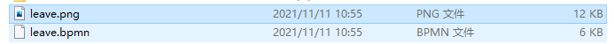

### 流程历史信息的查看

查看被删除的历史信息

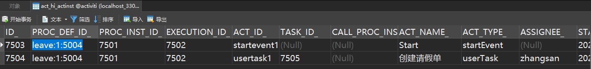

```java
/**
 * 流程历史信息查看
 */
@Test
public void test11(){
    ProcessEngine engine = ProcessEngines.getDefaultProcessEngine();
    // 查看历史信息我们需要通过 HistoryService来实现
    HistoryService historyService = engine.getHistoryService();
    // 获取 actinst 表的查询对象
    HistoricActivityInstanceQuery instanceQuery =
            historyService.createHistoricActivityInstanceQuery();
    instanceQuery.processDefinitionId("leave:1:5004");
    instanceQuery.orderByHistoricActivityInstanceStartTime().desc();
    List<HistoricActivityInstance> list = instanceQuery.list();
    // 输出查询的结果
    for (HistoricActivityInstance hi : list) {
        System.out.println(hi.getActivityId());
        System.out.println(hi.getActivityName());
        System.out.println(hi.getActivityType());
        System.out.println(hi.getAssignee());
        System.out.println(hi.getProcessDefinitionId());
        System.out.println(hi.getProcessInstanceId());
        System.out.println("-----------------------");
    }
}
```

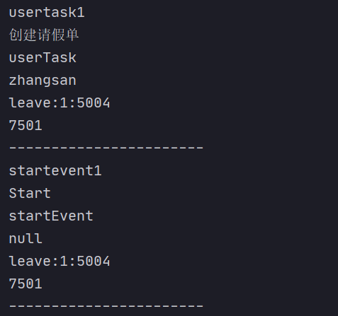
