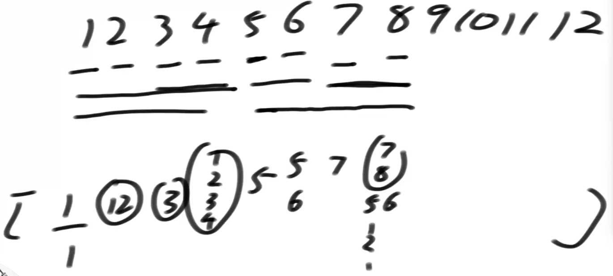
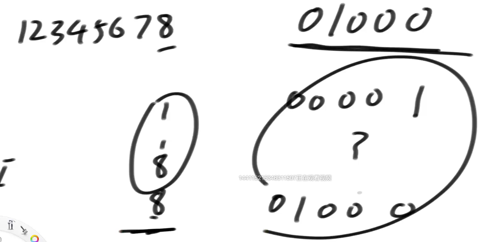
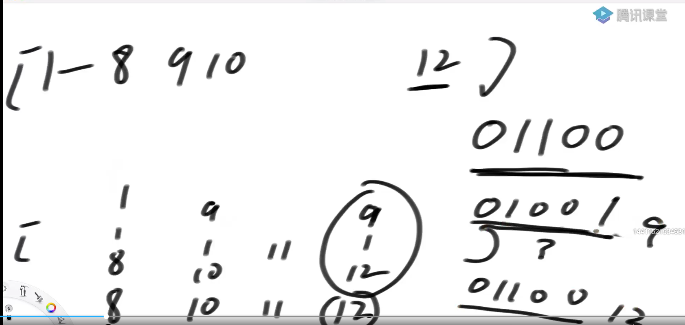
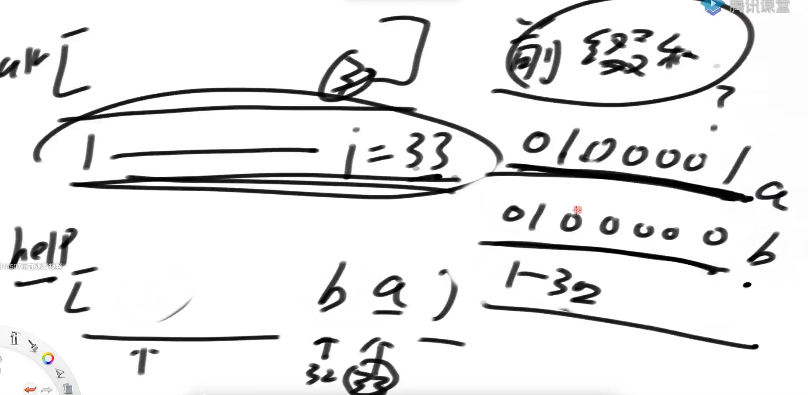
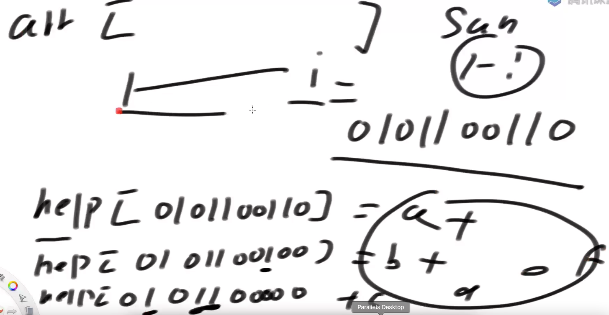
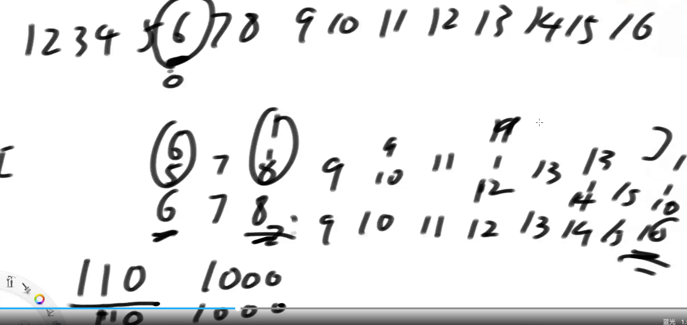
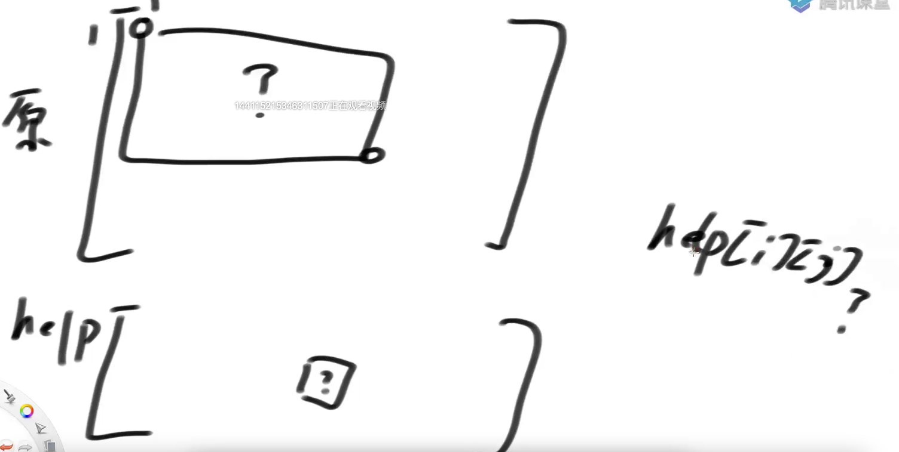
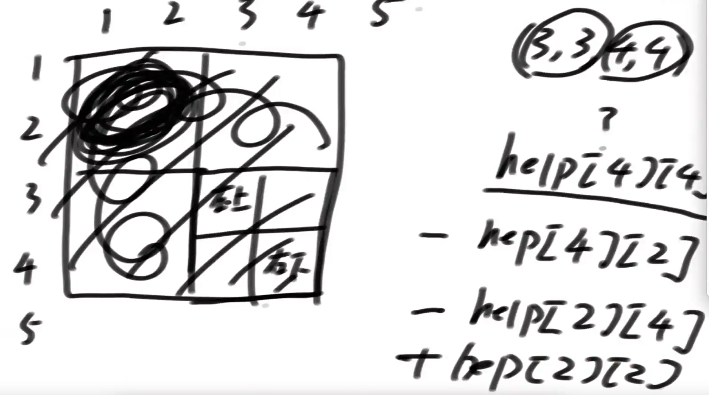
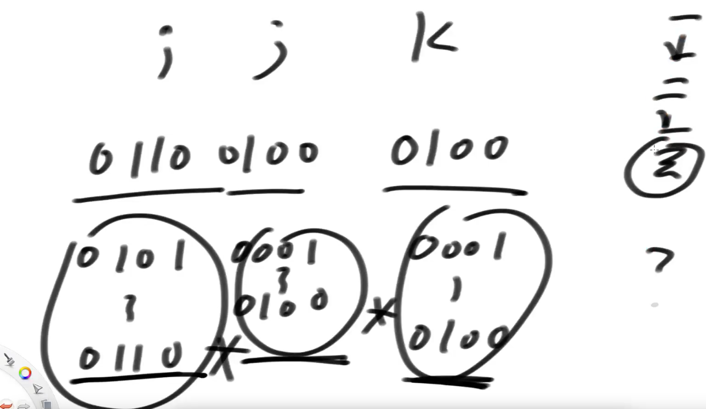

# IndexTree

单点更新再查询一个范围的累加和很快



有点像2048游戏，1自己没人凑一顿，2自己能和1凑一对，3自己，4能和3一对且34能和12一对变成1234....



8位置管的范围是 二进制01000中最后一个1变0 + 1 到自己 



同理 01100 最后一位变0再+1 01001 - 01100 9-12

---



如果求前33的累加和 = help数组中33的位置的值a（他自己） + help数组中32位置的值b（1-32的累加和）

+++ 到没有1可以抹去 就是要求得结果



---



6位置的值假如发生变化，哪些位置受到牵连？

6的二进制110，最右侧的1相加 - > 1000 (8) ,最右侧的1相加 - > 10000 (16)

```java
// 下标从1开始！
public static class IndexTree {

   private int[] tree;
   private int N;

   // 0位置弃而不用！
   public IndexTree(int size) {
      N = size;
      tree = new int[N + 1];
   }

   // 1~index 累加和是多少？
   public int sum(int index) {
      int ret = 0;
      while (index > 0) {
         ret += tree[index];
         // 减去末位置的1
         index -= index & -index;
      }
      return ret;
   }

   // index & -index : 提取出index最右侧的1出来
   // index :           0011001000
   // index & -index :  0000001000
   // index位置加上了d
   public void add(int index, int d) {
      while (index <= N) {
         tree[index] += d;
         index += index & -index;
      }
   }
}

```

复杂度logN，因为位数就是logN

## 二维indexTree



```java
public class Code02_IndexTree2D {
   private int[][] tree;
   private int[][] nums;
   private int N;
   private int M;

   public Code02_IndexTree2D(int[][] matrix) {
      if (matrix.length == 0 || matrix[0].length == 0) {
         return;
      }
      N = matrix.length;
      M = matrix[0].length;
      tree = new int[N + 1][M + 1];
      nums = new int[N][M];
      for (int i = 0; i < N; i++) {
         for (int j = 0; j < M; j++) {
            update(i, j, matrix[i][j]);
         }
      }
   }

   private int sum(int row, int col) {
      int sum = 0;
      for (int i = row + 1; i > 0; i -= i & (-i)) {
         for (int j = col + 1; j > 0; j -= j & (-j)) {
            sum += tree[i][j];
         }
      }
      return sum;
   }

   public void update(int row, int col, int val) {
      if (N == 0 || M == 0) {
         return;
      }
      int add = val - nums[row][col];
      nums[row][col] = val;
      for (int i = row + 1; i <= N; i += i & (-i)) {
         for (int j = col + 1; j <= M; j += j & (-j)) {
            tree[i][j] += add;
         }
      }
   }

   public int sumRegion(int row1, int col1, int row2, int col2) {
      if (N == 0 || M == 0) {
         return 0;
      }
      return sum(row2, col2) + sum(row1 - 1, col1 - 1) - sum(row1 - 1, col2) - sum(row2, col1 - 1);
   }
```


---

求3，3 到 4，4范围



三维



