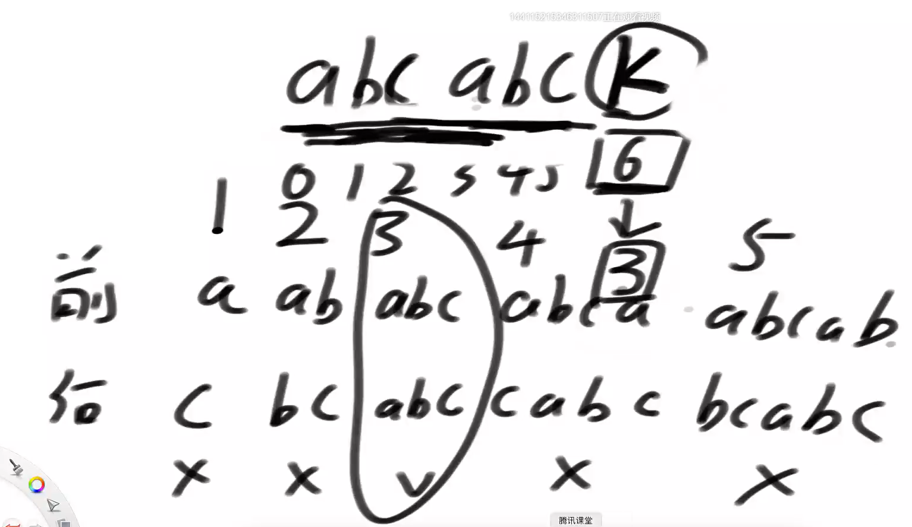

# KMP算法

假设字符串str长度为N，字符串match长度为M，M <= N

想确定str中是否有某个子串是等于match的。

时间复杂度O(N)


暴力方法O（N * M），需要回退



6位置的3的含义：前后都不能取到整体，相等的长度的最大值，6位置上的字符完全忽略


人为规定0位置的值是-1，1位置的值是0


基于一个字符串把每一个位置信息都搞出来 next数组

---


S1 > S2 ,当到5位置时发现不等，这时去next数组中找到不等位置的值是2，在S1数组中能够找到j位置（相等的第二段的起始位置）


将S2的开始位置推到和j等长发现2位置又不相等，去next数组中找到值为1


直到0位置和t对齐发现不等停止，S1换下一个字符

推的位置等于比对位置变成next数组中值的位置

## KMP算法核心

1）如何理解next数组


如果i-1位置是7，？== b的话，i位置就是8

如果不等再往前看一位，直到相等得到当前位置的值+1就是i位置的值


2）如何利用next数组加速匹配过程，优化时的两个实质！


```java
public static int getIndexOf(String s1, String s2) {
   if (s1 == null || s2 == null || s2.length() < 1 || s1.length() < s2.length()) {
      return -1;
   }
   char[] str1 = s1.toCharArray();
   char[] str2 = s2.toCharArray();
   //  x Str1中比对到的位置，y Str2中比对到的位置，起始位置可以计算出来
   int x = 0;
   int y = 0;
   // O(M) m <= n
   // 获取next数组
   int[] next = getNextArray(str2);
   // O(N)
   while (x < str1.length && y < str2.length) {
      if (str1[x] == str2[y]) {
         x++;
         y++;
      } else if (next[y] == -1) { // y == 0
         x++;
      } else {
         y = next[y];
      }
   }
   // y越界了-去x的位置就是等长的起始位置，如果x越界了说明没有答案返回-1
   return y == str2.length ? x - y : -1;
}

public static int[] getNextArray(char[] str2) {
   if (str2.length == 1) {
      return new int[] { -1 };
   }
   int[] next = new int[str2.length];
   next[0] = -1;
   next[1] = 0;
   int i = 2; // 目前在哪个位置上求next数组的值
   int cn = 0; // 当前是哪个位置的值再和i-1位置的字符比较
   while (i < next.length) {
      if (str2[i - 1] == str2[cn]) { // 配成功的时候
         // next[i] = cn + 1;
         // i++;
         next[i++] = ++cn;
      } else if (cn > 0) {
         
         cn = next[cn];
      } else {
         next[i++] = 0;
      }
   }
   return next;
}
```

## 题目一

给定两棵二叉树的头节点head1和head2


想知道head1中是否有某个子树的结构和head2完全一样


序列成字符串用kmp比对

## 题目二

判断str1和str2是否是旋转字符串 只能转一次