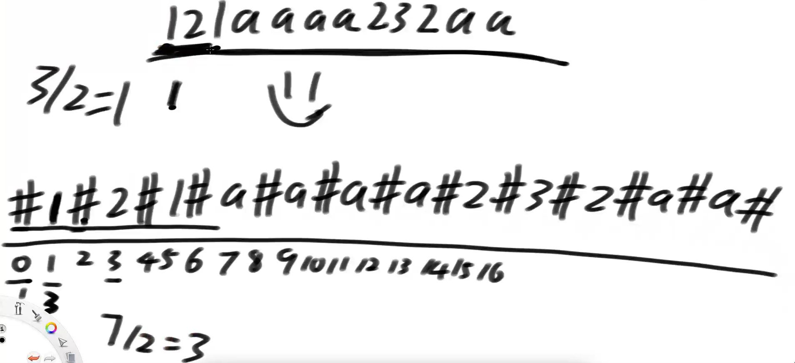

# Manacher算法

假设字符串str长度为N，想返回最长回文子串的长度


时间复杂度O(N)


**暴力方法**



每个字符串的左右都加上#，以每一个字符为中心点向两边扩得到的数向下取整就是原始的回文串长度，#可以是任意字符，是出现过的字符也不干扰

O（n2）

## **Manacher算法核心**

**回文半径和回文直径**

1221 直径4 半径2

12321 直径5 半径3


1）理解回文半径数组

每个位置的回文半径


2）理解所有中心的回文最右边界R，和取得R时的中心点C

每次找到生成回文的最右侧字符，更新R


3）理解  L…(i`)…C…(i)…R 的结构，以及根据i’回文长度进行的状况划分

4）每一种情况划分，都可以加速求解i回文半径的过程

---


1. i没有被R罩住，继续暴力不优化

2. i被R罩住，一定存在L…(i`)…C…(i)…R的结构,i==r时，l=i‘

   1. i’的回文串再L - R中

   2. i'的回文区域在L - R外 

   3. i'的左回文边界== L 

      

      i的回文长度= i'

      

      回文半径就是i - R

      

      可以推出最小区域abcba，继续验证S位置


```java
public static int manacher(String s) {
   if (s == null || s.length() == 0) {
      return 0;
   }
   // "12132" -> "#1#2#1#3#2#"
   char[] str = manacherString(s);
   // 回文半径的大小
   int[] pArr = new int[str.length];
   int C = -1;
   // 讲述中：R代表最右的扩成功的位置
   // coding：最右的扩成功位置的，再下一个位置
   int R = -1;
   int max = Integer.MIN_VALUE;
   for (int i = 0; i < str.length; i++) { // 0 1 2
      // R第一个违规的位置，i>= R
      // i位置扩出来的答案，i位置扩的区域，至少是多大。
      // 2* C- i == C -（i - C）就是i'
      pArr[i] = R > i ? Math.min(pArr[2 * C - i], R - i) : 1;
       
      // 1暴力和2的第三种情况会pArr[i]++;
      while (i + pArr[i] < str.length && i - pArr[i] > -1) {
         if (str[i + pArr[i]] == str[i - pArr[i]]) {
            pArr[i]++;
         } else {
            break;
         }
      }
       
      // 更新位置
      if (i + pArr[i] > R) {
         R = i + pArr[i];
         C = i;
      }
      max = Math.max(max, pArr[i]);
   }
   // 半径
   return max - 1;
}

public static char[] manacherString(String str) {
   char[] charArr = str.toCharArray();
   char[] res = new char[str.length() * 2 + 1];
   int index = 0;
   for (int i = 0; i != res.length; i++) {
      res[i] = (i & 1) == 0 ? '#' : charArr[index++];
   }
   return res;
}
```

## 题目

给定一个字符串，只能在后边添加字串，问至少添加字串的长度

abc12321 + cba

**思路**

回文串包含最后一个字符的长度 = a

总长度 - a 就是答案

用manacher算法推到i=r就能求出

