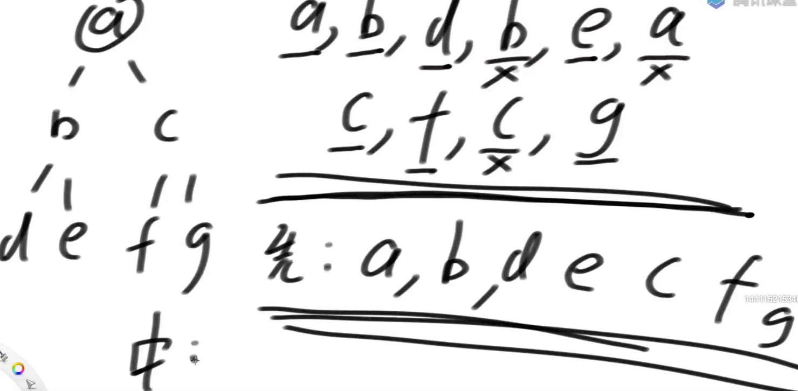

# Morris遍历

利用树自己的空闲空间，而不是用栈结构

## 细节

假设来到当前节点cur，开始时cur来到头节点位置

1）如果cur没有左孩子，cur向右移动(cur = cur.right)

2）如果cur有左孩子，找到左子树上最右的节点mostRight：

 a.如果mostRight的右指针指向空，让其指向cur，

 然后cur向左移动(cur = cur.left)

 b.如果mostRight的右指针指向cur，让其指向null，

 然后cur向右移动(cur = cur.right)

3）cur为空时遍历停止

## 实质

建立一种机制：

对于没有左子树的节点只到达一次，

对于有左子树的节点会到达两次

morris遍历时间复杂度依然是O(N)，常数项舍去，额外空间复杂度是O(1)

```java
public static void morris(Node head) {
   if (head == null) {
      return;
   }
   Node cur = head;
   Node mostRight = null;
   while (cur != null) {
      mostRight = cur.left;
      if (mostRight != null) {
         while (mostRight.right != null && mostRight.right != cur) {
            mostRight = mostRight.right;
         }
         if (mostRight.right == null) {
            mostRight.right = cur;
            cur = cur.left;
            continue;
         } else {
            mostRight.right = null;
         }
      }
      cur = cur.right;
   }
}
```



morris - > 先序遍历

出现两次的数字，舍去第二次出现的数字

```Java
public static void morrisPre(Node head) {
   if (head == null) {
      return;
   }
   Node cur = head;
   Node mostRight = null;
   while (cur != null) {
      mostRight = cur.left;
      if (mostRight != null) {
         while (mostRight.right != null && mostRight.right != cur) {
            mostRight = mostRight.right;
         }
         if (mostRight.right == null) {
            System.out.print(cur.value + " ");
            mostRight.right = cur;
            cur = cur.left;
            continue;
         } else {
            mostRight.right = null;
         }
      } else {
         System.out.print(cur.value + " ");
      }
      cur = cur.right;
   }
   System.out.println();
}
```

morris - > 中序遍历

出现两次的数字，舍去第一次出现的数字


```java
public static void morrisIn(Node head) {
   if (head == null) {
      return;
   }
   Node cur = head;
   Node mostRight = null;
   while (cur != null) {
      mostRight = cur.left;
      if (mostRight != null) {
         while (mostRight.right != null && mostRight.right != cur) {
            mostRight = mostRight.right;
         }
         if (mostRight.right == null) {
            mostRight.right = cur;
            cur = cur.left;
            continue;
         } else {
            mostRight.right = null;
         }
      }
      System.out.print(cur.value + " ");
      cur = cur.right;
   }
   System.out.println();
}
```


morris - > 后序遍历

```java
public static void morrisPos(Node head) {
   if (head == null) {
      return;
   }
   Node cur = head;
   Node mostRight = null;
   while (cur != null) {
      mostRight = cur.left;
      if (mostRight != null) {
         while (mostRight.right != null && mostRight.right != cur) {
            mostRight = mostRight.right;
         }
         if (mostRight.right == null) {
            mostRight.right = cur;
            cur = cur.left;
            continue;
         } else {
            mostRight.right = null;
            printEdge(cur.left);
         }
      }
      cur = cur.right;
   }
   // 最后打印整棵树的右边界
   printEdge(head);
   System.out.println();
}


public static void printEdge(Node head) {
		Node tail = reverseEdge(head);
		Node cur = tail;
		while (cur != null) {
			System.out.print(cur.value + " ");
			cur = cur.right;
		}
		reverseEdge(tail);
	}
	// 逆序打印
	public static Node reverseEdge(Node from) {
		Node pre = null;
		Node next = null;
		while (from != null) {
			next = from.right;
			from.right = pre;
			pre = from;
			from = next;
		}
		return pre;
	}
```

## 判断搜索二叉树

```java
public static boolean isBST(Node head) {
   if (head == null) {
      return true;
   }
   Node cur = head;
   Node mostRight = null;
   Integer pre = null;
   boolean ans = true;
   while (cur != null) {
      mostRight = cur.left;
      if (mostRight != null) {
         while (mostRight.right != null && mostRight.right != cur) {
            mostRight = mostRight.right;
         }
         if (mostRight.right == null) {
            mostRight.right = cur;
            cur = cur.left;
            continue;
         } else {
            mostRight.right = null;
         }
      }
      // 中序morris遍历的打印改成比对，中序结果是否是升序
      if (pre != null && pre >= cur.value) {
         // 不能直接返回，我们改了树的指向，必须等他全部执行完
         ans = false;
      }
      // 向后移
      pre = cur.value;
      cur = cur.right;
   }
   return ans;
}
```

## 题目

给定一棵二叉树的头节点head

求以head为头的树中，最小深度是多少？

**递归套路**

```java
public static int minHeight1(Node head) {
   if (head == null) {
      return 0;
   }
   return p(head);
}

// 返回x为头的树，最小深度是多少
public static int p(Node x) {
   if (x.left == null && x.right == null) {
      // 叶节点深度是1
      return 1;
   }
   // 左右子树起码有一个不为空
   int leftH = Integer.MAX_VALUE;
   if (x.left != null) {
      leftH = p(x.left);
   }
   int rightH = Integer.MAX_VALUE;
   if (x.right != null) {
      rightH = p(x.right);
   }
   return 1 + Math.min(leftH, rightH);
}
```

**morris遍历**

```java
// 根据morris遍历改写
public static int minHeight2(Node head) {
   if (head == null) {
      return 0;
   }
   Node cur = head;
   Node mostRight = null;
   int curLevel = 0;
   int minHeight = Integer.MAX_VALUE;
   while (cur != null) {
      mostRight = cur.left;
      if (mostRight != null) {
         int rightBoardSize = 1;
         while (mostRight.right != null && mostRight.right != cur) {
            rightBoardSize++;
            mostRight = mostRight.right;
         }
         if (mostRight.right == null) { // 第一次到达
            curLevel++;
            mostRight.right = cur;
            cur = cur.left;
            continue;
         } else { // 第二次到达
            if (mostRight.left == null) {
               minHeight = Math.min(minHeight, curLevel);
            }
            curLevel -= rightBoardSize;
            mostRight.right = null;
         }
      } else { // 只有一次到达
         curLevel++;
      }
      cur = cur.right;
   }
   int finalRight = 1;
   cur = head;
   while (cur.right != null) {
      finalRight++;
      cur = cur.right;
   }
   if (cur.left == null && cur.right == null) {
      minHeight = Math.min(minHeight, finalRight);
   }
   return minHeight;
}
```