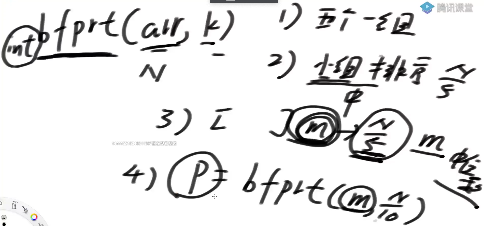
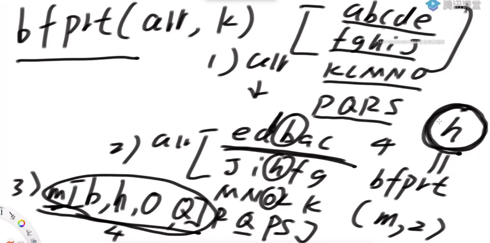

# bfprt算法

## 题目

在无序数组中求第K小的数

**改写快排的方法**

**递归**

```java
// 改写快排，时间复杂度O(N)
// k >= 1
public static int minKth2(int[] array, int k) {
   int[] arr = copyArray(array);
   // 第K小的数,就是k-1位置的数
   return process2(arr, 0, arr.length - 1, k - 1);
}

public static int[] copyArray(int[] arr) {
   int[] ans = new int[arr.length];
   for (int i = 0; i != ans.length; i++) {
      ans[i] = arr[i];
   }
   return ans;
}

// arr 第k小的数
// process2(arr, 0, N-1, k-1)
// arr[L..R]  范围上，如果排序的话(不是真的去排序)，找位于index的数
// index [L..R]
public static int process2(int[] arr, int L, int R, int index) {
   if (L == R) { // L = =R ==INDEX
      return arr[L];
   }
   // 不止一个数  L +  [0, R -L]
   // 做划分值，< = > pivot 
   int pivot = arr[L + (int) (Math.random() * (R - L + 1))];
   // 返回等于区域的左边界range[0]、右边界range[1]
   int[] range = partition(arr, L, R, pivot);
   // 等于区域命中
   if (index >= range[0] && index <= range[1]) {
      return arr[index];
   } else if (index < range[0]) {
      return process2(arr, L, range[0] - 1, index);
   } else {
      return process2(arr, range[1] + 1, R, index);
   }
}

public static int[] partition(int[] arr, int L, int R, int pivot) {
   int less = L - 1;
   int more = R + 1;
   int cur = L;
   while (cur < more) {
      if (arr[cur] < pivot) {
         swap(arr, ++less, cur++);
      } else if (arr[cur] > pivot) {
         swap(arr, cur, --more);
      } else {
         cur++;
      }
   }
   return new int[] { less + 1, more - 1 };
}

public static void swap(int[] arr, int i1, int i2) {
   int tmp = arr[i1];
   arr[i1] = arr[i2];
   arr[i2] = tmp;
}
```

**迭代**

```java
// 时间复杂度O(N)
public static int minKth(int[] arr, int index) {
   int L = 0;
   int R = arr.length - 1;
   int pivot = 0;
   int[] range = null;
   while (L < R) {
      pivot = arr[L + (int) (Math.random() * (R - L + 1))];
      range = partition(arr, L, R, pivot);
      if (index < range[0]) {
         R = range[0] - 1;
      } else if (index > range[1]) {
         L = range[1] + 1;
      } else {
         return pivot;
      }
   }
   return arr[L];
}

public static int[] partition(int[] arr, int L, int R, int pivot) {
   int less = L - 1;
   int more = R + 1;
   int cur = L;
   while (cur < more) {
      if (arr[cur] < pivot) {
         swap(arr, ++less, cur++);
      } else if (arr[cur] > pivot) {
         swap(arr, cur, --more);
      } else {
         cur++;
      }
   }
   return new int[] { less + 1, more - 1 };
}
```


**bfprt算法**



1. 每五个数一组

2. 组内排好序

3. 将每组的中位数拿出来组成新的数组m

4. 求出数组m的中位数，也就是m，N/10 的位置，因为m的长度是N/5

   

h就是我们选出来的划分值


**问题**

为什么要5个数一组？

5个人发明的喜欢5，其实几个数一组也能收敛到O（n）


```java
// 利用bfprt算法，时间复杂度O(N)
public static int minKth3(int[] array, int k) {
   int[] arr = copyArray(array);
   return bfprt(arr, 0, arr.length - 1, k - 1);
}

// arr[L..R]  如果排序的话，位于index位置的数，是什么，返回
public static int bfprt(int[] arr, int L, int R, int index) {
   if (L == R) {
      return arr[L];
   }
   // L...R  每五个数一组
   // 每一个小组内部排好序
   // 小组的中位数组成新数组
   // 这个新数组的中位数返回
   int pivot = medianOfMedians(arr, L, R);
  
  
   int[] range = partition(arr, L, R, pivot);
   if (index >= range[0] && index <= range[1]) {
      return arr[index];
   } else if (index < range[0]) {
      return bfprt(arr, L, range[0] - 1, index);
   } else {
      return bfprt(arr, range[1] + 1, R, index);
   }
}

// arr[L...R]  五个数一组
// 每个小组内部排序
// 每个小组中位数领出来，组成marr
// marr中的中位数，返回
public static int medianOfMedians(int[] arr, int L, int R) {
   int size = R - L + 1;
   int offset = size % 5 == 0 ? 0 : 1;
   int[] mArr = new int[size / 5 + offset];
   for (int team = 0; team < mArr.length; team++) {
      int teamFirst = L + team * 5;
      // L ... L + 4
      // L +5 ... L +9
      // L +10....L+14
      mArr[team] = getMedian(arr, teamFirst, Math.min(R, teamFirst + 4));
   }
   // marr中，找到中位数
   // marr(0, marr.len - 1,  mArr.length / 2 )
   return bfprt(mArr, 0, mArr.length - 1, mArr.length / 2);
}

public static int getMedian(int[] arr, int L, int R) {
   insertionSort(arr, L, R);
   return arr[(L + R) / 2];
}

public static void insertionSort(int[] arr, int L, int R) {
   for (int i = L + 1; i <= R; i++) {
      for (int j = i - 1; j >= L && arr[j] > arr[j + 1]; j--) {
         swap(arr, j, j + 1);
      }
   }
}
```


## 题目

给定一个无序数组arr中，长度为N，给定一个正数k，返回top k个最大的数（数组中最大的k个数排序）

不同时间复杂度三个方法：

1）O(N*logN)

2）O(N + K*logN)

3）O(n + k*logk)