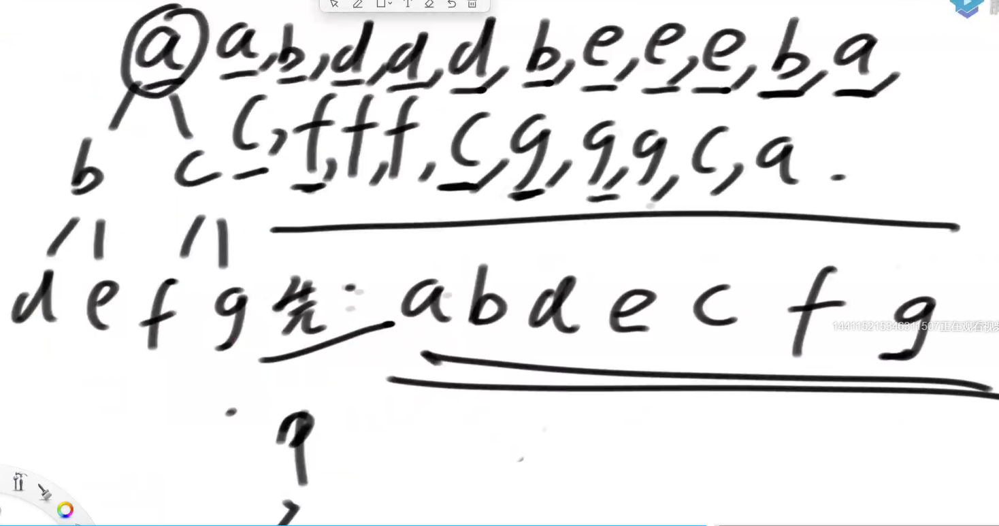
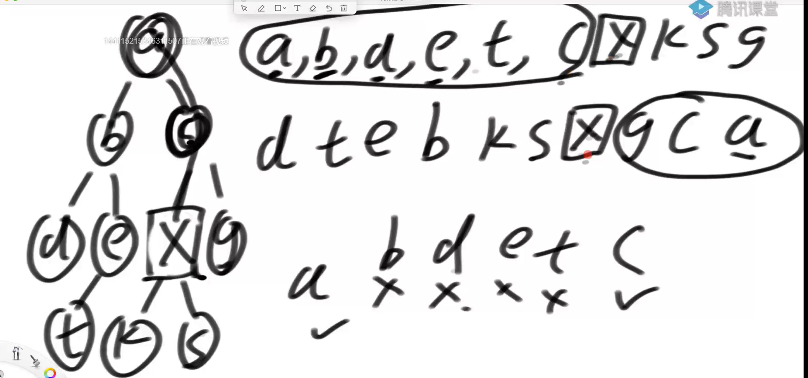
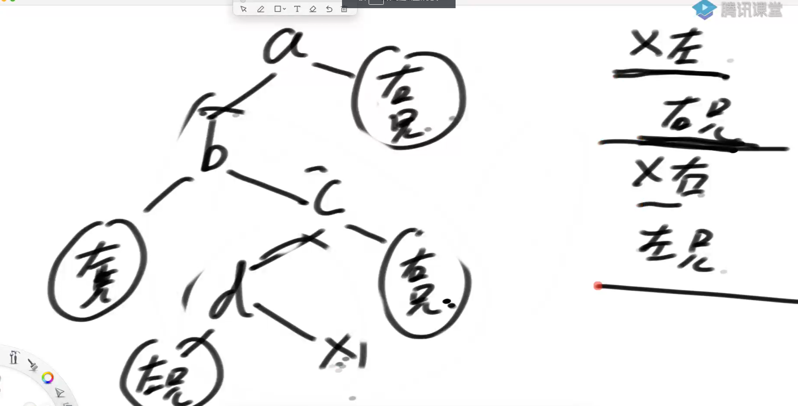
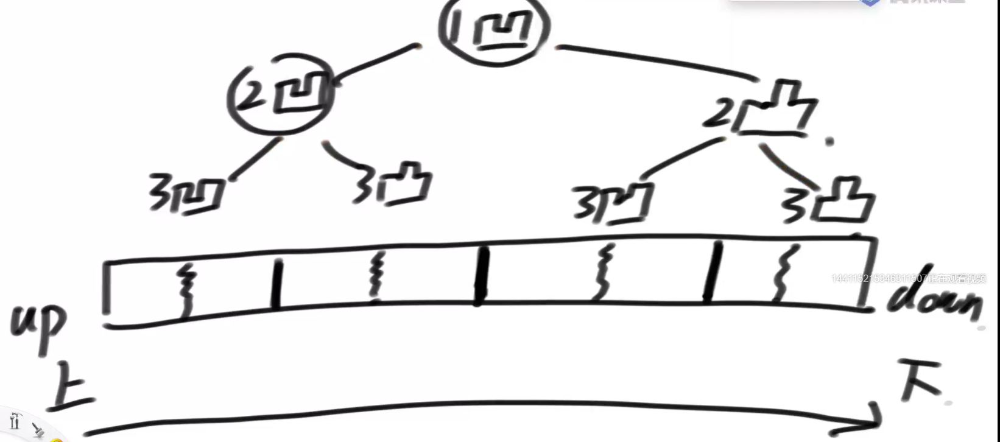
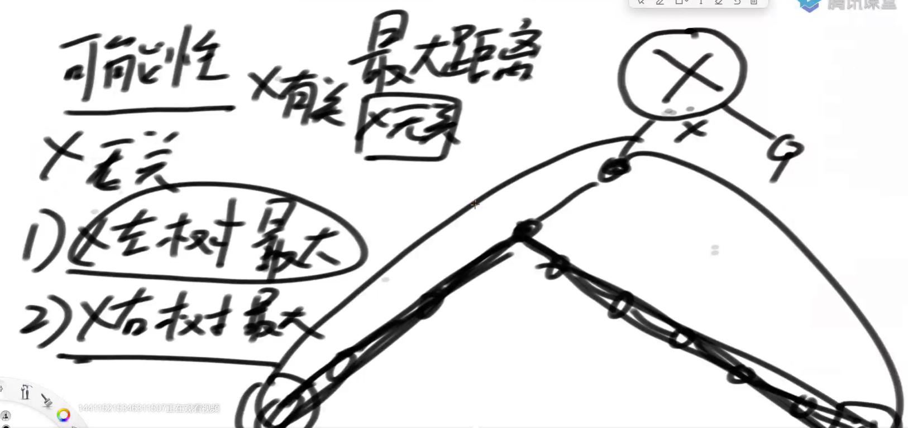

# 二叉树

## 递归序



前序：只看递归序的第一次出现

中序：只看递归序的第二次出现

后续：只看递归序的第三次出现

递归序保证每个节点都出现三次

---



第一行先序，第二行后序，画圈的交际部分是x节点的全部祖先，证明？？

**证明**

在先序遍历中，x的所有祖先一定出现在x左边

在后序遍历中，x的所有祖先一定出现在x右边

孩子节点排除在交际外，剩下的节点可以归为两类，x作为左树的右兄弟节点，x作为右树的左兄弟节点



## 先序遍历

```java
//非递归
public static void pre(Node head) {
   System.out.print("pre-order: ");
   if (head != null) {
      Stack<Node> stack = new Stack<Node>();
      stack.add(head);
      while (!stack.isEmpty()) {
         head = stack.pop();
         System.out.print(head.value + " ");
         if (head.right != null) {//先右后左
            stack.push(head.right);
         }
         if (head.left != null) {
            stack.push(head.left);
         }
      }
   }
   System.out.println();
}
```

## 后序遍历

```java
//先序改成头右左，再压入一个栈变成后续
public static void pos1(Node head) {
   System.out.print("pos-order: ");
   if (head != null) {
      Stack<Node> s1 = new Stack<Node>();
      Stack<Node> s2 = new Stack<Node>();
      s1.push(head);
      while (!s1.isEmpty()) {
         head = s1.pop();
         s2.push(head);
         if (head.left != null) {
            s1.push(head.left);
         }
         if (head.right != null) {
            s1.push(head.right);
         }
      }
      while (!s2.isEmpty()) {
         System.out.print(s2.pop().value + " ");
      }
   }
   System.out.println();
}
```

用一个栈怎么写？（了解）

```java
public static void pos2(Node h) {
   System.out.print("pos-order: ");
   if (h != null) {
      Stack<Node> stack = new Stack<Node>();
      stack.push(h);
      Node c = null;
      while (!stack.isEmpty()) {
         c = stack.peek();
         if (c.left != null && h != c.left && h != c.right) {
            stack.push(c.left);
         } else if (c.right != null && h != c.right) {
            stack.push(c.right);
         } else {
            System.out.print(stack.pop().value + " ");
            h = c;
         }
      }
   }
   System.out.println();
}
```

## 中序遍历

当前节点cur，整条左节点进栈，直到为空

从栈中弹出节点打印，让这个节点的右孩子成为cur重复第一步

栈为空停

```java
public static void in(Node head) {
   System.out.print("in-order: ");
   if (head != null) {
      Stack<Node> stack = new Stack<Node>();
      while (!stack.isEmpty() || head != null) {
         if (head != null) {
            stack.push(head);
            head = head.left;
         } else {
            head = stack.pop();
            System.out.print(head.value + " ");
            head = head.right;
         }
      }
   }
   System.out.println();
}
```

## 层序遍历

```java
public static void level(Node head) {
   if (head == null) {
      return;
   }
   Queue<Node> queue = new LinkedList<>();
   queue.add(head);
   while (!queue.isEmpty()) {
      Node cur = queue.poll();
      System.out.println(cur.value);
      if (cur.left != null) {
         queue.add(cur.left);
      }
      if (cur.right != null) {
         queue.add(cur.right);
      }
   }
}
```

## 序列化和反序列化

序列化：一颗树从内存写入到文件（字符串）中，文件既能代表结构，又能代表值信息

反序列化：把这棵树从文件（字符串）中还原

```java
//先序序列化
public static class Node {
   public int value;
   public Node left;
   public Node right;

   public Node(int data) {
      this.value = data;
   }
}

public static Queue<String> preSerial(Node head) {
   Queue<String> ans = new LinkedList<>();
   pres(head, ans);
   return ans;
}

public static void pres(Node head, Queue<String> ans) {
   if (head == null) {
      ans.add(null);
   } else {
      ans.add(String.valueOf(head.value));
      pres(head.left, ans);
      pres(head.right, ans);
   }
}
```

```java
// 先序反序列化
public static Node buildByPreQueue(Queue<String> prelist) {
   if (prelist == null || prelist.size() == 0) {
      return null;
   }
   return preb(prelist);
}

public static Node preb(Queue<String> prelist) {
   String value = prelist.poll();
   if (value == null) {
      return null;
   }
   Node head = new Node(Integer.valueOf(value));
   head.left = preb(prelist);
   head.right = preb(prelist);
   return head;
}
```

没有中序的（有歧义），有后序了解

```java
//按层数序列化
public static Queue<String> levelSerial(Node head) {
   Queue<String> ans = new LinkedList<>();
   if (head == null) {
      ans.add(null);
   } else {
      ans.add(String.valueOf(head.value));
      Queue<Node> queue = new LinkedList<Node>();
      queue.add(head);
      while (!queue.isEmpty()) {
         head = queue.poll();
         if (head.left != null) {
            ans.add(String.valueOf(head.left.value));
            queue.add(head.left);
         } else {
            ans.add(null);
         }
         if (head.right != null) {
            ans.add(String.valueOf(head.right.value));
            queue.add(head.right);
         } else {
            ans.add(null);
         }
      }
   }
   return ans;
}
```

```java
//反序列化
public static Node buildByLevelQueue(Queue<String> levelList) {
   if (levelList == null || levelList.size() == 0) {
      return null;
   }
   Node head = generateNode(levelList.poll());
   Queue<Node> queue = new LinkedList<Node>();
   if (head != null) {
      queue.add(head);
   }
   Node node = null;
   while (!queue.isEmpty()) {
      node = queue.poll();
      node.left = generateNode(levelList.poll());
      node.right = generateNode(levelList.poll());
      if (node.left != null) {
         queue.add(node.left);
      }
      if (node.right != null) {
         queue.add(node.right);
      }
   }
   return head;
}


public static Node generateNode(String val) {
		if (val == null) {
			return null;
		}
		return new Node(Integer.valueOf(val));
}
```

## 多叉树与二叉树转换

## 求二叉树最宽的一层

```java
// 使用容器
public static int maxWidthUseMap(Node head) {
		if (head == null) {
			return 0;
		}
		Queue<Node> queue = new LinkedList<>();
		queue.add(head);
		// key 在 哪一层，value
		HashMap<Node, Integer> levelMap = new HashMap<>();
		levelMap.put(head, 1);
		int curLevel = 1; // 当前你正在统计哪一层的宽度
		int curLevelNodes = 0; // 当前层curLevel层，宽度目前是多少
		int max = 0;
		while (!queue.isEmpty()) {
			Node cur = queue.poll();
			int curNodeLevel = levelMap.get(cur);
			if (cur.left != null) {
				levelMap.put(cur.left, curNodeLevel + 1);
				queue.add(cur.left);
			}
			if (cur.right != null) {
				levelMap.put(cur.right, curNodeLevel + 1);
				queue.add(cur.right);
			}
			if (curNodeLevel == curLevel) {
				curLevelNodes++;
			} else {
				max = Math.max(max, curLevelNodes);
				curLevel++;
				curLevelNodes = 1;
			}
		}
		max = Math.max(max, curLevelNodes);
		return max;
	}
// 不使用容器
public static int maxWidthNoMap(Node head) {
   if (head == null) {
      return 0;
   }
   Queue<Node> queue = new LinkedList<>();
   queue.add(head);
   Node curEnd = head; // 当前层，最右节点是谁
   Node nextEnd = null; // 下一层，最右节点是谁
   int max = 0;
   int curLevelNodes = 0; // 当前层的节点数
   while (!queue.isEmpty()) {
      Node cur = queue.poll();
      if (cur.left != null) {
         queue.add(cur.left);
         nextEnd = cur.left;
      }
      if (cur.right != null) {
         queue.add(cur.right);
         nextEnd = cur.right;
      }
      curLevelNodes++;
      if (cur == curEnd) {
         max = Math.max(max, curLevelNodes);
         curLevelNodes = 0;
         curEnd = nextEnd;
      }
   }
   return max;
}
```

## 返回某个节点的后继节点

后继节点：中序遍历某一个节点的下一个节点

经典解法生成中序遍历找到后继，O（n）

```java
public static class Node {
   public int value;
   public Node left;
   public Node right;
   public Node parent;

   public Node(int data) {
      this.value = data;
   }
}

public static Node getSuccessorNode(Node node) {
   if (node == null) {
      return node;
   }
   if (node.right != null) {
      return getLeftMost(node.right);
   } else { // 无右子树
      Node parent = node.parent;
      while (parent != null && parent.right == node) { // 当前节点是其父亲节点右孩子
         node = parent;
         parent = node.parent;
      }
      return parent;
   }
}

public static Node getLeftMost(Node node) {
   if (node == null) {
      return node;
   }
   while (node.left != null) {
      node = node.left;
   }
   return node;
}
```

## 微软纸条面试题

请把一段纸条竖着放在桌子上，然后从纸条的下边向上方对折1次，压出折痕后展开。此时折痕是凹下去的，即折痕突起的方向指向纸条的背面。 如果从纸条的下边向上方连续对折2次，压出折痕后展开，此时有三条折痕，从上到下依次是下折痕、下折痕和上折痕。 

给定一个输入参数N，代表纸条都从下边向上方连续对折N次。 请从上到下打印所有折痕的方向。 

例如:N=1时，打印: down N=2时，打印: down down up 



规律：所有左子树的头都是凹的。所有右子树的头都是凸的

```java
public static void printAllFolds(int N) {
   printProcess(1, N, true);
}

// 递归过程，来到了某一个节点，
// i是节点的层数，N一共的层数，down == true  凹    down == false 凸
public static void printProcess(int i, int N, boolean down) {
   if (i > N) {
      return;
   }
   printProcess(i + 1, N, true);
   System.out.println(down ? "凹 " : "凸 ");
   printProcess(i + 1, N, false);
}
```

# 二叉树递归套路

## 判断二叉树是不是完全二叉树

1. 层次遍历，某个节点如果只有右孩子没有左孩子，返回false
2. 第一次遇到左右孩子节点不双全的情况下，接下来遍历的节点都是叶子节点

```java
public static boolean isCBT1(Node head) {
   if (head == null) {
      return true;
   }
   LinkedList<Node> queue = new LinkedList<>();
   // 是否遇到过左右两个孩子不双全的节点
   boolean leaf = false;
   Node l = null;
   Node r = null;
   queue.add(head);
   while (!queue.isEmpty()) {
      head = queue.poll();
      l = head.left;
      r = head.right;
      if (
      // 如果遇到了不双全的节点之后，又发现当前节点不是叶节点
      (leaf && (l != null || r != null)) || (l == null && r != null)

      ) {
         return false;
      }
      if (l != null) {
         queue.add(l);
      }
      if (r != null) {
         queue.add(r);
      }
      if (l == null || r == null) {
         leaf = true;
      }
   }
   return true;
}
```

**利用套路**

1. 左树满，右树满 左高=右高
2. 左完全，右满 左高=右高+1
3. 左满 ，右满 左高=右高+1
4. 左满，右完全 左高=右高

```java
public class IsCompleteTree {

    public boolean isCompleteTree(TreeNode root) {
        return process(root).isCBT;
    }

    /**
     * 1. 左树满，右树满 左高=右高
     * 2. 左完全，右满 左高=右高+1
     * 3. 左满 ，右满 左高=右高+1
     * 4. 左满，右完全 左高=右高
     * @param root
     * @return
     */
    public Info process(TreeNode root){
        if (root == null){
            return new Info(0,true,true);
        }
        Info left = process(root.left);
        Info right = process(root.right);

        int height = 0;
        boolean isFull = left.isFull && right.isFull && left.height == right.height;
        boolean isCBT = false;
        if (left.isFull && right.isFull && left.height == right.height){
            isCBT =true;
        }

        if ((left.isCBT || left.isFull) && right.isFull && left.height == right.height + 1){
            isCBT = true;
        }
        
        if (left.isFull && right.isCBT && left.height == right.height){
            isCBT = true;
        }

        height = Math.max(left.height,right.height)+1;

        return new Info(height,isFull,isCBT);
    }

    public class Info{
        private int height;
        private boolean isFull;
        private boolean isCBT;

        public Info(int h,boolean f,boolean c){
            this.height = h;
            this.isFull = f;
            this.isCBT = c;
        }
    }
```

## 判断是否是平衡二叉树

1. x左树是平衡的(需要两个信息，是否平、高度)
2. x右树是平衡的
3. |x左-x右|<2

```java
public static boolean isBalanced2(Node head) {
   return process2(head).isBalaced;
}

// 左、右要求一样，Info 信息返回的结构体
public static class Info {
   public boolean isBalaced;
   public int height;

   public Info(boolean b, int h) {
      isBalaced = b;
      height = h;
   }
}

public static Info process2(Node X) {
   if (X == null) {
      return new Info(true, 0);
   }
   Info leftInfo = process2(X.left);
   Info rightInfo = process2(X.right);
   int height = Math.max(leftInfo.height, rightInfo.height) + 1;
   boolean isBalanced = true;
   if (!leftInfo.isBalaced || !rightInfo.isBalaced || Math.abs(leftInfo.height - rightInfo.height) > 1) {
      isBalanced = false;
   }
   return new Info(isBalanced, height);
}
```

## 判断是否是搜索二叉树

每一颗子树，左树都比头节点小，有树都比头节点大，中序遍历看是否上升

1. x左搜索二叉树
2. x右搜索二叉树
3. x左树最大值<x
4. x右树最小值>x

```java
public static boolean isBST2(Node head) {
   if (head == null) {
      return true;
   }
   return process(head).isBST;
}

public static class Info {
   boolean isBST;
   public int min;
   public int max;

   public Info(boolean is, int mi, int ma) {
      isBST = is;
      min = mi;
      max = ma;
   }
}

public static Info process(Node head) {
   if (head == null) {
      return null;
   }
   Info leftInfo = process(head.left);
   Info rightInfo = process(head.right);
   int min = head.value;
   int max = head.value;
   if (leftInfo != null) {
      min = Math.min(min, leftInfo.min);
      max = Math.max(max, leftInfo.max);
   }
   if (rightInfo != null) {
      min = Math.min(min, rightInfo.min);
      max = Math.max(max, rightInfo.max);
   }
   boolean isBST = false;
   if (
      (leftInfo == null ? true : (leftInfo.isBST && leftInfo.max < head.value))
      &&
       (rightInfo == null ? true : (rightInfo.isBST && rightInfo.min > head.value))
             ) {
      isBST = true;
   }
   return new Info(isBST, min, max);
}
```

## 二叉树最大距离

给定一颗二叉树的头节点head，任何两个节点之间都存在距离，返回整棵二叉树的最大距离，人为规定距离为走过去节点的数量

**可能性**

1. 与head无关

   1）x左树上的最大距离

   2）x右树上的最大距离




2. 与head有关

   3）左树最远的点到x 到右树最远的点

最大距离三种可能性求max

```java
public static int maxDistance2(Node head) {
		return process(head).maxDistance;
}
public static class Info {
   public int maxDistance;
   public int height;

   public Info(int dis, int h) {
      maxDistance = dis;
      height = h;
   }
}

public static Info process(Node X) {
   if (X == null) {
      return new Info(0, 0);
   }
   Info leftInfo = process(X.left);
   Info rightInfo = process(X.right);
   int height = Math.max(leftInfo.height, rightInfo.height) + 1;
   int maxDistance = Math.max(
         Math.max(leftInfo.maxDistance, rightInfo.maxDistance),
         leftInfo.height + rightInfo.height + 1);
   return new Info(maxDistance, height);
}
```

## 判断是不是满二叉树

如果高度是h，节点一定是2^h-1

```java
public static boolean isFull2(Node head) {
		if (head == null) {
			return true;
		}
		Info all = process(head);
		return (1 << all.height) - 1 == all.nodes;
}
public static class Info {
   public int height;
   public int nodes;

   public Info(int h, int n) {
      height = h;
      nodes = n;
   }
}

public static Info process(Node head) {
   if (head == null) {
      return new Info(0, 0);
   }
   Info leftInfo = process(head.left);
   Info rightInfo = process(head.right);
   int height = Math.max(leftInfo.height, rightInfo.height) + 1;
   int nodes = leftInfo.nodes + rightInfo.nodes + 1;
   return new Info(height, nodes);
}
```

## 找到某棵子树是搜索二叉树

返回子树中最多的节点

目标：x树上BST子树最大值

**x不做头**

1. 左树MAX BSTSize
2. 右树MAX BSTSize

**x做头**

1. 左树是吗？
2. 右树是吗？
3. 左树的最大值<x
4. 右树的最小值>x
5. max(左size,右size)+1

```java
public static Node maxSubBSTHead2(Node head) {
		if (head == null) {
			return null;
		}
		return process(head).maxSubBSTHead;
	}
// 每一棵子树
	public static class Info {
		public Node maxSubBSTHead;
		public int maxSubBSTSize;
		public int min;
		public int max;

		public Info(Node h, int size, int mi, int ma) {
			maxSubBSTHead = h;
			maxSubBSTSize = size;
			min = mi;
			max = ma;
		}
	}

	public static Info process(Node X) {
		if (X == null) {
			return null;
		}
		Info leftInfo = process(X.left);
		Info rightInfo = process(X.right);
		int min = X.value;
		int max = X.value;
		Node maxSubBSTHead = null;
		int maxSubBSTSize = 0;
		if (leftInfo != null) {
			min = Math.min(min, leftInfo.min);
			max = Math.max(max, leftInfo.max);
			maxSubBSTHead = leftInfo.maxSubBSTHead;
			maxSubBSTSize = leftInfo.maxSubBSTSize;
		}
		if (rightInfo != null) {
			min = Math.min(min, rightInfo.min);
			max = Math.max(max, rightInfo.max);
			if (rightInfo.maxSubBSTSize > maxSubBSTSize) {
				maxSubBSTHead = rightInfo.maxSubBSTHead;
				maxSubBSTSize = rightInfo.maxSubBSTSize;
			}
		}
		if ((leftInfo == null ? true : (leftInfo.maxSubBSTHead == X.left && leftInfo.max < X.value))
				&& (rightInfo == null ? true : (rightInfo.maxSubBSTHead == X.right && rightInfo.min > X.value))) {
			maxSubBSTHead = X;
			maxSubBSTSize = (leftInfo == null ? 0 : leftInfo.maxSubBSTSize)
					+ (rightInfo == null ? 0 : rightInfo.maxSubBSTSize) + 1;
		}
		return new Info(maxSubBSTHead, maxSubBSTSize, min, max);
	}

```

# 套路总结

最优解0（n）

1）假设以X节点为头，假设可以向X左树和X右树要任何信息

2）在上一步的假设下，讨论以X为头节点的树，得到答案的可能性（最重要）

3）列出所有可能性后，确定到底需要向左树和右树要什么样的信息

4）把左树信息和右树信息求全集，就是任何一棵子树都需要返回的信息S

5）递归函数都返回S，每一棵子树都这么要求

6）写代码，在代码中考虑如何把左树的信息和右树信息整合出整棵树的信息

### 最低公共祖先

给定一个二叉树, 找到该树中两个指定节点的最近公共祖先。

百度百科中最近公共祖先的定义为：“对于有根树 T 的两个结点 p、q，最近公共祖先表示为一个结点 x，满足 x 是 p、q 的祖先且 x 的深度尽可能大（一个节点也可以是它自己的祖先）。”

**汇聚点和当前节点无关（当前节点不是最低汇聚点）**

1. a、b在左树汇聚了 返回左树汇聚点
2. a、b在右树汇聚了 返回右树汇聚点
3. 当前节点整棵树上a、b不全 返回null，是否发现A或B

**聚点和当前节点有关（当前节点是答案）**

1. 左一个，右一个在当前节点汇聚 返回当前节点
2. 当前节点本身就是a，右树发现b 返回当前节点
3. 当前节点本身就是b，左树发现了a 返回当前节点


**思路**

对于任意一个节点来说，可能左子树已经找到了最近公共祖先ans，直接返回左子树的ans，如果右子树找到了ans，返回右子树的ans；左右都没找到ans，如果左找到了A且右找到了B，或者左找到了B且右找到了A，当前节点就是ans；对于任意节点，如果==p找到了A，如果 == q就找到了B，不要忘了当前节点左右子树找到了AB也算找到了

```java
public static class Node {
   public int value;
   public Node left;
   public Node right;

   public Node(int data) {
      this.value = data;
   }
}

public static Node lowestAncestor1(Node head, Node o1, Node o2) {
   if (head == null) {
      return null;
   }
   // key的父节点是value
   HashMap<Node, Node> parentMap = new HashMap<>();
   parentMap.put(head, null);
   fillParentMap(head, parentMap);
   HashSet<Node> o1Set = new HashSet<>();
   Node cur = o1;
   o1Set.add(cur);
   while (parentMap.get(cur) != null) {
      cur = parentMap.get(cur);
      o1Set.add(cur);
   }
   cur = o2;
   while (!o1Set.contains(cur)) {
      cur = parentMap.get(cur);
   }
   return cur;
}

public static void fillParentMap(Node head, HashMap<Node, Node> parentMap) {
   if (head.left != null) {
      parentMap.put(head.left, head);
      fillParentMap(head.left, parentMap);
   }
   if (head.right != null) {
      parentMap.put(head.right, head);
      fillParentMap(head.right, parentMap);
   }
}

public static Node lowestAncestor2(Node head, Node o1, Node o2) {
   return process(head, o1, o2).ans;
}

// 任何子树，
public static class Info {
   public Node ans;
   public boolean findO1;
   public boolean findO2;

   public Info(Node a, boolean f1, boolean f2) {
      ans = a;
      findO1 = f1;
      findO2 = f2;
   }
}

public static Info process(Node X, Node o1, Node o2) {
   if (X == null) {
      return new Info(null, false, false);
   }
   Info leftInfo = process(X.left, o1, o2);
   Info rightInfo = process(X.right, o1, o2);
   boolean findO1 = X == o1 || leftInfo.findO1 || rightInfo.findO1;
   boolean findO2 = X == o2 || leftInfo.findO2 || rightInfo.findO2;
   //     O1和O2最初的交汇点在哪？
   // 1) 在左树上已经提前交汇了
   // 2) 在右树上已经提前交汇了
   // 3) 没有在左树或者右树上提前交汇，O1  O2 全了
   // 4) 
   Node ans = null;
   if (leftInfo.ans != null) {
      ans = leftInfo.ans;
   }
   if (rightInfo.ans != null) {
      ans = rightInfo.ans;
   }
   if (ans == null) {
      if (findO1 && findO2) {
         ans = X;
      }
   }
   return new Info(ans, findO1, findO2);
}
```

### 多叉树公司聚会

每个节点的父节点是他的上级，从所有节点中选出节点去参加聚会，直接上下级不能一起选择，求所选节点值最大


任意一颗子树

**x来**

x.value+子树不来Max.value

**x不来**

0+Max{子树来，子树不来}

```java
public class Code09_MaxHappy {

   public static class Employee {
      public int happy;
      public List<Employee> nexts;

      public Employee(int h) {
         happy = h;
         nexts = new ArrayList<>();
      }

   }


   public static int maxHappy2(Employee boss) {
      if (boss == null) {
         return 0;
      }
      Info all = process2(boss);
      return Math.max(all.yes, all.no);
   }

   public static class Info {
      public int yes;
      public int no;

      public Info(int y, int n) {
         yes = y;
         no = n;
      }
   }

   public static Info process2(Employee x) {
      if (x.nexts.isEmpty()) {
         return new Info(x.happy, 0);
      }
      int yes = x.happy;
      int no = 0;
      for (Employee next : x.nexts) {
         Info nextInfo = process2(next);
         yes += nextInfo.no;
         no += Math.max(nextInfo.yes, nextInfo.no);
      }
      return new Info(yes, no);
   }
```
