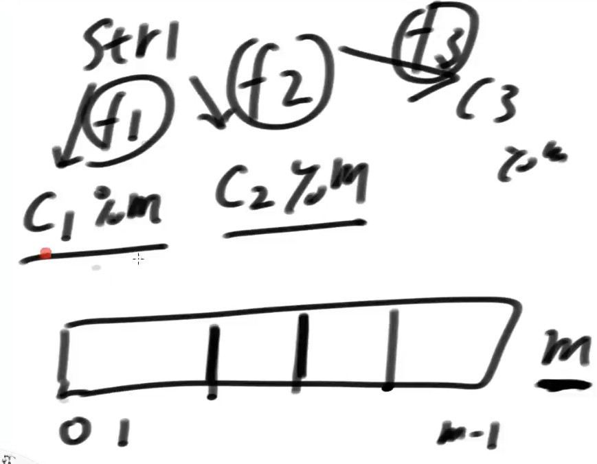

# 于哈希函数有关结构

输入域没有限制，输入可以是任意字符串

输出域相对有限，int类型范围（1-9 A-F，16进制）

相同输入，输出相同

离散性（均匀分布）：输出的值均匀分布在范围中，说明输入和输出要充分解耦

**哈希碰撞**

不同的入，导致相同的输出

哈希桶+单链表，单链表长度过长，桶进行扩容，参考hashMap

N个数扩容次数是logN，每次扩容的代价是N（所有数据重新算一遍哈希值，这里的n其实是k的含义），总代价是等比数列求sum，是2N，所以总代价是O（N），单次代价是O（1）

工程上把单链表变成红黑树其实都是在优化常数时间，单次单价都是O（1），变得更加O（1）

# 布隆过滤器

不会漏，只会误报

申请长度为n的比特类型的数组，占用字节数= n / 8

实现可以申请 int [10] 数组arr，每位大小是4B，arr[0] 位置有4 * 8 = 32 bit，所以实际就是320bit的数组

---

假如准备长度为m的比特类型的数组，实际占用的空间为 m / 8 Bite

假设 100亿个样本，每个样本是一个str

str字符串通过3个哈希函数得到的值再模m，描黑（标1）有可能重复

查询时，str按照同样的方式取出状态值，如果有一个不是0，则说明他没有被标记过

**问题**

m定多大，哈希函数定多少个？

如果m很小，可能查哪个查出来都被标记过（碰撞）

如果m过大，又存在浪费空间的问题

m越大失误率越小，m越小失误率越大

**影响m的因素**

n 样本量 100亿

p 失误率 0.01%

找到p满足工程的值时所对应的m

**公式**

背

**哈希函数个数k**

如果哈希函数个数很少，采样不足（碰撞的概率变大）导致失误率上升

如果哈希函数个数很多，m很快就会被耗尽，失误率会上升

找到最低点的k值

公式上边

---

实际算出的m假设是17G，这时候问面试官能不能提升到20G

用真实的m算出真实的k，再通过第三个公式算出真实的p，肯定小于规定的p

聊的时候先问，允许有失误率吗？

哈希函数的造法，有两个就行，进行组合

# 一致性哈希

前端、后端、数据库

假设数据库有三台相同的怎么确定打到哪一台上

key取模，如果每个key都不同，是可以均匀的分布到三台数据库上，这个key叫hashkey，需要良好的选择

但是业务上key高频也会导致负载不均

解决：高中低频的key从业务上去挖掘，分别均分

---

加一台机器，数据迁移的代价是全量的，所有值又都模一遍，一致性哈希解决的就是不是全量的代价

把哈希函数所有输出值想象成一个环

一致性哈希一定会打到环上，没有取模的事

左这条数据打到机器上，归属给顺时针遇到的第一个机器

如果此时要加一台机器m4

迁移的代价只是m3到m1这段范围上的

下线m4

把m4的数据顺时针都给m1

---

怎么保证部署机器时能保证三台机器把环均分？

假如均分了加了m4，又不均分了怎么办？

**虚拟节点技术**

每个虚拟节点均匀分布在环上

m4加入后，分别向m123要想等的数据段，数据迁移的代价是相同的

调整占有节点的比例，能够实现节点管理