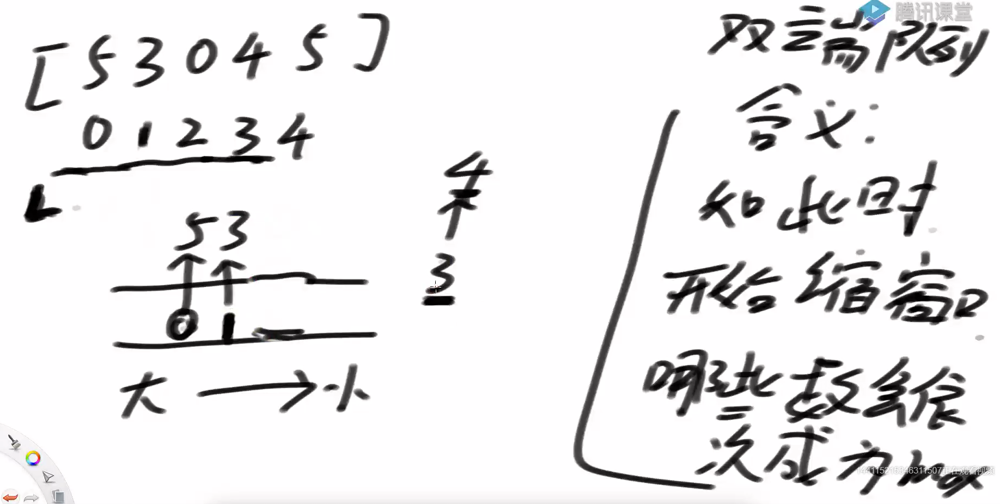
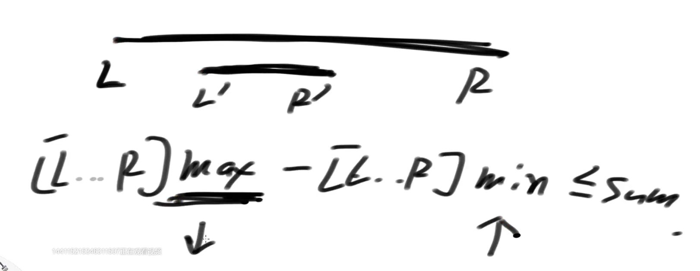
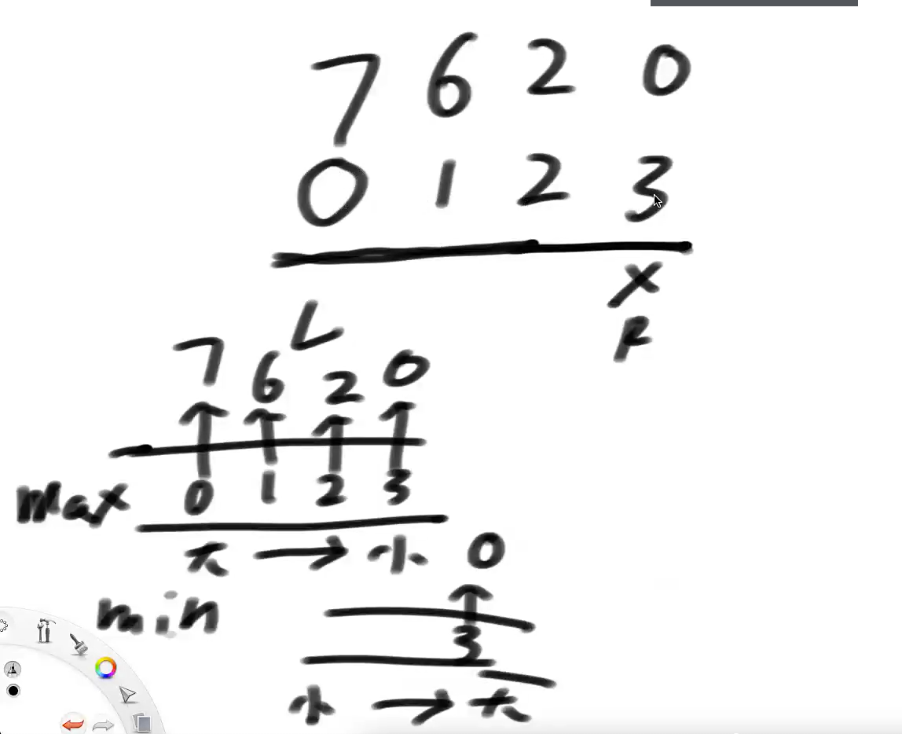
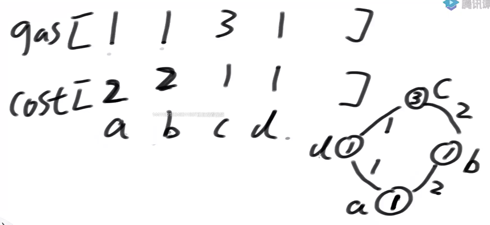
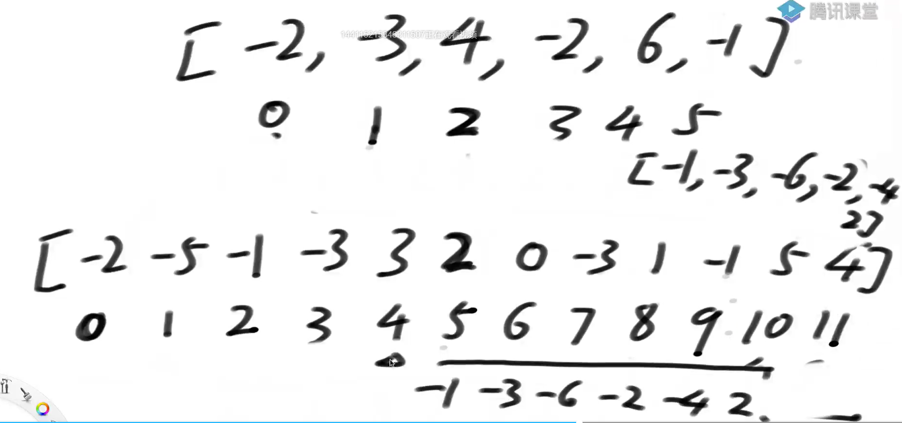
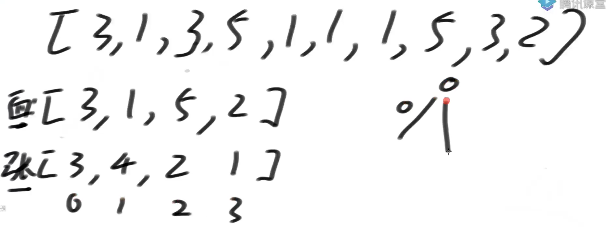

# 划动窗口

## 滑动窗口是什么？

滑动窗口是一种想象出来的数据结构：

滑动窗口有左边界L和有边界R

在数组或者字符串或者一个序列上，记为S，窗口就是S[L..R]这一部分 **里面放下标**

L往右滑意味着一个样本出了窗口，R往右滑意味着一个样本进了窗口

L和R都只能往右滑




R++时，双端队列中如果相等也要出队列

L++时，左面头部出队列

更新代价O（n），查询代价O（1）

## 题目一

假设一个固定大小为W的窗口，依次划过arr，

返回每一次滑出状况的最大值

例如，arr = [4,3,5,4,3,3,6,7], W = 3

返回：[5,5,5,4,6,7]

```java
// 暴力的对数器方法
public static int[] right(int[] arr, int w) {
   if (arr == null || w < 1 || arr.length < w) {
      return null;
   }
   int N = arr.length;
   int[] res = new int[N - w + 1]; // 解的个数N - w + 1
   int index = 0;
   int L = 0;
   int R = w - 1;
   while (R < N) {
      int max = arr[L];
      for (int i = L + 1; i <= R; i++) {
         max = Math.max(max, arr[i]);

      }
      res[index++] = max;
      L++;
      R++;
   }
   return res;
}

public static int[] getMaxWindow(int[] arr, int w) {
		if (arr == null || w < 1 || arr.length < w) {
			return null;
		}
		// qmax 窗口最大值的更新结构
		// 放下标
		LinkedList<Integer> qmax = new LinkedList<Integer>();
		int[] res = new int[arr.length - w + 1];
		int index = 0;
		for (int R = 0; R < arr.length; R++) {
            	    // 队列为空跳过 循环判断 双端队列尾部的下标的值是不是小于当前值，小于弹出
			while (!qmax.isEmpty() && arr[qmax.peekLast()] <= arr[R]) {
				qmax.pollLast();
			}
			qmax.addLast(R);
            	    // 过期位置的下标
			if (qmax.peekFirst() == R - w) {
				qmax.pollFirst();
			}
			if (R >= w - 1) {
				res[index++] = arr[qmax.peekFirst()];
			}
		}
		return res;
	}
```

## 题目二

给定一个整型数组arr，和一个整数num

某个arr中的子数组sub，如果想达标，必须满足：

sub中最大值 – sub中最小值 <= num，

返回arr中达标子数组的数量

```java
// 暴力的对数器方法
public static int right(int[] arr, int sum) {
   if (arr == null || arr.length == 0 || sum < 0) {
      return 0;
   }
   int N = arr.length;
   int count = 0;
   for (int L = 0; L < N; L++) {
      for (int R = L; R < N; R++) {
         int max = arr[L];
         int min = arr[L];
         for (int i = L + 1; i <= R; i++) {
            max = Math.max(max, arr[i]);
            min = Math.min(min, arr[i]);
         }
         if (max - min <= sum) {
            count++;
         }
      }
   }
   return count;
}

```



如果L-R达标，其子串都达标，因为max减少，min增加，差值减小

如果L-R不达标，其左右扩都不达标


需要两个对列维持最大值和最小值



```java
public static int num(int[] arr, int sum) {
   if (arr == null || arr.length == 0 || sum < 0) {
      return 0;
   }
   int N = arr.length;
   int count = 0;
   LinkedList<Integer> maxWindow = new LinkedList<>();
   LinkedList<Integer> minWindow = new LinkedList<>();
   int R = 0;
   // 尝试窗口的开头位置
   for (int L = 0; L < N; L++) {
      // 扩到R不达标
      while (R < N) {
         while (!maxWindow.isEmpty() && arr[maxWindow.peekLast()] <= arr[R]) {
            maxWindow.pollLast();
         }
         maxWindow.addLast(R);
         while (!minWindow.isEmpty() && arr[minWindow.peekLast()] >= arr[R]) {
            minWindow.pollLast();
         }
         minWindow.addLast(R);
         if (arr[maxWindow.peekFirst()] - arr[minWindow.peekFirst()] > sum) {
            break;
         } else {
            R++;
         }
      }
      count += R - L; // 如果break了说明当前不满足，子序列满足
       
      // 头部过期
      if (maxWindow.peekFirst() == L) {
         maxWindow.pollFirst();
      }
      if (minWindow.peekFirst() == L) {
         minWindow.pollFirst();
      }
   }
   return count;
}
```

## 题目三

加油站的良好出发点问题



gas数组代表加油站有多少油

cost代表到下一个加油站的花费

问从每一个加油站开始能不能跑完一圈，逆时针

辅助数组 gas-cost,暴力解循环遍历O（n2）



下面数组区间内都减去L左边的数得到的数组就是 累加和


了解

```java
public static boolean[] goodArray(int[] g, int[] c) {
   int N = g.length;
   int M = N << 1;
   int[] arr = new int[M];
   for (int i = 0; i < N; i++) {
      arr[i] = g[i] - c[i];
      arr[i + N] = g[i] - c[i];
   }
   for (int i = 1; i < M; i++) {
      arr[i] += arr[i - 1];
   }
   LinkedList<Integer> w = new LinkedList<>();
   for (int i = 0; i < N; i++) {
      while (!w.isEmpty() && arr[w.peekLast()] >= arr[i]) {
         w.pollLast();
      }
      w.addLast(i);
   }
   boolean[] ans = new boolean[N];
   for (int offset = 0, i = 0, j = N; j < M; offset = arr[i++], j++) {
      if (arr[w.peekFirst()] - offset >= 0) {
         ans[i] = true;
      }
      if (w.peekFirst() == i) {
         w.pollFirst();
      }
      while (!w.isEmpty() && arr[w.peekLast()] >= arr[j]) {
         w.pollLast();
      }
      w.addLast(j);
   }
   return ans;
}
```

## 题目四

arr是货币数组，其中的值都是正数。再给定一个正数aim。

每个值都认为是一张货币，有重复

返回组成aim的最少货币数

注意：

因为是求最少货币数，所以每一张货币认为是相同或者不同就不重要了



面值、张数

```java
public static class Info {
   public int[] coins;
   public int[] zhangs;

   public Info(int[] c, int[] z) {
      coins = c;
      zhangs = z;
   }
}

public static Info getInfo(int[] arr) {
   HashMap<Integer, Integer> counts = new HashMap<>();
   for (int value : arr) {
      if (!counts.containsKey(value)) {
         counts.put(value, 1);
      } else {
         counts.put(value, counts.get(value) + 1);
      }
   }
   int N = counts.size();
   int[] coins = new int[N];
   int[] zhangs = new int[N];
   int index = 0;
   for (Entry<Integer, Integer> entry : counts.entrySet()) {
      coins[index] = entry.getKey();
      zhangs[index++] = entry.getValue();
   }
   return new Info(coins, zhangs);
}

// dp2时间复杂度为：O(arr长度) + O(货币种数 * aim * 每种货币的平均张数)
public static int dp2(int[] arr, int aim) {
   if (aim == 0) {
      return 0;
   }
   // 得到info时间复杂度O(arr长度)
   Info info = getInfo(arr); // 面值去重
   int[] coins = info.coins;
   int[] zhangs = info.zhangs;
   int N = coins.length;
   int[][] dp = new int[N + 1][aim + 1];
   dp[N][0] = 0;
   for (int j = 1; j <= aim; j++) {
      dp[N][j] = Integer.MAX_VALUE;
   }
   // 这三层for循环，时间复杂度为O(货币种数 * aim * 每种货币的平均张数)
   for (int index = N - 1; index >= 0; index--) {
      for (int rest = 0; rest <= aim; rest++) {
         dp[index][rest] = dp[index + 1][rest];
         for (int zhang = 1; zhang * coins[index] <= aim && zhang <= zhangs[index]; zhang++) {
            if (rest - zhang * coins[index] >= 0
                  && dp[index + 1][rest - zhang * coins[index]] != Integer.MAX_VALUE) {
               dp[index][rest] = Math.min(dp[index][rest], zhang + dp[index + 1][rest - zhang * coins[index]]);
            }
         }
      }
   }
   return dp[0][aim];
}


// 优化划动窗口

// dp3时间复杂度为：O(arr长度) + O(货币种数 * aim)
// 优化需要用到窗口内最小值的更新结构
public static int dp3(int[] arr, int aim) {
    if (aim == 0) {
        return 0;
    }
    // 得到info时间复杂度O(arr长度)
    Info info = getInfo(arr);
    int[] c = info.coins;
    int[] z = info.zhangs;
    int N = c.length;
    int[][] dp = new int[N + 1][aim + 1];
    dp[N][0] = 0;
    for (int j = 1; j <= aim; j++) {
        dp[N][j] = Integer.MAX_VALUE;
    }
    // 虽然是嵌套了很多循环，但是时间复杂度为O(货币种数 * aim)
    // 因为用了窗口内最小值的更新结构
    for (int i = N - 1; i >= 0; i--) {
        for (int mod = 0; mod < Math.min(aim + 1, c[i]); mod++) {
            // 当前面值 X
            // mod  mod + x   mod + 2*x   mod + 3 * x
            LinkedList<Integer> w = new LinkedList<>();
            w.add(mod);
            dp[i][mod] = dp[i + 1][mod];
            for (int r = mod + c[i]; r <= aim; r += c[i]) {
                while (!w.isEmpty() && (dp[i + 1][w.peekLast()] == Integer.MAX_VALUE
                                        || dp[i + 1][w.peekLast()] + compensate(w.peekLast(), r, c[i]) >= dp[i + 1][r])) {
                    w.pollLast();
                }
                w.addLast(r);
                int overdue = r - c[i] * (z[i] + 1);
                if (w.peekFirst() == overdue) {
                    w.pollFirst();
                }
                dp[i][r] = dp[i + 1][w.peekFirst()] + compensate(w.peekFirst(), r, c[i]);
            }
        }
    }
    return dp[0][aim];
}
```