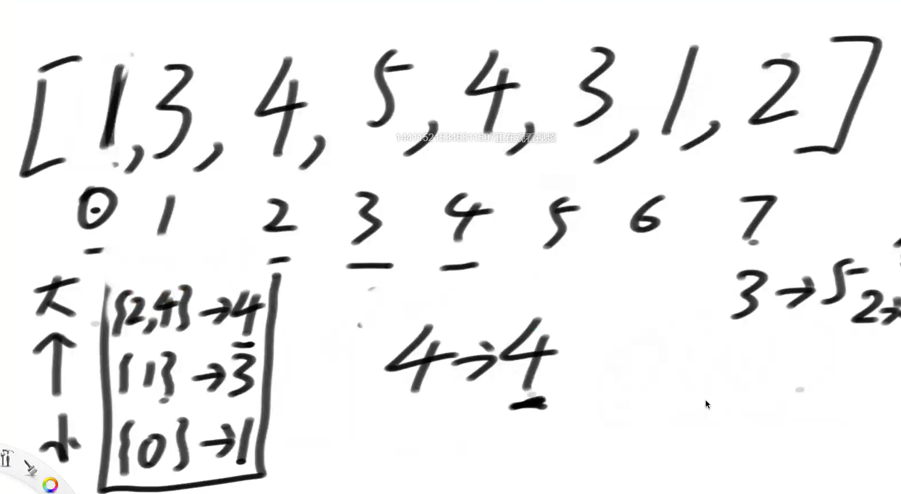

# 单调栈

**没有重复值**


生成每个位置左边第一个比它小的数，和右边第一个比它小的数，暴力方法是O（n2），怎样O（n）


准备一个栈从小到大，当遇到比栈顶元素小的时候，弹出栈顶元素，就能得到栈顶元素的左，底下的元素，右让它弹出的元素


当遍历完数组，栈中还有元素，从栈顶弹出，左底下的元素，右没有，6弹出左右都没有

**有重复值**


栈里放链表，当遇到比自己小的，5弹出，左低下的4，右让自己弹出的4



到4时出现重复，位置合并


一个链表里弹栈时一起弹出，出来的左右是一样的


弹出时左边的一定是底下链表的**最后一个**值

**无重复版本**

```java
// arr = [ 3, 1, 2, 3]
//         0  1  2  3
//  [
//     0 : [-1,  1]
//     1 : [-1, -1]
//     2 : [ 1, -1]
//     3 : [ 2, -1]
//  ]
// 无重复值版本
public static int[][] getNearLessNoRepeat(int[] arr) {
   int[][] res = new int[arr.length][2]; // 存位置不是值
   // 只存位置！
   Stack<Integer> stack = new Stack<>();// 栈里存的是位置
   for (int i = 0; i < arr.length; i++) { // 当遍历到i位置的数，arr[i]
      while (!stack.isEmpty() && arr[stack.peek()] > arr[i]) {// 栈不空、栈顶元素大于当前元素
         int j = stack.pop();
         int leftLessIndex = stack.isEmpty() ? -1 : stack.peek();
         res[j][0] = leftLessIndex;
         res[j][1] = i;
      }
      stack.push(i);// 直到可以进去
   }
   // 遍历完了栈里可能还有
   while (!stack.isEmpty()) {
      int j = stack.pop();
      int leftLessIndex = stack.isEmpty() ? -1 : stack.peek();
      res[j][0] = leftLessIndex;
      res[j][1] = -1;// 右边一律没有
   }
   return res;
}
```

**支持重复版本**

```java
public static int[][] getNearLess(int[] arr) {
   int[][] res = new int[arr.length][2];
   Stack<List<Integer>> stack = new Stack<>();// 栈里是小链表
   for (int i = 0; i < arr.length; i++) { // i -> arr[i] 进栈
      while (!stack.isEmpty() && arr[stack.peek().get(0)] > arr[i]) {// 栈顶拿出任意一个位置判断
         List<Integer> popIs = stack.pop(); // 弹出整条链表
         int leftLessIndex = stack.isEmpty() ? -1 : stack.peek().get(stack.peek().size() - 1);// 低下的最后一个值
         for (Integer popi : popIs) {
            res[popi][0] = leftLessIndex;
            res[popi][1] = i;
         }
      }
      // 大压小
       
      // 相等时
      if (!stack.isEmpty() && arr[stack.peek().get(0)] == arr[i]) {
         stack.peek().add(Integer.valueOf(i));// 相等加到链表最后
      } else {// 大于
         ArrayList<Integer> list = new ArrayList<>();
         list.add(i);
         stack.push(list);
      }
   }
   while (!stack.isEmpty()) {
      List<Integer> popIs = stack.pop();
      int leftLessIndex = stack.isEmpty() ? -1 : stack.peek().get(stack.peek().size() - 1);
      for (Integer popi : popIs) {
         res[popi][0] = leftLessIndex;
         res[popi][1] = -1;
      }
   }
   return res;
}
```

## 题目二

给定一个只包含正数的数组arr，arr中任何一个子数组（连续）sub，

一定都可以算出**(sub累加和 )* (sub中的最小值)** = A是什么，

那么所有子数组中，这个值（A）最大是多少？


思路：求出每个位置作为最小值的指标


保证X是最小值，想办法sum最大，j、k左右第一个小于x的值中间的sum全要

sum的计算，预处理一个前缀和数组O（1）


范围 = 前缀和相减

```java
// 暴力方法O（n3）
public static int max1(int[] arr) {
   int max = Integer.MIN_VALUE;
   for (int i = 0; i < arr.length; i++) {
      for (int j = i; j < arr.length; j++) {
         int minNum = Integer.MAX_VALUE;
         int sum = 0;
         for (int k = i; k <= j; k++) {
            sum += arr[k];
            minNum = Math.min(minNum, arr[k]);
         }
         max = Math.max(max, minNum * sum);
      }
   }
   return max;
}
```


相等时候就弹出，2位置能算出正确答案


1位置算错了不用管，3位置的4进来了


3位置的4就是1位置4的正确答案


一坨2共享一个答案就是5位置2的答案

```java
public static int max2(int[] arr) {
   int size = arr.length;
   int[] sums = new int[size];
   sums[0] = arr[0];
   for (int i = 1; i < size; i++) {
      sums[i] = sums[i - 1] + arr[i];
   }
   int max = Integer.MIN_VALUE;
   Stack<Integer> stack = new Stack<Integer>();// 单独位置没有用小链表
   for (int i = 0; i < size; i++) {
      while (!stack.isEmpty() && arr[stack.peek()] >= arr[i]) {// 大于等于就弹出
         int j = stack.pop();
         max = Math.max(max, (stack.isEmpty() ? sums[i - 1] : (sums[i - 1] - sums[stack.peek()])) * arr[j]);
      }
      stack.push(i);
   }
   while (!stack.isEmpty()) {
      int j = stack.pop();
      max = Math.max(max, (stack.isEmpty() ? sums[size - 1] : (sums[size - 1] - sums[stack.peek()])) * arr[j]);
   }
   return max;
}
```

## 题目三

```
https://leetcode.com/problems/largest-rectangle-in-histogram
```

给定一个非负数组arr，代表直方图

返回直方图的最大长方形面积


画圈的是最大面积

思路：以每一个长方形做高最大可以扩多远

```java
public static int largestRectangleArea1(int[] height) {
   if (height == null || height.length == 0) {
      return 0;
   }
   int maxArea = 0;
   Stack<Integer> stack = new Stack<Integer>();
   for (int i = 0; i < height.length; i++) {
      while (!stack.isEmpty() && height[i] <= height[stack.peek()]) {
         int j = stack.pop();
         int k = stack.isEmpty() ? -1 : stack.peek();
         int curArea = (i - k - 1) * height[j];
         maxArea = Math.max(maxArea, curArea);
      }
      stack.push(i);
   }
   while (!stack.isEmpty()) {
      int j = stack.pop();
      int k = stack.isEmpty() ? -1 : stack.peek();
      int curArea = (height.length - k - 1) * height[j];
      maxArea = Math.max(maxArea, curArea);
   }
   return maxArea;
}

public static int largestRectangleArea2(int[] height) {
   if (height == null || height.length == 0) {
      return 0;
   }
   int N = height.length;
   int[] stack = new int[N];
   int si = -1;
   int maxArea = 0;
   for (int i = 0; i < height.length; i++) {
      while (si != -1 && height[i] <= height[stack[si]]) {
         int j = stack[si--];
         int k = si == -1 ? -1 : stack[si];
         int curArea = (i - k - 1) * height[j];
         maxArea = Math.max(maxArea, curArea);
      }
      stack[++si] = i;
   }
   while (si != -1) {
      int j = stack[si--];
      int k = si == -1 ? -1 : stack[si];
      int curArea = (height.length - k - 1) * height[j];
      maxArea = Math.max(maxArea, curArea);
   }
   return maxArea;
}
```

## 题目四

```
https://leetcode.com/problems/maximal-rectangle/
```

给定一个二维数组matrix，其中的值不是0就是1，

返回全部由1组成的最大子矩形，内部有多少个1


返回含有1数量最多的矩形


子矩阵的数量O（n4）

暴力解遍历出子矩阵O（n4），然后在子矩阵中遍历为1的O（n2）= O（n6）


以每一行作地基，从地基往上看能有多少面积，有了0高度为零


```java
public static int maximalRectangle(char[][] map) {
   if (map == null || map.length == 0 || map[0].length == 0) {
      return 0;
   }
   int maxArea = 0;
   int[] height = new int[map[0].length];
   for (int i = 0; i < map.length; i++) {
      for (int j = 0; j < map[0].length; j++) {
         height[j] = map[i][j] == '0' ? 0 : height[j] + 1;
      }
      maxArea = Math.max(maxRecFromBottom(height), maxArea);
   }
   return maxArea;
}

// height是正方图数组
public static int maxRecFromBottom(int[] height) {
   if (height == null || height.length == 0) {
      return 0;
   }
   int maxArea = 0;
   Stack<Integer> stack = new Stack<Integer>();
   for (int i = 0; i < height.length; i++) {
      while (!stack.isEmpty() && height[i] <= height[stack.peek()]) {
         int j = stack.pop();
         int k = stack.isEmpty() ? -1 : stack.peek();
         int curArea = (i - k - 1) * height[j];
         maxArea = Math.max(maxArea, curArea);
      }
      stack.push(i);
   }
   while (!stack.isEmpty()) {
      int j = stack.pop();
      int k = stack.isEmpty() ? -1 : stack.peek();
      int curArea = (height.length - k - 1) * height[j];
      maxArea = Math.max(maxArea, curArea);
   }
   return maxArea;
}
```

## 题目五

给定一个二维数组matrix，其中的值不是0就是1，

返回全部由1组成的子矩形**数量** L* （L+1）


最大子矩阵中有多少个子矩阵


L累加且L>左右两边到不了的最大值（防重复）


抽象化


相等的时候不算

```
// 测试链接：https://leetcode.com/problems/count-submatrices-with-all-ones
```

```java
public static int numSubmat(int[][] mat) {
   if (mat == null || mat.length == 0 || mat[0].length == 0) {
      return 0;
   }
   int nums = 0;
   int[] height = new int[mat[0].length];
   for (int i = 0; i < mat.length; i++) {
      for (int j = 0; j < mat[0].length; j++) {
         height[j] = mat[i][j] == 0 ? 0 : height[j] + 1;
      }
      nums += countFromBottom(height);
   }
   return nums;

}

public static int countFromBottom(int[] height) {
   if (height == null || height.length == 0) {
      return 0;
   }
   int nums = 0;
   int[] stack = new int[height.length];
   int si = -1;
   for (int i = 0; i < height.length; i++) {
      while (si != -1 && height[stack[si]] >= height[i]) {
         int cur = stack[si--];
         if (height[cur] > height[i]) {
            int left = si == -1 ? -1 : stack[si];
            int n = i - left - 1;
            int down = Math.max(left == -1 ? 0 : height[left], height[i]);
            nums += (height[cur] - down) * num(n);
         }

      }
      stack[++si] = i;
   }
   while (si != -1) {
      int cur = stack[si--];
      int left = si == -1  ? -1 : stack[si];
      int n = height.length - left - 1;
      int down = left == -1 ? 0 : height[left];
      nums += (height[cur] - down) * num(n);
   }
   return nums;
}

public static int num(int n) {
   return ((n * (1 + n)) >> 1);
}
```

## 题目六

给定一个数组arr，返回所有子数组最小值的累加和


**无重复值**


6-10、7-10、8-10、9-10、10-10 5个

10-11、10-12、10-13、10-14、10-15 5个

所以有5 * 5 个子数组以7为最小值

累加和 25 * 7


抽象公式


**有重复值**


到相同结尾位置停住，开头位置是所有，结尾位置到下一个相等的位置

```java
// 暴力解
public static int subArrayMinSum1(int[] arr) {
   int ans = 0;
   for (int i = 0; i < arr.length; i++) {
      for (int j = i; j < arr.length; j++) {
         int min = arr[i];
         for (int k = i + 1; k <= j; k++) {
            min = Math.min(min, arr[k]);
         }
         ans += min;
      }
   }
   return ans;
}
```

```java
// 没有用单调栈
public static int subArrayMinSum2(int[] arr) {
   // left[i] = x : arr[i]左边，离arr[i]最近，<=arr[i]，位置在x
   int[] left = leftNearLessEqual2(arr);
   // right[i] = y : arr[i]右边，离arr[i]最近，< arr[i],的数，位置在y
   int[] right = rightNearLess2(arr);
   int ans = 0;
   for (int i = 0; i < arr.length; i++) {
      int start = i - left[i];
      int end = right[i] - i;
      ans += start * end * arr[i];
   }
   return ans;
}
public static int[] leftNearLessEqual2(int[] arr) {
    int N = arr.length;
    int[] left = new int[N];
    for (int i = 0; i < N; i++) {
        int ans = -1;
        for (int j = i - 1; j >= 0; j--) {
            if (arr[j] <= arr[i]) {
                ans = j;
                break;
            }
        }
        left[i] = ans;
    }
    return left;
}

public static int[] rightNearLess2(int[] arr) {
    int N = arr.length;
    int[] right = new int[N];
    for (int i = 0; i < N; i++) {
        int ans = N;
        for (int j = i + 1; j < N; j++) {
            if (arr[i] > arr[j]) {
                ans = j;
                break;
            }
        }
        right[i] = ans;
    }
    return right;
}
```

```java
// 是最优解思路下的单调栈优化
public static int sumSubarrayMins(int[] arr) {
   int[] stack = new int[arr.length];
   int[] left = nearLessEqualLeft(arr, stack);
   int[] right = nearLessRight(arr, stack);
   long ans = 0;
   for (int i = 0; i < arr.length; i++) {
      long start = i - left[i];
      long end = right[i] - i;
      ans += start * end * (long) arr[i];
      ans %= 1000000007;
   }
   return (int) ans;
}

public static int[] nearLessEqualLeft(int[] arr, int[] stack) {
   int N = arr.length;
   int[] left = new int[N];
   int size = 0;
   for (int i = N - 1; i >= 0; i--) {
      while (size != 0 && arr[i] <= arr[stack[size - 1]]) {
         left[stack[--size]] = i;
      }
      stack[size++] = i;
   }
   while (size != 0) {
      left[stack[--size]] = -1;
   }
   return left;
}

public static int[] nearLessRight(int[] arr, int[] stack) {
   int N = arr.length;
   int[] right = new int[N];
   int size = 0;
   for (int i = 0; i < N; i++) {
      while (size != 0 && arr[stack[size - 1]] > arr[i]) {
         right[stack[--size]] = i;
      }
      stack[size++] = i;
   }
   while (size != 0) {
      right[stack[--size]] = N;
   }
   return right;
}
```