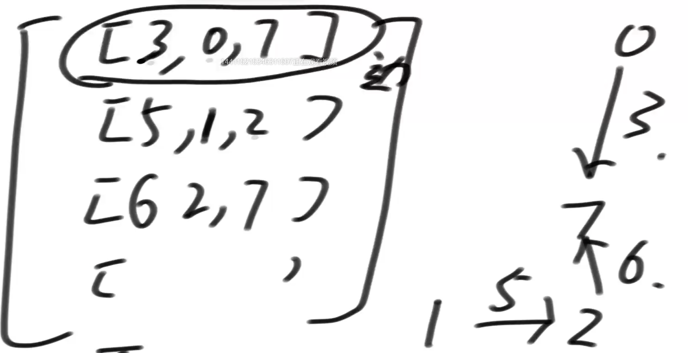
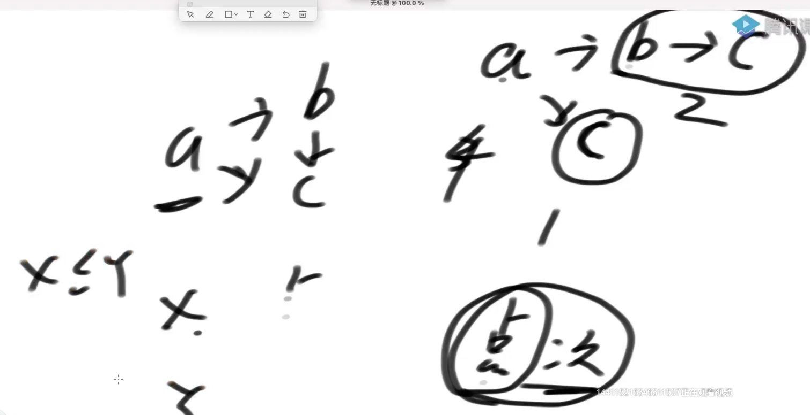
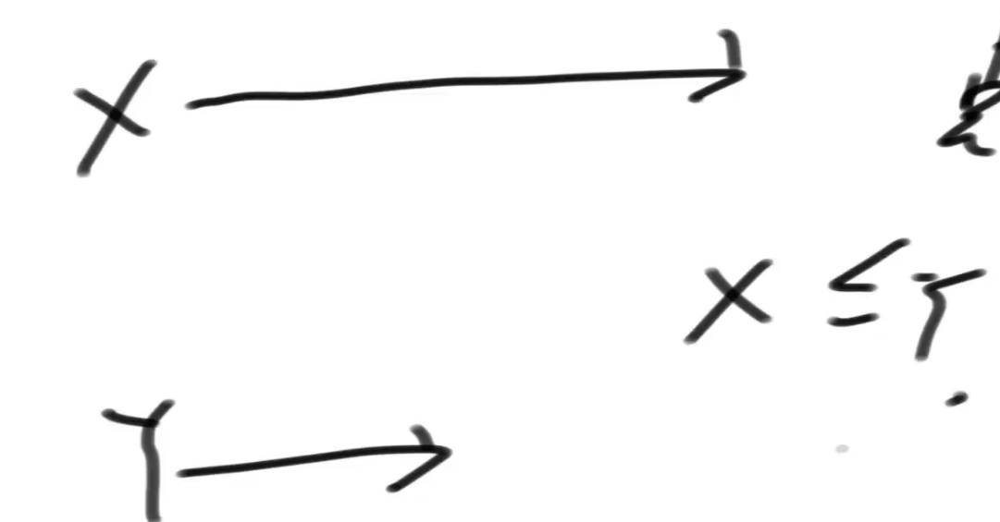

# 图

面试常用表示

1.



第一位代表边的长度，然后是一个节点到另一个节点

2.


数组位置代表节点，数组值代表当前节点指向的下一个节点

---

相同的算法不同图结构需要写不同的代码

## **图适配器**

```java
// 点结构的描述  A  0
public class Node {
   public int value; // 点的值
   public int in; // 入度，有多少个点直接指向它
   public int out; // 出度，它直接指向别人的有多少
   public ArrayList<Node> nexts; // 从该点出发的邻接点
   public ArrayList<Edge> edges; // 从它出发的邻接边

   public Node(int value) {
      this.value = value;
      in = 0;
      out = 0;
      nexts = new ArrayList<>();
      edges = new ArrayList<>();
   }
}
```

```java
public class Edge {
   public int weight; // 边权重
   public Node from; 
   public Node to;

   public Edge(int weight, Node from, Node to) {
      this.weight = weight;
      this.from = from;
      this.to = to;
   }

}
```

```java
public class Graph {
   public HashMap<Integer, Node> nodes; // key整数，value是node
   public HashSet<Edge> edges;
   
   public Graph() {
      nodes = new HashMap<>();
      edges = new HashSet<>();
   }
}
```

```java
public class GraphGenerator {

   // matrix 所有的边
   // N*3 的矩阵
   // [weight, from节点上面的值，to节点上面的值]
   public static Graph createGraph(Integer[][] matrix) {
      Graph graph = new Graph();
      for (int i = 0; i < matrix.length; i++) { 
         // matrix[0][0], matrix[0][1]  matrix[0][2]
         Integer weight = matrix[i][0];
         Integer from = matrix[i][1];
         Integer to = matrix[i][2];
         if (!graph.nodes.containsKey(from)) {
            graph.nodes.put(from, new Node(from));
         }
         if (!graph.nodes.containsKey(to)) {
            graph.nodes.put(to, new Node(to));
         }
         Node fromNode = graph.nodes.get(from);
         Node toNode = graph.nodes.get(to);
         Edge newEdge = new Edge(weight, fromNode, toNode);
         fromNode.nexts.add(toNode);
         fromNode.out++;
         toNode.in++;
         fromNode.edges.add(newEdge);
         graph.edges.add(newEdge);
      }
      return graph;
   }

}
```

## BFS广度优先遍历

```java
public class Code02_BFS {

   // 从node出发，进行宽度优先遍历
   public static void bfs(Node node) {
      if (node == null) {
         return;
      }
      Queue<Node> queue = new LinkedList<>();
      HashSet<Node> set = new HashSet<>();
      queue.add(node);
      set.add(node);
      while (!queue.isEmpty()) {
         Node cur = queue.poll();
         System.out.println(cur.value);
         for (Node next : cur.nexts) {
            if (!set.contains(next)) {
               set.add(next);
               queue.add(next);
            }
         }
      }
   }
```

## DFS深度优先遍历

```java
public class Code02_DFS {

   public static void dfs(Node node) {
      if (node == null) {
         return;
      }
      Stack<Node> stack = new Stack<>(); // 永远存放当前的整条路径
      HashSet<Node> set = new HashSet<>();
      stack.add(node);
      set.add(node);
      System.out.println(node.value);
      while (!stack.isEmpty()) {
         Node cur = stack.pop();
         for (Node next : cur.nexts) {
            if (!set.contains(next)) {
               stack.push(cur);
               stack.push(next);
               set.add(next);
               System.out.println(next.value);
               break;
            }
         }
      }
   }

}
```

## 图的拓扑排序

一定是无环有向图，拓扑序不唯一

```java
// directed graph and no loop
public static List<Node> sortedTopology(Graph graph) {
   // key：某一个node
   // value：剩余的入度
   HashMap<Node, Integer> inMap = new HashMap<>();
   // 剩余入度为0的点，才能进这个队列
   Queue<Node> zeroInQueue = new LinkedList<>();
   
   
   for (Node node : graph.nodes.values()) {
      inMap.put(node, node.in);
      if (node.in == 0) {
         zeroInQueue.add(node);
      }
   }
   // 拓扑排序的结果，依次加入result
   List<Node> result = new ArrayList<>();
   while (!zeroInQueue.isEmpty()) {
      Node cur = zeroInQueue.poll();
      result.add(cur);
      for (Node next : cur.nexts) {
         inMap.put(next, inMap.get(next) - 1);
         if (inMap.get(next) == 0) {
            zeroInQueue.add(next);
         }
      }
   }
   return result;
}
```

---

x的点次大于等于y，x的拓扑序小于等于y



a的点次是3，b的点次是2，所以a的拓扑序小于b

---



x最大深度大于y，x的拓扑序小于y

## 最小生成树

### Kruskal

边少的时候合适

边从小到大，依次遍历如果当前边加上了出现了环，不要当前边

```java
public static Set<Edge> kruskalMST(Graph graph) {
   UnionFind unionFind = new UnionFind();
   unionFind.makeSets(graph.nodes.values());
   PriorityQueue<Edge> priorityQueue = new PriorityQueue<>(new EdgeComparator());
   for (Edge edge : graph.edges) { // M 条边
      priorityQueue.add(edge);  // O(logM)
   }
   Set<Edge> result = new HashSet<>();
   while (!priorityQueue.isEmpty()) { // M 条边
      Edge edge = priorityQueue.poll(); // O(logM)
      if (!unionFind.isSameSet(edge.from, edge.to)) { // O(1)
         result.add(edge);
         unionFind.union(edge.from, edge.to);
      }
   }
   return result;
}
```

### Prim

点少的时候适合

随便找一个点出发，找边最短的点，

```java
public static Set<Edge> primMST(Graph graph) {
   // 解锁的边进入小根堆
   PriorityQueue<Edge> priorityQueue = new PriorityQueue<>(new EdgeComparator());

   // 哪些点被解锁出来了
   HashSet<Node> nodeSet = new HashSet<>();
   Set<Edge> result = new HashSet<>(); // 依次挑选的的边在result里
   for (Node node : graph.nodes.values()) { // 随便挑了一个点
      // node 是开始点
      if (!nodeSet.contains(node)) {
         nodeSet.add(node);
         for (Edge edge : node.edges) { // 由一个点，解锁所有相连的边
            priorityQueue.add(edge);
         }
         while (!priorityQueue.isEmpty()) {
            Edge edge = priorityQueue.poll(); // 弹出解锁的边中，最小的边
            Node toNode = edge.to; // 可能的一个新的点
            if (!nodeSet.contains(toNode)) { // 不含有的时候，就是新的点
               nodeSet.add(toNode);
               result.add(edge);
               for (Edge nextEdge : toNode.edges) {
                  priorityQueue.add(nextEdge);
               }
            }
         }
      }
      // break;
   }
   return result;
}
```

## 迪杰斯特拉

最短距离

有向、无负权重、可以有环

任选一点到任意一点的最小距离

```java
public static HashMap<Node, Integer> dijkstra1(Node from) {
   // 从head出发到所有点的最小距离
   // key : 从head出发到达key
   // value : 从head出发到达key的最小距离
   // 如果在表中，没有T的记录，含义是从head出发到T这个点的距离为正无穷
   HashMap<Node, Integer> distanceMap = new HashMap<>();
   distanceMap.put(from, 0);
   // 已经求过距离的节点，存在selectedNodes中，以后再也不碰
   HashSet<Node> selectedNodes = new HashSet<>();
   // from 0
   Node minNode = getMinDistanceAndUnselectedNode(distanceMap, selectedNodes);
   while (minNode != null) {
      int distance = distanceMap.get(minNode);
      for (Edge edge : minNode.edges) {
         Node toNode = edge.to;
         if (!distanceMap.containsKey(toNode)) {
            distanceMap.put(toNode, distance + edge.weight);
         } else {
            distanceMap.put(edge.to, 
                  Math.min(distanceMap.get(toNode), distance + edge.weight));
         }
      }
      selectedNodes.add(minNode);
      minNode = getMinDistanceAndUnselectedNode(distanceMap, selectedNodes);
   }
   return distanceMap;
}
```

```java
// 没打过记号的点的最小距离
public static Node getMinDistanceAndUnselectedNode(
      HashMap<Node, Integer> distanceMap, 
      HashSet<Node> touchedNodes) {
   Node minNode = null;
   int minDistance = Integer.MAX_VALUE;
   for (Entry<Node, Integer> entry : distanceMap.entrySet()) {
      Node node = entry.getKey();
      int distance = entry.getValue();
      if (!touchedNodes.contains(node) && distance < minDistance) {
         minNode = node;
         minDistance = distance;
      }
   }
   return minNode;
}
```

**优化**

使用加强堆

一开始的点进入小根堆，然后弹出，相邻的点进入堆，如果发现有更短的距离，在堆中找到它将距离进行更新，同时调整顺序（只有加强堆可以实现），

```java

public static class NodeRecord {
		public Node node;
		public int distance;

		public NodeRecord(Node node, int distance) {
			this.node = node;
			this.distance = distance;
		}
	}
public static class NodeHeap {
		private Node[] nodes; // 实际的堆结构
    
		// key 某一个node， value 上面堆中的位置，反向索引表，如果该点弹出改成<node,-1>
		private HashMap<Node, Integer> heapIndexMap;
		// key 某一个节点， value 从源节点出发到该节点的目前最小距离
		private HashMap<Node, Integer> distanceMap;
		private int size; // 堆上有多少个点

		public NodeHeap(int size) {
			nodes = new Node[size];
			heapIndexMap = new HashMap<>();
			distanceMap = new HashMap<>();
			size = 0;
		}

		public boolean isEmpty() {
			return size == 0;
		}
    	    // 主方法
                // 改进后的dijkstra算法
                // 从head出发，所有head能到达的节点，生成到达每个节点的最小路径记录并返回
                public static HashMap<Node, Integer> dijkstra2(Node head, int size) {
                   NodeHeap nodeHeap = new NodeHeap(size);
                   // 没出现过的节点是add，小于出现过节点update，大于出现过的节点ingore
                   nodeHeap.addOrUpdateOrIgnore(head, 0);
                   HashMap<Node, Integer> result = new HashMap<>();
                   while (!nodeHeap.isEmpty()) {
                      // 弹出堆顶
                      NodeRecord record = nodeHeap.pop();
                      Node cur = record.node; // 点
                      int distance = record.distance;// 距离
                      for (Edge edge : cur.edges) {
                         // 新出现的边
                         nodeHeap.addOrUpdateOrIgnore(edge.to, edge.weight + distance);
                      }
                      result.put(cur, distance);
                   }
                   return result;
                }
    
    	// 有一个点叫node，现在发现了一个从源节点出发到达node的距离为distance
		// 判断要不要更新，如果需要的话，就更新
		public void addOrUpdateOrIgnore(Node node, int distance) {
            	    // 在堆上update
			if (inHeap(node)) {
				distanceMap.put(node, Math.min(distanceMap.get(node), distance));
				insertHeapify(node, heapIndexMap.get(node));
			}
            	    // 从来没进来过add
			if (!isEntered(node)) {
				nodes[size] = node;
				heapIndexMap.put(node, size);
				distanceMap.put(node, distance);
				insertHeapify(node, size++);
			}
            	    // ingore
		}

		public NodeRecord pop() {
            	    // 0堆顶
			NodeRecord nodeRecord = new NodeRecord(nodes[0], distanceMap.get(nodes[0]));
            	    // 最后一个节点交换
			swap(0, size - 1);
            	    
			heapIndexMap.put(nodes[size - 1], -1);
			distanceMap.remove(nodes[size - 1]);
			// free C++同学还要把原本堆顶节点析构，对java同学不必
			nodes[size - 1] = null;
            	    // 想下调整
			heapify(0, --size);
			return nodeRecord;
		}

		private void insertHeapify(Node node, int index) {
			while (distanceMap.get(nodes[index]) 
					< distanceMap.get(nodes[(index - 1) / 2])) {
				swap(index, (index - 1) / 2);
				index = (index - 1) / 2;
			}
		}

		private void heapify(int index, int size) {
			int left = index * 2 + 1;
			while (left < size) {
				int smallest = left + 1 < size && distanceMap.get(nodes[left + 1]) < distanceMap.get(nodes[left])
						? left + 1
						: left;
				smallest = distanceMap.get(nodes[smallest]) 
						< distanceMap.get(nodes[index]) ? smallest : index;
				if (smallest == index) {
					break;
				}
				swap(smallest, index);
				index = smallest;
				left = index * 2 + 1;
			}
		}
    
		// 有记录就一定进来过，弹出的是-1
		private boolean isEntered(Node node) {
			return heapIndexMap.containsKey(node);
		}
		// 在不在堆上，有记录且不是-1
		private boolean inHeap(Node node) {
			return isEntered(node) && heapIndexMap.get(node) != -1;
		}

		private void swap(int index1, int index2) {
			heapIndexMap.put(nodes[index1], index2);
			heapIndexMap.put(nodes[index2], index1);
			Node tmp = nodes[index1];
			nodes[index1] = nodes[index2];
			nodes[index2] = tmp;
		}
	}
}
```