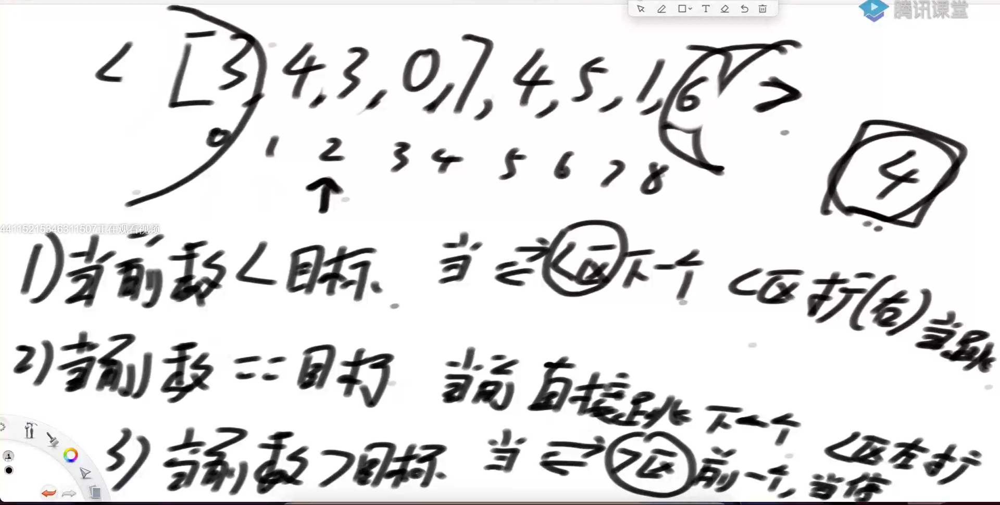

# 归并排序

## 递归思路

1. f(arr,L,R)函数，arr需要排序的数组，L起始位置，R结束位置，求出中点M
2. f(arr,L,M) L到M有序    T（N/2）
3. f(arr,M+1,R) M+1到R有序   T（N/2）
4. Merge 合并左部分和右部分  T（N）

## 时间复杂度

T（N） = 2 * T（N/2）+T（N）套用master公式

a=2 , b =2 ,d =1

d= log b a   

所以时间复杂度=O(N*logn)

```java
// 递归方法实现
public static void mergeSort1(int[] arr) {
   if (arr == null || arr.length < 2) {
      return;
   }
   process(arr, 0, arr.length - 1);
}

// 请把arr[L..R]排有序
// l...r N
// T(N) = 2 * T(N / 2) + O(N)
// O(N * logN)
public static void process(int[] arr, int L, int R) {
   if (L == R) { // base case
      return;
   }
   int mid = L + ((R - L) >> 1); //防溢出
   process(arr, L, mid);
   process(arr, mid + 1, R);
   merge(arr, L, mid, R);
}

public static void merge(int[] arr, int L, int M, int R) {
   int[] help = new int[R - L + 1];
   int i = 0;
   int p1 = L;
   int p2 = M + 1;
   while (p1 <= M && p2 <= R) {
      help[i++] = arr[p1] <= arr[p2] ? arr[p1++] : arr[p2++];
   }
   // 要么p1越界了，要么p2越界了
   while (p1 <= M) {
      help[i++] = arr[p1++];
   }
   while (p2 <= R) {
      help[i++] = arr[p2++];
   }
   for (i = 0; i < help.length; i++) {
      arr[L + i] = help[i];
   }
}

// 非递归方法实现
public static void mergeSort2(int[] arr) {
   if (arr == null || arr.length < 2) {
      return;
   }
   int N = arr.length;
   // 步长
   int mergeSize = 1;
   while (mergeSize < N) { // log N
      // 当前左组的，第一个位置
      int L = 0;
      while (L < N) {
         if (mergeSize >= N - L) {
            break;
         }
         int M = L + mergeSize - 1;
         int R = M + Math.min(mergeSize, N - M - 1);
         merge(arr, L, M, R);
         L = R + 1;
      }
      // 防止溢出
      if (mergeSize > N / 2) {
         break;
      }
      mergeSize <<= 1;
   }
}
```

## 最小和问题

```java
public static int smallSum(int[] arr) {
   if (arr == null || arr.length < 2) {
      return 0;
   }
   return process(arr, 0, arr.length - 1);
}

// arr[L..R]既要排好序，也要求小和返回
// 所有merge时，产生的小和，累加
// 左 排序   merge
// 右 排序  merge
// merge
public static int process(int[] arr, int l, int r) {
   if (l == r) {
      return 0;
   }
   // l < r
   int mid = l + ((r - l) >> 1);
   return 
         process(arr, l, mid) 
         + 
         process(arr, mid + 1, r) 
         + 
         merge(arr, l, mid, r);
}

public static int merge(int[] arr, int L, int m, int r) {
   int[] help = new int[r - L + 1];
   int i = 0;
   int p1 = L;
   int p2 = m + 1;
   int res = 0;
   while (p1 <= m && p2 <= r) {
      res += arr[p1] < arr[p2] ? (r - p2 + 1) * arr[p1] : 0;//左组小于右组有小和产生
      help[i++] = arr[p1] < arr[p2] ? arr[p1++] : arr[p2++];
   }
   while (p1 <= m) {
      help[i++] = arr[p1++];
   }
   while (p2 <= r) {
      help[i++] = arr[p2++];
   }
   for (i = 0; i < help.length; i++) {
      arr[L + i] = help[i];
   }
   return res;
}
```

## 逆序对问题

任何一个数组中，左边大于右边就是逆序对

```java
public static int reverPairNumber(int[] arr) {
   if (arr == null || arr.length < 2) {
      return 0;
   }
   return process(arr, 0, arr.length - 1);
}

// arr[L..R]既要排好序，也要求逆序对数量返回
// 所有merge时，产生的逆序对数量，累加，返回
// 左 排序 merge并产生逆序对数量
// 右 排序 merge并产生逆序对数量
public static int process(int[] arr, int l, int r) {
   if (l == r) {
      return 0;
   }
   // l < r
   int mid = l + ((r - l) >> 1);
   return process(arr, l, mid) + process(arr, mid + 1, r) + merge(arr, l, mid, r);
}

public static int merge(int[] arr, int L, int m, int r) {
   int[] help = new int[r - L + 1];
   int i = help.length - 1;
   int p1 = m;
   int p2 = r;
   int res = 0;
   while (p1 >= L && p2 > m) {
      res += arr[p1] > arr[p2] ? (p2 - m) : 0;
      help[i--] = arr[p1] > arr[p2] ? arr[p1--] : arr[p2--];
   }
   while (p1 >= L) {
      help[i--] = arr[p1--];
   }
   while (p2 > m) {
      help[i--] = arr[p2--];
   }
   for (i = 0; i < help.length; i++) {
      arr[L + i] = help[i];
   }
   return res;
}
```

## 不大于两倍的数和

```java
public static int biggerTwice(int[] arr) {
   if (arr == null || arr.length < 2) {
      return 0;
   }
   return process(arr, 0, arr.length - 1);
}

public static int process(int[] arr, int l, int r) {
   if (l == r) {
      return 0;
   }
   // l < r
   int mid = l + ((r - l) >> 1);
   return process(arr, l, mid) + process(arr, mid + 1, r) + merge(arr, l, mid, r);
}

public static int merge(int[] arr, int L, int m, int r) {
   // [L....M]   [M+1....R]
   
   int ans = 0;
   // 目前囊括进来的数，是从[M+1, windowR)
   int windowR = m + 1;
   for (int i = L; i <= m; i++) {
      while (windowR <= r && arr[i] > (arr[windowR] * 2)) {
         windowR++;
      }
      ans += windowR - m - 1;
   }
   
   
   int[] help = new int[r - L + 1];
   int i = 0;
   int p1 = L;
   int p2 = m + 1;
   while (p1 <= m && p2 <= r) {
      help[i++] = arr[p1] <= arr[p2] ? arr[p1++] : arr[p2++];
   }
   while (p1 <= m) {
      help[i++] = arr[p1++];
   }
   while (p2 <= r) {
      help[i++] = arr[p2++];
   }
   for (i = 0; i < help.length; i++) {
      arr[L + i] = help[i];
   }
   return ans;
}
```

## 附加题

无序数组的累加和

arr[]

getSum（arr,i,j）

**思路**

可以转化成求0~j的累加和，减去0~（i-1）的累加和

前置数组：preSum[i] = arr[0-i] 遍历arr一遍就能生成

比如求2-4的累加和就可以等于  preSum[4]-preSum[2]


### 题目

给定一个数组arr，两个整数lower和upper，返回arr中有多少个 **子数组的累加和** 在[lower，upper]范围内

lower<=sum<=upper

**举例**

假如arr[0-17]累加和是100 ，范围是[10,40]

该问题转化为有arr[0-16]的累加和中有多少在[100-40,100-10]这个范围内

**思路1**

1. 求出前缀和
2. 把原数组[lower，upper]转化成，前缀和数组中求[X-Upper，X-lower]
3. 前缀数组中每个X之前有多少个数落在[X-Upper，X-lower]
4. 放在归并排序过程中
5. Merge

```java
public class Code01_CountOfRangeSum {

   public static int countRangeSum(int[] nums, int lower, int upper) {
      if (nums == null || nums.length == 0) {
         return 0;
      }
      long[] sum = new long[nums.length];
      sum[0] = nums[0];
      //前缀和
      for (int i = 1; i < nums.length; i++) {
         sum[i] = sum[i - 1] + nums[i];
      }
      return process(sum, 0, sum.length - 1, lower, upper);
   }

   public static int process(long[] sum, int L, int R, int lower, int upper) {
      if (L == R) {
         return sum[L] >= lower && sum[L] <= upper ? 1 : 0;
      }
      int M = L + ((R - L) >> 1);
      return process(sum, L, M, lower, upper) + process(sum, M + 1, R, lower, upper)
            + merge(sum, L, M, R, lower, upper);
   }

   public static int merge(long[] arr, int L, int M, int R, int lower, int upper) {
      int ans = 0;
      int windowL = L;
      int windowR = L;
      // [windowL, windowR)
      for (int i = M + 1; i <= R; i++) {
         long min = arr[i] - upper;
         long max = arr[i] - lower;
         while (windowR <= M && arr[windowR] <= max) {
            windowR++;
         }
         while (windowL <= M && arr[windowL] < min) {
            windowL++;
         }
         ans += windowR - windowL;
      }
      long[] help = new long[R - L + 1];
      int i = 0;
      int p1 = L;
      int p2 = M + 1;
      while (p1 <= M && p2 <= R) {
         help[i++] = arr[p1] <= arr[p2] ? arr[p1++] : arr[p2++];
      }
      while (p1 <= M) {
         help[i++] = arr[p1++];
      }
      while (p2 <= R) {
         help[i++] = arr[p2++];
      }
      for (i = 0; i < help.length; i++) {
         arr[L + i] = help[i];
      }
      return ans;
   }

}
```

**思路2**

# 快速排序

## 荷兰国旗问题

1. 给定数组arr 输入x ,小于x的放左边，大于x的放右边，等于x的放中间
2. 给定数组arr 输入x ,小于等于x的放左边，大于x的放右边

时间复杂度0（n），不能使用辅助数组



准备两个区域[，下标0]、下标[length-1]，从左到右遍历

1. 当前数<目标  ：左区域的下一个数和当前数交换，左区域向右扩，遍历下一个

2. 当前数=目标  ：遍历下一个

3. 当前数>目标  ：右区域的前一个数和当前数交换，右区域向左扩，交换后重复1
4. 当前数和右边界撞了，停

```java
// 荷兰国旗问题
public static int[] netherlandsFlag(int[] arr, int L, int R) {
   if (L > R) {
      return new int[] { -1, -1 };
   }
   if (L == R) {
      return new int[] { L, R };
   }
   int less = L - 1;
   int more = R;
   int index = L;
   while (index < more) {
      if (arr[index] == arr[R]) {
         index++;
      } else if (arr[index] < arr[R]) {
         swap(arr, index++, ++less);
      } else {
         swap(arr, index, --more);
      }
   }
   swap(arr, more, R);
   return new int[] { less + 1, more };
}

public static void swap(int[] arr, int i, int j) {
   int tmp = arr[i];
   arr[i] = arr[j];
   arr[j] = tmp;
}

// 快排递归版本
public static void quickSort1(int[] arr) {
   if (arr == null || arr.length < 2) {
      return;
   }
   process(arr, 0, arr.length - 1);
}

public static void process(int[] arr, int L, int R) {
   if (L >= R) {
      return;
   }
   swap(arr, L + (int) (Math.random() * (R - L + 1)), R);
   int[] equalArea = netherlandsFlag(arr, L, R);
   process(arr, L, equalArea[0] - 1);
   process(arr, equalArea[1] + 1, R);
}

// 快排非递归版本需要的辅助类
// 要处理的是什么范围上的排序
public static class Op {
   public int l;
   public int r;

   public Op(int left, int right) {
      l = left;
      r = right;
   }
}

// 快排3.0 非递归版本
public static void quickSort2(int[] arr) {
   if (arr == null || arr.length < 2) {
      return;
   }
   int N = arr.length;
   swap(arr, (int) (Math.random() * N), N - 1);
   int[] equalArea = netherlandsFlag(arr, 0, N - 1);
   int el = equalArea[0];
   int er = equalArea[1];
   Stack<Op> stack = new Stack<>();
   stack.push(new Op(0, el - 1));
   stack.push(new Op(er + 1, N - 1));
   while (!stack.isEmpty()) {
      Op op = stack.pop(); // op.l  ... op.r
      if (op.l < op.r) {
         swap(arr, op.l + (int) (Math.random() * (op.r - op.l + 1)), op.r);
         equalArea = netherlandsFlag(arr, op.l, op.r);
         el = equalArea[0];
         er = equalArea[1];
         stack.push(new Op(op.l, el - 1));
         stack.push(new Op(er + 1, op.r));
      }
   }
}
```

