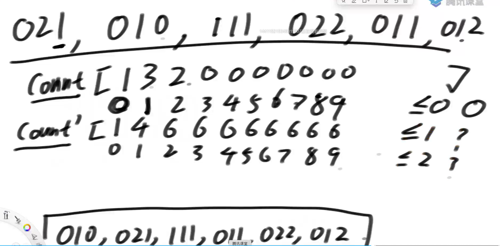
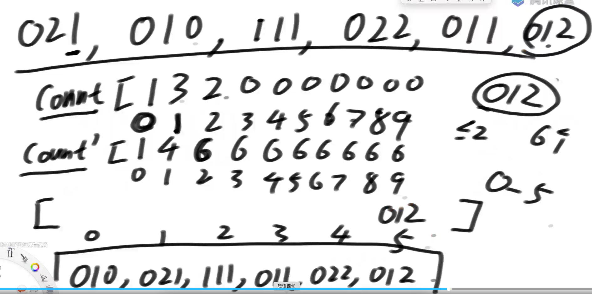
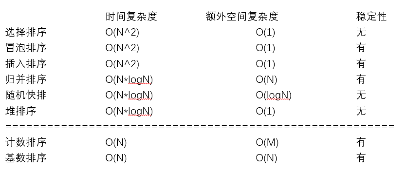
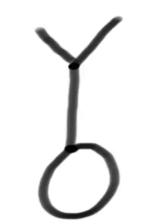
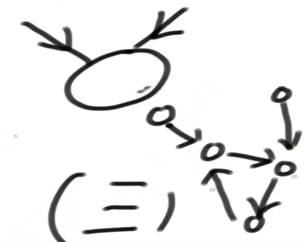

# 归并排序

## 递归思路

1. f(arr,L,R)函数，arr需要排序的数组，L起始位置，R结束位置，求出中点M
2. f(arr,L,M) L到M有序    T（N/2）
3. f(arr,M+1,R) M+1到R有序   T（N/2）
4. Merge 合并左部分和右部分  T（N）

## 时间复杂度

T（N） = 2 * T（N/2）+T（N）套用master公式

a=2 , b =2 ,d =1

d= log b a   

所以时间复杂度=O(N*logn)

```java
// 递归方法实现
public static void mergeSort1(int[] arr) {
   if (arr == null || arr.length < 2) {
      return;
   }
   process(arr, 0, arr.length - 1);
}

// 请把arr[L..R]排有序
// l...r N
// T(N) = 2 * T(N / 2) + O(N)
// O(N * logN)
public static void process(int[] arr, int L, int R) {
   if (L == R) { // base case
      return;
   }
   int mid = L + ((R - L) >> 1); //防溢出
   process(arr, L, mid);
   process(arr, mid + 1, R);
   merge(arr, L, mid, R);
}

public static void merge(int[] arr, int L, int M, int R) {
   int[] help = new int[R - L + 1];
   int i = 0;
   int p1 = L;
   int p2 = M + 1;
   while (p1 <= M && p2 <= R) {
      help[i++] = arr[p1] <= arr[p2] ? arr[p1++] : arr[p2++];
   }
   // 要么p1越界了，要么p2越界了
   while (p1 <= M) {
      help[i++] = arr[p1++];
   }
   while (p2 <= R) {
      help[i++] = arr[p2++];
   }
   for (i = 0; i < help.length; i++) {
      arr[L + i] = help[i];
   }
}

// 非递归方法实现
public static void mergeSort2(int[] arr) {
   if (arr == null || arr.length < 2) {
      return;
   }
   int N = arr.length;
   // 步长
   int mergeSize = 1;
   while (mergeSize < N) { // log N
      // 当前左组的，第一个位置
      int L = 0;
      while (L < N) {
         if (mergeSize >= N - L) {
            break;
         }
         int M = L + mergeSize - 1;
         int R = M + Math.min(mergeSize, N - M - 1);
         merge(arr, L, M, R);
         L = R + 1;
      }
      // 防止溢出
      if (mergeSize > N / 2) {
         break;
      }
      mergeSize <<= 1;
   }
}
```

## 最小和问题

```java
public static int smallSum(int[] arr) {
   if (arr == null || arr.length < 2) {
      return 0;
   }
   return process(arr, 0, arr.length - 1);
}

// arr[L..R]既要排好序，也要求小和返回
// 所有merge时，产生的小和，累加
// 左 排序   merge
// 右 排序  merge
// merge
public static int process(int[] arr, int l, int r) {
   if (l == r) {
      return 0;
   }
   // l < r
   int mid = l + ((r - l) >> 1);
   return 
         process(arr, l, mid) 
         + 
         process(arr, mid + 1, r) 
         + 
         merge(arr, l, mid, r);
}

public static int merge(int[] arr, int L, int m, int r) {
   int[] help = new int[r - L + 1];
   int i = 0;
   int p1 = L;
   int p2 = m + 1;
   int res = 0;
   while (p1 <= m && p2 <= r) {
      res += arr[p1] < arr[p2] ? (r - p2 + 1) * arr[p1] : 0;//左组小于右组有小和产生
      help[i++] = arr[p1] < arr[p2] ? arr[p1++] : arr[p2++];
   }
   while (p1 <= m) {
      help[i++] = arr[p1++];
   }
   while (p2 <= r) {
      help[i++] = arr[p2++];
   }
   for (i = 0; i < help.length; i++) {
      arr[L + i] = help[i];
   }
   return res;
}
```

## 逆序对问题

任何一个数组中，左边大于右边就是逆序对

```java
public static int reverPairNumber(int[] arr) {
   if (arr == null || arr.length < 2) {
      return 0;
   }
   return process(arr, 0, arr.length - 1);
}

// arr[L..R]既要排好序，也要求逆序对数量返回
// 所有merge时，产生的逆序对数量，累加，返回
// 左 排序 merge并产生逆序对数量
// 右 排序 merge并产生逆序对数量
public static int process(int[] arr, int l, int r) {
   if (l == r) {
      return 0;
   }
   // l < r
   int mid = l + ((r - l) >> 1);
   return process(arr, l, mid) + process(arr, mid + 1, r) + merge(arr, l, mid, r);
}

public static int merge(int[] arr, int L, int m, int r) {
   int[] help = new int[r - L + 1];
   int i = help.length - 1;
   int p1 = m;
   int p2 = r;
   int res = 0;
   while (p1 >= L && p2 > m) {
      res += arr[p1] > arr[p2] ? (p2 - m) : 0;
      help[i--] = arr[p1] > arr[p2] ? arr[p1--] : arr[p2--];
   }
   while (p1 >= L) {
      help[i--] = arr[p1--];
   }
   while (p2 > m) {
      help[i--] = arr[p2--];
   }
   for (i = 0; i < help.length; i++) {
      arr[L + i] = help[i];
   }
   return res;
}
```

## 不大于两倍的数和

```java
public static int biggerTwice(int[] arr) {
   if (arr == null || arr.length < 2) {
      return 0;
   }
   return process(arr, 0, arr.length - 1);
}

public static int process(int[] arr, int l, int r) {
   if (l == r) {
      return 0;
   }
   // l < r
   int mid = l + ((r - l) >> 1);
   return process(arr, l, mid) + process(arr, mid + 1, r) + merge(arr, l, mid, r);
}

public static int merge(int[] arr, int L, int m, int r) {
   // [L....M]   [M+1....R]
   
   int ans = 0;
   // 目前囊括进来的数，是从[M+1, windowR)
   int windowR = m + 1;
   for (int i = L; i <= m; i++) {
      while (windowR <= r && arr[i] > (arr[windowR] * 2)) {
         windowR++;
      }
      ans += windowR - m - 1;
   }
   
   
   int[] help = new int[r - L + 1];
   int i = 0;
   int p1 = L;
   int p2 = m + 1;
   while (p1 <= m && p2 <= r) {
      help[i++] = arr[p1] <= arr[p2] ? arr[p1++] : arr[p2++];
   }
   while (p1 <= m) {
      help[i++] = arr[p1++];
   }
   while (p2 <= r) {
      help[i++] = arr[p2++];
   }
   for (i = 0; i < help.length; i++) {
      arr[L + i] = help[i];
   }
   return ans;
}
```

## 附加题

无序数组的累加和

arr[]

getSum（arr,i,j）

**思路**

可以转化成求0~j的累加和，减去0~（i-1）的累加和

前置数组：preSum[i] = arr[0-i] 遍历arr一遍就能生成

比如求2-4的累加和就可以等于  preSum[4]-preSum[2]


### 题目

给定一个数组arr，两个整数lower和upper，返回arr中有多少个 **子数组的累加和** 在[lower，upper]范围内

lower<=sum<=upper

**举例**

假如arr[0-17]累加和是100 ，范围是[10,40]

该问题转化为有arr[0-16]的累加和中有多少在[100-40,100-10]这个范围内

**思路1**

1. 求出前缀和
2. 把原数组[lower，upper]转化成，前缀和数组中求[X-Upper，X-lower]
3. 前缀数组中每个X之前有多少个数落在[X-Upper，X-lower]
4. 放在归并排序过程中
5. Merge

```java
public class Code01_CountOfRangeSum {

   public static int countRangeSum(int[] nums, int lower, int upper) {
      if (nums == null || nums.length == 0) {
         return 0;
      }
      long[] sum = new long[nums.length];
      sum[0] = nums[0];
      //前缀和
      for (int i = 1; i < nums.length; i++) {
         sum[i] = sum[i - 1] + nums[i];
      }
      return process(sum, 0, sum.length - 1, lower, upper);
   }

   public static int process(long[] sum, int L, int R, int lower, int upper) {
      if (L == R) {
         return sum[L] >= lower && sum[L] <= upper ? 1 : 0;
      }
      int M = L + ((R - L) >> 1);
      return process(sum, L, M, lower, upper) + process(sum, M + 1, R, lower, upper)
            + merge(sum, L, M, R, lower, upper);
   }

   public static int merge(long[] arr, int L, int M, int R, int lower, int upper) {
      int ans = 0;
      int windowL = L;
      int windowR = L;
      // [windowL, windowR)
      for (int i = M + 1; i <= R; i++) {
         long min = arr[i] - upper;
         long max = arr[i] - lower;
         while (windowR <= M && arr[windowR] <= max) {
            windowR++;
         }
         while (windowL <= M && arr[windowL] < min) {
            windowL++;
         }
         ans += windowR - windowL;
      }
      long[] help = new long[R - L + 1];
      int i = 0;
      int p1 = L;
      int p2 = M + 1;
      while (p1 <= M && p2 <= R) {
         help[i++] = arr[p1] <= arr[p2] ? arr[p1++] : arr[p2++];
      }
      while (p1 <= M) {
         help[i++] = arr[p1++];
      }
      while (p2 <= R) {
         help[i++] = arr[p2++];
      }
      for (i = 0; i < help.length; i++) {
         arr[L + i] = help[i];
      }
      return ans;
   }

}
```

**思路2**

# 快速排序

## 荷兰国旗问题

1. 给定数组arr 输入x ,小于x的放左边，大于x的放右边，等于x的放中间
2. 给定数组arr 输入x ,小于等于x的放左边，大于x的放右边

时间复杂度0（n），不能使用辅助数组


准备两个区域[，下标0]、下标[length-1]，从左到右遍历

1. 当前数<目标  ：左区域的下一个数和当前数交换，左区域向右扩，遍历下一个

2. 当前数=目标  ：遍历下一个

3. 当前数>目标  ：右区域的前一个数和当前数交换，右区域向左扩，交换后重复1
4. 当前数和右边界撞了，停

```java
// 荷兰国旗问题
public static int[] netherlandsFlag(int[] arr, int L, int R) {
   if (L > R) {
      return new int[] { -1, -1 };
   }
   if (L == R) {
      return new int[] { L, R };
   }
   int less = L - 1;
   int more = R;
   int index = L;
   while (index < more) {
      if (arr[index] == arr[R]) {
         index++;
      } else if (arr[index] < arr[R]) {
         swap(arr, index++, ++less);
      } else {
         swap(arr, index, --more);
      }
   }
   swap(arr, more, R);
   return new int[] { less + 1, more };
}

public static void swap(int[] arr, int i, int j) {
   int tmp = arr[i];
   arr[i] = arr[j];
   arr[j] = tmp;
}

// 快排递归版本
public static void quickSort1(int[] arr) {
   if (arr == null || arr.length < 2) {
      return;
   }
   process(arr, 0, arr.length - 1);
}

public static void process(int[] arr, int L, int R) {
   if (L >= R) {
      return;
   }
   swap(arr, L + (int) (Math.random() * (R - L + 1)), R);
   int[] equalArea = netherlandsFlag(arr, L, R);
   process(arr, L, equalArea[0] - 1);
   process(arr, equalArea[1] + 1, R);
}

// 快排非递归版本需要的辅助类
// 要处理的是什么范围上的排序
public static class Op {
   public int l;
   public int r;

   public Op(int left, int right) {
      l = left;
      r = right;
   }
}

// 快排3.0 非递归版本
public static void quickSort2(int[] arr) {
   if (arr == null || arr.length < 2) {
      return;
   }
   int N = arr.length;
   swap(arr, (int) (Math.random() * N), N - 1);
   int[] equalArea = netherlandsFlag(arr, 0, N - 1);
   int el = equalArea[0];
   int er = equalArea[1];
   Stack<Op> stack = new Stack<>();
   stack.push(new Op(0, el - 1));
   stack.push(new Op(er + 1, N - 1));
   while (!stack.isEmpty()) {
      Op op = stack.pop(); // op.l  ... op.r
      if (op.l < op.r) {
         swap(arr, op.l + (int) (Math.random() * (op.r - op.l + 1)), op.r);
         equalArea = netherlandsFlag(arr, op.l, op.r);
         el = equalArea[0];
         er = equalArea[1];
         stack.push(new Op(op.l, el - 1));
         stack.push(new Op(er + 1, op.r));
      }
   }
}
```

# 比较器

```java
// 任何比较器：
// compare方法里，遵循一个统一的规范：
// 返回负数的时候，认为第一个参数应该排在前面
// 返回正数的时候，认为第二个参数应该排在前面
// 返回0的时候，认为无所谓谁放前面
```

```java
// 排序的类
public static class Student {
   public String name;
   public int id;
   public int age;

   public Student(String name, int id, int age) {
      this.name = name;
      this.id = id;
      this.age = age;
   }
}
```

```java
// 继承于Comparator类实现compare方法,经典写法	
public static class IdShengAgeJiangOrder implements Comparator<Student> {

   // 按照年龄从大到小
   @Override
   public int compare(Student o1, Student o2) {
       /**
     	if(o1.age < o2.age){
            return -1;
        }else if(o1.age > o2.age){
            return 1;
        }else {
            return 0;
        }    */
       return o1.age - o2.age; //精简写法
   }
    
    
    // 根据id从小到大，但是如果id一样，按照年龄从大到小
		@Override
		public int compare(Student o1, Student o2) {
			return o1.id != o2.id ? (o1.id - o2.id) : (o2.age - o1.age);
		}
}

```

```java
Arrays.sort(arr, new IdShengAgeJiangOrder());//使用方法

ArrayList<Student> studentList = new ArrayList<>();
studentList.sort(new IdShengAgeJiangOrder());

// 有序表必须传入比较器，否则put的时候会报错
TreeMap<Student, String> treeMap = new TreeMap<>((a, b) -> (a.id - b.id));
TreeMap<Student, String> treeMap = new TreeMap<>(new IdShengAgeJiangOrder());
// 如果比较器只比较Id，相同的id不会put
```

# 堆和堆排序

heap在使用的层面叫Priority Queue 优先级队列（底层就是堆实现的）

## 完全二叉树

一棵深度为k的有n个结点二叉树，对树中的结点按从上至下、从左到右的顺序进行编号，如果编号为i（1≤i≤n）的结点与满二叉树中编号为i的结点在二叉树中的位置相同，则这棵二叉树称为完全二叉树。

空树算完全二叉树（人为规定）

满二叉树一定是完全二叉树

叶子结点只可能在最大的两层出现

不满的层只能在最后一层，并且从左往右依次变满

### 完全二叉树表示

从0出发的连续数组可以认为是完全二叉树

i位置的左孩子：2*i+1

i位置的左孩子：2*i+2

i位置的父节点：（i-1）/2 向下取整

## 堆

**堆是完全二叉树**

大根堆：每一棵子树的最大值都是头节点

小根堆：每一棵子树的最小值都是头节点

### heapInsert

复杂度 O（logN）

```java
// 从index位置，往下看，不断的下沉
// 停：较大的孩子都不再比index位置的数大；已经没孩子了
private void heapify(int[] arr, int index, int heapSize) {
   int left = index * 2 + 1;
   while (left < heapSize) { // 如果有左孩子，有没有右孩子，可能有可能没有！
      // 把较大孩子的下标，给largest
      int largest = left + 1 < heapSize && arr[left + 1] > arr[left] ? left + 1 : left;
      largest = arr[largest] > arr[index] ? largest : index;
      if (largest == index) {
         break;
      }
      // index和较大孩子，要互换
      swap(arr, largest, index);
      index = largest;
      left = index * 2 + 1;
   }
}
```

```java
private void swap(int[] arr, int i, int j) {
    int tmp = arr[i];
    arr[i] = arr[j];
    arr[j] = tmp;
}

// 新加进来的数，现在停在了index位置，请依次往上移动，
// 移动到0位置，或者干不掉自己的父亲了，停！
private void heapInsert(int[] arr, int index) {
   // [index]    [index-1]/2
   // index == 0 0>0不成立
   while (arr[index] > arr[(index - 1) / 2]) {
      swap(arr, index, (index - 1) / 2);
      index = (index - 1) / 2;
   }
}
```

### heapify

复杂度 O（logN）

```java
// 从index位置，往下看，不断的下沉
// 停：较大的孩子都不再比index位置的数大；已经没孩子了
private void heapify(int[] arr, int index, int heapSize) {
   int left = index * 2 + 1;
   while (left < heapSize) { // 如果有左孩子，有没有右孩子，可能有可能没有！
      // 把较大孩子的下标，给largest
      int largest = left + 1 < heapSize && arr[left + 1] > arr[left] ? left + 1 : left;
      largest = arr[largest] > arr[index] ? largest : index;
      if (largest == index) {
         break;
      }
      // index和较大孩子，要互换
      swap(arr, largest, index);
      index = largest;
      left = index * 2 + 1;
   }
}
```


```java
// 小根堆
PriorityQueue<Integer> heap = new PriorityQueue<>();
// 大根堆
PriorityQueue<Integer> heap = new PriorityQueue<>(new MyComparator());
    heap.add(5);
    heap.add(5);
    heap.add(5);
    heap.add(3);
//  5 , 3
	System.out.println(heap.peek());
	heap.add(7);
	heap.add(0);
	heap.add(7);
	heap.add(0);
	heap.add(7);		
	heap.add(0);
	System.out.println(heap.peek());
	while(!heap.isEmpty()) {
   		System.out.println(heap.poll());
	}

	public static class MyComparator implements Comparator<Integer>{

		@Override
		public int compare(Integer o1, Integer o2) {
			return o2 - o1;
		}
		
	}
```

## 堆排序

1. 原始数组调整为大根堆 o(logN) / o(N)
2. 0位置和N-1位置交换，堆大小(heapSize)--    o(N)

```java
// 堆排序额外空间复杂度O(1)
   public static void heapSort(int[] arr) {
      if (arr == null || arr.length < 2) {
         return;
      }
      // O(N*logN) 一个个给只能用这个
//    for (int i = 0; i < arr.length; i++) { // O(N)
//       heapInsert(arr, i); // O(logN)
//    }
      // O(N) 从下往上建堆
      for (int i = arr.length - 1; i >= 0; i--) {
         heapify(arr, i, arr.length);
      }
      int heapSize = arr.length;
      swap(arr, 0, --heapSize);
      // O(N*logN)
      while (heapSize > 0) { // O(N)
         heapify(arr, 0, heapSize); // O(logN)
         swap(arr, 0, --heapSize); // O(1)
      }
   }
```

### 最大线段重合问题

给定许多线段，每个线段都有两个数组[start,end]，表示线段的开始和结束位置，左右都是闭区间的

规定：

线段的开始位置和结束位置必须都是整数值

线段重合的区域的长度必须>=1返回线段最多的重合区域中，包含了几条线段

返回：线段重合区域最多的数量

**思路1**

找到最小开始位置min

找到最大开始位置max

从min+0.5开始到max-0.5的每个点都计算一遍，找到最多的数量（枚举），不能整数因为可能重合的是一个点

时间复杂度：O（（max-min）N）

```java
public static int maxCover1(int[][] lines) {
   int min = Integer.MAX_VALUE;
   int max = Integer.MIN_VALUE;
   for (int i = 0; i < lines.length; i++) {
      min = Math.min(min, lines[i][0]);//0开始位置
      max = Math.max(max, lines[i][1]);//1结束位置
   }
   int cover = 0;
   for (double p = min + 0.5; p < max; p += 1) {
      int cur = 0;
      for (int i = 0; i < lines.length; i++) {
         if (lines[i][0] < p && lines[i][1] > p) {
            cur++;
         }
      }
      cover = Math.max(cover, cur);
   }
   return cover;
}
```

**思路2**

1. 线段按照左边界从大到小排序
2. 线段重合区域的左边界必是某个线段的左边界，求出每个线段左边界向右贯穿的数量
3. 每个线段的结尾放入小根堆，弹出小于该线段开始的值（堆中存放的是，开始位置小于，当前线段的开始位置的结尾的值，如果这个值小于当前线段开始位置的值必定不会贯穿，弹出，**堆中只存结束位置**）
4. 找到最大值

```java
//线段的数据结构
public static class Line {
   public int start;
   public int end;

   public Line(int s, int e) {
      start = s;
      end = e;
   }
}
```

```java
//开始位置的比较器
public static class StartComparator implements Comparator<Line> {

   @Override
   public int compare(Line o1, Line o2) {
      return o1.start - o2.start;
   }

}
```

```java
public static int maxCover2(int[][] m) {
   Line[] lines = new Line[m.length];
   for (int i = 0; i < m.length; i++) {
      lines[i] = new Line(m[i][0], m[i][1]);
   }
   Arrays.sort(lines, new StartComparator());//比较器排序
   // 小根堆，每一条线段的结尾数值，使用默认的
   PriorityQueue<Integer> heap = new PriorityQueue<>();
   int max = 0;
   for (int i = 0; i < lines.length; i++) {
      // lines[i] -> cur  在堆中把结尾<=cur.start 东西都弹出
      while (!heap.isEmpty() && heap.peek() <= lines[i].start) {
         heap.poll();
      }
      heap.add(lines[i].end);//把自己的结尾放入
      max = Math.max(max, heap.size());
   }
   return max;
}
```

### 手动改写堆问题

***

Java中的堆没有提供反向索引表，我们不能快速找到元素在堆中的位置

反向索引表：某个元素进来了，能够立刻知道该元素在堆中的位置

```java
/*
 * T一定要是非基础类型，有基础类型需求包一层
 */
public class HeapGreater<T> {

   private ArrayList<T> heap;
   //[a,b,c]
   // a->0
   // b->1
   // c->3
   private HashMap<T, Integer> indexMap;
   private int heapSize;
   private Comparator<? super T> comp;

   public HeapGreater(Comparator<T> c) {
      heap = new ArrayList<>();
      indexMap = new HashMap<>();
      heapSize = 0;
      comp = c;
   }

   public boolean isEmpty() {
      return heapSize == 0;
   }

   public int size() {
      return heapSize;
   }

   public boolean contains(T obj) {
      return indexMap.containsKey(obj);
   }

   public T peek() {
      return heap.get(0);
   }

   public void push(T obj) {
      heap.add(obj);
      indexMap.put(obj, heapSize);
      heapInsert(heapSize++);
   }

   public T pop() {
      T ans = heap.get(0);
      swap(0, heapSize - 1);//最后位置和0交换
      indexMap.remove(ans);//索引表中删除
      heap.remove(--heapSize);//删除
      heapify(0);//从0位置进行堆调整logn
      return ans;
   }
	//删除任意位置
   public void remove(T obj) {
      T replace = heap.get(heapSize - 1);
      int index = indexMap.get(obj);
      indexMap.remove(obj);
      heap.remove(--heapSize);
       //是否是最后一个元素
      if (obj != replace) {
         heap.set(index, replace);
         indexMap.put(replace, index);
         resign(replace);
      }
   }

   public void resign(T obj) {
       //只会发生一个
      heapInsert(indexMap.get(obj));
      heapify(indexMap.get(obj));
   }

   // 请返回堆上的所有元素
   public List<T> getAllElements() {
      List<T> ans = new ArrayList<>();
      for (T c : heap) {
         ans.add(c);
      }
      return ans;
   }

   private void heapInsert(int index) {
      while (comp.compare(heap.get(index), heap.get((index - 1) / 2)) < 0) {
         swap(index, (index - 1) / 2);
         index = (index - 1) / 2;
      }
   }

   private void heapify(int index) {
      int left = index * 2 + 1;
      while (left < heapSize) {
         int best = left + 1 < heapSize && comp.compare(heap.get(left + 1), heap.get(left)) < 0 ? (left + 1) : left;
         best = comp.compare(heap.get(best), heap.get(index)) < 0 ? best : index;
         if (best == index) {
            break;
         }
         swap(best, index);
         index = best;
         left = index * 2 + 1;
      }
   }

   private void swap(int i, int j) {
      T o1 = heap.get(i);
      T o2 = heap.get(j);
      heap.set(i, o2);
      heap.set(j, o1);
      indexMap.put(o2, i);
      indexMap.put(o1, j);
   }

}
```

---

**问题**

给定一个整型数组，int[] arr;和一个布尔类型的数组，boolean[] op两个数组一定等长，假设长度为N，arr[i]表示客户编号，op[i]表示客户操作

arr = [3,3,1,2,1,2,5...

op= [T,T,T,T,F,T,F...

依次表示：3用户买了一件商品，3用户买了一件商品，1用户买了一件商品，2用户买了一件商品，1用户退货了一件商品，2用户买了一件商品，5用户退货了一件商品...

一对arr[i]和op[i]就代表一个事件：

用户号为arr[i]，op[i] == T就代表这个用户购买了一件商品

op[i] == F就代表这个用户退货了一件商品

现在你作为电商平台负责人，你想在每一个事件到来的时候，

都给购买次数最多的前K名用户颁奖。

所以每个事件发生后，你都需要一个得奖名单（得奖区）。

**得奖系统规则**

1，如果某个用户购买商品数为0，但是又发生了退货事件，

   则认为该事件无效，得奖名单和之前事件时一致，比如例子中的5用户

2，某用户发生购买商品事件，购买商品数+1，发生退货事件，购买商品数-1

3，每次都是最多K个用户得奖，K也为传入的参数

   如果根据全部规则，得奖人数确实不够K个，那就以不够的情况输出结果

4，得奖系统分为得奖区和候选区，任何用户只要购买数>0，

   一定在这两个区域中的一个

5，购买数最大的前K名用户进入得奖区，

   在最初时如果得奖区没有到达K个用户，那么新来的用户直接进入得奖区

6，如果购买数不足以进入得奖区的用户，进入候选区

7，如果候选区购买数最多的用户，已经足以进入得奖区，

   该用户就会替换得奖区中购买数最少的用户（大于才能替换），

   如果得奖区中购买数最少的用户有多个，就替换最早进入得奖区的用户

   如果候选区中购买数最多的用户有多个，机会会给最早进入候选区的用户

8，候选区和得奖区是两套时间，

   从得奖区出来进入候选区的用户，得奖区时间清空，

   进入候选区的时间就是当前事件的时间（可以理解为arr[i]和op[i]中的i）

   从候选区出来进入得奖区的用户，候选区时间清空，

   进入得奖区的时间就是当前事件的时间（可以理解为arr[i]和op[i]中的i）

9，如果某用户购买数==0，不管在哪个区域都离开，区域时间清空，

   离开是指彻底离开，哪个区域也不会找到该用户

   如果下次该用户又发生购买行为，产生>0的购买数，

   会再次根据之前规则回到某个区域中，进入区域的时间重记

请遍历arr数组和op数组，遍历每一步输出一个得奖名单


public List<List<Integer>> topK (int[] arr, boolean[] op, int k)

**解决**

**复杂方法**

```java
public class Code02_EveryStepShowBoss {

   public static class Customer {
      public int id;//客户编号
      public int buy;//买的数量
      public int enterTime;//执行操作的时间

      public Customer(int v, int b, int o) {
         id = v;
         buy = b;
         enterTime = 0;
      }
   }

   public static class CandidateComparator implements Comparator<Customer> {

      @Override
      public int compare(Customer o1, Customer o2) {
         return o1.buy != o2.buy ? (o2.buy - o1.buy) : (o1.enterTime - o2.enterTime);
      }

   }

   public static class DaddyComparator implements Comparator<Customer> {

      @Override
      public int compare(Customer o1, Customer o2) {
         return o1.buy != o2.buy ? (o1.buy - o2.buy) : (o1.enterTime - o2.enterTime);
      }

   }


   // 干完所有的事，模拟，不优化
   public static List<List<Integer>> compare(int[] arr, boolean[] op, int k) {
      HashMap<Integer, Customer> map = new HashMap<>();
      ArrayList<Customer> cands = new ArrayList<>();
      ArrayList<Customer> daddy = new ArrayList<>();
      List<List<Integer>> ans = new ArrayList<>();
      for (int i = 0; i < arr.length; i++) {
         int id = arr[i];
         boolean buyOrRefund = op[i];
         if (!buyOrRefund && !map.containsKey(id)) {//退货并且map中不包含，等同于事件没有发生
            ans.add(getCurAns(daddy));//遍历得奖区，直接返回当前时间点的答案，进行下一次循环
            continue;
         }
          
         // 用户之前购买数>0， 此时买货
         // 用户之前购买数>0, 此时退货
         // 用户之前购买数是0，此时买货事件
         if (!map.containsKey(id)) {
            map.put(id, new Customer(id, 0, 0));//公共的部分先塞进去，后面对0进行调整
         }
          
         // 买还是卖
         Customer c = map.get(id);
         if (buyOrRefund) {
            c.buy++;
         } else {
            c.buy--;
         }
          
         if (c.buy == 0) {
            map.remove(id);//如果买的数量是0，从map中移除
         }
          
         if (!cands.contains(c) && !daddy.contains(c)) {//用户新进来的并且发生了购买
            if (daddy.size() < k) {//进入得奖区
               c.enterTime = i;
               daddy.add(c);
            } else {
               c.enterTime = i;//进入候选区
               cands.add(c);
            }
         }
         // 得奖区和候选区也需要移除
         cleanZeroBuy(cands);
         cleanZeroBuy(daddy);
         //得奖区和候选区进行排序
         cands.sort(new CandidateComparator());//购买数较大的放在前面 ，购买数一样谁早谁放前面 
         daddy.sort(new DaddyComparator());//购买数少的放前面。购买数一样谁早谁放前面 
          
         move(cands, daddy, k, i);//得奖区进候选区，候选区进得奖区的调整，top K
          
         ans.add(getCurAns(daddy));//得到得奖区的结果
      }
      return ans;
   }

   public static void move(ArrayList<Customer> cands, ArrayList<Customer> daddy, int k, int time) {
      if (cands.isEmpty()) {//候选区没东西
         return;
      }
      // 候选区不为空
      if (daddy.size() < k) {//得奖区没满
         Customer c = cands.get(0);//的到第一个
         c.enterTime = time;
         daddy.add(c);
         cands.remove(0);
      } else { // 等奖区满了，候选区有东西
         if (cands.get(0).buy > daddy.get(0).buy) {//候选区买的大于得奖区买的，否则不调整
            Customer oldDaddy = daddy.get(0);
            daddy.remove(0);
            Customer newDaddy = cands.get(0);
            cands.remove(0);
            newDaddy.enterTime = time;
            oldDaddy.enterTime = time;
            daddy.add(newDaddy);
            cands.add(oldDaddy);
         }
      }
   }

   public static void cleanZeroBuy(ArrayList<Customer> arr) {
      List<Customer> noZero = new ArrayList<Customer>();
      for (Customer c : arr) {
         if (c.buy != 0) {
            noZero.add(c);
         }
      }
      arr.clear();
      for (Customer c : noZero) {
         arr.add(c);
      }
   }

   public static List<Integer> getCurAns(ArrayList<Customer> daddy) {
      List<Integer> ans = new ArrayList<>();
      for (Customer c : daddy) {
         ans.add(c.id);
      }
      return ans;
   }
```

**优化**

每一个过程都是堆的时间复杂度

```java
public static class WhosYourDaddy {
   private HashMap<Integer, Customer> customers;
   private HeapGreater<Customer> candHeap;
   private HeapGreater<Customer> daddyHeap;
   private final int daddyLimit;//得奖区多大

   public WhosYourDaddy(int limit) {
      customers = new HashMap<Integer, Customer>();
      candHeap = new HeapGreater<>(new CandidateComparator());//大根堆
      daddyHeap = new HeapGreater<>(new DaddyComparator());//小根堆
      daddyLimit = limit;
   }

   // 当前处理i号事件，arr[i] -> id,  buyOrRefund
   public void operate(int time, int id, boolean buyOrRefund) {
      if (!buyOrRefund && !customers.containsKey(id)) {
         return;
      }
      if (!customers.containsKey(id)) {
         customers.put(id, new Customer(id, 0, 0));
      }
      Customer c = customers.get(id);
      if (buyOrRefund) {
         c.buy++;
      } else {
         c.buy--;
      }
      if (c.buy == 0) {
         customers.remove(id);
      }
      if (!candHeap.contains(c) && !daddyHeap.contains(c)) {
         if (daddyHeap.size() < daddyLimit) {
            c.enterTime = time;
            daddyHeap.push(c);
         } else {
            c.enterTime = time;
            candHeap.push(c);
         }
      } else if (candHeap.contains(c)) {
         if (c.buy == 0) {
            candHeap.remove(c);
         } else {
            candHeap.resign(c);
         }
      } else {
         if (c.buy == 0) {
            daddyHeap.remove(c);
         } else {
            daddyHeap.resign(c);//堆调整
         }
      }
      daddyMove(time);
   }

   public List<Integer> getDaddies() {
      List<Customer> customers = daddyHeap.getAllElements();
      List<Integer> ans = new ArrayList<>();
      for (Customer c : customers) {
         ans.add(c.id);
      }
      return ans;
   }

   private void daddyMove(int time) {
      if (candHeap.isEmpty()) {
         return;
      }
      if (daddyHeap.size() < daddyLimit) {
         Customer p = candHeap.pop();
         p.enterTime = time;
         daddyHeap.push(p);
      } else {
         if (candHeap.peek().buy > daddyHeap.peek().buy) {
            Customer oldDaddy = daddyHeap.pop();
            Customer newDaddy = candHeap.pop();
            oldDaddy.enterTime = time;
            newDaddy.enterTime = time;
            daddyHeap.push(newDaddy);
            candHeap.push(oldDaddy);
         }
      }
   }

}


   public static List<List<Integer>> topK(int[] arr, boolean[] op, int k) {
      List<List<Integer>> ans = new ArrayList<>();
      WhosYourDaddy whoDaddies = new WhosYourDaddy(k);
      for (int i = 0; i < arr.length; i++) {
         whoDaddies.operate(i, arr[i], op[i]);
         ans.add(whoDaddies.getDaddies());
      }
      return ans;
   }
```

# 前缀树

p：每个节点的字符到达过几次

e：这个节点有多少字符串以他结尾

```java
public class Code02_TrieTree {

   public static class Node1 {
      public int pass;
      public int end;
      public Node1[] nexts;

      // char tmp = 'b'  (tmp - 'a')
      public Node1() {
         pass = 0;
         end = 0;
         // 0    a
         // 1    b
         // 2    c
         // ..   ..
         // 25   z
         // nexts[i] == null   i方向的路不存在
         // nexts[i] != null   i方向的路存在
         nexts = new Node1[26];
      }
   }

   public static class Trie1 {
      private Node1 root;

      public Trie1() {
         root = new Node1();
      }

      public void insert(String word) {
         if (word == null) {
            return;
         }
         char[] str = word.toCharArray();
         Node1 node = root;
         node.pass++;
         int path = 0;
         for (int i = 0; i < str.length; i++) { // 从左往右遍历字符
            path = str[i] - 'a'; // 由字符，对应成走向哪条路
            if (node.nexts[path] == null) {
               node.nexts[path] = new Node1();
            }
            node = node.nexts[path];
            node.pass++;
         }
         node.end++;
      }

      public void delete(String word) {
         if (search(word) != 0) {
            char[] chs = word.toCharArray();
            Node1 node = root;
            node.pass--;
            int path = 0;
            for (int i = 0; i < chs.length; i++) {
               path = chs[i] - 'a';
               if (--node.nexts[path].pass == 0) {
                  node.nexts[path] = null;
                  return;
               }
               node = node.nexts[path];
            }
            node.end--;
         }
      }

      // word这个单词之前加入过几次
      public int search(String word) {
         if (word == null) {
            return 0;
         }
         char[] chs = word.toCharArray();
         Node1 node = root;
         int index = 0;
         for (int i = 0; i < chs.length; i++) {
            index = chs[i] - 'a';
            if (node.nexts[index] == null) {
               return 0;
            }
            node = node.nexts[index];
         }
         return node.end;
      }

      // 所有加入的字符串中，有几个是以pre这个字符串作为前缀的
      public int prefixNumber(String pre) {
         if (pre == null) {
            return 0;
         }
         char[] chs = pre.toCharArray();
         Node1 node = root;
         int index = 0;
         for (int i = 0; i < chs.length; i++) {
            index = chs[i] - 'a';
            if (node.nexts[index] == null) {
               return 0;
            }
            node = node.nexts[index];
         }
         return node.pass;
      }
   }

   public static class Node2 {
      public int pass;
      public int end;
      public HashMap<Integer, Node2> nexts;

      public Node2() {
         pass = 0;
         end = 0;
         nexts = new HashMap<>();
      }
   }

   public static class Trie2 {
      private Node2 root;

      public Trie2() {
         root = new Node2();
      }

      public void insert(String word) {
         if (word == null) {
            return;
         }
         char[] chs = word.toCharArray();
         Node2 node = root;
         node.pass++;
         int index = 0;
         for (int i = 0; i < chs.length; i++) {
            index = (int) chs[i];
            if (!node.nexts.containsKey(index)) {
               node.nexts.put(index, new Node2());
            }
            node = node.nexts.get(index);
            node.pass++;
         }
         node.end++;
      }

      public void delete(String word) {
         if (search(word) != 0) {
            char[] chs = word.toCharArray();
            Node2 node = root;
            node.pass--;
            int index = 0;
            for (int i = 0; i < chs.length; i++) {
               index = (int) chs[i];
               if (--node.nexts.get(index).pass == 0) {
                  node.nexts.remove(index);
                  return;
               }
               node = node.nexts.get(index);
            }
            node.end--;
         }
      }

      // word这个单词之前加入过几次
      public int search(String word) {
         if (word == null) {
            return 0;
         }
         char[] chs = word.toCharArray();
         Node2 node = root;
         int index = 0;
         for (int i = 0; i < chs.length; i++) {
            index = (int) chs[i];
            if (!node.nexts.containsKey(index)) {
               return 0;
            }
            node = node.nexts.get(index);
         }
         return node.end;
      }

      // 所有加入的字符串中，有几个是以pre这个字符串作为前缀的
      public int prefixNumber(String pre) {
         if (pre == null) {
            return 0;
         }
         char[] chs = pre.toCharArray();
         Node2 node = root;
         int index = 0;
         for (int i = 0; i < chs.length; i++) {
            index = (int) chs[i];
            if (!node.nexts.containsKey(index)) {
               return 0;
            }
            node = node.nexts.get(index);
         }
         return node.pass;
      }
   }
```

# 基数排序

刷题认为O（N*logN）





count表示某一位出现的个数

count'是代表小于x的有多少个

从右往左遍历，012最右是2，看count'中小于等于2的有6个，由于数组长度是6，012肯定位于5位置 ，count‘要--	

```java
public class Code04_RadixSort {

   // only for no-negative value
   public static void radixSort(int[] arr) {
      if (arr == null || arr.length < 2) {
         return;
      }
      radixSort(arr, 0, arr.length - 1, maxbits(arr));
   }

   public static int maxbits(int[] arr) {
      int max = Integer.MIN_VALUE;
      for (int i = 0; i < arr.length; i++) {
         max = Math.max(max, arr[i]);
      }
      int res = 0;
      while (max != 0) {
         res++;
         max /= 10;
      }
      return res;
   }

   // arr[L..R]排序  ,  最大值的十进制位数digit
   public static void radixSort(int[] arr, int L, int R, int digit) {
      final int radix = 10;
      int i = 0, j = 0;
      // 有多少个数准备多少个辅助空间
      int[] help = new int[R - L + 1];
      for (int d = 1; d <= digit; d++) { // 有多少位就进出几次
         // 10个空间
          // count[0] 当前位(d位)是0的数字有多少个
         // count[1] 当前位(d位)是(0和1)的数字有多少个
         // count[2] 当前位(d位)是(0、1和2)的数字有多少个
         // count[i] 当前位(d位)是(0~i)的数字有多少个
         int[] count = new int[radix]; // count[0..9]
         for (i = L; i <= R; i++) {
            // 103  1   3
            // 209  1   9
            j = getDigit(arr[i], d);
            count[j]++;
         }
         for (i = 1; i < radix; i++) {
            count[i] = count[i] + count[i - 1];
         }
         for (i = R; i >= L; i--) {
            j = getDigit(arr[i], d);
            help[count[j] - 1] = arr[i];
            count[j]--;
         }
         for (i = L, j = 0; i <= R; i++, j++) {
            arr[i] = help[j];
         }
      }
   }

   public static int getDigit(int x, int d) {
      return ((x / ((int) Math.pow(10, d - 1))) % 10);
   }

   // for test
   public static void comparator(int[] arr) {
      Arrays.sort(arr);
   }

   // for test
   public static int[] generateRandomArray(int maxSize, int maxValue) {
      int[] arr = new int[(int) ((maxSize + 1) * Math.random())];
      for (int i = 0; i < arr.length; i++) {
         arr[i] = (int) ((maxValue + 1) * Math.random());
      }
      return arr;
   }

   // for test
   public static int[] copyArray(int[] arr) {
      if (arr == null) {
         return null;
      }
      int[] res = new int[arr.length];
      for (int i = 0; i < arr.length; i++) {
         res[i] = arr[i];
      }
      return res;
   }

   // for test
   public static boolean isEqual(int[] arr1, int[] arr2) {
      if ((arr1 == null && arr2 != null) || (arr1 != null && arr2 == null)) {
         return false;
      }
      if (arr1 == null && arr2 == null) {
         return true;
      }
      if (arr1.length != arr2.length) {
         return false;
      }
      for (int i = 0; i < arr1.length; i++) {
         if (arr1[i] != arr2[i]) {
            return false;
         }
      }
      return true;
   }

   // for test
   public static void printArray(int[] arr) {
      if (arr == null) {
         return;
      }
      for (int i = 0; i < arr.length; i++) {
         System.out.print(arr[i] + " ");
      }
      System.out.println();
   }
```

# 排序算法的稳定性

**相同时相对位置不变**

稳定性是指同样大小的样本再次排序后不会改变相应的次序

对于基础数据类型来说，稳定性无意义

对于非基础数据类型来说，稳定性有意义

有些排序算法可以实现稳定性，有些算法怎么也实现不了

## 实际应用

价格先排序，然后再好评度排序

# 排序总结



1）不基于比较的排序，对样本数据有严格要求，不易改写

2）基于比较的排序，只要规定好两个样本怎么比大小就可以直接复用

3）基于比较的排序，时间复杂度的极限是O(N*logN)

4）时间复杂度O(N*logN)、额外空间复杂度低于O(N)、且稳定的基于比较的排序是不存在的。

5）**为了绝对的速度选快排、为了省空间选堆排、为了稳定性选归并**

## 常见的坑

1）归并排序的额外空间复杂度可以变成O(1)，“归并排序 内部缓存法”，但是将变得不再稳定。

2）“原地归并排序" 是垃圾贴，会让时间复杂度变成O(N^2)

3）快速排序稳定性改进，“01 stable sort”，但是会对样本数据要求更多。

4）在整型数组中，请把奇数放在数组左边，偶数放在数组右边，要求所有奇数之间原始的相对次序不变，所有偶数之间原始相对次序不变。要求时间复杂度做到O(N)，额外空间复杂度做到O(1)，**不存在，遇到说不会**

## 工程上对排序的改进

1)稳定性的考虑

Array.sort（arr）中，如果arr是基础数据类型，底层用的是改进的快排，如果是非基础类型，底层用的是归并排序

2)充分利用O(N*logN)和O(N^2)排序各自的优势

插入排序O（n²）常数项非常小，快排O(N*logN）常数项非常高

N很大的时候快排，很多排序的源码中如果样本数据小于60会使用插入排序

# 链表

面试时链表解题的方法论 

1)对于笔试，不用太在乎空间复杂度，一切为了时间复杂度

2)对于面试，时间复杂度依然放在第一位，但是一定要找到空间最省的方法

1）使用容器(哈希表、数组等)

2）快慢指针

## 快慢指针

**练习**

单链表

1）输入链表头节点，奇数长度返回中点，偶数长度返回上中点

2）输入链表头节点，奇数长度返回中点，偶数长度返回下中点

```java
 public ListNode middleNode(ListNode head) { 
	   ListNode fast = head;
       ListNode slow = head;
       while (fast.next != null) {
            if (fast.next.next == null){
                return slow.next;    
            }
            fast = fast.next.next;
            slow = slow.next;
        }
        return slow;
 }
```

3）输入链表头节点，奇数长度返回中点前一个，偶数长度返回上中点前一个

4）输入链表头节点，奇数长度返回中点前一个，偶数长度返回下中点前一个

**常见面试题**

给定一个单链表的头节点head，请判断该链表是否为回文结构。abcba

1）哈希表方法特别简单（笔试用）**栈**

2）改原链表的方法就需要注意边界了，找中点反转后半部分单链表（面试用）

---

将单向链表按某值划分成左边小、中间相等、右边大的形式

1）把链表放入数组里，在数组上做partition（笔试用）

2）分成小、中、大三部分，再把各个部分之间串起来（面试用）

```java
public static class Node {
   public int value;
   public Node next;

   public Node(int data) {
      this.value = data;
   }
}

public static Node listPartition1(Node head, int pivot) {
   if (head == null) {
      return head;
   }
   Node cur = head;
   int i = 0;
   while (cur != null) {
      i++;
      cur = cur.next;
   }
   Node[] nodeArr = new Node[i];
   i = 0;
   cur = head;
   for (i = 0; i != nodeArr.length; i++) {
      nodeArr[i] = cur;
      cur = cur.next;
   }
   arrPartition(nodeArr, pivot);
   for (i = 1; i != nodeArr.length; i++) {
      nodeArr[i - 1].next = nodeArr[i];
   }
   nodeArr[i - 1].next = null;
   return nodeArr[0];
}

public static void arrPartition(Node[] nodeArr, int pivot) {
   int small = -1;
   int big = nodeArr.length;
   int index = 0;
   while (index != big) {
      if (nodeArr[index].value < pivot) {
         swap(nodeArr, ++small, index++);
      } else if (nodeArr[index].value == pivot) {
         index++;
      } else {
         swap(nodeArr, --big, index);
      }
   }
}

public static void swap(Node[] nodeArr, int a, int b) {
   Node tmp = nodeArr[a];
   nodeArr[a] = nodeArr[b];
   nodeArr[b] = tmp;
}

public static Node listPartition2(Node head, int pivot) {
   Node sH = null; // small head
   Node sT = null; // small tail
   Node eH = null; // equal head
   Node eT = null; // equal tail
   Node mH = null; // big head
   Node mT = null; // big tail
   Node next = null; // save next node
   // every node distributed to three lists
   while (head != null) {
      next = head.next;
      head.next = null;
      if (head.value < pivot) {
         if (sH == null) {
            sH = head;
            sT = head;
         } else {
            sT.next = head;
            sT = head;
         }
      } else if (head.value == pivot) {
         if (eH == null) {
            eH = head;
            eT = head;
         } else {
            eT.next = head;
            eT = head;
         }
      } else {
         if (mH == null) {
            mH = head;
            mT = head;
         } else {
            mT.next = head;
            mT = head;
         }
      }
      head = next;
   }
   // 小于区域的尾巴，连等于区域的头，等于区域的尾巴连大于区域的头
   if (sT != null) { // 如果有小于区域
      sT.next = eH;
      eT = eT == null ? sT : eT; // 下一步，谁去连大于区域的头，谁就变成eT
   }
   // 上面的if，不管跑了没有，et
   // all reconnect
   if (eT != null) { // 如果小于区域和等于区域，不是都没有
      eT.next = mH;
   }
   return sH != null ? sH : (eH != null ? eH : mH);
}

public static void printLinkedList(Node node) {
   System.out.print("Linked List: ");
   while (node != null) {
      System.out.print(node.value + " ");
      node = node.next;
   }
   System.out.println();
}
```

---

一种特殊的单链表节点类描述如下 

class Node { 

int value; 

Node next; 

Node rand; 

Node(int val) { value = val; } 

} 

rand指针是单链表节点结构中新增的指针，rand可能指向链表中的任意一个节点，也可能指向null。

给定一个由Node节点类型组成的无环单链表的头节点 head，请实现一个函数完成这个链表的复制，并返回复制的新链表的头节点。

【要求】

时间复杂度O(N)，额外空间复杂度O(1) 

```java
public class Code04_CopyListWithRandom {

   public static class Node {
      public int value;
      public Node next;
      public Node rand;

      public Node(int data) {
         this.value = data;
      }
   }

   public static Node copyListWithRand1(Node head) {
      HashMap<Node, Node> map = new HashMap<Node, Node>();
      Node cur = head;
      while (cur != null) {
         map.put(cur, new Node(cur.value));
         cur = cur.next;
      }
      cur = head;
      while (cur != null) {
         // cur 老
         // map.get(cur) 新
         map.get(cur).next = map.get(cur.next);
         map.get(cur).rand = map.get(cur.rand);
         cur = cur.next;
      }
      return map.get(head);
   }
   // 不用容器
   public static Node copyListWithRand2(Node head) {
      if (head == null) {
         return null;
      }
      Node cur = head;
      Node next = null;
      // copy node and link to every node
      // 1 -> 2
      // 1 -> 1' -> 2
      while (cur != null) {
         // cur 老 next 老的下一个
         next = cur.next;
         cur.next = new Node(cur.value);
         cur.next.next = next;
         cur = next;
      }
      cur = head;
      Node curCopy = null;
      // set copy node rand
      // 1 -> 1' -> 2 -> 2'
      while (cur != null) {
         // cur 老
         // cur.next 新 copy
         next = cur.next.next;
         curCopy = cur.next;
         curCopy.rand = cur.rand != null ? cur.rand.next : null;
         cur = next;
      }
      // head head.next
      Node res = head.next;
      cur = head;
      // split
      while (cur != null) {
         next = cur.next.next;
         curCopy = cur.next;
         cur.next = next;
         curCopy.next = next != null ? next.next : null;
         cur = next;
      }
      return res;
   }

   public static void printRandLinkedList(Node head) {
      Node cur = head;
      System.out.print("order: ");
      while (cur != null) {
         System.out.print(cur.value + " ");
         cur = cur.next;
      }
      System.out.println();
      cur = head;
      System.out.print("rand:  ");
      while (cur != null) {
         System.out.print(cur.rand == null ? "- " : cur.rand.value + " ");
         cur = cur.next;
      }
      System.out.println();
   }
```

## 最难两道链表

### 问题1

​		给定两个可能有环也可能无环的单链表，头节点head1和head2。请实现一个函数，如果两个链表相交，请返回相交的 第一个节点。如果不相交，返回null 

【要求】

如果两个链表长度之和为N，时间复杂度请达到O(N)，额外空间复杂度 请达到O(1)。 

**思路1使用容器**

给两个单链表，有环返回第一个入环的节点，无环返回空

遍历单链表，使用set结构记录每一个节点，如果遍历到null则无环，每次遍历查找set

**思路2**

快慢指针，如果快指针走到空了一定无环

如果有环一定会相遇，相遇节点不一定是入环节点

相遇时慢指针回到初始位置，快指针保持相遇节点不动

快慢指针每次都走一步，一定会在第一个入环节点再次相遇（不用证明）

```java
// 找到链表第一个入环节点，如果无环，返回null
public static Node getLoopNode(Node head) {
   if (head == null || head.next == null || head.next.next == null) {
      return null;
   }
   // n1 慢  n2 快
   Node n1 = head.next; // n1 -> slow
   Node n2 = head.next.next; // n2 -> fast
   while (n1 != n2) {
      if (n2.next == null || n2.next.next == null) {
         return null;
      }
      n2 = n2.next.next;
      n1 = n1.next;
   }
   n2 = head; // n2 -> walk again from head
   while (n1 != n2) {
      n1 = n1.next;
      n2 = n2.next;
   }
   return n1;
}
```

---

有了这个方法后，head1调用返回第一个入环节点loop1，同理返回loop2

分情况：

1. loop1==loop2 == null 函数g（h1,h2）如果相交返回第一个相交节点，如果不相交返回空

   **思路1使用容器**

   使用set结构，比较内存地址

   

   **思路2**

   遍历h1直到最后一个节点end1，记录链表的长度len1，同理记录end2，len2，如果end1和end2不是同一个内存地址，一定不相交，如果相等一定相交，end12是相交的最后一个节点，长链表先走差值，然后两个一起走在第一个节点相遇

   ```java
   // 如果两个链表都无环，返回第一个相交节点，如果不想交，返回null
   public static Node noLoop(Node head1, Node head2) {
      if (head1 == null || head2 == null) {
         return null;
      }
      Node cur1 = head1;
      Node cur2 = head2;
      int n = 0;
      while (cur1.next != null) {
         n++;
         cur1 = cur1.next;
      }
      while (cur2.next != null) {
         n--;
         cur2 = cur2.next;
      }
      if (cur1 != cur2) {
         return null;
      }
      // n  :  链表1长度减去链表2长度的值
      cur1 = n > 0 ? head1 : head2; // 谁长，谁的头变成cur1
      cur2 = cur1 == head1 ? head2 : head1; // 谁短，谁的头变成cur2
      n = Math.abs(n);
      while (n != 0) {
         n--;
         cur1 = cur1.next;
      }
      while (cur1 != cur2) {
         cur1 = cur1.next;
         cur2 = cur2.next;
      }
      return cur1;
   }
   ```

2. loop1 loop2有一个有环有一个无环

   结论：**不可能相交**

3. loop1 loop2都有环

   1） 各自独立都有环

   

   loop1转一圈，回到自己之前没遇到loop2

   2）相交，但是环在相交节点以下 loop1 == loop2



​			h1、h2入环节点是一个，认为loop1是end长链表先走差值，然后一起走

​		3）入环节点不是一个



loop1转一圈，回到自己之前遇到了loop2

相交第一个相交节点，返回loop1 loop2都对

```java
// 两个有环链表，返回第一个相交节点，如果不想交返回null
public static Node bothLoop(Node head1, Node loop1, Node head2, Node loop2) {
   Node cur1 = null;
   Node cur2 = null;
   if (loop1 == loop2) {
      cur1 = head1;
      cur2 = head2;
      int n = 0;
      while (cur1 != loop1) {
         n++;
         cur1 = cur1.next;
      }
      while (cur2 != loop2) {
         n--;
         cur2 = cur2.next;
      }
      cur1 = n > 0 ? head1 : head2;
      cur2 = cur1 == head1 ? head2 : head1;
      n = Math.abs(n);
      while (n != 0) {
         n--;
         cur1 = cur1.next;
      }
      while (cur1 != cur2) {
         cur1 = cur1.next;
         cur2 = cur2.next;
      }
      return cur1;
   } else {
      cur1 = loop1.next;
      while (cur1 != loop1) {
         if (cur1 == loop2) {
            return loop1;
         }
         cur1 = cur1.next;
      }
      return null;
   }
}
```

**主函数**

```java
public static Node getIntersectNode(Node head1, Node head2) {
   if (head1 == null || head2 == null) {
      return null;
   }
   Node loop1 = getLoopNode(head1);
   Node loop2 = getLoopNode(head2);
   if (loop1 == null && loop2 == null) {
      return noLoop(head1, head2);
   }
   if (loop1 != null && loop2 != null) {
      return bothLoop(head1, loop1, head2, loop2);
   }
   return null;
}
```
