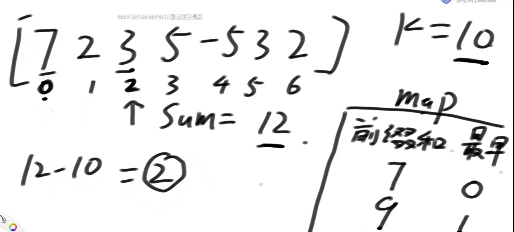
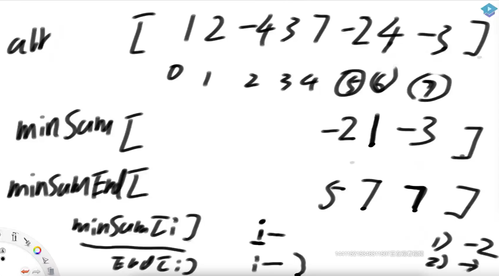
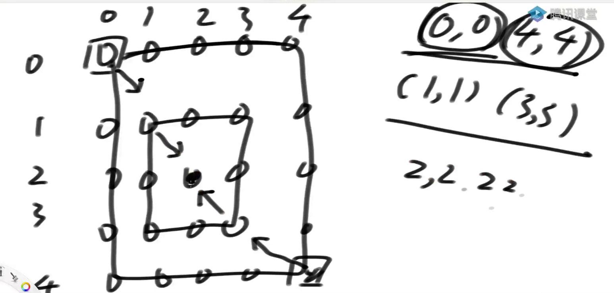
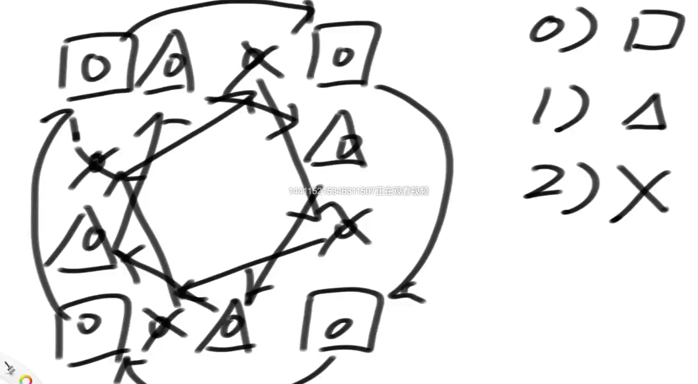
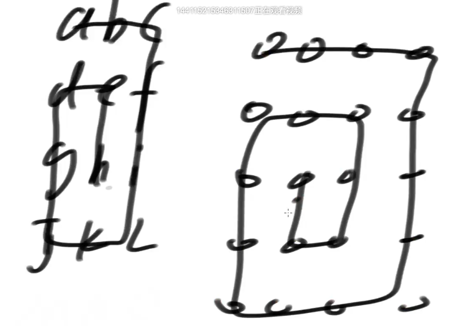
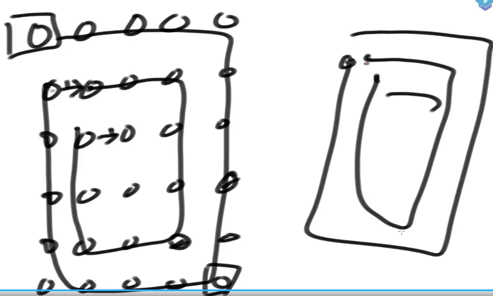
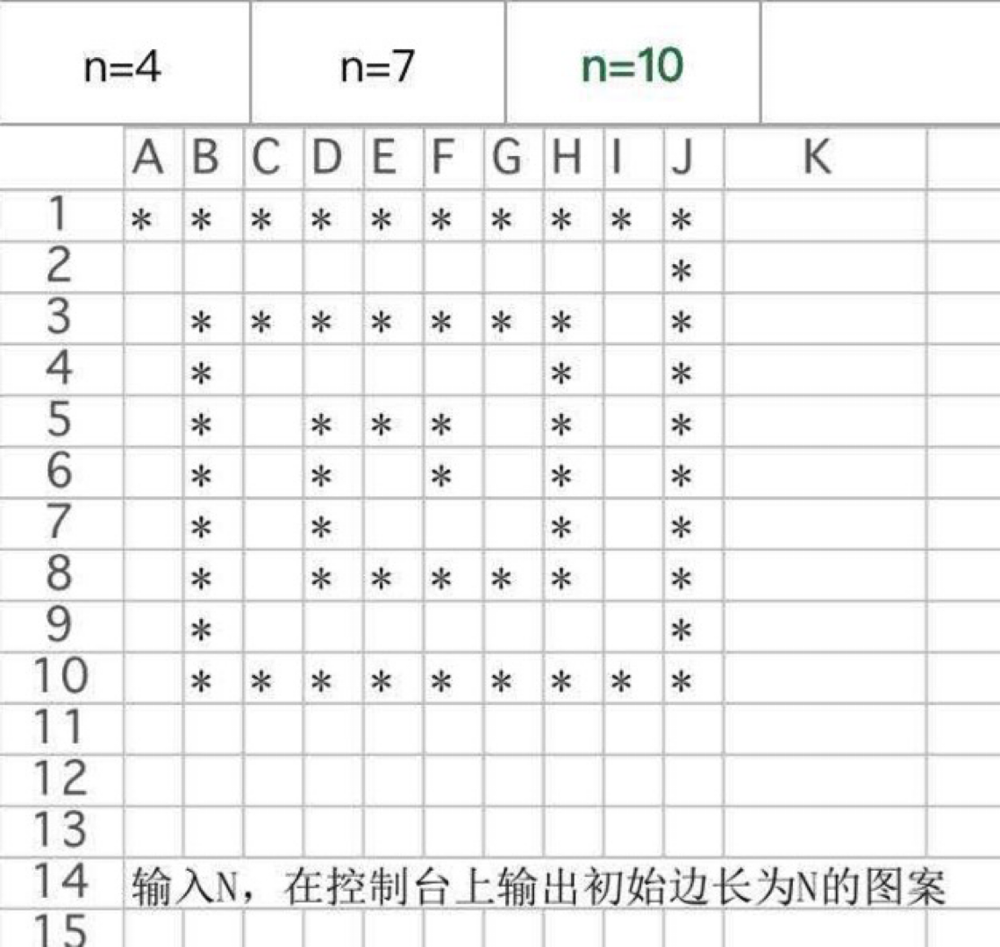

# 数组问题

## 题目一

给定一个**正整数**组成的无序数组arr，给定一个正整数值K

找到arr的所有子数组里，哪个子数组的累加和等于K，并且是长度最大的

返回其长度

```java
public static int getMaxLength(int[] arr, int K) {
   if (arr == null || arr.length == 0 || K <= 0) {
      return 0;
   }
   int left = 0;
   int right = 0;
   int sum = arr[0];
   int len = 0;
   while (right < arr.length) {
      if (sum == K) {
         len = Math.max(len, right - left + 1);
         // 此处是正数数组可以l++，因为没有0让答案更长
         sum -= arr[left++];
      } else if (sum < K) {
         right++;
         if (right == arr.length) {
            break;
         }
         sum += arr[right];
      } else {
         sum -= arr[left++];
      }
   }
   return len;
}
```


## 题目二

给定一个整数组成的无序数组arr，**值可能正、可能负、可能0**

给定一个整数值K

找到arr的所有子数组里，哪个子数组的累加和等于K，并且是长度最大的

返回其长度

---

找到以当前位置为结尾，往左到多远能满足k，sum - k 的值去map（记录最早满足条件的位置）中寻找




0 -1这条记录要提前放入map中

```java
public static int maxLength(int[] arr, int k) {
   if (arr == null || arr.length == 0) {
      return 0;
   }
   // key:前缀和
   // value : 0~value这个前缀和是最早出现key这个值的
   HashMap<Integer, Integer> map = new HashMap<Integer, Integer>();
  
   map.put(0, -1); // important
  
   int len = 0;
   int sum = 0;
   for (int i = 0; i < arr.length; i++) {
      sum += arr[i];
      if (map.containsKey(sum - k)) {
         len = Math.max(i - map.get(sum - k), len);
      }
      if (!map.containsKey(sum)) {
         map.put(sum, i);
      }
   }
   return len;
}
```


## 题目三

给定一个整数组成的无序数组arr，值可能正、可能负、可能0

给定一个整数值K

找到arr的所有子数组里，哪个子数组的累加和<=K，并且是长度最大的

返回其长度



从右往左遍历

minsum[i] 表示必须以i为开头的最小sum是多少

minsumend[i] 表示取得minsum[i] 的右边界在哪里

```java
public static int maxLengthAwesome(int[] arr, int k) {
   if (arr == null || arr.length == 0) {
      return 0;
   }
   int[] minSums = new int[arr.length];
   int[] minSumEnds = new int[arr.length];
   minSums[arr.length - 1] = arr[arr.length - 1];
   minSumEnds[arr.length - 1] = arr.length - 1;
   for (int i = arr.length - 2; i >= 0; i--) {
      if (minSums[i + 1] < 0) {
         minSums[i] = arr[i] + minSums[i + 1];
         minSumEnds[i] = minSumEnds[i + 1];
      } else {
         minSums[i] = arr[i];
         minSumEnds[i] = i;
      }
   }
   // 迟迟扩不进来那一块儿的开头位置
   int end = 0;
   int sum = 0;
   int ans = 0;
   for (int i = 0; i < arr.length; i++) {
      // while循环结束之后：
      // 1) 如果以i开头的情况下，累加和<=k的最长子数组是arr[i..end-1]，看看这个子数组长度能不能更新res；
      // 2) 如果以i开头的情况下，累加和<=k的最长子数组比arr[i..end-1]短，更新还是不更新res都不会影响最终结果；
      while (end < arr.length && sum + minSums[end] <= k) {
         sum += minSums[end];
         end = minSumEnds[end] + 1;
      }
      ans = Math.max(ans, end - i);
      if (end > i) { // 还有窗口，哪怕窗口没有数字 [i~end) [4,4)
         sum -= arr[i];
      } else { // i == end,  即将 i++, i > end, 此时窗口概念维持不住了，所以end跟着i一起走
         end = i + 1;
      }
   }
   return ans;
}
```


## 题目四

给定一个数组arr，给定一个值v

求子数组平均值小于等于v的最长子数组长度

---

构造新数组，所有值都减v，就是求所有平均值小于等于0，就是累加和小于等于0


## 总结

题目一主要技巧：利用单调性优化

题目二主要技巧：利用预处理结构优化 + 讨论开头结尾

题目三主要技巧：假设答案法+淘汰可能性（很难，以后还会见到）

## 题目五

给定一个**正方形**矩阵matrix，原地调整成顺时针90度转动的样子


a b c   g d a

d e f   h e  b

g h i    i   f  c

---



把每个圈里面的转好



n*n的框 n - 1 组

n = d - b

```java
public static void rotate(int[][] matrix) {
   int a = 0;
   int b = 0;
   int c = matrix.length - 1;
   int d = matrix[0].length - 1;
   while (a < c) {
      rotateEdge(matrix, a++, b++, c--, d--);
   }
}

public static void rotateEdge(int[][] m, int a, int b, int c, int d) {
   int tmp = 0;
   for (int i = 0; i < d - b; i++) {
      // 正方形只有每个组只有四个点
      tmp = m[a][b + i];
      m[a][b + i] = m[c - i][b];
      m[c - i][b] = m[c][d - i];
      m[c][d - i] = m[a + i][d];
      m[a + i][d] = tmp;
   }
}

public static void printMatrix(int[][] matrix) {
   for (int i = 0; i != matrix.length; i++) {
      for (int j = 0; j != matrix[0].length; j++) {
         System.out.print(matrix[i][j] + " ");
      }
      System.out.println();
   }
}
```

## 题目六

给定一个长方形矩阵matrix，实现转圈打印

a b c  d

e f  g h

i  j  k  L

打印顺序：a b c d h L k j I e f g

---



 

只需要考虑每一个框怎么打印，会自动接上

```java
public static void spiralOrderPrint(int[][] matrix) {
   int tR = 0;
   int tC = 0;
   int dR = matrix.length - 1;
   int dC = matrix[0].length - 1;
   while (tR <= dR && tC <= dC) {
      printEdge(matrix, tR++, tC++, dR--, dC--);
   }
}

public static void printEdge(int[][] m, int tR, int tC, int dR, int dC) {
   if (tR == dR) {
      for (int i = tC; i <= dC; i++) {
         System.out.print(m[tR][i] + " ");
      }
   } else if (tC == dC) {
      for (int i = tR; i <= dR; i++) {
         System.out.print(m[i][tC] + " ");
      }
   } else {
      int curC = tC;
      int curR = tR;
      while (curC != dC) {
         System.out.print(m[tR][curC] + " ");
         curC++;
      }
      while (curR != dR) {
         System.out.print(m[curR][dC] + " ");
         curR++;
      }
      while (curC != tC) {
         System.out.print(m[dR][curC] + " ");
         curC--;
      }
      while (curR != tR) {
         System.out.print(m[curR][tC] + " ");
         curR--;
      }
   }
}
```

## 题目七

给定一个正方形或者长方形矩阵matrix，实现zigzag打印

0 1 2

3 4 5

6 7 8

打印: 0 1 3 6 4 2 5 7 8

```java
public static void printMatrixZigZag(int[][] matrix) {
   int tR = 0;
   int tC = 0;
   int dR = 0;
   int dC = 0;
   int endR = matrix.length - 1;
   int endC = matrix[0].length - 1;
   boolean fromUp = false;
   while (tR != endR + 1) {
      printLevel(matrix, tR, tC, dR, dC, fromUp);
      tR = tC == endC ? tR + 1 : tR;
      tC = tC == endC ? tC : tC + 1;
      dC = dR == endR ? dC + 1 : dC;
      dR = dR == endR ? dR : dR + 1;
      fromUp = !fromUp;
   }
   System.out.println();
}

public static void printLevel(int[][] m, int tR, int tC, int dR, int dC, boolean f) {
   if (f) {
      while (tR != dR + 1) {
         System.out.print(m[tR++][tC--] + " ");
      }
   } else {
      while (dR != tR - 1) {
         System.out.print(m[dR--][dC++] + " ");
      }
   }
}
```


## 题目八



```java
public static void printStar(int N) {
   int leftUp = 0;
   int rightDown = N - 1;
   char[][] m = new char[N][N];
   for (int i = 0; i < N; i++) {
      for (int j = 0; j < N; j++) {
         m[i][j] = ' ';
      }
   }
   while (leftUp <= rightDown) {
      set(m, leftUp, rightDown);
      leftUp += 2;
      rightDown -= 2;
   }
   for (int i = 0; i < N; i++) {
      for (int j = 0; j < N; j++) {
         System.out.print(m[i][j] + " ");
      }
      System.out.println();
   }
}

public static void set(char[][] m, int leftUp, int rightDown) {
   for (int col = leftUp; col <= rightDown; col++) {
      m[leftUp][col] = '*';
   }
   for (int row = leftUp + 1; row <= rightDown; row++) {
      m[row][rightDown] = '*';
   }
   for (int col = rightDown - 1; col > leftUp; col--) {
      m[rightDown][col] = '*';
   }
   for (int row = rightDown - 1; row > leftUp + 1; row--) {
      m[row][leftUp + 1] = '*';
   }
}
```