# 暴力递归->动态规划

## 暴力递归

暴力递归就是尝试

1. 把问题转化为规模缩小了的同类的子问题
2. 有明确的不需要继续进行递归的条件
3. 有当得到了子问题的结果后的决策过程
4. 不记录每一个子问题的解

### 汉诺塔问题

​	如下图所示，从左到右有A、B、C三根柱子，其中A柱子上面有从小叠到大的n个圆盘，现要求将A柱子上的圆盘移到C柱子上去，期间只有一个原则：一次只能移到一个盘子且大盘子不能在小盘子上面，求移动的步骤和移动的次数

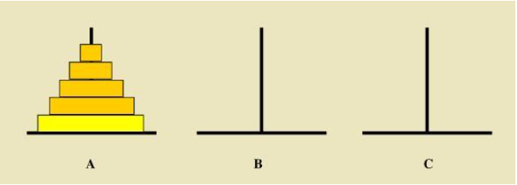

```java 
// 1~i 圆盘 目标是from -> to， other是另外一个
public static void func(int N, String from, String to, String other) {
   if (N == 1) { // base
      System.out.println("Move 1 from " + from + " to " + to);
   } else {
      func(N - 1, from, other, to);
      System.out.println("Move " + N + " from " + from + " to " + to);
      func(N - 1, other, to, from);
   }
}
```

### 打印一个字符串的全部子序列

必须从前往后拿

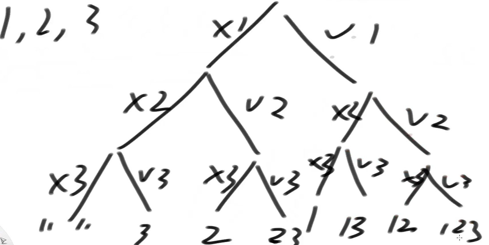

```java
public static List<String> subs(String s) {
   char[] str = s.toCharArray();
   String path = "";
   List<String> ans = new ArrayList<>();
   process1(str, 0, ans, path);
   return ans;
}

// str固定，不变
// index此时来到的位置, 要  or 不要
// 如果index来到了str中的终止位置，把沿途路径所形成的答案，放入ans中
// 之前做出的选择，就是path
public static void process1(char[] str, int index, List<String> ans, String path) {
   if (index == str.length) {
      ans.add(path);
      return;
   }
   // 没要index
   String no = path;
   process1(str, index + 1, ans, no);
   // 要了index
   String yes = path + String.valueOf(str[index]);
   process1(str, index + 1, ans, yes);
}


// 打印不出现重复值的子序列，使用set去重，比如输入acccc
public static List<String> subsNoRepeat(String s) {
   char[] str = s.toCharArray();
   String path = "";
   HashSet<String> set = new HashSet<>();// 过滤
   process2(str, 0, set, path);
   List<String> ans = new ArrayList<>();
   for (String cur : set) {
      ans.add(cur);
   }
   return ans;
}

// str  index  set
public static void process2(char[] str, int index,
      HashSet<String> set, String path) {
   if (index == str.length) {
      set.add(path);
      return;
   }
   String no = path;
   process2(str, index + 1, set, no);
   String yes = path + String.valueOf(str[index]);
   process2(str, index + 1, set, yes);
}

public static void main(String[] args) {
   String test = "aacc";
   List<String> ans1 = subs(test);
   List<String> ans2 = subsNoRepeat(test);

   for (String str : ans1) {
      System.out.println(str);
   }
   System.out.println("=================");
   for (String str : ans2) {
      System.out.println(str);
   }
   System.out.println("=================");

}
```

### 打印字符串全排列

```java
public static ArrayList<String> permutation(String str) {
   ArrayList<String> res = new ArrayList<>();
   if (str == null || str.length() == 0) {
      return res;
   }
   char[] chs = str.toCharArray();
   process(chs, 0, res);
   return res;
}

// str[0..i-1]已经做好决定的
// str[i...]都有机会来到i位置
// i终止位置，str当前的样子，就是一种结果 -> ans
public static void process(char[] str, int i, ArrayList<String> ans) {
   if (i == str.length) {
      ans.add(String.valueOf(str));
   }
   // 如果i没有终止，i...  都可以来到i位置
   for (int j = i; j < str.length; j++) { // j  i后面所有的字符都有机会
      swap(str, i, j);
      process(str, i + 1, ans);
      swap(str, i, j); // 恢复现场
   }
}


 // 打印去重排列accc
 public static ArrayList<String> permutationNoRepeat(String str) {
		ArrayList<String> res = new ArrayList<>();
		if (str == null || str.length() == 0) {
			return res;
		}
		char[] chs = str.toCharArray();
		process2(chs, 0, res);
		return res;
	}

	// str[0..i-1]已经做好决定的
	// str[i...]都有机会来到i位置
	// i终止位置，str当前的样子，就是一种结果 -> ans
	public static void process2(char[] str, int i, ArrayList<String> res) {
		if (i == str.length) {
			res.add(String.valueOf(str));
			return;
		}
		boolean[] visit = new boolean[26]; // visit[0 1 .. 25] 剪枝 
		for (int j = i; j < str.length; j++) {
			// str[j] = 'a'   -> 0   visit[0] -> 'a'
			
			// str[j] = 'z'   -> 25   visit[25] -> 'z'
			if (!visit[str[j] - 'a']) {
				
				visit[str[j] - 'a'] = true;
				swap(str, i, j);
				process2(str, i + 1, res);
				swap(str, i, j);
				
			}
		}
	}

	public static void swap(char[] chs, int i, int j) {
		char tmp = chs[i];
		chs[i] = chs[j];
		chs[j] = tmp;
	}
```

### 逆序栈

不申请额外的数据结构，只使用递归

```java
public static void reverse(Stack<Integer> stack) {
   if (stack.isEmpty()) {
      return;
   }
   int i = f(stack);
   reverse(stack);
   stack.push(i);
}

// 移除栈底元素，上面的元素盖下来，返回移除元素
public static int f(Stack<Integer> stack) {
   int result = stack.pop();
   if (stack.isEmpty()) {
      return result;
   } else {
      int last = f(stack);
      stack.push(result);
      return last;
   }
}
```

## 动态规划

用空间换时间，计算过的存起来，下次再遇到直接取出，不要再重复计算（缓存），O（n）和顺序计算一样

如果所有子问题都是不同的，动态规划无法优化


### 机器人走路


假设有排成一行的N个位置，记为1~N，N 一定大于或等于 2

开始时机器人在其中的M位置上(M 一定是 1~N 中的一个)

如果机器人来到1位置，那么下一步只能往右来到2位置；

如果机器人来到N位置，那么下一步只能往左来到 N-1 位置；

如果机器人来到中间位置，那么下一步可以往左走或者往右走；

规定机器人必须走 K 步，最终能来到P位置(P也是1~N中的一个)的方法有多少种

给定四个参数 N、M、K、P，返回方法数。 

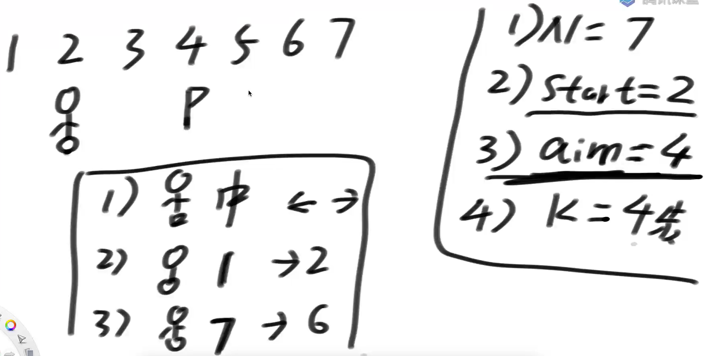

可能的方法

2->3->4->5->4

2->1->2->3->4

2->3->2->3->4

问一共有多少种方法作为返回值

```java
public static int ways1(int N, int M, int K, int P) {
   // 参数无效直接返回0
   if (N < 2 || K < 1 || M < 1 || M > N || P < 1 || P > N) {
      return 0;
   }
   // 总共N个位置，从M点出发，还剩K步，返回最终能达到P的方法数
   return walk(N, M, K, P);
}

// N : 位置为1 ~ N，固定参数
// cur : 当前在cur位置，可变参数
// rest : 还剩res步没有走，可变参数
// P : 最终目标位置是P，固定参数
// 该函数的含义：只能在1~N这些位置上移动，当前在cur位置，走完rest步之后，停在P位置的方法数作为返回值返回
public static int walk(int N, int cur, int rest, int P) {
   // 如果没有剩余步数了，当前的cur位置就是最后的位置
   // 如果最后的位置停在P上，那么之前做的移动是有效的
   // 如果最后的位置没在P上，那么之前做的移动是无效的
   if (rest == 0) {
      return cur == P ? 1 : 0;
   }
   // 如果还有rest步要走，而当前的cur位置在1位置上，那么当前这步只能从1走向2
   // 后续的过程就是，来到2位置上，还剩rest-1步要走
   if (cur == 1) {
      return walk(N, 2, rest - 1, P);
   }
   // 如果还有rest步要走，而当前的cur位置在N位置上，那么当前这步只能从N走向N-1
   // 后续的过程就是，来到N-1位置上，还剩rest-1步要走
   if (cur == N) {
      return walk(N, N - 1, rest - 1, P);
   }
   // 如果还有rest步要走，而当前的cur位置在中间位置上，那么当前这步可以走向左，也可以走向右
   // 走向左之后，后续的过程就是，来到cur-1位置上，还剩rest-1步要走
   // 走向右之后，后续的过程就是，来到cur+1位置上，还剩rest-1步要走
   // 走向左、走向右是截然不同的方法，所以总方法数要都算上
   return walk(N, cur + 1, rest - 1, P) + walk(N, cur - 1, rest - 1, P);
}
```

傻缓存法

```java
public static int waysCache(int N, int M, int K, int P) {
   // 参数无效直接返回0
   if (N < 2 || K < 1 || M < 1 || M > N || P < 1 || P > N) {
      return 0;
   }
   
   int[][] dp = new int[N+1][K+1];
   // -1代表没有计算过
   for(int row = 0; row <= N; row++) {
      for(int col = 0; col <= K; col++) {
         dp[row][col] = -1;
      }
   }
   return walkCache(N, M, K, P,dp);
}

// HashMap<String, Integer>   (19,100)  "19_100"
// 我想把所有cur和rest的组合，返回的结果，加入到缓存里
public static int walkCache(int N, int cur, int rest, int P, int[][] dp) {
   if(dp[cur][rest] != -1) {
      return dp[cur][rest];
   }
   if (rest == 0) {
      dp[cur][rest] = cur == P ? 1 : 0;
      return dp[cur][rest];
   }
   if (cur == 1) {
      dp[cur][rest] = walkCache(N, 2, rest - 1, P, dp);
      return dp[cur][rest];
   }
   if (cur == N) {
      dp[cur][rest] =walkCache(N, N - 1, rest - 1, P,dp);
      return dp[cur][rest];
   }
   dp[cur][rest] = walkCache(N, cur + 1, rest - 1, P,dp) 
         + walkCache(N, cur - 1, rest - 1, P, dp);
   return dp[cur][rest];
}
```


```java
public static int ways2(int N, int M, int K, int P) {
   // 参数无效直接返回0
   if (N < 2 || K < 1 || M < 1 || M > N || P < 1 || P > N) {
      return 0;
   }
   int[][] dp = new int[K + 1][N + 1];
   dp[0][P] = 1; // 第0列为1，其余都是0
   for (int i = 1; i <= K; i++) {
      for (int j = 1; j <= N; j++) {
         if (j == 1) {
            dp[i][j] = dp[i - 1][2]; // 第一行依赖↙
         } else if (j == N) {
            dp[i][j] = dp[i - 1][N - 1]; // 最后一行依赖↖
         } else {
            dp[i][j] = dp[i - 1][j - 1] + dp[i - 1][j + 1]; // 其他位置依赖↖+↙
         }
      }
   }
   return dp[K][M];
}
```


```java
public static int ways3(int N, int M, int K, int P) {
   // 参数无效直接返回0
   if (N < 2 || K < 1 || M < 1 || M > N || P < 1 || P > N) {
      return 0;
   }
   int[] dp = new int[N + 1];
   dp[P] = 1; // 第P列
   for (int i = 1; i <= K; i++) {
      int leftUp = dp[1];// 左上角的值
      for (int j = 1; j <= N; j++) {
         int tmp = dp[j];
         if (j == 1) {
            dp[j] = dp[j + 1];
         } else if (j == N) {
            dp[j] = leftUp;
         } else {
            dp[j] = leftUp + dp[j + 1];
         }
         leftUp = tmp;
      }
   }
   return dp[M];
}
```


### 拿纸牌

给定一个整型数组arr，代表数值不同的纸牌排成一条线

玩家A和玩家B依次拿走每张纸牌

规定玩家A先拿，玩家B后拿

但是每个玩家每次只能拿走最左或最右的纸牌

玩家A和玩家B都绝顶聪明

请返回最后获胜者的分数。 

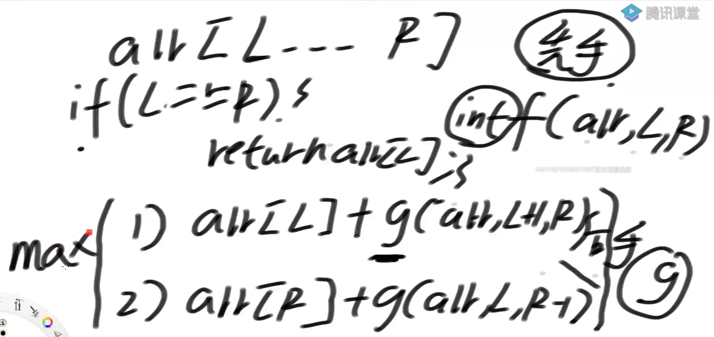

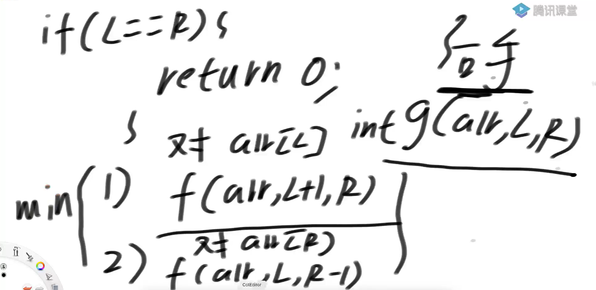

```java
public static int win1(int[] arr) {
   if (arr == null || arr.length == 0) {
      return 0;
   }
   return Math.max(f(arr, 0, arr.length - 1), s(arr, 0, arr.length - 1));
}

public static int f(int[] arr, int L, int R) {
   if (L == R) {
      return arr[L];
   }
   return Math.max(arr[L] + s(arr, L + 1, R), arr[R] + s(arr, L, R - 1));
}

public static int s(int[] arr, int L, int R) {
   if (L == R) {
      return 0;
   }
   return Math.min(f(arr, L + 1, R), f(arr, L, R - 1));// 对手拿走L位置和对手拿走R位置的最小值，因为是后手
}

// 优化
public static int windp(int[] arr) {
   if (arr == null || arr.length == 0) {
      return 0;
   }
   int N = arr.length;
   int[][] f = new int[N][N]; // f缓存表
   int[][] s = new int[N][N];// s缓存表
   for (int i = 0; i < N; i++) {
      f[i][i] = arr[i]; // 设置f对角线的值
   }
   // 0,0 右下方移动
   // 0,1
   // 0,2
   // 0,N-1
   for (int col = 1; col < N; col++) {
      // 对角线出发位置(0,col)
      int L = 0;
      int R = col;
      while (L < N && R < N) {
         f[L][R] = Math.max(arr[L] + s[L + 1][R], arr[R] + s[L][R - 1]);
         s[L][R] = Math.min(f[L + 1][R], f[L][R - 1]);
         L++;
         R++;
      }
   }
   return Math.max(f[0][N - 1], s[0][N - 1]);
}
```

f表中普遍位置的依赖三角形

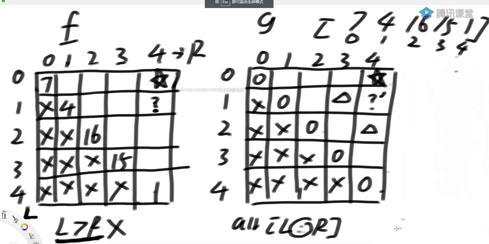

g表中普遍位置的依赖三角形

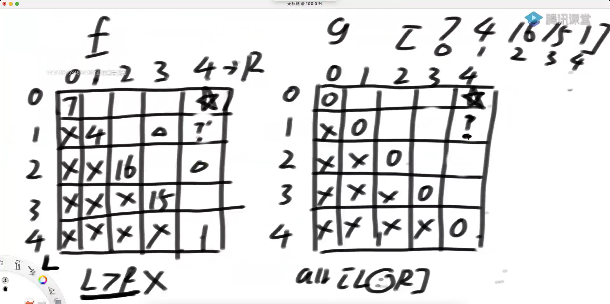

### 背包问题

货物重量数组w[]，价值数组v[]，bag是背包容量，返回不超重情况下的最大价值

```java
        public static int maxValue(int[] w, int[] v, int bag) {
           return process(w, v, 0, bag); // index从0号货物开始
        }

	// 只剩下rest的空间了，剩余容量
	// index...后面的货物自由选择，但是不要超过rest的空间
	// 返回能够获得的最大价值
	public static int process(int[] w, int[] v, int index, int rest) {
		if (rest < 0) { // base case 1 重量为0还可以装
			return -1;
		}
		// rest >=0
		if (index == w.length) { // base case 2
			return 0;
		}
		// 不要当前货物，有货也有空间
		int p1 = process(w, v, index + 1, rest);
		int p2 = -1;
        	// 要当前货物
		int p2Next = process(w, v, index + 1, rest - w[index]);
		if(p2Next!=-1) {
			p2 = v[index] + p2Next;
		}
		return Math.max(p1, p2);
	}

	// dp
	// index 0-N
	// rest 负数-bag
	public static int dpWay(int[] w, int[] v, int bag) {
		int N = w.length;
		int[][] dp = new int[N + 1][bag + 1];
		// dp[N][...] = 0
		for (int index = N - 1; index >= 0; index--) {
			for (int rest = 0; rest <= bag; rest++) { // rest < 0
				int p1 = dp[index+1][rest];
				int p2 = -1;
				if(rest - w[index] >= 0) {
					p2 = v[index] + dp[index + 1][rest - w[index]];
				}
				dp[index][rest] = Math.max(p1, p2);
			}
		}
		return dp[0][bag];
	}
```

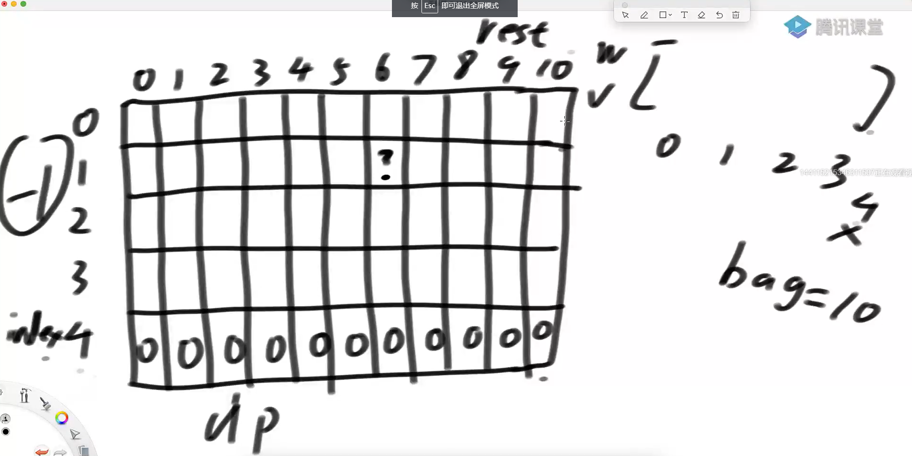

4是越界返回价值0，任意位置总是依赖index+1也就是下方的格子

从下行往上填，左下或右下都可以开始

### 转换字符串

规定1和A对应、2和B对应、3和C对应...26和Z对应

那么一个数字字符串比如"111”就可以转化为:

"AAA"、"KA"和"AK"

给定一个只有数字字符组成的字符串str，返回有多少种转化结果 

```java
public static int number(String str) {
   if (str == null || str.length() == 0) {
      return 0;
   }
   return process(str.toCharArray(), 0);
}

// str[0...i-1]已经转化完了，固定了
// i之前的位置，如何转化已经做过决定了, 不用再关心
// i... 有多少种转化的结果
public static int process(char[] str, int i) {
   if (i == str.length) { // base case
      return 1; // 终止位置计数一次，生成一种结果
   }
   if (str[i] == '0') {
      return 0; // 1-26 对应 A-Z没有0
   }
   if (str[i] == '1') {
      int res = process(str, i + 1);
      if (i + 1 < str.length) {
         res += process(str, i + 2);
      }
      return res;
   }
   if (str[i] == '2') {
      int res = process(str, i + 1);
      if (i + 1 < str.length && (str[i + 1] >= '0' && str[i + 1] <= '6')) {
         res += process(str, i + 2); // (i和i+1)作为单独的部分，后续有多少种方法
      }
      return res;
   }
   return process(str, i + 1);
}

public static int dpWays2(String s) {
   if (s == null || s.length() == 0) {
      return 0;
   }
   char[] str = s.toCharArray();
   int N = str.length;
   int[] dp = new int[N+1];
   dp[N] = 1;
   for(int i = N-1; i >= 0; i--) {
      if (str[i] == '0') {
         dp[i] = 0;
      }
      if (str[i] == '1') {
         dp[i] = dp[i + 1];
         if (i + 1 < str.length) {
            dp[i] += dp[i + 2];
         }
      }
      if (str[i] == '2') {
         dp[i] = dp[i + 1];
         if (i + 1 < str.length && (str[i + 1] >= '0' && str[i + 1] <= '6')) {
            dp[i] += dp[i + 2]; // (i和i+1)作为单独的部分，后续有多少种方法
         }
      }
   }
   return dp[0];
}


public static int dpWays(String s) {
   if (s == null || s.length() == 0) {
      return 0;
   }
   char[] str = s.toCharArray();
   int N = str.length;
   int[] dp = new int[N + 1];
   dp[N] = 1;
   for (int i = N - 1; i >= 0; i--) {
      if (str[i] == '0') {
         dp[i] = 0;
      } else if (str[i] == '1') {
         dp[i] = dp[i + 1];
         if (i + 1 < N) {
            dp[i] += dp[i + 2];
         }
      } else if (str[i] == '2') {
         dp[i] = dp[i + 1]; 
         if (i + 1 < str.length && (str[i + 1] >= '0' && str[i + 1] <= '6')) {
            dp[i] += dp[i + 2];
         }
      } else {
         dp[i] = dp[i + 1];
      }
   }
   return dp[0];
}
```

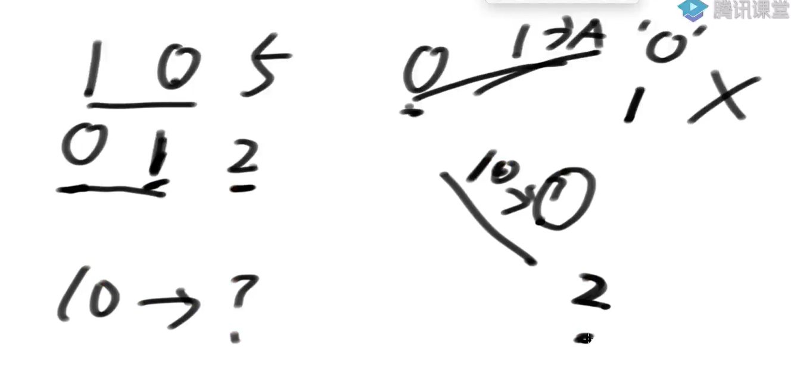

i位置如果面对0字符说明，之前的决定做错了，返回0，比如305就没有办法转换

### 贴纸拼词

给定一个字符串str，给定一个字符串类型的数组arr，出现的字符都是小写英文

arr每一个字符串，代表一张贴纸，你可以把单个字符剪开使用，目的是拼出str来

返回需要至少多少张贴纸可以完成这个任务。

每张贴纸可以剪的很碎最小一个字母，且每种贴纸数量无限，且剪完可以随意移动

例子：str= "babac"，arr = {"ba","c","abcd"}

ba + ba + c 3 abcd + abcd 2 abcd+ba 2

所以返回最小值2

```java
    // 暴力递归
    public static int minStickers(String[] stickers, String target) {
        int ans = process(stickers, target);
        return ans == Integer.MAX_VALUE ? -1 : ans;
    }

    public static int process(String[] stickers, String target) {
        if (target.length() == 0) {
            return 0;
        }
        int min = Integer.MIN_VALUE;
        for (String first : stickers) {
            String rest = minus(target, first);
            // 减去当前贴纸没有减少任何字符
            if (rest.length() != target.length()) {
                min = Math.min(min, process(stickers, rest));
            }
        }
        // +1算上第一章，无效返回最大值
        return min + (min == Integer.MIN_VALUE ? 0 : 1);
    }

    private static String minus(String s1, String s2) {
        char[] str1 = s1.toCharArray();
        char[] str2 = s2.toCharArray();
        int[] count = new int[26];
        for (char cha : str1) {
            count[cha - 'a']++;
        }
        for (char cha : str2) {
            count[cha - 'a']--;
        }
        StringBuilder builder = new StringBuilder();
        for (int i = 0; i < 26; i++) {
            if (count[i] > 0) {
                for (int j = 0; j < count[i]; j++) {
                    builder.append((char) (i + '1'));
                }
            }
        }
        return  builder.toString();
    }

  // 小优化
    public static int minStickers3(String[] stickers, String target) {

        int N = stickers.length;
        // 关键优化用词频表代替贴纸数组
        int[][] counts = new int[N][26];
        for (int i = 0; i < N; i++) {
            char[] str = stickers[i].toCharArray();
            for (char cha : str) {
                counts[i][cha - 'a']++;
            }
        }
        int ans = process3(counts, target);
        return ans == Integer.MAX_VALUE ? -1 : ans;
    }

    public static int process3(int[][] stickers, String t) {
        if (t.length() == 0) {
            return 0;
        }
        // 目标target做词频统计
        // tcounts aabbc 2 2 1
        //               0 1 2
        char[] target = t.toCharArray();
        int[] tcounts = new int[26];
        for (char cha : target) {
            tcounts[cha - 'a']++;
        }
        int N = stickers.length;
        int min = Integer.MIN_VALUE;

        for (int i = 0; i < N; i++) {
            // 第一张贴纸
            int[] sticker = stickers[i];
            // 优化的关键步骤剪枝！贪心
            if (sticker[target[0] - 'a'] > 0){
                StringBuilder builder = new StringBuilder();
                for (int j = 0; j < 26; j++) {
                    if (tcounts[j] > 0){
                        // sticker是二维数组的词频，tcounts是目标数组的词频
                        int nums = tcounts[j] - sticker[j];
                        for (int k = 0; k < nums; k++) {
                            builder.append((char) (j + 'a'));
                        }
                    }
                }
                String rest = builder.toString();
                min = Math.min(min, process3(stickers, rest));
            }
        }
        
        

        // +1算上第一章，无效返回最大值
        return min + (min == Integer.MIN_VALUE ? 0 : 1);
    }


```

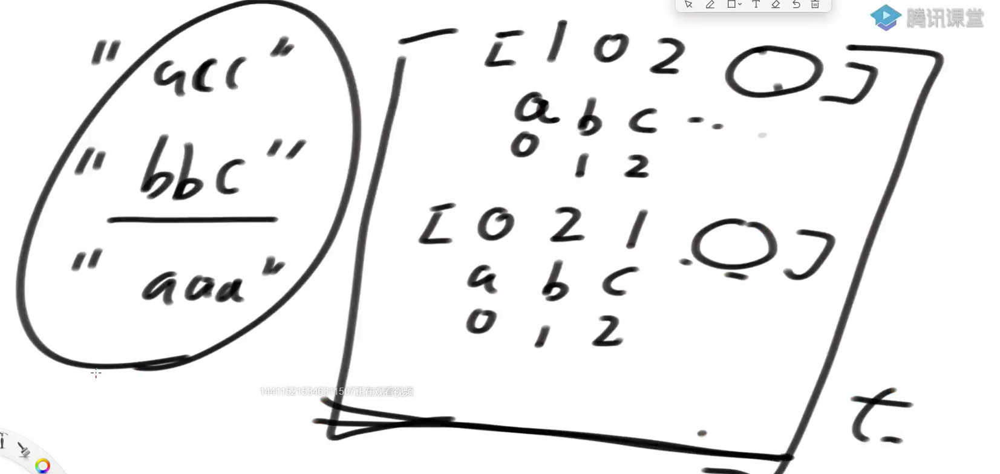

二位数组表示所有贴纸

---

改动态规划

```java
public static int minStickers1(String[] stickers, String target) {
   
   
   int n = stickers.length;
   
   int[][] map = new int[n][26];// stickers -> [26] [26] [26]
   for (int i = 0; i < n; i++) {
      char[] str = stickers[i].toCharArray();
      for (char c : str) {
         map[i][c - 'a']++; // 词频统计
      }
   }
   HashMap<String, Integer> dp = new HashMap<>();
   dp.put("", 0);
   return process1(dp, map, target);
}

// dp 傻缓存，如果t已经算过了，直接返回dp中的值
// t 剩余的目标
// 0..N每一个字符串所含字符的词频统计
// 返回值是-1，map 中的贴纸  怎么都无法rest
public static int process1(HashMap<String, Integer> dp,int[][] map, String rest) {
   if (dp.containsKey(rest)) {
      return dp.get(rest);
   }
   // 以下就是正式的递归调用过程
   int ans = Integer.MAX_VALUE; // ans -> 搞定rest，使用的最少的贴纸数量 
   int n = map.length; // N种贴纸
   int[] tmap = new int[26]; // tmap 去替代 rest
   char[] target = rest.toCharArray();
   for (char c : target) {
      tmap[c - 'a']++;
   }
   for (int i = 0; i < n; i++) {
      // 枚举当前第一张贴纸是谁？
      if (map[i][target[0] - 'a'] == 0) {
         continue;
      }
      StringBuilder sb = new StringBuilder();
      // i 贴纸， j 枚举a~z字符
      for (int j = 0; j < 26; j++) { // 
         if (tmap[j] > 0) { // j这个字符是target需要的
            for (int k = 0; k < Math.max(0, tmap[j] - map[i][j]); k++) {
               sb.append((char) ('a' + j));
            }
         }
      }
      // sb ->  i
      String s = sb.toString();
      int tmp = process1(dp, map, s);
      if (tmp != -1) {
         ans = Math.min(ans, 1 + tmp);
      }
   }
   // ans 系统最大  rest
   dp.put(rest, ans == Integer.MAX_VALUE ? -1 : ans);
   return dp.get(rest);
}


// 了解
public static int minStickers2(String[] stickers, String target) {
   int n = stickers.length;
   int[][] map = new int[n][26];
   for (int i = 0; i < n; i++) {
      char[] str = stickers[i].toCharArray();
      for (char c : str) {
         map[i][c - 'a']++;
      }
   }
   char[] str = target.toCharArray();
   int[] tmap = new int[26];
   for (char c : str) {
      tmap[c - 'a']++;
   }
   HashMap<String, Integer> dp = new HashMap<>();
   int ans = process2(map, 0, tmap, dp);
   return ans;
}

public static int process2(int[][] map, int i, int[] tmap, HashMap<String, Integer> dp) {
   StringBuilder keyBuilder = new StringBuilder();
   keyBuilder.append(i + "_");
   for (int asc = 0; asc < 26; asc++) {
      if (tmap[asc] != 0) {
         keyBuilder.append((char) (asc + 'a') + "_" + tmap[asc] + "_");
      }
   }
   String key = keyBuilder.toString();
   if (dp.containsKey(key)) {
      return dp.get(key);
   }
   boolean finish = true;
   for (int asc = 0; asc < 26; asc++) {
      if (tmap[asc] != 0) {
         finish = false;
         break;
      }
   }
   if (finish) {
      dp.put(key, 0);
      return 0;
   }
   if (i == map.length) {
      dp.put(key, -1);
      return -1;
   }
   int maxZhang = 0;
   for (int asc = 0; asc < 26; asc++) {
      if (map[i][asc] != 0 && tmap[asc] != 0) {
         maxZhang = Math.max(maxZhang, (tmap[asc] / map[i][asc]) + (tmap[asc] % map[i][asc] == 0 ? 0 : 1));
      }
   }
   int[] backup = Arrays.copyOf(tmap, tmap.length);
   int min = Integer.MAX_VALUE;
   int next = process2(map, i + 1, tmap, dp);
   tmap = Arrays.copyOf(backup, backup.length);
   if (next != -1) {
      min = next;
   }
   for (int zhang = 1; zhang <= maxZhang; zhang++) {
      for (int asc = 0; asc < 26; asc++) {
         tmap[asc] = Math.max(0, tmap[asc] - (map[i][asc] * zhang));
      }
      next = process2(map, i + 1, tmap, dp);
      tmap = Arrays.copyOf(backup, backup.length);
      if (next != -1) {
         min = Math.min(min, zhang + next);
      }
   }
   int ans = min == Integer.MAX_VALUE ? -1 : min;
   dp.put(key, ans);
   return ans;
}
```

### 最长公共子序列

给定两个字符串str1和str2，

返回这两个字符串的最长公共子序列长度


比如 ： str1 = “a12b3c456d”,str2 = “1ef23ghi4j56k”

最长公共子序列是“123456”，所以返回长度6

```java
// 暴力递归
public static int longestCommonSubsequence1(String s1, String s2) {
    if (s1 == null || s2 == null || s1.length() == 0 || s2.length() == 0) {
        return 0;
    }
    char[] str1 = s1.toCharArray();
    char[] str2 = s2.toCharArray();

    // 尝试
    return process1(str1, str2, str1.length - 1, str2.length - 1);
}

// str1[0..i]与str2[0...j]最长公共子序列多长,从右往左
// 返回
public static int process1(char[] str1, char[] str2, int i, int j) {

    if (i == 0 && j == 0) {
        return str1[i] == str2[j] ? 1 : 0;
    } else if (i == 0) {
        if (str1[i] == str2[j]) {
            return 1;
        } else {
            return process1(str1, str2, i, j - 1);
        }
    } else if (j == 0) {
        if (str1[i] == str2[j]) {
            return 1;
        } else {
            return process1(str1, str2, i - 1, j);
        }
    } else {
        // 不考虑i，可能考虑j
        int p1 = process1(str1, str2, i - 1, j);
        // 不考虑j，可能考虑i
        int p2 = process1(str1, str2, i, j - 1);
        // 必须以i，j结尾
        int p3 = str1[i] == str2[j] ? process1(str1, str2, i - 1, j - 1) + 1 : 0;
        return Math.max(p1, Math.max(p2, p3));

    }

}
```

```java
// 动态规划
public static int longestCommonSubsequence2(String s1, String s2) {
    if (s1 == null || s2 == null || s1.length() == 0 || s2.length() == 0) {
        return 0;
    }
    char[] str1 = s1.toCharArray();
    char[] str2 = s2.toCharArray();
    int N = str1.length;
    int M = str2.length;
    int[][] dp = new int[N][M];
    // 0,0
    dp[0][0] = str1[0] == str2[0] ? 1 : 0;
    // 第一行
    for (int j = 1; j < M; j++) {
        dp[0][j] = str1[0] == str2[j] ? 1 : dp[0][j - 1];
    }
    // 第一列
    for (int i = 1; i < N; i++) {
        dp[i][0] = str1[i] == str2[0] ? 1 : dp[i - 1][0];
    }
    // 普遍位置
    for (int i = 1; i < N; i++) {
        for (int j = 1; j < M; j++) {
            // 不考虑i，可能考虑j
            int p1 = dp[i - 1][j];
            // 不考虑j，可能考虑i
            int p2 = dp[i][j - 1];
            // 必须以i，j结尾
            int p3 = str1[i] == str2[j] ? dp[i - 1][j - 1] + 1 : 0;
            dp[i][j] = Math.max(p1, Math.max(p2, p3));
        }
    }

    // 尝试
    return dp[N - 1][M - 1];
}
```

### 最长回文子序列

子序列是不连续的 子串是连续的

给定一个字符串str，返回这个字符串的最长回文子序列长度

比如 ： str = “a12b3c43def2ghi1kpm”

最长回文子序列是“1234321”或者“123c321”，返回长度7

**思路1：字符串逆序与字符串的最长公共子序列就是最长回文子序列**

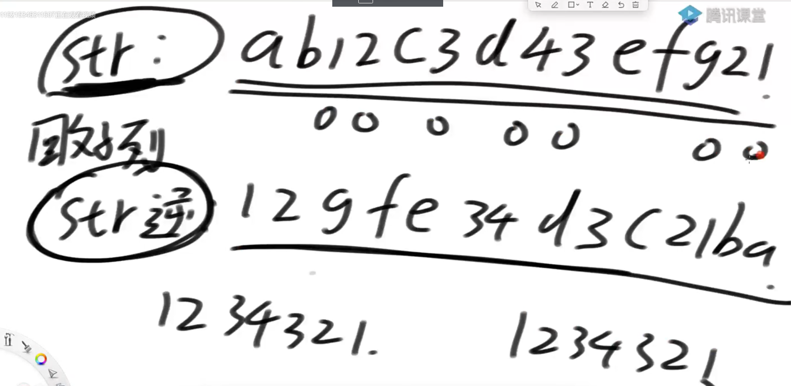

**思路2**

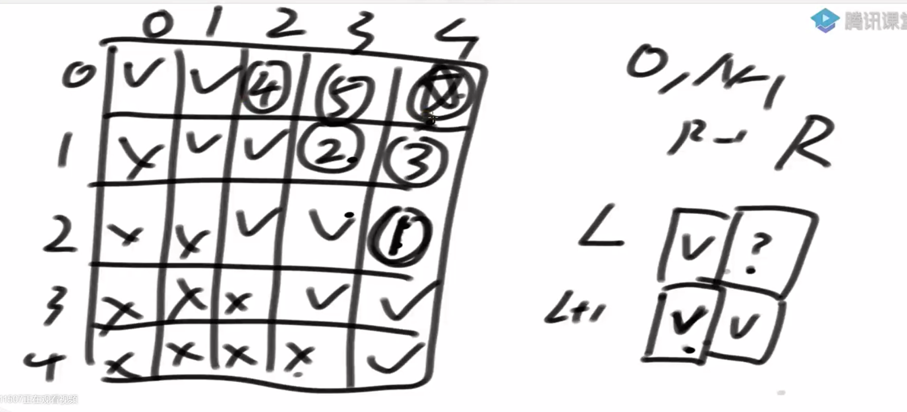

普遍位置，从底往上，从左往右

```java
public static int lpsl1(String s) {
   if (s == null || s.length() == 0) {
      return 0;
   }
   char[] str = s.toCharArray();
   return f(str, 0, str.length - 1);
}

// str[L..R]最长回文子序列长度返回
public static int f(char[] str, int L, int R) {
   if (L == R) {
      return 1;
   }
    // aa返回2 ab返回1
   if (L == R - 1) {
      return str[L] == str[R] ? 2 : 1;
   }
   // 普遍情况
   // 不以L开头且不以R结尾
   int p1 = f(str, L + 1, R - 1);
   // 以L开头不以R结尾
   int p2 = f(str, L, R - 1);
   // 不以L开头以R结尾
   int p3 = f(str, L + 1, R);
   // 以L开头且以R结尾
   int p4 = str[L] != str[R] ? 0 : (2 + f(str, L + 1, R - 1));
   return Math.max(Math.max(p1, p2), Math.max(p3, p4));
}

public static int lpsl2(String s) {
   if (s == null || s.length() == 0) {
      return 0;
   }
   char[] str = s.toCharArray();
   int N = str.length;
   int[][] dp = new int[N][N];
   // 右下角的格子 
   dp[N - 1][N - 1] = 1;
   for (int i = 0; i < N - 1; i++) {
      // 对角线 
      dp[i][i] = 1;
      // 对角线右边的格子
      dp[i][i + 1] = str[i] == str[i + 1] ? 2 : 1;
   }
   for (int L = N - 3; L >= 0; L--) {
      for (int R = L + 2; R < N; R++) {
         dp[L][R] = Math.max(dp[L][R - 1], dp[L + 1][R]);
         if (str[L] == str[R]) {
            dp[L][R] = Math.max(dp[L][R], 2 + dp[L + 1][R - 1]);
         }
      }
   }
   return dp[0][N - 1];
}


```

建立空间感，优化，左下一定小于左，左下一定小于下删掉

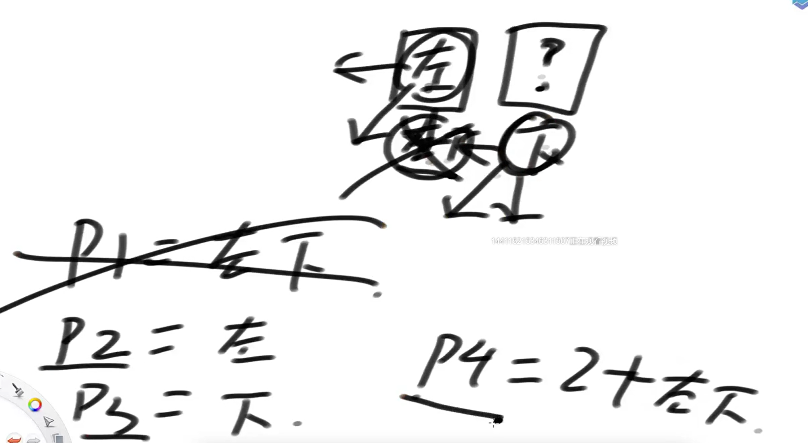

---

了解

```java
public static int longestPalindromeSubseq1(String s) {
   if (s == null || s.length() == 0) {
      return 0;
   }
   if (s.length() == 1) {
      return 1;
   }
   char[] str = s.toCharArray();
   char[] reverse = reverse(str);
   return longestCommonSubsequence(str, reverse);
}

public static char[] reverse(char[] str) {
   int N = str.length;
   char[] reverse = new char[str.length];
   for (int i = 0; i < str.length; i++) {
      reverse[--N] = str[i];
   }
   return reverse;
}

public static int longestCommonSubsequence(char[] str1, char[] str2) {
   int N = str1.length;
   int M = str2.length;
   int[][] dp = new int[N][M];
   dp[0][0] = str1[0] == str2[0] ? 1 : 0;
   for (int i = 1; i < N; i++) {
      dp[i][0] = str1[i] == str2[0] ? 1 : dp[i - 1][0];
   }
   for (int j = 1; j < M; j++) {
      dp[0][j] = str1[0] == str2[j] ? 1 : dp[0][j - 1];
   }
   for (int i = 1; i < N; i++) {
      for (int j = 1; j < M; j++) {
         dp[i][j] = Math.max(dp[i - 1][j], dp[i][j - 1]);
         if (str1[i] == str2[j]) {
            dp[i][j] = Math.max(dp[i][j], dp[i - 1][j - 1] + 1);
         }
      }
   }
   return dp[N - 1][M - 1];
}

public static int longestPalindromeSubseq2(String s) {
   if (s == null || s.length() == 0) {
      return 0;
   }
   if (s.length() == 1) {
      return 1;
   }
   char[] str = s.toCharArray();
   int N = str.length;
   int[][] dp = new int[N][N];
   dp[N - 1][N - 1] = 1;
   for (int i = 0; i < N - 1; i++) {
      dp[i][i] = 1;
      dp[i][i + 1] = str[i] == str[i + 1] ? 2 : 1;
   }
   for (int i = N - 3; i >= 0; i--) {
      for (int j = i + 2; j < N; j++) {
         dp[i][j] = Math.max(dp[i][j - 1], dp[i + 1][j]);
         if (str[i] == str[j]) {
            dp[i][j] = Math.max(dp[i][j], dp[i + 1][j - 1] + 2);
         }
      }
   }
   return dp[0][N - 1];
}
```

### 象棋问题

请同学们自行搜索或者想象一个象棋的棋盘，

然后把整个棋盘放入第一象限，棋盘的最左下角是(0,0)位置

那么整个棋盘就是横坐标上9条线、纵坐标上10条线的区域

给你三个 参数 x，y，k

返回“马”从(0,0)位置出发，必须走k步 走日

最后落在(x,y)上的方法数有多少种? 

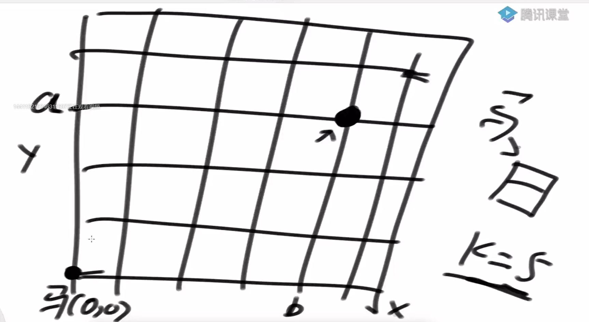

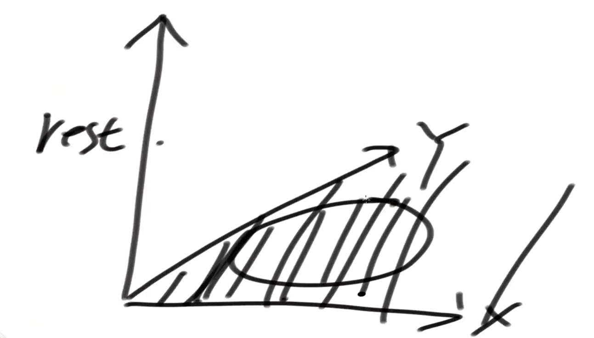

第0层可以知道，每层依赖底层

```java
// 当前来到的位置是（x,y）
// 还剩下rest步需要跳
// 跳完rest步，正好跳到a，b的方法数是多少？
// 10 * 9
public static int jump(int a, int b, int k) {
   return process(0, 0, k, a, b);
}

public static int process(int x, int y, int rest, int a, int b) {
   if (x < 0 || x > 9 || y < 0 || y > 8) {
      return 0;
   }
   if (rest == 0) {
      return (x == a && y == b) ? 1 : 0;
   }
   int ways = process(x + 2, y + 1, rest - 1, a, b);
   ways += process(x + 1, y + 2, rest - 1, a, b);
   ways += process(x - 1, y + 2, rest - 1, a, b);
   ways += process(x - 2, y + 1, rest - 1, a, b);
   ways += process(x - 2, y - 1, rest - 1, a, b);
   ways += process(x - 1, y - 2, rest - 1, a, b);
   ways += process(x + 1, y - 2, rest - 1, a, b);
   ways += process(x + 2, y - 1, rest - 1, a, b);
   return ways;
}

public static int dp(int a, int b, int k) {
   // k: 0~k
   int[][][] dp = new int[10][9][k + 1];
   // 第0层，x=a，y=b时是1，其他默认值0
   dp[a][b][0] = 1;
   // 第一层
   for (int rest = 1; rest <= k; rest++) {
      for (int x = 0; x < 10; x++) {
         for (int y = 0; y < 9; y++) {
            int ways = pick(dp, x + 2, y + 1, rest - 1);
            ways += pick(dp, x + 1, y + 2, rest - 1);
            ways += pick(dp, x - 1, y + 2, rest - 1);
            ways += pick(dp, x - 2, y + 1, rest - 1);
            ways += pick(dp, x - 2, y - 1, rest - 1);
            ways += pick(dp, x - 1, y - 2, rest - 1);
            ways += pick(dp, x + 1, y - 2, rest - 1);
            ways += pick(dp, x + 2, y - 1, rest - 1);
            dp[x][y][rest] = ways;
         }
      }
   }
   return dp[0][0][k];
}
// 越界处理
public static int pick(int[][][] dp, int x, int y, int rest) {
		if (x < 0 || x > 9 || y < 0 || y > 8) {
			return 0;
		}
		return dp[x][y][rest];
	}
```


### 咖啡机问题

给定一个数组arr，arr[i]代表第i号咖啡机泡一杯咖啡的时间

给定一个正数N，表示N个人等着咖啡机泡咖啡，每台咖啡机只能轮流泡咖啡

只有一台咖啡机，一次只能洗一个杯子，时间耗费a，洗完才能洗下一杯

每个咖啡杯也可以自己挥发干净，时间耗费b，咖啡杯可以并行挥发

假设所有人拿到咖啡之后立刻喝干净，

返回从开始等到所有咖啡机变干净的最短时间

三个参数：int[] arr、int N，int a、int b

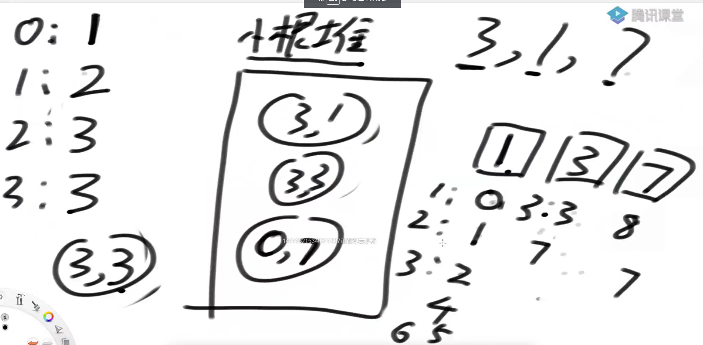


```java
// 以下为贪心+优良暴力
public static class Machine {
   // 什么时间点可以对外提供服务
   public int timePoint;
   // 泡一杯咖啡所需要的时间
   public int workTime;

   public Machine(int t, int w) {
      timePoint = t;
      workTime = w;
   }
}
// 总和谁小谁在上面
public static class MachineComparator implements Comparator<Machine> {

		@Override
		public int compare(Machine o1, Machine o2) {
			return (o1.timePoint + o1.workTime) - (o2.timePoint + o2.workTime);
		}

	}

// 优良一点的暴力尝试的方法
	public static int minTime1(int[] arr, int n, int a, int b) {
		PriorityQueue<Machine> heap = new PriorityQueue<Machine>(new MachineComparator());
		for (int i = 0; i < arr.length; i++) {
            	    // 一开始都是0号时间点可用
			heap.add(new Machine(0, arr[i]));
		}
        	// 排队生成的最优解，第i个人喝完的时间节点
		int[] drinks = new int[n];
		for (int i = 0; i < n; i++) {
            	    // 弹出堆顶
			Machine cur = heap.poll();
            	    // 可用时间等于当前时间+工作时间
			cur.timePoint += cur.workTime;
            	    // 当前喝完的时间
			drinks[i] = cur.timePoint;
            	    // 重新加入堆中
			heap.add(cur);
		}
		return bestTime(drinks, a, b, 0, 0);
	}


	// drinks 所有杯子可以开始洗的时间
	// wash 单杯洗干净的时间（串行）
	// air 挥发干净的时间(并行)
	// free 洗的机器什么时候可用
	// drinks[index.....]都变干净，最早的结束时间（返回）
	public static int bestTime(int[] drinks, int wash, int air, int index, int free) {
		if (index == drinks.length) {
			return 0;
		}
		// index号杯子 决定洗
                // 咖啡机空闲的时间点和可以开始洗的时间点谁大，才能开始洗
		int selfClean1 = Math.max(drinks[index], free) + wash;
		int restClean1 = bestTime(drinks, wash, air, index + 1, selfClean1);
		int p1 = Math.max(selfClean1, restClean1);

		// index号杯子 决定挥发
		int selfClean2 = drinks[index] + air;
		int restClean2 = bestTime(drinks, wash, air, index + 1, free);
		int p2 = Math.max(selfClean2, restClean2);
		return Math.min(p1, p2);
	}


```

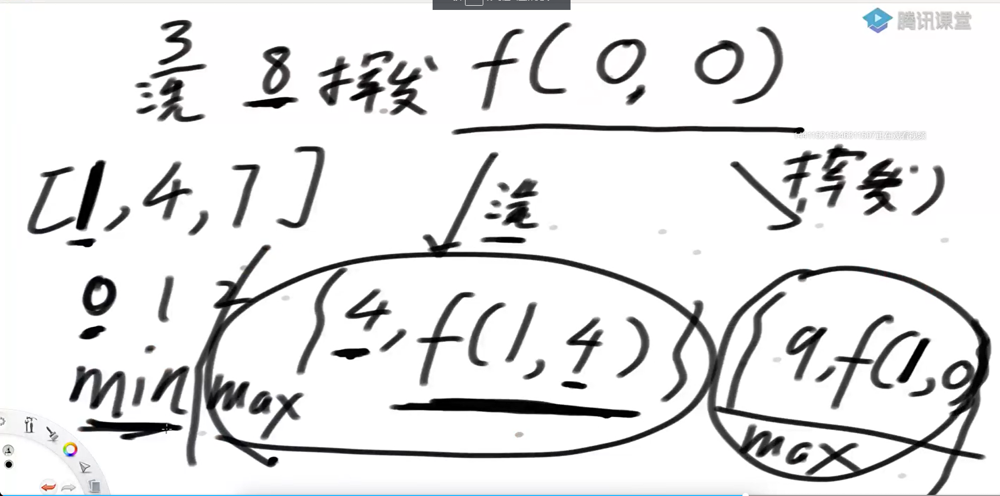

```java
// dp
public static int bestTimeDp(int[] drinks, int wash, int air) {
   int N = drinks.length;
   int maxFree = 0;
   // 每一步的max都是上一步洗完的时间
   for (int i = 0; i < drinks.length; i++) {
      maxFree = Math.max(maxFree, drinks[i]) + wash;
   }
   int[][] dp = new int[N + 1][maxFree + 1];
   // dp[N][....] = 0，依赖下一行，从下往上填
   for (int index = N - 1; index >= 0; index--) {
      for (int free = 0; free <= maxFree; free++) {
         int selfClean1 = Math.max(drinks[index], free) + wash;
         if (selfClean1 > maxFree) {
            break; // 因为后面的也都不用填了
         }
         // index号杯子 决定洗
         int restClean1 = dp[index + 1][selfClean1];
         int p1 = Math.max(selfClean1, restClean1);
         // index号杯子 决定挥发
         int selfClean2 = drinks[index] + air;
         int restClean2 = dp[index + 1][free];
         int p2 = Math.max(selfClean2, restClean2);
         dp[index][free] = Math.min(p1, p2);
      }
   }
   return dp[0][0];
}
```


### 题目一

给定一个二维数组matrix，一个人必须从左上角出发，最后到达右下角

沿途只可以向下或者向右走，沿途的数字都累加就是距离累加和

返回最小距离累加和

```java
// 浪费空间还需要一张二维dp表
public static int minPathSum1(int[][] m) {
   if (m == null || m.length == 0 || m[0] == null || m[0].length == 0) {
      return 0;
   }
   int row = m.length;
   int col = m[0].length;
   int[][] dp = new int[row][col];
   dp[0][0] = m[0][0];
   for (int i = 1; i < row; i++) {
      dp[i][0] = dp[i - 1][0] + m[i][0];
   }
   for (int j = 1; j < col; j++) {
      dp[0][j] = dp[0][j - 1] + m[0][j];
   }
   for (int i = 1; i < row; i++) {
      for (int j = 1; j < col; j++) {
         dp[i][j] = Math.min(dp[i - 1][j], dp[i][j - 1]) + m[i][j];
      }
   }
   return dp[row - 1][col - 1];
}
```

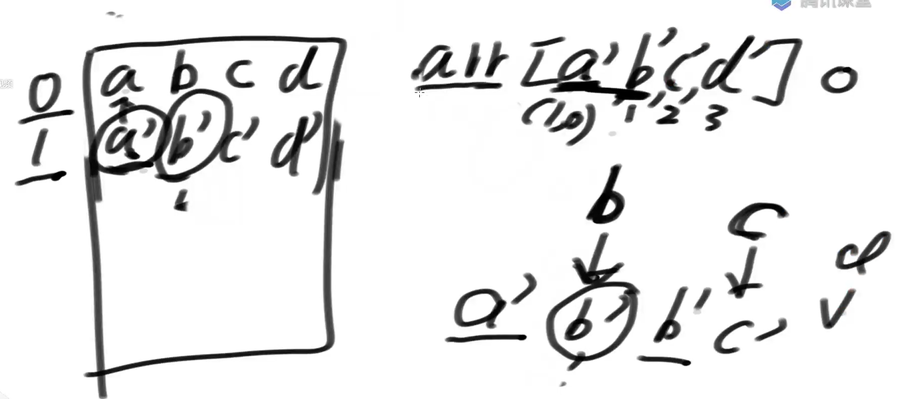

使用一个一维数组，a只依赖于上方的值，更新为a`，然后其他任意位置依赖左边位置更新后得值和上方得值

```java
public static int minPathSum2(int[][] m) {
   if (m == null || m.length == 0 || m[0] == null || m[0].length == 0) {
      return 0;
   }
   int row = m.length;
   int col = m[0].length;
   int[] dp = new int[col];
   dp[0] = m[0][0];
   // 第0行
   for (int j = 1; j < col; j++) {
      dp[j] = dp[j - 1] + m[0][j];
   }
   for (int i = 1; i < row; i++) {
      // 每一行第0列得值
      dp[0] += m[i][0];
      for (int j = 1; j < col; j++) {
         dp[j] = Math.min(dp[j - 1], dp[j]) + m[i][j];
      }
   }
   return dp[col - 1];
}
```

**拓展依赖左、左上、上**

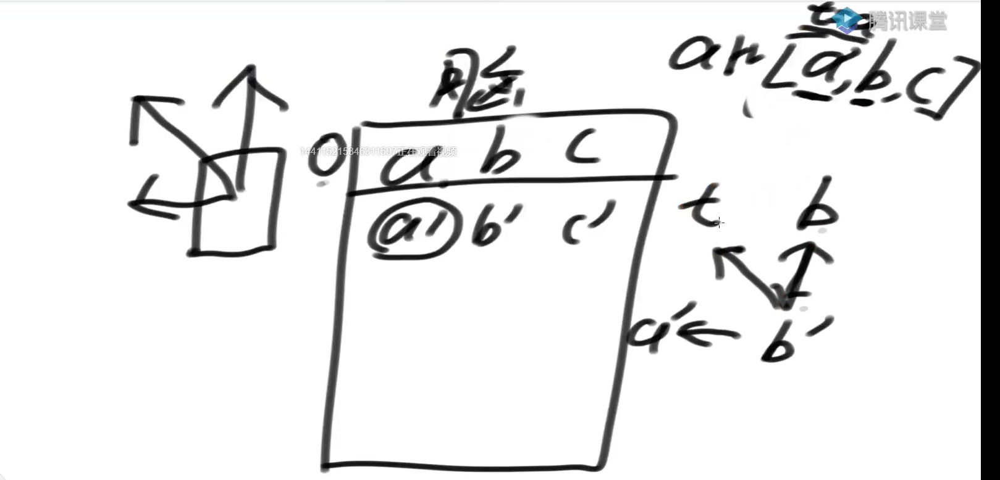

增加一个变量t用来记录更新之前得数值

**总结：空间压缩技巧 行列哪个短用哪个进行更新，省空间**

### 题目2

arr是货币数组，其中的值都是正数。再给定一个正数aim。

每个值都认为是一张货币，

即便是值相同的货币也认为每一张都是不同的，

返回组成aim的方法数

例如：arr = {1,1,1}（人民币1、美元1、英镑1），aim = 2

第0个和第1个能组成2，第1个和第2个能组成2，第0个和第2个能组成2

一共就3种方法，所以返回3

```java
public static int coinWays(int[] arr, int aim) {
   return process(arr, 0, aim);
}

// arr[index....] 组成正好rest这么多的钱，有几种方法
public static int process(int[] arr, int index, int rest) {
   if (rest < 0) {
      return 0;
   }
   if (index == arr.length) { // 没货币可选了！
      return rest == 0 ? 1 : 0; // 之前做的决定
   } else {
      // 不要index位置得钱的方法数+要index位置的方法数
      return process(arr, index + 1, rest) + process(arr, index + 1, rest - arr[index]);
   }
}

public static int dp(int[] arr, int aim) {
   if (aim == 0) {
      return 1;
   }
   int N = arr.length;
   int[][] dp = new int[N + 1][aim + 1];
   dp[N][0] = 1; // 第N行剩下位置都是0
   for (int index = N - 1; index >= 0; index--) {
      for (int rest = 0; rest <= aim; rest++) {
         dp[index][rest] = dp[index + 1][rest] + (rest - arr[index] >= 0 ? dp[index + 1][rest - arr[index]] : 0);
      }
   }
   return dp[0][aim];
}
```

### 题目三

arr是面值数组，其中的值都是正数且没有重复。再给定一个正数aim。

每个值都认为是一种面值，且认为张数是无限的。

返回组成aim的方法数

例如：arr = {1,2}，aim = 4

方法如下：1+1+1+1、1+1+2、2+2

一共就3种方法，所以返回3

```java
public static int coinsWay(int[] arr, int aim) {
   if (arr == null || arr.length == 0 || aim < 0) {
      return 0;
   }
   return process(arr, 0, aim);
}

// arr[index....] 所有的面值，每一个面值都可以任意选择张数，组成正好rest这么多钱，方法数多少？
public static int process(int[] arr, int index, int rest) {
   if (index == arr.length) { // 没钱了
      return rest == 0 ? 1 : 0;
   }
   int ways = 0;
   for (int zhang = 0; zhang * arr[index] <= rest; zhang++) { // 小于剩余的钱
      // 第一个位置用zhang张前+后续process
      ways += process(arr, index + 1, rest - (zhang * arr[index]));
   }
   return ways;
}

public static int dp1(int[] arr, int aim) {
   if (arr == null || arr.length == 0 || aim < 0) {
      return 0;
   }
   int N = arr.length;
   int[][] dp = new int[N + 1][aim + 1];
   dp[N][0] = 1;
   for (int index = N - 1; index >= 0; index--) {
      for (int rest = 0; rest <= aim; rest++) {
         int ways = 0;
         for (int zhang = 0; zhang * arr[index] <= rest; zhang++) {
            ways += dp[index + 1][rest - (zhang * arr[index])];
         }
         dp[index][rest] = ways;
      }
   }
   return dp[0][aim];
}


```

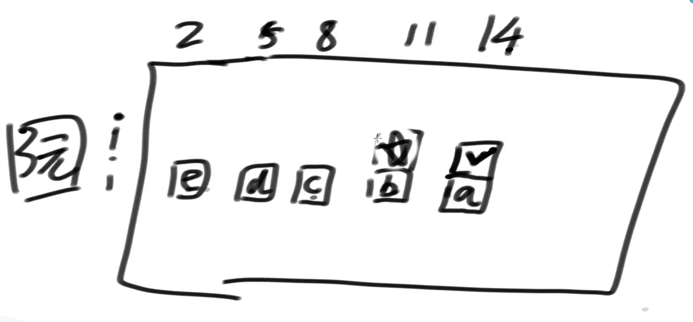

√的依赖下方的和左边rest - arr[index]，星号依赖下方的和edc，此时发现有重复计算

**建立空间感发现优化**

```java
public static int dp2(int[] arr, int aim) {
   if (arr == null || arr.length == 0 || aim < 0) {
      return 0;
   }
   int N = arr.length;
   int[][] dp = new int[N + 1][aim + 1];
   dp[N][0] = 1;
   for (int index = N - 1; index >= 0; index--) {
      for (int rest = 0; rest <= aim; rest++) {
         dp[index][rest] = dp[index + 1][rest]; // 下方位置a
         if (rest - arr[index] >= 0) {
            dp[index][rest] += dp[index][rest - arr[index]]; // 下方位置a+左侧星号
         }
      }
   }
   return dp[0][aim];
}
```


### 题目四

arr是货币数组，其中的值都是正数。再给定一个正数aim。

每个值都认为是一张货币，

认为值相同的货币没有任何不同，

返回组成aim的方法数

例如：arr = {1,2,1,1,2,1,2}，aim = 4

方法：1+1+1+1、1+1+2、2+2

一共就3种方法，所以返回3

```java
public static class Info {
   public int[] coins; // 面值数组
   public int[] zhangs; // 张数数组

   public Info(int[] c, int[] z) {
      coins = c;
      zhangs = z;
   }
}

public static Info getInfo(int[] arr) {
   HashMap<Integer, Integer> counts = new HashMap<>();
   for (int value : arr) {
      if (!counts.containsKey(value)) {
         counts.put(value, 1);
      } else {
         counts.put(value, counts.get(value) + 1);
      }
   }
   int N = counts.size();
   int[] coins = new int[N];
   int[] zhangs = new int[N];
   int index = 0;
   for (Entry<Integer, Integer> entry : counts.entrySet()) {
      coins[index] = entry.getKey();
      zhangs[index++] = entry.getValue();
   }
   return new Info(coins, zhangs);
}

public static int coinsWay(int[] arr, int aim) {
   if (arr == null || arr.length == 0 || aim < 0) {
      return 0;
   }
   Info info = getInfo(arr);
   return process(info.coins, info.zhangs, 0, aim);
}

// coins 面值数组，正数且去重
// zhangs 每种面值对应的张数
public static int process(int[] coins, int[] zhangs, int index, int rest) {
   if (index == coins.length) {
      return rest == 0 ? 1 : 0;
   }
   int ways = 0;
   for (int zhang = 0; zhang * coins[index] <= rest && zhang <= zhangs[index]; zhang++) {
      ways += process(coins, zhangs, index + 1, rest - (zhang * coins[index]));
   }
   return ways;
}


```

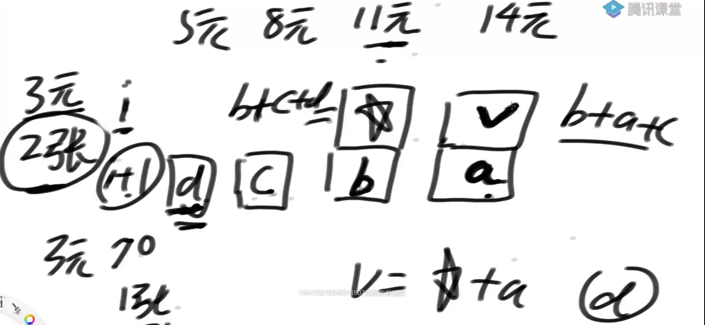

到d的时候3元的张数不够了，没办法再依赖星号位置了

√=*+a-d，d是张数的边界

```java
public static int dp1(int[] arr, int aim) {
   if (arr == null || arr.length == 0 || aim < 0) {
      return 0;
   }
   Info info = getInfo(arr);
   int[] coins = info.coins;
   int[] zhangs = info.zhangs;
   int N = coins.length;
   int[][] dp = new int[N + 1][aim + 1];
   dp[N][0] = 1;
   for (int index = N - 1; index >= 0; index--) {
      for (int rest = 0; rest <= aim; rest++) {
         int ways = 0;
         
         for (int zhang = 0; zhang * coins[index] <= rest && zhang <= zhangs[index]; zhang++) {
            ways += dp[index + 1][rest - (zhang * coins[index])];
         }
         dp[index][rest] = ways;
      }
   }
   return dp[0][aim];
}

public static int dp2(int[] arr, int aim) {
   if (arr == null || arr.length == 0 || aim < 0) {
      return 0;
   }
   Info info = getInfo(arr);
   int[] coins = info.coins;
   int[] zhangs = info.zhangs;
   int N = coins.length;
   int[][] dp = new int[N + 1][aim + 1];
   dp[N][0] = 1;
   for (int index = N - 1; index >= 0; index--) {
      for (int rest = 0; rest <= aim; rest++) {
         dp[index][rest] = dp[index + 1][rest];
         if (rest - coins[index] >= 0) {
            dp[index][rest] += dp[index][rest - coins[index]];
         }
         // 如果减去极限张数+1还没越界说明肯定多加了
         if (rest - coins[index] * (zhangs[index] + 1) >= 0) {
            dp[index][rest] -= dp[index + 1][rest - coins[index] * (zhangs[index] + 1)];
         }
      }
   }
   return dp[0][aim];
}
```


### 题目五

给定5个参数，N，M，row，col，k

表示在N*M的区域上，醉汉Bob初始在(row,col)位置

Bob一共要迈出k步，且每步都会等概率向上下左右四个方向走一个单位

任何时候Bob只要离开N*M的区域，就直接死亡

返回k步之后，Bob还在N*M的区域的概率


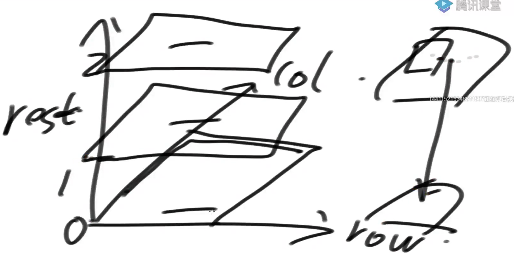

依赖底层

```java
public static double livePosibility1(int row, int col, int k, int N, int M) {
   return (double) process(row, col, k, N, M) / Math.pow(4, k);
}

// 目前在row，col位置，还有rest步要走，走完了如果还在棋盘中就获得1个生存点，返回总的生存点数
public static long process(int row, int col, int rest, int N, int M) {
   if (row < 0 || row == N || col < 0 || col == M) {
      return 0;
   }
   // 还在棋盘中！
   if (rest == 0) {
      return 1;
   }
   // 还在棋盘中！还有步数要走
   long up = process(row - 1, col, rest - 1, N, M);
   long down = process(row + 1, col, rest - 1, N, M);
   long left = process(row, col - 1, rest - 1, N, M);
   long right = process(row, col + 1, rest - 1, N, M);
   return up + down + left + right;
}

public static double livePosibility2(int row, int col, int k, int N, int M) {
   long[][][] dp = new long[N][M][k + 1];
   for (int i = 0; i < N; i++) {
      for (int j = 0; j < M; j++) {
         dp[i][j][0] = 1;
      }
   }
   for (int rest = 1; rest <= k; rest++) {
      for (int r = 0; r < N; r++) {
         for (int c = 0; c < M; c++) {
            dp[r][c][rest] = pick(dp, N, M, r - 1, c, rest - 1);
            dp[r][c][rest] += pick(dp, N, M, r + 1, c, rest - 1);
            dp[r][c][rest] += pick(dp, N, M, r, c - 1, rest - 1);
            dp[r][c][rest] += pick(dp, N, M, r, c + 1, rest - 1);
         }
      }
   }
   return (double) dp[row][col][k] / Math.pow(4, k);
}

public static long pick(long[][][] dp, int N, int M, int r, int c, int rest) {
   if (r < 0 || r == N || c < 0 || c == M) {
      return 0;
   }
   return dp[r][c][rest];
}
```

### 打怪兽

给定3个参数，N，M，K

怪兽有N滴血，等着英雄来砍自己

英雄每一次打击，都会让怪兽流失[0~M]的血量

到底流失多少？每一次在[0~M]上等概率的获得一个值

求K次打击之后，英雄把怪兽砍死的概率

```java
public static double right(int N, int M, int K) {
   if (N < 1 || M < 1 || K < 1) {
      return 0;
   }
   long all = (long) Math.pow(M + 1, K);
   long kill = process(K, M, N);
   return (double) ((double) kill / (double) all);
}

// 怪兽还剩hp点血
// 每次的伤害在[0~M]范围上
// 还有times次可以砍
// 返回砍死的情况数！
public static long process(int times, int M, int hp) {
   if (times == 0) {
      return hp <= 0 ? 1 : 0;
   }
   if (hp <= 0) {
      return (long) Math.pow(M + 1, times);// 没血了还能砍，剩下的次数，阻止血量到0以下，剪枝
   }
   long ways = 0;
   for (int i = 0; i <= M; i++) {
      ways += process(times - 1, M, hp - i);
   }
   return ways;
}

// 怪兽还剩hp点血
// 每次的伤害在[0~M]范围上
// 还有times次可以砍
public static double dp1(int N, int M, int K) {
   if (N < 1 || M < 1 || K < 1) {
      return 0;
   }
   long all = (long) Math.pow(M + 1, K);
   long[][] dp = new long[K + 1][N + 1];
   // 第零行
   dp[0][0] = 1;// dp[0][...] = 0；
   for (int times = 1; times <= K; times++) {
      // 还剩times刀时，hp剩余0了，没血了还能砍的次数
      dp[times][0] = (long) Math.pow(M + 1, times);
      for (int hp = 1; hp <= N; hp++) {
         long ways = 0;
         for (int i = 0; i <= M; i++) {
            if (hp - i >= 0) {
               ways += dp[times - 1][hp - i];
            } else {
               ways += (long) Math.pow(M + 1, times - 1);
            }
         }
         dp[times][hp] = ways;
      }
   }
   long kill = dp[K][N];
   return (double) ((double) kill / (double) all);
}


```

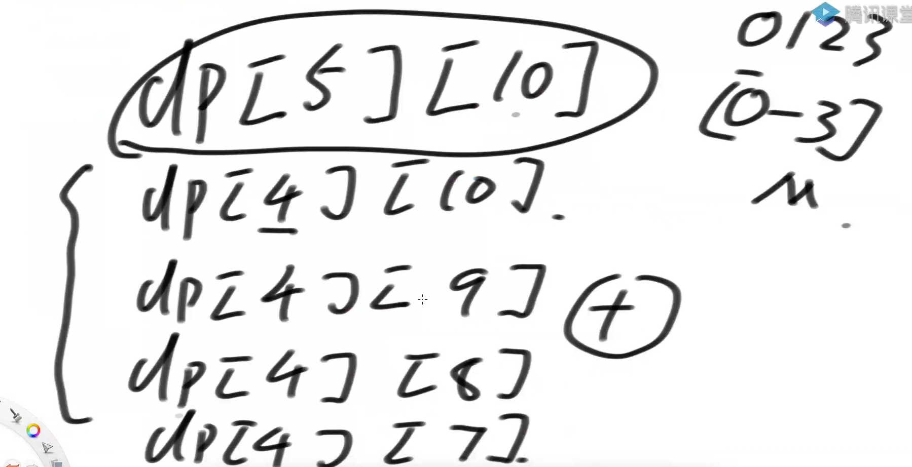

位置依赖

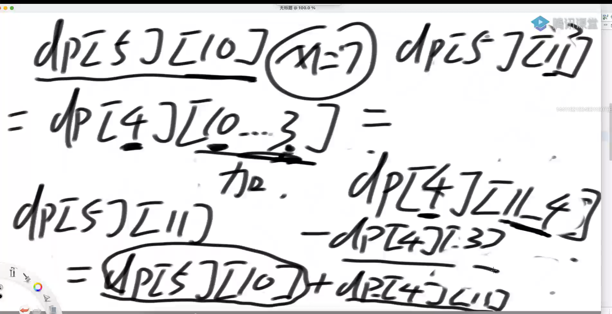

之前的+4，11-多算的4，3

```java
public static double dp2(int N, int M, int K) {
   if (N < 1 || M < 1 || K < 1) {
      return 0;
   }
   long all = (long) Math.pow(M + 1, K);
   long[][] dp = new long[K + 1][N + 1];
   dp[0][0] = 1;
   for (int times = 1; times <= K; times++) {
      dp[times][0] = (long) Math.pow(M + 1, times);
      for (int hp = 1; hp <= N; hp++) {
         dp[times][hp] = dp[times][hp - 1] + dp[times - 1][hp];
         if (hp - 1 - M >= 0) {
            dp[times][hp] -= dp[times - 1][hp - 1 - M];
         } else {
            // 拿不到格子还得剪掉
            dp[times][hp] -= Math.pow(M + 1, times - 1);
         }
      }
   }
   long kill = dp[K][N];
   return (double) ((double) kill / (double) all);
}
```


### 题目二

arr是面值数组，其中的值都是正数且没有重复。再给定一个正数aim。

每个值都认为是一种面值，且认为张数是无限的。

返回组成aim的最少货币数


```java
public static int minCoins(int[] arr, int aim) {
   return process(arr, 0, aim);
}

// arr[index...]面值，每种面值张数自由选择，
// 搞出rest正好这么多钱，返回最小张数
// 拿Integer.MAX_VALUE标记怎么都搞定不了
public static int process(int[] arr, int index, int rest) {
   if (index == arr.length) {
      return rest == 0 ? 0 : Integer.MAX_VALUE;
   } else {
      int ans = Integer.MAX_VALUE;
      for (int zhang = 0; zhang * arr[index] <= rest; zhang++) {
         int next = process(arr, index + 1, rest - zhang * arr[index]);
         if (next != Integer.MAX_VALUE) {
            ans = Math.min(ans, zhang + next);
         }
      }
      return ans;
   }
}

public static int dp1(int[] arr, int aim) {
   if (aim == 0) {
      return 0;
   }
   int N = arr.length;
   int[][] dp = new int[N + 1][aim + 1];
   dp[N][0] = 0;
   for (int j = 1; j <= aim; j++) {
      dp[N][j] = Integer.MAX_VALUE;
   }
   for (int index = N - 1; index >= 0; index--) {
      for (int rest = 0; rest <= aim; rest++) {
         int ans = Integer.MAX_VALUE;
         for (int zhang = 0; zhang * arr[index] <= rest; zhang++) {
            int next = dp[index + 1][rest - zhang * arr[index]];
            if (next != Integer.MAX_VALUE) {
               ans = Math.min(ans, zhang + next);
            }
         }
         dp[index][rest] = ans;
      }
   }
   return dp[0][aim];
}


```

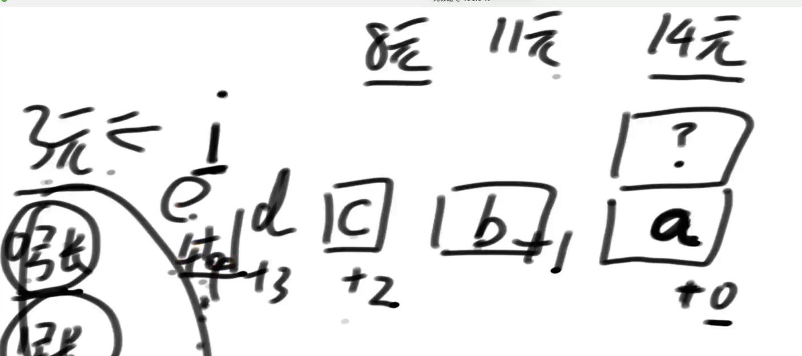

+的数是使用当前钱的个数，使用了几张a


```java
public static int dp2(int[] arr, int aim) {
   if (aim == 0) {
      return 0;
   }
   int N = arr.length;
   int[][] dp = new int[N + 1][aim + 1];
   dp[N][0] = 0;
   for (int j = 1; j <= aim; j++) {
      dp[N][j] = Integer.MAX_VALUE;
   }
   for (int index = N - 1; index >= 0; index--) {
      for (int rest = 0; rest <= aim; rest++) {
         dp[index][rest] = dp[index + 1][rest];
         if (rest - arr[index] >= 0 
               && dp[index][rest - arr[index]] != Integer.MAX_VALUE) {
            dp[index][rest] = Math.min(dp[index][rest], dp[index][rest - arr[index]] + 1);
         }
      }
   }
   return dp[0][aim];
}
```

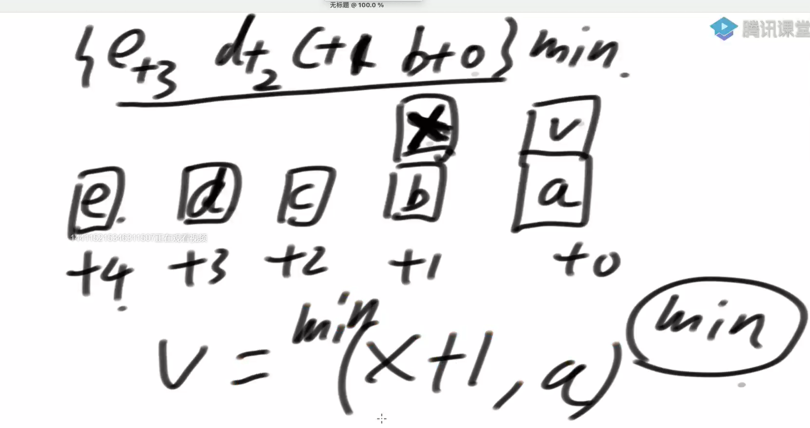

### 题目三

给定一个正数n，求n的裂开方法数，

规定：后面的数不能比前面的数小

比如4的裂开方法有：

1+1+1+1、1+1+2、1+3、2+2、4

5种，所以返回5

```java
// n为正数
public static int ways(int n) {
   if (n < 0) {
      return 0;
   }
   if (n == 1) {
      return 1;
   }
   return process(1, n);
}

// 上一个拆出来的数是pre
// 还剩rest需要去拆
// 返回拆解的方法数
public static int process(int pre, int rest) {
   if (rest == 0) {
      return 1; //之前选择有效
   }
   if (pre > rest) {
      return 0; // 前面的比后面大，无效
   }
   int ways = 0;
   for (int first = pre; first <= rest; first++) {
      // 第一个数first<=rest,并且从pre开始
      ways += process(first, rest - first);
   }
   return ways;
}

public static int dp1(int n) {
   if (n < 0) {
      return 0;
   }
   if (n == 1) {
      return 1;
   }
   int[][] dp = new int[n + 1][n + 1];
   for (int pre = 1; pre <= n; pre++) {
      dp[pre][0] = 1;
      dp[pre][pre] = 1;
   }
   for (int pre = n - 1; pre >= 1; pre--) {
      for (int rest = pre + 1; rest <= n; rest++) {
         int ways = 0;
         for (int first = pre; first <= rest; first++) {
            ways += dp[first][rest - first];
         }
         dp[pre][rest] = ways;
      }
   }
   return dp[1][n];
}


```

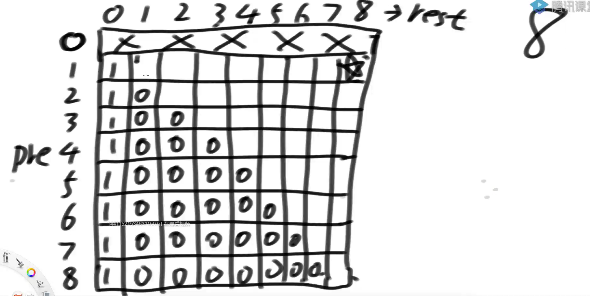


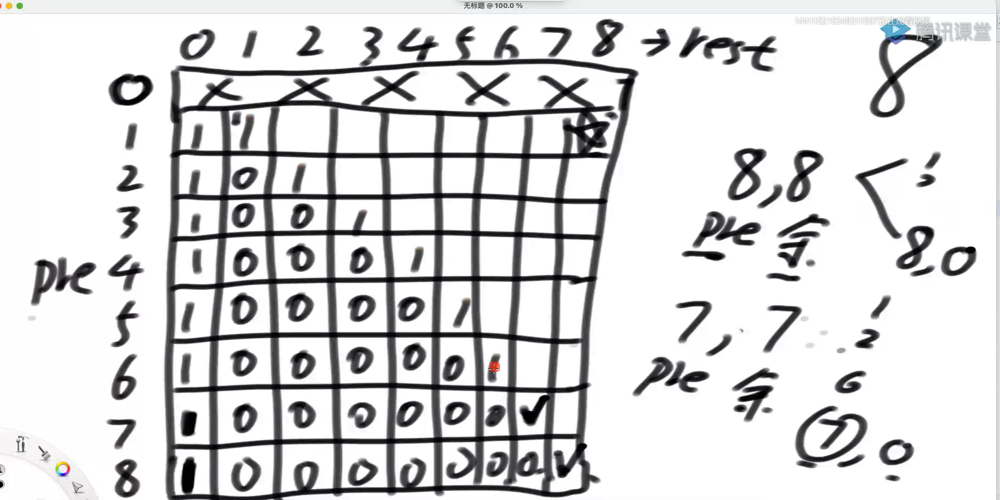

对角线都是1，8，8依赖8，0、7，7依赖7，0


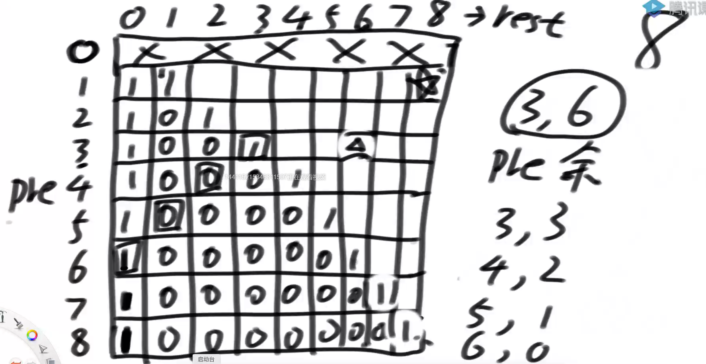

普遍位置依赖方框位置

```java
// 推位置依赖
public static int dp2(int n) {
   if (n < 0) {
      return 0;
   }
   if (n == 1) {
      return 1;
   }
   int[][] dp = new int[n + 1][n + 1];
   for (int pre = 1; pre <= n; pre++) {
      dp[pre][0] = 1;
      dp[pre][pre] = 1;
   }
   for (int pre = n - 1; pre >= 1; pre--) {
      for (int rest = pre + 1; rest <= n; rest++) {
         dp[pre][rest] = dp[pre + 1][rest];
         dp[pre][rest] += dp[pre][rest - pre];
      }
   }
   return dp[1][n];
}
```

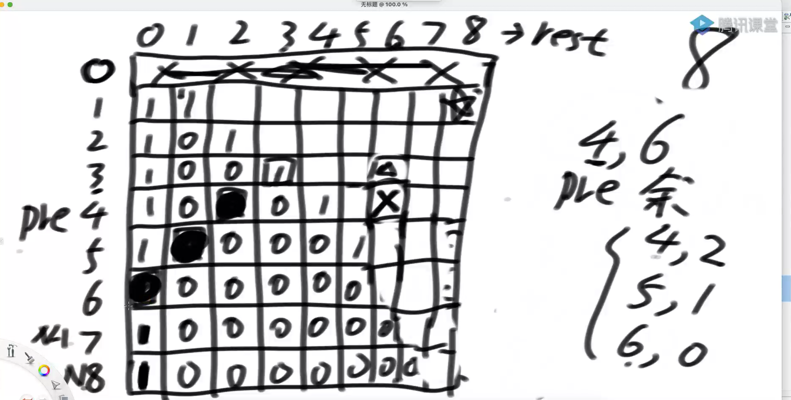

下方位置依赖涂黑的位置


下方格子再加上这个格子

### 题目一

给定一个正数数组arr，

请把arr中所有的数分成两个集合，尽量让两个集合的累加和接近

返回：

最接近的情况下，较小集合的累加和

```java
public static int right(int[] arr) {
   if (arr == null || arr.length < 2) {
      return 0;
   }
   int sum = 0;
   // 统计所有数的累加和
   for (int num : arr) {
      sum += num;
   }
   // 和/2保证两个集合接近
   return process(arr, 0, sum / 2);
}

// arr[i...]可以自由选择，请返回累加和尽量接近rest，但不能超过rest的情况下，最接近的累加和是多少？
public static int process(int[] arr, int i, int rest) {
   if (i == arr.length) {
      return 0;
   } else { // 还有数，arr[i]这个数
      // 可能性1，不使用arr[i]
      int p1 = process(arr, i + 1, rest);
      // 可能性2，要使用arr[i]
      int p2 = 0;
      if (arr[i] <= rest) {
         p2 = arr[i] + process(arr, i + 1, rest - arr[i]);
      }
      return Math.max(p1, p2);
   }
}

public static int dp(int[] arr) {
   if (arr == null || arr.length < 2) {
      return 0;
   }
   int sum = 0;
   for (int num : arr) {
      sum += num;
   }
   sum /= 2;
   int N = arr.length;
   int[][] dp = new int[N + 1][sum + 1];
   for (int i = N - 1; i >= 0; i--) {
      for (int rest = 0; rest <= sum; rest++) {
         // 可能性1，不使用arr[i]
         int p1 = dp[i + 1][rest];
         // 可能性2，要使用arr[i]
         int p2 = 0;
         if (arr[i] <= rest) {
            p2 = arr[i] + dp[i + 1][rest - arr[i]];
         }
         dp[i][rest] = Math.max(p1, p2);
      }
   }
   return dp[0][sum];
}
```

### 题目二

给定一个正数数组arr，请把arr中所有的数分成两个集合

如果arr长度为偶数，两个集合包含数的个数要一样多

如果arr长度为奇数，两个集合包含数的个数必须只差一个

请尽量让两个集合的累加和接近

返回：

最接近的情况下，较小集合的累加和

```java
public static int right(int[] arr) {
   if (arr == null || arr.length < 2) {
      return 0;
   }
   int sum = 0;
   for (int num : arr) {
      sum += num;
   }
   // 偶数
   if ((arr.length & 1) == 0) {
      return process(arr, 0, arr.length / 2, sum / 2);
   } else { // 奇数
      return Math.max(process(arr, 0, arr.length / 2, sum / 2), process(arr, 0, arr.length / 2 + 1, sum / 2));
   }
}

// arr[i....]自由选择，挑选的个数一定要是picks个，累加和<=rest, 离rest最近的返回
public static int process(int[] arr, int i, int picks, int rest) {
   if (i == arr.length) {
      // 没数了且剩余个数是0个才是有效解
      return picks == 0 ? 0 : -1;
   } else {
      int p1 = process(arr, i + 1, picks, rest);
      // 就是要使用arr[i]这个数
      int p2 = -1;
      int next = -1;
      if (arr[i] <= rest) {
         next = process(arr, i + 1, picks - 1, rest - arr[i]);
      }
      if (next != -1) {
         p2 = arr[i] + next;
      }
      return Math.max(p1, p2);
   }
}

public static int dp(int[] arr) {
   if (arr == null || arr.length < 2) {
      return 0;
   }
   int sum = 0;
   for (int num : arr) {
      sum += num;
   }
   sum /= 2;
   int N = arr.length;
   int M = (N + 1) / 2;// 向上取整
   int[][][] dp = new int[N + 1][M + 1][sum + 1];
   // 所有位置都认为无效
   for (int i = 0; i <= N; i++) {
      for (int j = 0; j <= M; j++) {
         for (int k = 0; k <= sum; k++) {
            dp[i][j][k] = -1;
         }
      }
   }
   
   for (int rest = 0; rest <= sum; rest++) {
      dp[N][0][rest] = 0;
   }
   for (int i = N - 1; i >= 0; i--) {
      for (int picks = 0; picks <= M; picks++) {
         for (int rest = 0; rest <= sum; rest++) {
            int p1 = dp[i + 1][picks][rest];
            // 就是要使用arr[i]这个数
            int p2 = -1;
            int next = -1;
            if (picks - 1 >= 0 && arr[i] <= rest) {
               next = dp[i + 1][picks - 1][rest - arr[i]];
            }
            if (next != -1) {
               p2 = arr[i] + next;
            }
            dp[i][picks][rest] = Math.max(p1, p2);
         }
      }
   }
   if ((arr.length & 1) == 0) {
      return dp[0][arr.length / 2][sum];
   } else {
      return Math.max(dp[0][arr.length / 2][sum], dp[0][(arr.length / 2) + 1][sum]);
   }
}
```


### N皇后问题

N皇后问题是指在N*N的棋盘上要摆N个皇后，

要求任何两个皇后不同行、不同列， 也不在同一条斜线上


 给定一个整数n，返回n皇后的摆法有多少种。
 n=1，返回1

n=2或3，2皇后和3皇后问题无论怎么摆都不行，返回0

n=8，返回92

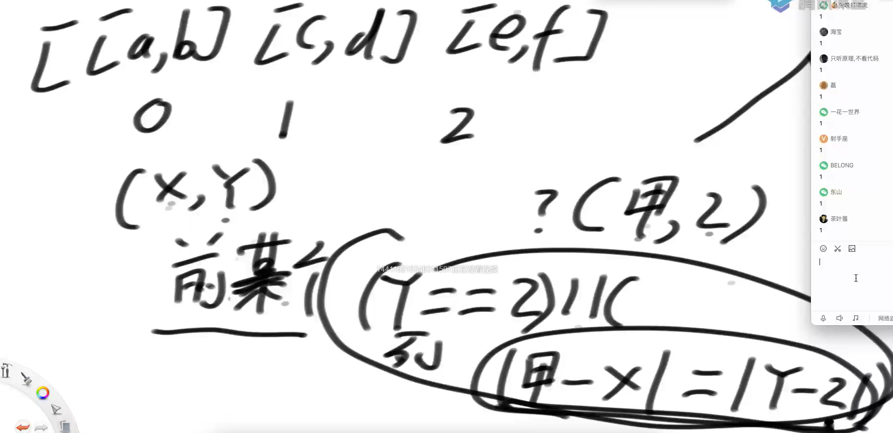

每行只能填一个等情况下，不能同列同斜线

```java
public static int num1(int n) {
   if (n < 1) {
      return 0;
   }
   int[] record = new int[n];
   return process1(0, record, n);
}

// 当前来到i行，一共是0~N-1行
// 在i行上放皇后，所有列都尝试
// 必须要保证跟之前所有的皇后不打架
// int[] record record[x] = y 之前的第x行的皇后，放在了y列上
// 返回：不关心i以上发生了什么，i.... 后续有多少合法的方法数
public static int process1(int i, int[] record, int n) {
   if (i == n) {
      return 1; // 有效答案
   }
   int res = 0;
   // i行的皇后，放哪一列呢？j列，
   for (int j = 0; j < n; j++) {
      if (isValid(record, i, j)) {// 和之前的不打架
         record[i] = j;
         res += process1(i + 1, record, n);
      }
   }
   return res;
}

public static boolean isValid(int[] record, int i, int j) {
   // 0..i-1
   for (int k = 0; k < i; k++) {
      if (j == record[k] || Math.abs(record[k] - j) == Math.abs(i - k)) {
         return false;
      }
   }
   return true;
}

// 请不要超过32皇后问题
public static int num2(int n) {
   if (n < 1 || n > 32) {
      return 0;
   }
   // 如果你是13皇后问题，limit 最右13个1，其他都是0
   int limit = n == 32 ? -1 : (1 << n) - 1;
   return process2(limit, 0, 0, 0);
}

// 7皇后问题
// limit : 0....0 1 1 1 1 1 1 1
// 之前皇后的列影响：colLim
// 之前皇后的左下对角线影响：leftDiaLim
// 之前皇后的右下对角线影响：rightDiaLim
public static int process2(int limit, int colLim, int leftDiaLim, int rightDiaLim) {
   if (colLim == limit) {
      return 1;
   }
   // pos中所有是1的位置，是你可以去尝试皇后的位置
   int pos = limit & (~(colLim | leftDiaLim | rightDiaLim));
   int mostRightOne = 0;
   int res = 0;
   while (pos != 0) {
      mostRightOne = pos & (~pos + 1);
      pos = pos - mostRightOne;
      res += process2(limit, colLim | mostRightOne, (leftDiaLim | mostRightOne) << 1,
            (rightDiaLim | mostRightOne) >>> 1);
   }
   return res;
}
```

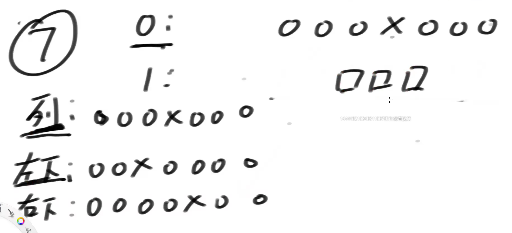

三个位置信息或运算得到画方块的位置，是不能选的

## 套路总结

**怎么尝试**？

1）有经验但是没有方法论？

2）怎么判断一个尝试就是最优尝试？

3）难道尝试这件事真的只能拼天赋？那我咋搞定我的面试？

4）动态规划是啥？好高端的样子哦…可是我不会啊！和尝试有什么关系？

最强的私货来了！-> 暴力递归到动态规划的套路！解决任何面试中的动态规划问题！


**什么暴力递归可以继续优化**？

有重复调用同一个子问题的解，这种递归可以优化

如果每一个子问题都是不同的解，无法优化也不用优化


**暴力递归和动态规划的关系**

某一个暴力递归，有解的重复调用，就可以把这个暴力递归优化成动态规划

任何动态规划问题，都一定对应着某一个有重复过程的暴力递归

但不是所有的暴力递归，都一定对应着动态规划


**面试题和动态规划的关系**

解决一个问题，可能有很多尝试方法

可能在很多尝试方法中，又有若干个尝试方法有动态规划的方式

一个问题  可能有  若干种动态规划的解法


**如何找到某个问题的动态规划方式**？

1）设计暴力递归：重要原则+4种常见尝试模型！重点！（从左往右的尝试模型、范围尝试模型、样本对应模型、业务限制模型）

2）分析有没有重复解：套路解决

3）用记忆化搜索 -> 用严格表结构实现动态规划：套路解决

4）看看能否继续优化：套路解决


**面试中设计暴力递归过程的原则**

1）每一个可变参数的类型，一定不要比int类型更加复杂

2）原则1）可以违反，让类型突破到一维线性结构，那必须是单一可变参数

3）如果发现原则1）被违反，但不违反原则2），只需要做到记忆化搜索即可

4）可变参数的个数，能少则少


**知道了面试中设计暴力递归过程的原则**，然后呢？

一定要逼自己找到不违反原则情况下的暴力尝试！

如果你找到的暴力尝试，不符合原则，马上舍弃！找新的！

如果某个题目突破了设计原则，一定极难极难，面试中出现概率低于5%！


**常见的4种尝试模型**

1）从左往右的尝试模型

2）范围上的尝试模型

3）多样本位置全对应的尝试模型

4）寻找业务限制的尝试模型


**如何分析有没有重复解**

列出调用过程，可以只列出前几层

有没有重复解，一看便知


**暴力递归到动态规划的套路**

1）你已经有了一个不违反原则的暴力递归，而且的确存在解的重复调用

2）找到哪些参数的变化会影响返回值，对每一个列出变化范围

3）参数间的所有的组合数量，意味着表大小

4）记忆化搜索的方法就是傻缓存，非常容易得到

5）规定好严格表的大小，分析位置的依赖顺序，然后从基础填写到最终解

6）对于有枚举行为的决策过程，进一步优化


**动态规划的进一步优化**

1）空间压缩

2）状态化简

3）四边形不等式

4）其他优化技巧

## 状态压缩动态规划

### 题目一

在 "100 game" 这个游戏中，两名玩家轮流选择从 1 到 10 的任意整数，累计整数和，先使得累计整数和达到或超过 100 的玩家，即为胜者。

如果我们将游戏规则改为 “玩家不能重复使用整数” 呢？

例如，两个玩家可以轮流从公共整数池中抽取从 1 到 15 的整数（不放回），直到累计整数和 >= 100。

给定一个整数 maxChoosableInteger （整数池中可选择的最大数）和另一个整数 desiredTotal（累计和），判断先出手的玩家是否能稳赢（假设两位玩家游戏时都表现最佳）？

你可以假设 maxChoosableInteger 不会大于 20， desiredTotal 不会大于 300。

**暴力解**

```java
// 1~choose 拥有的数字
// total 一开始的剩余
// 返回先手会不会赢
public static boolean canIWin0(int choose, int total) {
   if (total == 0) {
      return true;
   }
   if ((choose * (choose + 1) >> 1) < total) {
      return false;
   }
   int[] arr = new int[choose];
   for (int i = 0; i < choose; i++) {
      arr[i] = i + 1;
   }
   // arr[i] != -1 表示arr[i]这个数字还没被拿走
   // arr[i] == -1 表示arr[i]这个数字已经被拿走
   // 集合，arr，1~choose
   return process(arr, total);
}

// 当前轮到先手拿，
// 先手只能选择在arr中还存在的数字，
// 还剩rest这么值，
// 返回先手会不会赢
public static boolean process(int[] arr, int rest) {
   if (rest <= 0) {
      return false;
   }
   // 先手去尝试所有的情况
   for (int i = 0; i < arr.length; i++) {
      if (arr[i] != -1) {
         int cur = arr[i];
         arr[i] = -1;
         boolean next = process(arr, rest - cur);
         // 恢复现场
         arr[i] = cur;
         if (!next) {
            return true;
         }
      }
   }
   return false;
}
```

尝试用一个int变量表示该位置是否被拿走

```java
// 这个是暴力尝试，思路是正确的，超时而已
public static boolean canIWin1(int choose, int total) {
   if (total == 0) {
      return true;
   }
   if ((choose * (choose + 1) >> 1) < total) {
      return false;
   }
   return process1(choose, 0, total);
}

// 当前轮到先手拿，
// 先手可以拿1~choose中的任何一个数字
// status   i位如果为0，代表没拿，当前可以拿
//          i位为1，代表已经拿过了，当前不能拿
// 还剩rest这么值，
// 返回先手会不会赢
public static boolean process1(int choose, int status, int rest) {
   if (rest <= 0) {
      return false;
   }
   for (int i = 1; i <= choose; i++) {
      // 16进制从0开始，1向左移动i位置
      if (((1 << i) & status) == 0) { // i 这个数字，是此时先手的决定！
         if (!process1(choose, (status | (1 << i)), rest - i)) {
            return true;
         }
      }
   }
   return false;
}
```

改dp

status能计算出还剩多少rest

```java
// 暴力尝试改动态规划而已
public static boolean canIWin2(int choose, int total) {
   if (total == 0) {
      return true;
   }
   if ((choose * (choose + 1) >> 1) < total) {
      return false;
   }
   // 准备1向左移动choose+1大小
   int[] dp = new int[1 << (choose + 1)];
   // dp[status] == 1  true
   // dp[status] == -1  false
   // dp[status] == 0  process(status) 没算过！去算！
   return process2(choose, 0, total, dp);
}

// 为什么明明status和rest是两个可变参数，却只用status来代表状态(也就是dp)
// 因为选了一批数字之后，得到的和一定是一样的，所以rest是由status决定的，所以rest不需要参与记忆化搜索
public static boolean process2(int choose, int status, int rest, int[] dp) {
   if (dp[status] != 0) {
      return dp[status] == 1 ? true : false;
   }
   boolean ans = false;
   if (rest > 0) {
      for (int i = 1; i <= choose; i++) {
         if (((1 << i) & status) == 0) {
            if (!process2(choose, (status | (1 << i)), rest - i, dp)) {
               ans = true;
               break;
            }
         }
      }
   }
   dp[status] = ans ? 1 : -1;
   return ans;
}
```


### 题目二

TSP问题 有N个城市，任何两个城市之间的都有距离，任何一座城市到自己的距离都为0。所有点到点的距 离都存在一个N*N的二维数组matrix里，也就是整张图由邻接矩阵表示。现要求一旅行商从k城市 出发必须经过每一个城市且只在一个城市逗留一次，最后回到出发的k城，返回总距离最短的路的 距离。参数给定一个matrix，给定k。

```java
public static int t1(int[][] matrix) {
   int N = matrix.length; // 0...N-1
   // set
   // set.get(i) != null i这座城市在集合里
   // set.get(i) == null i这座城市不在集合里
   List<Integer> set = new ArrayList<>();
   for (int i = 0; i < N; i++) {
      set.add(1);
   }
   // 0是所有过程的归宿点
   return func1(matrix, set, 0);
}

// 任何两座城市之间的距离，可以在matrix里面拿到
// set中表示着哪些城市的集合，
// start这座城一定在set里，
// 从start出发，要把set中所有的城市过一遍，最终回到0这座城市，最小距离是多少
public static int func1(int[][] matrix, List<Integer> set, int start) {
   int cityNum = 0;
   // 看看set中还剩余几座城
   for (int i = 0; i < set.size(); i++) {
      // 表示i这座城市还在
      if (set.get(i) != null) {
         cityNum++;
      }
   }
   // set中只剩一座城了，每步骤调用都会保证start在set中
   if (cityNum == 1) {
      return matrix[start][0];
   }
   // cityNum > 1  不只start这一座城
   // 后续过程，把start去掉继续调用递归
   set.set(start, null);
   int min = Integer.MAX_VALUE;
   for (int i = 0; i < set.size(); i++) {
      if (set.get(i) != null) {
         // start -> i i... -> 0
         int cur = matrix[start][i] + func1(matrix, set, i);
         // 收集最小值
         min = Math.min(min, cur);
      }
   }
   set.set(start, 1);
   return min;
}
```

start用位运算

```java
public static int t2(int[][] matrix) {
   int N = matrix.length; // 0...N-1
   // 7座城 1111111
   int allCity = (1 << N) - 1;
   return f2(matrix, allCity, 0);
}

// 任何两座城市之间的距离，可以在matrix里面拿到
// set中表示着哪些城市的集合，
// start这座城一定在set里，
// 从start出发，要把set中所有的城市过一遍，最终回到0这座城市，最小距离是多少
public static int f2(int[][] matrix, int cityStatus, int start) {
   // cityStatus == cityStatux & (~cityStaus + 1)
	 // 把最右侧的1取出来如果等于他自己，说明cityStatus == 1
   if (cityStatus == (cityStatus & (~cityStatus + 1))) {
      return matrix[start][0];
   }

   // 把start位的1去掉，&上除了start位置是0，剩下位置都是1的状态
   cityStatus &= (~(1 << start));
   int min = Integer.MAX_VALUE;
   // 枚举所有的城市
   for (int move = 0; move < matrix.length; move++) {
      if ((cityStatus & (1 << move)) != 0) {
         int cur = matrix[start][move] + f2(matrix, cityStatus, move);
         min = Math.min(min, cur);
      }
   }
   cityStatus |= (1 << start);
   return min;
}
```

缓存

```java
public static int t3(int[][] matrix) {
   int N = matrix.length; // 0...N-1
   // 7座城 1111111
   int allCity = (1 << N) - 1;
   int[][] dp = new int[1 << N][N];
   for (int i = 0; i < (1 << N); i++) {
      for (int j = 0; j < N; j++) {
         dp[i][j] = -1;
      }
   }
   return f3(matrix, allCity, 0, dp);
}

// 任何两座城市之间的距离，可以在matrix里面拿到
// set中表示着哪些城市的集合，
// start这座城一定在set里，
// 从start出发，要把set中所有的城市过一遍，最终回到0这座城市，最小距离是多少
public static int f3(int[][] matrix, int cityStatus, int start, int[][] dp) {
   if (dp[cityStatus][start] != -1) {
      return dp[cityStatus][start];
   }
   if (cityStatus == (cityStatus & (~cityStatus + 1))) {
      dp[cityStatus][start] = matrix[start][0];
   } else {
      // 把start位的1去掉，
      cityStatus &= (~(1 << start));
      int min = Integer.MAX_VALUE;
      // 枚举所有的城市
      for (int move = 0; move < matrix.length; move++) {
         if (move != start && (cityStatus & (1 << move)) != 0) {
            int cur = matrix[start][move] + f3(matrix, cityStatus, move, dp);
            min = Math.min(min, cur);
         }
      }
      cityStatus |= (1 << start);
      dp[cityStatus][start] = min;
   }
   return dp[cityStatus][start];
}
```


### 题目三

你有无限的1*2的砖块，要铺满M*N的区域，

不同的铺法有多少种?

```java
/*
 * 2*M铺地的问题非常简单，这个是解决N*M铺地的问题
 */

public static int ways1(int N, int M) {
   if (N < 1 || M < 1 || ((N * M) & 1) != 0) {
      return 0;
   }
   if (N == 1 || M == 1) {
      return 1;
   }
   int[] pre = new int[M]; // pre代表-1行的状况
   for (int i = 0; i < pre.length; i++) {
      pre[i] = 1;
   }
   return process(pre, 0, N);
}

// pre 表示level-1行的状态
// level表示，正在level行做决定
// N 表示一共有多少行 固定的
// level-2行及其之上所有行，都摆满砖了
// level做决定，让所有区域都满，方法数返回
public static int process(int[] pre, int level, int N) {
   if (level == N) { // base case
      for (int i = 0; i < pre.length; i++) {
         if (pre[i] == 0) {
            return 0;
         }
      }
      return 1;
   }

   // 没到终止行，可以选择在当前的level行摆瓷砖
   int[] op = getOp(pre);
   return dfs(op, 0, level, N);
}

// op[i] == 0 可以考虑摆砖
// op[i] == 1 只能竖着向上
public static int dfs(int[] op, int col, int level, int N) {
   // 在列上自由发挥，玩深度优先遍历，当col来到终止列，i行的决定做完了
   // 轮到i+1行，做决定
   if (col == op.length) {
      return process(op, level + 1, N);
   }
   int ans = 0;
   // col位置不横摆
   ans += dfs(op, col + 1, level, N); // col位置上不摆横转
   // col位置横摆, 向右
   if (col + 1 < op.length && op[col] == 0 && op[col + 1] == 0) {
      op[col] = 1;
      op[col + 1] = 1;
      ans += dfs(op, col + 2, level, N);
      op[col] = 0;
      op[col + 1] = 0;
   }
   return ans;
}

public static int[] getOp(int[] pre) {
   int[] cur = new int[pre.length];
   for (int i = 0; i < pre.length; i++) {
      cur[i] = pre[i] ^ 1;
   }
   return cur;
}
```
