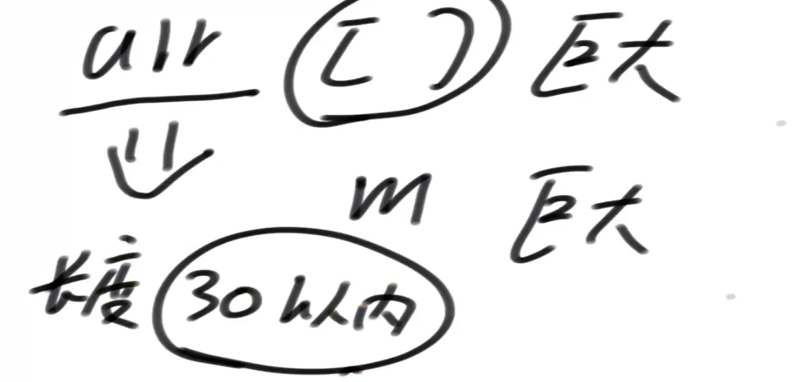

# 根据对数器找规律、根据数据量猜解法

## 对数器找规律

1）某个面试题，输入参数类型简单，并且只有一个实际参数

2）要求的返回值类型也简单，并且只有一个

3）用暴力方法，把输入参数对应的返回值，打印出来看看，进而优化code

## 题目一

小虎去买苹果，商店只提供两种类型的塑料袋，每种类型都有任意数量。

1）能装下6个苹果的袋子

2）能装下8个苹果的袋子

小虎可以自由使用两种袋子来装苹果，但是小虎有强迫症，他要求自己使用的袋子数量必须最少，且使用的每个袋子必须装满。

给定一个正整数N，返回至少使用多少袋子。如果N无法让使用的每个袋子必须装满，返回-1


```java
// 暴力尝试，让8个的袋子数量尽可能最大，所用的总袋子最少，进行尝试
public static int minBags(int apple) {
   if (apple < 0) {
      return -1;
   }
   // apple / 8 向下取整
   int bag8 = (apple >> 3);
   // 剩余苹果数
   int rest = apple - (bag8 << 3);
   while(bag8 >= 0) {
      // rest 个
      if(rest % 6 ==0) {
         return bag8 + (rest / 6);
      } else {
         bag8--;
         rest += 8;
      }
   }
   return -1;
}
```


打印发现规律

奇数都是-1

```java
public static int minBagAwesome(int apple) {
   if ((apple & 1) != 0) { // 如果是奇数，返回-1
      return -1;
   }
   if (apple < 18) {
      return apple == 0 ? 0 : (apple == 6 || apple == 8) ? 1
            : (apple == 12 || apple == 14 || apple == 16) ? 2 : -1;
   }
   return (apple - 18) / 8 + 3;
}
```


## 题目二

给定一个正整数N，表示有N份青草统一堆放在仓库里

有一只牛和一只羊，牛先吃，羊后吃，它俩轮流吃草

不管是牛还是羊，每一轮能吃的草量必须是：

1，4，16，64…(4的某次方)

谁最先把草吃完，谁获胜

假设牛和羊都绝顶聪明，都想赢，都会做出理性的决定

根据唯一的参数N，返回谁会赢


草不够了不能多吃，0草时后手赢，1草时先手赢，2草时后手赢。。。

```java
// 如果n份草，最终先手赢，返回"先手"
// 如果n份草，最终后手赢，返回"后手"
public static String whoWin(int n) {
   if (n < 5) {
      return n == 0 || n == 2 ? "后手" : "先手";
   }
   // 进到这个过程里来，当前的先手，先选
   // 从一份草开始选择
   int want = 1;
   while (want <= n) {
      // 后续过程中如果后手赢了就是我赢了
      if (whoWin(n - want).equals("后手")) {
         return "先手";
      }
      // 防溢出
      if (want <= (n / 4)) {
         want *= 4;
      } else {
         break;
      }
   }
   return "后手";
}
```


规律5个一组后先后先先先

```java
public static String winner2(int n) {
   if (n % 5 == 0 || n % 5 == 2) {
      return "后手";
   } else {
      return "先手";
   }
}
```

## 题目三

定义一种数：可以表示成若干（数量>1）连续正数和的数

比如:

5 = 2+3，5就是这样的数

12 = 3+4+5，12就是这样的数

1不是这样的数，因为要求数量大于1个、连续正数和

2 = 1 + 1，2也不是，因为等号右边不是连续正数

给定一个参数N，返回是不是可以表示成若干连续正数和的数


从1+每次增加1，看看是不是能等于100，如果大于一百说明有1的不能加到100

然后从2开始

```java
public static boolean isMSum1(int num) {
   for (int start = 1; start <= num; start++) {
      int sum = start;
      for (int j = start + 1; j <= num; j++) {
         if (sum + j > num) {
            break;
         }
         if (sum + j == num) {
            return true;
         }
         sum += j;
      }
   }
   return false;
}
```


如果某个数的二进制只有1个1它一定是二进制的某次方

```java
public static boolean isMSum2(int num) {
//    
//    提取最右侧的1居然等于自己
//    return num == (num & (~num + 1));
//    
//    return num == (num & (-num));
//    
//    如果只有1个1（这个1 -1会被拆散）&是0，如果&后不是0，则说明不止一个1
      return (num & (num - 1)) != 0;
   }
```


---

## 根据数据规模猜解法

1）C/C++，1秒处理的指令条数为10的8次方

2）Java等语言，1~4秒处理的指令条数为10的8次方

3）这里就有大量的空间了！

## 题目四

int[] d，d[i]：i号怪兽的能力

int[] p，p[i]：i号怪兽要求的钱

开始时你的能力是0，你的目标是从0号怪兽开始，通过所有的怪兽。

如果你当前的能力，小于i号怪兽的能力，你必须付出p[i]的钱，贿赂这个怪兽，然后怪兽就会加入你，他的能力直接累加到你的能力上；如果你当前的能力，大于等于i号怪兽的能力，你可以选择直接通过，你的能力并不会下降，你也可以选择贿赂这个怪兽，然后怪兽就会加入你，他的能力直接累加到你的能力上。

返回通过所有的怪兽，需要花的最小钱数。


---

暴力解1

```java
// int[] d d[i]：i号怪兽的武力
// int[] p p[i]：i号怪兽要求的钱
// ability 当前你所具有的能力
// index 来到了第index个怪兽的面前

// 目前，你的能力是ability，你来到了index号怪兽的面前，如果要通过后续所有的怪兽，
// 请返回需要花的最少钱数
public static long process1(int[] d, int[] p, int ability, int index) {
   if (index == d.length) {
      return 0;
   }
   if (ability < d[index]) {
      // 当前花费的+后续至少花的
      return p[index] + process1(d, p, ability + d[index], index + 1);
   } else { // ability >= d[index] 可以贿赂，也可以不贿赂
      return Math.min(

            p[index] + process1(d, p, ability + d[index], index + 1),

            0 + process1(d, p, ability, index + 1));
   }
}
```

暴力解2

```java
public static int minMoney2(int[] d, int[] p) {
   int allMoney = 0;
   for (int i = 0; i < p.length; i++) {
      allMoney += p[i];
   }
   int N = d.length;
   for (int money = 0; money < allMoney; money++) {
      if (process2(d, p, N - 1, money) != -1) {
         return money;
      }
   }
   return allMoney;
}
```

```java
// 从0....index号怪兽，花的钱，必须严格==money
// 如果通过不了，返回-1
// 如果可以通过，返回能通过情况下的最大能力值
public static long process2(int[] d, int[] p, int index, int money) {
   if (index == -1) { // 一个怪兽也没遇到呢
      return money == 0 ? 0 : -1;
   }
   // index >= 0
   // 1) 不贿赂当前index号怪兽
   long preMaxAbility = process2(d, p, index - 1, money);
   long p1 = -1;
   if (preMaxAbility != -1 && preMaxAbility >= d[index]) {
      p1 = preMaxAbility;
   }
   // 2) 贿赂当前的怪兽 当前的钱 p[index]
   long preMaxAbility2 = process2(d, p, index - 1, money - p[index]);
   long p2 = -1;
   if (preMaxAbility2 != -1) {
      p2 = d[index] + preMaxAbility2;
   }
   return Math.max(p1, p2);
}
```


最后一行从左往右遍历，第一个不是-1的就是花费最少的


情况1，不贿赂当前怪兽，如果当前一个dp不等于-1，且前一个格子的值大于当前怪兽的能力值才能通过

此时dp的值就是前一个dp的值

```java
public static long func1(int[] d, int[] p) {
   return process1(d, p, 0, 0);
}
```

```java
public static long func2(int[] d, int[] p) {
   int sum = 0;
   for (int num : d) {
      sum += num;
   }
   long[][] dp = new long[d.length + 1][sum + 1];
   for (int i = 0; i <= sum; i++) {
      dp[0][i] = 0;
   }
   for (int cur = d.length - 1; cur >= 0; cur--) {
      for (int hp = 0; hp <= sum; hp++) {
         // 如果这种情况发生，那么这个hp必然是递归过程中不会出现的状态
         // 既然动态规划是尝试过程的优化，尝试过程碰不到的状态，不必计算
         if (hp + d[cur] > sum) {
            continue;
         }
         if (hp < d[cur]) {
            dp[cur][hp] = p[cur] + dp[cur + 1][hp + d[cur]];
         } else {
            dp[cur][hp] = Math.min(p[cur] + dp[cur + 1][hp + d[cur]], dp[cur + 1][hp]);
         }
      }
   }
   return dp[0][0];
}
```

```java
public static long func3(int[] d, int[] p) {
   int sum = 0;
   for (int num : p) {
      sum += num;
   }
   // dp[i][j]含义：
   // 能经过0～i的怪兽，且花钱为j（花钱的严格等于j）时的武力值最大是多少？
   // 如果dp[i][j]==-1，表示经过0～i的怪兽，花钱为j是无法通过的，或者之前的钱怎么组合也得不到正好为j的钱数
   int[][] dp = new int[d.length][sum + 1];
   for (int i = 0; i < dp.length; i++) {
      for (int j = 0; j <= sum; j++) {
         dp[i][j] = -1;
      }
   }
   // 经过0～i的怪兽，花钱数一定为p[0]，达到武力值d[0]的地步。其他第0行的状态一律是无效的
   dp[0][p[0]] = d[0];
   for (int i = 1; i < d.length; i++) {
      for (int j = 0; j <= sum; j++) {
         // 可能性一，为当前怪兽花钱
         // 存在条件：
         // j - p[i]要不越界，并且在钱数为j - p[i]时，要能通过0～i-1的怪兽，并且钱数组合是有效的。
         if (j >= p[i] && dp[i - 1][j - p[i]] != -1) {
            dp[i][j] = dp[i - 1][j - p[i]] + d[i];
         }
         // 可能性二，不为当前怪兽花钱
         // 存在条件：
         // 0~i-1怪兽在花钱为j的情况下，能保证通过当前i位置的怪兽
         if (dp[i - 1][j] >= d[i]) {
            // 两种可能性中，选武力值最大的
            dp[i][j] = Math.max(dp[i][j], dp[i - 1][j]);
         }
      }
   }
   int ans = 0;
   // dp表最后一行上，dp[N-1][j]代表：
   // 能经过0～N-1的怪兽，且花钱为j（花钱的严格等于j）时的武力值最大是多少？
   // 那么最后一行上，最左侧的不为-1的列数(j)，就是答案
   for (int j = 0; j <= sum; j++) {
      if (dp[d.length - 1][j] != -1) {
         ans = j;
         break;
      }
   }
   return ans;
}
```

看范围决定使用哪种dp，是钱范围大还是，能力范围大

---

## 分治

面试中的分治的应用场景：

1，数据量整体做尝试可能性太多了，跑不完

2，数据分成多个块（常见是两块）之后，各自的可能性并不算多

3，合并多个块各自信息的整合过程不复杂

## 题目一

给定一个非负数组arr，和一个正数m。

返回arr的所有子序列中累加和%m之后的最大值。

---

假设m很大，所有子序列累加和很小

使用arr[i]的这些数字，能不把某个累加和j搞出来


i= 0到N-1

所有数字的累加和决定了j的上限


最后一行所有不等于-1（能搞出来累加和的模m），找到最大值

```java
public static int max2(int[] arr, int m) {
   int sum = 0;
   int N = arr.length;
   for (int i = 0; i < N; i++) {
      sum += arr[i];
   }
   boolean[][] dp = new boolean[N][sum + 1];
   for (int i = 0; i < N; i++) {
      dp[i][0] = true;
   }
   dp[0][arr[0]] = true;
   for (int i = 1; i < N; i++) {
      for (int j = 1; j <= sum; j++) {
         dp[i][j] = dp[i - 1][j];
         if (j - arr[i] >= 0) {
            dp[i][j] |= dp[i - 1][j - arr[i]];
         }
      }
   }
   int ans = 0;
   for (int j = 0; j <= sum; j++) {
      if (dp[N - 1][j]) {
         ans = Math.max(ans, j % m);
      }
   }
   return ans;
}
```

---

arr[i]巨大，m不大

如果用第一种方法j会爆

i arr中的所有值自由选择搞出来所有累加和模m，有没有余数j

j < m


不要i位置的值

 

要i位置的数


```java
public static int max3(int[] arr, int m) {
   int N = arr.length;
   // 0...m-1
   boolean[][] dp = new boolean[N][m];
   for (int i = 0; i < N; i++) {
      // 一个数都不选，确实能够搞出来余数0
      dp[i][0] = true;
   }
   dp[0][arr[0] % m] = true;
   for (int i = 1; i < N; i++) {
      for (int j = 1; j < m; j++) {
         // dp[i][j] T or F
         dp[i][j] = dp[i - 1][j];
         int cur = arr[i] % m;
         if (cur <= j) {
            dp[i][j] |= dp[i - 1][j - cur];
         } else {
            dp[i][j] |= dp[i - 1][m + j - cur];
         }
      }
   }
   int ans = 0;
   for (int i = 0; i < m; i++) {
      if (dp[N - 1][i]) {
         ans = i;
      }
   }
   return ans;
}
```

---



使用分治


```java
// 如果arr的累加和很大，m也很大
// 但是arr的长度相对不大
public static int max4(int[] arr, int m) {
   if (arr.length == 1) {
      return arr[0] % m;
   }
   int mid = (arr.length - 1) / 2;
   // 有序表
   TreeSet<Integer> sortSet1 = new TreeSet<>();
   process4(arr, 0, 0, mid, m, sortSet1);
   TreeSet<Integer> sortSet2 = new TreeSet<>();
   process4(arr, mid + 1, 0, arr.length - 1, m, sortSet2);
   int ans = 0;
   for (Integer leftMod : sortSet1) {
      ans = Math.max(ans, leftMod + sortSet2.floor(m - 1 - leftMod));
   }
   return ans;
}

// 从index出发，最后有边界是end+1，arr[index...end]
public static void process4(int[] arr, int index, int sum, int end, int m, TreeSet<Integer> sortSet) {
   if (index == end + 1) {
      sortSet.add(sum % m);
   } else {
      process4(arr, index + 1, sum, end, m, sortSet);
      process4(arr, index + 1, sum + arr[index], end, m, sortSet);
   }
}
```


## 题目二

牛牛家里一共有n袋零食, 第i袋零食体积为v[i]，背包容量为w。

牛牛想知道在总体积不超过背包容量的情况下,

一共有多少种零食放法，体积为0也算一种放法

1 <= n <= 30, 1 <= w <= 2 * 10^9

v[i] (0 <= v[i] <= 10^9）

---

arr在0-i范围上自由选，体积必须凑够j的方法数


j的范围上所有v[i]的累加和，爆了

使用分治

```java
// arr 30
// func(arr, 0, 14, 0, bag, map)

// func(arr, 15, 29, 0, bag, map)

// 从index出发，到end结束
// 之前的选择，已经形成的累加和sum
// 零食[index....end]自由选择，出来的所有累加和，不能超过bag，每一种累加和对应的方法数，填在map里
// 最后不能什么货都没选
// [3,3,3,3] bag = 6
// 0 1 2 3
// - - - - 0 -> （0 : 1）
// - - - $ 3 -> （0 : 1）(3, 1)
// - - $ - 3 -> （0 : 1）(3, 2)
public static long func(int[] arr, int index, int end, long sum, long bag, TreeMap<Long, Long> map) {
   if(sum > bag) {
      return 0;
   }
   // sum <= bag
   if(index > end) { // 所有商品自由选择完了！
      // sum
      if(sum != 0) {
         if (!map.containsKey(sum)) {
            map.put(sum, 1L);
         } else {
            map.put(sum, map.get(sum) + 1);
         }
         return 1;
      } else {
         return 0;
      }        
   }
   // sum <= bag 并且 index <= end(还有货)
   // 1) 不要当前index位置的货
   long ways = func(arr, index + 1, end, sum, bag, map);
   
   // 2) 要当前index位置的货
   ways += func(arr, index + 1, end, sum + arr[index], bag, map);
   return ways;
}
```


左侧拿出某一个值，右侧生成类似前缀和map

例如左侧2（4种），右侧需要找小于等于6的16种，一共4*16

```java
public static long ways(int[] arr, int bag) {
   if (arr == null || arr.length == 0) {
      return 0;
   }
   if (arr.length == 1) {
      return arr[0] <= bag ? 2 : 1;
   }
   int mid = (arr.length - 1) >> 1;
   TreeMap<Long, Long> lmap = new TreeMap<>();
   long ways = process(arr, 0, 0, mid, bag, lmap);
   TreeMap<Long, Long> rmap = new TreeMap<>();
   ways += process(arr, mid + 1, 0, arr.length - 1, bag, rmap);
   // 前缀和表 
   TreeMap<Long, Long> rpre = new TreeMap<>();
   long pre = 0;
   for (Entry<Long, Long> entry : rmap.entrySet()) {
      pre += entry.getValue();
      rpre.put(entry.getKey(), pre);
   }
   for (Entry<Long, Long> entry : lmap.entrySet()) {
      long lweight = entry.getKey();
      long lways = entry.getValue();
      Long floor = rpre.floorKey(bag - lweight);
      if (floor != null) {
         long rways = rpre.get(floor);
         ways += lways * rways;
      }
   }
   // +1 左右一个都不拿
   return ways + 1;
}
```