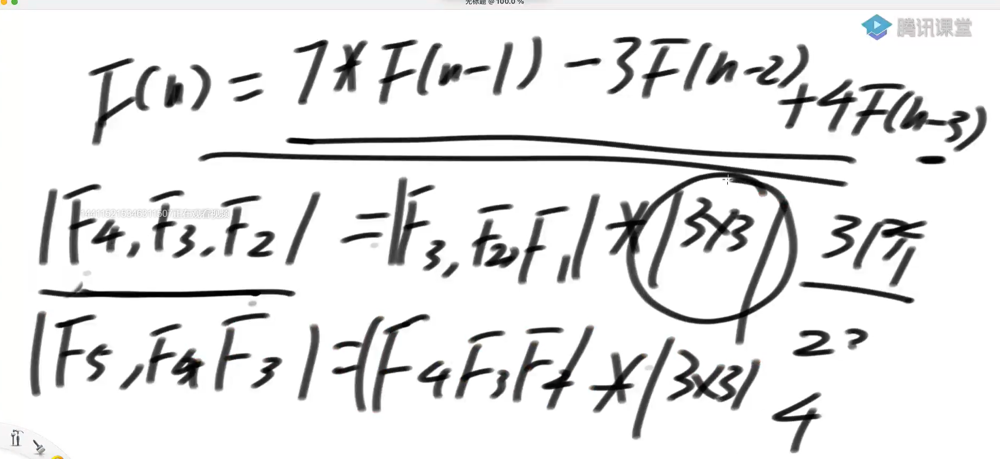

# 矩阵快速幂

## 求斐波那契数列矩阵乘法的方法


现在的问题是|a|（矩阵）的n-2此方怎么算更快


自己*自己logn


单位矩阵|a|


| F(2), F(1) | * 某个二阶矩阵的N-2次方（w,z,y,t）


```java
// O(logN)
public static int f3(int n) {
   if (n < 1) {
      return 0;
   }
   if (n == 1 || n == 2) {
      return 1;
   }
   // [ 1 ,1 ] 
   // [ 1, 0 ]
   // a,b,c,d
   int[][] base = { 
         { 1, 1 }, 
         { 1, 0 } 
         };
   int[][] res = matrixPower(base, n - 2);
   return res[0][0] + res[1][0];
}

public static int[][] matrixPower(int[][] m, int p) {
   int[][] res = new int[m.length][m[0].length];
   // 单位矩阵
   for (int i = 0; i < res.length; i++) {
      res[i][i] = 1;
   }
   // res = 矩阵中的1
   int[][] t = m;// 矩阵1次方
   for (; p != 0; p >>= 1) { // 右移抹去末尾的1
      if ((p & 1) != 0) {
         res = muliMatrix(res, t);
      }
      t = muliMatrix(t, t);
   }
   return res;
}

// 两个矩阵乘完之后的结果返回
public static int[][] muliMatrix(int[][] m1, int[][] m2) {
   int[][] res = new int[m1.length][m2[0].length];
   for (int i = 0; i < m1.length; i++) {
      for (int j = 0; j < m2[0].length; j++) {
         for (int k = 0; k < m2.length; k++) {
            res[i][j] += m1[i][k] * m2[k][j];
         }
      }
   }
   return res;
}
```


1）斐波那契数列的线性求解（O(N)）的方式非常好理解

 

2）同时利用线性代数，也可以改写出另一种表示


 | F(N) , F(N-1) | = | F(2), F(1) | * 某个二阶矩阵的N-2次方


3）求出这个二阶矩阵，进而最快求出这个二阶矩阵的N-2次方


**n阶递推**

阶数看n-到几




## 类似斐波那契数列的递归优化

如果某个递归，除了初始项之外，具有如下的形式


F(N) = C1 * F(N) + C2 * F(N-1) + … + Ck * F(N-k) ( C1…Ck 和k都是常数)


并且这个递归的表达式是严格的、不随条件转移的


那么都存在类似斐波那契数列的优化，时间复杂度都能优化成O(logN)

 

## 题目二

斐波那契数列矩阵乘法方式的实现


## 题目三

一个人可以一次往上迈1个台阶，也可以迈2个台阶


返回这个人迈上N级台阶的方法数


## 题目四

第一年农场有1只成熟的母牛A，往后的每年：


1）每一只成熟的母牛都会生一只母牛


2）每一只新出生的母牛都在出生的第三年成熟


3）每一只母牛永远不会死


返回N年后牛的数量


F（n） = F（n-1）+ F（n-3）

```java
// 递归
public static int c1(int n) {
   if (n < 1) {
      return 0;
   }
   if (n == 1 || n == 2 || n == 3) {
      return n;
   }
   return c1(n - 1) + c1(n - 3);
}
// o(n)
public static int c2(int n) {
   if (n < 1) {
      return 0;
   }
   if (n == 1 || n == 2 || n == 3) {
      return n;
   }
   int res = 3;
   int pre = 2;
   int prepre = 1;
   int tmp1 = 0;
   int tmp2 = 0;
   for (int i = 4; i <= n; i++) {
      tmp1 = res;
      tmp2 = pre;
      res = res + prepre;
      pre = tmp1;
      prepre = tmp2;
   }
   return res;
}
```


```java
public static int c3(int n) {
   if (n < 1) {
      return 0;
   }
   if (n == 1 || n == 2 || n == 3) {
      return n;
   }
   int[][] base = { 
         { 1, 1, 0 }, 
         { 0, 0, 1 }, 
         { 1, 0, 0 } };
   int[][] res = matrixPower(base, n - 3);
   return 3 * res[0][0] + 2 * res[1][0] + res[2][0];
}
```

## 题目五

给定一个数N，想象只由0和1两种字符，组成的所有长度为N的字符串


如果某个字符串,任何0字符的左边都有1紧挨着,认为这个字符串达标


返回有多少达标的字符串


1. 第一个位置是1 后续F（i-1）

2. 第一个位置是1，第二个位置一定是1，后续F（i-2）

## 题目六

用1 * 2的瓷砖，把N * 2的区域填满

返回铺瓷砖的方法数


