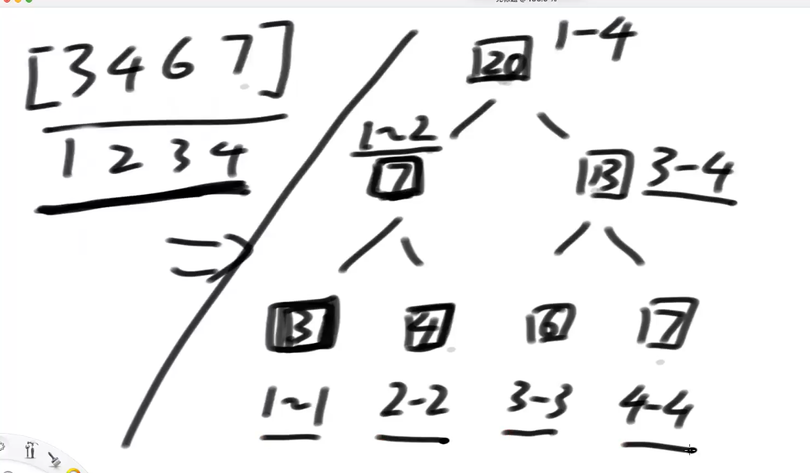
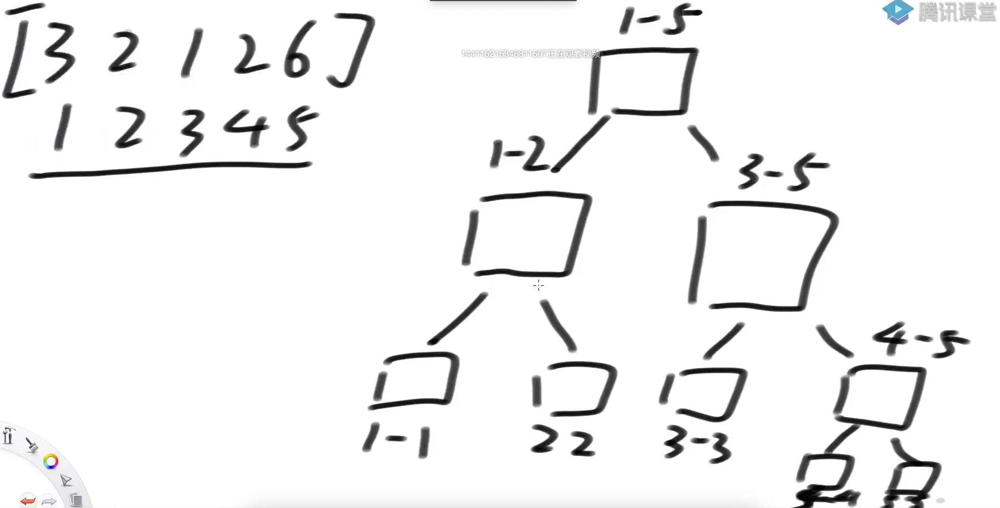
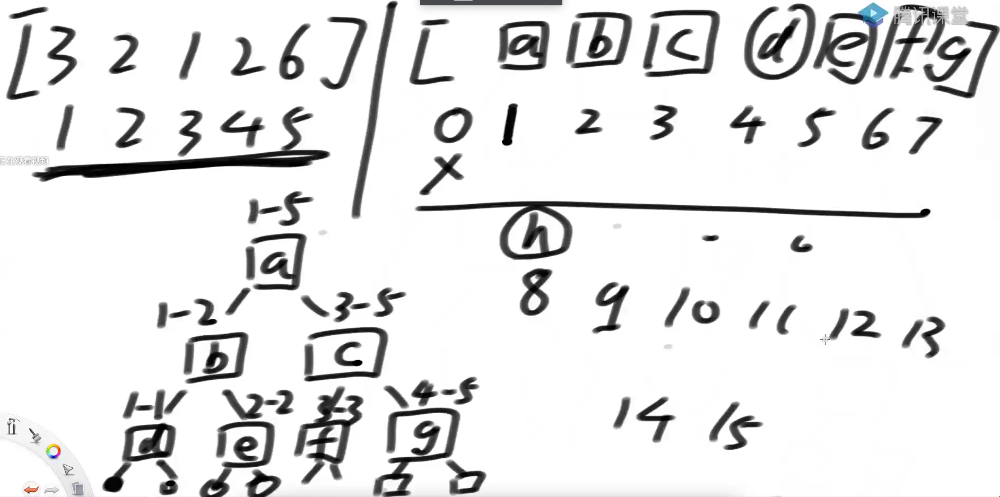
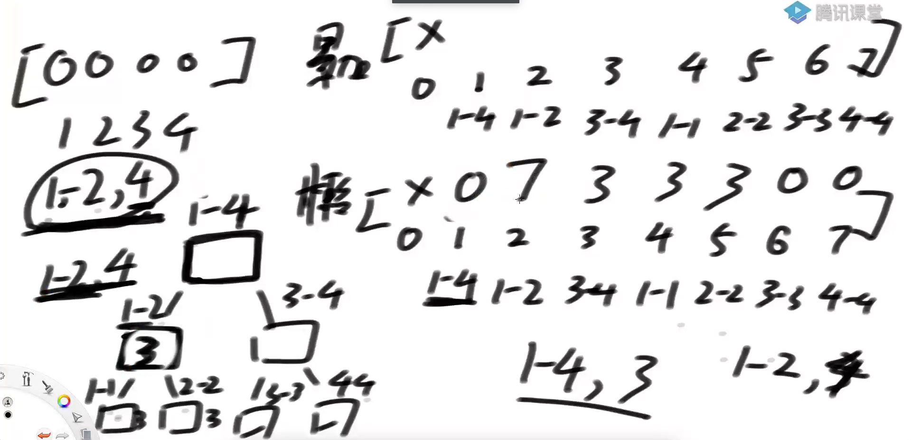

# 线段树

区间上的统一增加、修改、查询求和问题







g的左右孩子在14 15位置上8-13 空着

**i的父节点是i/2**

**i的左孩子位置2*i**

**i的左孩子位置2*i + 1**

**结论**

如果原数组长度为N，准备4N长度肯定够用





一开始1 - 4 任务 + 3

先看1-4格子把自己更新成3（拦住了信息）

当有新任务1-2 +4

1-4先看自己是否曾经拦住过信息，发现有个3的任务，下发到1-2 3-4

然后处理1-2 + 4的任务，发现不能拦住，下发给1-2

1-2 发现自己有+3的任务此时有两种选择

1. 下发+3的任务，把+4的任务拦到自己身上
2. 不下发+3的任务，把+4的任务也拦到自己身上，自己变成+7的任务


```java
public static class SegmentTree {
  
   private int MAXN;
   // arr[]为原序列的信息从0开始，但在arr里是从1开始的 自己玩的数组
   private int[] arr;
   // sum[]模拟线段树维护区间和
   private int[] sum;
   // lazy[]为累加和懒惰标记
   private int[] lazy;
   // change[]为更新的值
   private int[] change;
   // update[]为更新慵懒标记
   private boolean[] update;

   public SegmentTree(int[] origin) {
      MAXN = origin.length + 1;
      arr = new int[MAXN]; // arr[0] 不用 从1开始使用
      for (int i = 1; i < MAXN; i++) {
         arr[i] = origin[i - 1];
      }
      // * 4
      sum = new int[MAXN << 2]; // 用来支持脑补概念中，某一个范围的累加和信息
      lazy = new int[MAXN << 2]; // 用来支持脑补概念中，某一个范围沒有往下傳遞的纍加任務
      change = new int[MAXN << 2]; // 用来支持脑补概念中，某一个范围有没有更新操作的任务
      update = new boolean[MAXN << 2]; // 用来支持脑补概念中，某一个范围更新任务，更新成了什么
   }

   private void pushUp(int rt) {
      // 左孩子2*rt + 右孩子 2 * rt + 1 
      sum[rt] = sum[rt << 1] + sum[rt << 1 | 1];
   }

   // 之前的，所有懒增加，和懒更新，从父范围，发给左右两个子范围
   // 分发策略是什么
   // ln表示左子树元素结点个数，rn表示右子树结点个数
   private void pushDown(int rt, int ln, int rn) {
      if (update[rt]) {
         update[rt << 1] = true;
         update[rt << 1 | 1] = true;
         change[rt << 1] = change[rt];
         change[rt << 1 | 1] = change[rt];
         lazy[rt << 1] = 0;
         lazy[rt << 1 | 1] = 0;
         sum[rt << 1] = change[rt] * ln;
         sum[rt << 1 | 1] = change[rt] * rn;
         update[rt] = false;
      }
      // 下发一层
      if (lazy[rt] != 0) {
         // 拦信息
         lazy[rt << 1] += lazy[rt];
         // 左孩子是多少节点的累加和的数量 * 拦信息 累加
         sum[rt << 1] += lazy[rt] * ln;
         lazy[rt << 1 | 1] += lazy[rt];
         sum[rt << 1 | 1] += lazy[rt] * rn;
         lazy[rt] = 0;
      }
   }

   // 在初始化阶段，先把sum数组，填好
   // 在arr[l~r]范围上，去build，1~N，
   // rt : 这个范围在sum中的下标
   public void build(int l, int r, int rt) {
      // 叶子节点，直接把原始数组的值塞进去
      if (l == r) {
         sum[rt] = arr[l];
         return;
      }
      // 中点
      int mid = (l + r) >> 1;
      // 左孩子
      build(l, mid, rt << 1);
      // 右孩子
      build(mid + 1, r, rt << 1 | 1);
      // 左+右得到自己
      pushUp(rt);
   }

   
   // L~R  所有的值变成C
   // l~r  rt
   public void update(int L, int R, int C, int l, int r, int rt) {
      if (L <= l && r <= R) {
         // 1有效、0无效，因为change有可能是要更新成0，还是不更新
         update[rt] = true;
         change[rt] = C;
         sum[rt] = C * (r - l + 1);
         // 更新操作加的都清空
         lazy[rt] = 0;
         return;
      }
      // 当前任务躲不掉，无法懒更新，要往下发
      int mid = (l + r) >> 1;
      pushDown(rt, mid - l + 1, r - mid);
      if (L <= mid) {
         update(L, R, C, l, mid, rt << 1);
      }
      if (R > mid) {
         update(L, R, C, mid + 1, r, rt << 1 | 1);
      }
      pushUp(rt);
   }

   // L~R, C 任务！任务范围、+几
   // rt，l~r  当前格子范围
   public void add(int L, int R, int C, int l, int r, int rt) {
      // 任务如果把此时的范围全包了！
      if (L <= l && r <= R) {
         // l-r上一共(r - l + 1)个数，一共变大*c累加
         sum[rt] += C * (r - l + 1);
         // 拦（懒）更新，之前拦的值+现在拦的值
         lazy[rt] += C;
         return;
      }
      // 任务没有把你全包！
      // l  r  mid = (l+r)/2
      int mid = (l + r) >> 1;
      // 下发一层
      pushDown(rt, mid - l + 1, r - mid);
      // L~R
      // 如果左边需要调整
      if (L <= mid) {
         add(L, R, C, l, mid, rt << 1);
      }
      // 如果左边需要调整
      if (R > mid) {
         add(L, R, C, mid + 1, r, rt << 1 | 1);
      }
      pushUp(rt);
   }

   // 1~6 累加和是多少？ 1~8 rt
   public long query(int L, int R, int l, int r, int rt) {
      if (L <= l && r <= R) {
         return sum[rt];
      }
      int mid = (l + r) >> 1;
      pushDown(rt, mid - l + 1, r - mid);
      long ans = 0;
      if (L <= mid) {
         ans += query(L, R, l, mid, rt << 1);
      }
      if (R > mid) {
         ans += query(L, R, mid + 1, r, rt << 1 | 1);
      }
      return ans;
   }

}
```