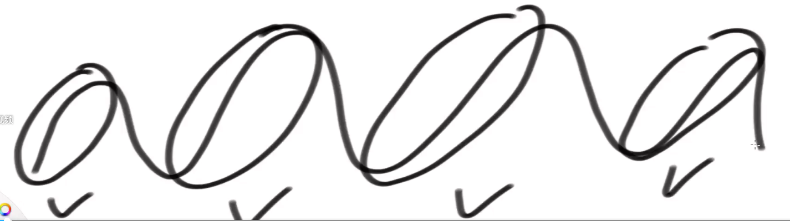
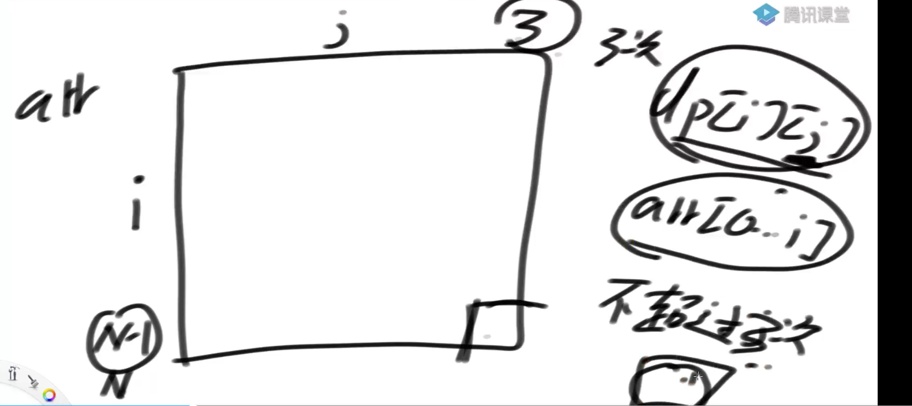
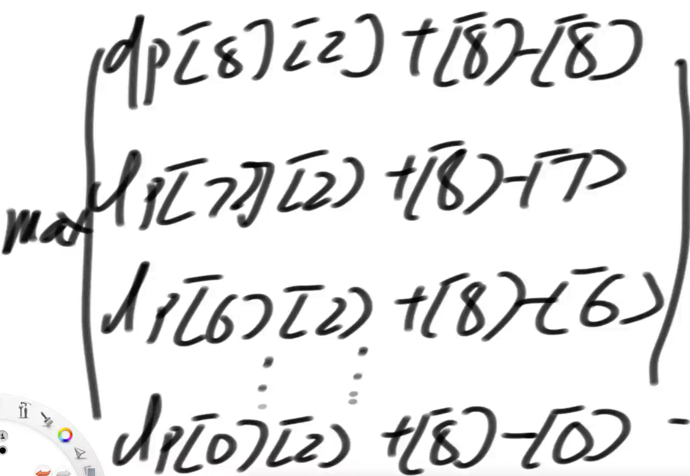
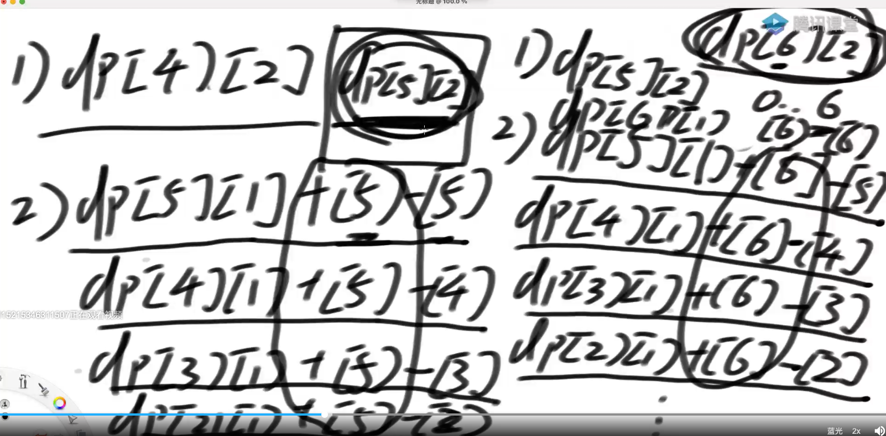

# 股票买卖问题

## 股票买卖1

https://leetcode-cn.com/problems/best-time-to-buy-and-sell-stock/

给定一个数组 prices ，它的第 i 个元素 prices[i] 表示一支给定股票第 i 天的价格。

你只能选择 某一天 买入这只股票，并选择在 未来的某一个不同的日子 卖出该股票。设计一个算法来计算你所能获取的最大利润。

返回你可以从这笔交易中获取的最大利润。如果你不能获取任何利润，返回 0 。

``` java
public static int maxProfit(int[] prices) {
		if (prices == null || prices.length == 0) {
			return 0;
		}
		// 必须在0时刻卖掉，[0] - [0]
		int ans = 0;
		// arr[0...0]
		int min = prices[0];
		for (int i = 1; i < prices.length; i++) {
			min = Math.min(min, prices[i]);
      // 有可能是负数，所以一开始要和0比大小，如果小于零则最大值是0
			ans = Math.max(ans, prices[i] - min);
		}
		return ans;
	}
```

## 股票买卖2

给定一个数组 prices ，其中 prices[i] 是一支给定股票第 i 天的价格。

设计一个算法来计算你所能获取的最大利润。你可以尽可能地完成更多的交易（多次买卖一支股票）。

注意：你不能同时参与多笔交易（你必须在再次购买前出售掉之前的股票）。
链接：https://leetcode-cn.com/problems/best-time-to-buy-and-sell-stock-ii



每个爬坡计算一次钱

```java
public static int maxProfit(int[] prices) {
   if (prices == null || prices.length == 0) {
      return 0;
   }
   int ans = 0;
   for (int i = 1; i < prices.length; i++) {
           ans += Math.max(prices[i] - prices[i-1], 0);
   }
   return ans;
}
```

## 股票买卖4

给定一个整数数组 prices ，它的第 i 个元素 prices[i] 是一支给定的股票在第 i 天的价格。

设计一个算法来计算你所能获取的最大利润。你最多可以完成 k 笔交易。

注意：你不能同时参与多笔交易（你必须在再次购买前出售掉之前的股票）。

来源：力扣（LeetCode）
链接：https://leetcode-cn.com/problems/best-time-to-buy-and-sell-stock-iv
著作权归领扣网络所有。商业转载请联系官方授权，非商业转载请注明出处。

在2的基础上，增加参数k，交易次数不能超过k次

k如果>= N/2 等同于没有次数限制



dp[i] [j] 的含义，在arr0-i范围上做选择，不超过j次获得的最大利润，返回右下角的值

第一行第一列的值都是0

普遍位置：

比如dp[8] [3]

1） 当前位置8不参与 = dp[7] [3]

2）8参与



​	8位置买，8位置卖，最后一次操作收益为0，说明= dp[8] [2] + 0

​	一值累计到dp[0] [2] + [8] - [0]

**疑问**

为什么dp[6] [2] + [8] - [6] 不算 dp[6] [2] + [8] - [7] 因为 dp[7] [2] 肯定大于等于dp[6] [2]，所以dp[7] [2] + [8] - [7]必然大于dp[6] [2] + [8] - [7]，所以计算没有意义 

为什么不算dp[7] [2] + [8] - [6]，6不能买两次，如果6是第一次买，就不符合dp[7] [2] 的含义了

**优化**



只是圈出来的部分不一样，还多了个6-6

圈出来的部分不加，求出max值后再加上5

dp[5] [2] 能够简便dp [6] [2]的值

所以从上往下填

```java
public static int allTrans(int[] prices) {
		int ans = 0;
		for (int i = 1; i < prices.length; i++) {
			ans += Math.max(prices[i] - prices[i - 1], 0);
		}
		return ans;
	}


// 课上写的版本，对了
public static int maxProfit2(int K, int[] arr) {
   if (arr == null || arr.length == 0 || K < 1) {
      return 0;
   }
   int N = arr.length;
   if (K >= N / 2) {
      return allTrans(arr);
   }
   int[][] dp = new int[N][K + 1];
   // dp[...][0] = 0
   // dp[0][...] = arr[0.0] 0
   for (int j = 1; j <= K; j++) {
      // dp[1][j]
      int p1 = dp[0][j];
      int best = Math.max(dp[1][j - 1] - arr[1], dp[0][j - 1] - arr[0]);
      dp[1][j] = Math.max(p1, best + arr[1]);
      // dp[1][j] 准备好一些枚举，接下来准备好的枚举
      for (int i = 2; i < N; i++) {
         p1 = dp[i - 1][j];
         // 专属多出来的，比如上边的dp[6][1] + 6-6
         int newP = dp[i][j - 1] - arr[i];
         best = Math.max(newP, best);
         dp[i][j] = Math.max(p1, best + arr[i]);
      }
   }
   return dp[N - 1][K];
}
```

## 股票买卖3

4基础上 k = 2

## 股票买卖5冷冻期

给定一个整数数组，其中第 i 个元素代表了第 i 天的股票价格 。

设计一个算法计算出最大利润。在满足以下约束条件下，你可以尽可能地完成更多的交易（多次买卖一支股票）:

你不能同时参与多笔交易（你必须在再次购买前出售掉之前的股票）。
卖出股票后，你无法在第二天买入股票 (即冷冻期为 1 天)。

来源：力扣（LeetCode）
链接：https://leetcode-cn.com/problems/best-time-to-buy-and-sell-stock-with-cooldown
著作权归领扣网络所有。商业转载请联系官方授权，非商业转载请注明出处。

```java
// 最优尝试如下：
// buy[i] : 在0...i范围上，最后一次操作是buy动作，
// 这最后一次操作有可能发生在i位置，也可能发生在i之前
// buy[i]值的含义是：max{ 所有可能性[之前交易获得的最大收益 - 最后buy动作的收购价格] }
// 比如：arr[0...i]假设为[1,3,4,6,2,7,1...i之后的数字不用管]
// 什么叫，所有可能性[之前交易获得的最大收益 - 最后buy动作的收购价格]？
// 比如其中一种可能性：
// 假设最后一次buy动作发生在2这个数的时候，那么之前的交易只能在[1,3,4]上结束，因为6要cooldown的，
// 此时最大收益是多少呢？是4-1==3。那么，之前交易获得的最大收益 - 最后buy动作的收购价格 = 3 - 2 = 1
// 另一种可能性：
// 再比如最后一次buy动作发生在最后的1这个数的时候，那么之前的交易只能在[1,3,4,6,2]上发生，因为7要cooldown的，
// 此时最大收益是多少呢？是6-1==5。那么，之前交易获得的最大收益 - 最后buy动作的收购价格 = 5 - 1 = 4
// 除了上面两种可能性之外，还有很多可能性，你可以假设每个数字都是最后buy动作的时候，
// 所有可能性中，(之前交易获得的最大收益 - 最后buy动作的收购价格)的最大值，就是buy[i]的含义
// 为啥buy[i]要算之前的最大收益 - 最后一次收购价格？尤其是最后为什么要减这么一下？
// 因为这样一来，当你之后以X价格做成一笔交易的时候，当前最好的总收益直接就是 X + buy[i]了
//
// sell[i] :0...i范围上，最后一次操作是sell动作，这最后一次操作有可能发生在i位置，也可能发生在之前
// sell[i]值的含义：0...i范围上，最后一次动作是sell的情况下，最好的收益
//
// 于是通过分析，能得到以下的转移方程：
// buy[i] = Math.max(buy[i - 1], sell[i - 2] - prices[i])


// 如果i位置没有发生buy行为，说明有没有i位置都一样，那么buy[i] = buy[i-1]，这显而易见
// 如果i位置发生了buy行为, 那么buy[i] = sell[i - 2] - prices[i]，
// 因为你想在i位置买的话，你必须保证之前交易行为发生在0...i-2上，
// 因为如果i-1位置有可能参与交易的话，i位置就要cooldown了，
// 而且之前交易行为必须以sell结束，你才能buy，而且要保证之前交易尽可能得到最好的利润，
// 这正好是sell[i - 2]所代表的含义，并且根据buy[i]的定义，最后一定要 - prices[i]
//
// sell[i] = Math.max(sell[i - 1], buy[i - 1] + prices[i])
// 如果i位置没有发生sell行为，那么sell[i] = sell[i-1]，这显而易见
// 如果i位置发生了sell行为，那么我们一定要找到 {之前获得尽可能好的收益 - 最后一次的收购价格尽可能低}，
// 而这正好是buy[i - 1]的含义！之前所有的"尽可能"中，最好的一个！
public static int maxProfit2(int[] prices) {
   if (prices.length < 2) {
      return 0;
   }
   int N = prices.length;
   int[] buy = new int[N];
   int[] sell = new int[N];
   // buy[0] 不需要设置  buy[0] = -prices[0] 只有一个元素只能买
   // sell[0] = 0 buy[0] + prices[0];
   buy[1] = Math.max(-prices[0], -prices[1]);
   sell[1] = Math.max(0, prices[1] - prices[0]);
   for (int i = 2; i < N; i++) {
      buy[i] = Math.max(buy[i - 1], sell[i - 2] - prices[i]);
      sell[i] = Math.max(sell[i - 1], buy[i - 1] + prices[i]);
   }
   return sell[N - 1];
}

// 最优解就是方法2的空间优化而已
public static int maxProfit3(int[] prices) {
   if (prices.length < 2) {
      return 0;
   }
   int buy1 = Math.max(-prices[0], -prices[1]);
   int sell1 = Math.max(0, prices[1] - prices[0]);
   int sell2 = 0;
   for (int i = 2; i < prices.length; i++) {
      int tmp = sell1;
      sell1 = Math.max(sell1, buy1 + prices[i]);
      buy1 = Math.max(buy1, sell2 - prices[i]);
      sell2 = tmp;
   }
   return sell1;
}
```

## 股票买卖6

给定一个整数数组 prices，其中第 i 个元素代表了第 i 天的股票价格 ；整数 fee 代表了交易股票的手续费用。

你可以无限次地完成交易，但是你每笔交易都需要付手续费。如果你已经购买了一个股票，在卖出它之前你就不能再继续购买股票了。

返回获得利润的最大值。

注意：这里的一笔交易指买入持有并卖出股票的整个过程，每笔交易你只需要为支付一次手续费。

来源：力扣（LeetCode）
链接：https://leetcode-cn.com/problems/best-time-to-buy-and-sell-stock-with-transaction-fee
著作权归领扣网络所有。商业转载请联系官方授权，非商业转载请注明出处。

```java
public static int maxProfit(int[] arr, int fee) {
   if (arr == null || arr.length < 2) {
      return 0;
   }
   int N = arr.length;
   // 0..0   0 -[0] - fee 提前扣fee
   int bestbuy = -arr[0] - fee;
   // 0..0  卖  0
   int bestsell = 0;
   for (int i = 1; i < N; i++) {
      // 来到i位置了！
      // 如果在i必须买  收入 - 批发价 - fee
      int curbuy = bestsell - arr[i] - fee;
      // 如果在i必须卖  整体最优（收入 - 良好批发价 - fee）
      int cursell = bestbuy + arr[i];
      bestbuy = Math.max(bestbuy, curbuy);
      bestsell = Math.max(bestsell, cursell);
   }
   return bestsell;
}
```
