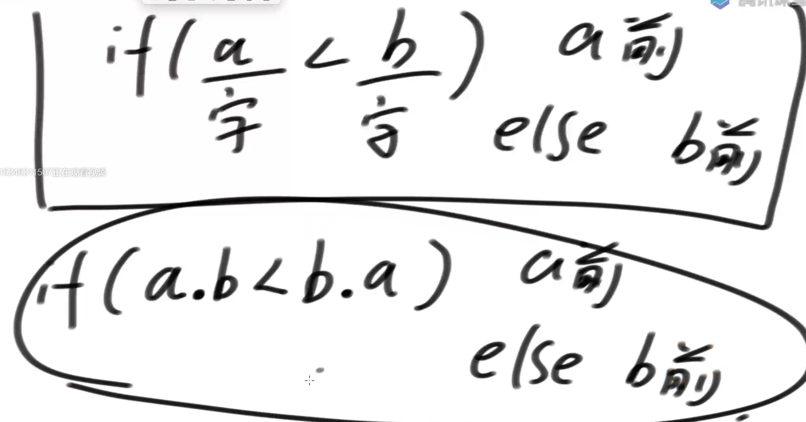

# 贪心算法

**面试几乎没有，都在笔试**

1. 面试区分度不够
2. 考验不来coding能力

**从头到尾讲一道利用贪心算法求解的题目**

给定一个由字符串组成的数组strs，['ABC','D','FT']

必须把所有的字符串拼接起来，拼接顺序随意

返回所有可能的拼接结果中，字典序最小的结果

字典序：’abcd‘和‘b’位数不足后面补0，‘abcd’<'b000'

假设strs = ['b','ba']

**贪心**：bba

**反例**: bab<bba 贪心失败

**正确贪心**



## **贪心方法论**

假设贪心策略和暴力方法（对数器做对比）

```java
//贪心
public static class MyComparator implements Comparator<String> {
   @Override
   public int compare(String a, String b) {
      return (a + b).compareTo(b + a);
   }
}

public static String lowestString2(String[] strs) {
   if (strs == null || strs.length == 0) {
      return "";
   }
   Arrays.sort(strs, new MyComparator());
   String res = "";
   for (int i = 0; i < strs.length; i++) {
      res += strs[i];
   }
   return res;
}
```

```java
//暴力递归
public static String lowestString1(String[] strs) {
   if (strs == null || strs.length == 0) {
      return "";
   }
   ArrayList<String> all = new ArrayList<>();
   HashSet<Integer> use = new HashSet<>();
   process(strs, use, "", all);
   String lowest = all.get(0);
   for (int i = 1; i < all.size(); i++) {
      if (all.get(i).compareTo(lowest) < 0) {
         lowest = all.get(i);
      }
   }
   return lowest;
}

// strs里放着所有的字符串
// 已经使用过的字符串的下标，在use里登记了，不要再使用了
// 之前使用过的字符串，拼接成了-> path
// 用all收集所有可能的拼接结果
public static void process(String[] strs, HashSet<Integer> use, String path, ArrayList<String> all) {
   if (use.size() == strs.length) {
      all.add(path);
   } else {
      for (int i = 0; i < strs.length; i++) {
         if (!use.contains(i)) {
            use.add(i);
            process(strs, use, path + strs[i], all);
            use.remove(i);
         }
      }
   }
}
```

## 贪心算法的解题套路实战

一些项目要占用一个会议室宣讲，会议室不能同时容纳两个项目的宣讲。

给你每一个项目开始的时间和结束的时间

你来安排宣讲的日程，要求会议室进行的宣讲的场次最多。每个项目的数据都有开始和结束

返回最多的宣讲场次。 

1. 第一种贪心，选开始时间最小的

   反例[1,100000],[2,3],[3,5],明显选后两个最优解

2. 选会议持续时间最短的

   反例[1,100]，[100，101]，[101,200],显然选择1，3最优解

3. 选择结束时间最早的 最优解

```java


   public static class Program {
      public int start;
      public int end;

      public Program(int start, int end) {
         this.start = start;
         this.end = end;
      }
   }

   public static int bestArrange1(Program[] programs) {
      if (programs == null || programs.length == 0) {
         return 0;
      }
      return process(programs, 0, 0);
   }
   // b
   // 还剩什么会议都放在programs里
   // done 之前已经安排了多少会议，数量
   // timeLine目前来到的时间点是什么
   
   // 目前来到timeLine的时间点，已经安排了done多的会议，剩下的会议programs可以自由安排
   // 返回能安排的最多会议数量
   public static int process(Program[] programs, int done, int timeLine) {
      if (programs.length == 0) {
         return done;
      }
      // 还有会议可以选择
      int max = done;
      // 当前安排的会议是什么会，每一个都枚举
      for (int i = 0; i < programs.length; i++) {
         if (programs[i].start >= timeLine) {
            Program[] next = copyButExcept(programs, i);
            max = Math.max(max, process(next, done + 1, programs[i].end));
         }
      }
      return max;
   }

   public static Program[] copyButExcept(Program[] programs, int i) {
      Program[] ans = new Program[programs.length - 1];
      int index = 0;
      for (int k = 0; k < programs.length; k++) {
         if (k != i) {
            ans[index++] = programs[k];
         }
      }
      return ans;
   }
   // 贪心
   public static int bestArrange2(Program[] programs) {
      Arrays.sort(programs, new ProgramComparator());
      int timeLine = 0;
      int result = 0;
      for (int i = 0; i < programs.length; i++) {
         if (timeLine <= programs[i].start) {
            result++;
            timeLine = programs[i].end;
         }
      }
      return result;
   }

   public static class ProgramComparator implements Comparator<Program> {

      @Override
      public int compare(Program o1, Program o2) {
         return o1.end - o2.end;
      }

   }
```

---

一块金条切成两半，是需要花费和长度数值一样的铜板的。

比如长度为20的金条，不管怎么切，都要花费20个铜板。 一群人想整分整块金条，怎么分最省铜板?


例如,给定数组{10,20,30}，代表一共三个人，整块金条长度为60，金条要分成10，20，30三个部分。


如果先把长度60的金条分成10和50，花费60; 再把长度50的金条分成20和30，花费50;一共花费110铜板。

但如果先把长度60的金条分成30和30，花费60;再把长度30金条分成10和20， 花费30;一共花费90铜板。


 输入一个数组，返回分割的最小代价。 

1. 每次切最大的 

   反例 97 98 98 100 最优解是97+98 | 100+99 不是 97+98+99 | 100

2. 哈夫曼编码 代价是所有圆圈之和

```java
public static int lessMoney2(int[] arr) {
   PriorityQueue<Integer> pQ = new PriorityQueue<>();
   for (int i = 0; i < arr.length; i++) {
      pQ.add(arr[i]);
   }
   int sum = 0;
   int cur = 0;
   while (pQ.size() > 1) {
      cur = pQ.poll() + pQ.poll();
      sum += cur;
      pQ.add(cur);
   }
   return sum;
}
```

```java
// 暴力
public static int lessMoney1(int[] arr) {
   if (arr == null || arr.length == 0) {
      return 0;
   }
   return process(arr, 0);
}

public static int process(int[] arr, int pre) {
   if (arr.length == 1) {
      return pre;
   }
   int ans = Integer.MAX_VALUE;
   for (int i = 0; i < arr.length; i++) {
      for (int j = i + 1; j < arr.length; j++) {
         ans = Math.min(ans, process(copyAndMergeTwo(arr, i, j), pre + arr[i] + arr[j]));
      }
   }
   return ans;
}

public static int[] copyAndMergeTwo(int[] arr, int i, int j) {
   int[] ans = new int[arr.length - 1];
   int ansi = 0;
   for (int arri = 0; arri < arr.length; arri++) {
      if (arri != i && arri != j) {
         ans[ansi++] = arr[arri];
      }
   }
   ans[ansi] = arr[i] + arr[j];
   return ans;
}
```

---

输入: 正数数组costs、正数数组profits、正数K、正数M


 costs[i]表示i号项目的花费

profits[i]表示i号项目在扣除花费之后还能挣到的钱(利润)

K表示你只能串行的最多做k个项目

M表示你初始的资金

说明: 每做完一个项目，马上获得的收益，可以支持你去做下一个项目。不能并行的做项目。

输出：你最后获得的最大钱数。 


建立两个堆，小根堆（花费），大根堆（利润）

每次，从小根堆弹出付得起的进大根堆，然后弹出大根堆做项目，周而复始

```java
public static int findMaximizedCapital(int K, int W, int[] Profits, int[] Capital) {
   PriorityQueue<Program> minCostQ = new PriorityQueue<>(new MinCostComparator());
   PriorityQueue<Program> maxProfitQ = new PriorityQueue<>(new MaxProfitComparator());
   for (int i = 0; i < Profits.length; i++) {
      minCostQ.add(new Program(Profits[i], Capital[i]));
   }
   for (int i = 0; i < K; i++) {
      while (!minCostQ.isEmpty() && minCostQ.peek().c <= W) {
         maxProfitQ.add(minCostQ.poll());
      }
      if (maxProfitQ.isEmpty()) {
         return W;
      }
      W += maxProfitQ.poll().p;
   }
   return W;
}

public static class Program {
   public int p;
   public int c;

   public Program(int p, int c) {
      this.p = p;
      this.c = c;
   }
}

public static class MinCostComparator implements Comparator<Program> {

   @Override
   public int compare(Program o1, Program o2) {
      return o1.c - o2.c;
   }

}

public static class MaxProfitComparator implements Comparator<Program> {

   @Override
   public int compare(Program o1, Program o2) {
      return o2.p - o1.p;
   }

}
```

---

给定一个字符串str，只由‘X’和‘.’两种字符构成。

‘X’表示墙，不能放灯，也不需要点亮

‘.’表示居民点，可以放灯，需要点亮

如果灯放在i位置，可以让i-1，i和i+1三个位置被点亮

返回如果点亮str中所有需要点亮的位置，至少需要几盏灯

1. i=x时去i+1位置放灯，i的位置如果是点，i+1是X，去i放灯，再考虑i+2，如果i+1是点i+2是x，去i+1放灯去i+3考虑，如果i+1，i+2都是点，去i+1放灯，考虑i+3

```java
public static int minLight2(String road) {
   char[] str = road.toCharArray();
   int index = 0;
   int light = 0;
   while (index < str.length) {
      if (str[index] == 'X') {
         index++;
      } else { // i -> .
         light++;
         if (index + 1 == str.length) {
            break;
         } else {
            if (str[index + 1] == 'X') {
               index = index + 2;
            } else {
               index = index + 3;
            }
         }
      }
   }
   return light;
}
```