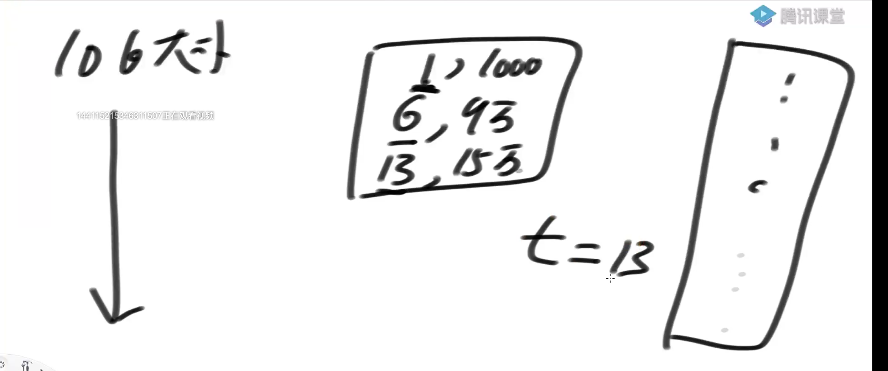

# 资源限制类题目

1）布隆过滤器用于集合的建立与查询，并可以节省大量空间（已讲）

2）一致性哈希解决数据服务器的负载管理问题（已讲）

3）利用并查集结构做岛问题的并行计算（已讲）

4）哈希函数可以把数据按照种类均匀分流

5）位图解决某一范围上数字的出现情况，并可以节省大量空间

6）利用分段统计思想、并进一步节省大量空间

7）利用堆、外排序来做多个处理单元的结果合并

## 题目一

32位无符号整数的范围是0~4,294,967,295，

现在有一个正好包含40亿个无符号整数的文件，

可以使用最多1GB的内存，怎么找到出现次数最多的数？

---

全数组存下来：40亿 * 4（int）= 160亿 = 16* 10 ^ 9 = 16GB **不行**

使用哈希表：

假设40亿都是1，只需要一条记录，key，value（出现的个数）各4B，一共8B

假设40亿个数都不一样，40亿* 8 = 32G **不行**

假设使用1G哈希表只能装下1千万条记录（数的种类）

40亿个数 / 一千万 = 400 模

哈希表的均匀性，每个文件都不会超过1千万种数，同一种数字只会进一个文件

模后会生成400个文件（占磁盘空间不占内存），每个文件求出No.1，用完释放掉再求下一个

## 题目二

32位无符号整数的范围是0~4,294,967,295，

现在有一个正好包含40亿个无符号整数的文件，

所以在整个范围中必然存在没出现过的数。

可以使用最多1GB的内存，怎么找到所有未出现过的数？

---

使用bit数组，0-2^ 32比特数组，所占字节为之前的1/8，肯定小于1GB

/ 表示第i位在数组中第几位取

%表示在第i/32位中的第几位

1向左移动i%32位（这位移动完肯定是1），如果当前位是1，则&时候会有两个1 为1，其余都是0表示当前位一定是0

遍历一遍出现的标1，没有出现的是0

【进阶】

内存限制为 3KB，但是只用找到一个没出现过的数即可？

---

需要int数组大小 3000B / 4 = 750

寻找距离750最近的2的次方 512，申请这么长数组不会暴掉

把整个范围2^ 32均分成512份，每份8388608这么大，int肯定够了

统计每一份出现的次数（位图描黑），肯定有一个范围不够8388608，范围多、数字少

找到范围大于小于限制，继续分512，不断分知道找到没出现的数

## 题目三

有一个包含100亿个URL的大文件，假设每个URL占用64B，

请找出其中所有重复的URL

---

有失误率的方法：布隆过滤器

如果不行，使用哈希函数

不断哈希函数分成小文件，检查每个小文件中是否有重复的url，重复的url会被分配到同一个小文件中

【补充】

某搜索公司一天的用户搜索词汇是海量的(百亿数据量)，

请设计一种求出每天热门Top100词汇的可行办法

---

哈希分成不同的小文件，每个小文件选出前100名，

然后使用外部排序

或者每个小文件组成一个大根堆，每个大根堆的堆定元素再组成一个大根堆，弹出第一名后，将第一名所在的大根堆的第二名假如堆中，重新调整为大根堆，弹出第二名

## 题目四

32位无符号整数的范围是0~4294967295，

现在有40亿个无符号整数，

可以使用最多1GB的内存，

找出所有出现了两次的数。

---

用两位表示出现的次数，三次以上都是11，在题目1的基础上，还不够使用分段统计，全部遍历一遍找到10的就是出现两次的

## 题目五

32位无符号整数的范围是0~4294967295，现在有40亿个无符号整数

可以使用最多3K的内存，怎么找到这40亿个整数的中位数？

---

3k还是分成512份，申请数组，统计每个范围出现的个数

40亿数找到第20亿数就是中位数

从第一个范围一直累加，直到找到20亿数左右的范围，中位数一定在这个范围中

## 题目六

32位无符号整数的范围是0~4294967295，

有一个10G大小的文件，每一行都装着这种类型的数字，

整个文件是无序的，给你5G的内存空间，

请你输出一个10G大小的文件，就是原文件所有数字排序的结果

---

使用大根堆

假设堆的大小是只能存3条记录

遇到4的时候淘汰掉堆中最大的值9，相同值只更新value

1，写入文件1000次，6写9万词，13写15万次，清空大根堆，用t记录文件写入的位置

再遍历一遍10G大小的文件小于等于13的碰都不碰

循环结束的条件发现，文件读完了，堆没有满

现在是5G空间，可以算出5G空间能达到的最大的结构，不一定是3

