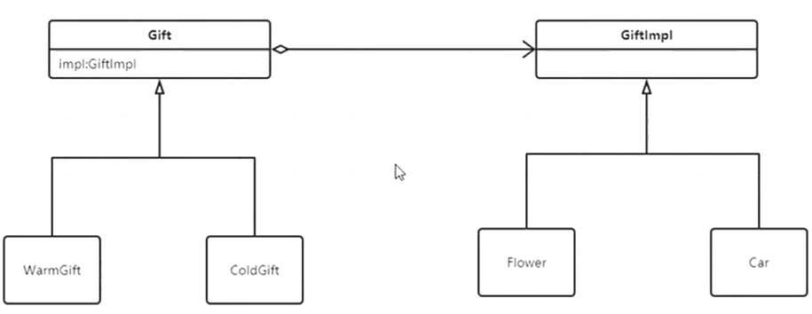

# Bridge

双维度扩展，接口和实现类



```
使用桥接模式：
分离抽象与具体实现，让他们可以独自发展
Gift -> WarmGift ColdGift WildGift
GiftImpl -> Flower Ring Car
```

```java
public class GG {
    public void chase(MM mm) {
        Gift g = new WarmGift(new Flower());
        give(mm, g);
    }

    public void give(MM mm, Gift g) {
        System.out.println(g + "gived!");
    }

}
```

```java
public abstract class Gift {
    GiftImpl impl;
}
```

```java
public class GiftImpl {
}
```

```java
public class Flower extends GiftImpl {
}
```

```java
public class Book extends GiftImpl {
}
```

```java
public class WarmGift extends Gift {
    public WarmGift(GiftImpl impl) {
        this.impl = impl;
    }
}
```

```java
public class WildGift extends Gift {
    public WildGift(GiftImpl impl) {
        this.impl = impl;
    }
}
```

