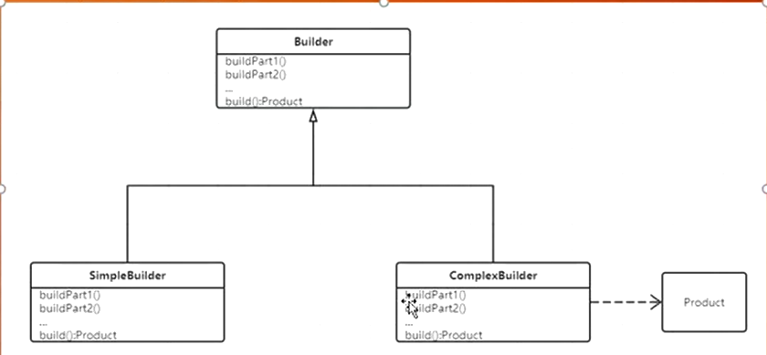

# Builder

构建复杂方式



地形类

```java
public class Terrain {
    Wall w;
    Fort f;
    Mine m;
}

class Wall {
    int x, y, w, h;

    public Wall(int x, int y, int w, int h) {
        this.x = x;
        this.y = y;
        this.w = w;
        this.h = h;
    }
}

class Fort {
    int x, y, w, h;

    public Fort(int x, int y, int w, int h) {
        this.x = x;
        this.y = y;
        this.w = w;
        this.h = h;
    }

}

class Mine {
    int x, y, w, h;

    public Mine(int x, int y, int w, int h) {
        this.x = x;
        this.y = y;
        this.w = w;
        this.h = h;
    }
}
```

构造器接口

```java
public interface TerrainBuilder {
    TerrainBuilder buildWall();

    TerrainBuilder buildFort();

    TerrainBuilder buildMine();

    Terrain build();
}
```

实现类

```java
public class ComplexTerrainBuilder implements TerrainBuilder {
    Terrain terrain = new Terrain();

    @Override
    public TerrainBuilder buildWall() {
        terrain.w = new Wall(10, 10, 50, 50);
        return this;
    }

    @Override
    public TerrainBuilder buildFort() {
        terrain.f = new Fort(10, 10, 50, 50);
        return this;
    }

    @Override
    public TerrainBuilder buildMine() {
        terrain.m = new Mine(10, 10, 50, 50);
        return this;
    }

    @Override
    public Terrain build() {
        return terrain;
    }
}
```

main

```java
public class Main {
    public static void main(String[] args) {
        TerrainBuilder builder = new ComplexTerrainBuilder();
        Terrain t = builder.buildFort().buildMine().buildWall().build();
        //new Terrain(Wall w, Fort f, Mine m)
        //Effective Java

        Person p = new Person.PersonBuilder()
                .basicInfo(1, "zhangsan", 18)
                //.score(20)
                .weight(200)
                //.loc("bj", "23") 不需要就注掉灵活使用，不用穿空
                .build();
    }
}
```

Person复杂类多个属性

```java
public class Person {
    int id;
    String name;
    int age;
    double weight;
    int score;
    Location loc;

    private Person() {
    }

    public static class PersonBuilder {
        Person p = new Person();

        public PersonBuilder basicInfo(int id, String name, int age) {
            p.id = id;
            p.name = name;
            p.age = age;
            return this;
        }

        public PersonBuilder weight(double weight) {
            p.weight = weight;
            return this;
        }

        public PersonBuilder score(int score) {
            p.score = score;
            return this;
        }

        public PersonBuilder loc(String street, String roomNo) {
            p.loc = new Location(street, roomNo);
            return this;
        }

        public Person build() {
            return p;
        }
    }
}

class Location {
    String street;
    String roomNo;

    public Location(String street, String roomNo) {
        this.street = street;
        this.roomNo = roomNo;
    }
}
```