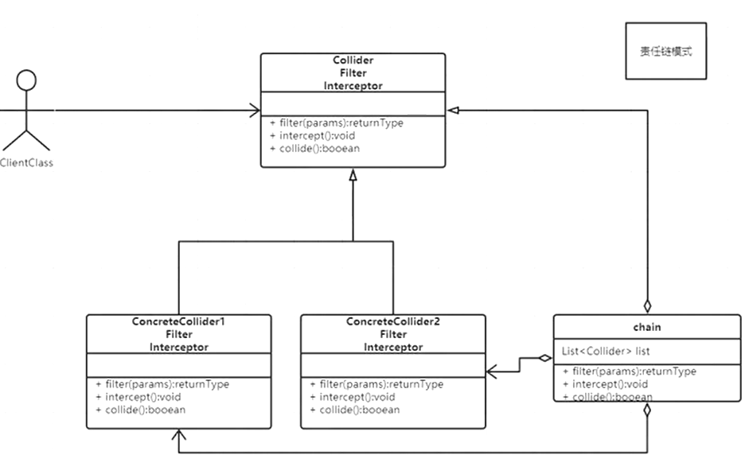

# ChainOfResponsibility

### Collider接口

```java
public interface Collider {
    void collide(GameObject o1 , GameObject o2);
}
```

### 具体实现1

```java
public class TankTankCollider implements Collider{
    @Override
    public void collide(GameObject o1, GameObject o2) {
        if (o1 instanceof Tank && o2 instanceof Tank){
            Tank t1 = (Tank) o1;
            Tank t2 = (Tank) o2;
            if (t1.group == Group.GOOD || t2.group ==Group.GOOD)
            {
                return;
            }
            if (t1.getRect().intersects(t2.getRect())){
               // System.out.println(13434);
               // t1.stop();
                //t2.stop();
            }
        }else{
            return;
        }
    }

}
```

### 具体实现2

```java
public class BulletTankCollider implements Collider{
    @Override
    public void collide(GameObject o1, GameObject o2) {
        if (o1 instanceof Bullet && o2 instanceof Tank){
            Bullet b = (Bullet) o1;
            Tank t = (Tank) o2;
            collideWith(b,t);
        }else if (o1 instanceof Tank && o2 instanceof Bullet){
            collide(o2,o1);
        }else{
            return;
        }
    }
    public void collideWith(Bullet b,Tank t) {
        if(t.group == b.getGroup()) {
            return;
        }

        if(b.rect.intersects(t.rect)) {
            b.die();
            t.die();
            int eX = t.getX() + Tank.WIDTH/2 - Explode.WIDTH/2;
            int eY = t.getY() + Tank.HEIGHT/2 - Explode.HEIGHT/2;
            t.gm.add(new Explode(eX, eY, t.gm));
        }

    }
}
```

### 责任链

```java
public class ColliderChain  implements Collider{
    private List<Collider> colliders = new LinkedList<>();

    public ColliderChain(){
        add(new BulletTankCollider());
        add(new TankTankCollider());
    }

    public void add(Collider c){
        colliders.add(c);
    }

    public void collide(GameObject o1, GameObject o2) {
        for (int i = 0; i <colliders.size() ; i++) {
            colliders.get(i).collide(o1,o2);
        }
    }
}
```

责任链也实现了接口，可以将责任链串在一起

### 调用GameModel

```java
for (int i = 0; i <objects.size() ; i++) {
   for (int j = 0; j < objects.size(); j++) {
      GameObject o1 = objects.get(i);
      GameObject o2 = objects.get(j);
      chain.collide(o1,o2);
   }
}
```

